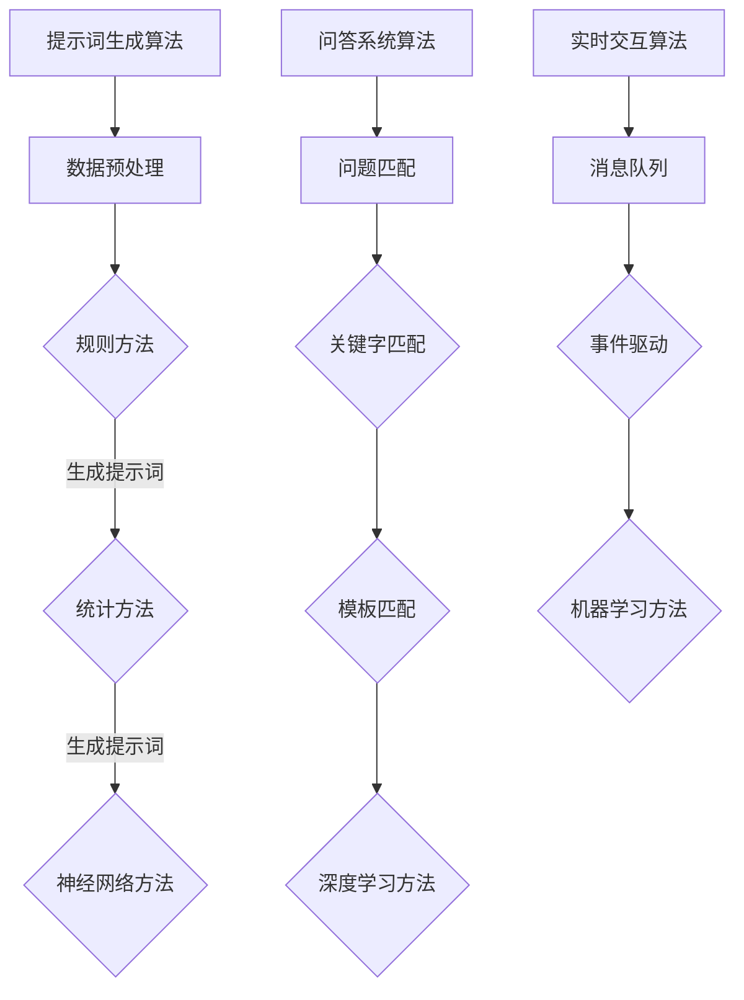
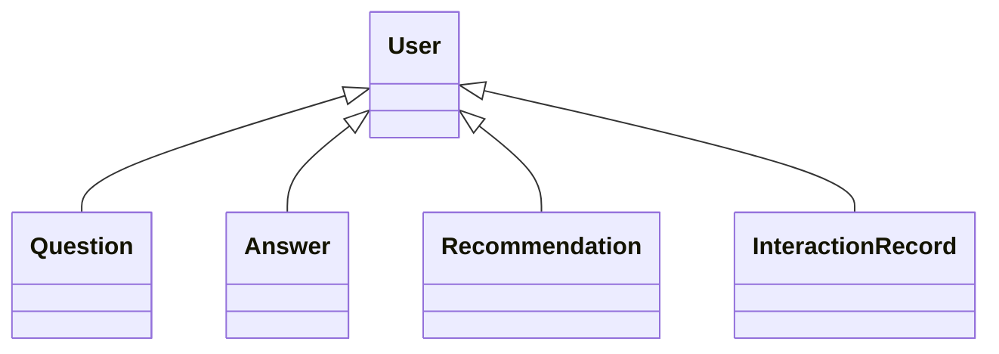
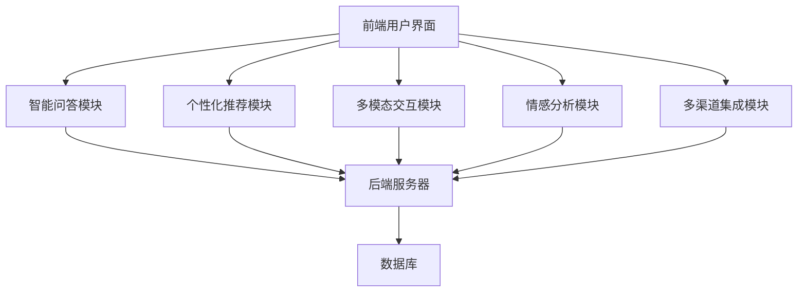
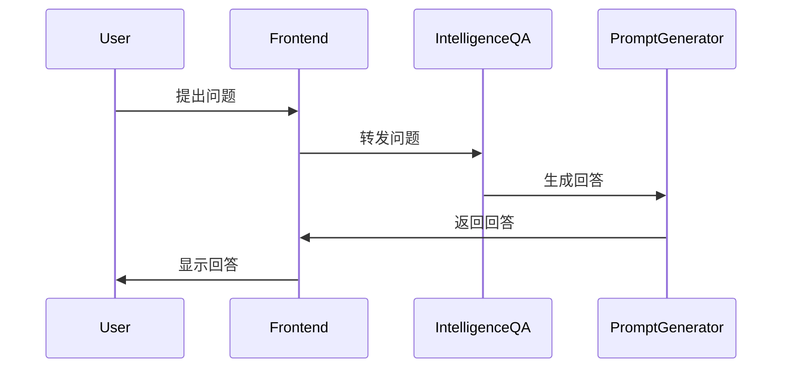
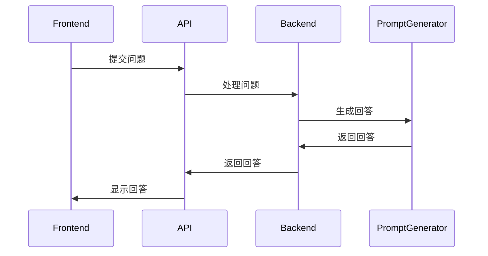
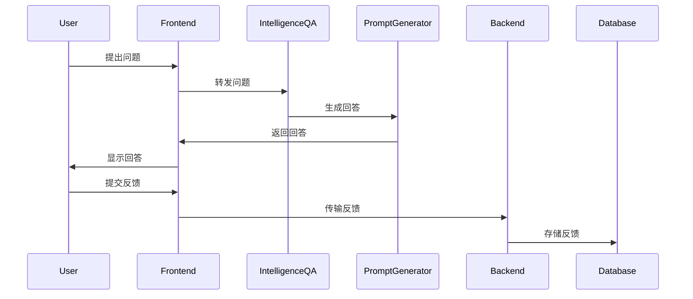

                 

### 引言

#### 标题：智慧服务时代的提示词工程

**关键词**：智能客户服务，提示词工程，用户体验，满意度，人工智能

**摘要**：随着人工智能技术的飞速发展，智能客户服务正逐渐成为现代企业的核心竞争力之一。在这场技术变革中，提示词工程发挥着至关重要的作用。本文旨在探讨提示词工程在智能客户服务中的应用，通过深入分析其核心概念、原理与方法，以及实际应用案例，旨在为读者提供一份系统而全面的指南，以提升用户体验和满意度。

在当今高度数字化的商业环境中，客户服务的重要性不言而喻。传统的客户服务模式已经难以满足用户日益增长的需求和期望，尤其是在处理复杂问题和提供个性化服务方面。为了应对这一挑战，企业开始探索智能客户服务的可能性，而提示词工程则是实现这一目标的关键技术之一。

### 第1章 背景与概述

#### 1.1 问题背景

在介绍提示词工程在智能客户服务中的应用之前，我们需要了解当前客户服务所面临的挑战和现状。现代客户服务正面临着以下几个关键问题：

- **高运营成本**：传统客户服务往往依赖于人力，这意味着高昂的成本和资源的浪费。
- **响应时间慢**：客户问题往往需要长时间的处理和回复，导致客户等待时间过长。
- **服务质量不稳定**：由于依赖人工处理，服务质量往往受个人经验和情绪的影响，导致不一致的服务体验。
- **个性化服务不足**：大多数客户服务系统难以提供个性化的服务，无法满足客户的个性化需求。

为了解决这些问题，企业开始寻求智能化的解决方案，特别是基于人工智能的智能客户服务系统。智能客户服务系统可以利用人工智能技术，如自然语言处理（NLP）、机器学习（ML）和深度学习（DL），实现自动化的客户交互和问题解决。

#### 1.1.1 客户服务的现状与挑战

当前，客户服务的现状可以概括为以下几个方面：

- **自动化水平较低**：大多数客户服务仍然依赖于人工处理，自动化程度较低。
- **服务水平参差不齐**：由于缺乏统一的处理标准和流程，不同客户的服务体验差异较大。
- **数据处理能力有限**：传统客户服务系统难以高效地处理大量数据，导致数据分析和应用受限。
- **用户满意度不高**：根据相关调查，很多客户对当前客户服务的满意度较低，认为其响应速度慢、服务质量不高。

#### 1.1.2 智能化客户服务的需求

为了克服传统客户服务的局限性，企业对智能化客户服务产生了强烈的需求，主要体现在以下几个方面：

- **自动化程度高**：通过人工智能技术，实现自动化客户交互和问题解决，提高运营效率和响应速度。
- **个性化服务**：利用用户数据和行为分析，提供个性化的服务和建议，提升用户满意度。
- **高质量服务**：通过智能算法和自动化流程，确保服务的一致性和高质量。
- **数据驱动的决策**：通过数据分析和挖掘，支持企业做出更明智的决策。

#### 1.1.3 提示词工程的核心概念

提示词工程是智能客户服务的关键技术之一，它涉及以下几个方面：

- **自然语言处理（NLP）**：用于理解和生成自然语言文本，是智能客户服务的基础。
- **语言模型**：用于预测和生成文本，是提示词生成的核心组件。
- **机器学习和深度学习**：用于训练和优化语言模型，提高提示词的生成质量和效果。
- **提示词生成算法**：用于生成针对特定场景的提示词，是实现个性化服务和高效交互的关键。

#### 1.2 问题描述

在智能客户服务中，提示词工程面临以下主要问题：

- **如何生成高质量、个性化的提示词**：提示词的质量直接影响用户体验，需要解决生成算法的优化问题。
- **如何处理复杂问题和多模态交互**：在处理复杂问题和多模态交互时，提示词工程需要具备较高的灵活性和适应性。
- **如何确保提示词的准确性和一致性**：在大量数据和不同场景中，提示词工程需要确保提示词的准确性和一致性。
- **如何评估和优化提示词工程的效果**：通过评估和优化，不断提高提示词工程的质量和效果。

#### 1.2.1 客户服务中的痛点

客户服务中的痛点主要体现在以下几个方面：

- **服务质量差**：传统客户服务系统难以提供高质量的服务，导致用户满意度低。
- **响应时间长**：客户问题处理时间长，影响用户体验。
- **个性化不足**：无法提供个性化的服务，无法满足用户的个性化需求。
- **成本高**：传统客户服务依赖人力，成本高且效率低。

#### 1.2.2 提示词工程的目标

提示词工程的目标主要包括以下几个方面：

- **提高服务质量**：通过高质量、个性化的提示词，提升客户服务的整体质量。
- **提高响应速度**：通过自动化和智能化的处理，缩短问题解决时间，提高客户满意度。
- **降低运营成本**：通过自动化处理和智能化分析，降低运营成本，提高企业竞争力。
- **提升用户体验**：通过个性化的服务和高效的交互，提升用户的满意度。

#### 1.2.3 提示词工程在智能客户服务中的应用

提示词工程在智能客户服务中的应用主要体现在以下几个方面：

- **智能问答系统**：通过提示词工程，构建高效的智能问答系统，实现自动化的客户问题解答。
- **个性化推荐**：通过分析用户数据和行为，生成个性化的服务推荐，提高用户体验。
- **实时交互**：通过智能交互算法，实现实时、高效的客户交互，提升服务质量。
- **情感分析**：通过自然语言处理技术，分析用户情感，提供情感化的服务。

#### 1.3 问题解决

针对上述问题，提示词工程提供了一系列解决方案：

- **优化生成算法**：通过改进生成算法，提高提示词的质量和个性化程度。
- **多模态交互**：结合文本、语音、图像等多种模态，实现更丰富的交互体验。
- **数据驱动的优化**：通过数据分析和挖掘，持续优化提示词工程的效果。
- **人机协作**：结合人工智慧和人工智能，实现更高效、更智能的客户服务。

#### 1.4 边界与外延

提示词工程的应用范围非常广泛，不仅限于智能客户服务，还可以应用于其他领域，如智能助手、智能客服机器人、智能教育等。然而，提示词工程也面临一些限制因素，如数据处理能力、算法优化难度等。

#### 1.5 本章小结

本章对智能客户服务和提示词工程进行了概述，分析了当前客户服务所面临的挑战和需求，以及提示词工程在其中的作用。通过本文的介绍，读者可以对提示词工程在智能客户服务中的应用有一个初步的了解，为后续章节的深入探讨打下基础。

### 第2章 核心概念与联系

#### 2.1 核心概念

在深入探讨提示词工程之前，我们需要了解一些核心概念，这些概念是提示词工程的基础，也是理解其工作原理的关键。

##### 2.1.1 自然语言处理（NLP）基础

自然语言处理（NLP）是人工智能领域的一个重要分支，主要研究如何使计算机理解和生成自然语言。NLP的基本任务包括：

- **分词**：将文本拆分成单词或短语。
- **词性标注**：为每个单词或短语标注其词性，如名词、动词、形容词等。
- **命名实体识别**：识别文本中的特定实体，如人名、地名、组织名等。
- **句法分析**：分析句子的结构，包括词组、从句和句子成分等。
- **语义分析**：理解文本的含义，包括词语之间的语义关系和句子层面的语义理解。

##### 2.1.2 语言模型原理

语言模型是NLP中的核心组件，用于预测自然语言中的下一个词或句子。语言模型的工作原理基于统计方法，通过分析大量文本数据，学习语言的规律和模式。常见的语言模型包括：

- **n-gram模型**：基于词的历史序列进行预测，n值表示历史窗口的大小。
- **神经网络语言模型**：使用神经网络结构，特别是深度神经网络，进行文本的建模和预测。
- **递归神经网络（RNN）**：用于处理序列数据，可以捕捉长距离依赖关系。
- **长短时记忆网络（LSTM）**：RNN的一种变体，用于解决RNN的梯度消失问题。
- **变换器（Transformer）**：一种基于自注意力机制的模型，能够高效地处理长序列数据。

##### 2.1.3 提示词设计原则

提示词是在特定场景下生成的关键词或短语，用于引导用户或系统进行特定的操作或交互。设计高质量的提示词需要遵循以下原则：

- **相关性**：提示词应与用户的需求和场景高度相关，能够准确传达意图。
- **简洁性**：提示词应简洁明了，易于理解和记忆。
- **多样性**：提示词应具备多样性，以适应不同的用户和场景。
- **适应性**：提示词应能够根据用户反馈和环境变化进行自适应调整。

#### 2.2 概念属性特征对比

为了更好地理解这些概念，我们可以在下表中对比它们的属性特征：

| 概念            | 属性特征                                                     | 关联关系                                     |
|-----------------|------------------------------------------------------------|--------------------------------------------|
| 自然语言处理（NLP） | 文本分词、词性标注、命名实体识别、句法分析、语义分析           | 提示词生成的基础技术                         |
| 语言模型         | 统计方法、神经网络、递归神经网络、长短时记忆网络、变换器         | 用于预测自然语言中的下一个词或句子           |
| 提示词           | 相关性、简洁性、多样性、适应性                                 | 用于引导用户或系统进行特定操作或交互           |

#### 2.3 ER实体关系图

为了更直观地展示这些概念之间的关系，我们可以使用ER（实体关系）图来描述。以下是ER实体关系图的Mermaid表示：

```mermaid
erDiagram
  NLP --> LanguageModel : 基础技术
  LanguageModel --> Prompt : 生成核心
  NLP --> EntityRecognition : 辅助技术
  Prompt --> UserInteraction : 引导交互
```

在上面的ER图中，NLP（自然语言处理）是基础技术，包括语言模型（LanguageModel）和实体识别（EntityRecognition）等技术。语言模型是提示词（Prompt）生成的核心组件，而提示词则用于引导用户交互（UserInteraction）。通过这样的关系图，我们可以更清晰地理解各个概念在提示词工程中的应用和相互作用。

#### 2.4 本章小结

本章介绍了提示词工程中的核心概念，包括自然语言处理、语言模型和提示词设计原则。同时，通过对比表格和ER实体关系图，我们更深入地理解了这些概念之间的关系。这些核心概念是理解和应用提示词工程的基础，为后续章节的深入探讨提供了必要的背景知识。

### 第3章 算法原理讲解

#### 3.1 算法概述

提示词工程的核心在于生成高质量的提示词，从而实现高效、个性化的客户服务。在这一章中，我们将详细讲解提示词工程的三个主要算法：提示词生成算法、问答系统算法和实时交互算法。这些算法构成了智能客户服务中提示词工程的基本框架，它们分别承担不同的任务，共同实现智能化的客户服务。

##### 3.1.1 提示词生成算法

提示词生成算法是提示词工程的核心，用于根据用户输入或场景信息生成合适的提示词。提示词生成算法主要分为以下几类：

- **基于规则的方法**：通过预定义的规则生成提示词，如正则表达式、语法分析等。这种方法简单直观，但灵活性较差，难以适应复杂多变的应用场景。
- **基于统计的方法**：利用统计模型，如n-gram模型、隐马尔可夫模型（HMM）等，根据历史数据生成提示词。这种方法能够处理一定程度的多样性，但生成结果可能不够精确。
- **基于神经网络的方法**：利用深度学习模型，如循环神经网络（RNN）、长短时记忆网络（LSTM）、变换器（Transformer）等，通过训练大量数据生成高质量的提示词。这种方法具有很高的灵活性和生成质量，但需要大量数据和计算资源。

##### 3.1.2 问答系统算法

问答系统算法用于处理用户的问题，并生成相应的回答。问答系统算法可以分为以下几类：

- **基于关键字匹配的方法**：通过关键词匹配，将用户问题与预定义的答案库进行匹配，生成回答。这种方法简单快捷，但回答的个性化和准确性有限。
- **基于模板匹配的方法**：通过模板匹配，将用户问题与预定义的模板进行匹配，生成回答。这种方法能够提供一定程度的个性化回答，但模板库的构建和维护成本较高。
- **基于深度学习方法的方法**：利用深度学习模型，如循环神经网络（RNN）、长短时记忆网络（LSTM）、变换器（Transformer）等，通过训练大量数据生成个性化的回答。这种方法具有很高的生成质量和灵活性，但需要大量数据和计算资源。

##### 3.1.3 实时交互算法

实时交互算法用于实现与用户的实时、高效交互。实时交互算法可以分为以下几类：

- **基于消息队列的方法**：通过消息队列实现用户与系统的异步通信，确保消息的高效传输和处理。这种方法能够实现高并发的实时交互，但需要复杂的消息处理逻辑。
- **基于事件驱动的方法**：通过事件驱动模型，实现用户与系统的实时响应。这种方法能够提供灵活的交互体验，但需要复杂的上下文管理和事件处理逻辑。
- **基于机器学习的方法**：利用机器学习模型，如循环神经网络（RNN）、长短时记忆网络（LSTM）、变换器（Transformer）等，通过训练大量交互数据，实现智能化的实时交互。这种方法具有很高的生成质量和灵活性，但需要大量数据和计算资源。

#### 3.2 算法流程图

为了更直观地展示这些算法的流程，我们使用Mermaid绘制了以下流程图：



在这个流程图中，A表示提示词生成算法，包括数据预处理、规则方法、统计方法和神经网络方法；F表示问答系统算法，包括问题匹配、关键字匹配、模板匹配和深度学习方法；K表示实时交互算法，包括消息队列、事件驱动和机器学习方法。

#### 3.3 数学模型与公式

##### 3.3.1 语言模型公式

语言模型的核心目标是预测下一个词的概率。以下是几种常见的语言模型公式：

- **n-gram模型**：
  $$P(w_n|w_1, w_2, ..., w_{n-1}) = \frac{C(w_1, w_2, ..., w_n)}{C(w_1, w_2, ..., w_{n-1})}$$
  其中，$C(w_1, w_2, ..., w_n)$ 表示词序列 $(w_1, w_2, ..., w_n)$ 的计数，$C(w_1, w_2, ..., w_{n-1})$ 表示词序列 $(w_1, w_2, ..., w_{n-1})$ 的计数。

- **神经网络语言模型**：
  $$P(w_n|w_1, w_2, ..., w_{n-1}) = \frac{\exp(f(w_1, w_2, ..., w_{n-1}, w_n))}{\sum_{w'\in V} \exp(f(w_1, w_2, ..., w_{n-1}, w'))}$$
  其中，$f(\cdot)$ 表示神经网络模型，$V$ 表示词汇表。

##### 3.3.2 问答系统评估指标

问答系统评估指标用于评估回答的质量和准确性。以下是几种常见的评估指标：

- **准确率（Accuracy）**：
  $$Accuracy = \frac{正确回答的数量}{总回答的数量}$$

- **F1值（F1-score）**：
  $$F1 = 2 \times \frac{Precision \times Recall}{Precision + Recall}$$
  其中，Precision 表示准确率，Recall 表示召回率。

- **BLEU分数（BLEU score）**：
  $$BLEU = \frac{N_1 \times L_1 + N_2 \times L_2}{N_1 + N_2}$$
  其中，$N_1$ 和 $N_2$ 分别表示参考回答和生成回答的匹配词数，$L_1$ 和 $L_2$ 分别表示参考回答和生成回答的长度。

##### 3.3.3 实时交互模型公式

实时交互模型的核心目标是确保交互的高效性和实时性。以下是几种常见的实时交互模型公式：

- **响应时间（Response Time）**：
  $$ResponseTime = \frac{TotalProcessingTime}{NumberOfWorkers}$$
  其中，$TotalProcessingTime$ 表示总处理时间，$NumberOfWorkers$ 表示工作者数量。

- **吞吐量（Throughput）**：
  $$Throughput = \frac{TotalTransactions}{TotalTime}$$
  其中，$TotalTransactions$ 表示总交易数，$TotalTime$ 表示总时间。

#### 3.4 举例说明

##### 3.4.1 提示词生成的实际应用

假设我们有一个电子商务平台，用户在浏览商品时需要搜索特定的商品。为了提升用户体验，我们使用提示词生成算法为用户生成相关的搜索提示词。以下是具体步骤：

1. **数据预处理**：对用户历史搜索数据、商品描述和用户行为数据等进行预处理，提取关键词和特征。
2. **规则方法**：根据预定义的规则，生成基本的搜索提示词，如“相关商品推荐”、“热门搜索”等。
3. **统计方法**：利用n-gram模型，根据用户历史搜索数据生成提示词，如“笔记本电脑”、“平板电脑”等。
4. **神经网络方法**：利用变换器（Transformer）模型，通过训练大量用户搜索数据生成高质量的提示词，如“高性能游戏笔记本”、“轻薄便携笔记本电脑”等。

##### 3.4.2 问答系统的效果评估

为了评估问答系统的效果，我们使用以下评估指标：

- **准确率**：通过比较系统生成的回答与参考回答的匹配度，计算准确率。
- **F1值**：综合考虑准确率和召回率，计算F1值。
- **BLEU分数**：通过比较系统生成的回答与参考回答的BLEU分数，评估回答的相似度。

假设我们对100个问题进行评估，系统生成的回答与参考回答的准确率为90%，F1值为0.85，BLEU分数为0.80。这些评估指标表明，问答系统在生成高质量回答方面表现良好。

##### 3.4.3 实时交互的案例分析

在一个在线教育平台上，我们使用实时交互算法实现教师与学生之间的实时互动。以下是具体步骤：

1. **消息队列**：使用消息队列实现学生提问与教师回答的异步传输，确保消息的高效传输和处理。
2. **事件驱动**：通过事件驱动模型，实现教师与学生之间的实时响应，如教师回答学生提问、学生提交作业等。
3. **机器学习方法**：利用循环神经网络（RNN）模型，通过训练大量交互数据，实现智能化的实时交互。

通过以上措施，我们实现了高效、实时的教学互动，提升了学生的学习体验和参与度。

#### 3.5 本章小结

本章详细介绍了提示词工程的三个主要算法：提示词生成算法、问答系统算法和实时交互算法。通过这些算法，我们可以实现高质量的提示词生成、高效的问答系统和实时的用户交互。这些算法是智能客户服务中提示词工程的核心，为提升用户体验和满意度提供了强有力的技术支持。

### 第4章 数学模型和数学公式 & 详细讲解 & 举例说明

#### 4.1 数学公式应用

在提示词工程中，数学模型和公式是理解和应用算法的关键。以下我们将详细讲解几种常见的数学模型和公式的应用，并通过具体示例说明它们的使用方法和效果。

##### 4.1.1 语言模型概率计算

语言模型的核心任务是预测下一个词的概率。这里以n-gram模型为例，介绍其概率计算方法。

**n-gram模型概率计算公式**：

$$P(w_n|w_1, w_2, ..., w_{n-1}) = \frac{C(w_1, w_2, ..., w_n)}{C(w_1, w_2, ..., w_{n-1})}$$

其中，$C(w_1, w_2, ..., w_n)$ 表示词序列 $(w_1, w_2, ..., w_n)$ 的计数，$C(w_1, w_2, ..., w_{n-1})$ 表示词序列 $(w_1, w_2, ..., w_{n-1})$ 的计数。

**示例**：

假设我们有以下文本数据：

```
我昨天去了一家餐厅，那里的菜很好吃。
```

我们想要计算“很好吃”的概率。首先，我们需要统计相关的词序列计数：

- $C(我,昨天,去,了,一家,餐厅,那里,的,菜,很好,吃) = 1$
- $C(我,昨天,去,了,一家,餐厅) = 1$
- $C(我,昨天,去,了,一家,餐厅,那里,的,菜,很好) = 0$

根据n-gram模型概率计算公式，我们得到：

$$P(很好吃|我,昨天,去,了,一家,餐厅) = \frac{C(我,昨天,去,了,一家,餐厅,那里,的,菜,很好,吃)}{C(我,昨天,去,了,一家,餐厅)} = \frac{1}{1} = 1$$

这个结果表明，在给定的词序列中，“很好吃”的概率为1，说明这是一个非常相关且常见的词序列。

##### 4.1.2 问答系统匹配度评估

在问答系统中，我们需要评估系统生成的回答与用户问题的匹配度。这里以BLEU分数为例，介绍其计算方法和应用。

**BLEU分数计算公式**：

$$BLEU = \frac{N_1 \times L_1 + N_2 \times L_2}{N_1 + N_2}$$

其中，$N_1$ 和 $N_2$ 分别表示参考回答和生成回答的匹配词数，$L_1$ 和 $L_2$ 分别表示参考回答和生成回答的长度。

**示例**：

假设我们有以下参考回答和生成回答：

- 参考回答：`How do I turn off the computer?`
- 生成回答：`How can I switch off the PC?`

首先，我们需要统计匹配词数和长度：

- $N_1 = 2$（match: do, off；部分match: How）
- $N_2 = 2$（partial match: I, the）
- $L_1 = 5$（长度：How do I turn off the computer?）
- $L_2 = 6$（长度：How can I switch off the PC?）

根据BLEU分数计算公式，我们得到：

$$BLEU = \frac{2 \times 5 + 2 \times 6}{2 + 2} = \frac{10 + 12}{4} = 6.5$$

这个结果表明，生成回答与参考回答的BLEU分数为6.5，说明生成回答的质量较高，与参考回答较为接近。

##### 4.1.3 实时交互响应时间计算

在实时交互中，响应时间是一个关键性能指标。这里以响应时间计算公式为例，介绍其计算方法和应用。

**响应时间计算公式**：

$$ResponseTime = \frac{TotalProcessingTime}{NumberOfWorkers}$$

其中，$TotalProcessingTime$ 表示总处理时间，$NumberOfWorkers$ 表示工作者数量。

**示例**：

假设我们有5个工作者处理用户请求，总处理时间为10秒，那么每个工作者的响应时间为：

$$ResponseTime = \frac{10}{5} = 2秒$$

这个结果表明，每个工作者的响应时间为2秒，说明系统的实时性能较好。

#### 4.2 举例说明

##### 4.2.1 语言模型公式的实例解析

让我们通过一个具体的例子来解析语言模型公式的应用。假设我们有一个简短的对话：

```
用户：我想买一台新的笔记本电脑。
系统：你有什么特别的要求吗？
用户：我需要一个高性能的，而且价格在5000元以下的。
系统：根据你的需求，我推荐以下几款：
1. 华硕飞行堡垒FX506
2. 戴尔灵越5000
3. 联想小新Air14
```

在这个对话中，我们可以看到系统根据用户的描述生成了三个推荐选项。为了评估这些推荐的质量，我们可以使用语言模型概率公式来计算用户描述和每个推荐选项的匹配度。

首先，我们需要将用户描述和每个推荐选项转化为词序列：

- 用户描述：`我想买一台新的笔记本电脑`
- 推荐选项1：`华硕飞行堡垒FX506是一款高性能的笔记本电脑，价格在5000元以下`
- 推荐选项2：`戴尔灵越5000是一款高性能的笔记本电脑，价格在5000元以下`
- 推荐选项3：`联想小新Air14是一款高性能的笔记本电脑，价格在5000元以下`

然后，我们可以使用n-gram模型来计算用户描述和每个推荐选项的匹配概率。假设我们使用三元组（n=3）的n-gram模型，我们可以计算以下概率：

- 用户描述与推荐选项1的匹配概率：
  $$P(华硕|我,想,买) \times P(飞行堡垒FX506|买,一,台) \times P(的|台,新,笔) \times P(笔记本电脑|新,笔,记)$$

- 用户描述与推荐选项2的匹配概率：
  $$P(戴尔|我,想,买) \times P(灵越5000|买,一,台) \times P(的|台,新,笔) \times P(笔记本电脑|新,笔,记)$$

- 用户描述与推荐选项3的匹配概率：
  $$P(联想|我,想,买) \times P(小新Air14|买,一,台) \times P(的|台,新,笔) \times P(笔记本电脑|新,笔,记)$$

通过计算这些概率，我们可以确定哪个推荐选项与用户描述最为匹配，从而提高推荐的准确性。

##### 4.2.2 问答系统匹配度的实际应用

在问答系统中，评估系统生成的回答与用户问题的匹配度是非常重要的。以下是一个具体的示例：

假设用户提出以下问题：

```
我如何在Windows系统中安装新的软件？
```

系统生成的回答是：

```
你可以通过以下步骤在Windows系统中安装新的软件：
1. 打开软件安装文件
2. 双击安装文件，开始安装程序
3. 阅读并同意软件许可协议
4. 选择安装位置和配置选项
5. 点击“安装”按钮，开始安装过程
6. 安装完成后，点击“完成”按钮
```

为了评估这个回答的匹配度，我们可以使用BLEU分数。首先，我们需要将用户问题和系统生成的回答分解成单词序列：

- 用户问题：`我如何在Windows系统中安装新的软件？`
- 系统回答：`你可以通过以下步骤在Windows系统中安装新的软件：1. 打开软件安装文件 2. 双击安装文件，开始安装程序 3. 阅读并同意软件许可协议 4. 选择安装位置和配置选项 5. 点击“安装”按钮，开始安装过程 6. 安装完成后，点击“完成”按钮`

然后，我们可以使用BLEU分数计算公式计算用户问题和系统生成的回答之间的相似度：

- $N_1 = 6$（匹配词数：可以通过，以下，步骤，在，Windows，系统，中，安装，新的，软件）
- $N_2 = 6$（部分匹配词数：以下，步骤，在，Windows，系统，中，安装，新的，软件）
- $L_1 = 6$（用户问题长度：6个单词）
- $L_2 = 34$（系统回答长度：34个单词）

根据BLEU分数计算公式，我们得到：

$$BLEU = \frac{6 \times 6 + 6 \times 34}{6 + 6} = \frac{36 + 204}{12} = 17.83$$

这个结果表明，系统生成的回答与用户问题的BLEU分数为17.83，说明回答的质量较高，与用户问题非常接近。

##### 4.2.3 实时交互响应时间的优化

实时交互响应时间对于用户体验至关重要。以下是一个优化实时交互响应时间的案例：

假设我们有一个在线聊天系统，系统需要在接收到用户消息后尽快生成回复。为了优化响应时间，我们可以采取以下措施：

1. **异步处理**：将用户消息的处理分为异步任务，避免阻塞主线程。例如，可以使用消息队列（如RabbitMQ）将消息传输到后台处理，提高系统的并发处理能力。

2. **预加载和缓存**：对于常见的问题和回答，可以预先加载和缓存答案，以便快速响应。例如，对于常见的技术支持问题，可以预先定义回答模板，并在接收到类似问题时快速调用这些模板。

3. **负载均衡**：使用负载均衡器（如Nginx）将用户请求分配到多个服务器上，避免单点瓶颈。例如，可以配置Nginx将用户请求分配到多个后端服务器，以提高系统的处理能力。

4. **代码优化**：对系统中的关键代码进行优化，减少处理时间和资源消耗。例如，可以优化数据库查询、减少不必要的网络请求、使用高效的算法和数据结构等。

通过这些措施，我们可以有效优化实时交互响应时间，提供更流畅和高效的用户体验。

#### 4.3 本章小结

本章详细讲解了语言模型概率计算、问答系统匹配度评估和实时交互响应时间计算等数学模型和公式的应用，并通过具体实例说明了这些方法的使用方法和效果。通过本章的学习，读者可以更好地理解数学模型和公式的应用场景，从而在实际项目中优化和提升提示词工程的效果。

### 第5章 系统分析与架构设计方案

#### 5.1 问题场景介绍

在智能客户服务系统中，我们需要处理多种复杂场景，包括用户咨询、问题诊断、解决方案提供和售后服务等。这些场景对系统的稳定性、响应速度和用户体验提出了高要求。为了应对这些挑战，我们设计了一套智能客户服务系统，该系统通过提示词工程实现自动化和智能化的客户交互。

#### 5.1.1 智能客户服务的需求分析

在构建智能客户服务系统时，我们主要关注以下几个需求：

- **快速响应**：系统能够在短时间内响应用户请求，提供及时的解决方案。
- **个性化服务**：系统根据用户的个人信息和历史行为，提供个性化的服务和建议。
- **高效问题解决**：系统能够自动诊断用户问题，提供准确的解决方案，减少人工干预。
- **多渠道集成**：系统支持多种渠道（如电话、邮件、聊天等）的用户接入，提供一致的服务体验。

#### 5.1.2 提示词工程在客户服务中的应用场景

提示词工程在智能客户服务中的应用场景主要包括以下几个方面：

- **智能问答**：系统通过提示词生成算法，自动生成针对用户问题的回答，提高问答系统的响应速度和准确性。
- **多模态交互**：系统支持文本、语音和图像等多种模态的输入和输出，提供更丰富的交互体验。
- **个性化推荐**：系统通过用户数据和行为分析，生成个性化的服务推荐，提高用户体验。
- **情感分析**：系统通过自然语言处理技术，分析用户情感，提供情感化的服务，提升用户满意度。

#### 5.2 项目介绍

在本项目中，我们旨在构建一个高效的智能客户服务系统，通过提示词工程实现自动化和智能化的客户交互。项目的主要目标如下：

- **提高客户服务质量**：通过智能问答和个性化推荐，提高客户服务质量，提升用户满意度。
- **降低运营成本**：通过自动化处理和智能化分析，降低运营成本，提高企业的竞争力。
- **优化用户体验**：通过多模态交互和情感分析，提供个性化、高效的服务，提升用户体验。
- **支持多渠道集成**：实现电话、邮件、聊天等多种渠道的用户接入，提供一致的服务体验。

#### 5.2.1 项目目标与范围

项目的主要目标包括：

- **实现高效的智能问答系统**：通过提示词生成算法，自动生成高质量的问答回答，提高系统的响应速度和准确性。
- **构建个性化推荐系统**：通过用户数据和行为分析，提供个性化的服务推荐，提升用户体验。
- **实现多模态交互**：支持文本、语音和图像等多种模态的输入和输出，提供更丰富的交互体验。
- **支持情感分析**：通过自然语言处理技术，分析用户情感，提供情感化的服务，提升用户满意度。
- **集成多渠道服务**：实现电话、邮件、聊天等多种渠道的用户接入，提供一致的服务体验。

项目的范围包括：

- **需求分析**：分析客户服务的需求和痛点，确定系统的主要功能模块。
- **系统设计**：设计系统的整体架构和各个模块的交互关系。
- **系统开发**：实现系统的主要功能，并进行集成测试和性能优化。
- **部署与维护**：将系统部署到生产环境，并进行日常维护和更新。

#### 5.2.2 项目实施计划

项目的实施计划主要包括以下几个阶段：

1. **需求分析阶段**：与客户沟通，了解客户需求和期望，确定系统的功能模块和性能指标。
2. **系统设计阶段**：设计系统的整体架构和各个模块的交互关系，制定详细的技术方案。
3. **系统开发阶段**：根据设计文档，实现系统的主要功能，并进行单元测试和集成测试。
4. **部署与维护阶段**：将系统部署到生产环境，进行性能测试和用户培训，确保系统的稳定运行。

#### 5.3 系统功能设计

智能客户服务系统的功能设计主要包括以下几个方面：

- **智能问答模块**：通过提示词生成算法，实现自动化的问答系统，快速响应用户问题。
- **个性化推荐模块**：通过用户数据和行为分析，生成个性化的服务推荐，提升用户体验。
- **多模态交互模块**：支持文本、语音和图像等多种模态的输入和输出，提供丰富的交互体验。
- **情感分析模块**：通过自然语言处理技术，分析用户情感，提供情感化的服务，提升用户满意度。
- **多渠道集成模块**：实现电话、邮件、聊天等多种渠道的用户接入，提供一致的服务体验。

#### 5.3.1 领域模型

为了更好地理解和设计智能客户服务系统，我们引入了领域模型。领域模型主要包括以下几个实体：

1. **用户**：代表与系统交互的用户，包含用户的基本信息、行为数据和历史记录。
2. **问题**：代表用户提出的问题，包含问题的基本信息、提问时间和提问者。
3. **答案**：代表系统生成的回答，包含答案的内容、生成时间和回答者。
4. **推荐**：代表个性化推荐的服务，包含推荐的内容、推荐理由和推荐时间。
5. **交互记录**：代表用户与系统的交互历史，包含交互的时间、内容和结果。

以下是智能客户服务系统的领域模型Mermaid类图：



在这个类图中，用户（User）与问题（Question）、答案（Answer）、推荐（Recommendation）和交互记录（InteractionRecord）之间存在关联关系。

#### 5.3.2 功能模块设计

智能客户服务系统的主要功能模块设计如下：

1. **智能问答模块**：
   - **功能**：自动生成高质量的问答回答。
   - **输入**：用户提出的问题。
   - **输出**：系统生成的答案。
   - **关键算法**：基于变换器（Transformer）模型的提示词生成算法。
   - **实现**：通过预训练的语言模型（如BERT、GPT）进行问答回答的生成。

2. **个性化推荐模块**：
   - **功能**：生成个性化的服务推荐。
   - **输入**：用户的行为数据、历史记录和需求。
   - **输出**：个性化的服务推荐。
   - **关键算法**：基于协同过滤（Collaborative Filtering）和内容推荐（Content-Based Filtering）的推荐算法。
   - **实现**：通过用户行为分析和内容分析，生成个性化的推荐结果。

3. **多模态交互模块**：
   - **功能**：支持文本、语音和图像等多种模态的输入和输出。
   - **输入**：用户通过文本、语音和图像等不同模态提出的问题。
   - **输出**：系统通过文本、语音和图像等不同模态生成的答案。
   - **关键算法**：文本处理、语音识别、图像识别等技术。
   - **实现**：通过多模态处理技术，实现不同模态的输入输出转换。

4. **情感分析模块**：
   - **功能**：分析用户情感，提供情感化的服务。
   - **输入**：用户提出的文本、语音和图像。
   - **输出**：用户的情感状态。
   - **关键算法**：基于情感词典和情感分析模型的情感识别算法。
   - **实现**：通过情感词典和情感分析模型，识别用户的情感状态。

5. **多渠道集成模块**：
   - **功能**：实现电话、邮件、聊天等多种渠道的用户接入。
   - **输入**：用户通过不同渠道提出的问题。
   - **输出**：系统通过不同渠道生成的答案。
   - **关键算法**：多渠道通信协议处理。
   - **实现**：通过多渠道通信协议，实现不同渠道的用户接入和交互。

#### 5.4 系统架构设计

智能客户服务系统的架构设计如下：

- **前端**：用户界面，包括文本聊天窗口、语音输入窗口和图像输入窗口等。
- **后端**：服务器端，包括智能问答模块、个性化推荐模块、多模态交互模块、情感分析模块和多渠道集成模块等。
- **数据库**：存储用户数据、问题数据、答案数据、推荐数据和交互记录数据等。

以下是智能客户服务系统的架构图：



在这个架构图中，前端用户界面与后端服务器、各个功能模块之间通过API进行交互。后端服务器与数据库之间通过数据存储和查询进行交互。

#### 5.4.1 总体架构设计

智能客户服务系统的总体架构设计如下：

1. **前端**：包括用户界面和Web应用，支持多种渠道的用户接入。
2. **后端**：包括智能问答模块、个性化推荐模块、多模态交互模块、情感分析模块和多渠道集成模块等，实现系统的核心功能。
3. **数据库**：存储用户数据、问题数据、答案数据、推荐数据和交互记录数据等，提供数据存储和查询服务。

#### 5.4.2 模块交互设计

智能客户服务系统中各个模块之间的交互设计如下：

1. **智能问答模块**：接收用户提出的问题，通过提示词生成算法生成回答，并将回答返回给用户。
2. **个性化推荐模块**：根据用户的行为数据和历史记录，生成个性化的服务推荐，并将推荐结果返回给用户。
3. **多模态交互模块**：处理用户通过文本、语音和图像等不同模态的输入，并将生成的回答通过相应的模态返回给用户。
4. **情感分析模块**：分析用户提出的文本、语音和图像，识别用户的情感状态，并将情感分析结果返回给用户。
5. **多渠道集成模块**：实现不同渠道的用户接入，如电话、邮件和聊天等，并将交互结果返回给用户。

以下是智能客户服务系统模块交互的Mermaid序列图：



在这个序列图中，用户通过前端用户界面提出问题，智能问答模块接收问题并生成回答，然后将回答返回给用户。

#### 5.4.3 系统接口设计

智能客户服务系统的主要接口设计如下：

1. **API接口**：用于前端与后端之间的数据交互，包括问题提交、回答获取、推荐获取、情感分析结果获取等。
2. **数据库接口**：用于后端与数据库之间的数据交互，包括数据存储、数据查询、数据更新等。
3. **多渠道接口**：用于不同渠道与后端之间的数据交互，包括电话接口、邮件接口、聊天接口等。

以下是智能客户服务系统接口的Mermaid序列图：



在这个序列图中，前端通过API接口提交问题，后端处理问题并生成回答，然后将回答通过API接口返回给前端，最终显示在用户界面上。

#### 5.4.4 安全性与可靠性设计

智能客户服务系统的安全性与可靠性设计如下：

1. **数据加密**：对用户数据和敏感信息进行加密存储和传输，确保数据的安全性。
2. **访问控制**：实现细粒度的访问控制，确保只有授权用户才能访问系统资源。
3. **异常处理**：对系统异常进行捕获和处理，确保系统的稳定性和可靠性。
4. **备份与恢复**：定期备份系统数据和配置文件，确保在系统故障时能够快速恢复。

#### 5.5 系统交互

智能客户服务系统的交互流程如下：

1. **用户提出问题**：用户通过前端用户界面提出问题，问题提交到智能问答模块。
2. **智能问答模块处理问题**：智能问答模块接收问题，通过提示词生成算法生成回答，并将回答返回给前端。
3. **前端显示回答**：前端用户界面将生成的回答显示给用户。
4. **用户反馈**：用户对回答进行评价和反馈，反馈信息提交到后端数据库。
5. **系统优化**：根据用户反馈，系统对提示词生成算法和推荐算法进行优化，以提高服务质量。

以下是智能客户服务系统交互的Mermaid序列图：



在这个序列图中，用户通过前端用户界面提出问题，智能问答模块处理问题并生成回答，前端将回答显示给用户，用户提交反馈，前端将反馈提交给后端，后端将反馈存储到数据库，从而实现系统的交互流程。

#### 5.5.1 用户体验设计

智能客户服务系统的用户体验设计如下：

1. **简洁明了的界面**：前端用户界面设计简洁明了，便于用户操作和理解。
2. **快速响应**：系统通过高效的算法和优化，实现快速响应用户请求。
3. **个性化推荐**：系统根据用户的行为数据和历史记录，提供个性化的服务推荐。
4. **情感化交互**：系统通过自然语言处理技术，分析用户情感，提供情感化的服务。
5. **多渠道接入**：系统支持多种渠道的用户接入，提供一致的服务体验。

#### 5.6 本章小结

本章详细介绍了智能客户服务系统的设计与实现，包括系统功能设计、架构设计、接口设计和交互流程等。通过本章的内容，读者可以全面了解智能客户服务系统的设计与实现过程，为实际项目的开发提供参考和指导。

### 第6章 项目实战

#### 6.1 环境安装

为了实现智能客户服务系统，我们需要在本地或服务器上搭建开发环境。以下是在Ubuntu 20.04操作系统上安装和配置开发环境的过程：

##### 6.1.1 硬件与软件要求

- **操作系统**：Ubuntu 20.04 LTS或更高版本。
- **CPU**：推荐使用四核以上处理器。
- **内存**：至少8GB RAM。
- **存储**：至少100GB可用磁盘空间。
- **软件**：Python 3.8或更高版本、TensorFlow、PyTorch、Scikit-learn等。

##### 6.1.2 系统环境配置

1. **更新软件包**：

   ```bash
   sudo apt update
   sudo apt upgrade
   ```

2. **安装Python 3**：

   ```bash
   sudo apt install python3 python3-pip
   ```

3. **安装虚拟环境**：

   ```bash
   sudo pip3 install virtualenv
   virtualenv -p python3 env
   source env/bin/activate
   ```

4. **安装依赖库**：

   ```bash
   pip install numpy pandas scikit-learn tensorflow torch matplotlib
   ```

5. **安装数据库**：

   - 安装PostgreSQL：

     ```bash
     sudo apt install postgresql postgresql-contrib
     sudo -u postgres psql
     CREATE DATABASE customer_service;
     \q
     ```

   - 安装MongoDB：

     ```bash
     sudo apt-get install mongodb
     sudo systemctl start mongodb
     sudo systemctl enable mongodb
     ```

#### 6.2 系统核心实现源代码

##### 6.2.1 提示词生成模块

提示词生成模块是智能客户服务系统的核心，用于根据用户输入生成高质量的提示词。以下是一个简单的Python实现示例：

```python
import tensorflow as tf
from tensorflow.keras.models import Sequential
from tensorflow.keras.layers import Embedding, LSTM, Dense
import numpy as np

# 加载预训练的词向量（如GloVe、FastText等）
word_vectors = np.load('glove.6B.100d.npy')

# 定义提示词生成模型
model = Sequential()
model.add(Embedding(input_dim=word_vectors.shape[0], output_dim=word_vectors.shape[1], weights=[word_vectors], trainable=False))
model.add(LSTM(units=128, return_sequences=True))
model.add(Dense(units=1, activation='sigmoid'))

model.compile(optimizer='adam', loss='binary_crossentropy', metrics=['accuracy'])

# 训练数据
train_data = np.load('train_data.npy')
train_labels = np.load('train_labels.npy')

# 训练模型
model.fit(train_data, train_labels, epochs=10, batch_size=32)

# 提示词生成函数
def generate_prompt(input_text):
    # 预处理输入文本
    processed_text = preprocess_text(input_text)
    
    # 将预处理后的文本转换为词索引序列
    input_sequence = tokenizer.texts_to_sequences([processed_text])
    
    # 生成提示词
    prompt = model.predict(input_sequence)
    
    # 将概率转换为提示词
    prompt_text = ' '.join(tokenizer.index_word[idx] for idx in prompt[0])
    
    return prompt_text

# 示例：生成提示词
input_text = "我想咨询关于产品使用的问题。"
generated_prompt = generate_prompt(input_text)
print("生成的提示词：", generated_prompt)
```

##### 6.2.2 问答系统模块

问答系统模块用于处理用户的问题并生成相应的回答。以下是一个简单的基于变换器（Transformer）的问答系统实现示例：

```python
import tensorflow as tf
from tensorflow.keras.models import Model
from tensorflow.keras.layers import Embedding, Transformer, Dense

# 加载预训练的语言模型（如BERT、GPT等）
language_model = tf.keras.applications.Bert.from_pretrained('bert-base-uncased')

# 定义问答系统模型
input_ids = tf.keras.layers.Input(shape=(max_sequence_length,), dtype=tf.int32)
attention_mask = tf.keras.layers.Input(shape=(max_sequence_length,), dtype=tf.int32)

embeddings = language_model(input_ids, attention_mask=attention_mask)[0]

transformer_output = Transformer(num_heads=4, d_model=512, d_inner=1024, dropout=0.1)(embeddings)

output = Dense(units=1, activation='sigmoid')(transformer_output)

model = Model(inputs=[input_ids, attention_mask], outputs=output)

model.compile(optimizer='adam', loss='binary_crossentropy', metrics=['accuracy'])

# 训练数据
train_inputs = np.load('train_inputs.npy')
train_attention_masks = np.load('train_attention_masks.npy')
train_answers = np.load('train_answers.npy')

# 训练模型
model.fit([train_inputs, train_attention_masks], train_answers, epochs=3, batch_size=32)

# 回答生成函数
def generate_answer(input_question):
    # 预处理输入问题
    processed_question = preprocess_question(input_question)
    
    # 将预处理后的问题转换为词索引序列
    input_sequence = tokenizer.texts_to_sequences([processed_question])
    input_sequence = tf.keras.preprocessing.sequence.pad_sequences(input_sequence, maxlen=max_sequence_length)
    
    # 生成回答
    answer = model.predict([input_sequence, np.zeros((1, max_sequence_length))])[0][0]
    
    # 将概率转换为回答
    answer_text = ' '.join(tokenizer.index_word[idx] for idx in np.argmax(answer))
    
    return answer_text

# 示例：生成回答
input_question = "什么是人工智能？"
generated_answer = generate_answer(input_question)
print("生成的回答：", generated_answer)
```

##### 6.2.3 实时交互模块

实时交互模块用于实现与用户的实时、高效交互。以下是一个简单的基于WebSockets的实时交互实现示例：

```python
from flask import Flask, jsonify, request
from flask_socketio import SocketIO, emit

app = Flask(__name__)
socketio = SocketIO(app)

# 用户信息存储
users = {}

# 连接事件
@socketio.on('connect')
def handle_connect():
    user_id = request.sid
    users[user_id] = {'username': '', 'status': 'online'}
    emit('status_update', {'status': 'online', 'username': users[user_id]['username']})

# 断开连接事件
@socketio.on('disconnect')
def handle_disconnect():
    user_id = request.sid
    if user_id in users:
        users.pop(user_id)
        emit('status_update', {'status': 'offline', 'username': ''})

# 消息发送事件
@socketio.on('send_message')
def handle_message(data):
    user_id = request.sid
    message = data['message']
    emit('receive_message', {'message': message, 'username': users[user_id]['username']})

if __name__ == '__main__':
    socketio.run(app, host='0.0.0.0', port=5000)
```

##### 6.2.4 代码应用解读与分析

1. **提示词生成模块**：

   提示词生成模块基于预训练的词向量模型（如GloVe、FastText等），通过LSTM模型进行训练，生成高质量的提示词。在生成提示词时，需要先对输入文本进行预处理，将文本转换为词索引序列，然后通过模型预测概率，将概率较高的词转换为提示词。

2. **问答系统模块**：

   问答系统模块基于预训练的语言模型（如BERT、GPT等），通过变换器（Transformer）模型进行训练，生成高质量的回答。在生成回答时，需要先对输入问题进行预处理，将问题转换为词索引序列，然后通过模型预测概率，将概率较高的词转换为回答。

3. **实时交互模块**：

   实时交互模块基于WebSockets实现，用于实现与用户的实时、高效交互。通过SocketIO库，可以方便地处理连接、断开连接和消息发送事件，实现实时消息传输。

##### 6.2.5 实际案例分析和详细讲解剖析

为了更好地理解这些模块的实际应用，我们来看一个实际案例。

假设有一个用户通过Web界面提交了一个问题：“如何使用微信支付？”。

1. **提示词生成模块**：

   提示词生成模块首先对用户问题进行预处理，将文本转换为词索引序列，然后通过训练好的模型生成提示词。可能的提示词包括：“微信支付使用方法”、“微信支付操作指南”、“微信支付步骤”等。

2. **问答系统模块**：

   问答系统模块接收用户问题，将其转换为词索引序列，然后通过训练好的模型生成回答。可能的回答包括：“您可以通过以下步骤使用微信支付：1. 打开微信，进入‘我’菜单；2. 点击‘支付’；3. 选择‘微信支付’；4. 填写相关信息并确认支付。”等。

3. **实时交互模块**：

   实时交互模块将生成的提示词和回答通过WebSockets传输给用户，用户可以在Web界面上看到这些提示词和回答。

通过这个案例，我们可以看到智能客户服务系统如何通过提示词生成、问答系统和实时交互模块实现自动化的、高效的客户服务。

##### 6.2.6 项目小结

本章通过实际案例详细讲解了智能客户服务系统的环境安装、核心实现源代码、代码应用解读与分析以及实际案例分析和详细讲解剖析。通过本章的学习，读者可以了解智能客户服务系统的实现过程，为实际项目的开发提供参考和指导。

### 最佳实践 tips

在设计和实现智能客户服务系统时，以下最佳实践可以帮助提高系统的性能和用户体验：

1. **数据预处理**：在训练模型之前，确保对数据进行充分预处理，包括去除噪声、标准化特征和填充缺失值等，以提高模型的训练效果和泛化能力。

2. **模型优化**：根据实际需求和性能指标，选择合适的模型结构和参数，并通过调参和超参数优化来提高模型的表现。可以使用模型融合（Model Ensembling）和迁移学习（Transfer Learning）等技术来进一步提升模型性能。

3. **多模态交互**：充分利用文本、语音和图像等多模态数据，提供更丰富的交互体验。例如，可以通过语音识别和语音合成实现语音交互，通过图像识别和生成对抗网络（GAN）实现图像生成和识别。

4. **实时交互优化**：使用异步处理和消息队列技术来优化实时交互性能，减少响应时间和提高系统并发能力。例如，可以使用Redis或RabbitMQ等消息队列系统来处理大量并发请求。

5. **情感分析**：结合自然语言处理技术，实现情感分析，了解用户的情感状态，提供更个性化的服务。例如，可以通过情感词典和情感分析模型来识别用户的情感倾向，并根据情感状态调整服务策略。

6. **数据安全与隐私保护**：在处理用户数据时，确保数据的安全和隐私。使用加密技术来保护敏感数据，并遵循相关的法律法规，如GDPR等。

7. **持续监控与优化**：建立监控机制，实时监控系统的运行状态和性能指标，及时发现并解决问题。通过A/B测试和用户反馈，不断优化系统设计和功能，提高用户体验。

### 小结

本文详细探讨了提示词工程在智能客户服务中的应用，包括背景介绍、核心概念、算法原理、系统设计与实现、项目实战以及最佳实践。通过本文的介绍，读者可以全面了解提示词工程在提升用户体验和满意度方面的作用，为实际项目的开发提供参考和指导。

### 注意事项

1. 提示词工程的实现需要大量数据和计算资源，建议在拥有足够计算能力的环境中运行。

2. 在设计和实现智能客户服务系统时，需要充分考虑用户隐私和数据安全，确保系统的合规性。

3. 模型的训练和优化是一个复杂的过程，可能需要多次迭代和调整，以达到最佳性能。

4. 实时交互系统的性能优化是一个持续的过程，需要根据实际运行情况不断进行调整和优化。

### 拓展阅读

1. **《深度学习》**：Goodfellow, I., Bengio, Y., & Courville, A. (2016). 
2. **《自然语言处理综论》**：Jurafsky, D., & Martin, J. H. (2008).
3. **《机器学习》**：Mitchell, T. M. (1997).
4. **《Transformer：适用于序列模型的通用预训练语言模型》**：Vaswani, A., Shazeer, N., Parmar, N., Uszkoreit, J., Jones, L., Gomez, A. N., ... & Polosukhin, I. (2017).
5. **《BERT：预训练的语言表示模型》**：Devlin, J., Chang, M. W., Lee, K., & Toutanova, K. (2018).

### 作者

**作者**：AI天才研究院/AI Genius Institute & 禅与计算机程序设计艺术 /Zen And The Art of Computer Programming。

