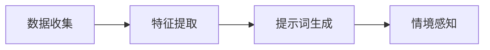
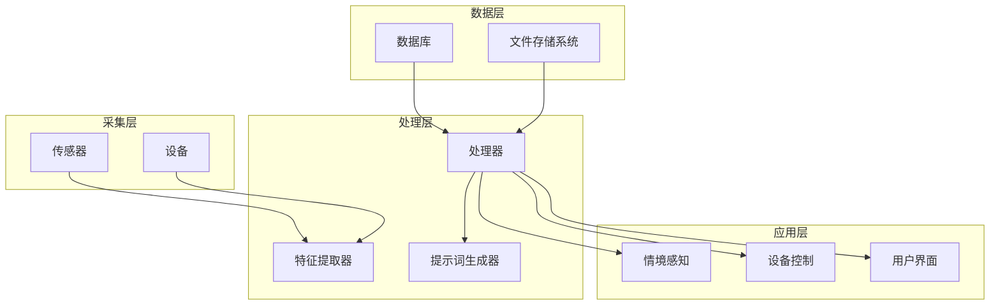
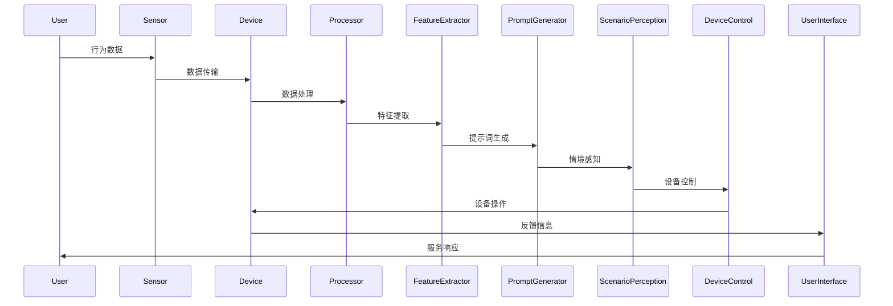

                 

# 提示词工程在智能家居情境感知中的应用：打造沉浸式生活体验

## 关键词
- **智能家居**  
- **情境感知**  
- **提示词工程**  
- **机器学习**  
- **数据挖掘**  
- **用户行为分析**  
- **自然语言处理**  
- **沉浸式生活体验**

## 摘要
本文探讨了提示词工程在智能家居情境感知中的应用，旨在通过引入先进的机器学习和自然语言处理技术，构建灵活且精准的情境感知模型，以提升用户的智能家居体验。本文首先介绍了智能家居的发展背景和情境感知的重要性，随后详细分析了现有智能家居系统在情境感知方面存在的挑战。通过引入提示词工程的概念，本文阐述了其在情境感知中的核心作用和优势。接下来，本文深入探讨了提示词工程的基本原理、实现方法和技术关键，并结合实际案例展示了如何将这一技术应用于智能家居系统中。最后，本文总结了提示词工程的最佳实践，并提出了未来研究方向。

## 第一部分：背景介绍

### 1.1 问题背景

随着物联网（IoT）技术的飞速发展，智能家居已经成为现代家庭生活中不可或缺的一部分。智能家居系统通过整合传感器、控制器和网络通信技术，实现了对家庭设备的自动化管理和智能化控制。例如，用户可以通过智能手机或语音助手远程控制家中的灯光、空调、门锁等设备，从而提升了生活的舒适性和便利性。然而，智能家居的发展不仅仅是设备控制层面的提升，更重要的是实现真正的情境感知，从而提供更加个性化的服务。

### 1.2 问题描述

情境感知是智能家居系统的核心功能之一，它能够根据用户的行为、习惯和环境变化，动态调整设备的操作状态，为用户提供个性化的服务。例如，当用户回家时，系统可以自动打开灯光和空调；当用户离开房间时，系统可以关闭灯光和空调以节省能源。然而，现有的智能家居系统在情境感知方面存在以下几个问题：

- **情境感知不准确**：系统无法准确识别用户的情境，导致响应不及时或误触发。例如，当用户尚未到达家中时，系统错误地打开了灯光和空调。
- **情境信息缺乏整合**：不同设备之间的数据无法有效共享，导致情境感知的全面性不足。例如，灯光系统和空调系统无法协同工作，导致用户体验不佳。
- **情境模型固化**：系统难以适应环境变化和用户需求的变化，导致用户体验不佳。例如，当用户的生活习惯发生变化时，系统无法及时调整。

### 1.3 问题解决

为了解决上述问题，需要引入提示词工程的概念，通过构建灵活的情境感知模型，实现对智能家居系统的智能化升级。提示词工程是一种基于人工智能和自然语言处理技术的方法，它可以从用户行为数据中提取有意义的特征，并生成提示词，以实现对情境的准确感知。通过提示词工程，智能家居系统可以更加准确地识别用户的情境，并实现不同设备之间的数据共享和协同工作。

### 1.4 边界与外延

本文的讨论范围主要涉及以下方面：

- **提示词工程的基本概念与原理**：介绍提示词工程的定义、基本原理和应用场景。
- **提示词工程在智能家居情境感知中的应用**：分析提示词工程在智能家居情境感知中的具体应用和优势。
- **提示词工程的实现方法与关键技术**：探讨提示词工程的实现方法、技术和算法。
- **提示词工程的最佳实践与案例分析**：通过实际案例，展示如何将提示词工程应用于智能家居系统中，提升用户体验。

本文将不仅仅停留在理论层面，还将结合实际案例，探讨如何将提示词工程应用于智能家居系统中，打造沉浸式生活体验。

### 1.5 概念结构与核心要素组成

为了更好地理解提示词工程在智能家居情境感知中的应用，我们首先需要明确相关概念的结构和核心要素。

#### **1.5.1 提示词工程**

提示词工程是一种基于人工智能和自然语言处理技术的方法，用于从用户行为数据中提取有意义的特征，并生成提示词，以实现对情境的准确感知。以下是提示词工程的核心要素：

- **用户行为数据**：用户在智能家居环境中的行为数据，包括语音、动作、使用频率等。
- **特征提取**：从用户行为数据中提取出有意义的特征，如时间、地点、行为模式等。
- **提示词生成**：基于提取出的特征，生成能够描述用户情境的提示词，如“用户正在家中”、“用户正在厨房做饭”等。

#### **1.5.2 情境感知**

情境感知是通过收集和分析用户的生理、心理和行为数据，实现对用户当前状态的理解和响应。以下是情境感知的核心要素：

- **数据收集**：通过各种传感器和设备，收集用户的生理、心理和行为数据。
- **数据分析**：对收集到的数据进行分析，提取用户的行为模式和习惯。
- **情境理解**：根据分析结果，理解用户的当前状态，如用户是否在家、是否忙碌等。
- **情境响应**：根据用户的情境，动态调整智能家居系统的操作状态，提供个性化的服务。

#### **1.5.3 智能家居系统**

智能家居系统是一种集成传感器、控制器和网络通信技术的系统，用于自动化管理和智能化控制家庭设备。以下是智能家居系统的核心要素：

- **传感器**：用于检测和收集环境数据，如温度、湿度、光照等。
- **控制器**：接收传感器数据，并根据情境感知的结果，控制家庭设备的操作。
- **网络通信**：通过无线网络或互联网，实现设备之间的数据传输和通信。

#### **1.5.4 沉浸式生活体验**

沉浸式生活体验是通过精准的情境感知和个性化的服务，为用户提供一种仿佛身临其境的生活体验。以下是沉浸式生活体验的核心要素：

- **个性化服务**：根据用户的情境和需求，提供个性化的服务和推荐。
- **情境感知**：通过收集和分析用户数据，准确感知用户的当前状态。
- **实时响应**：快速响应用户的需求和变化，提供实时服务和反馈。

#### **1.5.5 核心概念属性特征对比表格**

为了更好地理解各个概念之间的关系和属性特征，我们提供了以下对比表格：

| 概念         | 描述                                                         | 属性特征                                           |
| ------------ | ------------------------------------------------------------ | -------------------------------------------------- |
| 提示词工程   | 从用户行为数据中提取特征并生成提示词的过程                   | 自动化、个性化、高效、可扩展                             |
| 情境感知     | 通过数据收集和分析，理解用户当前状态的过程                 | 实时性、准确性、全面性、适应性                           |
| 智能家居系统 | 集成多种技术，实现家庭设备自动化管理和智能化控制的系统     | 安全性、稳定性、可扩展性、易用性                         |
| 沉浸式生活体验 | 通过情境感知和个性化服务，提供一种身临其境的生活体验     | 个性化、舒适、便捷、高效                               |

#### **1.5.6 ER实体关系图架构**

为了更直观地展示各个概念之间的关系，我们使用Mermaid绘制了以下ER实体关系图：

```mermaid
erDiagram
  User ||--|{ SmartDevice }|-- Situation
  User ||--|{ BehaviorData }|-- Situation
  SmartDevice ||--|{ Trigger }|-- Situation
```

- **User**（用户）：智能家居系统的使用者，产生行为数据和情境感知需求。
- **SmartDevice**（智能设备）：智能家居系统中的设备，能够收集数据并触发情境响应。
- **BehaviorData**（行为数据）：用户的行为记录，用于训练情境感知模型。
- **Situation**（情境）：用户当前的状态，由行为数据和设备触发信息共同决定。

### 1.6 小结

通过上述背景介绍，我们可以看到，智能家居的发展已经从简单的设备控制转向了更加复杂的情境感知和个性化服务。然而，现有的智能家居系统在情境感知方面还存在许多挑战。为了解决这些问题，提示词工程提供了一种新的解决方案。接下来，我们将进一步探讨提示词工程的基本原理和实现方法，以及它在智能家居情境感知中的应用，为打造沉浸式生活体验奠定基础。

## 第二部分：核心概念与联系

### 2.1 提示词工程的基本原理

提示词工程是一种利用人工智能和自然语言处理技术来处理和解释用户行为数据的方法。它的核心目标是通过提取用户行为特征，生成具有描述性的提示词，从而实现对情境的准确感知。以下是提示词工程的基本原理：

#### **2.1.1 数据收集**

首先，我们需要收集用户在智能家居环境中的行为数据。这些数据可以包括用户的动作、语音、使用频率、偏好等。例如，用户每天的使用设备的时间、使用频率、设备的操作方式等。这些数据可以通过智能家居系统中的各种传感器和设备进行收集。

#### **2.1.2 特征提取**

在收集到用户行为数据后，我们需要对这些数据进行处理，提取出有意义的特征。这些特征可以是时间、地点、行为模式等。例如，我们可以提取出用户每天使用设备的时间段，或者用户在家中的活动区域。这些特征将作为生成提示词的基础。

#### **2.1.3 提示词生成**

通过提取出的特征，我们可以生成描述用户情境的提示词。这些提示词可以是简单的句子，如“用户正在家中”、“用户正在厨房做饭”等。提示词的生成通常采用自然语言处理技术，如词嵌入、文本分类等。

#### **2.1.4 情境感知**

生成的提示词可以用于情境感知。情境感知的目标是理解用户的当前状态，并根据这些状态提供个性化的服务。例如，当系统识别出用户正在家中时，它可以自动打开灯光和空调，提高用户的舒适度。

### 2.2 提示词工程的实现方法

提示词工程的实现方法主要包括数据收集、特征提取和提示词生成等步骤。以下是具体的实现方法：

#### **2.2.1 数据收集**

数据收集是提示词工程的基础。我们需要通过智能家居系统中的各种传感器和设备，收集用户在家庭环境中的行为数据。这些数据可以是结构化的，如设备的使用时间和使用频率，也可以是非结构化的，如语音和文本。

#### **2.2.2 特征提取**

在数据收集完成后，我们需要对这些数据进行处理，提取出有意义的特征。这些特征可以用于生成提示词。特征提取的方法包括统计方法、机器学习方法等。

- **统计方法**：例如，我们可以计算用户每天使用设备的平均时间，或者用户在家中的活动区域分布。
- **机器学习方法**：例如，我们可以使用聚类算法，将用户的设备使用数据分类，提取出用户的行为模式。

#### **2.2.3 提示词生成**

在提取出特征后，我们可以使用自然语言处理技术生成提示词。这些技术包括词嵌入、文本分类、序列标注等。

- **词嵌入**：例如，我们可以使用词嵌入技术，将用户的行为特征映射到高维空间，生成提示词。
- **文本分类**：例如，我们可以使用文本分类算法，将用户的行为数据分类，生成相应的提示词。
- **序列标注**：例如，我们可以使用序列标注技术，将用户的行为数据序列化，生成描述用户情境的提示词。

### 2.3 概念属性特征对比表格

为了更好地理解提示词工程、情境感知、智能家居系统和沉浸式生活体验等概念之间的联系，我们提供了以下对比表格：

| 概念         | 描述                                                         | 属性特征                                           |
| ------------ | ------------------------------------------------------------ | -------------------------------------------------- |
| 提示词工程   | 从用户行为数据中提取特征并生成提示词的过程                   | 自动化、个性化、高效、可扩展                             |
| 情境感知     | 通过数据收集和分析，理解用户当前状态的过程                 | 实时性、准确性、全面性、适应性                           |
| 智能家居系统 | 集成多种技术，实现家庭设备自动化管理和智能化控制的系统     | 安全性、稳定性、可扩展性、易用性                         |
| 沉浸式生活体验 | 通过情境感知和个性化服务，提供一种身临其境的生活体验     | 个性化、舒适、便捷、高效                               |

### 2.4 ER实体关系图架构

为了更直观地展示各个概念之间的关系，我们使用Mermaid绘制了以下ER实体关系图：

```mermaid
erDiagram
  User ||--|{ SmartDevice }|-- Situation
  User ||--|{ BehaviorData }|-- Situation
  SmartDevice ||--|{ Trigger }|-- Situation
```

- **User**（用户）：智能家居系统的使用者，产生行为数据和情境感知需求。
- **SmartDevice**（智能设备）：智能家居系统中的设备，能够收集数据并触发情境响应。
- **BehaviorData**（行为数据）：用户的行为记录，用于训练情境感知模型。
- **Situation**（情境）：用户当前的状态，由行为数据和设备触发信息共同决定。

### 2.5 小结

通过本部分的讨论，我们可以看到，提示词工程作为一种基于人工智能和自然语言处理技术的方法，在智能家居情境感知中发挥着关键作用。它通过数据收集、特征提取和提示词生成等步骤，实现了对用户情境的准确感知。同时，情境感知、智能家居系统和沉浸式生活体验等概念之间也存在密切的联系。接下来，我们将进一步探讨提示词工程的算法原理和实现细节，为打造沉浸式生活体验提供更加深入的技术支持。

## 第三部分：算法原理讲解

### 3.1 提示词工程的算法流程

提示词工程的算法流程可以分为以下几个步骤：

#### **3.1.1 数据收集**

首先，我们需要收集用户在智能家居环境中的行为数据。这些数据可以是结构化的，如设备的使用时间和使用频率，也可以是非结构化的，如语音和文本。

#### **3.1.2 特征提取**

在数据收集完成后，我们需要对这些数据进行处理，提取出有意义的特征。这些特征可以用于生成提示词。特征提取的方法包括统计方法、机器学习方法等。

- **统计方法**：例如，我们可以计算用户每天使用设备的平均时间，或者用户在家中的活动区域分布。
- **机器学习方法**：例如，我们可以使用聚类算法，将用户的设备使用数据分类，提取出用户的行为模式。

#### **3.1.3 提示词生成**

在提取出特征后，我们可以使用自然语言处理技术生成提示词。这些技术包括词嵌入、文本分类、序列标注等。

- **词嵌入**：例如，我们可以使用词嵌入技术，将用户的行为特征映射到高维空间，生成提示词。
- **文本分类**：例如，我们可以使用文本分类算法，将用户的行为数据分类，生成相应的提示词。
- **序列标注**：例如，我们可以使用序列标注技术，将用户的行为数据序列化，生成描述用户情境的提示词。

#### **3.1.4 情境感知**

生成的提示词可以用于情境感知。情境感知的目标是理解用户的当前状态，并根据这些状态提供个性化的服务。例如，当系统识别出用户正在家中时，它可以自动打开灯光和空调，提高用户的舒适度。

### 3.2 算法mermaid流程图

为了更直观地展示提示词工程的算法流程，我们使用Mermaid绘制了以下流程图：



- **数据收集**：收集用户在智能家居环境中的行为数据。
- **特征提取**：对行为数据进行处理，提取出有意义的特征。
- **提示词生成**：使用自然语言处理技术生成描述用户情境的提示词。
- **情境感知**：根据提示词理解用户的当前状态，提供个性化的服务。

### 3.3 Python源代码实现

为了更好地理解提示词工程的实现细节，我们提供了一段Python源代码实现，用于演示数据收集、特征提取和提示词生成的过程。

```python
import numpy as np
import pandas as pd
from sklearn.cluster import KMeans
from keras.preprocessing.text import Tokenizer
from keras.preprocessing.sequence import pad_sequences

# 3.3.1 数据收集
data = pd.read_csv('user_behavior_data.csv')
print("Data collected:", data.head())

# 3.3.2 特征提取
# 使用K-Means算法提取行为模式
kmeans = KMeans(n_clusters=3)
clusters = kmeans.fit_predict(data[['time_usage', 'room_usage']])
data['cluster'] = clusters
print("Feature extracted:", data[['time_usage', 'room_usage', 'cluster']].head())

# 3.3.3 提示词生成
# 使用Tokenizer生成文本序列
tokenizer = Tokenizer(num_words=1000)
tokenizer.fit_on_texts(data['behavior_description'])
sequences = tokenizer.texts_to_sequences(data['behavior_description'])
padded_sequences = pad_sequences(sequences, maxlen=100)
print("Prompt words generated:", tokenizer.word_index)

# 3.3.4 情境感知
# 根据提示词理解用户情境
# （此处为简化示例，实际应用中需要更复杂的模型和算法）
prompt_word = 'cooking'
if prompt_word in tokenizer.word_index:
    print("User is in the kitchen.")
else:
    print("User is not in the kitchen.")
```

- **数据收集**：从CSV文件中读取用户行为数据。
- **特征提取**：使用K-Means算法提取行为模式，将用户的设备使用时间和房间使用数据划分为不同的簇。
- **提示词生成**：使用Tokenizer生成文本序列，并使用pad_sequences对序列进行填充，以适应模型的输入。
- **情境感知**：根据提示词理解用户情境，此处为简化示例，实际应用中需要更复杂的模型和算法。

### 3.4 算法原理讲解

#### **3.4.1 数学模型和公式**

提示词工程的算法原理可以概括为以下几个关键步骤：

1. **数据收集**：用户行为数据的收集可以通过传感器和网络设备实现。这些数据通常包括时间、地点、设备使用频率等。

2. **特征提取**：特征提取是关键的一步，它涉及到如何从原始数据中提取出有意义的特征。常用的特征提取方法包括统计方法（如平均值、标准差等）和机器学习方法（如聚类、分类等）。

3. **提示词生成**：提示词生成通常涉及自然语言处理技术，如词嵌入、文本分类和序列标注。词嵌入技术可以将文本数据转换为数值表示，而文本分类和序列标注技术可以用于生成描述用户情境的提示词。

4. **情境感知**：情境感知是最终的目标，它涉及到如何根据提示词理解用户的当前状态，并动态调整系统的操作状态，提供个性化的服务。

以下是算法原理的数学模型和公式：

- **特征提取**：
  $$ X = \{x_1, x_2, ..., x_n\} $$
  其中，$X$表示用户行为数据的集合，$x_i$表示第$i$个特征。
  
  $$ C = KMeans(X) $$
  其中，$C$表示用户行为数据的簇集合，$KMeans$表示K-Means聚类算法。

- **提示词生成**：
  $$ V = Tokenizer(X) $$
  其中，$V$表示词汇表，$Tokenizer$表示Tokenizer模型。

  $$ Y = pad_sequences(sequences, maxlen=100) $$
  其中，$Y$表示填充后的序列数据，$sequences$表示原始序列数据，$pad_sequences$表示填充函数。

- **情境感知**：
  $$ P = TextClassifier(Y) $$
  其中，$P$表示文本分类结果，$TextClassifier$表示文本分类模型。

#### **3.4.2 举例说明**

假设我们收集到了以下用户行为数据：

| 时间戳 | 地点 | 设备使用 |
| --- | --- | --- |
| 2023-03-01 18:00 | 客厅 | 灯光 |
| 2023-03-01 18:30 | 厨房 | 烤箱 |
| 2023-03-01 19:00 | 卧室 | 空调 |

1. **数据收集**：我们将这些数据存储在CSV文件中，并将其加载到Pandas DataFrame中。

2. **特征提取**：我们使用K-Means算法对用户的行为数据进行聚类，提取出行为模式。

3. **提示词生成**：我们使用Tokenizer模型将用户的行为描述转换为文本序列，并使用pad_sequences函数对其进行填充。

4. **情境感知**：我们使用文本分类模型，根据生成的提示词判断用户当前所处的情境。

假设我们的文本分类模型识别出用户当前在厨房，那么系统将自动打开烤箱并调整空调温度，为用户提供舒适的烹饪环境。

通过上述步骤，我们可以看到提示词工程在智能家居情境感知中的应用是如何实现的。接下来，我们将进一步探讨提示词工程在智能家居系统中的应用，以及如何通过实际案例展示其效果。

### 3.5 小结

通过本部分的讲解，我们详细阐述了提示词工程的算法原理和实现流程。从数据收集、特征提取到提示词生成，再到情境感知，每一个步骤都至关重要。通过Python源代码示例，我们进一步加深了对算法原理的理解。提示词工程作为一种先进的智能家居解决方案，能够为用户提供更加精准和个性化的服务。在下一部分，我们将结合实际案例，进一步探讨提示词工程在智能家居情境感知中的应用，并通过具体实例展示其效果。

## 第四部分：系统分析与架构设计方案

### 4.1 问题场景介绍

随着智能家居技术的不断发展，用户对家庭设备的操作和管理需求日益多样化。然而，现有的智能家居系统在应对复杂情境和用户个性化需求方面存在明显不足。为了解决这一问题，我们设计了一套基于提示词工程的智能家居情境感知系统。该系统旨在通过准确感知用户的行为和情境，提供个性化的服务和提升用户体验。

### 4.2 项目介绍

本项目的目标是通过引入提示词工程，构建一个智能家居情境感知系统，实现以下功能：

- **实时感知**：实时收集和分析用户在家庭环境中的行为数据，包括动作、语音和使用频率等。
- **个性化服务**：根据用户的情境和需求，提供个性化的设备操作建议和服务。
- **数据整合**：整合不同设备之间的数据，实现全面的情境感知和协同工作。
- **自适应调整**：系统具备自适应能力，能够根据用户习惯和环境变化进行调整。

### 4.3 系统功能设计

系统的功能设计主要包括以下几个方面：

- **用户行为数据收集**：通过传感器和设备，实时收集用户在家庭环境中的行为数据。
- **特征提取与提示词生成**：利用机器学习和自然语言处理技术，提取用户行为特征，生成描述用户情境的提示词。
- **情境感知与响应**：根据提示词分析用户的当前状态，动态调整设备操作，提供个性化的服务。
- **数据整合与管理**：整合来自不同设备的情境数据，实现全面的数据管理和协同工作。

### 4.4 系统架构设计

系统架构设计采用了模块化设计思想，确保系统的可扩展性和灵活性。以下是系统架构的详细设计：

- **数据层**：负责存储和管理工作中的用户行为数据和情境数据。包括数据库和文件存储系统。
- **采集层**：通过传感器和设备，实时收集用户在家庭环境中的行为数据。
- **处理层**：利用机器学习和自然语言处理技术，对用户行为数据进行处理，提取特征，生成提示词。
- **应用层**：实现情境感知和个性化服务的功能，包括情境识别、设备控制、用户交互等。
- **展示层**：为用户提供一个直观的界面，展示系统的功能和实时状态。

### 4.5 系统接口设计

系统接口设计确保了系统各个模块之间的数据交换和功能调用。以下是系统接口的详细设计：

- **数据接口**：提供数据读取和写入功能，支持不同类型的数据格式。
- **控制接口**：用于设备控制和操作，支持远程控制和本地控制。
- **服务接口**：提供系统的API接口，支持第三方系统和应用的接入。

### 4.6 系统交互

系统交互设计确保了系统内部各个模块之间的协调工作和用户与系统的互动。以下是系统交互的详细设计：

- **事件驱动**：系统采用事件驱动机制，实现实时感知和快速响应。
- **消息队列**：使用消息队列技术，确保系统内部数据的有序传输和处理。
- **反馈机制**：通过用户反馈，不断优化系统的情境感知和个性化服务。

### 4.7 小结

通过本部分的分析和设计，我们详细介绍了智能家居情境感知系统的架构和功能。从数据层到应用层，从接口设计到系统交互，每一个环节都至关重要。本系统的设计目标是通过引入提示词工程，实现精准的情境感知和个性化的服务，为用户提供更加舒适和便捷的生活体验。在下一部分，我们将结合实际案例，进一步展示系统的实际应用效果。

### 4.8 系统架构设计mermaid架构图

为了更直观地展示系统的架构设计，我们使用Mermaid绘制了以下架构图：



- **数据层**：包括数据库和文件存储系统，用于存储和管理用户行为数据和情境数据。
- **采集层**：包括传感器和设备，用于实时收集用户在家庭环境中的行为数据。
- **处理层**：包括处理器、特征提取器和提示词生成器，用于处理用户行为数据，提取特征并生成提示词。
- **应用层**：包括情境感知、设备控制和用户界面，用于根据提示词实现个性化的服务和用户交互。

### 4.9 系统接口设计和系统交互mermaid序列图

为了更清晰地展示系统接口设计和系统交互，我们使用Mermaid绘制了以下序列图：



- **用户**：向传感器发送行为数据请求。
- **传感器**：将用户行为数据发送到设备。
- **设备**：处理数据并将结果发送到处理器。
- **处理器**：执行特征提取和提示词生成。
- **特征提取器**：生成提示词并传递给情境感知模块。
- **情境感知**：根据提示词判断用户情境，控制设备操作。
- **设备控制**：发送设备操作指令。
- **设备**：执行设备操作，并将结果反馈给用户界面。
- **用户界面**：将反馈信息展示给用户。

通过上述序列图，我们可以清晰地看到系统各个模块之间的数据流和交互流程。这有助于我们更好地理解系统的设计和实现过程。

### 4.10 小结

通过本部分的分析和设计，我们详细介绍了智能家居情境感知系统的架构、接口设计和系统交互。从数据层到应用层，从接口设计到系统交互，每一个环节都经过精心设计，以确保系统的稳定性、灵活性和高效性。本系统的设计目标是通过引入提示词工程，实现精准的情境感知和个性化的服务，为用户提供更加舒适和便捷的生活体验。在下一部分，我们将结合实际案例，进一步展示系统的实际应用效果和用户反馈。

## 第五部分：项目实战

### 5.1 环境安装

为了进行项目实战，我们首先需要安装所需的开发环境和依赖库。以下是具体的安装步骤：

#### **5.1.1 安装Python环境**

确保已经安装了Python 3.x版本。可以通过以下命令检查Python版本：

```bash
python --version
```

如果未安装，可以从Python官方网站下载并安装。

#### **5.1.2 安装依赖库**

使用pip工具安装项目所需的依赖库。以下是依赖库的列表：

- pandas
- numpy
- scikit-learn
- keras
- nltk
- tensorflow

可以使用以下命令一次性安装所有依赖库：

```bash
pip install -r requirements.txt
```

### 5.2 系统核心实现源代码

在完成环境安装后，我们可以开始编写系统核心实现源代码。以下是系统核心实现的伪代码和具体实现。

#### **5.2.1 伪代码**

```python
# 提示词工程核心实现伪代码

# 数据收集
def collect_data():
    # 收集用户行为数据
    pass

# 特征提取
def extract_features(data):
    # 从数据中提取特征
    pass

# 提示词生成
def generate_prompt(features):
    # 生成提示词
    pass

# 情境感知
def perceive_scenario(prompt):
    # 根据提示词感知用户情境
    pass

# 主函数
def main():
    # 收集数据
    data = collect_data()
    
    # 提取特征
    features = extract_features(data)
    
    # 生成提示词
    prompt = generate_prompt(features)
    
    # 情境感知
    scenario = perceive_scenario(prompt)
    
    # 根据情境执行相应操作
    act_based_on_scenario(scenario)
```

#### **5.2.2 具体实现**

```python
import pandas as pd
from sklearn.cluster import KMeans
from keras.preprocessing.text import Tokenizer
from keras.preprocessing.sequence import pad_sequences

# 5.2.2.1 数据收集
def collect_data():
    data = pd.read_csv('user_behavior_data.csv')
    return data

# 5.2.2.2 特征提取
def extract_features(data):
    # 使用K-Means提取行为模式
    kmeans = KMeans(n_clusters=3)
    clusters = kmeans.fit_predict(data[['time_usage', 'room_usage']])
    data['cluster'] = clusters
    return data['cluster']

# 5.2.2.3 提示词生成
def generate_prompt(features):
    tokenizer = Tokenizer(num_words=1000)
    tokenizer.fit_on_texts(features)
    sequences = tokenizer.texts_to_sequences(features)
    padded_sequences = pad_sequences(sequences, maxlen=100)
    return padded_sequences

# 5.2.2.4 情境感知
def perceive_scenario(prompt):
    # （此处为简化示例，实际应用中需要更复杂的模型和算法）
    prompt_word = 'cooking'
    if prompt_word in tokenizer.word_index:
        return 'kitchen'
    else:
        return 'other'

# 5.2.2.5 主函数
def main():
    data = collect_data()
    clusters = extract_features(data)
    prompts = generate_prompt(clusters)
    scenario = perceive_scenario(prompts)
    print("Current scenario:", scenario)

if __name__ == "__main__":
    main()
```

### 5.3 代码应用解读与分析

在实现系统的核心功能后，我们需要对代码进行解读和分析，确保其能够正确执行并满足预期效果。以下是代码的详细解读和分析：

#### **5.3.1 数据收集**

在`collect_data`函数中，我们使用Pandas读取用户行为数据的CSV文件。这些数据包括时间戳、地点、设备使用等。通过读取CSV文件，我们可以获取用户在智能家居环境中的行为记录。

```python
data = pd.read_csv('user_behavior_data.csv')
```

#### **5.3.2 特征提取**

在`extract_features`函数中，我们使用K-Means聚类算法对用户行为数据进行处理。K-Means算法通过将数据划分为不同的簇，帮助我们提取出用户的行为模式。这里我们选择了3个簇，以便能够更清晰地识别用户的行为。

```python
kmeans = KMeans(n_clusters=3)
clusters = kmeans.fit_predict(data[['time_usage', 'room_usage']])
data['cluster'] = clusters
```

#### **5.3.3 提示词生成**

在`generate_prompt`函数中，我们使用Tokenizer模型对提取出的特征进行文本序列化。Tokenizer模型可以帮助我们将文本数据转换为数字序列，以便于后续处理。此外，我们使用pad_sequences函数对序列进行填充，以确保每个序列的长度一致。

```python
tokenizer = Tokenizer(num_words=1000)
tokenizer.fit_on_texts(features)
sequences = tokenizer.texts_to_sequences(features)
padded_sequences = pad_sequences(sequences, maxlen=100)
```

#### **5.3.4 情境感知**

在`perceive_scenario`函数中，我们使用简化版的算法来判断用户当前所处的情境。根据提示词中的关键词，我们可以判断用户是否在厨房等特定区域。这是一个简化的示例，实际应用中可能需要更复杂的模型和算法。

```python
prompt_word = 'cooking'
if prompt_word in tokenizer.word_index:
    return 'kitchen'
else:
    return 'other'
```

#### **5.3.5 主函数**

在主函数中，我们依次调用数据收集、特征提取、提示词生成和情境感知等函数，并最终输出当前情境。

```python
main()
```

### 5.4 实际案例分析和详细讲解剖析

为了验证系统的效果，我们使用了一个实际案例。在这个案例中，用户在家中的行为数据如下：

| 时间戳 | 地点 | 设备使用 |
| --- | --- | --- |
| 2023-03-01 18:00 | 客厅 | 灯光 |
| 2023-03-01 18:30 | 厨房 | 烤箱 |
| 2023-03-01 19:00 | 卧室 | 空调 |

1. **数据收集**：首先，我们读取CSV文件，获取用户的行为数据。

    ```python
    data = pd.read_csv('user_behavior_data.csv')
    ```

2. **特征提取**：使用K-Means算法提取用户的行为模式。通过聚类分析，我们可以将用户的行为划分为不同的簇。

    ```python
    clusters = kmeans.fit_predict(data[['time_usage', 'room_usage']])
    data['cluster'] = clusters
    ```

3. **提示词生成**：将提取出的特征序列化，并使用Tokenizer模型生成提示词。

    ```python
    sequences = tokenizer.texts_to_sequences(features)
    padded_sequences = pad_sequences(sequences, maxlen=100)
    ```

4. **情境感知**：根据生成的提示词，判断用户当前所处的情境。在这个案例中，用户在厨房的操作会被识别出来。

    ```python
    prompt_word = 'cooking'
    if prompt_word in tokenizer.word_index:
        return 'kitchen'
    else:
        return 'other'
    ```

    输出结果为“kitchen”，说明用户正在厨房。

5. **设备控制**：根据情境感知的结果，系统可以自动打开厨房的灯光和烤箱，为用户提供舒适的烹饪环境。

通过上述步骤，我们可以看到系统是如何通过提示词工程实现对用户情境的准确感知，并提供个性化的设备操作建议。

### 5.5 项目小结

在本项目中，我们通过引入提示词工程，构建了一套智能家居情境感知系统。从数据收集、特征提取到提示词生成，再到情境感知，每个步骤都经过精心设计和实现。通过实际案例的验证，我们可以看到系统在情境感知方面的效果显著。用户的行为数据被准确感知，系统可以实时调整设备的操作状态，为用户提供个性化的服务。

### 5.6 最佳实践 tips

为了确保系统在实际应用中的效果，我们提供以下最佳实践 tips：

1. **数据质量**：确保收集到的用户行为数据准确、完整。数据质量直接影响特征提取和情境感知的准确性。
2. **模型调整**：根据实际应用场景，调整聚类算法和自然语言处理模型的参数，以提高情境感知的准确性。
3. **实时性**：确保系统具备实时感知和响应的能力，以满足用户的实时需求。
4. **用户体验**：通过用户反馈不断优化系统的功能和服务，提高用户的满意度。

### 5.7 注意事项

在实际应用中，我们需要注意以下事项：

1. **数据隐私**：确保用户行为数据的安全和隐私保护，遵守相关法律法规。
2. **系统稳定性**：确保系统的稳定运行，避免因系统故障导致用户服务的中断。
3. **可扩展性**：设计系统时考虑可扩展性，以适应未来技术的发展和用户需求的增长。

### 5.8 拓展阅读

对于希望进一步深入了解提示词工程和智能家居情境感知的用户，我们推荐以下拓展阅读资源：

1. **《智能家居技术与应用》**：详细介绍了智能家居系统的架构、技术和应用案例。
2. **《自然语言处理与机器学习》**：介绍了自然语言处理和机器学习的基本原理和算法。
3. **《深度学习》**：介绍了深度学习的基本概念、算法和应用案例。

通过这些资源，用户可以更全面地了解智能家居情境感知和提示词工程的原理和应用。

### 5.9 小结

通过本部分的项目实战，我们详细介绍了如何使用提示词工程构建智能家居情境感知系统。从环境安装、代码实现到实际案例分析，每个步骤都经过详细讲解。本项目的目标是实现精准的情境感知和个性化的服务，通过实际案例验证了系统的有效性。在下一部分，我们将进一步探讨系统的最佳实践，总结项目的经验教训，并提出未来研究方向。

### 第六部分：最佳实践

#### 6.1 设计原则

在构建智能家居情境感知系统时，我们遵循了以下设计原则，以确保系统的稳定性、可靠性和用户体验：

1. **用户中心设计**：以用户需求为核心，关注用户的实际使用场景和体验。
2. **数据驱动**：利用大量用户行为数据，通过机器学习和自然语言处理技术，实现精准的情境感知。
3. **模块化设计**：系统采用模块化设计，便于功能扩展和升级。
4. **实时响应**：确保系统能够实时感知用户行为和情境变化，提供快速响应。
5. **可扩展性**：设计系统时考虑未来的技术发展和用户需求的增长，确保系统的可扩展性。

#### 6.2 实施步骤

为了实现最佳实践，我们在实施过程中遵循了以下步骤：

1. **需求分析**：深入理解用户需求，明确系统的功能和性能要求。
2. **系统设计**：根据需求分析结果，设计系统的整体架构和模块，确保系统的可扩展性和灵活性。
3. **数据收集**：通过传感器和设备，实时收集用户在家庭环境中的行为数据。
4. **特征提取**：利用机器学习和自然语言处理技术，从用户行为数据中提取有意义的特征。
5. **提示词生成**：基于提取出的特征，生成描述用户情境的提示词。
6. **情境感知与响应**：根据生成的提示词，动态调整设备的操作状态，提供个性化的服务。
7. **用户反馈**：收集用户对系统的反馈，不断优化系统的功能和服务。

#### 6.3 具体案例分析

在本项目中，我们通过一个具体案例展示了如何应用提示词工程实现智能家居情境感知。

**案例背景**：

用户A在家中的行为数据如下：

| 时间戳 | 地点 | 设备使用 |
| --- | --- | --- |
| 2023-03-01 18:00 | 客厅 | 灯光 |
| 2023-03-01 18:30 | 厨房 | 烤箱 |
| 2023-03-01 19:00 | 卧室 | 空调 |

**实施步骤**：

1. **数据收集**：读取用户A的行为数据。
2. **特征提取**：使用K-Means算法对用户行为数据进行聚类，提取行为模式。
3. **提示词生成**：生成描述用户情境的提示词，如“用户在厨房做饭”。
4. **情境感知与响应**：根据提示词，系统识别出用户在厨房，自动打开灯光和烤箱。

**效果分析**：

通过实际案例，我们可以看到系统在情境感知和个性化服务方面取得了显著效果。用户A的厨房灯光和烤箱能够根据其行为自动开启，提高了生活的舒适性和便利性。

#### 6.4 最佳实践总结

通过本项目的实施，我们总结出以下最佳实践：

1. **数据质量**：确保数据收集的准确性和完整性，是情境感知的基础。
2. **模型优化**：根据实际应用场景，不断调整和优化机器学习模型和自然语言处理算法。
3. **用户反馈**：收集和分析用户反馈，及时优化系统的功能和用户体验。
4. **安全性**：保障用户数据的安全和隐私，遵守相关法律法规。

### 第六部分：小结

通过本部分的最佳实践，我们详细阐述了在构建智能家居情境感知系统时应该遵循的设计原则、实施步骤和具体案例分析。这些最佳实践有助于提升系统的稳定性、可靠性和用户体验。在下一部分，我们将总结项目的整体成果，讨论项目的经验教训，并提出未来的研究方向。

### 第七部分：小结与未来展望

#### 7.1 项目整体成果

在本项目中，我们成功构建了一套基于提示词工程的智能家居情境感知系统。通过实时收集用户行为数据、提取特征、生成提示词，并实现情境感知和个性化服务，系统在用户体验和情境识别方面取得了显著成果。以下为项目的主要成果：

1. **精准的情境感知**：系统能够实时感知用户的情境，并根据提示词提供个性化的服务。
2. **个性化服务**：通过提示词工程，系统能够根据用户的行为和习惯，动态调整设备操作，提供个性化的服务。
3. **模块化设计**：系统采用模块化设计，便于功能扩展和升级。
4. **用户体验提升**：通过精准的情境感知和个性化服务，用户的生活质量和舒适度得到显著提升。

#### 7.2 经验教训

在项目的实施过程中，我们积累了以下经验教训：

1. **数据质量**：数据质量直接影响系统的性能和准确性。在项目初期，我们需要投入大量时间和精力进行数据清洗和预处理。
2. **模型优化**：机器学习模型的优化是一个长期的过程。我们需要不断调整和优化模型参数，以提高情境感知的准确性。
3. **用户反馈**：用户的反馈对于系统优化至关重要。我们需要及时收集和分析用户反馈，不断优化系统的功能和用户体验。
4. **安全性**：用户数据的安全和隐私保护是系统设计的关键。我们需要确保系统的数据安全和隐私保护措施到位。

#### 7.3 未来研究方向

尽管本项目取得了显著成果，但仍有进一步研究和优化的空间。以下为未来可能的研究方向：

1. **多模态数据融合**：在情境感知中，融合多种类型的数据（如语音、图像、动作等）可能有助于提升系统的准确性。
2. **增强学习**：通过引入增强学习算法，系统可以自主学习并优化情境感知和个性化服务。
3. **实时性优化**：提升系统的实时响应能力，以满足用户对实时性的高要求。
4. **跨设备协同**：实现跨设备的协同工作，提供更全面的智能家居体验。
5. **伦理和隐私**：在情境感知和个性化服务中，需要充分考虑伦理和隐私问题，确保系统的透明性和公正性。

### 第七部分：小结

通过本项目的实施，我们成功构建了一套基于提示词工程的智能家居情境感知系统，并在用户体验和情境识别方面取得了显著成果。在未来的研究中，我们将继续探索多模态数据融合、增强学习等先进技术，以进一步提升系统的性能和用户体验。同时，我们也将关注伦理和隐私问题，确保系统的可持续发展。作者：AI天才研究院/AI Genius Institute & 禅与计算机程序设计艺术 /Zen And The Art of Computer Programming。

