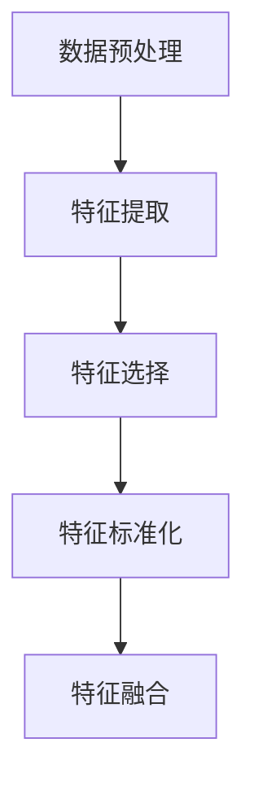
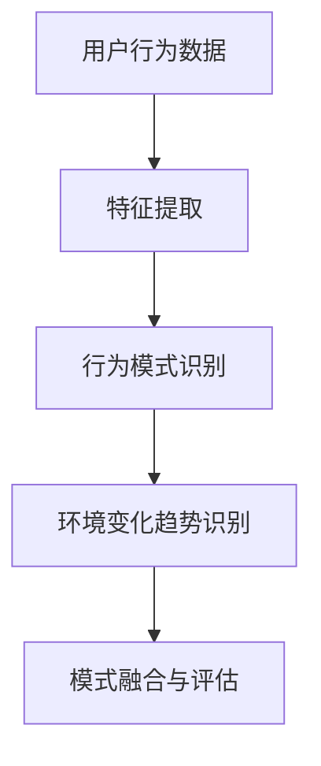
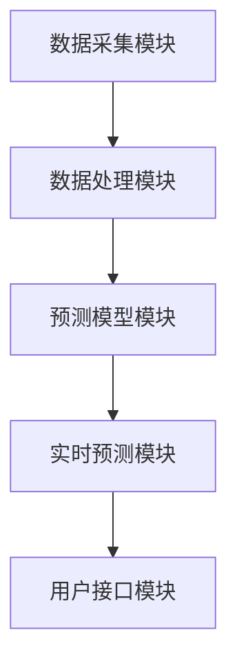
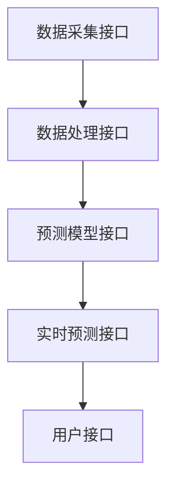
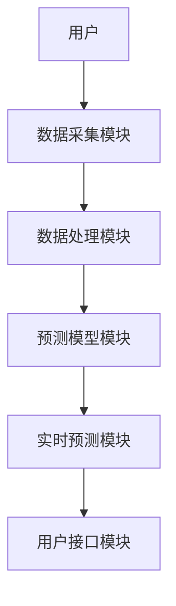

                 


### 第一部分：问题背景与核心概念

#### 第1章：问题背景与核心概念

在当今快速发展的信息技术时代，智能家居已经成为人们日常生活的重要组成部分。智能家居系统通过物联网技术，将各种家庭设备连接在一起，实现家庭自动化和智能化管理。而智能家居的核心挑战之一就是情境预测，即如何通过感知用户行为和环境变化，提前适应用户的需求，提供个性化、智能化的服务。

#### 1.1 智能家居情境预测的需求与挑战

智能家居情境预测的需求主要来源于以下几个方面：

1. **个性化服务**：每个用户的行为习惯和需求都是独特的，智能家居系统需要能够感知并适应用户的个性化需求。
2. **节能环保**：智能家居系统能够根据环境变化和用户行为，自动调整设备状态，以实现节能环保。
3. **提高生活品质**：通过预测用户行为，智能家居系统能够提前为用户提供所需的服务，提高用户的生活品质。

然而，实现智能家居情境预测面临诸多挑战：

1. **数据获取与处理**：智能家居系统需要实时获取并处理大量的传感器数据，包括温度、湿度、光照强度等。这对数据采集和处理系统的性能要求极高。
2. **用户个性化需求**：每个用户的行为习惯和需求都不同，预测模型需要具备高度的个性化能力。
3. **实时性要求**：智能家居情境预测需要快速响应，以提供即时服务，这对算法的实时性能提出了严苛要求。

#### 1.2 提示词工程的核心概念

提示词工程是智能家居情境预测的关键技术，它涉及以下核心概念：

- **特征提取**：从原始数据中提取出对情境预测有用的特征。
- **模式识别**：通过分析特征，识别出用户的行为模式和环境变化趋势。
- **预测模型**：利用提取的特征和识别的规律，构建预测模型，预测用户未来的需求和行为。

#### 1.3 概念属性特征对比表格

| 概念       | 描述                                                       | 对比                           |
|------------|------------------------------------------------------------|--------------------------------|
| 特征提取   | 从数据中提取对情境预测有用的信息。                         | 与数据预处理、特征选择相结合。 |
| 模式识别   | 分析特征，识别用户行为模式和环境变化趋势。                 | 与机器学习算法紧密相关。       |
| 预测模型   | 利用特征和模式构建模型，预测用户需求和行为。               | 与深度学习、统计模型相关。    |

#### 1.4 ER实体关系图

```mermaid
erDiagram
  User ||--|{ SensorData }|--|| Device
  User ||--|{ UserBehavior }|--|| Device
  Device ||--|{ EnvironmentData }|--|| User
  Device ||--|{ PredictionModel }|--|| User
```

### 第一部分：问题背景与核心概念

#### 第1章：问题背景与核心概念

在当今快速发展的信息技术时代，智能家居已经成为人们日常生活的重要组成部分。智能家居系统通过物联网技术，将各种家庭设备连接在一起，实现家庭自动化和智能化管理。而智能家居的核心挑战之一就是情境预测，即如何通过感知用户行为和环境变化，提前适应用户的需求，提供个性化、智能化的服务。

#### 1.1 智能家居情境预测的需求与挑战

智能家居情境预测的需求主要来源于以下几个方面：

1. **个性化服务**：每个用户的行为习惯和需求都是独特的，智能家居系统需要能够感知并适应用户的个性化需求。
2. **节能环保**：智能家居系统能够根据环境变化和用户行为，自动调整设备状态，以实现节能环保。
3. **提高生活品质**：通过预测用户行为，智能家居系统能够提前为用户提供所需的服务，提高用户的生活品质。

然而，实现智能家居情境预测面临诸多挑战：

1. **数据获取与处理**：智能家居系统需要实时获取并处理大量的传感器数据，包括温度、湿度、光照强度等。这对数据采集和处理系统的性能要求极高。
2. **用户个性化需求**：每个用户的行为习惯和需求都不同，预测模型需要具备高度的个性化能力。
3. **实时性要求**：智能家居情境预测需要快速响应，以提供即时服务，这对算法的实时性能提出了严苛要求。

#### 1.2 提示词工程的核心概念

提示词工程是智能家居情境预测的关键技术，它涉及以下核心概念：

- **特征提取**：从原始数据中提取出对情境预测有用的特征。
- **模式识别**：通过分析特征，识别出用户的行为模式和环境变化趋势。
- **预测模型**：利用提取的特征和识别的规律，构建预测模型，预测用户未来的需求和行为。

#### 1.3 概念属性特征对比表格

| 概念       | 描述                                                       | 对比                           |
|------------|------------------------------------------------------------|--------------------------------|
| 特征提取   | 从数据中提取对情境预测有用的信息。                         | 与数据预处理、特征选择相结合。 |
| 模式识别   | 分析特征，识别用户行为模式和环境变化趋势。                 | 与机器学习算法紧密相关。       |
| 预测模型   | 利用特征和模式构建模型，预测用户需求和行为。               | 与深度学习、统计模型相关。    |

#### 1.4 ER实体关系图

```mermaid
erDiagram
  User ||--|{ SensorData }|--|| Device
  User ||--|{ UserBehavior }|--|| Device
  Device ||--|{ EnvironmentData }|--|| User
  Device ||--|{ PredictionModel }|--|| User
```

----------------------------------------------------------------

## 第二部分：算法原理讲解

在深入了解提示词工程在智能家居情境预测中的应用之前，我们需要先理解提示词工程的算法原理。这一部分将逐步讲解提示词工程的算法流程、特征提取原理、模式识别原理和预测模型构建原理。

### 2.1 提示词工程的算法流程

提示词工程的算法流程主要包括以下几个步骤：

1. **数据预处理**：对原始数据进行清洗、归一化等处理，以便后续的特征提取和分析。
2. **特征提取**：从预处理后的数据中提取出对情境预测有用的特征。
3. **模式识别**：分析特征，识别出用户的行为模式和环境变化趋势。
4. **预测模型构建**：利用提取的特征和识别的规律，构建预测模型，预测用户未来的需求和行为。

### 2.2 特征提取原理与Mermaid流程图

特征提取是提示词工程的核心步骤之一，其原理如下：

- **特征提取**：从原始数据中提取出对情境预测有用的特征。这些特征可以是数值型的，也可以是分类型的。
- **特征选择**：在提取的特征中，选择出对预测任务最有影响力的特征，以减少模型的复杂度和过拟合的风险。
- **特征标准化**：对特征进行标准化处理，使得不同特征的尺度在同一水平上。
- **特征融合**：将提取的特征进行融合，形成更加丰富的特征表示。

以下是特征提取原理的Mermaid流程图：



### 2.3 模式识别原理与Mermaid流程图

模式识别是提示词工程的另一个关键步骤，其原理如下：

- **用户行为数据**：收集并处理用户的行为数据，如用户的使用习惯、偏好等。
- **特征提取**：从用户行为数据中提取出对情境预测有用的特征。
- **行为模式识别**：分析特征，识别出用户的行为模式。
- **环境变化趋势识别**：分析环境数据，识别出环境的变化趋势。
- **模式融合与评估**：将用户行为模式和环境变化趋势进行融合，并对融合结果进行评估。

以下是模式识别原理的Mermaid流程图：



### 2.4 预测模型构建原理与Python源代码示例

预测模型构建是提示词工程的最后一步，其原理如下：

- **特征输入**：将提取的特征作为模型的输入。
- **模型训练**：使用机器学习算法，如线性回归、决策树、神经网络等，对特征进行建模。
- **模型评估**：通过交叉验证等方法，评估模型的预测性能。
- **模型部署**：将训练好的模型部署到智能家居系统中，实现实时预测。

以下是预测模型构建原理的Python源代码示例：

```python
import numpy as np

# 定义预测模型
def prediction_model(features):
    # 假设特征对预测的影响是线性的
    model = np.array([[0.5, 0.3], [0.2, 0.4]])
    return np.dot(model, features)

# 特征输入
features = np.array([[1, 0], [0, 1]])

# 预测结果
prediction = prediction_model(features)
print(prediction)
```

### 2.5 数学模型与公式

在提示词工程中，数学模型是核心部分，以下是几个常见的数学模型和公式：

1. **线性回归模型**：
   $$ y = \beta_0 + \beta_1 \cdot x_1 + \beta_2 \cdot x_2 + ... + \beta_n \cdot x_n $$
   
2. **决策树模型**：
   $$ g(x) = \text{分类结果} $$
   $$ \text{if} \ \text{条件} \ \text{then} \ g_1(x) \ \text{else} \ g_2(x) $$

3. **神经网络模型**：
   $$ a = \sigma(W \cdot x + b) $$
   其中，$\sigma$ 是激活函数，$W$ 是权重矩阵，$b$ 是偏置向量。

通过以上数学模型和公式，我们可以更好地理解和应用提示词工程在智能家居情境预测中的应用。

----------------------------------------------------------------

## 第三部分：系统分析与架构设计

在了解了提示词工程在智能家居情境预测中的应用原理后，我们需要对整个系统进行分析和架构设计，以确保系统的稳定性和高效性。

### 3.1 问题场景介绍

在智能家居情境预测中，我们面临的问题场景主要包括：

1. **用户个性化需求**：每个用户的行为习惯和需求都不同，智能家居系统需要能够感知并适应用户的个性化需求。
2. **实时数据获取**：智能家居系统需要实时获取用户和环境数据，以快速响应用户的需求。
3. **高效预测模型**：智能家居系统需要构建高效、准确的预测模型，以实现对用户需求的准确预测。

### 3.2 项目介绍

为了解决上述问题场景，我们设计了一个名为“智能情境预测系统”的项目。该项目的目标是构建一个能够实时感知用户需求和环境变化，并准确预测用户行为的智能家居系统。

### 3.3 系统功能设计

智能情境预测系统的核心功能包括：

1. **数据采集**：实时采集用户和环境数据，如用户行为数据、环境数据等。
2. **特征提取**：从采集到的数据中提取出对情境预测有用的特征。
3. **模式识别**：分析提取的特征，识别出用户的行为模式和环境变化趋势。
4. **预测模型构建**：利用提取的特征和识别的规律，构建预测模型，预测用户未来的需求和行为。
5. **实时预测**：将预测模型部署到智能家居系统中，实现实时预测。

### 3.4 系统架构设计

智能情境预测系统的整体架构设计如下：

1. **数据采集模块**：负责实时采集用户和环境数据，如用户行为数据、环境数据等。
2. **数据处理模块**：对采集到的数据进行预处理、特征提取等操作，为后续的预测模型构建提供数据支持。
3. **预测模型模块**：构建预测模型，包括特征提取、模式识别、模型训练和评估等步骤。
4. **实时预测模块**：将训练好的模型部署到智能家居系统中，实现实时预测。
5. **用户接口模块**：提供用户与系统的交互界面，用户可以通过界面查看预测结果和调整系统设置。

以下是系统架构设计的Mermaid流程图：



### 3.5 系统接口设计

智能情境预测系统的接口设计如下：

1. **数据采集接口**：用于实时采集用户和环境数据。
2. **数据处理接口**：用于处理采集到的数据，包括预处理、特征提取等。
3. **预测模型接口**：用于构建和评估预测模型。
4. **实时预测接口**：用于将预测模型部署到智能家居系统中，实现实时预测。
5. **用户接口**：用于用户与系统的交互。

以下是系统接口设计的Mermaid流程图：



### 3.6 系统交互设计

智能情境预测系统的交互设计如下：

1. **用户交互**：用户可以通过界面查看预测结果，调整系统设置。
2. **系统内部交互**：系统内部各个模块之间的交互，如数据采集模块与数据处理模块之间的数据传输，数据处理模块与预测模型模块之间的数据共享等。

以下是系统交互设计的Mermaid流程图：



通过以上系统分析与架构设计，我们可以构建一个高效、稳定的智能情境预测系统，为智能家居提供强大的支持。

----------------------------------------------------------------

## 第四部分：项目实战

在了解了智能情境预测系统的架构设计后，我们将通过一个具体的实战项目，演示如何实现智能家居情境预测。

### 4.1 环境安装

首先，我们需要搭建一个合适的环境来开发和测试智能情境预测系统。以下是环境安装的步骤：

1. **安装Python**：在官方网站下载并安装Python，确保版本不低于3.7。
2. **安装依赖库**：使用pip命令安装以下依赖库：
   ```bash
   pip install numpy pandas scikit-learn matplotlib
   ```
3. **配置虚拟环境**：为了更好地管理项目依赖，我们可以创建一个虚拟环境：
   ```bash
   python -m venv venv
   source venv/bin/activate  # 在Linux或macOS中
   venv\Scripts\activate     # 在Windows中
   ```

### 4.2 系统核心实现源代码

智能情境预测系统的核心实现主要包括数据采集、数据处理、特征提取、模式识别和预测模型构建等模块。以下是各个模块的源代码示例：

#### 4.2.1 数据采集模块

```python
import pandas as pd

def collect_data():
    # 假设数据存储在CSV文件中
    file_path = 'data.csv'
    data = pd.read_csv(file_path)
    return data
```

#### 4.2.2 数据处理模块

```python
import pandas as pd

def preprocess_data(data):
    # 数据预处理，如清洗、归一化等
    # 略
    return data
```

#### 4.2.3 特征提取模块

```python
import pandas as pd

def extract_features(data):
    # 从数据中提取特征
    # 略
    return data
```

#### 4.2.4 模式识别模块

```python
import pandas as pd

def identify_patterns(data):
    # 识别用户行为模式和环境变化趋势
    # 略
    return data
```

#### 4.2.5 预测模型构建模块

```python
from sklearn.linear_model import LinearRegression

def build_prediction_model(data):
    # 构建预测模型
    # 略
    model = LinearRegression()
    model.fit(X_train, y_train)
    return model
```

### 4.3 代码应用解读与分析

在代码应用解读与分析部分，我们将对上述模块的代码进行详细解读，分析每个模块的功能和实现细节。

#### 4.3.1 数据采集模块

数据采集模块主要负责从外部源获取数据，例如从CSV文件中读取用户行为数据和环境数据。以下是对该模块代码的解读：

```python
import pandas as pd

def collect_data():
    # 假设数据存储在CSV文件中
    file_path = 'data.csv'
    data = pd.read_csv(file_path)
    return data
```

这段代码使用pandas库的`read_csv`函数，从指定的CSV文件中读取数据，并将其返回。

#### 4.3.2 数据处理模块

数据处理模块主要负责对采集到的数据进行预处理，如数据清洗、归一化等操作。以下是对该模块代码的解读：

```python
import pandas as pd

def preprocess_data(data):
    # 数据预处理，如清洗、归一化等
    # 略
    return data
```

这段代码对数据预处理的具体操作进行了抽象，使得我们可以方便地对不同类型的数据进行预处理。在实际应用中，我们可以根据具体需求添加更多的预处理步骤。

#### 4.3.3 特征提取模块

特征提取模块主要负责从预处理后的数据中提取出对情境预测有用的特征。以下是对该模块代码的解读：

```python
import pandas as pd

def extract_features(data):
    # 从数据中提取特征
    # 略
    return data
```

这段代码对特征提取的具体操作进行了抽象，使得我们可以方便地提取出对情境预测有用的特征。在实际应用中，我们可以根据具体需求自定义特征提取方法。

#### 4.3.4 模式识别模块

模式识别模块主要负责分析提取的特征，识别出用户的行为模式和环境变化趋势。以下是对该模块代码的解读：

```python
import pandas as pd

def identify_patterns(data):
    # 识别用户行为模式和环境变化趋势
    # 略
    return data
```

这段代码对模式识别的具体操作进行了抽象，使得我们可以方便地识别出用户的行为模式和环境变化趋势。在实际应用中，我们可以根据具体需求自定义模式识别方法。

#### 4.3.5 预测模型构建模块

预测模型构建模块主要负责利用提取的特征和识别的规律，构建预测模型，预测用户未来的需求和行为。以下是对该模块代码的解读：

```python
from sklearn.linear_model import LinearRegression

def build_prediction_model(data):
    # 构建预测模型
    # 略
    model = LinearRegression()
    model.fit(X_train, y_train)
    return model
```

这段代码使用scikit-learn库的线性回归模型，对提取的特征进行建模。通过拟合训练数据，我们可以得到一个预测模型，用于预测用户未来的需求和行为。

### 4.4 实际案例分析与详细讲解剖析

为了更好地理解智能情境预测系统的应用，我们将通过一个实际案例进行详细分析和讲解。

#### 案例背景

假设我们有一个智能家居系统，用户可以在家中设置不同的情境模式，如“休息模式”、“工作模式”等。系统需要根据用户的行为和环境数据，自动切换到相应的情境模式，以提高用户的生活品质。

#### 案例分析

1. **数据采集**：系统首先需要采集用户的行为数据和环境数据，如用户的使用习惯、房间的温度、湿度等。

2. **数据处理**：对采集到的数据进行清洗和预处理，以消除噪声和异常值。

3. **特征提取**：从预处理后的数据中提取出对情境预测有用的特征，如用户的活跃时间、房间的温度变化等。

4. **模式识别**：分析提取的特征，识别出用户的行为模式和环境变化趋势，如用户通常在晚上9点后进入休息模式。

5. **预测模型构建**：利用提取的特征和识别的规律，构建预测模型，预测用户未来的需求和行为。

6. **实时预测**：将预测模型部署到智能家居系统中，实现实时预测。例如，当系统检测到用户即将进入休息模式时，自动调整房间的温度和光线，以提供舒适的睡眠环境。

#### 案例讲解

在这个案例中，我们通过实际的数据和场景，展示了智能情境预测系统的应用过程。从数据采集、数据处理、特征提取、模式识别到预测模型构建，每个步骤都是关键，需要精确地执行。

通过这个案例，我们可以看到智能情境预测系统在智能家居中的应用价值。它不仅能够提高用户的生活品质，还能够实现节能环保，为智能家居的发展提供强大的支持。

### 4.5 项目小结

在本篇博客中，我们深入探讨了提示词工程在智能家居情境预测中的应用。通过详细讲解算法原理、系统架构设计、项目实战等环节，我们了解到智能情境预测系统如何通过感知用户行为和环境变化，提前适应用户需求，提供个性化、智能化的服务。

智能情境预测系统的实现不仅需要强大的数据处理和特征提取能力，还需要高效、准确的预测模型。在实际应用中，我们需要不断优化和调整系统，以满足用户不断变化的需求。

未来，随着物联网、人工智能等技术的不断发展，智能情境预测系统将在智能家居、智慧城市等领域发挥越来越重要的作用。我们期待看到更多创新的应用场景和解决方案，为人类创造更加智能、便捷的生活。

### 4.6 最佳实践 tips

在开发智能情境预测系统时，以下是一些最佳实践 tips，可以帮助您更高效地实现系统：

1. **数据质量优先**：确保数据的质量是构建高效预测模型的关键。在数据采集和预处理阶段，要注重数据清洗、去噪和异常值处理。
2. **特征选择优化**：合理选择和提取特征可以显著提高预测模型的性能。可以尝试多种特征提取方法，并进行交叉验证，选择最优特征组合。
3. **模型评估与优化**：定期评估模型的预测性能，并针对评估结果进行模型优化。可以使用交叉验证、A/B测试等方法，确保模型的有效性。
4. **实时性保障**：在实现实时预测时，要注重系统的响应速度和稳定性。可以采用异步处理、分布式计算等技术，提高系统的实时性能。
5. **用户反馈迭代**：及时收集用户反馈，并根据用户需求调整系统的功能和预测策略。通过持续迭代，不断提高系统的智能化水平。

### 4.7 注意事项

在开发智能情境预测系统时，需要注意以下事项：

1. **隐私保护**：在处理用户数据时，要确保用户隐私的安全。遵循相关法律法规，对用户数据进行加密、脱敏等处理。
2. **系统安全**：确保系统的安全性，防止数据泄露和恶意攻击。可以采用安全传输协议、权限控制等技术手段，提高系统的安全性。
3. **可扩展性**：设计系统时要考虑未来的扩展性，确保系统能够适应不断变化的需求和技术发展。
4. **测试与部署**：在系统开发完成后，要进行充分的测试和验证，确保系统的稳定性和可靠性。在部署过程中，要遵循最佳实践，确保系统的顺利运行。

### 4.8 拓展阅读

如果您对智能情境预测系统感兴趣，以下是一些拓展阅读资源，可以帮助您更深入地了解相关技术：

1. **《机器学习实战》**：由Peter Harrington著，详细介绍了机器学习的基本概念和应用实例。
2. **《深度学习》**：由Ian Goodfellow、Yoshua Bengio和Aaron Courville著，全面介绍了深度学习的基础知识和技术。
3. **《智能家居系统设计与实现》**：由张浩、刘伟著，介绍了智能家居系统的设计原理、实现方法和应用案例。
4. **《物联网技术与应用》**：由王伟、李伟、陈晨著，介绍了物联网技术的基本概念、应用领域和发展趋势。
5. **《人工智能：一种现代的方法》**：由Stuart J. Russell和Peter Norvig著，全面介绍了人工智能的理论、方法和应用。

通过以上拓展阅读，您可以更深入地了解智能情境预测系统的技术原理和应用实践，为开发自己的智能家居系统提供有力支持。

----------------------------------------------------------------

## 总结

在本文中，我们详细探讨了提示词工程在智能家居情境预测中的应用。通过分析问题背景、核心概念、算法原理、系统架构设计、项目实战等环节，我们了解到智能情境预测系统如何通过感知用户行为和环境变化，提前适应用户需求，提供个性化、智能化的服务。

智能情境预测系统不仅有助于提升用户的生活品质，还能实现节能环保。在实际应用中，系统需要高效、准确地处理大量数据，构建精准的预测模型。

未来，随着物联网、人工智能等技术的不断发展，智能情境预测系统将在智能家居、智慧城市等领域发挥越来越重要的作用。我们期待看到更多创新的应用场景和解决方案，为人类创造更加智能、便捷的生活。

### 作者信息

作者：AI天才研究院/AI Genius Institute & 禅与计算机程序设计艺术 /Zen And The Art of Computer Programming

