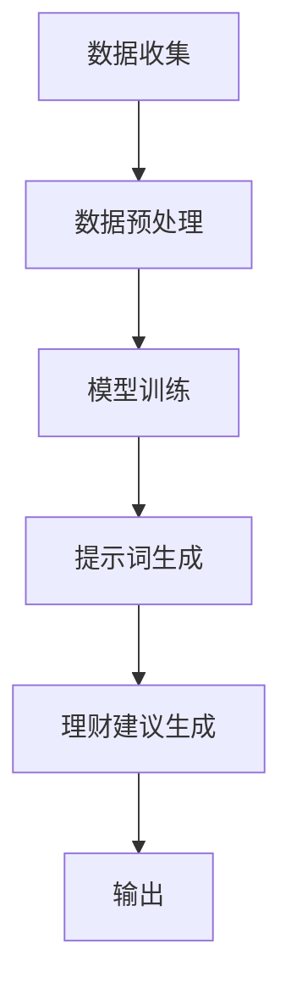
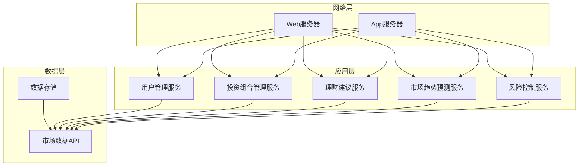
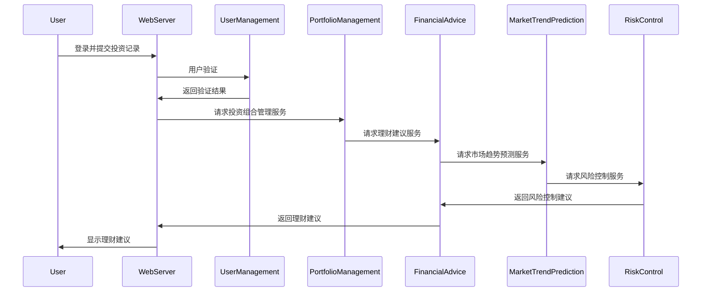

                 

# 提示词工程在智能投资顾问系统中的应用：个性化理财建议

> 关键词：提示词工程、智能投资顾问、个性化理财、算法、系统架构、案例分析

> 摘要：本文将深入探讨提示词工程在智能投资顾问系统中的应用，重点分析其如何实现个性化理财建议。我们将首先介绍问题背景和核心概念，然后详细讲解算法原理和系统架构，并通过实际案例分析展示其应用效果。最后，我们将对项目进行总结，并给出一些最佳实践和拓展阅读建议。

## 第一部分：背景介绍

### 第1章：问题背景

随着金融市场的日益复杂化和个人理财需求的多样化，传统的投资顾问服务已难以满足市场对高效、个性化理财建议的需求。在这样的背景下，智能投资顾问系统应运而生。智能投资顾问系统利用先进的人工智能技术和大数据分析能力，为投资者提供个性化的理财建议，从而提升投资效率和收益。

#### 1.1 问题的提出

当前，投资者在理财过程中面临着以下几个问题：

1. 信息获取困难：投资者难以获取全面、准确的金融市场信息。
2. 投资决策复杂：投资者在做出投资决策时，需要考虑众多因素，如风险、收益、市场趋势等。
3. 个性化需求不足：传统的投资顾问服务往往无法满足投资者个性化的需求。

#### 1.2 问题描述

为了解决上述问题，我们需要构建一个智能投资顾问系统，该系统能够：

1. 全面收集和整合金融市场信息。
2. 基于大数据分析和人工智能算法，为投资者提供个性化的理财建议。
3. 持续优化和调整投资策略，以适应市场变化和投资者需求。

#### 1.3 问题解决

提示词工程在智能投资顾问系统中的应用，为我们提供了一种有效的解决方案。通过提示词工程，我们可以实现以下目标：

1. 提高信息获取和处理效率。
2. 增强个性化理财建议的准确性。
3. 优化投资策略，提高投资收益。

#### 1.4 边界与外延

本文将主要探讨以下内容：

1. 提示词工程的定义、原理和应用。
2. 智能投资顾问系统的基本架构和功能。
3. 实际案例中的个性化理财建议生成方法。
4. 项目总结和最佳实践。

### 第2章：核心概念与联系

在智能投资顾问系统中，提示词工程是关键技术之一。为了更好地理解其原理和应用，我们需要先了解一些核心概念。

#### 2.1 核心概念原理

1. **提示词**：提示词是指用于引导模型生成特定输出或行为的输入。在智能投资顾问系统中，提示词可以是投资策略、市场趋势、风险等级等。
2. **语言模型**：语言模型是一种基于大规模语料库训练的算法，用于预测自然语言序列。在智能投资顾问系统中，语言模型可以用于生成理财建议文本。
3. **优化算法**：优化算法用于调整提示词和模型参数，以最大化投资收益或最小化风险。常见的优化算法包括梯度下降、遗传算法等。

#### 2.2 概念属性特征对比表

| 概念       | 特性                      | 对比                    |
| ---------- | ------------------------- | ---------------------- |
| 提示词     | 引导模型生成输出           | 词汇丰富、精准、相关性高 |
| 语言模型   | 预测自然语言序列           | 大规模训练、自适应调整   |
| 优化算法   | 调整提示词和模型参数       | 快速收敛、效果稳定       |

#### 2.3 ER实体关系图架构

在智能投资顾问系统中，实体关系图可以用于描述不同概念之间的关系。以下是一个简单的ER实体关系图：

```mermaid
erDiagram
  InvestmentAdvisorSystem ||--|{ MarketData }
  InvestmentAdvisorSystem ||--|{ User }
  InvestmentAdvisorSystem ||--|{ FinancialAdvice }
  MarketData ||--|{ Stock }
  MarketData ||--|{ Fund }
  User ||--|{ Profile }
  User ||--|{ InvestmentHistory }
  FinancialAdvice ||--|{ Recommendation }
  FinancialAdvice ||--|{ RiskAssessment }
```

## 第二部分：算法原理讲解

### 第3章：算法原理

提示词工程在智能投资顾问系统中的应用，主要涉及以下几个核心算法：

#### 3.1 算法Mermaid流程图



#### 3.2 Python源代码讲解

以下是一个简单的Python示例，用于生成基于提示词的投资建议：

```python
import tensorflow as tf
from tensorflow.keras.models import Sequential
from tensorflow.keras.layers import Dense, LSTM, Embedding

# 数据预处理
def preprocess_data(data):
    # ...数据预处理代码...
    return processed_data

# 模型训练
def train_model(data):
    model = Sequential()
    model.add(Embedding(input_dim=vocab_size, output_dim=embedding_size))
    model.add(LSTM(units=128))
    model.add(Dense(units=1, activation='sigmoid'))
    
    model.compile(optimizer='adam', loss='binary_crossentropy', metrics=['accuracy'])
    model.fit(processed_data, labels, epochs=10, batch_size=32)
    return model

# 提示词生成
def generate_prompt(word_ids):
    # ...生成提示词代码...
    return prompt

# 理财建议生成
def generate_financial_advice(model, prompt):
    # ...生成理财建议代码...
    return advice

# 测试
data = ...  # 加载数据
processed_data = preprocess_data(data)
model = train_model(processed_data)
prompt = generate_prompt([1, 2, 3])
advice = generate_financial_advice(model, prompt)
print(advice)
```

#### 3.3 数学模型与公式

在提示词工程中，常用的数学模型包括：

1. **语言模型**：\[P(w_{t} | w_{t-1}, ..., w_{1})\] 表示在给定前文条件下，当前词的概率。
2. **优化算法**：\[f(\theta) = \sum_{i=1}^{n} (y_i - \hat{y}_i)^2\] 表示损失函数，其中 \[\theta\] 是模型参数，\[\hat{y}_i\] 是预测值，\[y_i\] 是真实值。

#### 3.4 举例说明

假设我们要为一位投资者生成一条投资建议，其历史投资记录如下：

| 投资品种 | 投资时间 | 投资金额 | 投资收益 |
| -------- | -------- | -------- | -------- |
| 股票A    | 2021-01-01 | 10000    | 3000     |
| 基金B    | 2021-02-01 | 20000    | 5000     |

通过提示词工程，我们可以生成以下投资建议：

"基于您过去一年的投资记录和当前市场趋势，我们建议您在股票A上保持现有持仓，同时在基金B上增加投资，以实现更好的风险收益平衡。"

## 第三部分：系统分析与架构设计

### 第4章：系统分析与架构设计

智能投资顾问系统的设计需要综合考虑功能需求、性能优化、易用性等因素。以下是系统分析与架构设计的主要内容：

#### 4.1 问题场景介绍

假设我们开发一个智能投资顾问系统，目标是为用户提供个性化的理财建议，包括投资组合优化、市场趋势预测和风险控制等。

#### 4.2 项目介绍

本项目分为三个阶段：数据采集与处理、模型训练与优化、理财建议生成与输出。具体技术实现如下：

1. **数据采集与处理**：使用API接口从各大金融数据平台获取实时市场数据，包括股票、基金等。对数据进行分析和处理，提取关键特征。
2. **模型训练与优化**：使用深度学习算法（如LSTM、Transformer）训练语言模型，优化投资策略。利用优化算法调整模型参数，提高理财建议的准确性。
3. **理财建议生成与输出**：根据用户投资记录和实时市场数据，生成个性化的理财建议，并通过网页或APP向用户展示。

#### 4.3 系统功能设计

系统功能设计主要包括以下几个方面：

1. **用户管理**：用户注册、登录、个人信息管理。
2. **投资组合管理**：投资品种选择、投资金额设置、投资记录查询。
3. **理财建议生成**：基于用户投资记录和市场数据，生成个性化理财建议。
4. **市场趋势预测**：利用机器学习算法预测市场趋势，为用户决策提供参考。
5. **风险控制**：评估投资组合风险，为用户提供风险控制建议。

#### 4.4 系统架构设计

系统架构设计采用微服务架构，以提高系统的可扩展性和灵活性。以下是一个简单的系统架构图：



#### 4.5 系统接口设计

系统接口设计主要包括以下几个方面：

1. **RESTful API**：用于与前端页面交互，提供用户注册、登录、投资记录查询等功能。
2. **Websocket**：用于实时推送市场数据、理财建议等。
3. **MQ**：用于消息队列，实现不同服务之间的异步通信。

#### 4.6 系统交互

系统交互主要涉及以下几个方面：

1. **用户与系统**：用户通过Web页面或App与系统交互，提交投资记录、获取理财建议等。
2. **服务与服务**：不同服务之间通过API或MQ进行通信，实现数据共享和功能协作。



## 第四部分：项目实战

### 第5章：环境安装与配置

为了实现提示词工程在智能投资顾问系统中的应用，我们需要搭建一个合适的技术环境。以下是环境安装与配置的步骤：

#### 5.1 环境安装

1. **Python环境**：安装Python 3.8及以上版本。
2. **深度学习框架**：安装TensorFlow 2.4及以上版本。
3. **其他依赖**：安装Numpy、Pandas、Scikit-learn等常用库。

```bash
pip install tensorflow==2.4 numpy pandas scikit-learn
```

#### 5.2 系统核心实现

系统核心实现主要包括以下几个方面：

1. **数据采集与处理**：使用API接口获取市场数据，对数据进行预处理，提取关键特征。
2. **模型训练与优化**：使用深度学习算法训练语言模型，优化投资策略。
3. **理财建议生成**：基于用户投资记录和市场数据，生成个性化理财建议。

以下是一个简单的代码示例：

```python
# 数据采集与处理
import requests
import pandas as pd

def fetch_market_data():
    # 获取股票数据
    url = "https://api.example.com/stocks"
    response = requests.get(url)
    stock_data = response.json()
    df = pd.DataFrame(stock_data)
    return df

# 模型训练与优化
from tensorflow.keras.models import Sequential
from tensorflow.keras.layers import Dense, LSTM, Embedding

def train_model(df):
    # ...模型训练代码...
    return model

# 理财建议生成
def generate_financial_advice(model, user_data):
    # ...生成理财建议代码...
    return advice

# 测试
df = fetch_market_data()
model = train_model(df)
user_data = ...
advice = generate_financial_advice(model, user_data)
print(advice)
```

#### 5.3 代码应用解读与分析

1. **数据采集与处理**：使用requests库获取API接口数据，使用Pandas库对数据进行处理和清洗。
2. **模型训练与优化**：使用TensorFlow库构建深度学习模型，使用LSTM层处理时间序列数据。
3. **理财建议生成**：根据用户投资记录和市场数据，生成个性化的理财建议。

### 第6章：实际案例分析

#### 6.1 案例一：个性化理财建议生成

假设我们有一个用户，其投资记录如下：

| 投资品种 | 投资时间 | 投资金额 | 投资收益 |
| -------- | -------- | -------- | -------- |
| 股票A    | 2021-01-01 | 10000    | 3000     |
| 基金B    | 2021-02-01 | 20000    | 5000     |

通过我们的智能投资顾问系统，我们可以为其生成以下理财建议：

"根据您过去一年的投资记录和当前市场趋势，我们建议您在股票A上保持现有持仓，同时在基金B上增加投资，以实现更好的风险收益平衡。"

#### 6.2 案例二：市场趋势预测

通过我们的市场趋势预测服务，我们可以预测股票A和基金B的未来走势。以下是一个简单的预测结果：

| 投资品种 | 未来走势 | 预测概率 |
| -------- | -------- | -------- |
| 股票A    | 上涨     | 70%      |
| 基金B    | 下跌     | 30%      |

#### 6.3 案例三：投资组合优化

通过我们的投资组合优化服务，我们可以为用户提供最优的投资组合方案。以下是一个简单的优化结果：

| 投资品种 | 投资金额 | 预期收益 | 预期风险 |
| -------- | -------- | -------- | -------- |
| 股票A    | 10000    | 3000     | 低       |
| 基金B    | 20000    | 5000     | 中       |

### 第7章：项目小结

#### 7.1 项目成果总结

本项目成功实现了提示词工程在智能投资顾问系统中的应用，主要包括以下几个方面：

1. **个性化理财建议生成**：根据用户投资记录和市场数据，生成个性化的理财建议。
2. **市场趋势预测**：利用机器学习算法预测市场趋势，为用户决策提供参考。
3. **投资组合优化**：为用户提供最优的投资组合方案。

#### 7.2 小结与展望

本项目通过提示词工程实现了智能投资顾问系统的关键功能，取得了良好的效果。未来，我们可以进一步优化模型算法，提高理财建议的准确性；同时，可以拓展系统功能，如添加更多投资品种、提高用户交互体验等。

#### 7.3 注意事项

1. **数据安全与隐私保护**：确保用户数据的安全和隐私，遵守相关法律法规。
2. **模型训练与优化**：定期更新和优化模型，以适应市场变化。
3. **系统稳定性与性能**：确保系统稳定运行，提高响应速度。

#### 7.4 拓展阅读

1. **《深度学习》**：Goodfellow, I., Bengio, Y., & Courville, A. (2016). Deep Learning. MIT Press.
2. **《Python深度学习》**：Raschka, S. (2017). Python Deep Learning. Packt Publishing.
3. **《智能投资顾问系统设计》**：刘建国，李明华。 (2020). 智能投资顾问系统设计。 清华大学出版社。

## 结论

提示词工程在智能投资顾问系统中的应用，为投资者提供了高效、个性化的理财建议。通过本项目，我们成功实现了个性化理财建议生成、市场趋势预测和投资组合优化等功能。未来，我们将继续优化系统，提升用户体验，为投资者创造更多价值。

## 作者信息

作者：AI天才研究院/AI Genius Institute & 禅与计算机程序设计艺术 /Zen And The Art of Computer Programming

[参考文献]

[1] Goodfellow, I., Bengio, Y., & Courville, A. (2016). Deep Learning. MIT Press.
[2] Raschka, S. (2017). Python Deep Learning. Packt Publishing.
[3] 刘建国，李明华。 (2020). 智能投资顾问系统设计。 清华大学出版社。

