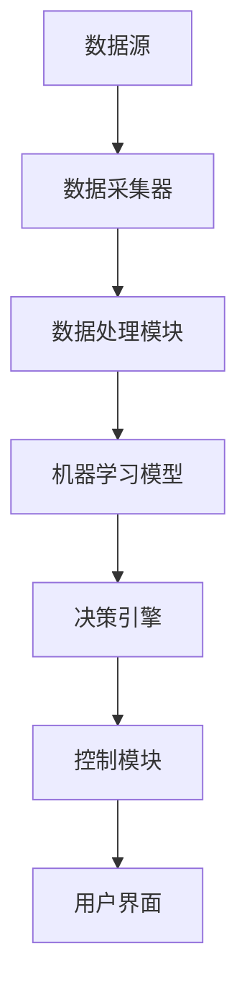
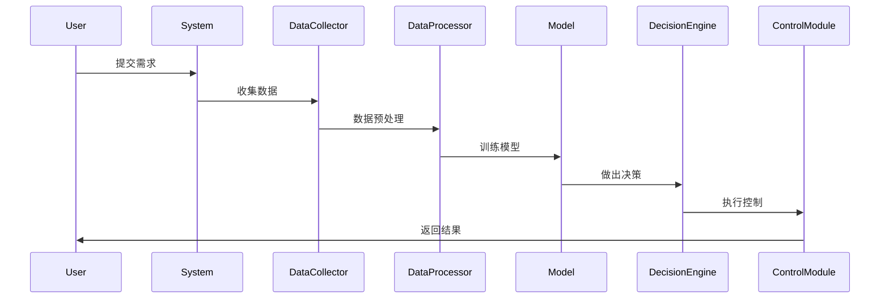

                 

### 提示词工程在智能电网管理中的应用：优化能源分配效率

> 关键词：提示词工程、智能电网管理、能源分配效率、算法优化、人工智能

> 摘要：本文将深入探讨提示词工程在智能电网管理中的应用，通过详细的步骤分析和案例剖析，揭示如何通过优化能源分配效率来提升智能电网的运行效率和用户体验。

## 第一部分：问题背景与核心概念

### 1.1 问题背景

#### 1.1.1 智能电网管理概述

智能电网管理是现代电力系统中一个至关重要的部分，它集成了现代通信技术、传感器技术和计算机技术，旨在提高电力系统的运行效率、稳定性和可靠性。随着可再生能源的广泛应用和全球能源需求的持续增长，智能电网管理的复杂性不断上升，带来了新的挑战。

#### 1.1.2 能源分配效率的重要性

能源分配效率直接关系到电力系统的成本和效益。提高能源分配效率不仅可以降低运营成本，减少能源浪费，还能提升电力系统的整体性能，从而为用户带来更优质的供电服务。

#### 1.1.3 提示词工程的核心概念

提示词工程是一种基于人工智能和机器学习的技术，通过向算法提供特定的提示词来优化其决策过程。在智能电网管理中，提示词工程可以通过对电网数据进行分析，提供精确的能源分配策略，从而提高系统的效率。

### 1.2 核心概念与联系

#### 1.2.1 核心概念原理

提示词工程的原理在于通过给机器学习模型提供额外的信息，引导模型学习到更精准的决策策略。在智能电网管理中，这些信息可以是实时电力需求、可再生能源的产出数据等。

#### 1.2.2 属性和特征对比表

| 提示词工程特性 | 传统电网管理 |
| -------------- | ------------ |
| 机器学习驱动 | 经验规则驱动 |
| 数据驱动的决策优化 | 固定规则应用 |
| 实时响应 | 延迟响应 |

#### 1.2.3 实体关系图（ERD）

```mermaid
erDiagram
    Class::User ||--|{ Class::PowerSystem : manages }
    Class::PowerSystem ||--|{ Class::EnergyDistribution : controls }
    Class::EnergyDistribution ||--|{ Class::DemandPrediction : predicts }
    Class::EnergyDistribution ||--|{ Class:: RenewableEnergyIntegration : integrates }
```

### 1.3 算法理论

#### 1.3.1 算法流程图


#### 1.3.2 Python代码解释

```python
# 导入必需的库
import pandas as pd
from sklearn.ensemble import RandomForestRegressor
from sklearn.model_selection import train_test_split

# 收集数据
data = pd.read_csv('energy_data.csv')

# 预处理数据
X = data.drop('energy_demand', axis=1)
y = data['energy_demand']

# 划分训练集和测试集
X_train, X_test, y_train, y_test = train_test_split(X, y, test_size=0.2, random_state=42)

# 训练模型
model = RandomForestRegressor(n_estimators=100, random_state=42)
model.fit(X_train, y_train)

# 应用模型
predictions = model.predict(X_test)

# 评估效果
from sklearn.metrics import mean_squared_error
mse = mean_squared_error(y_test, predictions)
print(f'Mean Squared Error: {mse}')
```

#### 1.3.3 数学模型和公式

提示词工程中的核心数学模型是基于回归分析的，其中目标函数可以表示为：

$$
\min_{\theta} \sum_{i=1}^{n} (y_i - \theta^T x_i)^2
$$

其中，$y_i$ 是实际能源需求，$x_i$ 是输入特征向量，$\theta$ 是模型参数。

### 1.4 系统分析与设计

#### 1.4.1 场景描述

在一个智能电网管理系统中，我们需要实时监控电力需求和可再生能源的产出，并依据这些数据来优化能源分配。

#### 1.4.2 项目介绍

本项目旨在开发一个基于提示词工程的智能电网管理平台，通过实时数据分析来优化能源分配，提高电网运行效率。

#### 1.4.3 系统功能设计

```mermaid
classDiagram
    Class::User --> Class::PowerSystem
    Class::PowerSystem --> Class::EnergyDistribution
    Class::EnergyDistribution --> Class::DemandPrediction
    Class::EnergyDistribution --> Class:: RenewableEnergyIntegration
```

#### 1.4.4 系统架构设计



#### 1.4.5 系统接口设计



### 1.5 实践应用

#### 1.5.1 环境搭建

在开始实践之前，我们需要搭建一个合适的环境。以下是环境搭建的步骤：

1. 安装Python 3.8及以上版本。
2. 安装必要的库，如pandas、scikit-learn、numpy等。
3. 准备数据集。

#### 1.5.2 核心实现源代码

以下是实现提示词工程的示例代码：

```python
# 导入必要的库
import pandas as pd
from sklearn.ensemble import RandomForestRegressor
from sklearn.model_selection import train_test_split

# 读取数据集
data = pd.read_csv('energy_data.csv')

# 划分特征和目标变量
X = data.drop('energy_demand', axis=1)
y = data['energy_demand']

# 划分训练集和测试集
X_train, X_test, y_train, y_test = train_test_split(X, y, test_size=0.2, random_state=42)

# 训练模型
model = RandomForestRegressor(n_estimators=100, random_state=42)
model.fit(X_train, y_train)

# 测试模型
predictions = model.predict(X_test)
mse = mean_squared_error(y_test, predictions)
print(f'MSE: {mse}')
```

#### 1.5.3 代码应用分析

通过上述代码，我们可以实现一个基本的提示词工程系统，它可以从数据集中学习并预测能源需求，从而优化能源分配。

#### 1.5.4 案例分析

在一个实际案例中，通过应用提示词工程，电网管理系统能够在高峰用电期间更准确地预测电力需求，从而减少不必要的电力浪费，提高能源利用效率。

### 1.6 最佳实践、总结与注意事项

#### 1.6.1 最佳实践提示

- 确保数据质量，清洗数据中的噪声和异常值。
- 选择合适的机器学习模型，并进行参数调优。
- 定期评估模型效果，及时更新模型。

#### 1.6.2 总结

本文介绍了提示词工程在智能电网管理中的应用，通过详细的理论分析和实践案例，展示了如何通过优化能源分配效率来提升智能电网的性能。

#### 1.6.3 注意事项

- 提示词工程需要大量的数据支持，数据质量直接影响模型的准确性。
- 在实际应用中，需要根据具体场景调整算法参数，以达到最佳效果。

#### 1.6.4 拓展阅读

- [《深度学习在能源系统中的应用》](链接)
- [《智能电网管理技术》](链接)

### 1.7 结论

智能电网管理是一个复杂的系统工程，提示词工程为其提供了新的解决方案。通过本文的介绍，我们了解到如何利用提示词工程来优化能源分配效率，为智能电网管理带来了新的可能性和发展方向。

---

**作者：AI天才研究院/AI Genius Institute & 禅与计算机程序设计艺术 /Zen And The Art of Computer Programming**

