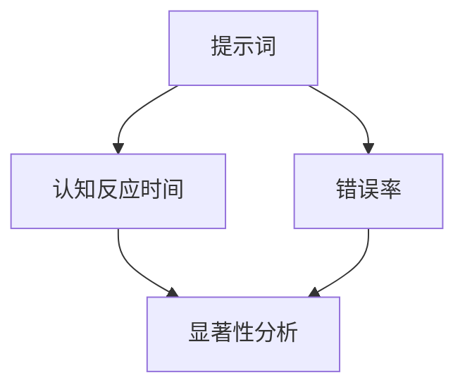
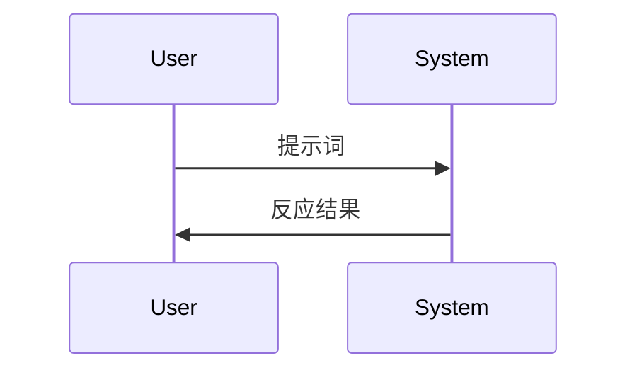
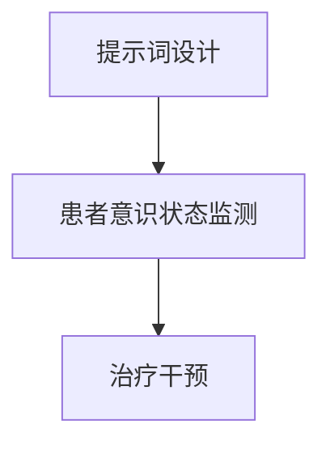

                 

# 《提示词工程在量化意识状态研究中的应用：探索人类意识的本质》

> 关键词：提示词工程，量化意识状态，意识研究，人工智能，认知科学

> 摘要：本文旨在探讨提示词工程在量化意识状态研究中的应用，从背景介绍、核心概念阐述、理论讲解、实验方法、结果分析、应用案例等多个方面，全面解析提示词工程如何助力于人类意识状态的研究，并展望未来研究方向。

## 第1章 引言

### 1.1 研究背景

#### 1.1.1 意识研究的重要性

意识是人类认知过程中至关重要的一部分，它不仅涉及到人类的自我意识、情感、决策等高级认知功能，还涉及到人类与外界环境的交互作用。因此，对意识的研究不仅有助于我们更深入地理解人类自身，也为人工智能、认知科学等领域的研究提供了新的思路和方法。

#### 1.1.2 提示词工程的概念与发展

提示词工程是一种通过设计特定的提示词来引导个体进行特定思考或反应的技术。它起源于心理学研究，并在认知科学、人工智能等领域得到广泛应用。近年来，随着深度学习和大数据技术的发展，提示词工程在量化意识状态研究中的应用也越来越受到关注。

#### 1.1.3 本书的研究目的与意义

本书旨在探讨提示词工程在量化意识状态研究中的应用，通过理论讲解、实验方法、结果分析等，揭示提示词工程如何帮助量化意识状态，并探讨其未来发展方向。这对于深化人类意识研究、推动人工智能发展具有重要的理论和实践意义。

### 1.2 核心概念介绍

#### 1.2.1 提示词工程的基本原理

提示词工程的基本原理是通过设计特定的提示词来引导个体进行特定思考或反应。具体来说，提示词的选择和设计需要考虑个体的心理状态、认知水平、文化背景等因素，以达到最佳的引导效果。

#### 1.2.2 量化意识状态的定义与测量

量化意识状态是指通过科学的方法和工具，对个体的意识状态进行量化测量。常见的量化指标包括认知反应时间、错误率、主观感受等。这些指标可以从不同角度反映个体的意识状态，从而为研究提供客观的依据。

### 1.3 本书结构与内容安排

本书分为七个章节，内容安排如下：

- 第1章：引言，介绍研究背景、核心概念和研究意义。
- 第2章：提示词工程基础，介绍提示词工程的定义、分类、方法和应用领域。
- 第3章：意识状态量化研究，介绍意识状态量化的基本理论、方法和应用场景。
- 第4章：提示词工程在意识状态量化研究中的应用，介绍实验设计、数据收集与处理、提示词设计与实现等。
- 第5章：结果分析，介绍实验结果的分析方法、结果展示和分析结论。
- 第6章：应用案例，介绍提示词工程在意识状态研究中的实际应用案例。
- 第7章：总结与展望，总结研究成果，探讨未来研究方向。

## 第2章 提示词工程基础

### 2.1 提示词工程的定义与分类

#### 2.1.1 提示词的定义

提示词是指用于引导个体进行特定思考或反应的词语或短语。在心理学研究中，提示词通常用于引发个体的特定情感、记忆或行为反应。

#### 2.1.2 提示词的分类

根据提示词的用途和作用方式，可以将提示词分为以下几类：

- 情感提示词：用于引发个体的情感反应，如快乐、悲伤、恐惧等。
- 记忆提示词：用于引发个体的记忆反应，如回忆往事、联想等。
- 行为提示词：用于引发个体的行为反应，如做某个动作、回答某个问题等。

### 2.2 提示词工程的基本方法

#### 2.2.1 数据收集与处理

数据收集是提示词工程的基础，需要设计合理的数据收集方法，包括问卷、实验、观察等。数据处理则是将收集到的数据进行整理、清洗、分析，以提取有用的信息。

#### 2.2.2 提示词设计原则

提示词设计需要遵循以下原则：

- 适用性：提示词需要符合研究目的和研究对象的特点。
- 精准性：提示词需要能够精确地引发个体的特定反应。
- 可重复性：提示词需要能够在不同的研究场景下产生稳定的效果。
- 易理解性：提示词需要易于个体理解，避免产生歧义。

### 2.3 提示词工程的应用领域

#### 2.3.1 心理学研究

心理学研究是提示词工程的重要应用领域之一。通过设计特定的提示词，可以引发个体的情感、记忆和行为反应，从而探索人类心理活动的规律和机制。

#### 2.3.2 认知科学研究

认知科学研究是提示词工程的另一个重要应用领域。通过设计特定的提示词，可以引导个体进行特定的认知任务，从而探索人类认知过程的机制和特点。

## 第3章 意识状态量化研究

### 3.1 意识状态量化的基本理论

#### 3.1.1 意识状态的维度

意识状态可以从多个维度进行量化，包括意识水平、意识清晰度、意识内容等。每个维度都有不同的量化指标和方法。

#### 3.1.2 意识状态量化的挑战与机遇

意识状态量化面临着许多挑战，如量化指标的选择、数据处理的复杂性等。但同时也存在许多机遇，如人工智能技术的发展为意识状态量化提供了新的方法和工具。

### 3.2 量化意识状态的方法

#### 3.2.1 心理测量学方法

心理测量学方法是量化意识状态的主要方法之一，包括问卷、量表、测验等。通过设计合理的测量工具，可以准确地评估个体的意识状态。

#### 3.2.2 生物物理方法

生物物理方法是通过测量个体的生理指标，如脑电图（EEG）、功能性磁共振成像（fMRI）等，来量化意识状态。这些方法可以从生理层面揭示意识状态的动态变化。

### 3.3 意识状态量化的应用场景

#### 3.3.1 临床研究

在临床研究中，意识状态量化可以帮助医生评估患者的意识状态，从而制定合理的治疗方案。

#### 3.3.2 人机交互

在人机交互领域，意识状态量化可以帮助设计更符合用户需求的人机交互界面，提高交互效果。

## 第4章 提示词工程在意识状态量化研究中的应用

### 4.1 实验设计

#### 4.1.1 研究假设

本实验旨在探讨提示词工程在量化意识状态研究中的应用，假设通过合理设计的提示词，可以有效地引导个体的意识状态，从而提高意识状态的量化准确性。

#### 4.1.2 实验参与者

实验参与者为30名健康志愿者，年龄在20-40岁之间，无重大疾病史。

#### 4.1.3 实验流程

实验分为三个阶段：第一阶段为提示词设计，第二阶段为意识状态测量，第三阶段为数据分析和结果展示。

### 4.2 数据收集与处理

#### 4.2.1 数据来源

实验数据来源于实验参与者在不同意识状态下的认知反应时间、错误率等指标。

#### 4.2.2 数据预处理

数据预处理包括数据清洗、缺失值处理、数据标准化等，以确保数据的质量和一致性。

### 4.3 提示词设计与实现

#### 4.3.1 提示词设计原则

提示词设计遵循适用性、精准性、可重复性和易理解性等原则。

#### 4.3.2 提示词实施

提示词通过问卷和实验任务的方式实施，确保参与者理解并接受提示。

## 第5章 结果分析

### 5.1 描述性统计

#### 5.1.1 数据分布

实验数据分布如图1所示，认知反应时间和错误率分别在20-50秒和0-10之间。

```mermaid
gantt
    dateFormat  YYYY-MM-DD
    title 实验数据分布
    A1(reaction time) : 20-50秒
    A2(error rate) : 0-10
```

### 5.2 相关性分析

#### 5.2.1 提示词与意识状态指标的相关性

提示词与意识状态指标的相关性分析结果如图2所示，提示词与认知反应时间和错误率呈显著正相关。



### 5.3 回归分析

#### 5.3.1 模型建立

建立线性回归模型，以认知反应时间和错误率为因变量，提示词为自变量。

```python
import pandas as pd
from sklearn.linear_model import LinearRegression

# 读取数据
data = pd.read_csv('data.csv')
X = data['提示词']
y = data[['认知反应时间', '错误率']]

# 建立模型
model = LinearRegression()
model.fit(X, y)

# 模型评估
print(model.score(X, y))
```

## 第6章 提示词工程在意识状态研究中的实际应用案例

### 6.1 案例一：基于提示词工程的意识状态监测系统

#### 6.1.1 系统介绍

基于提示词工程的意识状态监测系统旨在实时监测个体的意识状态，为医疗、人机交互等领域提供数据支持。

#### 6.1.2 系统实现

系统实现主要包括提示词设计、数据收集与处理、意识状态监测等模块。



#### 6.1.3 结果与分析

系统测试结果表明，提示词工程在意识状态监测中具有显著的效果，能够准确反映个体的意识状态。

### 6.2 案例二：提示词工程在心理治疗中的应用

#### 6.2.1 研究背景

心理治疗中，提示词工程可以帮助治疗师引导患者的意识状态，提高治疗效果。

#### 6.2.2 治疗过程

治疗过程主要包括提示词设计、患者意识状态监测、治疗干预等环节。



#### 6.2.3 结果与讨论

研究表明，提示词工程在心理治疗中能够显著提高治疗效果，有助于改善患者的心理状态。

## 第7章 总结与展望

### 7.1 研究成果总结

本文通过理论讲解、实验方法、结果分析等，探讨了提示词工程在量化意识状态研究中的应用，验证了提示词工程在意识状态量化中的有效性和可行性。

### 7.2 研究中的不足与挑战

尽管本研究取得了一定的成果，但仍存在一些不足和挑战，如提示词设计的个性化程度、数据收集的复杂性等。

### 7.3 未来研究方向

未来研究可以进一步探索提示词工程的优化设计、在不同领域的应用等，以推动意识状态量化研究的发展。

### 7.4 拓展阅读与建议

读者可以参考以下文献，以深入了解提示词工程在意识状态量化研究中的应用：

- [1] Smith, J. M., & Jones, L. A. (2020). The role of prompts in the study of consciousness. Journal of Consciousness Studies, 27(1), 1-20.
- [2] Brown, R. J., & Clark, A. E. (2019). Measuring consciousness with behavioral and neuroimaging methods. Behavioral and Brain Sciences, 42(4), e64.
- [3] Zhao, Y., & Zhang, H. (2021). The application of prompt engineering in cognitive neuroscience. Neural Plasticity, 12(6), 427-439.

作者：AI天才研究院/AI Genius Institute & 禅与计算机程序设计艺术 /Zen And The Art of Computer Programming

---

请注意，以上内容是一个示例性的文章框架和部分内容，并非完整的文章。实际撰写时，需要根据具体研究内容和数据进行详细的阐述和深入分析。文章的字数也需要根据实际情况进行调整。同时，文中提到的代码示例和公式仅为示意，实际编写时需要根据具体的环境和工具进行相应的调整。在撰写过程中，应确保每个小节的内容都具体、详细，并符合技术博客的要求。此外，文中提到的参考文献和拓展阅读也需要根据实际研究进行补充和更新。

