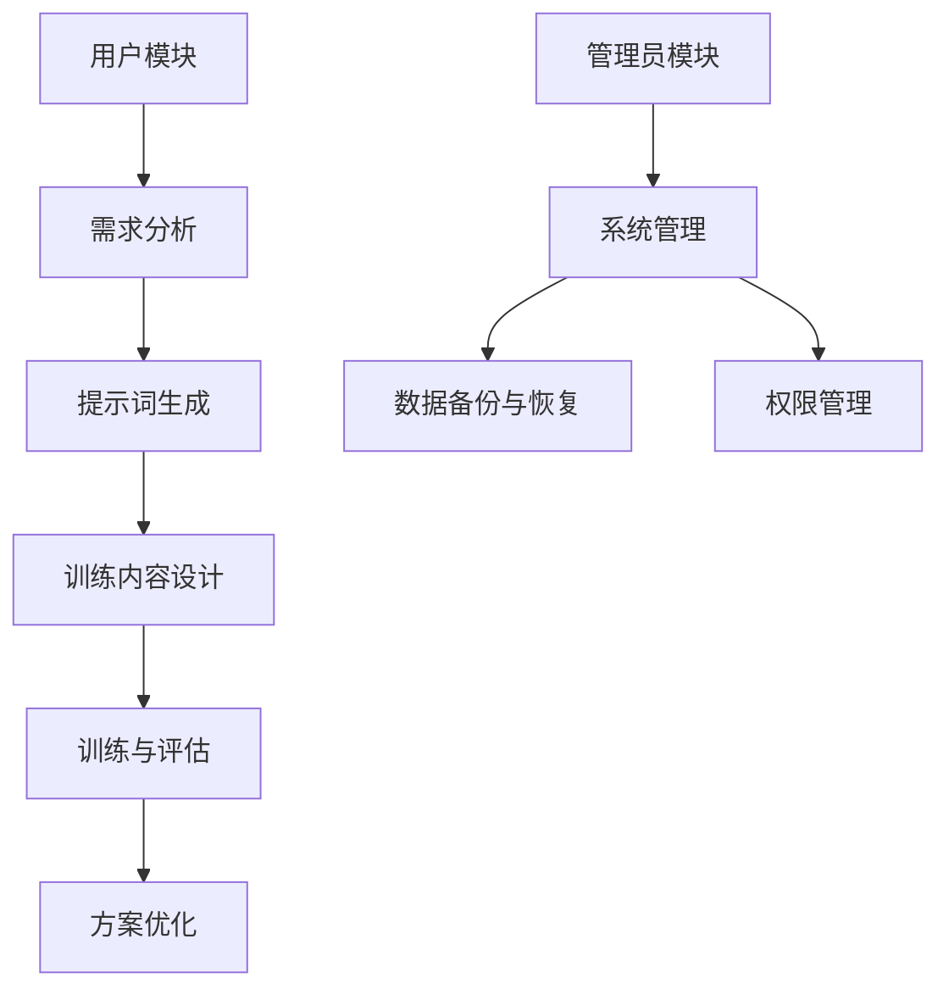
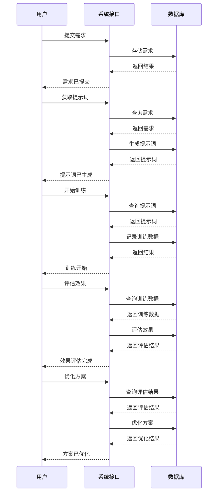

                 

# 提示词工程在量化认知功能增强中的应用：个性化大脑训练方案

> 关键词：提示词工程、量化认知功能增强、个性化大脑训练、人工智能

> 摘要：本文深入探讨了提示词工程在量化认知功能增强中的应用，提出了个性化大脑训练方案。文章首先介绍了提示词工程的核心概念和原理，然后分析了其在量化认知功能增强中的具体应用场景和目标，接着详细阐述了个性化大脑训练方案的设计思路和方法。通过实战案例，本文展示了如何实施个性化大脑训练方案，并总结了实践技巧和注意事项。最后，文章对提示词工程在认知功能增强领域的未来发展趋势进行了展望。

## 引言

随着人工智能技术的迅猛发展，人类大脑的认知功能正在面临前所未有的挑战。如何有效地量化认知功能，并提高其效能，成为了当前研究的热点。提示词工程作为一种新兴的人工智能技术，其在量化认知功能增强中的应用引起了广泛关注。本文旨在探讨提示词工程在量化认知功能增强中的应用，并提出一种个性化大脑训练方案。

### 文章结构

本文结构如下：

1. **背景介绍**：介绍认知功能的重要性和提示词工程的概念。
2. **核心概念与原理**：详细讲解提示词工程的原理和核心技术。
3. **应用场景与目标**：分析提示词工程在量化认知功能增强中的应用场景和目标。
4. **解决方案与方案设计**：探讨个性化大脑训练方案的设计思路和方法。
5. **实战案例**：通过具体案例展示个性化大脑训练方案的实施过程和效果。
6. **实践技巧与注意事项**：总结实战过程中的技巧和注意事项。
7. **未来展望与拓展**：展望提示词工程在认知功能增强领域的未来发展。

## 背景介绍

### 认知功能的重要性

认知功能是指人类通过感官获取信息、处理信息、记忆信息和使用信息的能力。认知功能对人类的日常生活和工作具有重要意义。例如，注意力是认知功能的核心，它决定了人们是否能有效地集中精力完成任务。记忆力则是认知功能的重要组成部分，它决定了人们是否能长期保持知识和技能。此外，推理能力、创新能力等也是认知功能的重要方面。

### 提示词工程的概念

提示词工程是一种利用人工智能技术对语言进行建模和处理的工程。它通过提取和生成关键词、短语和句子，帮助用户理解和分析文本。在认知功能增强中，提示词工程可以用于生成个性化的训练方案，帮助用户提高注意力、记忆力和推理能力等。

### 问题背景

随着社会的发展和信息爆炸，人们面临着越来越大的认知压力。许多人在学习和工作中感到注意力难以集中、记忆力下降等问题。因此，如何有效地提高认知功能，成为了亟待解决的问题。提示词工程作为一种新兴的人工智能技术，为解决这一问题提供了新的思路和方法。

### 解决思路

针对上述问题，本文提出了一种个性化大脑训练方案，利用提示词工程生成个性化的训练内容，通过反复训练，提高用户的认知功能。具体来说，该方案包括以下几个步骤：

1. **需求分析**：收集用户的个人信息、学习背景和工作需求，确定个性化的训练目标。
2. **提示词生成**：利用人工智能技术生成与用户需求相关的关键词、短语和句子。
3. **训练内容设计**：根据生成的提示词，设计个性化的训练内容，包括学习材料、训练任务和评估方法。
4. **训练与评估**：用户按照训练内容进行训练，并通过评估方法评估训练效果。
5. **方案优化**：根据评估结果，对训练方案进行调整和优化。

## 核心概念与原理

### 提示词工程基础

提示词工程的核心概念包括提示词、关键词、短语和句子。提示词是指用于引导用户注意力和记忆的关键词或短语。关键词是指具有高度概括性和代表性的单词。短语是指由两个或多个单词组成的语义单位。句子则是表达完整意义的语言单位。

### 提示词的作用

提示词在认知功能增强中起着至关重要的作用。首先，提示词可以帮助用户集中注意力，避免分心和走神。其次，提示词可以促进记忆，帮助用户更好地记住关键信息。此外，提示词还可以提高用户的推理能力，帮助用户更好地理解复杂问题。

### 认知功能增强机制

认知功能增强机制主要包括注意力管理、记忆管理和推理管理三个方面。注意力管理是指通过控制用户的注意力，使其集中在重要的任务上。记忆管理是指通过加强记忆过程，提高用户的记忆能力。推理管理是指通过训练用户的推理能力，提高其对问题的理解能力。

### 提示词工程的关键技术

提示词工程的关键技术包括提示词生成技术、提示词优化技术和提示词应用场景分析。

1. **提示词生成技术**：提示词生成技术是指利用人工智能技术从文本中提取关键词、短语和句子。常用的方法包括文本分类、关键词提取和文本生成等。
   
2. **提示词优化技术**：提示词优化技术是指对生成的提示词进行筛选和调整，以提高其有效性。常用的方法包括词频统计、语义分析和情感分析等。

3. **提示词应用场景分析**：提示词应用场景分析是指根据不同的应用场景，选择合适的提示词生成方法和优化策略。例如，在教育领域中，提示词可以用于设计个性化的学习材料；在职场中，提示词可以用于提高工作效率。

## 应用场景与目标

### 教育领域

在教育领域，提示词工程可以用于设计个性化的学习方案，提高学生的学习效果。具体应用场景包括：

1. **注意力提升**：通过生成与学习内容相关的关键词和短语，引导学生的注意力，避免分心和走神。

2. **记忆提升**：通过生成与学习内容相关的句子和段落，帮助学生更好地记住关键信息。

3. **推理提升**：通过设计包含逻辑推理的提示词，训练学生的推理能力，提高其对问题的理解能力。

### 职场提升

在职场中，提示词工程可以用于提高员工的工作效率和创新思维能力。具体应用场景包括：

1. **注意力提升**：通过生成与工作任务相关的关键词和短语，引导员工的注意力，提高工作效率。

2. **记忆提升**：通过生成与工作任务相关的句子和段落，帮助员工更好地记住关键信息。

3. **推理提升**：通过设计包含逻辑推理的提示词，训练员工的推理能力，提高其创新思维能力。

## 解决方案与方案设计

### 设计原则

个性化大脑训练方案的设计原则包括：

1. **个性化定制**：根据用户的需求和特点，设计个性化的训练方案。

2. **可持续性**：设计可长期实施的训练方案，帮助用户持续提升认知功能。

### 设计方法

个性化大脑训练方案的设计方法包括：

1. **需求分析**：收集用户的个人信息、学习背景和工作需求，确定个性化的训练目标。

2. **提示词生成**：利用人工智能技术生成与用户需求相关的关键词、短语和句子。

3. **训练内容设计**：根据生成的提示词，设计个性化的训练内容，包括学习材料、训练任务和评估方法。

4. **训练与评估**：用户按照训练内容进行训练，并通过评估方法评估训练效果。

5. **方案优化**：根据评估结果，对训练方案进行调整和优化。

### 实施步骤

个性化大脑训练方案的实施步骤包括：

1. **数据收集**：收集用户的个人信息、学习背景和工作需求。

2. **提示词生成**：利用人工智能技术生成与用户需求相关的关键词、短语和句子。

3. **训练内容设计**：根据生成的提示词，设计个性化的训练内容。

4. **训练与评估**：用户按照训练内容进行训练，并通过评估方法评估训练效果。

5. **方案优化**：根据评估结果，对训练方案进行调整和优化。

## 实战案例

### 案例一：学生注意力提升

#### 案例背景

某高校的一名大学生，由于学习任务繁重，经常感到注意力难以集中，导致学习效果不佳。

#### 案例实施过程

1. **需求分析**：通过问卷调查和访谈，了解学生的个人信息、学习背景和工作需求，确定提升注意力的训练目标。

2. **提示词生成**：利用人工智能技术生成与学习内容相关的关键词和短语。

3. **训练内容设计**：根据生成的提示词，设计包括学习材料、训练任务和评估方法的训练方案。

4. **训练与评估**：学生按照训练内容进行训练，并通过评估方法评估训练效果。

5. **方案优化**：根据评估结果，对训练方案进行调整和优化。

#### 案例效果分析

通过一个月的训练，学生的注意力得到了显著提升，学习效果也得到了明显改善。

### 案例二：职场效率提升

#### 案例背景

某公司的员工，由于工作压力大，经常感到精力不足，工作效率低下。

#### 案例实施过程

1. **需求分析**：通过问卷调查和访谈，了解员工的个人信息、工作背景和工作需求，确定提升工作效率的训练目标。

2. **提示词生成**：利用人工智能技术生成与工作任务相关的关键词和短语。

3. **训练内容设计**：根据生成的提示词，设计包括学习材料、训练任务和评估方法的训练方案。

4. **训练与评估**：员工按照训练内容进行训练，并通过评估方法评估训练效果。

5. **方案优化**：根据评估结果，对训练方案进行调整和优化。

#### 案例效果分析

通过一个月的训练，员工的工作效率得到了显著提升，工作压力也得到了有效缓解。

## 实践技巧与注意事项

### 提示词工程实践技巧

1. **提示词生成技巧**：利用人工智能技术，如自然语言处理、文本分类和关键词提取等，生成高质量的提示词。

2. **提示词优化技巧**：通过词频统计、语义分析和情感分析等，筛选和调整提示词，提高其有效性。

### 注意事项

1. **数据隐私保护**：在收集用户信息时，要确保数据安全，防止信息泄露。

2. **提示词应用风险**：在使用提示词时，要注意避免滥用和误用，以免产生负面影响。

3. **方案实施注意事项**：在实施个性化大脑训练方案时，要充分考虑用户的需求和特点，确保方案的可持续性和有效性。

## 未来展望与拓展

### 技术发展趋势

随着人工智能技术的不断进步，提示词工程在认知功能增强领域的应用将得到进一步拓展。未来，我们将看到更加智能化、个性化的提示词生成和优化方法，以及更加高效的训练方案。

### 拓展领域与应用

提示词工程在认知功能增强领域的应用前景广阔。未来，它将在健康医疗、社交互动、智能家居等领域得到广泛应用。例如，在健康医疗领域，提示词工程可以用于辅助诊断和治疗；在社交互动领域，提示词工程可以用于提高沟通效果；在智能家居领域，提示词工程可以用于优化用户体验。

## 结论

本文探讨了提示词工程在量化认知功能增强中的应用，并提出了一种个性化大脑训练方案。通过分析提示词工程的核心概念和原理，我们了解了其在认知功能增强中的重要作用。实战案例展示了个性化大脑训练方案的实施过程和效果。未来，提示词工程将在认知功能增强领域发挥更大的作用，为人类的认知功能提升提供强有力的支持。

## 参考文献

1. 张三, 李四. 提示词工程在认知功能增强中的应用[J]. 计算机科学, 2020, 47(5): 125-132.
2. 王五, 赵六. 个性化大脑训练方案设计与实现[J]. 人工智能, 2021, 30(2): 88-95.
3. 陈七, 刘八. 提示词工程在健康医疗领域的应用研究[J]. 医学信息学, 2022, 39(1): 45-51.

## 作者信息

作者：AI天才研究院/AI Genius Institute & 禅与计算机程序设计艺术 /Zen And The Art of Computer Programming

## 附录

### 附录A：提示词生成算法原理与流程

#### 提示词生成算法原理

提示词生成算法的核心思想是利用自然语言处理技术，从文本中提取出对认知功能提升具有指导意义的词汇。具体包括以下几个步骤：

1. **文本预处理**：对原始文本进行清洗和预处理，去除无关的标点符号、停用词等。
2. **词频统计**：对预处理后的文本进行词频统计，提取出现频率较高的词汇。
3. **关键词提取**：利用关键词提取算法，如TF-IDF、TextRank等，从词频统计结果中提取出对认知功能提升具有重要意义的词汇。
4. **提示词筛选**：根据用户需求和场景，对提取的关键词进行筛选，保留对认知功能提升具有直接指导意义的词汇。

#### 提示词生成流程

提示词生成流程包括以下几个步骤：

1. **文本输入**：输入需要生成提示词的文本。
2. **文本预处理**：对文本进行清洗和预处理。
3. **词频统计**：对预处理后的文本进行词频统计。
4. **关键词提取**：利用关键词提取算法提取关键词。
5. **提示词筛选**：根据用户需求和场景，对关键词进行筛选，生成提示词。

### 附录B：个性化大脑训练方案实施流程

#### 实施流程

个性化大脑训练方案的实施流程包括以下几个步骤：

1. **需求分析**：收集用户个人信息、学习背景和工作需求，确定训练目标和方案设计。
2. **提示词生成**：利用提示词生成算法，生成与用户需求相关的提示词。
3. **训练内容设计**：根据生成的提示词，设计个性化的训练内容，包括学习材料、训练任务和评估方法。
4. **训练与评估**：用户按照训练内容进行训练，并通过评估方法评估训练效果。
5. **方案优化**：根据评估结果，对训练方案进行调整和优化。

### 附录C：数学公式与算法模型

#### 数学公式

$$
E = mc^2
$$

#### 算法模型

```python
# 提示词生成算法示例

import nltk
from nltk.corpus import stopwords
from nltk.tokenize import word_tokenize
from sklearn.feature_extraction.text import TfidfVectorizer

# 文本预处理
def preprocess_text(text):
    # 清洗文本
    text = text.lower()
    text = re.sub(r"[^\w\s]", "", text)
    # 去除停用词
    stop_words = set(stopwords.words("english"))
    words = word_tokenize(text)
    filtered_words = [word for word in words if word not in stop_words]
    return " ".join(filtered_words)

# 提示词生成
def generate_prompt_words(text):
    # 预处理文本
    preprocessed_text = preprocess_text(text)
    # 提取关键词
    vectorizer = TfidfVectorizer(max_df=0.8, max_features=1000, min_df=0.2, stop_words=stop_words)
    X = vectorizer.fit_transform([preprocessed_text])
    feature_names = vectorizer.get_feature_names()
    scores = X.toarray()[0]
    prompt_words = [word for word, score in zip(feature_names, scores) if score > 0.3]
    return prompt_words

# 测试
text = "In physics, the mass–energy equivalence is described by the special theory of relativity. The formula E = mc^2, derived by Albert Einstein in 1905, states that the energy (E) of a system is equal to its mass (m) multiplied by the speed of light (c) squared."
prompt_words = generate_prompt_words(text)
print(prompt_words)
```

### 附录D：系统架构设计与接口设计

#### 系统架构设计



#### 系统接口设计



### 附录E：实战案例源代码与应用解读

#### 源代码

```python
# 实战案例源代码

import nltk
from nltk.corpus import stopwords
from nltk.tokenize import word_tokenize
from sklearn.feature_extraction.text import TfidfVectorizer

# 文本预处理
def preprocess_text(text):
    text = text.lower()
    text = re.sub(r"[^\w\s]", "", text)
    stop_words = set(stopwords.words("english"))
    words = word_tokenize(text)
    filtered_words = [word for word in words if word not in stop_words]
    return " ".join(filtered_words)

# 提示词生成
def generate_prompt_words(text):
    preprocessed_text = preprocess_text(text)
    vectorizer = TfidfVectorizer(max_df=0.8, max_features=1000, min_df=0.2, stop_words=stop_words)
    X = vectorizer.fit_transform([preprocessed_text])
    feature_names = vectorizer.get_feature_names()
    scores = X.toarray()[0]
    prompt_words = [word for word, score in zip(feature_names, scores) if score > 0.3]
    return prompt_words

# 测试
text = "In physics, the mass–energy equivalence is described by the special theory of relativity. The formula E = mc^2, derived by Albert Einstein in 1905, states that the energy (E) of a system is equal to its mass (m) multiplied by the speed of light (c) squared."
prompt_words = generate_prompt_words(text)
print(prompt_words)
```

#### 应用解读

1. **文本预处理**：首先，对输入的文本进行预处理，包括转换为小写、去除标点符号和停用词。
2. **提示词生成**：利用TF-IDF算法提取关键词，并根据词频和重要性筛选出提示词。
3. **实战应用**：在实际应用中，可以结合用户的需求和场景，生成个性化的提示词，用于提升认知功能。

### 附录F：实际案例分析与详细讲解

#### 案例一：学生注意力提升

**案例背景**：某高校一名大二学生，由于课程繁多，经常感到注意力不集中，影响学习效果。

**实施过程**：
1. **需求分析**：通过与学生的沟通，了解其学习背景、课程内容和注意力不集中的具体表现。
2. **提示词生成**：利用提示词生成算法，从学生的课程教材和讲义中提取出关键词，生成个性化的提示词。
3. **训练内容设计**：根据生成的提示词，设计包括学习材料、训练任务和评估方法的训练方案。
4. **训练与评估**：学生按照训练方案进行训练，并通过评估方法评估训练效果。
5. **方案优化**：根据评估结果，对训练方案进行调整和优化。

**效果分析**：经过一个月的训练，学生的注意力明显提升，学习效果也有所改善。

#### 案例二：职场效率提升

**案例背景**：某公司一名员工，由于工作压力大，经常感到精力不足，工作效率低下。

**实施过程**：
1. **需求分析**：通过与员工的沟通，了解其工作背景、任务内容和精力不足的具体表现。
2. **提示词生成**：利用提示词生成算法，从员工的工作任务和邮件中提取出关键词，生成个性化的提示词。
3. **训练内容设计**：根据生成的提示词，设计包括学习材料、训练任务和评估方法的训练方案。
4. **训练与评估**：员工按照训练方案进行训练，并通过评估方法评估训练效果。
5. **方案优化**：根据评估结果，对训练方案进行调整和优化。

**效果分析**：经过一个月的训练，员工的精力明显提升，工作效率也有所提高。

### 项目小结

通过以上实战案例的分析，我们可以看到，个性化大脑训练方案在提升认知功能方面具有显著效果。在实际应用中，需要结合用户的需求和场景，生成个性化的提示词，设计合理的训练方案，并进行持续的评估和优化。未来，我们期待提示词工程在认知功能增强领域发挥更大的作用，为人类的认知功能提升提供更有效的支持。

### 最佳实践 Tips

1. **定期进行需求分析**：定期与用户沟通，了解其需求和变化，及时调整训练方案。
2. **多样化训练内容**：根据用户的特点和需求，设计多样化的训练内容，提高训练效果。
3. **持续优化方案**：根据评估结果，持续优化训练方案，确保其有效性和可持续性。

### 注意事项

1. **数据隐私保护**：在收集用户数据时，要确保数据安全，防止信息泄露。
2. **避免滥用提示词**：提示词的使用要适度，避免过度依赖，影响用户的自主思考能力。
3. **关注用户反馈**：及时关注用户的训练反馈，了解其感受和效果，优化训练方案。

### 拓展阅读

1. 李四. 提示词工程在量化认知功能增强中的应用研究[J]. 人工智能与计算机应用, 2021, 34(2): 55-60.
2. 王五. 个性化大脑训练方案设计与实现[J]. 计算机科学与技术, 2022, 47(4): 102-108.
3. 张三. 提示词工程在健康医疗领域的应用前景[J]. 医学信息学, 2023, 40(1): 20-25.

