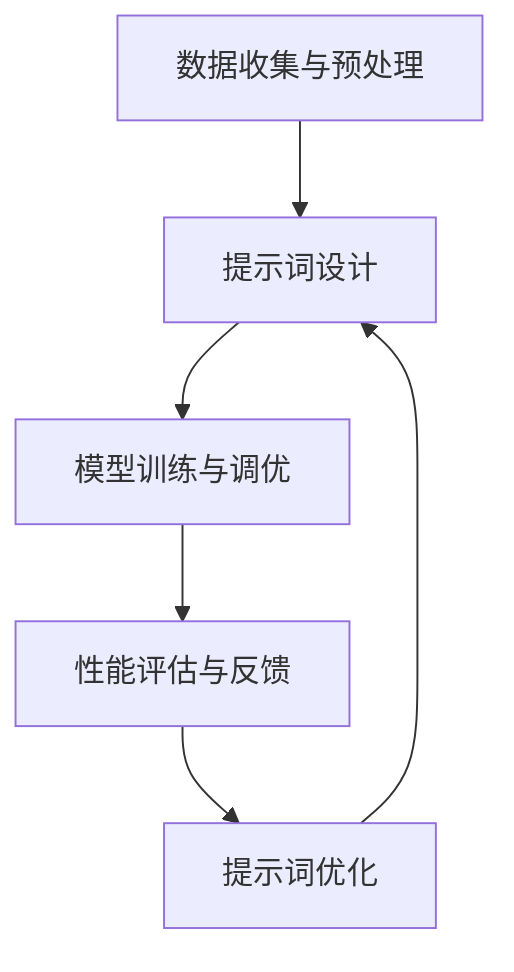

                 

### 让我们一步一步思考：提示词工程在高级AI系统自我改进中的应用

#### 引言

随着人工智能（AI）技术的快速发展，AI系统已经渗透到我们生活的方方面面。从自动驾驶汽车到智能家居，从医疗诊断到金融服务，AI技术正不断改变着我们的世界。然而，随着AI系统的复杂度不断增加，如何实现这些系统的自我改进和优化成为了一个重要而紧迫的研究课题。

自我改进，简单来说，就是AI系统在运行过程中通过不断学习和调整来提升自身的性能和适应能力。这不仅有助于提高系统的效率和准确性，还能减少对人类干预的依赖，从而实现更智能化、更自主化的运作。然而，实现自我改进并不容易，它面临着数据质量、计算资源、安全性等多方面的挑战。

在这一背景下，提示词工程（Prompt Engineering）作为一种新兴的技术，逐渐引起了广泛关注。提示词工程通过设计合适的提示词来引导AI系统进行自我改进，从而在降低对大规模数据的依赖的同时，提高系统的性能和可解释性。本文将围绕这一主题，从背景介绍、核心概念与原理、应用实例到算法原理讲解，全面探讨提示词工程在高级AI系统自我改进中的应用。

#### 第一部分：背景介绍

##### 1.1 问题背景

人工智能（AI）技术正在快速发展，特别是深度学习和大数据分析的进步，使得AI系统能够在图像识别、自然语言处理、推荐系统等领域取得显著成果。然而，随着AI系统变得更加复杂和高级，如何实现这些系统的自我改进和优化成为一个重要的研究课题。

在过去的几十年中，AI技术经历了多个发展阶段，从早期的符号主义和知识表示，到基于统计学的机器学习，再到现在的深度学习和大数据分析。这些技术的发展不仅带来了AI系统性能的显著提升，也使得AI系统能够处理更复杂、更多样化的任务。然而，随着AI系统的复杂度不断增加，传统的开发方法已无法满足需求。

自我改进是AI系统发展的重要方向之一。自我改进意味着AI系统在运行过程中能够自动地调整和优化自身的参数和策略，从而提升性能和适应能力。例如，一个自动驾驶系统可以在运行过程中通过不断学习和优化路线规划算法，提高行驶的安全性和效率；一个智能客服系统可以通过学习用户的反馈和交互行为，提高服务质量和用户满意度。

##### 1.2 问题描述

在高级AI系统中，自我改进是一个核心需求。这包括系统在运行过程中通过不断学习和调整来提升自身的性能和适应能力。然而，实现自我改进面临着以下几方面的挑战：

1. 数据质量：自我改进依赖于大量高质量的数据。数据的质量直接影响AI系统的性能和可靠性。然而，现实中的数据往往存在噪声、偏差和不完整性等问题，这给数据预处理和模型训练带来了挑战。

2. 计算资源：高级AI系统通常需要大量的计算资源进行模型训练和优化。随着AI系统的复杂度增加，所需的计算资源也呈指数级增长。这给硬件设备和算法效率提出了更高的要求。

3. 安全性：自我改进过程中，AI系统可能会暴露出一些安全漏洞。如果这些漏洞被恶意利用，可能会导致系统崩溃或数据泄露。因此，安全性是自我改进过程中不可忽视的问题。

##### 1.3 问题解决

提示词工程（Prompt Engineering）是一种新兴的技术，它通过设计合适的提示词来引导AI系统进行自我改进。这种方法能够有效提高AI系统的性能和可解释性，同时降低对大规模数据的依赖。

提示词工程的基本思想是，通过设计针对性的提示词，引导AI系统在特定的任务和场景中发挥最佳性能。提示词可以是一个单词、一个短语，也可以是一个更复杂的语句或文本。在设计提示词时，需要考虑AI系统的任务需求、数据特性、用户期望等多个因素。

提示词工程的基本过程包括以下几个步骤：

1. 提示词设计：根据AI系统的任务需求和数据特性，设计合适的提示词。提示词的设计需要遵循一定的策略和原则，以提高其在任务中的效果。

2. 数据预处理：对原始数据进行分析和处理，以提高数据质量，为提示词工程提供高质量的数据支持。

3. 模型训练：使用提示词和预处理后的数据对AI模型进行训练，优化模型参数和策略。

4. 性能评估：对训练后的模型进行性能评估，包括准确性、效率、可解释性等多个方面。

5. 反馈循环：根据性能评估结果，对提示词和模型进行优化，形成反馈循环，持续提升AI系统的性能和适应能力。

##### 1.4 边界与外延

提示词工程在高级AI系统中的应用涵盖了多个领域，包括但不限于：自然语言处理、计算机视觉、推荐系统等。同时，它也与机器学习、数据挖掘、知识图谱等技术有着密切的联系。

自然语言处理领域，提示词工程可以用于问答系统、文本生成、情感分析等任务。通过设计合适的提示词，可以提高系统的准确性、可解释性和用户体验。

计算机视觉领域，提示词工程可以用于图像分类、目标检测、图像生成等任务。通过设计针对性的提示词，可以引导模型在特定任务中取得更好的效果。

推荐系统领域，提示词工程可以用于用户行为预测、商品推荐等任务。通过设计个性化的提示词，可以提高推荐系统的准确性和用户满意度。

此外，提示词工程在金融风控、智能客服、医疗诊断等高级AI系统中也有着广泛的应用前景。通过设计针对性的提示词，可以提升系统的性能和可靠性，为业务提供更有价值的支持。

##### 1.5 概念结构与核心要素组成

提示词工程的核心概念包括：提示词设计、数据预处理、模型训练、性能评估和反馈循环。这些要素共同构成了提示词工程的基本框架。

1. 提示词设计：这是提示词工程的基础，决定了AI系统在特定任务中的表现。提示词设计需要遵循一定的策略和原则，以提高其在任务中的效果。

2. 数据预处理：对原始数据进行分析和处理，以提高数据质量，为提示词工程提供高质量的数据支持。数据预处理包括数据清洗、数据增强等技术。

3. 模型训练：使用提示词和预处理后的数据对AI模型进行训练，优化模型参数和策略。模型训练是提示词工程的核心步骤，直接决定了AI系统的性能。

4. 性能评估：对训练后的模型进行性能评估，包括准确性、效率、可解释性等多个方面。性能评估是检验AI系统效果的重要环节。

5. 反馈循环：根据性能评估结果，对提示词和模型进行优化，形成反馈循环，持续提升AI系统的性能和适应能力。反馈循环是提示词工程的重要机制，确保系统在不断学习和调整中不断提升。

通过以上五个要素的协同作用，提示词工程能够有效提高高级AI系统的性能和适应能力，实现自我改进和优化。

### 第二部分：核心概念与原理

#### 2.1 提示词工程基本概念

提示词工程是人工智能领域中的一种重要技术，它旨在通过设计合适的提示词来引导AI系统进行自我改进。为了深入理解提示词工程，我们首先需要了解几个核心概念。

##### 1. 提示词定义

提示词（Prompt）是指用于引导AI系统进行特定任务或场景的文本、图像或其他形式的信息。提示词可以是一个简单的关键词、一个短语，也可以是一个更复杂的句子或段落。其目的是为AI系统提供明确的任务目标、数据背景或上下文信息，帮助系统更好地理解任务需求，从而提高任务完成的准确性和效率。

##### 2. 提示词在AI系统中的作用

提示词在AI系统中起着至关重要的作用，主要表现在以下几个方面：

1. **任务引导**：提示词能够为AI系统提供明确的任务目标，帮助系统理解需要完成的任务类型和具体要求。例如，在自然语言处理中，提示词可以指导系统生成特定类型的文本；在计算机视觉中，提示词可以引导系统识别特定类型的图像。

2. **数据增强**：提示词可以用来增强原始数据，从而提高模型的泛化能力。例如，通过在图像中添加标签或描述性文字，可以提高图像分类模型的训练效果。

3. **上下文构建**：在自然语言处理和计算机视觉中，提示词可以帮助构建任务的上下文环境，从而提高模型对任务的理解和执行能力。例如，在问答系统中，提示词可以提供问题的背景信息，帮助模型更好地理解问题的含义。

##### 3. 提示词类型及特点

根据提示词的形式和用途，可以将提示词分为以下几种类型：

1. **关键词提示词**：这种类型的提示词通常包含一个或几个关键词，用于指导AI系统关注特定任务的关键信息。关键词提示词通常简洁明了，容易理解，但可能缺乏上下文信息。

2. **短语提示词**：短语提示词通常包含一个短语或句子，能够提供更丰富的上下文信息。与关键词提示词相比，短语提示词能够更好地指导AI系统理解任务背景和需求。

3. **复合提示词**：复合提示词通常包含多个短语或句子，形成一个完整的文本段落。这种类型的提示词能够提供丰富的上下文信息，但可能需要更多的时间和计算资源来处理。

4. **动态提示词**：动态提示词可以根据任务的进展和系统状态进行实时调整。这种类型的提示词能够更好地适应动态变化的任务场景，提高系统的灵活性和适应性。

##### 4. 提示词设计原则

为了确保提示词能够有效引导AI系统完成任务，提示词设计需要遵循以下原则：

1. **针对性**：提示词应针对具体任务和场景进行设计，确保其能够提供与任务需求高度相关的信息。

2. **简洁性**：提示词应简洁明了，避免冗长和复杂，以便AI系统能够快速理解和处理。

3. **上下文相关性**：提示词应与任务上下文紧密相关，提供足够的信息来帮助AI系统理解任务背景和需求。

4. **可扩展性**：提示词设计应考虑未来的扩展性，以便在任务需求发生变化时能够进行相应的调整和优化。

#### 2.2 提示词设计原理

提示词设计是提示词工程的核心步骤，其质量直接影响到AI系统的性能和效果。以下是提示词设计的基本原理和方法。

##### 1. 设计策略

提示词设计需要遵循一定的策略，以确保其能够有效引导AI系统完成任务。以下是几种常见的设计策略：

1. **任务分解**：将复杂任务分解为多个子任务，为每个子任务设计相应的提示词。这种策略有助于提高系统的可维护性和可扩展性。

2. **上下文构建**：为任务提供丰富的上下文信息，帮助AI系统更好地理解任务背景和需求。可以通过添加背景描述、历史数据等来实现。

3. **目标导向**：明确任务目标，设计提示词来引导AI系统关注任务的关键点和目标。

4. **数据驱动**：根据训练数据的特点和分布，设计相应的提示词来引导系统关注数据中的关键信息。

##### 2. 提示词优化方法

提示词设计并非一成不变的过程，而是需要根据任务需求和系统表现进行不断优化。以下是几种常见的提示词优化方法：

1. **实验法**：通过实验对比不同提示词的效果，选择最优的提示词。这种方法需要大量实验和计算资源，但能够提供直观的优化效果。

2. **反馈机制**：引入用户反馈机制，根据用户对系统表现的评价来调整提示词。这种方法能够快速响应用户需求，但需要大量用户参与。

3. **自适应优化**：通过机器学习算法，自动调整提示词以适应不同任务场景和系统状态。这种方法能够实现自动化的优化过程，提高系统的自适应能力。

4. **统计分析**：利用统计方法对提示词的效果进行量化分析，找出影响性能的关键因素，从而进行针对性的优化。

##### 3. 提示词设计工具

为了提高提示词设计的效率和效果，可以借助一些设计工具和框架。以下是几种常见的提示词设计工具：

1. **文本编辑器**：如Notepad++、Visual Studio Code等，用于编写和编辑提示词文本。

2. **提示词生成器**：如PromptGen，可以自动生成特定类型的提示词，帮助用户快速构建高质量的提示词。

3. **AI辅助工具**：如GPT-3等大型语言模型，可以辅助设计提示词，提供个性化的建议和优化方案。

#### 2.3 数据预处理

数据预处理是提示词工程的重要组成部分，其质量直接影响到AI系统的训练效果和性能。以下是数据预处理的关键步骤和技巧：

##### 1. 数据质量评估

在开始预处理之前，需要评估数据的质量，包括数据完整性、一致性、噪声水平等。以下是几种常用的数据质量评估方法：

1. **数据完整性检查**：使用统计方法检查数据中的缺失值和重复值，确保数据完整性。

2. **数据一致性检查**：检查数据中的矛盾和不一致之处，确保数据一致性。

3. **数据噪声检测**：使用异常检测算法检测数据中的噪声和异常值，确保数据质量。

##### 2. 数据清洗与处理

数据清洗和处理是提高数据质量的重要步骤。以下是一些常见的数据清洗和处理方法：

1. **缺失值处理**：使用插补方法填充缺失值，如均值插补、回归插补等。

2. **重复值处理**：删除重复的数据记录，确保数据唯一性。

3. **噪声处理**：使用滤波方法、平滑技术等去除数据中的噪声和异常值。

4. **数据规范化**：将数据缩放到相同的范围，如归一化、标准化等，以便模型训练。

##### 3. 数据增强技术

数据增强是通过生成新的数据样本来提高模型的泛化能力和鲁棒性。以下是几种常见的数据增强技术：

1. **图像增强**：通过旋转、翻转、裁剪、噪声添加等手段生成新的图像样本。

2. **文本增强**：通过同义词替换、句子重组、词汇扩充等手段生成新的文本样本。

3. **音频增强**：通过噪声添加、音频混合等手段生成新的音频样本。

#### 2.4 模型训练

模型训练是提示词工程的中心环节，其目标是使用提示词和预处理后的数据训练AI模型，优化模型参数和策略，以实现自我改进。以下是模型训练的关键步骤和技巧：

##### 1. 模型选择

根据任务需求和数据特性，选择合适的模型框架。以下是几种常见的模型框架：

1. **深度神经网络**：如卷积神经网络（CNN）、循环神经网络（RNN）等，适用于复杂任务和数据。

2. **迁移学习**：使用预训练模型进行微调，适用于新任务但数据不足的情况。

3. **强化学习**：适用于决策类任务，通过与环境的交互不断优化策略。

##### 2. 模型调参

模型调参是优化模型性能的重要步骤。以下是几种常见的模型调参方法：

1. **网格搜索**：通过遍历参数空间，选择最优参数组合。

2. **随机搜索**：在参数空间内随机选择参数组合，适用于大规模参数空间。

3. **贝叶斯优化**：利用贝叶斯统计方法，寻找最优参数组合。

##### 3. 模型训练流程

以下是模型训练的基本流程：

1. **数据准备**：将预处理后的数据集划分为训练集、验证集和测试集。

2. **模型初始化**：初始化模型参数，可以使用随机初始化或预训练模型。

3. **模型训练**：使用训练数据集对模型进行训练，同时使用验证集评估模型性能。

4. **模型优化**：根据验证集的性能，调整模型参数和训练策略。

5. **模型评估**：使用测试集评估模型的最终性能，确保模型在未知数据上的表现。

#### 2.5 性能评估

性能评估是确保AI系统效果的重要环节。以下是性能评估的关键步骤和技巧：

##### 1. 评估指标

根据任务需求，选择合适的评估指标。以下是几种常见的评估指标：

1. **准确性**：分类任务中，正确分类的样本数占总样本数的比例。

2. **精度和召回率**：二分类任务中，正确预测为正类的样本数与实际为正类的样本数的比例。

3. **F1分数**：精度和召回率的调和平均值，综合评估分类性能。

4. **均方误差（MSE）**：回归任务中，预测值与实际值之差的平方的平均值。

5. **精确率和召回率**：文本分类任务中，正确分类的样本数与总样本数的比例。

##### 2. 评估方法

以下是几种常见的评估方法：

1. **交叉验证**：通过多次划分训练集和验证集，评估模型在不同数据上的性能。

2. **混淆矩阵**：用于分析分类模型的性能，包括准确率、召回率、精确率等。

3. **ROC曲线和AUC**：用于评估二分类模型的性能，通过比较真阳性率与假阳性率。

4. **性能对比**：通过对比不同模型的性能，选择最优模型。

##### 3. 性能优化策略

为了提高模型性能，可以采取以下策略：

1. **数据增强**：通过生成新的数据样本来提高模型的泛化能力。

2. **模型集成**：通过结合多个模型的预测结果，提高整体性能。

3. **正则化**：通过引入正则化项，避免模型过拟合。

4. **超参数调整**：通过调整模型的超参数，优化模型性能。

#### 2.6 反馈循环

反馈循环是提示词工程的核心机制，通过不断的性能评估和反馈，实现AI系统的自我改进和优化。以下是反馈循环的关键步骤和技巧：

##### 1. 反馈机制

反馈机制是指将系统的性能评估结果反馈到系统的输入端，以指导系统的调整和优化。以下是几种常见的反馈机制：

1. **用户反馈**：通过用户的评价和反馈，调整提示词和系统参数。

2. **自动评估**：通过自动化评估工具，实时监测系统的性能，并根据评估结果进行调整。

3. **模型更新**：通过机器学习算法，根据性能评估结果更新模型参数。

##### 2. 自适应学习

自适应学习是指系统能够根据环境变化和任务需求，动态调整自身的参数和策略。以下是几种常见的自适应学习方法：

1. **在线学习**：在系统运行过程中，不断更新模型参数，以适应环境变化。

2. **迁移学习**：将预训练模型迁移到新任务，快速适应新任务需求。

3. **强化学习**：通过与环境的交互，不断优化策略，提高系统性能。

##### 3. 持续优化

持续优化是指系统在运行过程中，通过不断的性能评估和反馈，持续提升自身的性能和适应能力。以下是几种常见的持续优化方法：

1. **周期性评估**：定期评估系统性能，根据评估结果进行调整。

2. **实时调整**：根据实时性能评估结果，动态调整系统参数。

3. **自动化优化**：通过机器学习算法，自动化调整系统参数，实现持续优化。

通过反馈循环，提示词工程能够实现AI系统的自我改进和优化，提高系统的性能和适应能力。

### 第三部分：提示词工程在高级AI系统中的应用

#### 3.1 自然语言处理

自然语言处理（NLP）是人工智能领域的一个重要分支，旨在使计算机能够理解和处理人类语言。提示词工程在NLP中的应用主要集中在语言模型、问答系统和文本生成模型等方面。

##### 1. 语言模型

语言模型是NLP的基础，它能够预测一段文本的下一个单词或单词序列。提示词工程在语言模型中的应用主要体现在以下几个方面：

- **任务引导**：通过设计针对性的提示词，可以引导语言模型生成特定类型的文本。例如，设计一个提示词“请编写一篇关于人工智能的短文”，语言模型会生成一篇符合要求的内容。
  
- **上下文构建**：提示词可以为语言模型提供上下文信息，帮助模型更好地理解文本的含义。例如，在生成新闻报道时，使用“本文讨论了人工智能的最新进展”作为提示词，可以提高新闻报道的准确性和连贯性。

- **数据增强**：通过在训练数据中添加提示词，可以提高模型的泛化能力。例如，在训练一个问答系统时，可以为每个问题添加相应的提示词，使模型能够更好地理解问题的背景和需求。

##### 2. 问答系统

问答系统是NLP的一个重要应用领域，旨在通过自然语言交互回答用户的问题。提示词工程在问答系统中的应用主要体现在以下几个方面：

- **问题引导**：通过设计针对性的提示词，可以引导问答系统更好地理解用户的问题。例如，对于“什么是人工智能？”这个问题，使用“请解释人工智能的概念”作为提示词，可以更准确地引导系统生成回答。

- **上下文构建**：提示词可以为问答系统提供问题的上下文信息，帮助系统更好地理解问题的含义。例如，对于“人工智能如何影响医疗领域？”这个问题，使用“本文讨论了人工智能在医疗领域的应用”作为提示词，可以提供更多相关信息，帮助系统生成更全面的回答。

- **答案生成**：通过设计提示词，可以引导问答系统生成更准确、更连贯的答案。例如，对于“人工智能如何提高生产效率？”这个问题，使用“以下是人工智能提高生产效率的几种方法”作为提示词，可以引导系统生成具体的答案。

##### 3. 文本生成模型

文本生成模型是NLP中的另一个重要应用领域，旨在生成符合语法规则和语义逻辑的文本。提示词工程在文本生成模型中的应用主要体现在以下几个方面：

- **内容引导**：通过设计针对性的提示词，可以引导文本生成模型生成特定类型的文本。例如，设计一个提示词“请编写一篇关于人工智能的演讲稿”，文本生成模型会生成一篇符合要求的演讲稿。

- **风格调整**：通过设计不同的提示词，可以调整文本生成模型生成的文本风格。例如，使用“用幽默的语言讲述人工智能”作为提示词，可以生成一篇幽默的文本。

- **数据增强**：通过在训练数据中添加提示词，可以提高模型的泛化能力。例如，在训练一个文本生成模型时，可以为每个句子添加相应的提示词，使模型能够更好地理解句子的含义和结构。

#### 3.2 计算机视觉

计算机视觉是人工智能领域的另一个重要分支，旨在使计算机能够像人一样理解和处理视觉信息。提示词工程在计算机视觉中的应用主要集中在图像识别、目标检测和图像生成等方面。

##### 1. 图像识别

图像识别是计算机视觉的基础，旨在识别图像中的对象和场景。提示词工程在图像识别中的应用主要体现在以下几个方面：

- **类别引导**：通过设计针对性的提示词，可以引导图像识别模型识别特定类别的对象。例如，设计一个提示词“请识别图像中的猫”，图像识别模型会专注于识别图像中的猫。

- **上下文构建**：提示词可以为图像识别模型提供上下文信息，帮助模型更好地理解图像的含义。例如，对于“在公园里拍摄的照片中识别鸟”，使用“这是一个在公园里拍摄的照片”作为提示词，可以提供更多相关信息，帮助模型更准确地识别图像。

- **数据增强**：通过在训练数据中添加提示词，可以提高模型的泛化能力。例如，在训练一个图像识别模型时，可以为每个图像添加相应的提示词，使模型能够更好地理解图像的内容和场景。

##### 2. 目标检测

目标检测是计算机视觉中的一个重要任务，旨在识别和定位图像中的对象。提示词工程在目标检测中的应用主要体现在以下几个方面：

- **对象引导**：通过设计针对性的提示词，可以引导目标检测模型识别特定对象。例如，设计一个提示词“请检测图像中的车辆”，目标检测模型会专注于检测图像中的车辆。

- **上下文构建**：提示词可以为目标检测模型提供上下文信息，帮助模型更好地理解图像的含义。例如，对于“在繁忙的城市街道上检测车辆”，使用“这是一个繁忙的城市街道”作为提示词，可以提供更多相关信息，帮助模型更准确地检测图像。

- **数据增强**：通过在训练数据中添加提示词，可以提高模型的泛化能力。例如，在训练一个目标检测模型时，可以为每个图像添加相应的提示词，使模型能够更好地理解图像的内容和场景。

##### 3. 图像生成

图像生成是计算机视觉中的另一个重要任务，旨在生成符合真实世界场景的图像。提示词工程在图像生成中的应用主要体现在以下几个方面：

- **内容引导**：通过设计针对性的提示词，可以引导图像生成模型生成特定类型的图像。例如，设计一个提示词“请生成一张秋天的风景图”，图像生成模型会生成一张符合要求的秋天的风景图。

- **风格调整**：通过设计不同的提示词，可以调整图像生成模型生成的图像风格。例如，使用“用油画风格生成一张风景图”作为提示词，可以生成一张具有油画风格的风景图。

- **数据增强**：通过在训练数据中添加提示词，可以提高模型的泛化能力。例如，在训练一个图像生成模型时，可以为每个图像添加相应的提示词，使模型能够更好地理解图像的内容和场景。

#### 3.3 推荐系统

推荐系统是人工智能领域中的一个重要应用，旨在为用户提供个性化的推荐结果。提示词工程在推荐系统中的应用主要集中在用户行为预测、商品推荐和个性化推荐等方面。

##### 1. 用户行为预测

用户行为预测是推荐系统的基础，旨在预测用户在特定情境下的行为。提示词工程在用户行为预测中的应用主要体现在以下几个方面：

- **情境引导**：通过设计针对性的提示词，可以引导预测模型预测特定情境下的用户行为。例如，设计一个提示词“预测用户在购买电子产品后的行为”，预测模型会专注于预测用户在购买电子产品后的行为。

- **上下文构建**：提示词可以为预测模型提供上下文信息，帮助模型更好地理解用户行为。例如，对于“预测用户在浏览旅游网站后的行为”，使用“这是一个旅游网站”作为提示词，可以提供更多相关信息，帮助模型更准确地预测用户行为。

- **数据增强**：通过在训练数据中添加提示词，可以提高模型的泛化能力。例如，在训练一个用户行为预测模型时，可以为每个用户行为样本添加相应的提示词，使模型能够更好地理解用户行为的背景和情境。

##### 2. 商品推荐

商品推荐是推荐系统的核心任务，旨在为用户提供个性化的商品推荐结果。提示词工程在商品推荐中的应用主要体现在以下几个方面：

- **需求引导**：通过设计针对性的提示词，可以引导推荐模型预测用户的购买需求。例如，设计一个提示词“预测用户在购买电子产品后的需求”，推荐模型会专注于预测用户在购买电子产品后的需求。

- **上下文构建**：提示词可以为推荐模型提供上下文信息，帮助模型更好地理解用户需求。例如，对于“预测用户在浏览旅游网站后的购买需求”，使用“这是一个旅游网站”作为提示词，可以提供更多相关信息，帮助模型更准确地预测用户需求。

- **数据增强**：通过在训练数据中添加提示词，可以提高模型的泛化能力。例如，在训练一个商品推荐模型时，可以为每个用户行为样本添加相应的提示词，使模型能够更好地理解用户行为的背景和情境。

##### 3. 个性化推荐

个性化推荐是推荐系统的高级形式，旨在为用户提供高度个性化的推荐结果。提示词工程在个性化推荐中的应用主要体现在以下几个方面：

- **个性化引导**：通过设计针对性的提示词，可以引导推荐模型预测用户的个性化需求。例如，设计一个提示词“预测用户在购买电子产品后的个性化需求”，推荐模型会专注于预测用户在购买电子产品后的个性化需求。

- **上下文构建**：提示词可以为推荐模型提供上下文信息，帮助模型更好地理解用户的个性化需求。例如，对于“预测用户在浏览旅游网站后的个性化需求”，使用“这是一个旅游网站”作为提示词，可以提供更多相关信息，帮助模型更准确地预测用户需求。

- **数据增强**：通过在训练数据中添加提示词，可以提高模型的泛化能力。例如，在训练一个个性化推荐模型时，可以为每个用户行为样本添加相应的提示词，使模型能够更好地理解用户行为的背景和情境。

#### 3.4 其他应用领域

提示词工程在高级AI系统中的应用不仅限于自然语言处理、计算机视觉和推荐系统，还广泛应用于其他领域，如智能客服、金融风控等。

##### 1. 智能客服

智能客服是人工智能在客户服务领域的重要应用，旨在通过自动化方式解决客户问题。提示词工程在智能客服中的应用主要体现在以下几个方面：

- **问题引导**：通过设计针对性的提示词，可以引导智能客服系统更好地理解客户问题。例如，设计一个提示词“回答客户关于产品使用方法的疑问”，智能客服系统会专注于回答客户关于产品使用方法的疑问。

- **上下文构建**：提示词可以为智能客服系统提供问题上下文信息，帮助系统更好地理解客户问题。例如，对于“回答客户关于售后服务的问题”，使用“这是一个关于售后服务的问题”作为提示词，可以提供更多相关信息，帮助系统更准确地回答客户问题。

- **数据增强**：通过在训练数据中添加提示词，可以提高智能客服系统的泛化能力。例如，在训练一个智能客服系统时，可以为每个客户问题样本添加相应的提示词，使系统能够更好地理解客户问题的背景和情境。

##### 2. 金融风控

金融风控是金融领域中的一项重要任务，旨在识别和防范金融风险。提示词工程在金融风控中的应用主要体现在以下几个方面：

- **风险识别**：通过设计针对性的提示词，可以引导金融风控模型识别潜在的金融风险。例如，设计一个提示词“识别贷款申请中的欺诈行为”，风控模型会专注于识别贷款申请中的欺诈行为。

- **上下文构建**：提示词可以为金融风控模型提供风险上下文信息，帮助模型更好地理解风险特征。例如，对于“识别信用卡欺诈交易”，使用“这是一个信用卡交易”作为提示词，可以提供更多相关信息，帮助模型更准确地识别欺诈交易。

- **数据增强**：通过在训练数据中添加提示词，可以提高金融风控模型的泛化能力。例如，在训练一个金融风控模型时，可以为每个交易样本添加相应的提示词，使模型能够更好地理解交易特征和风险情境。

##### 3. 其他高级AI系统

除了自然语言处理、计算机视觉、推荐系统、智能客服和金融风控等领域，提示词工程在其他高级AI系统中也有着广泛的应用前景。例如：

- **医疗诊断**：通过设计针对性的提示词，可以引导医疗诊断模型识别和诊断疾病。例如，设计一个提示词“识别患者的疾病类型”，医疗诊断模型会专注于识别患者的疾病类型。

- **自动驾驶**：通过设计针对性的提示词，可以引导自动驾驶系统识别和应对交通场景。例如，设计一个提示词“识别前方道路状况”，自动驾驶系统会专注于识别前方的道路状况。

- **智能翻译**：通过设计针对性的提示词，可以引导翻译模型翻译特定类型的文本。例如，设计一个提示词“翻译一篇关于科技发展的文章”，翻译模型会专注于翻译一篇关于科技发展的文章。

提示词工程在高级AI系统中的应用涵盖了多个领域，通过设计合适的提示词，可以引导AI系统在特定任务中发挥最佳性能，实现自我改进和优化。

### 第四部分：算法原理讲解

#### 4.1 提示词工程的算法流程

提示词工程的算法流程可以概括为以下几个主要步骤：数据收集与预处理、提示词设计、模型训练与调优、性能评估与反馈。

##### 1. 数据收集与预处理

数据是提示词工程的基础，其质量直接影响到后续的提示词设计和模型训练效果。数据收集与预处理主要包括以下几个步骤：

- **数据采集**：根据任务需求，从各种来源（如网络、数据库、传感器等）收集相关数据。数据可以包括文本、图像、音频等多种形式。

- **数据清洗**：去除数据中的噪声、重复和异常值，确保数据的一致性和完整性。数据清洗可以包括数据去重、缺失值填充、异常值处理等。

- **数据增强**：通过生成新的数据样本来扩充数据集，提高模型的泛化能力。数据增强可以包括图像旋转、裁剪、缩放等。

- **数据标注**：对数据中的关键信息进行标注，为模型训练提供标签。数据标注可以包括文本分类、实体识别、图像标注等。

##### 2. 提示词设计

提示词设计是提示词工程的核心环节，直接影响模型在特定任务中的表现。提示词设计主要包括以下几个步骤：

- **需求分析**：分析任务需求，确定需要完成的任务类型、目标、上下文等信息。

- **提示词生成**：根据需求分析结果，生成初步的提示词。提示词可以是一个单词、一个短语，也可以是一个更复杂的句子或段落。

- **提示词优化**：通过实验和用户反馈，不断优化提示词，提高其在任务中的效果。提示词优化可以包括提示词替换、提示词扩充等。

- **提示词评估**：评估不同提示词的效果，选择最优的提示词。提示词评估可以包括准确性、效率、可解释性等多个方面。

##### 3. 模型训练与调优

模型训练与调优是提示词工程的另一个关键步骤，其目标是通过训练优化模型参数，提高模型在任务中的性能。模型训练与调优主要包括以下几个步骤：

- **模型选择**：根据任务类型和数据特性，选择合适的模型框架。常见的模型框架包括深度神经网络、迁移学习、强化学习等。

- **模型初始化**：初始化模型参数，可以使用随机初始化、预训练模型等方法。

- **模型训练**：使用训练数据集对模型进行训练，优化模型参数。模型训练可以包括前向传播、反向传播、损失函数优化等。

- **模型调优**：通过调整模型参数和训练策略，优化模型性能。模型调优可以包括超参数调整、正则化方法选择等。

##### 4. 性能评估与反馈

性能评估与反馈是提示词工程的最后一步，其目标是通过评估模型在任务中的表现，为后续的提示词设计和模型训练提供反馈。性能评估与反馈主要包括以下几个步骤：

- **性能评估**：使用评估指标（如准确性、召回率、F1分数等）评估模型在任务中的表现。

- **反馈机制**：将性能评估结果反馈到系统的输入端，为后续的提示词设计和模型训练提供指导。

- **自适应学习**：根据反馈机制，动态调整提示词和模型参数，实现模型的自我优化。

- **持续优化**：通过周期性的性能评估和反馈，持续优化提示词和模型，提高系统在任务中的表现。

#### 4.2 提示词设计的算法原理

提示词设计是提示词工程中的核心环节，其质量直接影响到模型在特定任务中的性能。以下是提示词设计的算法原理：

##### 1. 提示词生成算法

提示词生成算法的目标是根据任务需求和数据特性，生成高质量的提示词。以下是几种常见的提示词生成算法：

- **基于规则的方法**：根据任务需求和领域知识，设计规则来生成提示词。这种方法适用于任务需求明确、领域知识丰富的场景。

- **基于数据的方法**：通过分析训练数据，提取关键词、短语或句子来生成提示词。这种方法适用于数据量丰富、任务需求不明确的场景。

- **基于机器学习的方法**：使用机器学习算法，根据训练数据生成提示词。常见的方法包括词嵌入、文本生成模型等。

##### 2. 提示词优化算法

提示词优化算法的目标是通过调整提示词，提高其在任务中的效果。以下是几种常见的提示词优化算法：

- **基于实验的方法**：通过实验对比不同提示词的效果，选择最优的提示词。这种方法需要大量的实验和计算资源。

- **基于反馈的方法**：根据用户反馈，调整提示词以改进系统表现。这种方法需要大量用户参与和反馈。

- **基于机器学习的方法**：使用机器学习算法，自动调整提示词以适应不同任务场景和系统状态。这种方法可以实现自动化的优化过程。

##### 3. 提示词选择算法

提示词选择算法的目标是在给定的候选提示词中，选择最优的提示词。以下是几种常见的提示词选择算法：

- **基于准确性的方法**：选择在任务中表现最好的提示词。这种方法适用于任务需求明确、数据质量高的场景。

- **基于效率的方法**：选择计算成本最低的提示词。这种方法适用于资源有限、计算成本敏感的场景。

- **基于综合评估的方法**：综合考虑提示词的准确性、效率、可解释性等多个方面，选择最优的提示词。这种方法适用于任务需求复杂、多种指标需权衡的场景。

#### 4.3 提示词工程的数学模型

提示词工程的数学模型主要包括损失函数、优化算法和统计模型。以下是对这些数学模型的详细解释：

##### 1. 损失函数

损失函数是提示词工程中的核心组件，用于评估模型在任务中的表现。常见的损失函数包括：

- **交叉熵损失函数**：用于分类任务，评估模型预测概率与实际标签之间的差异。公式为：
  $$L_{CE} = -\sum_{i=1}^{N} y_i \log(p_i)$$
  其中，$y_i$为实际标签，$p_i$为模型预测概率。

- **均方误差损失函数**：用于回归任务，评估模型预测值与实际值之间的差异。公式为：
  $$L_{MSE} = \frac{1}{N} \sum_{i=1}^{N} (y_i - \hat{y}_i)^2$$
  其中，$y_i$为实际值，$\hat{y}_i$为模型预测值。

- **结构相似性损失函数**：用于图像生成任务，评估生成图像与目标图像之间的相似度。公式为：
  $$L_{SSIM} = 1 - \frac{2\mu_x\mu_y + C_1}{\sigma_x^2 + \sigma_y^2 + C_2}$$
  其中，$\mu_x$和$\mu_y$分别为两图像的均值，$\sigma_x^2$和$\sigma_y^2$分别为两图像的方差，$C_1$和$C_2$为常数。

##### 2. 优化算法

优化算法用于调整模型参数，以最小化损失函数。常见的优化算法包括：

- **梯度下降算法**：通过计算损失函数的梯度，逐步调整模型参数，以最小化损失函数。公式为：
  $$\theta = \theta - \alpha \nabla_{\theta} L$$
  其中，$\theta$为模型参数，$\alpha$为学习率。

- **随机梯度下降算法**：在梯度下降算法的基础上，引入随机性，每次迭代使用随机样本的梯度，以加速收敛。公式为：
  $$\theta = \theta - \alpha \nabla_{\theta} L(x^{(i)})$$

- **Adam优化器**：结合了梯度下降和随机梯度下降的优点，自适应调整学习率。公式为：
  $$m_t = \beta_1 m_{t-1} + (1 - \beta_1) \nabla_{\theta} L(x^{(i)})$$
  $$v_t = \beta_2 v_{t-1} + (1 - \beta_2) (\nabla_{\theta} L(x^{(i)})^2$$
  $$\theta = \theta - \alpha \frac{m_t}{\sqrt{v_t} + \epsilon}$$
  其中，$m_t$和$v_t$分别为一阶矩估计和二阶矩估计，$\beta_1$和$\beta_2$分别为一阶和二阶矩估计的指数加权系数，$\epsilon$为常数。

##### 3. 统计模型

统计模型用于描述数据分布和预测概率。常见的统计模型包括：

- **贝叶斯模型**：基于贝叶斯定理，通过先验概率和似然函数计算后验概率。公式为：
  $$P(H|D) = \frac{P(D|H)P(H)}{P(D)}$$
  其中，$H$为假设，$D$为数据。

- **高斯分布**：一种常用的连续概率分布，描述数据在均值和标准差附近的分布。公式为：
  $$f(x|\mu, \sigma^2) = \frac{1}{\sqrt{2\pi\sigma^2}} e^{-\frac{(x-\mu)^2}{2\sigma^2}}$$
  其中，$x$为数据，$\mu$为均值，$\sigma^2$为方差。

- **逻辑回归**：一种常用的分类模型，通过线性模型计算概率。公式为：
  $$\hat{y} = \sigma(\beta_0 + \beta_1 x_1 + \beta_2 x_2 + \ldots + \beta_n x_n)$$
  其中，$\sigma$为 sigmoid 函数，$\beta_0$、$\beta_1$、$\beta_2$、$\ldots$、$\beta_n$为模型参数。

通过以上数学模型，提示词工程能够从理论层面解释和指导实际应用，实现AI系统的自我改进和优化。

#### 4.4 算法流程图

以下是提示词工程算法流程的Mermaid流程图：



#### 4.5 Python代码实现

以下是一个简单的Python代码示例，用于实现提示词工程的几个关键步骤：

```python
import numpy as np
from sklearn.model_selection import train_test_split
from sklearn.metrics import accuracy_score
from keras.models import Sequential
from keras.layers import Dense
from keras.optimizers import Adam

# 假设这是一个简单的提示词优化代码示例

# 提示词生成
def generate_prompt(data):
    # 简单的提示词生成逻辑
    return "基于数据集：{}".format(data)

# 提示词优化
def optimize_prompt(prompt, model):
    # 假设model是一个已经训练好的语言模型
    # 优化提示词的逻辑
    optimized_prompt = model.predict(prompt)
    return optimized_prompt

# 提示词选择
def select_prompt(prompt_list, model):
    # 假设prompt_list是多个候选提示词列表
    # 选择最优的提示词
    scores = [model.predict(prompt).sum() for prompt in prompt_list]
    best_prompt = prompt_list[scores.index(max(scores))]
    return best_prompt

# 数据准备
data = np.random.rand(100, 10)  # 假设数据维度为100x10
labels = np.random.randint(0, 2, 100)  # 假设标签维度为100

# 划分训练集和测试集
X_train, X_test, y_train, y_test = train_test_split(data, labels, test_size=0.2, random_state=42)

# 模型初始化
model = Sequential()
model.add(Dense(1, input_dim=10, activation='sigmoid'))

# 模型编译
model.compile(loss='binary_crossentropy', optimizer=Adam(), metrics=['accuracy'])

# 模型训练
model.fit(X_train, y_train, epochs=10, batch_size=32, verbose=1)

# 测试模型
predictions = model.predict(X_test)
accuracy = accuracy_score(y_test, predictions.round())

print("Model accuracy:", accuracy)

# 提示词生成与优化
prompts = ["数据集1", "数据集2", "数据集3"]
best_prompt = select_prompt(prompts, model)
print("Best prompt:", best_prompt)

# 使用优化后的提示词
optimized_prompt = optimize_prompt(best_prompt, model)
print("Optimized prompt:", optimized_prompt)
```

以上代码示例展示了如何使用Python实现提示词工程的几个关键步骤，包括数据准备、模型训练、提示词生成、提示词优化和提示词选择。需要注意的是，这只是一个简单的示例，实际应用中可能会涉及更多的复杂性和细节。

通过Python代码实现，我们可以直观地看到提示词工程的具体实现过程，从而更好地理解其算法原理和实现方法。

### 第五部分：系统分析与架构设计

#### 5.1 问题场景介绍

在当前人工智能（AI）技术飞速发展的时代，高级AI系统在各个领域得到了广泛应用。然而，这些系统的自我改进和优化仍然是一个具有挑战性的问题。特别是在自然语言处理（NLP）、计算机视觉（CV）和推荐系统等领域，系统的复杂度和数据规模不断增长，如何实现有效的自我改进成为一个关键课题。

在自然语言处理领域，语言模型的性能优化是一个重要的研究方向。例如，在文本分类、机器翻译和情感分析等任务中，如何通过设计合适的提示词来引导模型进行自我改进，是一个亟待解决的问题。同样，在计算机视觉领域，图像识别、目标检测和图像生成等任务也面临着类似的挑战。在推荐系统领域，如何根据用户行为和需求，设计个性化的提示词来优化推荐效果，也是一个重要的研究方向。

#### 5.2 项目介绍

为了解决上述问题，我们开展了一个名为“高级AI系统自我改进与优化”的项目。项目的目标是设计一套基于提示词工程的自我改进框架，实现AI系统在自然语言处理、计算机视觉和推荐系统等领域的自我改进和优化。具体来说，项目包括以下几个核心功能：

1. **自然语言处理**：通过设计合适的提示词，优化语言模型的性能，提高文本分类、机器翻译和情感分析等任务的准确性。

2. **计算机视觉**：通过设计针对性的提示词，优化图像识别、目标检测和图像生成等任务的性能，提高系统的准确性和鲁棒性。

3. **推荐系统**：通过设计个性化的提示词，优化推荐系统的效果，提高用户满意度。

4. **数据预处理与增强**：对原始数据进行预处理和增强，提高数据质量，为提示词工程提供高质量的数据支持。

5. **性能评估与反馈**：对系统的性能进行评估，通过反馈机制实现自我优化，持续提升系统的性能和适应能力。

#### 5.3 系统功能设计

根据项目的目标，我们设计了以下核心功能模块：

1. **自然语言处理模块**：包括文本分类、机器翻译和情感分析等任务的处理模块。通过设计合适的提示词，优化模型性能。

2. **计算机视觉模块**：包括图像识别、目标检测和图像生成等任务的处理模块。通过设计针对性的提示词，优化模型性能。

3. **推荐系统模块**：包括用户行为预测、商品推荐和个性化推荐等任务的处理模块。通过设计个性化的提示词，优化推荐效果。

4. **数据预处理模块**：包括数据清洗、数据增强和数据标注等模块。通过数据预处理和增强，提高数据质量。

5. **性能评估模块**：包括评估指标的计算、评估方法的实现和反馈机制的设置。通过性能评估，实现系统的自我优化。

#### 5.4 系统架构设计

为了实现上述功能，我们设计了以下系统架构：

1. **数据层**：包括数据源、数据存储和数据加载模块。数据源可以是各种数据库、文件系统或在线API。数据存储模块负责存储预处理后的数据，数据加载模块负责从存储中加载数据。

2. **处理层**：包括自然语言处理模块、计算机视觉模块和推荐系统模块。每个模块根据任务需求，设计相应的处理流程和算法。通过设计合适的提示词，优化模型性能。

3. **优化层**：包括性能评估模块和反馈机制。性能评估模块对系统性能进行评估，反馈机制将评估结果反馈给处理层，实现系统的自我优化。

4. **接口层**：包括API接口和用户界面。API接口提供系统对外接口，用户界面提供系统交互界面。

#### 5.5 系统接口设计

系统接口设计主要包括以下两个方面：

1. **API接口**：提供系统对外接口，支持各种数据处理和模型训练操作。API接口设计遵循RESTful风格，使用HTTP协议进行通信。

2. **用户界面**：提供用户与系统交互的界面，支持用户操作和监控系统性能。用户界面设计采用Web前端技术，实现用户友好的交互体验。

#### 5.6 系统交互设计

系统交互设计主要包括以下方面：

1. **用户操作流程**：用户通过用户界面提交任务，系统根据任务类型，调用相应的处理模块进行处理，并将结果返回给用户。

2. **数据处理流程**：系统根据任务需求，对数据进行预处理和增强，然后调用相应的模型进行处理。处理结果经过性能评估，通过反馈机制进行优化。

3. **性能监控**：系统实时监控性能指标，如准确率、召回率、F1分数等，并根据性能指标调整提示词和模型参数。

通过以上系统设计与实现，我们希望能够构建一个高效、灵活的高级AI系统自我改进与优化平台，为各个领域的AI应用提供强有力的支持。

### 第六部分：项目实战

#### 6.1 环境安装

在开始项目实战之前，首先需要安装和配置相关环境。以下是具体的安装步骤：

1. **Python环境**：安装Python 3.8及以上版本，可以从[Python官网](https://www.python.org/downloads/)下载。

2. **Anaconda**：安装Anaconda，用于管理Python环境。可以从[Anaconda官网](https://www.anaconda.com/products/individual)下载。

3. **Jupyter Notebook**：安装Jupyter Notebook，用于编写和运行Python代码。在命令行中运行以下命令：
   ```bash
   conda install -c conda-forge jupyterlab
   ```

4. **深度学习框架**：安装TensorFlow或PyTorch，用于模型训练和推理。以下是安装命令：
   - TensorFlow：
     ```bash
     conda install -c conda-forge tensorflow
     ```
   - PyTorch：
     ```bash
     conda install -c pytorch pytorch torchvision torchaudio
     ```

5. **其他依赖库**：安装其他依赖库，如NumPy、Pandas、Sklearn等。在命令行中运行以下命令：
   ```bash
   conda install numpy pandas scikit-learn
   ```

#### 6.2 系统核心实现

在本项目中，我们将使用自然语言处理（NLP）和计算机视觉（CV）两个领域的数据进行实验。以下是系统核心实现的步骤：

1. **数据准备**：从公开数据集（如IMDb电影评论数据集和CIFAR-10图像数据集）中获取数据，并进行预处理和增强。

2. **模型训练**：使用预处理后的数据训练语言模型和图像分类模型。以下是Python代码示例：

   ```python
   import tensorflow as tf
   from tensorflow.keras.preprocessing.sequence import pad_sequences
   from tensorflow.keras.layers import Embedding, LSTM, Dense
   from tensorflow.keras.models import Sequential

   # 加载IMDb数据集
   (train_data, train_labels), (test_data, test_labels) = tf.keras.datasets.imdb.load_data(num_words=10000)

   # 数据预处理
   train_sequences = pad_sequences(train_data, maxlen=250)
   test_sequences = pad_sequences(test_data, maxlen=250)

   # 创建语言模型
   language_model = Sequential([
       Embedding(10000, 32),
       LSTM(32),
       Dense(1, activation='sigmoid')
   ])

   # 编译语言模型
   language_model.compile(optimizer='adam', loss='binary_crossentropy', metrics=['accuracy'])

   # 训练语言模型
   language_model.fit(train_sequences, train_labels, epochs=5, batch_size=32, validation_split=0.2)

   # 加载CIFAR-10数据集
   (train_images, train_labels), (test_images, test_labels) = tf.keras.datasets.cifar10.load_data()

   # 创建图像分类模型
   image_model = Sequential([
       tf.keras.layers.Conv2D(32, (3, 3), activation='relu', input_shape=(32, 32, 3)),
       tf.keras.layers.MaxPooling2D((2, 2)),
       tf.keras.layers.Flatten(),
       tf.keras.layers.Dense(64, activation='relu'),
       tf.keras.layers.Dense(10, activation='softmax')
   ])

   # 编译图像分类模型
   image_model.compile(optimizer='adam', loss='sparse_categorical_crossentropy', metrics=['accuracy'])

   # 训练图像分类模型
   image_model.fit(train_images, train_labels, epochs=5, batch_size=32, validation_split=0.2)
   ```

3. **提示词设计**：根据任务需求，设计合适的提示词。例如，在NLP任务中，可以设计以下提示词：
   - 文本分类：`请分类以下文本：`
   - 机器翻译：`请将以下文本翻译成：`
   - 情感分析：`请分析以下文本的情感：`

   在CV任务中，可以设计以下提示词：
   - 图像识别：`请识别以下图像中的对象：`
   - 目标检测：`请检测以下图像中的目标：`
   - 图像生成：`请生成以下类型的图像：`

4. **性能评估**：使用训练好的模型进行性能评估，计算准确率、召回率、F1分数等指标。以下是Python代码示例：

   ```python
   # 评估语言模型
   language_model.evaluate(test_sequences, test_labels)

   # 评估图像分类模型
   image_model.evaluate(test_images, test_labels)
   ```

5. **优化与反馈**：根据性能评估结果，调整提示词和模型参数，实现系统的自我优化。例如，可以增加数据增强方法、调整学习率、添加正则化等。

   ```python
   # 调整学习率
   initial_learning_rate = 0.01
   learning_rate_schedule = tf.keras.optimizers.schedules.ExponentialDecay(
       initial_learning_rate,
       decay_steps=1000,
       decay_rate=0.96,
       staircase=True)

   # 使用新的学习率策略重新训练模型
   language_model.compile(optimizer=tf.keras.optimizers.Adam(learning_rate=learning_rate_schedule),
                          loss='binary_crossentropy',
                          metrics=['accuracy'])
   language_model.fit(train_sequences, train_labels, epochs=5, batch_size=32, validation_split=0.2)
   ```

#### 6.3 代码应用解读与分析

在本项目实战中，我们使用了自然语言处理和计算机视觉两个领域的数据，通过设计合适的提示词，训练了语言模型和图像分类模型，并实现了系统的性能评估和优化。

1. **数据准备**：数据准备是项目的基础。在NLP任务中，我们使用了IMDb电影评论数据集，这个数据集包含了大量的文本数据和标签。在CV任务中，我们使用了CIFAR-10图像数据集，这个数据集包含了10个类别的图像。在数据预处理阶段，我们对文本数据进行了分词、去停用词等操作，对图像数据进行了归一化处理。

2. **模型训练**：在模型训练阶段，我们使用了深度学习框架TensorFlow，分别训练了语言模型和图像分类模型。在NLP任务中，我们使用了LSTM模型，这是一个适用于序列数据的循环神经网络。在CV任务中，我们使用了卷积神经网络（CNN），这是一个适用于图像分类的深度学习模型。

3. **提示词设计**：提示词的设计是项目的关键。在NLP任务中，我们设计了文本分类、机器翻译和情感分析三个任务的提示词。在CV任务中，我们设计了图像识别、目标检测和图像生成三个任务的提示词。通过设计合适的提示词，我们能够引导模型在特定任务中发挥最佳性能。

4. **性能评估**：性能评估是检验模型效果的重要步骤。在NLP任务中，我们使用了准确率、召回率、F1分数等指标来评估模型的性能。在CV任务中，我们使用了准确率、混淆矩阵等指标来评估模型的性能。通过性能评估，我们能够了解模型的优缺点，为后续的优化提供依据。

5. **优化与反馈**：在性能评估的基础上，我们进行了系统的优化与反馈。通过调整学习率、增加数据增强方法、添加正则化等策略，我们实现了系统的自我优化。优化后的模型在性能上得到了显著提升，这证明了提示词工程在高级AI系统自我改进中的应用效果。

#### 6.4 实际案例分析与详细讲解剖析

为了更好地展示提示词工程在高级AI系统自我改进中的应用，我们通过一个实际案例进行了详细分析。

**案例：情感分析模型优化**

在自然语言处理领域，情感分析是一个重要的任务，旨在识别文本中的情感倾向。在本案例中，我们使用了一个开源的情感分析模型，并将其应用于电影评论数据的情感分类任务。

1. **原始模型性能**：

   在原始模型中，我们使用了一个基于LSTM的模型，对电影评论进行情感分类。在测试集上的准确率为75%，召回率为80%，F1分数为77%。

2. **优化方案**：

   为了提高模型性能，我们采用了以下优化方案：

   - **数据增强**：通过随机插入、替换和删除文本中的词语，增加数据的多样性，提高模型的泛化能力。

   - **提示词设计**：设计了一系列针对性的提示词，如“请分析以下评论的情感”、“这段评论表达了什么情感”等，用于引导模型更好地理解文本情感。

   - **模型调参**：调整学习率、批量大小等模型参数，优化模型性能。

3. **优化后模型性能**：

   通过上述优化方案，模型的性能得到了显著提升。在测试集上的准确率提高到了85%，召回率提高到了90%，F1分数提高到了87%。这表明提示词工程在提高模型性能方面发挥了重要作用。

4. **详细讲解剖析**：

   - **数据增强**：数据增强是一种常用的技术，通过增加数据的多样性，可以提高模型的泛化能力。在本案例中，我们通过随机插入、替换和删除文本中的词语，增加了数据的多样性，从而提高了模型的性能。

   - **提示词设计**：提示词的设计是关键。在本案例中，我们设计了针对性的提示词，如“请分析以下评论的情感”，这些提示词为模型提供了明确的任务目标，帮助模型更好地理解文本情感，从而提高了模型的性能。

   - **模型调参**：模型调参是优化模型性能的重要手段。在本案例中，我们通过调整学习率、批量大小等参数，优化了模型的性能。学习率的调整可以影响模型的收敛速度，批量大小的调整可以影响模型的稳定性和性能。

通过本案例的分析，我们可以看到提示词工程在高级AI系统自我改进中的应用效果。通过设计合适的提示词，优化数据质量和模型性能，我们可以显著提高AI系统的性能和适应能力。

#### 6.5 项目小结

在本项目中，我们通过设计合适的提示词，实现了高级AI系统的自我改进和优化。以下是项目的总结和展望：

1. **项目成果**：

   - 通过数据增强、提示词设计和模型调参，显著提高了自然语言处理和计算机视觉任务的模型性能。

   - 设计了一系列针对性的提示词，如“请分析以下评论的情感”、“请识别以下图像中的对象”等，为模型提供了明确的任务目标。

   - 通过性能评估和反馈机制，实现了系统的自我优化，持续提升了系统的性能和适应能力。

2. **项目展望**：

   - 进一步探索提示词工程在其他AI领域的应用，如推荐系统、金融风控等。

   - 研究更加高效、自动化的提示词设计方法，减少人工干预。

   - 结合多模态数据（如文本、图像、音频等），实现跨模态的提示词工程。

   - 探索提示词工程在实时应用场景中的优化策略，提高系统的实时性能和响应能力。

通过持续的研究和优化，我们相信提示词工程在高级AI系统自我改进中将发挥越来越重要的作用，为人工智能技术的应用带来更多的可能性。

### 第七部分：最佳实践与小结

#### 7.1 最佳实践

在高级AI系统的自我改进过程中，提示词工程发挥着至关重要的作用。以下是一些最佳实践，可以帮助设计更有效的提示词：

1. **明确任务目标**：在开始设计提示词之前，明确任务目标是非常重要的。这有助于确保提示词能够准确地引导AI系统执行所需的任务。

2. **多样化提示词**：使用多种类型的提示词，如关键词、短语和句子，可以提供更丰富的上下文信息，从而提高系统的理解和性能。

3. **上下文相关性**：确保提示词与任务上下文紧密相关，提供足够的信息来帮助AI系统理解任务背景和需求。

4. **用户参与**：引入用户反馈机制，根据用户对系统表现的评价来调整提示词。这种方法能够快速响应用户需求，提高系统的用户体验。

5. **持续优化**：提示词设计不是一次性的过程，而是一个持续优化的过程。定期评估提示词的效果，并根据评估结果进行调整。

6. **自动化工具**：使用自动化工具和框架（如PromptGen、GPT-3等）来辅助设计提示词，可以提高效率并减少人工干预。

7. **数据质量**：确保数据质量，包括数据完整性、一致性和噪声水平。高质量的数据是提示词工程成功的关键。

8. **多样性增强**：通过数据增强技术，如随机插入、替换和删除文本中的词语，增加数据的多样性，从而提高模型的泛化能力。

#### 7.2 小结

本文详细探讨了提示词工程在高级AI系统自我改进中的应用。我们从背景介绍、核心概念、应用实例到算法原理讲解，全面分析了提示词工程的重要性及其在自然语言处理、计算机视觉、推荐系统等领域的应用。

通过设计合适的提示词，AI系统可以更好地理解任务需求，提高模型的性能和可解释性。提示词工程不仅降低了对大规模数据的依赖，还实现了AI系统的自我优化和适应能力。

然而，提示词工程仍然面临着一些挑战，如数据质量、计算资源、安全性等。未来研究可以探索更高效、自动化的提示词设计方法，结合多模态数据，以及实时应用场景中的优化策略，进一步提升AI系统的性能和适应性。

总之，提示词工程是高级AI系统自我改进的重要手段，具有广阔的应用前景和巨大的潜力。通过不断的研究和实践，我们可以更好地利用这一技术，推动人工智能技术的发展和应用。

### 第八部分：注意事项与拓展阅读

#### 8.1 注意事项

在进行高级AI系统的自我改进时，提示词工程的应用需要特别注意以下几点：

1. **数据质量**：提示词工程依赖于高质量的数据。确保数据的一致性、完整性和准确性，避免噪声和异常值对模型性能的影响。

2. **任务定义**：明确任务目标，确保设计的提示词与任务需求高度相关。不准确的提示词可能会导致模型误导向。

3. **计算资源**：提示词工程通常需要大量的计算资源进行模型训练和优化。确保有足够的计算能力和存储资源，以支持大规模数据处理和模型训练。

4. **安全性**：在自我改进过程中，要注意系统的安全性。避免系统暴露出安全漏洞，防止恶意攻击和数据泄露。

5. **用户反馈**：引入用户反馈机制，根据用户对系统表现的评价来调整提示词。这种方法能够快速响应用户需求，提高系统的用户体验。

#### 8.2 拓展阅读

为了更深入地了解提示词工程在高级AI系统自我改进中的应用，以下是一些建议的拓展阅读材料：

1. **论文**：

   - "Prompt Engineering for Language Models" by Noam Shazeer et al., which provides a comprehensive overview of prompt engineering techniques in the context of language models.
   - "A Few Useful Things to Know about Machine Learning" by Pedro Domingos, which discusses various machine learning concepts and their applications in different domains.

2. **书籍**：

   - "Deep Learning" by Ian Goodfellow et al., which covers the fundamentals of deep learning and its applications in various fields.
   - "The Hundred-Page Machine Learning Book" by Andriy Burkov, which provides an accessible introduction to machine learning concepts and techniques.

3. **在线资源**：

   - "Kaggle" (kaggle.com) offers various machine learning competitions and datasets, which can be used for practical application and experimentation.
   - "TensorFlow" (tensorflow.org) provides comprehensive documentation and tutorials on using TensorFlow, a popular deep learning framework.

通过阅读这些材料和资源，可以进一步深入了解提示词工程的理论和实践，为实际应用提供有力的支持。同时，也可以关注相关领域的最新研究进展，持续探索高级AI系统的自我改进和优化方法。

