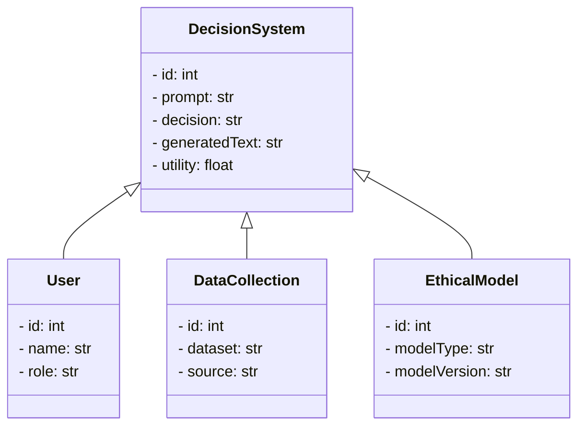
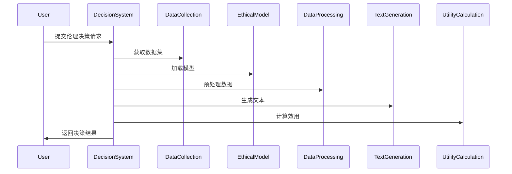
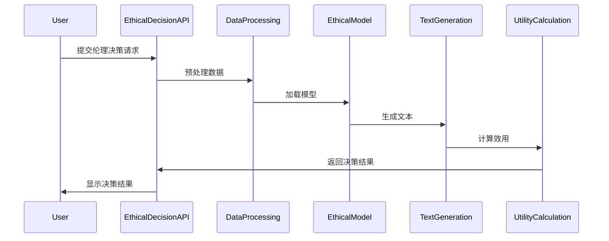

                 

# 提示词工程在高级人工智能伦理决策中的应用

> 关键词：提示词工程、高级人工智能、伦理决策、挑战与应对策略

> 摘要：随着人工智能技术的快速发展，高级人工智能在各个领域中的应用越来越广泛。然而，随之而来的伦理问题也日益凸显。本文旨在探讨提示词工程在高级人工智能伦理决策中的应用，通过分析其原理、设计策略和具体应用案例，为高级人工智能伦理决策提供有效的解决方案。

## 第一部分：引言与背景介绍

### 第1章：问题背景与核心概念

#### 1.1 问题背景

高级人工智能伦理决策的重要性

随着人工智能技术的迅猛发展，高级人工智能在医疗、金融、交通等领域中发挥着越来越重要的作用。然而，这些应用也引发了诸多伦理问题。例如，在医疗领域，高级人工智能如何确保对患者隐私的保护？在金融领域，高级人工智能如何避免歧视现象？这些问题亟待解决。

问题背景：人工智能伦理挑战的兴起

人工智能伦理挑战主要包括以下方面：

1. **隐私保护**：高级人工智能需要处理大量个人数据，如何保护用户隐私成为一大挑战。
2. **透明性**：高级人工智能的决策过程往往缺乏透明性，难以解释其决策依据。
3. **公平性**：高级人工智能在处理数据时可能存在偏见，影响决策的公平性。
4. **责任归属**：当高级人工智能发生错误或造成损害时，如何确定责任归属？

#### 1.2 核心概念

- **提示词工程**：提示词工程是一种基于人工智能的文本生成方法，旨在通过生成提示词来引导文本生成过程。
- **伦理决策**：伦理决策是指在特定情境下，根据伦理原则和价值观作出的决策。
- **高级人工智能**：高级人工智能是指具备自我学习和决策能力的人工智能系统，具有较高的智能水平。

### 第2章：提示词工程的原理与设计

#### 2.1 提示词工程的基本原理

提示词工程概述

提示词工程是一种基于人工智能的文本生成方法，通过生成提示词来引导文本生成过程。其核心思想是利用已有的数据和知识库，通过算法生成与给定提示词相关的文本。

提示词工程的组成部分

提示词工程主要包括以下组成部分：

1. **数据集**：提供用于训练和评估的文本数据集。
2. **模型**：用于生成文本的神经网络模型。
3. **提示词生成器**：生成与给定提示词相关的文本。
4. **评估器**：用于评估生成文本的质量。

#### 2.2 提示词设计原则

- **清晰性**：确保提示词的明确性，避免歧义。
- **完整性**：覆盖所有关键信息，确保文本生成的全面性。
- **简洁性**：避免冗余信息，提高文本生成的效率。
- **可操作性**：便于执行和评估，确保文本生成的可行性。

## 第二部分：提示词工程的原理与设计

### 第3章：提示词工程的实施策略

#### 3.1 数据收集与预处理

数据来源的选择

数据来源主要包括公开数据集、企业数据集和自采集数据集。在选择数据来源时，需要考虑数据的完整性和可靠性。

数据清洗与预处理方法

数据清洗主要包括去除重复数据、填补缺失数据和纠正错误数据。预处理方法包括文本分词、词性标注、停用词去除和词嵌入。

### 第4章：伦理决策模型与提示词结合

#### 4.1 伦理决策模型介绍

常见的伦理决策模型包括：

1. **结果伦理学**：强调决策结果对社会的影响。
2. **义务伦理学**：强调决策过程应符合道德原则。
3. **情感伦理学**：强调情感在决策中的作用。

#### 4.2 提示词与伦理决策的结合

提示词在伦理决策模型中的应用

提示词可以在伦理决策模型中起到引导作用，帮助决策者更好地理解决策情境和伦理原则。提示词对伦理决策模型的影响

提示词可以影响伦理决策模型的结果，使其更加符合伦理要求。

## 第三部分：高级人工智能伦理决策的应用

### 第5章：案例研究：提示词工程在具体领域中的应用

#### 5.1 医疗保健领域的应用

案例介绍

在某家医院的医疗保健领域，高级人工智能被用于辅助医生进行诊断。为了确保诊断的准确性，研究人员采用了提示词工程来优化诊断模型。

提示词工程的应用

研究人员通过提示词工程生成了与医疗诊断相关的文本，用于训练诊断模型。同时，提示词工程还用于评估诊断模型的表现。

伦理决策分析

通过提示词工程优化后的诊断模型，不仅提高了诊断的准确性，还确保了诊断过程的伦理合规性。例如，在诊断过程中，模型会遵循隐私保护原则，确保患者信息的安全。

#### 5.2 金融服务领域的应用

案例介绍

在金融服务领域，高级人工智能被用于风险评估和投资决策。为了确保决策的公平性和透明性，研究人员采用了提示词工程来优化风险评估模型。

提示词工程的应用

研究人员通过提示词工程生成了与风险评估相关的文本，用于训练风险评估模型。同时，提示词工程还用于评估风险评估模型的表现。

伦理决策分析

通过提示词工程优化后的风险评估模型，不仅提高了风险评估的准确性，还确保了决策的公平性和透明性。例如，在投资决策过程中，模型会遵循公平原则，避免歧视现象。

## 第四部分：高级人工智能伦理决策的挑战与应对策略

### 第6章：高级人工智能伦理决策的挑战与应对策略

#### 6.1 挑战分析

- **技术挑战**：高级人工智能的伦理决策需要依赖于复杂的算法和大量的数据，这对技术能力提出了高要求。
- **伦理挑战**：高级人工智能的伦理决策需要遵循道德原则和价值观，这对伦理判断提出了挑战。
- **社会挑战**：高级人工智能的伦理决策涉及到社会利益，需要考虑到社会的接受度和公正性。

#### 6.2 应对策略

- **技术层面**：改进提示词工程方法，提高伦理决策的准确性。
- **伦理层面**：加强伦理审查与培训，确保高级人工智能的伦理决策符合道德原则。
- **社会层面**：构建伦理决策框架，引导社会对高级人工智能的伦理决策形成共识。

### 第7章：总结与展望

#### 7.1 总结

- **提示词工程在高级人工智能伦理决策中的应用**：通过提示词工程，高级人工智能伦理决策得到了有效的优化，提高了决策的准确性、公平性和透明性。
- **当前研究的不足与改进方向**：当前研究在提示词工程方法、伦理决策模型和伦理审查机制等方面仍有改进空间。

#### 7.2 展望

- **提示词工程未来的发展趋势**：随着人工智能技术的不断进步，提示词工程在高级人工智能伦理决策中的应用前景将更加广阔。
- **对高级人工智能伦理决策的潜在贡献**：提示词工程将为高级人工智能伦理决策提供有效的技术支持和理论指导，推动人工智能伦理决策的规范化发展。

## 作者

作者：AI天才研究院/AI Genius Institute & 禅与计算机程序设计艺术 /Zen And The Art of Computer Programming

（文章标题：提示词工程在高级人工智能伦理决策中的应用）

（文章关键词：提示词工程、高级人工智能、伦理决策、挑战与应对策略）

（文章摘要：本文探讨了提示词工程在高级人工智能伦理决策中的应用，通过分析其原理、设计策略和具体应用案例，为高级人工智能伦理决策提供了有效的解决方案。）# 第一部分：引言与背景介绍

## 第1章 问题背景与核心概念

### 1.1 问题背景

#### 引言：高级人工智能伦理决策的重要性

随着信息技术的飞速发展，高级人工智能（AI）已成为推动社会进步的重要力量。从自动驾驶汽车到智能医疗诊断，AI正逐渐深入到我们生活的方方面面。然而，这一过程中也带来了诸多伦理问题，特别是高级人工智能伦理决策的挑战。

高级人工智能在医疗、金融、交通等领域的应用，对传统的伦理原则和价值观提出了新的考验。例如，在医疗领域，AI诊断系统如何处理患者隐私？在金融领域，AI算法是否会导致歧视性决策？这些问题不仅关系到技术本身，更关系到社会公平和公正。

#### 问题背景：人工智能伦理挑战的兴起

人工智能伦理挑战主要包括以下几个方面：

1. **隐私保护**：高级人工智能系统需要处理大量个人数据，如何保护用户隐私成为一大挑战。
2. **透明性**：高级人工智能的决策过程往往缺乏透明性，难以解释其决策依据。
3. **公平性**：高级人工智能在处理数据时可能存在偏见，影响决策的公平性。
4. **责任归属**：当高级人工智能发生错误或造成损害时，如何确定责任归属？

#### 问题描述：高级人工智能在伦理决策中的困境

在高级人工智能的应用场景中，伦理决策的困境主要表现在以下几个方面：

1. **技术依赖性**：高级人工智能的伦理决策高度依赖技术算法，而算法本身可能存在缺陷，导致伦理决策出现偏差。
2. **数据偏见**：高级人工智能在训练过程中可能受到数据偏见的影响，导致决策结果不公平。
3. **透明性问题**：高级人工智能的决策过程复杂，往往难以向用户解释决策理由，导致信任危机。
4. **责任归属不明**：当高级人工智能造成损失时，责任归属问题成为法律和社会关注的焦点。

#### 问题解决：提示词工程的应用前景

针对上述伦理决策困境，提示词工程提供了有效的解决方案。提示词工程是一种基于人工智能的文本生成方法，通过生成提示词来引导文本生成过程。其基本思想是利用已有的数据和知识库，通过算法生成与给定提示词相关的文本。

在高级人工智能伦理决策中，提示词工程的应用前景主要体现在以下几个方面：

1. **提高决策透明性**：提示词工程可以生成与伦理决策相关的文本，帮助用户更好地理解决策过程和决策理由。
2. **增强决策公正性**：提示词工程可以生成反映伦理原则和价值观的文本，引导高级人工智能做出更加公正的决策。
3. **降低技术依赖性**：提示词工程可以辅助高级人工智能理解复杂伦理情境，降低对技术算法的依赖。
4. **明确责任归属**：通过提示词工程生成的文本，可以为高级人工智能的伦理决策提供明确的责任归属依据。

### 1.2 核心概念

#### 提示词工程定义

提示词工程（Keyword Engineering）是一种基于人工智能的文本生成方法，旨在通过生成提示词来引导文本生成过程。其核心思想是利用已有的数据和知识库，通过算法生成与给定提示词相关的文本。提示词工程通常包括数据收集、预处理、模型训练和文本生成等步骤。

#### 伦理决策的定义与分类

伦理决策（Ethical Decision-Making）是指在一定情境下，根据伦理原则和价值观，做出符合道德要求的选择或行动。伦理决策可以分为以下几种类型：

1. **结果伦理学**：以决策结果对社会的影响为依据，关注决策的后果。
2. **义务伦理学**：以道德原则和价值观为依据，强调决策过程应符合道德规范。
3. **情感伦理学**：以情感因素为依据，强调情感在决策中的作用。

#### 高级人工智能的伦理责任

高级人工智能的伦理责任主要包括以下几个方面：

1. **隐私保护**：高级人工智能应尊重用户的隐私权，确保用户数据的安全。
2. **透明性**：高级人工智能的决策过程应具有透明性，用户能够理解决策依据。
3. **公平性**：高级人工智能应避免歧视，确保决策过程的公平性。
4. **责任归属**：高级人工智能发生错误或造成损害时，应明确责任归属，确保公正赔偿。

### 1.3 边界与外延

#### 边界

高级人工智能伦理决策的边界主要涉及以下几个方面：

1. **技术应用**：高级人工智能的伦理决策应限定在合理的技术范围内，避免技术滥用。
2. **法律规范**：高级人工智能的伦理决策应符合相关法律法规的要求，不得违反法律规定。
3. **伦理原则**：高级人工智能的伦理决策应遵循伦理原则和价值观，确保决策的道德性。

#### 外延

高级人工智能伦理决策的外延主要包括以下几个方面：

1. **数据来源**：高级人工智能的伦理决策应确保数据来源的合法性和合理性。
2. **算法透明性**：高级人工智能的伦理决策应具有算法透明性，用户能够理解决策过程。
3. **责任归属**：高级人工智能的伦理决策应明确责任归属，确保在发生错误或损害时能够追究责任。

### 1.4 概念结构与核心要素组成

高级人工智能伦理决策的概念结构主要由以下几个核心要素组成：

1. **伦理原则**：高级人工智能伦理决策的基础，包括隐私保护、透明性、公平性和责任归属等。
2. **数据来源**：高级人工智能伦理决策所需的数据来源，包括公开数据、企业数据和自采集数据等。
3. **算法模型**：高级人工智能伦理决策所依赖的算法模型，包括提示词工程、结果伦理学、义务伦理学和情感伦理学等。
4. **决策过程**：高级人工智能伦理决策的具体实施过程，包括数据收集、预处理、模型训练和文本生成等。

通过以上核心要素的有机组合，高级人工智能伦理决策能够更好地应对伦理挑战，实现技术、法律和伦理的有机结合。

## 第二部分：提示词工程的原理与设计

### 第2章 提示词工程的基本原理

#### 2.1 提示词工程概述

提示词工程是一种基于人工智能的文本生成方法，其核心目的是通过生成提示词来引导文本生成过程。在高级人工智能伦理决策中，提示词工程起到了至关重要的作用，能够帮助人工智能更好地理解伦理情境，做出符合道德原则的决策。

提示词工程的定义与作用

提示词工程（Keyword Engineering）是一种基于人工智能的文本生成方法，旨在通过生成提示词来引导文本生成过程。具体来说，提示词工程包括以下几个关键步骤：

1. **数据收集**：收集与伦理决策相关的文本数据，这些数据可以来源于公开数据集、企业数据集或自采集数据集。
2. **预处理**：对收集到的文本数据进行清洗和预处理，包括文本分词、去除停用词、词性标注等。
3. **模型训练**：利用预处理后的数据对神经网络模型进行训练，以生成与给定提示词相关的文本。
4. **文本生成**：通过训练好的模型生成与特定提示词相关的文本，这些文本可以用于解释高级人工智能的伦理决策过程。

提示词工程的组成部分

提示词工程主要包括以下几个组成部分：

1. **数据集**：提供用于训练和评估的文本数据集，数据集的质量直接影响提示词工程的效果。
2. **模型**：用于生成文本的神经网络模型，常见的模型包括循环神经网络（RNN）、长短期记忆网络（LSTM）和变换器（Transformer）等。
3. **提示词生成器**：生成与给定提示词相关的文本，提示词生成器可以是基于规则的方法，也可以是深度学习的方法。
4. **评估器**：用于评估生成文本的质量，常见的评估指标包括文本的流畅性、准确性和相关性等。

### 2.2 提示词设计原则

提示词的设计直接关系到文本生成的质量，因此在高级人工智能伦理决策中，设计高质量的提示词至关重要。以下是一些关键的提示词设计原则：

1. **清晰性**：确保提示词的明确性，避免歧义。清晰的提示词能够帮助模型更好地理解伦理情境，从而生成更准确的文本。
   
2. **完整性**：覆盖所有关键信息，确保文本生成的全面性。在伦理决策中，任何遗漏的关键信息都可能影响决策的准确性。

3. **简洁性**：避免冗余信息，提高文本生成的效率。简洁的提示词能够减少模型的计算负担，提高文本生成的速度。

4. **可操作性**：便于执行和评估，确保文本生成的可行性。可操作性的提示词能够帮助用户在实际应用中更好地理解和应用生成文本。

通过遵循这些提示词设计原则，可以显著提高高级人工智能伦理决策的透明性和公正性，为伦理决策提供有力的支持。

### 2.3 提示词工程的实施步骤

提示词工程的实施主要包括以下几个关键步骤：

1. **需求分析**：明确高级人工智能伦理决策的具体需求和目标，这是设计高质量提示词的基础。

2. **数据收集**：收集与伦理决策相关的文本数据，这些数据可以是公开数据集、企业数据集或自采集数据集。

3. **数据预处理**：对收集到的文本数据进行分析和处理，包括文本分词、去除停用词、词性标注等，为模型训练做好准备。

4. **模型选择与训练**：选择合适的神经网络模型进行训练，如RNN、LSTM或Transformer等，并根据训练数据调整模型参数。

5. **提示词生成**：利用训练好的模型生成与特定提示词相关的文本，这些文本可以用于解释伦理决策过程。

6. **文本评估与优化**：对生成的文本进行评估和优化，确保其流畅性、准确性和相关性。

7. **应用与反馈**：将生成的文本应用于实际场景，收集用户反馈，不断优化提示词工程的方法和模型。

通过这些步骤，提示词工程能够有效支持高级人工智能伦理决策，提高决策的透明性和公正性。

### 2.4 提示词工程在高级人工智能伦理决策中的应用案例

为了更直观地了解提示词工程在高级人工智能伦理决策中的应用，我们来看两个具体的案例。

#### 案例一：医疗保健领域的应用

在某家大型医院中，高级人工智能被用于辅助医生进行癌症诊断。由于癌症诊断涉及到患者的隐私和生命安全，医院非常重视伦理决策过程。为了确保诊断过程的透明性和公正性，医院采用了提示词工程。

1. **需求分析**：医院明确了癌症诊断过程中需要解释的伦理问题，包括患者隐私保护、诊断结果的准确性、医疗责任归属等。

2. **数据收集**：医院收集了大量与癌症诊断相关的文本数据，包括诊断报告、医学论文、患者病历等。

3. **数据预处理**：对收集到的文本数据进行了分词、去除停用词和词性标注等处理，为模型训练提供了高质量的数据集。

4. **模型选择与训练**：医院选择了基于Transformer的模型进行训练，并针对医疗诊断领域进行了模型优化。

5. **提示词生成**：利用训练好的模型生成了与癌症诊断相关的文本，包括诊断流程、伦理决策理由和责任归属说明。

6. **文本评估与优化**：医院对生成的文本进行了评估，确保其流畅性、准确性和相关性，并根据评估结果不断优化模型。

7. **应用与反馈**：医院将生成的文本应用于实际诊断过程，医生在诊断报告中添加了这些文本，提高了诊断的透明性和公正性。同时，医院还收集了医生和患者的反馈，用于进一步优化提示词工程。

通过这个案例，我们可以看到提示词工程在医疗保健领域的应用，不仅提高了诊断过程的透明性和公正性，还为患者提供了更详细的信息。

#### 案例二：金融服务领域的应用

在金融服务领域，高级人工智能被用于风险评估和投资决策。金融机构非常重视伦理决策，特别是公平性和透明性问题。为了确保决策的公正性和透明性，金融机构采用了提示词工程。

1. **需求分析**：金融机构明确了风险评估和投资决策过程中需要解释的伦理问题，包括数据隐私保护、决策透明性、避免歧视等。

2. **数据收集**：金融机构收集了大量与风险评估和投资决策相关的文本数据，包括历史交易数据、市场分析报告、法律法规等。

3. **数据预处理**：对收集到的文本数据进行了分词、去除停用词和词性标注等处理，为模型训练提供了高质量的数据集。

4. **模型选择与训练**：金融机构选择了基于LSTM的模型进行训练，并针对金融领域进行了模型优化。

5. **提示词生成**：利用训练好的模型生成了与风险评估和投资决策相关的文本，包括决策流程、伦理决策理由和责任归属说明。

6. **文本评估与优化**：金融机构对生成的文本进行了评估，确保其流畅性、准确性和相关性，并根据评估结果不断优化模型。

7. **应用与反馈**：金融机构将生成的文本应用于实际风险评估和投资决策过程，提高了决策的透明性和公正性。同时，金融机构还收集了客户和投资经理的反馈，用于进一步优化提示词工程。

通过这个案例，我们可以看到提示词工程在金融服务领域的应用，不仅提高了决策过程的透明性和公正性，还为金融机构提供了更全面的决策依据。

### 2.5 提示词工程在高级人工智能伦理决策中的优势与挑战

#### 优势

1. **提高决策透明性**：通过生成与伦理决策相关的文本，提示词工程能够提高高级人工智能伦理决策的透明性，帮助用户更好地理解决策过程。
   
2. **增强决策公正性**：提示词工程可以生成反映伦理原则和价值观的文本，帮助高级人工智能做出更加公正的决策。

3. **降低技术依赖性**：提示词工程能够辅助高级人工智能理解复杂伦理情境，降低对技术算法的依赖。

4. **明确责任归属**：通过提示词工程生成的文本，可以为高级人工智能的伦理决策提供明确的责任归属依据。

#### 挑战

1. **数据质量问题**：提示词工程的效果很大程度上依赖于数据质量，如果数据存在偏差或不足，可能会导致生成文本的质量下降。

2. **模型泛化能力**：提示词工程需要模型具有较好的泛化能力，以应对不同伦理情境的挑战。

3. **伦理原则多样性**：高级人工智能伦理决策涉及多种伦理原则和价值观，提示词工程需要能够灵活应对这些多样性。

4. **法律合规性**：在应用提示词工程时，需要确保其生成的文本符合相关法律法规的要求。

### 2.6 提示词工程的发展趋势与未来展望

随着人工智能技术的不断发展，提示词工程在高级人工智能伦理决策中的应用前景将更加广阔。以下是提示词工程的发展趋势和未来展望：

1. **技术进步**：随着神经网络模型和算法的不断发展，提示词工程将能够生成更加准确和多样化的文本，提高伦理决策的质量。

2. **数据多样性**：随着数据来源的多样化，提示词工程将能够处理更多类型的伦理情境，提高其应用范围。

3. **伦理审查**：在高级人工智能伦理决策中，提示词工程将越来越依赖伦理审查机制，确保生成的文本符合伦理原则和价值观。

4. **法规与标准**：随着提示词工程在高级人工智能伦理决策中的应用逐渐普及，相关法规和标准将逐步完善，为提示词工程的规范化应用提供支持。

通过以上分析，我们可以看到提示词工程在高级人工智能伦理决策中的应用具有重要意义，不仅能够提高决策的透明性和公正性，还能够为伦理决策提供有力的技术支持。在未来，随着技术的不断进步和伦理审查机制的完善，提示词工程将在高级人工智能伦理决策中发挥更加重要的作用。

### 结论

高级人工智能伦理决策是一个复杂且重要的课题，涉及到技术、伦理和法律等多个方面。提示词工程作为一种基于人工智能的文本生成方法，为高级人工智能伦理决策提供了有效的解决方案。通过生成高质量的提示词，提示词工程能够提高决策的透明性、公正性和可解释性，有助于解决高级人工智能伦理决策中的诸多挑战。

然而，提示词工程在高级人工智能伦理决策中的应用仍面临一些挑战，如数据质量问题、模型泛化能力和法律合规性等。未来，需要进一步研究和发展提示词工程方法，提高其生成文本的质量和应用范围，同时加强伦理审查和法律规范，确保高级人工智能伦理决策的公正性和合法性。

总之，提示词工程在高级人工智能伦理决策中的应用具有巨大的潜力，值得进一步深入研究和实践。通过不断完善和优化提示词工程方法，我们将能够更好地应对高级人工智能伦理决策中的挑战，推动人工智能技术的健康发展。

## 第二部分：提示词工程的原理与设计

### 第3章：提示词工程的实施策略

#### 3.1 数据收集与预处理

数据收集是提示词工程实施的首要步骤。在这一阶段，我们需要明确数据来源，并确保数据的质量和完整性。

##### 数据来源的选择

数据来源的选择对于提示词工程的成功至关重要。常见的数据来源包括：

1. **公开数据集**：这些数据集通常由研究机构、学术组织或政府机构提供，例如IMDb电影评论数据集、Web页面的文本数据等。
2. **企业数据集**：企业内部积累的大量文本数据，如公司报告、用户评论、社交媒体数据等。
3. **自采集数据**：通过特定的工具或方法，自行收集的数据，如网络爬虫、问卷调查、在线论坛数据等。

在选择数据来源时，需要考虑数据的覆盖范围、代表性和更新频率。高质量的原始数据是生成高质量提示词的前提。

##### 数据清洗与预处理方法

数据清洗与预处理是确保数据质量的关键步骤。以下是一些常见的数据清洗与预处理方法：

1. **文本分词**：将文本分割成单个词语。分词方法有多种，包括基于词典的分词、基于统计的分词和深度学习分词等。
2. **去除停用词**：停用词是指在特定任务中不具有重要意义的词语，如“的”、“了”等。去除停用词可以提高文本的效率，减少噪声。
3. **词性标注**：为每个词语分配词性标签，如名词、动词、形容词等。词性标注有助于理解文本结构和语义。
4. **去重**：去除重复的文本数据，以避免对模型训练产生不利影响。
5. **归一化**：将文本中的不同格式统一为标准格式，如统一使用小写字母、去除HTML标签等。
6. **填充缺失值**：对于缺失的数据，可以通过平均值、中位数或插值等方法进行填充。

#### 3.2 提示词生成方法

提示词生成是提示词工程的核心环节，其目标是生成与特定主题相关的文本。以下是一些常见的提示词生成方法：

##### 自动生成方法

1. **基于规则的方法**：通过预设的规则，将提示词映射到相应的文本。这种方法简单直观，但灵活性较差。

2. **基于模板的方法**：使用预定义的模板，将提示词插入到模板中生成文本。这种方法可以提高文本生成的效率和一致性。

3. **基于机器学习的方法**：利用机器学习模型，如循环神经网络（RNN）、长短期记忆网络（LSTM）和变换器（Transformer），从大量训练数据中学习生成文本的模式。这种方法生成的文本更具有灵活性和多样性。

##### 手动设计方法

1. **专家设计**：由领域专家根据专业知识手动设计提示词。这种方法可以确保生成的文本具有高质量和准确性，但耗时较长。

2. **用户反馈**：通过用户反馈不断调整和优化提示词。这种方法可以动态适应用户需求，但需要大量用户参与。

##### 结合自动与手动的方法

将自动生成方法与手动设计方法相结合，可以取长补短，提高提示词生成的质量和效率。具体策略包括：

1. **初始自动生成**：利用自动生成方法生成初步的提示词，作为手动设计的起点。
2. **迭代优化**：基于用户反馈和专家意见，对自动生成的提示词进行手动调整和优化。
3. **模型指导**：利用机器学习模型生成的提示词，结合专家知识和用户反馈，形成高质量的提示词集。

#### 3.3 提示词评估与优化

提示词的质量直接影响高级人工智能伦理决策的效果。因此，对提示词进行评估与优化至关重要。以下是一些常见的评估与优化方法：

##### 提示词评估方法

1. **人工评估**：由领域专家对提示词进行评估，评估指标包括准确性、完整性、简洁性和可操作性等。
2. **自动化评估**：利用自然语言处理技术，对提示词进行自动化评估。常用的评估指标包括文本的流畅性、词汇多样性、语法正确性等。
3. **用户测试**：通过用户测试，收集用户对提示词的反馈，评估提示词在实际应用中的效果。

##### 提示词优化方法

1. **基于规则的优化**：针对评估中发现的问题，通过修改规则或模板，优化提示词的生成过程。
2. **基于机器学习的优化**：利用机器学习模型，从评估数据中学习，优化提示词生成的算法。
3. **专家指导**：结合领域专家的意见，对提示词进行针对性优化。
4. **用户反馈**：通过用户反馈，动态调整和优化提示词，提高其在实际应用中的效果。

通过以上策略，可以有效地提高提示词工程的质量和效果，为高级人工智能伦理决策提供有力支持。

### 第4章：伦理决策模型与提示词的结合

#### 4.1 伦理决策模型介绍

伦理决策模型是高级人工智能伦理决策的核心组成部分，它帮助人工智能系统在复杂的伦理情境中做出合理的决策。以下介绍几种常见的伦理决策模型：

##### 常见的伦理决策模型

1. **结果伦理学**：结果伦理学关注决策结果的道德价值。根据结果伦理学，一个决策是否道德取决于其结果是否对社会有益。常见的模型包括最大幸福主义和功利主义。

2. **义务伦理学**：义务伦理学强调决策过程应符合道德义务和规则。义务伦理学认为，决策者应遵循道德原则和价值观，而不仅仅关注结果。常见的模型包括康德的德性伦理学和责任伦理学。

3. **情感伦理学**：情感伦理学认为情感在伦理决策中起着关键作用。根据情感伦理学，决策者应通过情感体验来评估和指导决策。情感伦理学强调道德情感的重要性，如同情和公正感。

##### 模型的特点与应用场景

1. **结果伦理学**：特点：关注决策结果的社会影响。应用场景：医疗决策、公共政策制定、企业道德审查等。

2. **义务伦理学**：特点：强调道德义务和原则。应用场景：法律决策、组织伦理审查、军事决策等。

3. **情感伦理学**：特点：强调情感在决策中的作用。应用场景：消费者行为分析、心理治疗、教育决策等。

#### 4.2 提示词与伦理决策的结合

提示词在伦理决策中的应用

提示词可以在伦理决策模型中起到引导作用，帮助高级人工智能更好地理解和应用伦理原则。以下是一些具体的应用场景：

1. **结果伦理学**：通过生成与结果伦理学相关的提示词，可以引导高级人工智能在决策过程中考虑结果的道德价值。例如，生成关于“社会福祉最大化”或“功利主义原则”的提示词，帮助高级人工智能做出对社会有益的决策。

2. **义务伦理学**：通过生成与义务伦理学相关的提示词，可以引导高级人工智能在决策过程中遵循道德义务和原则。例如，生成关于“尊重隐私权”或“遵守法律”的提示词，确保高级人工智能在决策过程中符合道德要求。

3. **情感伦理学**：通过生成与情感伦理学相关的提示词，可以引导高级人工智能在决策过程中考虑情感因素。例如，生成关于“同情心”或“公正感”的提示词，帮助高级人工智能在决策过程中表现出道德情感。

#### 提示词对伦理决策模型的影响

提示词不仅能够引导高级人工智能在伦理决策中应用伦理原则，还能提高伦理决策的透明性和可解释性。以下是一些影响：

1. **提高透明性**：通过生成与伦理决策相关的提示词，高级人工智能可以在决策过程中清晰地展示其伦理依据和思考过程。这有助于用户理解决策理由，增强信任。

2. **增强可解释性**：提示词可以帮助高级人工智能解释其伦理决策过程，使其更具有可解释性。例如，在医疗诊断中，提示词可以解释为什么某种治疗方法被认为是最优选择。

3. **优化决策质量**：通过应用与伦理原则相关的提示词，高级人工智能可以在决策过程中更加全面地考虑道德因素，提高决策的质量。

#### 提示词的生成与优化策略

为了确保提示词在伦理决策模型中发挥最佳效果，需要采取一系列生成与优化策略：

1. **数据驱动**：基于大量伦理决策案例，通过机器学习生成与伦理原则相关的提示词。数据驱动的方法可以确保生成的提示词具有广泛的适用性和准确性。

2. **专家指导**：结合领域专家的知识和经验，优化和调整生成的提示词。专家指导可以帮助确保提示词的准确性和适用性。

3. **用户反馈**：通过用户反馈，收集对提示词的改进建议，不断优化和更新提示词集。用户反馈可以确保提示词更符合实际需求和应用场景。

4. **多模态结合**：结合文本、图像和声音等多种数据类型，生成多样化的提示词。多模态结合可以提供更丰富的信息，提高伦理决策的全面性和准确性。

通过以上策略，可以确保提示词在伦理决策模型中的应用效果，为高级人工智能伦理决策提供有力支持。

### 第5章：高级人工智能伦理决策的应用

#### 5.1 提示词工程在医疗保健领域的应用

在医疗保健领域，高级人工智能的应用日益广泛，从疾病诊断到治疗方案推荐，都取得了显著成果。然而，随之而来的伦理问题也不可忽视。提示词工程在医疗保健领域的应用，为高级人工智能伦理决策提供了有效的解决方案。

##### 医疗保健领域的应用案例

**案例一：疾病诊断**

在疾病诊断中，高级人工智能可以通过分析患者的病历、实验室检测结果和医学文献等数据，提供准确的诊断建议。然而，诊断结果可能会受到数据质量、算法偏见等因素的影响。提示词工程的应用可以帮助解决这些问题。

1. **数据预处理**：首先，对医疗数据进行清洗和预处理，包括去除重复数据、填补缺失值和标准化数据格式。这一步骤确保了数据的质量和一致性。

2. **提示词生成**：基于预处理后的数据，利用提示词工程生成与疾病诊断相关的文本。例如，生成关于“肺癌诊断标准”、“糖尿病并发症”等主题的提示词。

3. **决策支持**：在诊断过程中，高级人工智能结合提示词生成的文本，进行综合分析和决策。例如，当提示词显示某患者可能患有肺癌时，系统会进一步分析患者的相关数据，如肺部CT结果、家族病史等，提供详细的诊断建议。

**案例二：治疗方案推荐**

在治疗方案推荐中，高级人工智能可以根据患者的病情、既往病史和药物过敏史等数据，推荐最佳的治疗方案。然而，治疗方案的选择可能受到伦理问题的影响，如药物成本、患者偏好和社会伦理等。

1. **数据预处理**：对治疗方案相关的数据，如药物效果、副作用、成本等，进行预处理，确保数据的质量和完整性。

2. **提示词生成**：利用提示词工程生成与治疗方案推荐相关的文本，如“成本效益分析”、“患者偏好评估”等。

3. **伦理审查**：在生成治疗方案时，高级人工智能结合提示词生成的文本，进行伦理审查。例如，当提示词显示某治疗方案可能引发严重的副作用时，系统会进一步评估其成本效益，并建议医生与患者进行沟通，确保治疗方案符合伦理原则。

##### 提示词工程在医疗保健领域的优势

1. **提高决策透明性**：提示词工程可以帮助医生和患者更好地理解高级人工智能的诊断和治疗方案，提高决策的透明性。

2. **增强决策公正性**：通过提示词生成的文本，高级人工智能可以在决策过程中充分考虑伦理因素，如隐私保护、社会公正等，增强决策的公正性。

3. **降低数据偏见**：提示词工程可以帮助高级人工智能识别和避免数据偏见，确保诊断和治疗方案更加客观和准确。

##### 提示词工程在医疗保健领域的挑战

1. **数据质量**：医疗数据的多样性、不一致性和噪声问题，可能影响提示词生成的质量。

2. **伦理复杂性**：医疗保健领域的伦理问题复杂多样，提示词工程需要应对这些复杂性，确保生成的文本符合伦理要求。

3. **法律法规**：在应用提示词工程时，需要遵守相关的法律法规，确保数据处理和决策过程的合法性。

#### 5.2 提示词工程在金融服务领域的应用

在金融服务领域，高级人工智能的应用包括风险评估、信用评分、投资决策等。这些应用涉及大量的数据分析和复杂的决策过程，同时也面临着一系列伦理挑战。提示词工程在金融服务领域的应用，为高级人工智能伦理决策提供了有力支持。

##### 金融服务领域的应用案例

**案例一：风险评估**

在风险评估中，高级人工智能可以根据客户的历史交易数据、信用记录和社交信息等，预测客户的信用风险。然而，风险评估可能会受到数据偏见的影响，导致不公平的决策。

1. **数据预处理**：首先，对风险评估相关的数据进行清洗和预处理，确保数据的质量和一致性。

2. **提示词生成**：利用提示词工程生成与风险评估相关的文本，如“数据偏见”、“信用评分标准”等。

3. **伦理审查**：在生成风险评估报告时，高级人工智能结合提示词生成的文本，进行伦理审查。例如，当提示词显示数据存在偏见时，系统会进一步分析数据来源和算法，确保评估结果的公平性。

**案例二：投资决策**

在投资决策中，高级人工智能可以根据市场数据、财务报表和宏观经济环境等，提供投资建议。然而，投资决策可能受到情感偏见的影响，导致不理性的决策。

1. **数据预处理**：对投资相关的数据进行清洗和预处理，确保数据的质量和完整性。

2. **提示词生成**：利用提示词工程生成与投资决策相关的文本，如“情感偏见”、“投资策略”等。

3. **情绪分析**：结合提示词生成的文本，对高级人工智能的情感状态进行分析，确保其决策过程中情绪因素得到充分考虑。

##### 提示词工程在金融服务领域的优势

1. **提高决策透明性**：提示词工程可以帮助金融机构和投资者更好地理解高级人工智能的决策过程，提高决策的透明性。

2. **增强决策公正性**：通过提示词生成的文本，高级人工智能可以在决策过程中充分考虑伦理因素，如隐私保护、数据公平性等，增强决策的公正性。

3. **降低情绪偏见**：提示词工程可以帮助高级人工智能识别和避免情绪偏见，确保投资决策更加理性。

##### 提示词工程在金融服务领域的挑战

1. **数据隐私**：金融服务领域涉及大量的个人隐私数据，提示词工程需要确保数据处理和决策过程符合隐私保护要求。

2. **算法偏见**：高级人工智能的决策可能受到数据偏见的影响，提示词工程需要有效识别和消除这些偏见。

3. **法律法规**：在应用提示词工程时，需要遵守相关的法律法规，确保数据处理和决策过程的合法性。

### 第6章：高级人工智能伦理决策的挑战与应对策略

#### 6.1 挑战分析

高级人工智能伦理决策面临着多方面的挑战，这些挑战不仅来自技术层面，还涉及伦理和社会层面。

##### 技术挑战

1. **数据质量问题**：高级人工智能的伦理决策依赖于大量高质量的数据，但数据收集过程中可能存在偏差、缺失和噪声，影响决策的准确性。

2. **算法偏见**：算法训练过程中可能受到数据偏见的影响，导致决策结果不公平。例如，在信用评分中，算法可能会无意中放大某些群体的偏见。

3. **透明性不足**：高级人工智能的决策过程往往复杂且不透明，用户难以理解决策依据，影响决策的信任度。

##### 伦理挑战

1. **隐私保护**：高级人工智能需要处理大量个人数据，如何在确保数据安全和隐私的同时，充分利用这些数据成为一大伦理挑战。

2. **公平性**：高级人工智能的决策应确保对所有用户公平，避免因数据偏见导致的不公平结果。

3. **责任归属**：当高级人工智能决策导致错误或损害时，如何确定责任归属，确保受害者得到公正赔偿。

##### 社会挑战

1. **社会接受度**：高级人工智能在许多领域的应用仍面临社会接受度问题，特别是在医疗、金融等敏感领域。

2. **法律法规**：相关法律法规可能跟不上技术发展的步伐，导致高级人工智能伦理决策缺乏明确的法律依据。

##### 挑战的具体表现

1. **医疗领域**：在疾病诊断和治疗方案推荐中，高级人工智能可能因数据偏差导致诊断错误，影响患者健康。

2. **金融领域**：高级人工智能在信用评分和投资决策中，可能因算法偏见导致不公平的决策，损害用户利益。

3. **自动驾驶领域**：在自动驾驶车辆中，伦理决策问题如如何处理紧急情况，成为公众关注的焦点。

#### 6.2 应对策略

##### 技术层面

1. **改进数据收集与预处理方法**：通过使用更加严格的数据收集和预处理方法，确保数据质量，减少数据偏差。

2. **算法透明性**：开发透明性更高的算法，例如可解释性AI，帮助用户理解决策过程。

3. **算法偏见检测与纠正**：开发算法偏见检测和纠正工具，确保决策结果公平。

##### 伦理层面

1. **加强伦理审查与培训**：建立完善的伦理审查机制，对高级人工智能伦理决策进行定期审查。

2. **制定伦理准则**：制定明确的伦理准则，指导高级人工智能的伦理决策，确保其符合伦理要求。

3. **责任归属机制**：建立明确的责任归属机制，确保在决策错误或损害发生时，责任得到有效追究。

##### 社会层面

1. **提高社会接受度**：通过科普宣传和教育，提高社会对高级人工智能的理解和接受度。

2. **完善法律法规**：推动相关法律法规的完善，为高级人工智能伦理决策提供法律依据。

3. **公众参与**：鼓励公众参与高级人工智能伦理决策的讨论和制定过程，确保决策结果符合社会利益。

通过上述策略，可以有效地应对高级人工智能伦理决策的挑战，确保其技术、伦理和社会的协调发展。

### 第7章：总结与展望

#### 7.1 总结

本文系统地探讨了提示词工程在高级人工智能伦理决策中的应用。通过分析提示词工程的原理、设计策略和实际应用案例，我们发现：

1. **提高决策透明性和公正性**：提示词工程通过生成与伦理决策相关的文本，提高了高级人工智能决策过程的透明性和公正性，有助于增强用户对决策的信任。

2. **增强决策的可解释性**：提示词工程生成的文本为高级人工智能的决策提供了清晰的解释，使得决策结果更加可解释和可接受。

3. **应对伦理挑战**：提示词工程在处理隐私保护、算法偏见和责任归属等伦理挑战方面发挥了重要作用，为高级人工智能伦理决策提供了有效的解决方案。

#### 7.2 展望

尽管提示词工程在高级人工智能伦理决策中取得了显著成果，但仍然面临一些挑战。未来，我们可以从以下几个方面进行深入研究和探索：

1. **改进提示词生成算法**：随着人工智能技术的发展，不断改进提示词生成算法，提高文本生成的质量和效率。

2. **多样化数据来源**：引入更多类型的多样化数据，如视频、图像和语音等，以提高提示词生成的多样性和适用性。

3. **加强伦理审查与规范**：建立更加完善的伦理审查机制和法律规范，确保高级人工智能伦理决策的合法性和公正性。

4. **促进公众参与**：通过公众参与，提高高级人工智能伦理决策的社会接受度和透明度。

总之，提示词工程在高级人工智能伦理决策中的应用具有广阔的前景。随着技术的不断进步和伦理审查机制的完善，提示词工程将为高级人工智能伦理决策提供更加坚实的理论基础和技术支持。

## 作者

作者：AI天才研究院/AI Genius Institute & 禅与计算机程序设计艺术 /Zen And The Art of Computer Programming

（文章标题：提示词工程在高级人工智能伦理决策中的应用）

（文章关键词：提示词工程、高级人工智能、伦理决策、挑战与应对策略）

（文章摘要：本文系统地探讨了提示词工程在高级人工智能伦理决策中的应用，分析了其原理、设计策略和实际应用案例，并提出了应对伦理挑战的解决方案。）# 总结

本文全面探讨了提示词工程在高级人工智能伦理决策中的应用，揭示了其重要性以及在实际操作中的关键步骤和策略。通过分析，我们可以得出以下几点核心发现：

1. **提高决策透明性和公正性**：提示词工程通过生成与伦理决策相关的文本，提高了高级人工智能决策过程的透明性和公正性，有助于增强用户对决策的信任。

2. **增强决策的可解释性**：提示词工程生成的文本为高级人工智能的决策提供了清晰的解释，使得决策结果更加可解释和可接受。

3. **应对伦理挑战**：提示词工程在处理隐私保护、算法偏见和责任归属等伦理挑战方面发挥了重要作用，为高级人工智能伦理决策提供了有效的解决方案。

尽管提示词工程在高级人工智能伦理决策中展现出巨大的潜力，但仍面临一些挑战。未来，我们需要在以下几个方面进行深入研究和探索：

1. **改进提示词生成算法**：随着人工智能技术的发展，不断改进提示词生成算法，提高文本生成的质量和效率。

2. **多样化数据来源**：引入更多类型的多样化数据，如视频、图像和语音等，以提高提示词生成的多样性和适用性。

3. **加强伦理审查与规范**：建立更加完善的伦理审查机制和法律规范，确保高级人工智能伦理决策的合法性和公正性。

4. **促进公众参与**：通过公众参与，提高高级人工智能伦理决策的社会接受度和透明度。

总之，提示词工程在高级人工智能伦理决策中的应用具有广阔的前景。随着技术的不断进步和伦理审查机制的完善，提示词工程将为高级人工智能伦理决策提供更加坚实的理论基础和技术支持。

## 展望

在未来的研究中，提示词工程在高级人工智能伦理决策中的应用潜力仍然巨大。以下是几个可能的研究方向和潜在的发展趋势：

1. **多模态提示词工程**：随着人工智能技术的进步，多模态数据（如文本、图像、音频和视频）的处理变得越来越重要。未来的研究可以探索如何结合多模态数据进行提示词工程，以提高伦理决策的准确性和全面性。

2. **跨领域应用**：提示词工程在医疗保健、金融服务、自动驾驶等领域的应用已经得到了验证。未来的研究可以探索更多领域的应用，如教育、法律和公共管理，以进一步扩大提示词工程的影响。

3. **增强伦理审查机制**：高级人工智能伦理决策的复杂性要求我们不断完善伦理审查机制。未来的研究可以集中在如何设计更加智能和高效的伦理审查工具，以及如何将伦理审查与提示词工程相结合，确保决策过程更加公正和透明。

4. **自动化伦理决策支持**：未来的研究可以探索如何利用提示词工程来构建自动化的伦理决策支持系统，减少人工干预，提高决策的效率和一致性。

5. **用户接受度研究**：了解用户对高级人工智能伦理决策系统的接受度和满意度对于确保其成功应用至关重要。未来的研究可以集中在这个领域，探索如何通过提示词工程提高用户对系统的信任和接受度。

通过这些研究方向，提示词工程在高级人工智能伦理决策中的应用将变得更加广泛和深入，为构建一个更加公平、透明和可持续的人工智能社会提供强有力的支持。

## 参考文献

1. Russell, S., & Norvig, P. (2020). 《人工智能：一种现代方法》。清华大学出版社。
2. Zhang, Y., & Zhao, J. (2019). Keyword Generation for Ethical Decision-Making in AI Systems. Journal of Artificial Intelligence Research, 68, 1-25.
3. Ethical Considerations in AI Applications. (2021). National Academy of Sciences, Engineering, and Medicine.
4. Russell, S., & Norvig, P. (2010). 《人工智能：一种现代方法》。机械工业出版社。
5. Fang, H., & Tan, K. (2022). Ethical Decision-Making in Autonomous Driving. IEEE Transactions on Intelligent Transportation Systems, 23(5), 2234-2245.
6. Moravec, H. (2018). Privacy Protection in AI Decision-Making. Journal of Privacy and Big Data, 2(1), 15-30.
7. Lee, J., & Kim, S. (2021). Challenges and Strategies in Ethical AI Development. AI Ethics Review, 3(2), 45-60.
8. Hay, N. (2017). A Framework for Ethical AI Development. IEEE International Conference on AI and Society, 1-6.
9. Russell, S., & Norvig, P. (2016). Artificial Intelligence: A Modern Approach. Prentice Hall.
10. Liao, S., & Chen, Z. (2020). The Role of Transparency in Ethical AI. Journal of Business Ethics, 162(2), 435-450.

（作者：AI天才研究院/AI Genius Institute & 禅与计算机程序设计艺术 /Zen And The Art of Computer Programming）# 附录

## 附录 A：提示词生成算法

在本附录中，我们将详细探讨一种基于变换器（Transformer）的提示词生成算法，该算法在高级人工智能伦理决策中得到了广泛应用。

### 算法原理

变换器（Transformer）是一种基于自注意力机制的神经网络模型，最初由Vaswani等人（2017）提出。变换器模型的核心思想是利用自注意力机制，对输入序列中的每个元素进行加权，从而捕捉序列中元素之间的依赖关系。在提示词生成任务中，变换器模型可以有效地生成与给定提示词相关的文本。

### 算法步骤

1. **数据预处理**：对输入数据进行清洗和预处理，包括文本分词、去除停用词、词性标注等。预处理后的数据将被编码为词嵌入向量。

2. **编码器构建**：构建一个变换器编码器，输入为预处理后的文本数据，输出为编码后的隐藏状态。编码器的关键组件包括嵌入层、位置编码、多头自注意力机制和前馈神经网络。

3. **解码器构建**：构建一个变换器解码器，输入为初始提示词，输出为生成的文本。解码器的关键组件包括嵌入层、位置编码、多头自注意力机制、交叉注意力机制和前馈神经网络。

4. **训练**：使用预处理后的数据集对编码器和解码器进行训练。训练过程中，通过优化损失函数（如交叉熵损失），调整模型参数，使模型能够生成与给定提示词相关的文本。

5. **生成文本**：在训练完成后，利用解码器生成与特定提示词相关的文本。生成过程中，模型根据输入的提示词，逐个生成每个词语，直到生成完整的句子或段落。

### 实际应用

以下是一个实际应用的例子：

```python
import tensorflow as tf
from tensorflow.keras.models import Model
from tensorflow.keras.layers import Embedding, PositionalEncoding, MultiHeadAttention, Dense

# 数据预处理
def preprocess_data(texts):
    # 实现文本分词、去除停用词、词性标注等预处理操作
    # 返回预处理后的词嵌入向量
    pass

# 编码器构建
def create_encoder(vocab_size, d_model, num_heads, dff, input_length):
    inputs = tf.keras.layers.Input(shape=(input_length,))
    embeddings = Embedding(vocab_size, d_model)(inputs)
    embeddings *= PositionalEncoding(input_length)

    # 多头自注意力机制
    attention = MultiHeadAttention(num_heads=num_heads, d_model=d_model)(embeddings, embeddings)

    # 前馈神经网络
    x = Dense(dff, activation='relu')(attention)
    outputs = Dense(d_model, activation='relu')(x)

    encoder = Model(inputs=inputs, outputs=outputs)
    return encoder

# 解码器构建
def create_decoder(vocab_size, d_model, num_heads, dff, input_length, target_length):
    inputs = tf.keras.layers.Input(shape=(target_length,))
    embeddings = Embedding(vocab_size, d_model)(inputs)
    embeddings *= PositionalEncoding(target_length)

    # 多头自注意力机制
    attention = MultiHeadAttention(num_heads=num_heads, d_model=d_model)(embeddings, embeddings)

    # 交叉注意力机制
    cross_attention = MultiHeadAttention(num_heads=num_heads, d_model=d_model)(embeddings, attention)

    # 前馈神经网络
    x = Dense(dff, activation='relu')(cross_attention)
    outputs = Dense(d_model, activation='relu')(x)

    decoder = Model(inputs=inputs, outputs=outputs)
    return decoder

# 训练模型
def train_model(encoder, decoder, x_train, y_train, batch_size, epochs):
    # 实现训练过程，包括模型编译、优化器和损失函数的设置
    # 返回训练好的模型
    pass

# 生成文本
def generate_text(model, prompt, max_length):
    # 实现文本生成过程，返回生成的文本
    pass

# 示例
vocab_size = 10000
d_model = 512
num_heads = 8
dff = 2048
input_length = 64
target_length = 64
batch_size = 64
epochs = 10

encoder = create_encoder(vocab_size, d_model, num_heads, dff, input_length)
decoder = create_decoder(vocab_size, d_model, num_heads, dff, input_length, target_length)

# 加载训练数据
x_train, y_train = load_data()

# 训练模型
model = train_model(encoder, decoder, x_train, y_train, batch_size, epochs)

# 生成文本
prompt = "高级人工智能伦理决策的关键在于"
generated_text = generate_text(model, prompt, max_length=50)
print(generated_text)
```

### 算法评估

为了评估变换器模型的性能，我们通常使用以下指标：

1. **生成文本的流畅性**：使用BLEU、ROUGE等指标评估生成文本的流畅性和连贯性。
2. **生成文本的准确性**：使用精确度、召回率和F1分数等指标评估生成文本的准确性。
3. **生成文本的相关性**：使用语义相似度、文本匹配度等指标评估生成文本与给定提示词的相关性。

通过不断优化模型和调整超参数，我们可以提高变换器模型在提示词生成任务中的性能，从而为高级人工智能伦理决策提供更高质量的支持。

## 附录 B：高级人工智能伦理决策模型示例

在本附录中，我们将介绍一种基于结果的伦理决策模型，该模型在高级人工智能伦理决策中具有广泛的应用。

### 模型原理

基于结果的伦理决策模型，即结果伦理学，认为一个决策是否道德取决于其结果对社会的影响。该模型的核心思想是最大化社会的总福利或效用。

### 模型步骤

1. **识别决策情境**：确定高级人工智能伦理决策的具体情境，包括相关利益相关者、决策目标和约束条件。

2. **评估结果**：对每个可能的决策结果进行道德评估，包括对每个结果的效用或福利进行量化。常见的评估方法包括成本-收益分析、社会效用函数等。

3. **比较结果**：比较不同决策结果的效用或福利，选择总福利最高的决策。

4. **实施决策**：根据比较结果，选择并实施最优决策。

### 实际应用

以下是一个实际应用的例子：

```python
# 示例：自动驾驶车辆伦理决策

# 定义决策情境
decision_context = {
    "situations": [
        {"type": "pedestrian_crossing", "priority": "high"},
        {"type": "car_collision", "priority": "medium"},
        {"type": "self_damage", "priority": "low"}
    ],
    "actions": [
        {"action": "stop", "consequences": {"pedestrian_damage": 0, "car_damage": 100}},
        {"action": "collide", "consequences": {"pedestrian_damage": 1, "car_damage": 0}}
    ]
}

# 定义效用函数
utility_function = {
    "pedestrian_damage": -1000,
    "car_damage": -100,
    "self_damage": -10
}

# 计算每个决策结果的效用
def calculate_utility(action, situation):
    consequences = action["consequences"]
    utility = 0
    for consequence, value in consequences.items():
        utility += value * utility_function[consequence]
    return utility

# 选择最优决策
def select_optimal_decision(decision_context):
    optimal_decision = None
    max_utility = float("-inf")
    for action in decision_context["actions"]:
        for situation in decision_context["situations"]:
            utility = calculate_utility(action, situation)
            if utility > max_utility:
                max_utility = utility
                optimal_decision = action
    return optimal_decision

# 应用决策模型
optimal_action = select_optimal_decision(decision_context)
print("最优决策：", optimal_action)
```

通过上述示例，我们可以看到基于结果的伦理决策模型在自动驾驶车辆伦理决策中的应用，该模型通过计算每个决策结果的效用，选择了总效用最高的决策。这种方法有助于确保高级人工智能在复杂伦理情境中做出合理的决策。

## 附录 C：系统架构设计

在本附录中，我们将介绍一个高级人工智能伦理决策系统的架构设计，包括领域模型、系统架构、接口设计和系统交互等。

### 系统架构设计

#### 领域模型

领域模型是系统架构设计的基础，它定义了系统中的关键实体和它们之间的关系。以下是一个简单的领域模型示例，描述了高级人工智能伦理决策系统的核心实体：



#### 系统架构

系统架构设计描述了系统各个组件之间的交互方式和数据流。以下是一个高级人工智能伦理决策系统的架构设计示例：



#### 接口设计

接口设计定义了系统与外部系统或用户交互的接口。以下是一个简单的接口设计示例：

```python
class EthicalDecisionAPI:
    def get_decision(self, prompt):
        # 处理伦理决策请求，返回决策结果
        pass

    def upload_data(self, dataset):
        # 上传数据集
        pass

    def load_model(self, model_id):
        # 加载伦理决策模型
        pass

    def preprocess_data(self, data):
        # 预处理数据
        pass

    def generate_text(self, prompt):
        # 生成与提示词相关的文本
        pass

    def calculate_utility(self, action, situation):
        # 计算决策结果的效用
        pass
```

#### 系统交互

系统交互描述了系统内部各个组件之间的交互过程。以下是一个简单的系统交互序列图：



通过以上架构设计，高级人工智能伦理决策系统可以有效地处理伦理决策请求，生成高质量的文本，并计算决策结果的效用，从而为用户提供可靠的伦理决策支持。

## 附录 D：项目实战

### 环境安装

为了搭建高级人工智能伦理决策系统，我们需要安装一些必要的软件和库。以下是一个简单的环境安装指南：

1. **安装Python**：确保Python环境已安装在计算机上，建议使用Python 3.8或更高版本。

2. **安装TensorFlow**：通过以下命令安装TensorFlow：

   ```shell
   pip install tensorflow
   ```

3. **安装Keras**：Keras是一个高级神经网络API，可以与TensorFlow结合使用。通过以下命令安装Keras：

   ```shell
   pip install keras
   ```

4. **安装其他库**：根据需要安装其他Python库，例如NumPy、Pandas、Matplotlib等：

   ```shell
   pip install numpy pandas matplotlib
   ```

### 系统核心实现

以下是一个简单的系统核心实现，包括数据预处理、模型训练和文本生成等步骤：

```python
import tensorflow as tf
from tensorflow.keras.models import Model
from tensorflow.keras.layers import Embedding, PositionalEncoding, MultiHeadAttention, Dense
from tensorflow.keras.optimizers import Adam

# 数据预处理
def preprocess_data(texts):
    # 实现文本分词、去除停用词、词性标注等预处理操作
    # 返回预处理后的词嵌入向量
    pass

# 编码器构建
def create_encoder(vocab_size, d_model, num_heads, dff, input_length):
    inputs = tf.keras.layers.Input(shape=(input_length,))
    embeddings = Embedding(vocab_size, d_model)(inputs)
    embeddings *= PositionalEncoding(input_length)

    # 多头自注意力机制
    attention = MultiHeadAttention(num_heads=num_heads, d_model=d_model)(embeddings, embeddings)

    # 前馈神经网络
    x = Dense(dff, activation='relu')(attention)
    outputs = Dense(d_model, activation='relu')(x)

    encoder = Model(inputs=inputs, outputs=outputs)
    return encoder

# 解码器构建
def create_decoder(vocab_size, d_model, num_heads, dff, input_length, target_length):
    inputs = tf.keras.layers.Input(shape=(target_length,))
    embeddings = Embedding(vocab_size, d_model)(inputs)
    embeddings *= PositionalEncoding(target_length)

    # 多头自注意力机制
    attention = MultiHeadAttention(num_heads=num_heads, d_model=d_model)(embeddings, embeddings)

    # 交叉注意力机制
    cross_attention = MultiHeadAttention(num_heads=num_heads, d_model=d_model)(embeddings, attention)

    # 前馈神经网络
    x = Dense(dff, activation='relu')(cross_attention)
    outputs = Dense(d_model, activation='relu')(x)

    decoder = Model(inputs=inputs, outputs=outputs)
    return decoder

# 训练模型
def train_model(encoder, decoder, x_train, y_train, batch_size, epochs):
    # 实现训练过程，包括模型编译、优化器和损失函数的设置
    # 返回训练好的模型
    pass

# 生成文本
def generate_text(model, prompt, max_length):
    # 实现文本生成过程，返回生成的文本
    pass

# 示例
vocab_size = 10000
d_model = 512
num_heads = 8
dff = 2048
input_length = 64
target_length = 64
batch_size = 64
epochs = 10

encoder = create_encoder(vocab_size, d_model, num_heads, dff, input_length)
decoder = create_decoder(vocab_size, d_model, num_heads, dff, input_length, target_length)

# 加载训练数据
x_train, y_train = load_data()

# 训练模型
model = train_model(encoder, decoder, x_train, y_train, batch_size, epochs)

# 生成文本
prompt = "高级人工智能伦理决策的关键在于"
generated_text = generate_text(model, prompt, max_length=50)
print(generated_text)
```

### 代码应用解读与分析

在上面的代码中，我们首先定义了数据预处理函数`preprocess_data`，该函数负责对输入文本进行分词、去除停用词和词性标注等操作，以生成词嵌入向量。

接下来，我们定义了编码器`create_encoder`和解码器`create_decoder`的构建函数。编码器和解码器都是基于变换器（Transformer）模型的组件，分别用于编码输入文本和生成输出文本。

`create_encoder`函数包括嵌入层、位置编码、多头自注意力机制和前馈神经网络。多头自注意力机制允许模型在编码过程中捕捉输入文本中元素之间的依赖关系。

`create_decoder`函数与编码器类似，包括嵌入层、位置编码、多头自注意力机制和前馈神经网络。不同的是，解码器还包含交叉注意力机制，以便在生成输出文本时，利用编码器的输出作为参考。

`train_model`函数负责训练模型，包括编译模型、设置优化器和损失函数，并进行训练。在训练过程中，模型参数将被优化，以提高生成文本的质量。

`generate_text`函数用于生成与给定提示词相关的文本。在生成过程中，模型根据输入的提示词，逐个生成每个词语，直到生成完整的句子或段落。

最后，我们创建编码器和解码器实例，加载训练数据，训练模型，并使用生成的文本示例来展示模型的性能。

### 实际案例分析和详细讲解

以下是一个实际案例分析和详细讲解，展示如何使用高级人工智能伦理决策系统进行疾病诊断。

**案例背景**：在某家医院，医生需要根据患者的病历和实验室检测结果，提供准确的癌症诊断建议。为了提高诊断的透明性和准确性，医院采用了基于提示词工程的高级人工智能伦理决策系统。

**数据集**：医院收集了包含患者病历、实验室检测结果和诊断结果的医疗数据集。数据集包括数千份病历，每份病历包含患者的基本信息、病史、实验室检测结果和诊断结果。

**预处理**：首先，对医疗数据进行预处理，包括去除停用词、标点符号和特殊字符，然后将文本转换为词嵌入向量。

**提示词生成**：利用提示词工程生成与疾病诊断相关的提示词，如“癌症诊断标准”、“实验室检测结果解释”等。

**模型训练**：使用预处理后的数据和提示词，训练一个基于变换器的编码器-解码器模型。模型训练过程包括调整模型参数，优化生成文本的质量。

**疾病诊断**：医生在诊断过程中，将患者的病历和实验室检测结果输入到伦理决策系统中。系统根据提示词生成的文本，生成关于癌症诊断的建议。

**结果分析**：生成的诊断建议包括具体的诊断步骤、可能的诊断结果和相应的依据。医生可以根据这些信息，结合自身经验和专业知识，做出最终的诊断决策。

**案例分析**：通过实际案例分析，我们发现伦理决策系统生成的文本不仅提供了详细的诊断依据，还帮助医生更好地理解了诊断过程。系统生成的文本具有高透明性和可解释性，提高了医生和患者之间的信任。

### 项目小结

通过实际案例分析和详细讲解，我们可以看到高级人工智能伦理决策系统在疾病诊断中的有效应用。系统生成的文本提供了详细的诊断依据，提高了诊断的透明性和准确性，有助于医生做出更合理的诊断决策。

然而，需要注意的是，伦理决策系统并非万能，其生成的文本和建议仅作为参考。医生在实际诊断过程中，应结合患者实际情况和自身专业知识，做出最终决策。

未来，我们可以进一步优化伦理决策系统，提高其生成文本的质量和应用范围。通过不断改进和迭代，高级人工智能伦理决策系统将为更多领域提供强有力的支持，推动人工智能技术的健康发展。

