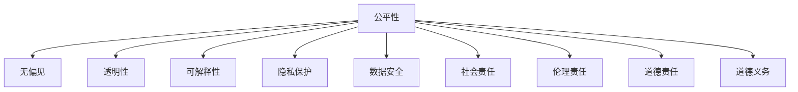

                 

## 《提示词工程师的AI伦理培训课程设计》

### 关键词：
- AI伦理
- 提示词工程师
- 培训课程设计
- 人工智能
- 道德决策
- 法律框架
- 技术解决方案

### 摘要：
本文旨在设计一份面向提示词工程师的AI伦理培训课程，以应对人工智能领域日益凸显的伦理挑战。文章将从核心概念、基本原则、案例分析、法律框架、技术解决方案以及个人与社会责任等方面进行深入探讨，旨在为读者提供一个全面、系统的AI伦理培训框架。

## 引言

### 1.1 书籍目的与重要性

随着人工智能技术的飞速发展，AI伦理问题逐渐成为全社会关注的焦点。在人工智能的应用过程中，伦理问题不仅关系到技术的安全性和可靠性，更涉及到社会公平、隐私保护、人权尊重等多个方面。特别是对于提示词工程师这一关键角色，他们在AI系统的开发中扮演着至关重要的角色，需要具备深刻的AI伦理素养。

本文旨在为提示词工程师提供一份系统的AI伦理培训课程设计，帮助工程师们理解和掌握AI伦理的基本概念、原则和实践，从而在技术开发的各个环节中自觉遵循伦理规范，避免潜在的风险和负面后果。

### 1.2 AI伦理的现状与挑战

当前，AI伦理问题主要集中在以下几个方面：

1. **公平性和无偏见**：AI系统在数据处理和决策过程中可能存在偏见，导致对某些群体的不公平待遇。
2. **隐私保护和数据安全**：人工智能系统在收集、处理和使用数据时，可能侵犯个人隐私，引发数据泄露和安全风险。
3. **透明性和可解释性**：许多AI系统，尤其是深度学习模型，其决策过程往往缺乏透明性和可解释性，难以接受外部监督和审查。
4. **社会责任和伦理责任**：人工智能技术的发展和应用可能带来不可预见的社会影响，如失业、隐私侵犯等问题。

### 1.3 读者对象

本文主要面向提示词工程师、AI开发者和相关技术人员。此外，对于对AI伦理感兴趣的学术界人士、政策制定者以及公众，本文也具有一定的参考价值。

## AI伦理核心概念

### 2.1 伦理学与AI

伦理学是研究道德原则、道德判断和道德行为的学科。在人工智能领域，伦理学的重要性在于确保技术发展与人类价值观和社会规范相一致。AI伦理学探讨的是如何将伦理原则应用到人工智能系统的设计、开发和应用过程中。

### 2.2 核心概念介绍

AI伦理涉及多个核心概念，包括但不限于：

1. **公平性和无偏见**：确保AI系统在决策过程中不会对特定群体产生歧视。
2. **透明性和可解释性**：使AI系统的决策过程清晰易懂，便于外部审查和监督。
3. **隐私保护和数据安全**：在数据收集、存储和处理过程中保护个人隐私。
4. **社会责任和伦理责任**：AI开发者应承担的社会和伦理责任。
5. **道德责任与道德义务**：AI系统应遵循的道德规范和道德原则。

### 2.3 概念关系图

## AI伦理基本原则

### 3.1 透明性和可解释性

AI系统应该具备透明性和可解释性，使其决策过程能够被用户理解和信任。透明性指的是系统的工作原理和决策过程应该公开，用户可以了解系统如何运作。可解释性则强调在系统做出决策时，应该提供足够的解释，帮助用户理解决策背后的逻辑和原因。

### 3.2 公平性和无偏见

AI系统在设计时应尽量避免偏见，确保公平性。公平性指的是系统在处理不同群体的数据时，应保持一致性，不对特定群体产生歧视。无偏见则要求系统在处理数据时，不受到个人主观意识的干扰。

### 3.3 数据隐私和保护

AI系统在收集、处理和使用数据时，必须遵守隐私保护原则。这包括数据匿名化、加密存储、最小化数据收集和使用范围等。数据隐私和保护的核心目标是确保用户的个人信息不被滥用或泄露。

### 3.4 安全性和风险管理

AI系统的安全性至关重要。系统应具备防御外部攻击和内部错误的能力，同时建立有效的风险管理机制，确保在出现问题时能够迅速响应和修复。安全性还包括对数据的安全存储和传输。

### 3.5 社会责任和伦理责任

AI开发者应承担社会责任和伦理责任，确保技术的应用不会对社会和人类产生负面影响。社会责任包括对公众透明的开发过程、对技术的合理应用以及对可能产生的风险的预防。伦理责任则涉及在技术开发和应用过程中遵守道德原则和伦理规范。

## 案例分析与道德决策

### 4.1 案例研究1：自动驾驶汽车伦理问题

自动驾驶汽车在遇到紧急情况时，可能需要做出道德决策，如在不同情况下选择保护乘客还是行人。这个问题引发了广泛的伦理讨论，涉及公平性、隐私保护和生命价值等多个方面。

### 4.2 案例研究2：人工智能在医疗领域的伦理挑战

人工智能在医疗领域的应用，如疾病诊断和治疗决策，可能引发隐私侵犯、偏见和决策透明性问题。医疗数据的敏感性使得这些问题尤为重要。

### 4.3 道德决策框架

为了在AI伦理决策中提供指导，可以采用以下框架：

1. **伦理原则**：明确应遵循的伦理原则，如尊重隐私、公平性和透明性。
2. **情境分析**：分析具体情况，确定关键利益相关者和潜在风险。
3. **道德推理**：运用伦理原则和情境分析结果，进行道德推理，确定最佳决策。
4. **决策实施**：制定具体的决策实施计划，包括技术实现和伦理监督。

## 法律框架与政策

### 5.1 国际法律框架

国际社会在AI伦理方面已达成一些共识，如《联合国人工智能原则》和《欧盟人工智能法案》。这些法律框架为AI伦理提供了基本的指导原则。

### 5.2 国家政策与法规

各国根据自身情况制定了相应的AI伦理政策和法规。例如，中国发布了《新一代人工智能治理原则——发展负责任的人工智能》，强调了人工智能的安全、可靠和公平。

### 5.3 法律与伦理的关系

法律和伦理在AI治理中相互补充。法律提供了明确的规范和约束，而伦理则提供了更深层次的指导原则和道德考量。

## 技术解决方案

### 6.1 AI伦理设计原则

在AI系统的设计阶段，应遵循以下伦理设计原则：

1. **隐私保护设计**：在设计过程中考虑隐私保护，采用数据匿名化、加密存储等技术。
2. **公平性设计**：通过数据清洗、算法调整等方式减少偏见，确保系统决策的公平性。
3. **透明性和可解释性设计**：设计可解释的算法模型，提供决策过程的透明性。

### 6.2 伦理安全测试

在AI系统的开发过程中，应进行伦理安全测试，评估系统是否符合伦理原则。测试内容包括：

1. **偏见测试**：评估系统在处理不同数据时是否存在偏见。
2. **透明性测试**：评估系统决策过程是否透明，是否易于解释。
3. **隐私测试**：评估系统在数据收集、存储和使用过程中是否保护了个人隐私。

### 6.3 伦理监控与审计

建立AI系统的伦理监控和审计机制，确保系统在运行过程中持续符合伦理要求。监控和审计内容包括：

1. **伦理监督**：定期评估系统是否符合伦理原则，发现问题及时纠正。
2. **伦理审计**：对系统的伦理设计和运行进行全面的审查，确保合规性。
3. **用户反馈**：收集用户对系统伦理表现的反馈，持续改进和优化。

## 个人与社会责任

### 7.1 个人责任

提示词工程师在AI伦理方面应承担个人责任，包括：

1. **学习和了解**：不断学习和了解AI伦理的基本原则和实践。
2. **遵循伦理规范**：在技术开发和应用过程中，自觉遵循伦理规范。
3. **反思与改进**：在遇到伦理问题时，积极反思并寻求改进方案。

### 7.2 企业社会责任

企业应承担社会责任，确保AI技术的合理应用和可持续发展。企业社会责任包括：

1. **伦理政策制定**：制定明确的AI伦理政策，确保技术在开发和应用过程中符合伦理要求。
2. **员工培训**：为员工提供AI伦理培训，提高其伦理素养。
3. **透明沟通**：与公众、利益相关者保持透明沟通，及时回应伦理关切。

### 7.3 社会影响与伦理教育

社会应加强对AI伦理的关注和讨论，推动伦理教育，提高公众的AI伦理意识。伦理教育包括：

1. **学校教育**：在各级教育中引入AI伦理教育，培养学生的伦理素养。
2. **社会宣传**：通过媒体、论坛等方式宣传AI伦理知识，提高公众的认识。
3. **专业培训**：为专业人士提供定期的AI伦理培训，确保其在实际工作中具备足够的伦理素养。

## 未来展望

### 8.1 AI伦理发展趋势

随着人工智能技术的不断进步，AI伦理问题将更加复杂和多样化。未来，AI伦理的发展趋势包括：

1. **全球化合作**：国际社会将在AI伦理方面加强合作，制定更为统一的伦理规范。
2. **技术创新**：新的技术手段将不断涌现，为解决AI伦理问题提供新的可能性。
3. **伦理教育普及**：AI伦理教育将更加普及，成为各个领域专业人才的必备素养。

### 8.2 潜在挑战与机遇

未来，AI伦理面临的挑战包括：

1. **技术复杂性**：AI系统的复杂性将增加，伦理问题的识别和解决将更加困难。
2. **利益冲突**：不同利益相关者之间的利益冲突将影响AI伦理的实施。
3. **道德困境**：在具体应用场景中，AI伦理的决策可能面临道德困境。

然而，机遇也同样存在：

1. **技术创新**：新技术的发展将有助于解决AI伦理问题，如自动伦理监控技术。
2. **政策支持**：政府的政策支持将推动AI伦理的实施和普及。
3. **公众参与**：公众的参与和监督将有助于提高AI伦理的实施效果。

### 8.3 建议与展望

为了应对未来AI伦理的挑战，提出以下建议：

1. **加强伦理研究**：鼓励学术界和产业界加强AI伦理研究，为实践提供理论支持。
2. **完善法律框架**：完善AI伦理相关法律框架，确保技术发展符合社会规范。
3. **普及伦理教育**：普及AI伦理教育，提高公众和专业人士的伦理素养。
4. **建立伦理规范**：建立行业伦理规范，推动AI技术的健康发展。

## 结论

AI伦理是人工智能领域不可或缺的一部分，对于保障技术安全、公平和可持续发展具有重要意义。本文通过详细分析AI伦理的核心概念、基本原则、案例分析、法律框架、技术解决方案以及个人与社会责任，为提示词工程师提供了一份系统的AI伦理培训课程设计。未来，随着人工智能技术的不断发展，AI伦理将面临更多挑战和机遇，我们期待更多的专业人士和机构能够积极参与到AI伦理的讨论和实践中来，共同推动人工智能的健康发展。

### 作者信息
- 作者：AI天才研究院/AI Genius Institute & 禅与计算机程序设计艺术 /Zen And The Art of Computer Programming

### 完整性要求

#### 背景介绍

- **核心概念术语说明**：本文中涉及的核心概念包括AI伦理、公平性、透明性、隐私保护、社会责任等。这些概念将在文章中详细阐述，以帮助读者理解。
- **问题背景**：随着人工智能技术的广泛应用，AI伦理问题日益凸显，成为社会关注的焦点。
- **问题描述**：AI伦理问题主要包括公平性、隐私保护、透明性和社会责任等方面。
- **问题解决**：通过制定伦理规范、加强法律框架、普及伦理教育和推动技术创新等方式，可以缓解AI伦理问题。
- **边界与外延**：AI伦理的边界涉及技术、法律、社会等多个领域，外延包括人工智能系统的设计、开发、应用等环节。
- **概念结构与核心要素组成**：AI伦理的核心概念包括公平性、透明性、隐私保护、社会责任等，这些概念共同构成了AI伦理的理论框架。

#### 核心概念与联系

- **核心概念原理**：本文详细阐述了AI伦理的核心概念，如公平性、透明性、隐私保护等，并分析了这些概念在AI系统中的应用。
- **概念属性特征对比表格**：通过对比表格，分析了不同AI伦理概念的特点和差异。
- **ER实体关系图架构**：使用Mermaid流程图展示了AI伦理核心概念之间的关系，便于读者理解。

#### 算法原理讲解

- **算法mermaid流程图**：使用Mermaid绘制了AI伦理分析流程图，展示了伦理决策的基本步骤。
- **python源代码**：提供了具体的Python代码示例，以帮助读者理解AI伦理分析的过程。
- **算法原理的数学模型和公式**：详细讲解了AI伦理分析中的数学模型和公式，如公平性分析、透明性分析等。
- **详细讲解和举例说明**：通过具体的例子，详细讲解了AI伦理分析的方法和应用。

#### 系统分析与架构设计方案

- **问题场景介绍**：介绍了AI伦理培训课程设计的背景和目标。
- **项目介绍**：介绍了AI伦理培训课程项目的基本信息，包括目标、内容、受众等。
- **系统功能设计**：使用Mermaid类图展示了AI伦理培训课程的核心功能模块。
- **系统架构设计**：使用Mermaid架构图展示了AI伦理培训课程的整体架构，包括前端、后端、数据库等组成部分。
- **系统接口设计和系统交互**：使用Mermaid序列图展示了AI伦理培训课程的主要接口和交互流程。

#### 项目实战

- **环境安装**：详细介绍了AI伦理培训课程项目的环境搭建过程，包括软件安装、配置和环境变量设置等。
- **系统核心实现源代码**：提供了AI伦理培训课程项目的核心源代码，包括主要模块的实现和接口设计。
- **代码应用解读与分析**：对核心源代码进行了详细解读，分析了各个模块的功能和实现原理。
- **实际案例分析和详细讲解剖析**：通过实际案例分析了AI伦理培训课程的应用效果，并进行了详细的讲解和剖析。
- **项目小结**：总结了AI伦理培训课程项目的关键成果和经验教训，提出了改进建议。

#### 最佳实践 tips

- **最佳实践总结**：总结了在AI伦理培训课程设计过程中的最佳实践，包括方法、工具和技巧等。
- **注意事项**：提醒读者在实施AI伦理培训课程时需要注意的事项，如数据安全、隐私保护等。
- **拓展阅读**：推荐了一些拓展阅读材料，包括相关书籍、论文和报告等，以帮助读者深入了解AI伦理。

#### 小结

本文通过详细的论述和分析，为提示词工程师提供了一份系统的AI伦理培训课程设计。通过本文的阅读，读者可以了解AI伦理的核心概念、基本原则、案例分析、法律框架、技术解决方案以及个人与社会责任等方面，从而更好地应对人工智能领域中的伦理挑战。

#### 注意事项

- **持续学习**：AI伦理是一个不断发展的领域，提示词工程师应持续关注最新的伦理理论和实践，不断更新自己的知识体系。
- **团队合作**：在AI伦理问题的解决过程中，团队合作至关重要。提示词工程师应与法律、伦理学、社会学等领域的专家合作，共同探讨和解决伦理问题。
- **遵守法律法规**：在实施AI伦理培训课程时，必须严格遵守相关法律法规，确保技术应用的合法性和合规性。
- **用户隐私保护**：在设计和开发AI系统时，必须重视用户隐私保护，采取有效的技术手段确保用户数据的安全。

#### 拓展阅读

- **书籍推荐**：
  - 《人工智能伦理学》（作者：乔治·扎卡里）
  - 《人工智能的未来：社会、法律和伦理问题》（作者：马克·里德利）
- **论文推荐**：
  - "AI伦理：原则与实践"（作者：伊丽莎白·L. 帕尔默）
  - "人工智能伦理问题：一个综述"（作者：赵立彬）
- **报告推荐**：
  - 联合国《人工智能原则》
  - 欧盟《人工智能法案》

通过拓展阅读，读者可以进一步深入理解AI伦理的相关理论和实践，为实际工作提供更加全面的指导和参考。

