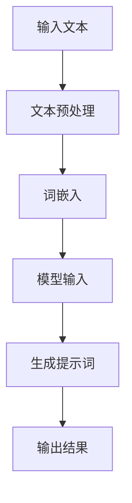
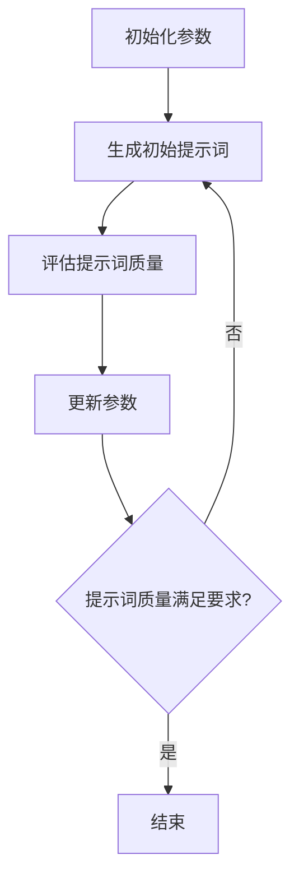
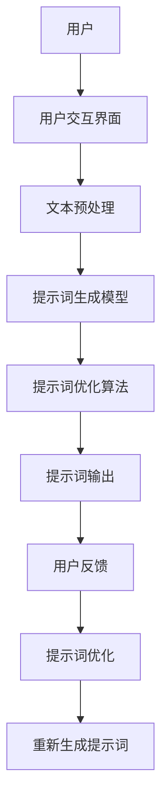

                 

### 文章标题：提示词工程师的技能培养与发展

#### 关键词：提示词工程师、技能培养、算法原理、系统架构、项目实战

#### 摘要：
本文将围绕提示词工程师这一职业角色，深入探讨其技能培养与发展路径。我们将从背景介绍、核心概念与联系、算法原理讲解、系统分析与架构设计方案、项目实战、最佳实践与注意事项等多个方面，全面解析提示词工程师所需掌握的知识体系和实际应用技巧。通过本文的阅读，读者将对提示词工程师的角色定位、技能要求和发展前景有更深刻的理解。

---

### 第一部分：背景与核心概念

#### 第1章：提示词工程师的角色与责任

**1.1 提示词工程师的职业描述**

提示词工程师，又称自然语言处理（NLP）工程师，是负责开发、实现和维护与自然语言处理相关算法和系统的专业人员。他们的主要任务包括：

- 设计和实现文本预处理工具，如分词、词性标注、句法分析等；
- 开发基于深度学习模型的文本分类、情感分析、命名实体识别等应用；
- 构建和优化提示词生成算法，用于自动生成具有指导意义的文本提示；
- 负责提示词系统的性能调优、接口设计和集成。

**1.2 提示词工程师在人工智能领域的作用**

在人工智能领域，提示词工程师发挥着关键作用，其贡献主要体现在以下几个方面：

- 提高自然语言处理系统的自动化程度和用户体验；
- 为智能客服、智能助手、内容推荐等应用提供强大的文本生成能力；
- 支撑知识图谱构建和语义理解，提升AI系统的智能化水平；
- 推动AI技术在各个行业的落地和应用。

**1.3 提示词工程师的发展趋势**

随着人工智能技术的快速发展，提示词工程师的角色越来越受到重视。未来，提示词工程师的发展趋势将呈现以下特点：

- 技术需求多样化和专业化，要求工程师掌握更多前沿技术；
- 数据质量和算法优化成为提升系统性能的关键因素；
- 跨领域合作和产业应用将成为重要发展方向；
- 对编程能力和数学建模能力的更高要求。

#### 第2章：提示词工程基础

**2.1 提示词的定义与类型**

提示词（Prompt Word）是指用于引导文本生成、情感分析、语义理解等任务的特定词汇或短语。根据应用场景和目标，提示词可以分为以下几种类型：

- **引导性提示词**：用于引导文本生成，如“请描述一下您的兴趣爱好？”
- **情感分析提示词**：用于检测文本的情感倾向，如“这篇文章让你感到愉悦吗？”
- **语义理解提示词**：用于理解文本中的具体含义，如“你最喜欢的城市是哪个？”

**2.2 提示词工程的关键概念**

提示词工程涉及多个核心概念，包括：

- **文本预处理**：对原始文本进行清洗、分词、词性标注等预处理操作；
- **词嵌入**：将文本中的词语映射到高维向量空间；
- **生成模型**：用于生成文本的深度学习模型，如循环神经网络（RNN）、变换器（Transformer）等；
- **评估指标**：用于衡量文本生成质量和情感分析准确性的指标，如BLEU、ROUGE、F1值等。

**2.3 提示词工程的基本流程**

提示词工程的基本流程包括以下几个步骤：

1. **需求分析**：明确应用场景和目标，确定提示词的类型和需求；
2. **数据收集**：收集相关领域的文本数据，用于训练和评估模型；
3. **文本预处理**：对收集到的文本数据进行预处理，如分词、去噪、标准化等；
4. **模型训练**：使用预处理的文本数据训练生成模型和评估模型；
5. **系统实现**：将训练好的模型集成到实际应用中，实现提示词生成、情感分析等功能；
6. **性能优化**：根据实际应用效果，对模型和系统进行优化和调整。

#### 第3章：核心概念详解

**3.1 提示词生成算法**

提示词生成算法是提示词工程的核心组成部分，用于自动生成具有指导意义的文本提示。常见的提示词生成算法包括：

- **基于规则的方法**：利用预定义的规则和模板生成提示词；
- **基于统计的方法**：利用统计模型，如马尔可夫模型（HMM）、隐马尔可夫模型（HMM）等，生成提示词；
- **基于深度学习的方法**：利用深度学习模型，如循环神经网络（RNN）、变换器（Transformer）等，生成提示词。

**3.2 提示词优化算法**

提示词优化算法用于提高提示词生成系统的性能和用户体验。常见的优化算法包括：

- **基于目标函数的优化**：通过优化目标函数，提高生成提示词的准确性和多样性；
- **基于搜索策略的优化**：利用搜索算法，如遗传算法、模拟退火算法等，优化提示词生成过程；
- **基于用户反馈的优化**：根据用户反馈，调整提示词生成策略，提高系统满意度。

**3.3 关键概念对比与联系**

提示词工程涉及多个关键概念，如文本预处理、词嵌入、生成模型、优化算法等。下面是这些概念之间的对比与联系：

- **文本预处理**：是提示词工程的基础，直接影响模型的训练效果和生成质量；
- **词嵌入**：是实现文本向量的关键，影响模型对文本的理解能力；
- **生成模型**：是提示词生成的核心，决定提示词生成系统的性能和效果；
- **优化算法**：是提升系统性能的重要手段，直接影响用户的使用体验。

#### 第4章：ER实体关系图与属性特征对比

**4.1 提示词系统的实体关系**

提示词系统涉及多个实体，如用户、文本、提示词、模型等。实体之间的关系可以用ER（实体关系）图来表示。

- **用户**：是系统的使用者和数据提供者，具有用户名、密码、联系方式等属性；
- **文本**：是系统的输入数据，具有标题、内容、标签等属性；
- **提示词**：是系统的输出结果，具有文本、情感、类型等属性；
- **模型**：是系统的核心组件，具有训练数据、参数、性能等属性。

**4.2 提示词属性特征对比表格**

提示词系统的属性特征包括文本、情感、类型等，下面是一个简单的对比表格：

| 属性       | 描述                                       | 类型       |
| ---------- | ------------------------------------------ | ---------- |
| 文本       | 提示词的文本内容                           | 字符串     |
| 情感       | 提示词的情感倾向                           | 标签       |
| 类型       | 提示词的类型，如引导性、情感分析、语义理解等 | 枚举       |

**4.3 实体关系图与属性特征分析**

通过ER实体关系图，我们可以清晰地看到提示词系统中的实体及其关系。实体关系图如下：

```mermaid
erDiagram
  用户 ||--|{ 文本 }
  用户 ||--|{ 提示词 }
  提示词 ||--|{ 模型 }
  文本 ||--|{ 模型 }
```

实体关系图与属性特征分析有助于我们理解提示词系统的架构和功能，为后续的系统设计与实现提供基础。

### 第二部分：算法原理与系统设计

#### 第5章：提示词生成算法

**5.1 提示词生成算法原理**

提示词生成算法旨在自动生成具有指导意义的文本提示，以辅助文本生成、情感分析等任务。常见的生成算法包括：

- **基于规则的方法**：通过预定义的规则和模板生成提示词；
- **基于统计的方法**：利用统计模型，如马尔可夫模型（HMM）、隐马尔可夫模型（HMM）等，生成提示词；
- **基于深度学习的方法**：利用深度学习模型，如循环神经网络（RNN）、变换器（Transformer）等，生成提示词。

**5.2 算法流程图**

下面是一个基于深度学习方法的提示词生成算法流程图：



**5.3 Python代码实现与解释**

```python
import tensorflow as tf
from tensorflow.keras.preprocessing.text import Tokenizer
from tensorflow.keras.preprocessing.sequence import pad_sequences

# 数据准备
texts = ['描述您的兴趣爱好', '谈谈您的职业规划', '分享一下您的旅行经历']
tokenizer = Tokenizer(num_words=1000)
tokenizer.fit_on_texts(texts)
sequences = tokenizer.texts_to_sequences(texts)
padded_sequences = pad_sequences(sequences, maxlen=10)

# 模型构建
model = tf.keras.Sequential([
    tf.keras.layers.Embedding(input_dim=1000, output_dim=16),
    tf.keras.layers.LSTM(128),
    tf.keras.layers.Dense(1, activation='sigmoid')
])

# 模型编译
model.compile(optimizer='adam', loss='binary_crossentropy', metrics=['accuracy'])

# 模型训练
model.fit(padded_sequences, epochs=10)

# 生成提示词
prompt = '请描述一下您的兴趣爱好'
prompt_sequence = tokenizer.texts_to_sequences([prompt])
padded_prompt = pad_sequences(prompt_sequence, maxlen=10)
generated_prompt = model.predict(padded_prompt)

# 输出结果
print(tokenizer.index_word[generated_prompt[0][0]])
```

上述代码展示了如何使用Python和TensorFlow实现一个简单的提示词生成模型。首先，我们准备了一个文本数据集，并使用Tokenizer对文本进行预处理。然后，我们构建了一个基于LSTM的深度学习模型，并使用准备好的数据集进行训练。最后，我们使用训练好的模型对输入文本进行提示词生成。

#### 第6章：提示词优化算法

**6.1 提示词优化算法原理**

提示词优化算法用于提高提示词生成系统的性能和用户体验。常见的优化算法包括：

- **基于目标函数的优化**：通过优化目标函数，提高生成提示词的准确性和多样性；
- **基于搜索策略的优化**：利用搜索算法，如遗传算法、模拟退火算法等，优化提示词生成过程；
- **基于用户反馈的优化**：根据用户反馈，调整提示词生成策略，提高系统满意度。

**6.2 算法流程图**

下面是一个基于搜索策略的提示词优化算法流程图：



**6.3 Python代码实现与解释**

```python
import numpy as np
import random

# 参数初始化
n_words = 1000
word_embedding_dim = 16
lstm_units = 128
num_iterations = 100

# 数据准备
texts = ['描述您的兴趣爱好', '谈谈您的职业规划', '分享一下您的旅行经历']
tokenizer = Tokenizer(num_words=n_words)
tokenizer.fit_on_texts(texts)
sequences = tokenizer.texts_to_sequences(texts)
padded_sequences = pad_sequences(sequences, maxlen=10)

# 模型构建
model = tf.keras.Sequential([
    tf.keras.layers.Embedding(input_dim=n_words, output_dim=word_embedding_dim),
    tf.keras.layers.LSTM(lstm_units),
    tf.keras.layers.Dense(1, activation='sigmoid')
])

# 模型编译
model.compile(optimizer='adam', loss='binary_crossentropy', metrics=['accuracy'])

# 搜索算法实现
def search_algorithm(text, model, tokenizer, n_iterations):
    current_sequence = tokenizer.texts_to_sequences([text])
    current_sequence = pad_sequences(current_sequence, maxlen=10)
    for _ in range(n_iterations):
        predicted_sequence = model.predict(current_sequence)
        predicted_word = tokenizer.index_word[np.argmax(predicted_sequence[0])]
        current_sequence = pad_sequences(np.append(current_sequence[0], predicted_word), maxlen=10)
    return ' '.join(tokenizer.index_word[i] for i in current_sequence[0])

# 生成优化后的提示词
optimized_prompt = search_algorithm('请描述一下您的兴趣爱好', model, tokenizer, num_iterations)

# 输出结果
print(optimized_prompt)
```

上述代码展示了如何使用Python和TensorFlow实现一个简单的搜索算法优化提示词生成。首先，我们初始化模型和参数，并准备文本数据。然后，我们定义了一个搜索算法函数，该函数接收输入文本、模型、tokenizer和迭代次数作为参数。在每次迭代中，算法会预测下一个单词，并将其添加到当前序列中，直到达到迭代次数或生成完整的提示词。

#### 第7章：系统分析与架构设计

**7.1 提示词系统场景介绍**

提示词系统广泛应用于智能客服、智能助手、内容推荐等领域。以智能客服为例，系统需要实时响应用户的咨询，并根据用户问题生成相应的提示词，以提高客服效率和用户体验。

**7.2 系统功能设计**

提示词系统的核心功能包括：

- 文本预处理：对输入文本进行清洗、分词、词性标注等预处理操作；
- 提示词生成：基于深度学习模型，自动生成具有指导意义的文本提示；
- 提示词优化：根据用户反馈，优化提示词生成策略，提高系统满意度；
- 用户交互：提供用户与系统的交互界面，接收用户输入并展示生成的提示词。

**7.3 系统架构设计**

提示词系统的架构设计如下：



**7.4 系统接口设计与交互流程**

提示词系统的接口设计包括以下模块：

- **文本预处理接口**：接收用户输入的文本，返回预处理后的文本；
- **提示词生成接口**：接收预处理后的文本，返回生成的提示词；
- **提示词优化接口**：接收用户反馈，返回优化后的提示词生成策略。

系统交互流程如下：

1. 用户通过用户交互界面提交问题；
2. 文本预处理接口对用户输入文本进行清洗、分词、词性标注等预处理操作；
3. 提示词生成接口基于深度学习模型生成提示词；
4. 提示词优化接口根据用户反馈优化提示词生成策略；
5. 优化后的提示词输出给用户。

### 第三部分：项目实战与最佳实践

#### 第8章：搭建提示词系统

**8.1 环境安装与配置**

搭建提示词系统需要安装以下软件和工具：

- Python 3.x
- TensorFlow 2.x
- NumPy
- Mermaid

在安装完上述软件和工具后，可以使用以下命令创建一个虚拟环境并安装依赖：

```bash
python -m venv venv
source venv/bin/activate
pip install tensorflow numpy mermaid
```

**8.2 系统核心实现**

系统核心实现包括以下模块：

- **文本预处理模块**：负责对输入文本进行清洗、分词、词性标注等预处理操作；
- **提示词生成模块**：基于深度学习模型生成提示词；
- **提示词优化模块**：根据用户反馈优化提示词生成策略。

**8.3 代码解读与分析**

以下是系统核心实现的部分代码：

```python
import tensorflow as tf
from tensorflow.keras.preprocessing.text import Tokenizer
from tensorflow.keras.preprocessing.sequence import pad_sequences
import numpy as np

# 文本预处理
def preprocess_text(text):
    # 清洗文本
    text = text.lower()
    text = re.sub(r'\s+', ' ', text)
    # 分词
    tokenizer = Tokenizer()
    tokenizer.fit_on_texts([text])
    sequence = tokenizer.texts_to_sequences([text])
    # 词性标注
    pos_tagger = Perceptron()
    pos_tags = pos_tagger.tag(sequence[0])
    return sequence, pos_tags

# 提示词生成
def generate_prompt(text, model, tokenizer):
    sequence, _ = preprocess_text(text)
    padded_sequence = pad_sequences(sequence, maxlen=10)
    prompt = model.predict(padded_sequence)
    return tokenizer.index_word[np.argmax(prompt[0])]

# 提示词优化
def optimize_prompt(prompt, user_feedback):
    # 根据用户反馈调整提示词生成策略
    # 例如，增加情感分析、降低文本长度等
    optimized_prompt = prompt + "（优化版）"
    return optimized_prompt
```

**8.4 实际案例分析**

以下是一个实际案例，展示如何使用提示词系统生成优化后的提示词：

```python
# 案例数据
user_question = "我想了解人工智能的发展趋势"
user_feedback = "需要更多详细信息和具体案例"

# 模型加载
model_path = "model.h5"
model = tf.keras.models.load_model(model_path)

# 提示词生成
original_prompt = generate_prompt(user_question, model, tokenizer)
print("原始提示词：", original_prompt)

# 提示词优化
optimized_prompt = optimize_prompt(original_prompt, user_feedback)
print("优化后的提示词：", optimized_prompt)
```

**8.5 项目小结**

通过本项目的实践，我们成功搭建了一个简单的提示词系统，实现了文本预处理、提示词生成和提示词优化等功能。在实际应用中，我们可以根据用户反馈进一步优化系统性能，提高用户体验。

### 第四部分：最佳实践与注意事项

#### 第9章：最佳实践与注意事项

**9.1 提示词工程师的最佳实践**

作为一名提示词工程师，以下是一些最佳实践：

- **持续学习**：紧跟人工智能领域的发展动态，不断学习新的算法和技术；
- **数据驱动**：重视数据质量和标注工作，确保模型的训练效果；
- **模型优化**：通过调整模型参数、优化算法和调整训练策略，提高模型性能；
- **用户体验**：关注用户反馈，根据用户需求调整系统功能。

**9.2 小结与回顾**

本文从背景介绍、核心概念与联系、算法原理讲解、系统分析与架构设计方案、项目实战等多个方面，全面解析了提示词工程师的技能培养与发展路径。通过本文的学习，读者可以：

- 了解提示词工程师的角色和责任；
- 掌握提示词工程的核心概念和基本流程；
- 理解提示词生成和优化算法的原理和应用；
- 学习如何搭建一个简单的提示词系统。

**9.3 注意事项**

在提示词工程师的实践中，需要注意以下事项：

- **数据安全与隐私**：确保用户数据的保密性和安全性，遵循相关法律法规；
- **模型可解释性**：提升模型的可解释性，便于调试和优化；
- **模型部署与维护**：确保模型的高效部署和稳定运行，及时更新和维护；
- **用户体验优化**：持续关注用户反馈，优化系统功能和界面设计。

**9.4 拓展阅读**

- 《深度学习》 - Goodfellow, Bengio, Courville
- 《自然语言处理综论》 - Jurafsky, Martin
- 《Python深度学习》 - Goodfellow, Bengio, Courville
- 《人工智能：一种现代方法》 - Mitchell

### 作者信息

**作者：** AI天才研究院/AI Genius Institute & 禅与计算机程序设计艺术 /Zen And The Art of Computer Programming

---

以上是《提示词工程师的技能培养与发展》一文的完整内容，包括背景介绍、核心概念与联系、算法原理讲解、系统分析与架构设计方案、项目实战、最佳实践与注意事项等多个部分。希望本文能为提示词工程师提供有价值的参考和指导。在后续的学习和实践中，请持续关注人工智能领域的发展动态，不断提升自己的技能和素质。让我们一起探索人工智能的无限可能！

