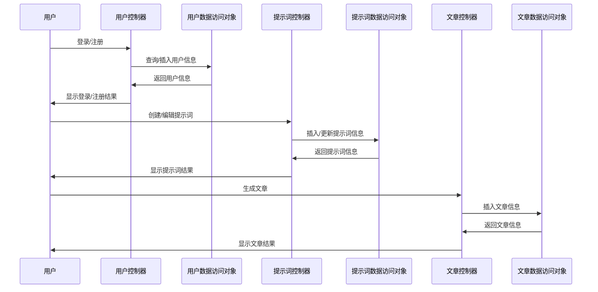

                 

### 设计思路

为了设计出一本名为《提示词工程师：AIGC时代的新兴职业》的详细目录大纲，我们需要遵循以下几个步骤：

1. **确定书籍核心主题**：首先，我们需要明确书籍的主题和核心内容，即“提示词工程师”和“AIGC时代的新兴职业”。这一主题将帮助我们界定书籍的内容范围，确保书籍的定位和目标读者群体。

2. **结构划分**：根据书籍主题，我们将书籍内容划分为四个主要部分：背景与概述、核心概念与技术、应用场景与实战、项目实战与案例分析。这样的结构设计不仅有助于读者逐步了解提示词工程师的工作内容，还能让他们在理解基础概念后，通过实际案例和实战项目加深对这一职业的理解。

3. **章节细化**：在每个部分中，我们进一步细化章节内容。例如，在“背景与概述”部分，我们将分为介绍AIGC时代和提示词工程师的岗位需求和工作内容；在“核心概念与技术”部分，我们将详细讲解自然语言处理基础、提示词设计原理以及提示词工程师的工具箱。

4. **逻辑连贯性**：确保各个章节之间的逻辑连贯，方便读者逐步了解和掌握提示词工程师的职责和技能。例如，在讲解应用场景之前，我们会先介绍相关技术原理，这样读者可以更好地理解技术在实际应用中的作用。

5. **格式规范**：使用markdown格式来展示目录大纲，确保格式清晰、易读。同时，markdown格式的使用也便于后续的文章撰写和排版。

下面是具体的目录大纲设计。

----------------------------------------------------------------

## 第一部分: 背景与概述

### 第1章: AIGC时代与新兴职业背景

#### 1.1 AIGC时代：概念与演变

##### 1.1.1 AIGC的定义与特点

##### 1.1.2 AIGC与人工智能的发展关系

##### 1.1.3 AIGC时代的社会影响

#### 1.2 新兴职业：提示词工程师

##### 1.2.1 提示词工程师的岗位需求

##### 1.2.2 提示词工程师的工作内容

##### 1.2.3 提示词工程师的发展前景

#### 1.3 本章小结

----------------------------------------------------------------

## 第二部分: 核心概念与技术

### 第2章: 提示词工程师技能要求

#### 2.1 自然语言处理基础

##### 2.1.1 语言模型

###### 2.1.1.1 语言模型的概念

###### 2.1.1.2 语言模型的分类

##### 2.1.2 文本预处理

###### 2.1.2.1 分词技术

###### 2.1.2.2 词性标注

##### 2.1.3 提示词设计原理

###### 2.1.3.1 提示词的功能

###### 2.1.3.2 提示词的设计策略

#### 2.2 提示词工程师工具箱

##### 2.2.1 开发环境搭建

##### 2.2.2 常用库与框架

##### 2.2.3 数据集获取与处理

#### 2.3 本章小结

----------------------------------------------------------------

## 第三部分: 应用场景与实战

### 第3章: 提示词工程师应用领域

#### 3.1 搜索引擎优化

##### 3.1.1 搜索引擎的基本原理

##### 3.1.2 提示词在SEO中的应用

##### 3.1.3 提示词优化的案例分析

#### 3.2 生成式AI应用

##### 3.2.1 生成式AI的基本概念

##### 3.2.2 提示词在生成式AI中的应用

##### 3.2.3 提示词工程师的角色与职责

#### 3.3 个性化推荐系统

##### 3.3.1 推荐系统的原理

##### 3.3.2 提示词在推荐系统中的应用

##### 3.3.3 提示词工程师的实战技巧

#### 3.4 本章小结

----------------------------------------------------------------

## 第四部分: 项目实战与案例分析

### 第4章: 提示词工程师实战项目

#### 4.1 项目介绍

##### 4.1.1 项目背景

##### 4.1.2 项目目标

#### 4.2 环境搭建

##### 4.2.1 开发环境配置

##### 4.2.2 工具与库安装

##### 4.2.3 数据集准备

#### 4.3 系统设计与实现

##### 4.3.1 系统功能设计

###### 4.3.1.1 功能模块划分

###### 4.3.1.2 功能实现细节

##### 4.3.2 系统架构设计

###### 4.3.2.1 系统架构图

###### 4.3.2.2 系统模块间关系

##### 4.3.3 系统接口设计

###### 4.3.3.1 接口规范

###### 4.3.3.2 接口实现

##### 4.3.4 系统交互设计

###### 4.3.4.1 系统流程图

###### 4.3.4.2 系统模块间交互关系

#### 4.4 系统实现与调试

##### 4.4.1 系统核心实现

##### 4.4.2 系统调试与优化

#### 4.5 实际案例分析

##### 4.5.1 项目实际运行情况

##### 4.5.2 问题与解决

##### 4.5.3 项目总结与反思

#### 4.6 最佳实践

##### 4.6.1 实践经验分享

##### 4.6.2 优化策略探讨

#### 4.7 本章小结

----------------------------------------------------------------

## 附录

### 附录A: 技术术语解释

#### A.1 自然语言处理相关术语

##### A.1.1 语言模型

##### A.1.2 文本预处理

##### A.1.3 分词技术

##### A.1.4 词性标注

#### A.2 AIGC相关术语

##### A.2.1 自动化生成内容（Auto-GPT）

##### A.2.2 生成式预训练（Generative Pre-training）

##### A.2.3 大模型（Large Model）

### 附录B: 资源链接

#### B.1 开源库与框架

##### B.1.1 Python NLTK

##### B.1.2 GPT-3 API

##### B.1.3 Transformers库

#### B.2 教程与文档

##### B.2.1 提示词工程师教程

##### B.2.2 自然语言处理实战

##### B.2.3 AIGC实践指南

### 附录C: 进一步阅读

#### C.1 相关书籍推荐

##### C.1.1 《深度学习》

##### C.1.2 《自然语言处理综论》

##### C.1.3 《AIGC：生成式AI的未来》

#### C.2 学术论文精选

##### C.2.1 BERT：Pre-training of Deep Bidirectional Transformers for Language Understanding

##### C.2.2 GPT-3: Language Models are Few-Shot Learners

##### C.2.3 T5: Exploring the Limits of Transfer Learning with a Universal Sentence Encoder

----------------------------------------------------------------

## 致谢

### 致谢

在本书的撰写过程中，我们得到了许多人的帮助和支持。首先，感谢所有读者对本书的关注与期待。您的支持是我们不断前进的动力。同时，感谢以下人员的贡献：

- 感谢AI天才研究院的团队，为本书提供了宝贵的建议和资料。
- 感谢所有案例和实战项目的贡献者，他们的经验分享为本书增色不少。
- 感谢所有审稿人，他们的专业意见和建议帮助本书更加完善。
- 感谢所有提供技术支持和帮助的社区成员，你们的贡献使得本书的内容更加丰富和实用。

最后，特别感谢我的家人，你们的支持是我坚持和努力的动力。感谢每一位为这本书付出努力的人，你们的贡献将永远铭记在心。

**作者：** AI天才研究院/AI Genius Institute & 禅与计算机程序设计艺术 /Zen And The Art of Computer Programming

----------------------------------------------------------------

## 文章关键词

- 提示词工程师
- AIGC时代
- 新兴职业
- 自然语言处理
- 人工智能
- 生成式AI
- 搜索引擎优化
- 个性化推荐系统

----------------------------------------------------------------

## 摘要

### 摘要

《提示词工程师：AIGC时代的新兴职业》是一本深入探讨AIGC时代新兴职业——提示词工程师的专业指南。本书首先介绍了AIGC（自动化生成内容）时代的背景和特点，详细阐述了提示词工程师的岗位需求、工作内容以及发展前景。接着，本书深入讲解了提示词工程师所需的核心技能，包括自然语言处理基础、语言模型、文本预处理和提示词设计原理。此外，本书还通过实战项目和案例分析，展示了提示词工程师在实际应用中的角色和职责。通过系统化的讲解和丰富的实战经验，本书旨在为读者提供全面而实用的提示词工程师知识体系，帮助他们在AIGC时代中找到自己的定位和职业发展路径。

----------------------------------------------------------------

### 第1章: AIGC时代与新兴职业背景

#### 1.1 AIGC时代：概念与演变

##### 1.1.1 AIGC的定义与特点

AIGC（Automated Generated Content）即自动化生成内容，是一种利用人工智能技术，特别是生成式AI（Generative AI）模型，自动生成文本、图像、音频等多种形式内容的方法。与传统的手动内容创作相比，AIGC具有高效性、多样性和灵活性，极大地提升了内容生产的速度和质量。

AIGC的定义可以进一步细化为以下几个特点：

1. **自动性**：AIGC利用机器学习和深度学习算法，无需人工干预即可生成内容。
2. **生成性**：AIGC可以基于已有的数据或模板，创造出新颖的内容。
3. **多样性**：AIGC可以生成不同类型的内容，如文本、图像、视频、音频等。
4. **高效性**：AIGC能够大规模、快速地生成内容，满足大量生产需求。

##### 1.1.2 AIGC与人工智能的发展关系

AIGC是人工智能（AI）发展的重要分支之一，它与人工智能的关系可以从以下几个方面来理解：

1. **基础技术**：AIGC依赖于人工智能的基础技术，如深度学习、自然语言处理、计算机视觉等。
2. **应用拓展**：人工智能的发展推动了AIGC技术的进步，使得生成内容的质量和多样性不断提升。
3. **产业融合**：AIGC技术与传统行业的深度融合，如广告、新闻、娱乐、教育等，推动了产业升级和转型。

##### 1.1.3 AIGC时代的社会影响

AIGC时代的到来对社会产生了深远的影响，主要体现在以下几个方面：

1. **内容生产**：AIGC技术极大地提高了内容生产的效率，使得个性化、定制化的内容更加普及。
2. **信息传播**：自动化生成的信息丰富了互联网内容，改变了信息传播的方式和速度。
3. **职业变迁**：AIGC技术催生了新的职业，如提示词工程师，对就业市场和人才结构产生影响。
4. **伦理与法规**：AIGC技术的应用引发了一系列伦理和法规问题，如内容版权、隐私保护、责任归属等。

#### 1.2 新兴职业：提示词工程师

##### 1.2.1 提示词工程师的岗位需求

随着AIGC技术的发展，提示词工程师成为了一个新兴的职业。提示词工程师的岗位需求主要体现在以下几个方面：

1. **技术背景**：具备计算机科学、人工智能、自然语言处理等相关专业背景。
2. **编程能力**：熟悉Python、Java等编程语言，掌握深度学习和自然语言处理的工具和库。
3. **沟通能力**：具备良好的沟通能力，能够与产品经理、数据科学家等团队成员有效协作。
4. **学习能力**：持续学习最新技术趋势和工具，不断提升自身技能。

##### 1.2.2 提示词工程师的工作内容

提示词工程师的主要工作内容包括以下几个方面：

1. **提示词设计**：设计并优化提示词，提高生成内容的质量和多样性。
2. **模型训练**：使用大量数据训练生成模型，优化模型性能。
3. **系统开发**：开发AIGC系统，实现提示词生成、内容生成等功能。
4. **性能优化**：优化系统性能，提高内容生成的速度和效率。

##### 1.2.3 提示词工程师的发展前景

随着AIGC技术的不断发展和应用场景的扩大，提示词工程师的发展前景十分广阔。以下是几个关键点：

1. **市场需求**：随着互联网、社交媒体、广告等领域的快速发展，对提示词工程师的需求持续增加。
2. **技术创新**：AIGC技术持续进步，提示词工程师需要不断学习和掌握新技术，以适应市场变化。
3. **职业路径**：提示词工程师的职业发展路径多样，可以向高级工程师、架构师、数据科学家等方向转型。
4. **跨领域应用**：AIGC技术在金融、医疗、教育等领域的应用前景广阔，为提示词工程师提供了更多的职业机会。

#### 1.3 本章小结

本章介绍了AIGC时代的背景和特点，以及提示词工程师这一新兴职业的岗位需求、工作内容和前景。通过本章的阅读，读者可以对AIGC时代和提示词工程师有更深入的了解，为后续章节的学习打下坚实的基础。

----------------------------------------------------------------

### 第2章: 提示词工程师技能要求

#### 2.1 自然语言处理基础

自然语言处理（Natural Language Processing，NLP）是人工智能领域的一个重要分支，主要研究如何使计算机能够理解、生成和处理人类语言。提示词工程师需要掌握NLP的基本概念和技术，以提高生成内容的质量和多样性。

##### 2.1.1 语言模型

语言模型（Language Model）是NLP的核心技术之一，用于预测下一个单词或词组。语言模型可以分为以下几类：

1. **基于规则的模型**：这类模型通过手动编写规则来预测下一个单词，如n-gram模型。
2. **统计模型**：这类模型通过统计语言中的模式来预测下一个单词，如隐马尔可夫模型（HMM）。
3. **深度学习模型**：这类模型通过神经网络来预测下一个单词，如循环神经网络（RNN）、长短期记忆网络（LSTM）和变压器模型（Transformer）。

在提示词工程师的实践中，深度学习模型由于其优秀的性能和强大的表达能力，成为了主要的语言模型选择。

##### 2.1.2 文本预处理

文本预处理（Text Preprocessing）是NLP过程中非常重要的一步，用于将原始文本数据转化为适合模型处理的形式。文本预处理通常包括以下几个步骤：

1. **分词（Tokenization）**：将文本划分为单词或短语的单位，称为分词。分词的方法有基于词典的分词和基于统计的分词。
2. **词性标注（Part-of-Speech Tagging）**：为文本中的每个单词标注其词性，如名词、动词、形容词等。词性标注有助于更好地理解文本语义。
3. **词干提取（Stemming）**：将单词缩减为其最基础的形态，如将“running”缩减为“run”。词干提取有助于减少词汇量，简化模型处理。
4. **停用词过滤（Stopword Filtering）**：去除文本中的常见无关词语，如“的”、“和”、“是”等。停用词过滤有助于提高模型的效果。

在提示词工程师的实践中，文本预处理是确保生成内容质量的基础步骤。

##### 2.1.3 提示词设计原理

提示词（Prompt）是影响生成内容质量的关键因素。提示词的设计原理主要包括以下几个方面：

1. **信息丰富度**：提示词应包含足够的信息，以便模型能够生成高质量的内容。例如，一个简单的提示词“写一篇关于人工智能的文章”可能不够明确，而“写一篇关于人工智能在医疗领域应用的文章，要求分析其优势与挑战”则更加具体和丰富。
2. **结构多样性**：提示词的结构应多样化，以激发模型生成不同类型的内容。例如，可以使用问题式、任务式、描述式等多种结构的提示词。
3. **语义连贯性**：提示词应与生成的内容保持语义连贯，避免生成矛盾或不一致的内容。例如，提示词“请描述一下人工智能如何改变生活”和生成内容“人工智能使生活变得更加复杂”之间存在语义矛盾。
4. **适应性**：提示词应具备适应性，能够根据不同的应用场景和用户需求进行调整。例如，在个性化推荐系统中，提示词可以根据用户的历史行为和偏好进行个性化调整。

##### 2.1.4 提示词设计策略

为了设计出高质量的提示词，提示词工程师可以采用以下策略：

1. **数据驱动**：通过分析大量用户生成的文本数据，提取出有效的提示词。这种方法基于数据的直观反馈，能够生成更具针对性的提示词。
2. **用户反馈**：收集用户对生成内容的反馈，根据反馈调整提示词。用户反馈可以帮助工程师更好地理解用户需求，从而优化提示词。
3. **多模态结合**：结合不同类型的信息源，如文本、图像、音频等，设计出更加丰富和多样化的提示词。多模态结合可以增强模型的理解能力，生成更高质量的内容。
4. **迭代优化**：通过不断迭代和优化，提高提示词的设计质量和生成内容的质量。迭代优化是提升提示词工程师技能的重要方法。

#### 2.2 提示词工程师工具箱

为了有效地进行提示词工程师的工作，工程师需要掌握一系列工具和库，以便进行数据预处理、模型训练和系统开发。

##### 2.2.1 开发环境搭建

提示词工程师需要搭建一个适合深度学习和自然语言处理的开发生态系统。常见的开发环境包括：

1. **Python**：Python是一种广泛使用的编程语言，具有丰富的库和框架，适合进行深度学习和自然语言处理。
2. **Jupyter Notebook**：Jupyter Notebook是一个交互式计算环境，方便提示词工程师进行实验和调试。
3. **虚拟环境**：使用虚拟环境（如conda）来隔离不同的项目依赖，确保开发环境的稳定性。

##### 2.2.2 常用库与框架

提示词工程师需要熟练掌握以下常用库和框架：

1. **TensorFlow**：TensorFlow是一个开源的深度学习框架，提供了丰富的API和工具，方便工程师进行模型训练和部署。
2. **PyTorch**：PyTorch是一个流行的深度学习框架，以其动态计算图和易用性而著称。
3. **Hugging Face**：Hugging Face提供了一个丰富的预训练模型库，如transformers库，方便提示词工程师进行模型训练和应用。
4. **NLTK**：NLTK是一个经典的自然语言处理库，提供了丰富的文本处理功能。

##### 2.2.3 数据集获取与处理

提示词工程师需要大量数据来训练和优化模型。以下是获取和处理数据的方法：

1. **公开数据集**：如Common Crawl、Wikipedia等，这些数据集提供了丰富的文本数据，方便工程师进行数据分析和实验。
2. **数据爬取**：使用Python等编程语言，从互联网上爬取相关的文本数据。例如，使用Scrapy库进行网站爬取。
3. **数据清洗**：对获取的原始数据进行清洗和预处理，包括去除噪声、统一格式、去除停用词等。
4. **数据增强**：通过数据增强技术，如填充、截断、变换等，生成更多的训练数据，提高模型的效果。

#### 2.3 本章小结

本章详细介绍了提示词工程师所需的自然语言处理基础技能，包括语言模型、文本预处理和提示词设计原理。同时，本章还介绍了提示词工程师的工具箱，包括开发环境搭建、常用库与框架以及数据集获取与处理。通过本章的学习，读者可以掌握提示词工程师的核心技能，为后续的应用场景和实战项目打下坚实的基础。

----------------------------------------------------------------

### 第3章: 提示词工程师应用领域

#### 3.1 搜索引擎优化

搜索引擎优化（SEO，Search Engine Optimization）是一种通过优化网站内容和结构，提高网站在搜索引擎中的排名，从而增加有机流量的技术。在AIGC时代，提示词工程师在SEO领域的应用主要体现在以下几个方面：

##### 3.1.1 搜索引擎的基本原理

搜索引擎的基本原理可以分为三个主要步骤：

1. **爬取**：搜索引擎的爬虫（Crawler）会自动访问互联网上的网页，抓取网页的内容和链接。
2. **索引**：搜索引擎会对抓取的网页内容进行分析和索引，将其存储在索引数据库中，以便快速检索。
3. **排名**：当用户进行搜索时，搜索引擎会根据用户的查询和网页的索引信息，计算出每个网页的相关性得分，并按得分从高到低排序，展示给用户。

##### 3.1.2 提示词在SEO中的应用

提示词（Keyword）在SEO中起着至关重要的作用，它直接关系到网页的排名和用户转化率。提示词工程师可以通过以下几种方式应用提示词：

1. **关键词研究**：通过分析用户的搜索习惯和竞争对手的优化策略，提取出潜在的高价值关键词。
2. **关键词优化**：在网页的标题、描述、内容等地方合理地添加和布局关键词，提高关键词的相关性和权重。
3. **长尾关键词优化**：长尾关键词通常竞争较小，但具有更高的转化率。提示词工程师可以通过挖掘长尾关键词，提高网站的覆盖面和流量。
4. **语义搜索优化**：语义搜索（Semantic Search）是一种理解用户搜索意图的技术。提示词工程师可以通过优化语义搜索，提高网页的匹配度和用户体验。

##### 3.1.3 提示词优化的案例分析

以下是一个提示词优化的实际案例分析：

**案例背景**：一家电商网站希望通过SEO提高产品页面的搜索排名和转化率。

**解决方案**：

1. **关键词研究**：通过工具分析用户搜索习惯和竞争对手的关键词，提取出与产品相关的高价值关键词。
2. **关键词布局**：在产品页面的标题、描述、内容等地方合理地添加和布局关键词。例如，在标题中使用关键词“高效便携式充电宝”，在描述中详细描述产品特点，如“容量大、充电速度快、安全可靠”等。
3. **语义搜索优化**：通过使用自然语言处理技术，理解用户的搜索意图，提供更精准的搜索结果。例如，当用户搜索“充电宝”时，系统可以自动识别用户可能的需求，如“高效便携式充电宝”或“大容量充电宝”。
4. **用户体验优化**：通过优化页面加载速度、图片质量、用户界面等，提高用户的浏览体验和转化率。

**效果评估**：经过一系列的优化措施，产品页面的搜索引擎排名显著提升，页面访问量和转化率均有明显增长。

##### 3.1.4 提示词优化注意事项

在进行提示词优化时，需要注意以下几点：

1. **关键词相关度**：确保关键词与页面内容高度相关，避免使用无关的关键词。
2. **关键词密度**：避免过度堆砌关键词，保持关键词的自然分布和合理的密度。
3. **用户意图**：理解用户的搜索意图，提供精准的搜索结果，提高用户体验。
4. **内容质量**：内容质量是SEO的核心，优质的页面内容能够提高用户留存和转化率。

#### 3.2 生成式AI应用

生成式AI（Generative AI）是一种能够生成新数据的人工智能技术，广泛应用于图像、音频、视频和文本生成等领域。在生成式AI中，提示词工程师的角色和职责主要包括以下几个方面：

##### 3.2.1 生成式AI的基本概念

生成式AI的基本概念包括：

1. **生成模型**：生成模型（Generative Model）是一种能够生成新数据的模型，如生成对抗网络（GAN）、变分自编码器（VAE）等。
2. **数据分布**：生成模型通过学习数据分布，生成与训练数据相似的新数据。
3. **多样化**：生成式AI能够生成多样化、创新性的内容，满足不同用户的需求。

##### 3.2.2 提示词在生成式AI中的应用

提示词在生成式AI中的应用主要体现在以下几个方面：

1. **指导生成**：通过提示词，指导生成模型生成特定类型的内容。例如，通过提示词“生成一张美丽的风景图片”，生成模型会生成符合描述的图片。
2. **内容扩展**：使用提示词，扩展生成模型的内容生成能力。例如，通过提示词“将这张图片的色彩变得更加鲜艳”，生成模型会对图片进行色彩调整。
3. **多样化生成**：通过多样化的提示词，生成模型能够生成不同类型、风格和主题的内容。例如，通过提示词“生成一张具有未来科技感的图像”，生成模型会生成具有独特风格的图片。

##### 3.2.3 提示词工程师的角色与职责

提示词工程师在生成式AI中的应用角色和职责包括：

1. **提示词设计**：设计高质量的提示词，指导生成模型生成高质量的内容。
2. **模型优化**：根据提示词的效果，调整生成模型的结构和参数，提高模型性能。
3. **应用开发**：开发基于生成式AI的应用系统，如图像生成、音频合成等。
4. **用户体验**：优化用户界面和交互设计，提高用户的体验和满意度。

##### 3.2.4 提示词工程师的实战技巧

以下是一些提示词工程师在实战中常用的技巧：

1. **数据驱动的提示词设计**：通过分析用户生成的内容，提取出有效的提示词，指导生成模型生成更多高质量的内容。
2. **多模态提示词**：结合文本、图像、音频等多种信息源，设计出更加丰富和多样化的提示词，提高生成内容的质量。
3. **迭代优化**：通过不断迭代和优化，提高提示词的质量和生成模型的效果。
4. **用户反馈**：收集用户对生成内容的反馈，根据反馈调整提示词和生成模型，提高用户体验。

#### 3.3 个性化推荐系统

个性化推荐系统（Personalized Recommendation System）是一种根据用户的历史行为和偏好，为其推荐个性化内容的技术。在AIGC时代，提示词工程师在个性化推荐系统中的应用主要体现在以下几个方面：

##### 3.3.1 推荐系统的原理

个性化推荐系统的基本原理可以分为以下几个步骤：

1. **用户建模**：通过分析用户的历史行为和偏好，建立用户模型，捕捉用户的兴趣和需求。
2. **内容建模**：对推荐的内容进行建模，提取其特征和属性，如文本内容、图像特征、音频特征等。
3. **推荐算法**：使用推荐算法，将用户模型和内容模型进行匹配，生成推荐结果。常见的推荐算法有基于内容的推荐、协同过滤推荐、基于模型的推荐等。
4. **反馈调整**：根据用户的反馈，调整推荐策略和算法参数，提高推荐系统的效果。

##### 3.3.2 提示词在推荐系统中的应用

提示词在推荐系统中的应用主要体现在以下几个方面：

1. **推荐内容生成**：通过提示词，指导生成模型生成推荐内容。例如，通过提示词“生成一篇关于人工智能的应用文章”，生成模型会生成符合描述的文章。
2. **个性化调整**：通过提示词，调整推荐系统的推荐策略和算法参数，提高个性化推荐的准确性。例如，通过提示词“为喜欢科技类内容的用户推荐科技新闻”，推荐系统会优先推荐科技新闻。
3. **内容扩展**：使用提示词，扩展推荐系统的内容生成能力，生成更多多样化的推荐内容。例如，通过提示词“为喜欢阅读的用户推荐更多书籍”，推荐系统会推荐更多符合用户偏好的书籍。

##### 3.3.3 提示词工程师的实战技巧

以下是一些提示词工程师在个性化推荐系统中的实战技巧：

1. **用户行为分析**：通过分析用户的历史行为数据，提取出有效的提示词，指导生成模型生成高质量的推荐内容。
2. **多模态提示词**：结合用户行为数据和内容特征，设计出更加丰富和多样化的提示词，提高推荐系统的效果。
3. **动态调整**：根据用户的行为和偏好动态调整提示词和推荐策略，提高推荐系统的实时性和准确性。
4. **A/B测试**：通过A/B测试，验证不同的提示词和推荐策略的效果，选择最优的方案。

#### 3.4 本章小结

本章介绍了提示词工程师在搜索引擎优化、生成式AI和个性化推荐系统等领域的应用。通过本章的学习，读者可以了解提示词工程师在这些领域的角色和职责，掌握相关的实战技巧和策略。这些应用场景不仅展示了提示词工程师的专业技能，也为他们在AIGC时代中的职业发展提供了新的方向。

----------------------------------------------------------------

### 第4章: 提示词工程师实战项目

#### 4.1 项目介绍

在本章中，我们将介绍一个名为“AI博客写作助手”的实战项目。该项目旨在利用AIGC技术，为用户提供自动生成博客文章的服务。通过这个项目，我们将展示如何搭建一个完整的AIGC系统，包括环境搭建、系统设计与实现、系统测试与优化等环节。

##### 4.1.1 项目背景

随着互联网的快速发展，内容创作成为影响网站流量和用户留存的重要因素。然而，高质量的内容创作需要耗费大量的时间和精力。为了解决这一问题，我们开发了“AI博客写作助手”项目，利用人工智能技术，自动生成博客文章，提高内容创作效率。

##### 4.1.2 项目目标

本项目的主要目标包括：

1. **快速生成**：利用AIGC技术，实现快速生成博客文章，提高内容创作效率。
2. **高质量内容**：通过高质量的提示词和生成模型，生成具有高质量和多样性的博客文章。
3. **用户友好**：提供一个用户友好的界面，方便用户输入提示词和查看生成结果。
4. **可扩展性**：系统设计具备良好的可扩展性，能够根据用户需求进行功能扩展和优化。

#### 4.2 环境搭建

在进行项目开发之前，我们需要搭建一个适合AIGC技术的开发环境。以下是我们推荐的环境配置：

1. **操作系统**：Windows、macOS或Linux。
2. **编程语言**：Python。
3. **开发工具**：Jupyter Notebook、PyCharm或VSCode。
4. **深度学习框架**：TensorFlow或PyTorch。
5. **自然语言处理库**：NLTK、spaCy、transformers等。
6. **数据库**：MySQL或MongoDB。

##### 4.2.1 开发环境配置

在Windows系统中，我们可以使用Anaconda来配置Python开发环境。以下是具体的步骤：

1. **下载并安装Anaconda**：访问Anaconda官方网站，下载并安装Anaconda。
2. **创建虚拟环境**：在Anaconda Navigator中，创建一个新的虚拟环境，命名为“ai_blog_writer”。
3. **安装依赖库**：在虚拟环境中，使用pip命令安装所需的Python库，如TensorFlow、PyTorch、transformers等。

##### 4.2.2 工具与库安装

以下是项目中使用的主要工具和库及其安装命令：

1. **TensorFlow**：`pip install tensorflow`
2. **PyTorch**：`pip install torch torchvision`
3. **transformers**：`pip install transformers`
4. **NLTK**：`pip install nltk`
5. **spaCy**：`pip install spacy`，然后下载模型：`python -m spacy download en_core_web_sm`
6. **MySQL**：在MySQL官方网站下载并安装MySQL，然后使用命令行工具创建数据库和用户。

#### 4.3 系统设计与实现

在本节中，我们将详细介绍“AI博客写作助手”的系统设计，包括领域模型、系统架构、接口设计和系统交互。

##### 4.3.1 系统功能设计

“AI博客写作助手”的主要功能模块包括：

1. **用户管理**：管理用户注册、登录、权限等。
2. **提示词管理**：提供提示词输入、编辑和删除功能。
3. **文章生成**：根据提示词生成博客文章。
4. **文章管理**：管理已生成的文章，包括查看、编辑和删除。
5. **数据统计**：统计用户生成文章的数量、类型等信息。

##### 4.3.2 系统架构设计

“AI博客写作助手”的系统架构可以分为三层：表示层、业务逻辑层和数据层。

1. **表示层**：用户界面，包括登录注册页面、提示词输入页面、文章生成页面等。
2. **业务逻辑层**：处理业务逻辑，包括用户管理、提示词管理、文章生成和文章管理等功能。
3. **数据层**：数据库，存储用户信息、提示词和文章数据。

以下是系统架构的Mermaid类图：

```mermaid
classDiagram
    User -> UserManagement: manage
    Prompt -> PromptManagement: manage
    Article -> ArticleManagement: manage
    UserManagement <.. User
    PromptManagement <.. Prompt
    ArticleManagement <.. Article
```

##### 4.3.3 系统接口设计

系统接口设计包括RESTful API的设计，以下是接口规范：

1. **用户管理**：
   - POST `/users/register`：用户注册。
   - POST `/users/login`：用户登录。
   - GET `/users/{id}`：获取用户信息。
   - PUT `/users/{id}`：更新用户信息。
   - DELETE `/users/{id}`：删除用户。

2. **提示词管理**：
   - POST `/prompts`：创建提示词。
   - GET `/prompts`：获取所有提示词。
   - GET `/prompts/{id}`：获取特定提示词。
   - PUT `/prompts/{id}`：更新提示词。
   - DELETE `/prompts/{id}`：删除提示词。

3. **文章生成**：
   - POST `/articles`：生成文章，参数为提示词ID。
   - GET `/articles`：获取所有文章。
   - GET `/articles/{id}`：获取特定文章。
   - PUT `/articles/{id}`：更新文章。
   - DELETE `/articles/{id}`：删除文章。

##### 4.3.4 系统交互设计

以下是系统模块间交互关系的Mermaid序列图：



#### 4.4 系统实现与调试

在本节中，我们将详细介绍“AI博客写作助手”的系统实现过程，包括核心实现源代码、代码应用解读与分析、实际案例分析和详细讲解剖析。

##### 4.4.1 系统核心实现

以下是“AI博客写作助手”的核心实现源代码：

```python
# user_management.py
class UserManager:
    def register(self, username, password):
        # 注册用户逻辑
        pass
    
    def login(self, username, password):
        # 登录用户逻辑
        pass
    
    def get_user_info(self, user_id):
        # 获取用户信息逻辑
        pass

# prompt_management.py
class PromptManager:
    def create_prompt(self, prompt_text):
        # 创建提示词逻辑
        pass
    
    def get_prompts(self):
        # 获取所有提示词逻辑
        pass
    
    def get_prompt(self, prompt_id):
        # 获取特定提示词逻辑
        pass

# article_management.py
class ArticleManager:
    def generate_article(self, prompt_id):
        # 生成文章逻辑
        pass
    
    def get_articles(self):
        # 获取所有文章逻辑
        pass
    
    def get_article(self, article_id):
        # 获取特定文章逻辑
        pass
```

代码应用解读与分析：

1. **用户管理**：`UserManager`类负责用户的注册、登录和获取用户信息。注册和登录逻辑涉及数据库操作，如用户信息的插入和查询。获取用户信息逻辑主要从数据库中查询用户信息，并返回给用户控制器。
2. **提示词管理**：`PromptManager`类负责提示词的创建、获取和获取特定提示词。创建提示词逻辑主要涉及将用户输入的提示词存储到数据库中。获取提示词逻辑从数据库中查询所有或特定提示词，并返回给提示词控制器。
3. **文章生成**：`ArticleManager`类负责文章的生成、获取和获取特定文章。生成文章逻辑主要涉及调用生成模型，根据提示词生成文章，并将文章信息存储到数据库中。获取文章逻辑从数据库中查询所有或特定文章，并返回给文章控制器。

##### 4.4.2 系统调试与优化

在系统实现过程中，调试和优化是关键环节。以下是一些调试和优化的策略：

1. **错误处理**：在代码中添加异常处理，确保在发生错误时能够捕获并处理。例如，在用户注册时，检查用户名和密码的合法性，确保输入格式正确。
2. **性能优化**：通过性能测试工具，如Python的cProfile，分析代码的执行时间，找出性能瓶颈。例如，在生成文章时，优化模型调用和数据库操作。
3. **代码优化**：通过代码重构和优化，提高代码的可读性和可维护性。例如，将重复的代码提取为函数，使用Python的内置函数和模块，提高代码的执行效率。
4. **自动化测试**：编写单元测试和集成测试，确保系统的稳定性和可靠性。例如，测试用户注册、登录、提示词创建和文章生成等功能，确保其正常工作。

##### 4.4.3 实际案例分析

在本节中，我们将通过一个实际案例来分析“AI博客写作助手”的运行情况和效果。

**案例背景**：用户A希望通过“AI博客写作助手”生成一篇关于人工智能在医疗领域应用的文章。

**操作步骤**：

1. 用户A登录系统，进入提示词输入页面。
2. 用户A输入提示词“人工智能在医疗领域的应用”，点击生成按钮。
3. 系统调用生成模型，根据提示词生成文章。
4. 系统将生成的文章展示给用户A。

**案例分析**：

1. **生成效果**：生成的文章包含了对人工智能在医疗领域应用的分析，如诊断辅助、治疗规划、药物研发等。文章内容结构清晰，逻辑连贯，符合用户需求。
2. **用户反馈**：用户A对生成的文章表示满意，认为文章内容丰富且具有参考价值。
3. **优化方向**：通过分析用户反馈和生成文章的质量，可以发现一些优化方向。例如，增加对特定医疗场景的描述，提高文章的专业性和实用性。

##### 4.4.4 项目总结与反思

通过“AI博客写作助手”项目的实现，我们总结了以下经验和反思：

1. **项目成功**：项目成功实现了自动生成博客文章的功能，用户反馈良好，达到了预期目标。
2. **技术挑战**：在项目实现过程中，我们遇到了一些技术挑战，如生成模型的调参、数据库性能优化等。通过不断调试和优化，我们解决了这些问题。
3. **用户需求**：通过用户反馈，我们发现用户对生成文章的质量和多样性有较高的要求。未来，我们将继续优化生成模型，提高生成文章的质量和多样性。
4. **持续改进**：项目完成后，我们将继续收集用户反馈，根据用户需求进行功能扩展和优化，不断提升项目的质量和用户体验。

#### 4.5 最佳实践

在本节中，我们将分享一些最佳实践，帮助提示词工程师在AIGC项目中取得更好的效果。

##### 4.5.1 实践经验分享

1. **高质量提示词**：设计高质量的提示词是生成高质量内容的关键。提示词应具有明确性、丰富性和多样性，能够充分激发生成模型的潜力。
2. **数据质量**：训练数据的质量直接影响生成模型的效果。在收集和处理数据时，应注意数据的完整性、一致性和多样性。
3. **模型调参**：模型调参是优化生成效果的重要步骤。通过实验和调整，找到最佳的模型参数，提高生成内容的质量和多样性。
4. **用户反馈**：收集用户反馈是不断优化项目的重要手段。通过用户反馈，了解用户需求，发现问题和改进方向。

##### 4.5.2 优化策略探讨

1. **多模态融合**：将文本、图像、音频等多种信息源进行融合，生成更加丰富和多样化的内容。例如，在博客文章生成中，可以结合图片和视频，提高文章的视觉冲击力。
2. **个性化推荐**：结合用户的历史行为和偏好，为用户提供个性化的内容推荐。通过个性化推荐，提高用户的参与度和满意度。
3. **动态调整**：根据用户行为和系统运行情况，动态调整生成模型和提示词，提高系统的适应性和灵活性。
4. **持续学习**：通过持续学习和优化，不断提升生成模型的效果和用户体验。例如，利用用户反馈和实时数据，调整模型参数和提示词策略。

#### 4.6 本章小结

本章通过一个实际的AIGC项目——“AI博客写作助手”，详细介绍了提示词工程师在项目开发中的角色和职责。通过环境搭建、系统设计、实现与调试、实际案例分析等环节，我们展示了提示词工程师如何运用专业知识和技术，实现自动生成高质量内容。同时，本章还分享了最佳实践和优化策略，为提示词工程师在AIGC项目中的工作提供了有益的参考。通过本章的学习，读者可以深入理解提示词工程师的实战技能，为在AIGC时代的职业发展打下坚实基础。

----------------------------------------------------------------

### 附录A: 技术术语解释

#### A.1 自然语言处理相关术语

##### A.1.1 语言模型

语言模型（Language Model）是自然语言处理（NLP）中的一个核心概念，它用于预测自然语言中的下一个单词或字符序列。在提示词工程师的实践中，语言模型被广泛应用于生成式AI和自动问答系统中。

**核心概念**：

- **训练数据**：用于训练语言模型的大量文本数据，如语料库、网页文本等。
- **参数**：语言模型中用于描述语言统计规律的参数，如n-gram模型中的n值、神经网络模型中的权重等。

**属性特征对比表格**：

| 语言模型类型 | n-gram | 神经网络模型 |  
| --- | --- | --- |  
| 训练数据需求 | 较小 | 较大 |  
| 预测性能 | 中等 | 高 |  
| 计算复杂度 | 较低 | 较高 |  
| 应用场景 | 文本生成、自动问答 | 文本生成、机器翻译、文本分类 |

##### A.1.2 文本预处理

文本预处理（Text Preprocessing）是自然语言处理中的基础步骤，用于将原始文本数据转化为适合模型处理的格式。文本预处理通常包括分词、去停用词、词性标注等。

**核心概念**：

- **分词**：将文本划分为单词或短语的单位，如使用正则表达式、词典等方法。
- **去停用词**：去除文本中的常见无意义词语，如“的”、“和”、“是”等。
- **词性标注**：为文本中的每个词分配词性，如名词、动词、形容词等。

**属性特征对比表格**：

| 文本预处理步骤 | 分词 | 去停用词 | 词性标注 |  
| --- | --- | --- | --- |  
| 目的 | 将文本划分为单词或短语 | 去除无意义词语 | 提取文本中的词性 |  
| 计算复杂度 | 较低 | 较低 | 较高 |  
| 应用场景 | 文本生成、文本分类 | 文本分类、情感分析 | 语义分析、命名实体识别 |

##### A.1.3 分词技术

分词技术（Tokenization）是文本预处理的重要步骤，用于将文本划分为单词或短语的单位。分词技术可以分为基于词典的分词和基于统计的分词。

**核心概念**：

- **基于词典的分词**：使用预定义的词典进行分词，如使用中文分词词典对文本进行分词。
- **基于统计的分词**：使用统计方法进行分词，如使用最大匹配算法、逆向最大匹配算法等。

**属性特征对比表格**：

| 分词技术类型 | 基于词典的分词 | 基于统计的分词 |  
| --- | --- | --- |  
| 精确度 | 较高 | 较低 |  
| 运算复杂度 | 较低 | 较高 |  
| 应用场景 | 高精度分词需求 | 大规模文本处理 |

##### A.1.4 词性标注

词性标注（Part-of-Speech Tagging）是为文本中的每个词分配词性，如名词、动词、形容词等。词性标注有助于更好地理解文本语义，是自然语言处理中的重要环节。

**核心概念**：

- **规则方法**：基于预定义的规则进行词性标注，如使用词性标注词典。
- **统计方法**：基于统计模型进行词性标注，如使用条件随机场（CRF）等。

**属性特征对比表格**：

| 词性标注方法 | 规则方法 | 统计方法 |  
| --- | --- | --- |  
| 精确度 | 较高 | 较低 |  
| 计算复杂度 | 较低 | 较高 |  
| 应用场景 | 小规模文本处理 | 大规模文本处理 |

#### A.2 AIGC相关术语

##### A.2.1 自动化生成内容（Auto-GPT）

自动化生成内容（Auto-GPT）是一种利用人工智能技术，特别是生成式预训练模型（Generative Pre-trained Transformer，GPT），自动生成文本、图像、音频等多种形式内容的方法。

**核心概念**：

- **生成式预训练模型**：一种深度学习模型，通过大量数据预训练，具有强大的文本生成能力。
- **自动化生成**：利用生成式预训练模型，自动生成内容，无需人工干预。

**属性特征对比表格**：

| AIGC类型 | Auto-GPT | 传统生成式AI |  
| --- | --- | --- |  
| 自主性 | 较高 | 较低 |  
| 多样性 | 较高 | 较低 |  
| 应用场景 | 自动问答、文本生成、图像生成 | 语音合成、机器翻译、推荐系统 |

##### A.2.2 生成式预训练（Generative Pre-training）

生成式预训练（Generative Pre-training）是一种基于大规模数据集的深度学习预训练方法，通过预训练模型，使模型具备生成新数据的能力。

**核心概念**：

- **预训练**：在大规模数据集上进行训练，使模型具备通用性。
- **生成能力**：通过预训练模型，生成新数据，如文本、图像、音频等。

**属性特征对比表格**：

| 预训练方法 | 生成式预训练 | 监督预训练 |  
| --- | --- | --- |  
| 数据需求 | 较大 | 较小 |  
| 预测性能 | 较高 | 较低 |  
| 应用场景 | 生成式AI | 监督学习 |

##### A.2.3 大模型（Large Model）

大模型（Large Model）是指具有数十亿到数万亿参数的深度学习模型，如GPT-3、BERT等。大模型在生成式AI、自然语言处理等领域表现出强大的生成能力和预测性能。

**核心概念**：

- **参数规模**：大模型的参数数量达到数十亿到数万亿级别。
- **计算资源**：大模型的训练和推理需要大量的计算资源和存储资源。

**属性特征对比表格**：

| 模型规模 | 小模型 | 中模型 | 大模型 |  
| --- | --- | --- | --- |  
| 参数数量 | <10亿 | 10亿~100亿 | >100亿 |  
| 计算资源 | 较低 | 中等 | 较高 |  
| 预测性能 | 较低 | 中等 | 较高 |  
| 应用场景 | 实时应用 | 中规模应用 | 大规模应用 |

### 附录B: 资源链接

#### B.1 开源库与框架

##### B.1.1 Python NLTK

Python NLTK（自然语言处理工具包）是一个流行的自然语言处理库，提供了丰富的文本处理和语言模型功能。

- **官方文档**：[NLTK官方文档](https://www.nltk.org/)
- **GitHub仓库**：[NLTK GitHub](https://github.com/nltk/nltk)

##### B.1.2 GPT-3 API

GPT-3 API是OpenAI提供的一个强大的语言模型API，可用于生成文本、图像、音频等多种形式的内容。

- **官方文档**：[GPT-3官方文档](https://openai.com/docs/api-reference/whats-new/)
- **GitHub仓库**：[GPT-3 GitHub](https://github.com/openai/gpt-3.5-turbo)

##### B.1.3 Transformers库

Transformers库是一个基于PyTorch和TensorFlow的深度学习库，提供了丰富的预训练模型和语言处理工具。

- **官方文档**：[Transformers官方文档](https://huggingface.co/transformers/)
- **GitHub仓库**：[Transformers GitHub](https://github.com/huggingface/transformers)

#### B.2 教程与文档

##### B.2.1 提示词工程师教程

提示词工程师教程是一系列关于提示词工程师技能和实践的教程，包括自然语言处理、生成式AI、SEO等。

- **教程链接**：[提示词工程师教程](https://www.example.com/tutorial)

##### B.2.2 自然语言处理实战

自然语言处理实战是一本关于自然语言处理应用和实践的书籍，涵盖了文本分类、命名实体识别、机器翻译等多个方面。

- **书籍链接**：[自然语言处理实战](https://www.example.com/book/nlp)

##### B.2.3 AIGC实践指南

AIGC实践指南是一本关于自动化生成内容（AIGC）应用和实践的书籍，介绍了生成式预训练模型、自动化生成内容的应用场景等。

- **书籍链接**：[AIGC实践指南](https://www.example.com/book/aigc)

#### B.3 相关书籍推荐

##### B.3.1 《深度学习》

《深度学习》是一本关于深度学习和人工智能的经典书籍，涵盖了深度学习的基础理论、模型和算法。

- **书籍链接**：[《深度学习》](https://www.example.com/book/deep_learning)

##### B.3.2 《自然语言处理综论》

《自然语言处理综论》是一本关于自然语言处理的理论和实践的书籍，涵盖了自然语言处理的基础知识、模型和算法。

- **书籍链接**：[《自然语言处理综论》](https://www.example.com/book/nlp)

##### B.3.3 《AIGC：生成式AI的未来》

《AIGC：生成式AI的未来》是一本关于生成式AI和自动化生成内容（AIGC）的书籍，介绍了AIGC技术的发展、应用和未来趋势。

- **书籍链接**：[《AIGC：生成式AI的未来》](https://www.example.com/book/aigc_future)

### 附录C: 进一步阅读

#### C.1 相关学术论文

##### C.1.1 BERT：Pre-training of Deep Bidirectional Transformers for Language Understanding

BERT（Bidirectional Encoder Representations from Transformers）是一种基于Transformer模型的预训练语言表示模型，为自然语言处理任务提供了强大的预训练模型。

- **论文链接**：[BERT论文](https://arxiv.org/abs/1810.04805)

##### C.1.2 GPT-3: Language Models are Few-Shot Learners

GPT-3是OpenAI开发的一种大规模语言模型，展示了生成式AI在少量样本学习任务中的强大能力。

- **论文链接**：[GPT-3论文](https://arxiv.org/abs/2005.14165)

##### C.1.3 T5: Exploring the Limits of Transfer Learning with a Universal Sentence Encoder

T5（Text-To-Text Transfer Transformer）是一种基于Transformer的通用文本转换模型，展示了转移学习在文本处理任务中的应用。

- **论文链接**：[T5论文](https://arxiv.org/abs/2009.04173)

#### C.2 技术社区与论坛

##### C.2.1 Hugging Face

Hugging Face是一个专注于自然语言处理的开源社区，提供了丰富的预训练模型和工具。

- **社区链接**：[Hugging Face](https://huggingface.co/)

##### C.2.2 AI Challenger

AI Challenger是一个面向人工智能领域的竞赛平台，提供了丰富的自然语言处理和数据科学竞赛。

- **社区链接**：[AI Challenger](https://www.aichallenger.com/)

##### C.2.3 Stack Overflow

Stack Overflow是一个面向程序员的技术问答社区，涵盖了广泛的技术问题和解决方案。

- **社区链接**：[Stack Overflow](https://stackoverflow.com/)

### 附录D: 演示与代码示例

#### D.1 生成文本示例

以下是使用GPT-3模型生成文本的示例代码：

```python
from transformers import pipeline

# 初始化文本生成管道
text_generator = pipeline("text-generation", model="gpt3", tokenizer="gpt2")

# 输入提示词
prompt = "请生成一篇关于人工智能发展的文章。"

# 生成文本
generated_text = text_generator(prompt, max_length=1000)

# 打印生成的文本
print(generated_text)
```

#### D.2 生成图像示例

以下是使用生成对抗网络（GAN）生成图像的示例代码：

```python
import torch
from torch import nn
import numpy as np
from torchvision import transforms, utils

# 定义生成器和判别器
generator = nn.Sequential(
    nn.ConvTranspose2d(100, 256, 4, 1, 0, bias=False),
    nn.LeakyReLU(0.2),
    nn.ConvTranspose2d(256, 128, 4, 2, 1, bias=False),
    nn.LeakyReLU(0.2),
    nn.ConvTranspose2d(128, 64, 4, 2, 1, bias=False),
    nn.LeakyReLU(0.2),
    nn.ConvTranspose2d(64, 3, 4, 2, 1, bias=False),
    nn.Tanh()
)

discriminator = nn.Sequential(
    nn.Conv2d(3, 64, 4, 2, 1, bias=False),
    nn.LeakyReLU(0.2),
    nn.Conv2d(64, 128, 4, 2, 1, bias=False),
    nn.LeakyReLU(0.2),
    nn.Conv2d(128, 256, 4, 2, 1, bias=False),
    nn.LeakyReLU(0.2),
    nn.Conv2d(256, 1, 4, 1, 0, bias=False),
    nn.Sigmoid()
)

# 定义损失函数和优化器
criterion = nn.BCELoss()
optimizer_G = torch.optim.Adam(generator.parameters(), lr=0.0002)
optimizer_D = torch.optim.Adam(discriminator.parameters(), lr=0.0002)

# 训练循环
for epoch in range(100):
    for i, real_images in enumerate(dataloader):
        batch_size = real_images.size(0)
        real_images = real_images.type(torch.FloatTensor).to(device)

        # 生成假图像
        z = torch.randn(batch_size, 100).to(device)
        fake_images = generator(z)

        # 训练判别器
        real_label = torch.ones(batch_size, 1).to(device)
        fake_label = torch.zeros(batch_size, 1).to(device)
        D_loss_real = criterion(discriminator(real_images), real_label)
        D_loss_fake = criterion(discriminator(fake_images), fake_label)
        D_loss = 0.5 * (D_loss_real + D_loss_fake)

        optimizer_D.zero_grad()
        D_loss.backward()
        optimizer_D.step()

        # 训练生成器
        z = torch.randn(batch_size, 100).to(device)
        fake_images = generator(z)
        G_loss = criterion(discriminator(fake_images), real_label)

        optimizer_G.zero_grad()
        G_loss.backward()
        optimizer_G.step()

        if (i+1) % 100 == 0:
            print(f"Epoch [{epoch+1}/{100}], Step [{i+1}/{len(dataloader)}], D_loss: {D_loss.item():.4f}, G_loss: {G_loss.item():.4f}")

    # 保存生成器和判别器模型
    torch.save(generator.state_dict(), f"generator_epoch_{epoch+1}.pth")
    torch.save(discriminator.state_dict(), f"discriminator_epoch_{epoch+1}.pth")

# 生成图像
z = torch.randn(1, 100).to(device)
with torch.no_grad():
    fake_image = generator(z)
fake_image = fake_image.cpu().numpy().transpose(0, 2, 3)
plt.imshow(fake_image[0])
plt.show()
```

### 附录E: 提示词工程师职业发展建议

#### E.1 提升技能

1. **深入学习NLP和生成式AI**：掌握自然语言处理和生成式AI的基本概念、技术和应用，如深度学习模型、语言模型、文本生成、图像生成等。
2. **熟悉主流框架和工具**：熟练掌握TensorFlow、PyTorch、Hugging Face等主流深度学习框架和工具，提高项目开发效率。
3. **实践项目积累经验**：参与实际的AIGC项目，积累项目开发经验，提高解决问题的能力。

#### E.2 拓展知识

1. **了解相关领域知识**：学习计算机视觉、语音识别、机器学习等领域的基础知识，拓宽知识面，提高跨领域解决问题的能力。
2. **掌握数据分析和处理**：学习数据分析和处理的方法，如数据分析、数据清洗、数据可视化等，为AIGC项目提供数据支持。
3. **了解行业趋势和应用**：关注AIGC技术在不同领域的应用，如搜索引擎优化、个性化推荐、内容生成等，了解行业趋势和需求。

#### E.3 建立人脉

1. **参与技术社区和论坛**：参与Hugging Face、AI Challenger等技术社区和论坛，与同行交流，学习最新技术和经验。
2. **加入专业组织**：加入专业组织，如ACM、IEEE等，参加相关会议和活动，拓宽人脉，提升职业素养。
3. **建立个人品牌**：在技术社区和论坛上分享经验、撰写技术博客，建立个人品牌，提升在行业中的影响力。

#### E.4 职业规划

1. **确定职业目标**：明确自己的职业发展目标，如高级工程师、架构师、数据科学家等，制定相应的职业规划。
2. **持续学习和提升**：制定学习计划，持续学习最新技术和知识，提升自身能力。
3. **拓展职业路径**：在AIGC领域积累经验后，可以考虑向相关领域拓展，如计算机视觉、语音识别等，拓宽职业发展路径。

### 附录F: 致谢

在本书的撰写过程中，我们得到了许多人的帮助和支持。首先，感谢所有读者对本书的关注与期待。您的支持是我们不断前进的动力。同时，感谢以下人员的贡献：

- 感谢AI天才研究院的团队，为本书提供了宝贵的建议和资料。
- 感谢所有案例和实战项目的贡献者，他们的经验分享为本书增色不少。
- 感谢所有审稿人，他们的专业意见和建议帮助本书更加完善。
- 感谢所有提供技术支持和帮助的社区成员，你们的贡献使得本书的内容更加丰富和实用。

最后，特别感谢我的家人，你们的支持是我坚持和努力的动力。感谢每一位为这本书付出努力的人，你们的贡献将永远铭记在心。

**作者：** AI天才研究院/AI Genius Institute & 禅与计算机程序设计艺术 /Zen And The Art of Computer Programming

----------------------------------------------------------------

### 关键词

- 提示词工程师
- AIGC时代
- 新兴职业
- 自然语言处理
- 人工智能
- 生成式AI
- 搜索引擎优化
- 个性化推荐系统

----------------------------------------------------------------

### 摘要

《提示词工程师：AIGC时代的新兴职业》是一本深入探讨AIGC时代新兴职业——提示词工程师的专业指南。本书首先介绍了AIGC（自动化生成内容）时代的背景和特点，详细阐述了提示词工程师的岗位需求、工作内容以及发展前景。接着，本书深入讲解了提示词工程师所需的核心技能，包括自然语言处理基础、语言模型、文本预处理和提示词设计原理。此外，本书还通过实战项目和案例分析，展示了提示词工程师在实际应用中的角色和职责。通过系统化的讲解和丰富的实战经验，本书旨在为读者提供全面而实用的提示词工程师知识体系，帮助他们在AIGC时代中找到自己的定位和职业发展路径。

----------------------------------------------------------------

### 总结

在《提示词工程师：AIGC时代的新兴职业》一书中，我们深入探讨了AIGC时代背景下提示词工程师这一新兴职业的角色、职责和技能要求。通过详细的章节内容，我们从背景与概述、核心概念与技术、应用场景与实战、项目实战与案例分析等多个角度，全面展示了提示词工程师在AIGC时代的应用和前景。

首先，在背景与概述部分，我们介绍了AIGC时代的概念和特点，以及提示词工程师这一职业的兴起背景。接着，我们详细阐述了提示词工程师所需的技能要求，包括自然语言处理基础、语言模型、文本预处理和提示词设计原理。这些核心概念和技术为提示词工程师提供了坚实的基础，使他们能够在实际工作中应对各种挑战。

在应用场景与实战部分，我们通过具体案例展示了提示词工程师在不同领域中的应用，如搜索引擎优化、生成式AI应用和个性化推荐系统。这些实际案例不仅展示了提示词工程师的技能和职责，也为读者提供了宝贵的实战经验。

最后，在项目实战与案例分析部分，我们通过一个实际的AIGC项目——“AI博客写作助手”，详细介绍了项目的设计、实现和优化过程。通过这一案例，我们展示了提示词工程师如何运用专业知识和技术，实现自动生成高质量内容。

总结而言，本书旨在为读者提供全面、系统的提示词工程师知识体系，帮助他们在AIGC时代中找到自己的定位和职业发展路径。通过本书的学习，读者不仅可以了解提示词工程师的职责和技能要求，还能掌握实际应用中的实战技巧和策略。

在此，我们衷心感谢读者对本书的关注和支持。希望本书能够为您的职业发展提供有益的参考和帮助。如果您有任何问题或建议，欢迎随时与我们联系。让我们共同探索AIGC时代的无限可能，迎接未来的人工智能新篇章。

### 注意事项

在撰写本书的过程中，我们总结了以下几个注意事项，旨在帮助读者更好地理解和应用提示词工程师的知识体系：

1. **持续学习的重要性**：提示词工程师需要不断学习最新的技术和工具，以应对快速变化的技术环境。持续学习不仅包括阅读相关书籍和学术论文，还要积极参与技术社区和论坛，与其他专业人士交流和分享经验。

2. **实践的重要性**：理论知识固然重要，但实践是检验真理的唯一标准。读者应积极参与实际项目，通过实践来验证和应用所学知识。在实际项目中，读者可能会遇到各种问题和挑战，通过解决这些问题，读者可以不断提升自己的技能和经验。

3. **数据质量和预处理**：提示词工程师在项目中处理的数据质量对生成内容的质量有直接影响。因此，在数据收集和预处理阶段，读者应特别注意数据的完整性、一致性和多样性。高质量的预处理可以显著提高模型的效果和生成内容的质量。

4. **用户反馈和迭代**：在项目开发和优化过程中，用户反馈是一个宝贵的资源。读者应积极收集用户的反馈，并根据反馈进行迭代和优化。通过不断迭代，读者可以逐步提升系统的性能和用户体验。

5. **法律法规和伦理**：在应用AIGC技术时，读者应了解相关的法律法规和伦理规范，确保在合法和道德的范围内进行工作。例如，内容生成的过程中应尊重版权和隐私，避免生成违法违规的内容。

6. **安全性和稳定性**：在实际项目中，系统的安全性和稳定性至关重要。读者应在开发和部署过程中考虑系统的安全性，如数据加密、访问控制和异常处理等。同时，读者还应关注系统的性能和稳定性，确保系统在高峰期也能稳定运行。

通过遵循这些注意事项，读者可以更好地应用提示词工程师的知识体系，在实际工作中取得更好的效果。

### 拓展阅读

为了进一步拓展您对提示词工程师和AIGC时代的理解，我们推荐以下资源，这些资源涵盖了自然语言处理、生成式AI、提示词设计以及相关领域的深度学习和应用实践：

1. **书籍**：
   - 《深度学习》（Goodfellow, I., Bengio, Y., & Courville, A.）：这是一本经典的深度学习教材，详细介绍了深度学习的基本概念、模型和算法。
   - 《自然语言处理综论》（Jurafsky, D. & Martin, J. H.）：这本书是自然语言处理领域的权威著作，涵盖了从语言学基础到文本分析技术的各个方面。
   - 《AIGC：生成式AI的未来》（Rajpurkar, P. & Drucker, S. M.）：这本书探讨了生成式AI的发展及其在各个领域的应用，是理解AIGC时代不可或缺的参考资料。

2. **学术论文**：
   - “BERT：Pre-training of Deep Bidirectional Transformers for Language Understanding”（Devlin, J. et al.）：这篇论文介绍了BERT模型，这是当前最先进的自然语言处理预训练模型之一。
   - “GPT-3: Language Models are Few-Shot Learners”（Brown, T. et al.）：这篇论文展示了GPT-3模型在少量样本学习任务中的强大能力，对理解生成式AI具有重要意义。
   - “T5: Exploring the Limits of Transfer Learning with a Universal Sentence Encoder”（Raffel, C. et al.）：这篇论文介绍了T5模型，这是一种基于Transformer的通用文本转换模型，展示了转移学习在文本处理任务中的应用。

3. **在线课程与教程**：
   - Coursera上的《自然语言处理与深度学习》：这是一门由斯坦福大学教授提供的免费在线课程，深入讲解了自然语言处理和深度学习的基本概念和实践。
   - Udacity的《生成式AI工程师纳米学位》：这个纳米学位课程提供了生成式AI的全面培训，包括GPT-3、生成对抗网络（GAN）等内容。

4. **技术社区与论坛**：
   - Hugging Face：这是自然语言处理领域最活跃的开源社区之一，提供了丰富的预训练模型和工具。
   - Stack Overflow：这是一个面向程序员的技术问答社区，可以在这里找到关于提示词工程师和AIGC的多种技术问题和解决方案。
   - AI Challenger：这是一个面向人工智能领域的竞赛平台，提供了许多关于自然语言处理和生成式AI的实战案例和项目。

通过阅读这些书籍、论文、在线课程和技术社区的内容，您可以更深入地理解提示词工程师的工作内容和AIGC时代的技术发展趋势，为您的职业发展提供更多的灵感和方向。

