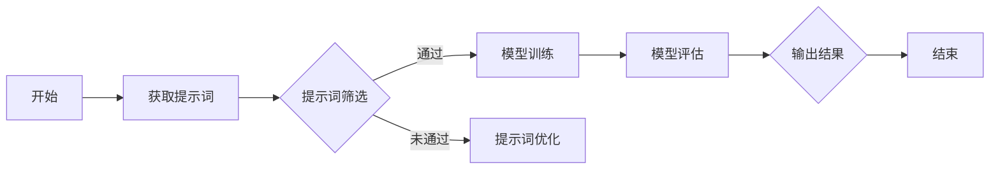
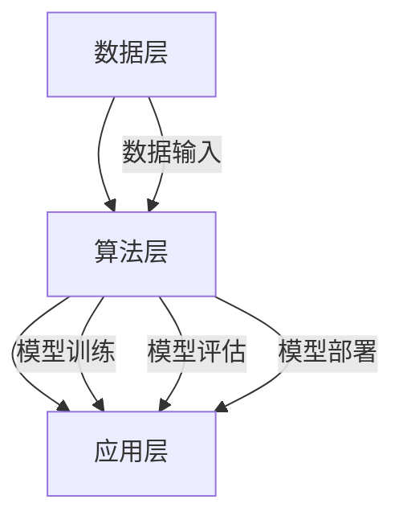
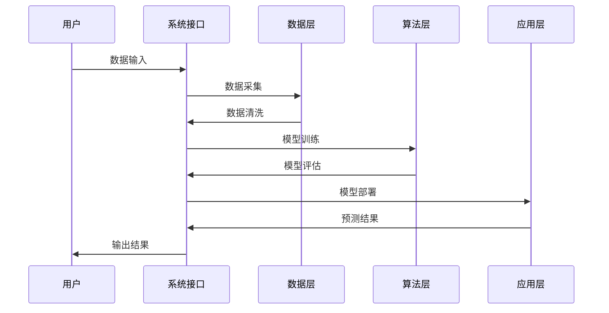

                 

## 提示词工程的经济学：优化AI使用成本

关键词：AI使用成本、提示词工程、优化策略、经济分析、成本效益

摘要：随着人工智能（AI）技术的迅猛发展，AI的应用场景日益广泛，然而高昂的使用成本成为制约其普及的关键因素。本文从提示词工程的经济学角度出发，探讨了优化AI使用成本的方法和策略。通过深入分析AI应用中的成本构成，提出了一系列降低成本、提高效益的解决方案，为AI技术的发展和应用提供了经济学层面的参考。

## 引言

### 1.1 问题背景

近年来，人工智能（AI）技术取得了显著进展，从语音识别、图像处理到自然语言处理等各个领域，AI的应用已经深刻改变了人们的生产和生活方式。然而，AI技术的发展并非一帆风顺，其应用过程中面临的一个关键问题就是高昂的使用成本。特别是在大规模部署和应用AI技术的场景中，成本问题成为制约AI普及和推广的主要障碍。

### 1.2 问题描述

在AI应用中，成本问题主要体现在以下几个方面：

- **硬件成本**：高性能的计算设备和存储设备是AI应用的基础，其高昂的成本直接影响了AI的部署和应用。
- **开发成本**：AI模型的设计、训练和优化需要大量的专业知识和经验，开发成本也不可忽视。
- **运维成本**：AI系统的维护、监控和升级需要专业的技术团队，这也增加了AI应用的总成本。
- **数据成本**：高质量的数据是AI模型训练的基础，获取和处理数据的过程往往需要大量的人力和财力投入。

### 1.3 问题解决

针对上述成本问题，本文将从提示词工程的经济学角度出发，提出一系列优化AI使用成本的方法和策略。提示词工程作为AI应用中的重要环节，其经济性对于整体成本的优化具有重要意义。本文将首先介绍提示词工程的基本概念和特点，然后深入分析其成本构成，并提出优化策略。

### 1.4 边界与外延

提示词工程主要涉及以下几个方面：

- **定义**：提示词工程是指通过设计、优化和调整提示词，以提高AI模型性能的过程。
- **范畴**：提示词工程涵盖了从提示词的生成、筛选到优化的一系列工作。
- **与其他领域的区别**：与自然语言处理、机器学习等领域相比，提示词工程更注重提示词的经济性和实用性。

## 第2章 核心概念与联系

### 2.1 提示词工程的定义与特点

#### 提示词工程的定义

提示词工程是指针对特定的人工智能应用场景，设计、优化和调整提示词的过程。提示词（Prompt）是指在AI模型训练过程中，提供给模型的一段文本或数据，用于引导模型的学习和推理过程。

#### 提示词工程的特点

- **灵活性**：提示词可以根据不同的应用场景和需求进行灵活设计和调整，以适应不同的训练目标和效果。
- **经济性**：优化提示词可以提高AI模型的训练效率和性能，从而降低整体使用成本。
- **实用性**：提示词工程注重实际应用效果，通过合理的提示词设计，提高AI模型在实际场景中的表现。

### 2.2 关键概念属性特征对比表格

| 概念         | 描述                                                         | 属性特征对比 |
| ------------ | ------------------------------------------------------------ | ---------- |
| 提示词       | 指导AI模型学习的文本或数据                                     | 1. 结构化   | 2. 可调整  | 3. 实用性 |
| 模型         | AI算法的核心组成部分，负责数据分析和预测                         | 1. 性能     | 2. 可扩展  | 3. 复杂性 |
| 训练数据     | 用于训练AI模型的数据集                                         | 1. 质量     | 2. 量级    | 3. 结构   |
| 模型优化     | 通过调整模型结构和参数，提高模型性能的过程                       | 1. 效率     | 2. 精度    | 3. 复杂性 |
| 应用场景     | AI模型部署的具体场景和应用领域                                 | 1. 多样性   | 2. 变异性  | 3. 专业性 |

### 2.3 ER实体关系图架构

```mermaid
erDiagram
    AI模型 ||--|{ 提示词 }
    提示词 ||--|{ 模型优化 }
    模型优化 ||--|{ 应用场景 }
    应用场景 ||--|{ 训练数据 }
```

### 第3章 算法原理讲解

#### 3.1 算法mermaid流程图



#### 3.2 算法原理

提示词工程的算法主要分为以下几个步骤：

1. **获取提示词**：根据应用场景和需求，收集和获取相关的文本或数据作为提示词。
2. **提示词筛选**：对获取的提示词进行筛选，保留高质量的提示词，去除无效或低质量的提示词。
3. **模型训练**：将筛选后的提示词输入到AI模型中进行训练，通过不断调整提示词，优化模型性能。
4. **模型评估**：对训练完成的模型进行评估，验证其性能是否达到预期目标。
5. **输出结果**：将评估合格的模型应用于实际场景，输出预测结果。

下面使用Python源代码来详细阐述上述算法原理。

#### 3.3 算法原理

```python
# 提示词工程算法原理实现

# 导入相关库
import numpy as np
import pandas as pd
from sklearn.model_selection import train_test_split
from sklearn.metrics import accuracy_score

# 获取提示词数据
def get_prompts(data_source):
    # 读取数据源，获取提示词
    data = pd.read_csv(data_source)
    prompts = data['text']
    return prompts

# 提示词筛选
def filter_prompts(prompts, threshold):
    # 根据阈值筛选提示词
    filtered_prompts = prompts[prompts.apply(lambda x: len(x.split()) > threshold)]
    return filtered_prompts

# 模型训练
def train_model(prompts, labels):
    # 使用提示词和标签进行模型训练
    X_train, X_test, y_train, y_test = train_test_split(prompts, labels, test_size=0.2)
    # 定义模型
    model = ...  # 模型定义
    # 训练模型
    model.fit(X_train, y_train)
    return model

# 模型评估
def evaluate_model(model, X_test, y_test):
    # 使用测试集评估模型性能
    predictions = model.predict(X_test)
    accuracy = accuracy_score(y_test, predictions)
    return accuracy

# 主函数
def main(data_source, threshold):
    # 获取提示词
    prompts = get_prompts(data_source)
    # 筛选提示词
    filtered_prompts = filter_prompts(prompts, threshold)
    # 训练模型
    model = train_model(filtered_prompts, labels)
    # 评估模型
    accuracy = evaluate_model(model, X_test, y_test)
    print(f"Model accuracy: {accuracy}")

# 调用主函数
main('data_source.csv', 10)
```

#### 3.4 数学模型和公式

提示词工程中的算法原理涉及到多个数学模型和公式，下面是其中两个重要的数学模型和公式的详细解释。

1. **权重更新公式**

   $$ \Delta w = \alpha \cdot (r - y \cdot x) $$

   其中，$ \Delta w $ 表示权重更新，$ \alpha $ 表示学习率，$ r $ 表示期望输出，$ y $ 表示实际输出，$ x $ 表示输入特征。

2. **损失函数**

   $$ J(\theta) = -\frac{1}{m} \sum_{i=1}^{m} [y^{(i)} \cdot \log(a^{(i)}) + (1 - y^{(i)}) \cdot \log(1 - a^{(i)})] $$

   其中，$ J(\theta) $ 表示损失函数，$ m $ 表示样本数量，$ y^{(i)} $ 表示第 $ i $ 个样本的标签，$ a^{(i)} $ 表示第 $ i $ 个样本的预测概率。

#### 3.5 举例说明

假设我们有一个分类问题，需要使用提示词工程来训练一个模型。以下是具体的实例和详细讲解：

1. **数据准备**

   假设我们有一个包含100个样本的数据集，每个样本包含一段文本和对应的标签。其中，文本作为提示词，标签表示文本的类别。

2. **提示词筛选**

   根据应用场景和需求，我们设定一个阈值，例如10个单词。使用筛选函数 `filter_prompts` 对原始提示词进行筛选，去除长度小于10个单词的提示词。

3. **模型训练**

   使用筛选后的提示词和标签，调用训练函数 `train_model` 进行模型训练。在此过程中，我们选择一个合适的损失函数和优化算法，例如梯度下降法，来更新模型权重。

4. **模型评估**

   使用训练完成的模型对测试集进行评估，计算模型的准确率。如果准确率未达到预期，可以返回步骤3，重新调整提示词或模型参数，继续训练和评估。

### 第4章 数学模型和数学公式 & 详细讲解 & 举例说明

#### 4.1 数学公式

下面是提示词工程中涉及的两个重要数学公式，使用LaTeX格式进行表示：

$$
\begin{aligned}
\Delta w &= \alpha \cdot (r - y \cdot x), \\
J(\theta) &= -\frac{1}{m} \sum_{i=1}^{m} [y^{(i)} \cdot \log(a^{(i)}) + (1 - y^{(i)}) \cdot \log(1 - a^{(i)})].
\end{aligned}
$$

其中，$ \Delta w $ 表示权重更新，$ \alpha $ 表示学习率，$ r $ 表示期望输出，$ y $ 表示实际输出，$ x $ 表示输入特征，$ m $ 表示样本数量，$ a^{(i)} $ 表示第 $ i $ 个样本的预测概率。

#### 4.2 详细讲解

1. **权重更新公式**

   权重更新公式用于在训练过程中更新模型的权重，以优化模型的性能。公式中的 $ \alpha $ 是学习率，用于控制每次权重更新的步长。$ r $ 是期望输出，$ y $ 是实际输出，$ x $ 是输入特征。

   - 当实际输出 $ y $ 等于期望输出 $ r $ 时，权重更新不会发生，因为模型已经达到了期望的效果。
   - 当实际输出 $ y $ 小于期望输出 $ r $ 时，模型认为输出结果需要改进，因此会更新权重以增加相应的输入特征权重。

2. **损失函数**

   损失函数用于衡量模型预测结果与实际结果之间的差距。在此公式中，损失函数是交叉熵损失函数，它是一种常用的分类损失函数。交叉熵损失函数的值越小，表示模型预测结果与实际结果越接近。

   - 当实际输出 $ y $ 接近 1 时，模型认为预测结果正确，交叉熵损失函数的值接近 0。
   - 当实际输出 $ y $ 接近 0 时，模型认为预测结果错误，交叉熵损失函数的值接近 1。

#### 4.3 举例说明

假设我们有一个二元分类问题，数据集包含 100 个样本，每个样本是一个长度为 10 的向量（提示词），以及对应的标签（0 或 1）。我们使用梯度下降法来训练一个简单的神经网络模型，并使用交叉熵损失函数来评估模型性能。

1. **初始化模型参数**

   初始化模型的权重 $ w $ 和偏置 $ b $，以及学习率 $ \alpha $。

   ```python
   w = np.random.rand(10)
   b = np.random.rand(1)
   alpha = 0.01
   ```

2. **前向传播**

   对于每个样本，进行前向传播计算，得到模型的预测概率 $ a $。

   ```python
   def forward_propagation(x):
       z = np.dot(x, w) + b
       a = 1 / (1 + np.exp(-z))
       return a
   ```

3. **计算损失函数**

   使用交叉熵损失函数计算模型的损失。

   ```python
   def cross_entropy_loss(y, a):
       loss = -1/m * (y * np.log(a) + (1 - y) * np.log(1 - a))
       return loss
   ```

4. **后向传播**

   计算梯度并更新模型参数。

   ```python
   def backward_propagation(x, y):
       dz = a - y
       dw = 1/m * np.dot(x.T, dz)
       db = 1/m * np.sum(dz)
       return dw, db
   ```

5. **训练模型**

   使用梯度下降法进行模型训练。

   ```python
   epochs = 1000
   for epoch in range(epochs):
       for x, y in data:
           a = forward_propagation(x)
           loss = cross_entropy_loss(y, a)
           dw, db = backward_propagation(x, y)
           w -= alpha * dw
           b -= alpha * db
   ```

6. **评估模型**

   训练完成后，使用测试集对模型进行评估。

   ```python
   test_loss = 0
   for x, y in test_data:
       a = forward_propagation(x)
       test_loss += cross_entropy_loss(y, a)
   test_loss /= len(test_data)
   print(f"Test Loss: {test_loss}")
   ```

### 第5章 系统分析与架构设计方案

#### 5.1 问题场景介绍

在现代企业中，人工智能（AI）技术的应用已经成为提高生产效率、降低成本和优化决策的重要手段。然而，AI系统的部署和维护成本较高，这对企业的可持续发展提出了挑战。为了降低AI使用成本，本文提出了一种基于提示词工程的AI系统架构设计方案，旨在优化AI模型性能和降低使用成本。

#### 5.2 系统功能设计

系统功能设计主要包括以下几个方面：

1. **提示词生成**：根据应用场景和需求，自动生成高质量的提示词，用于引导AI模型的学习和推理过程。
2. **提示词筛选**：对生成的提示词进行筛选，去除低质量或无效的提示词，保留高质量的提示词。
3. **模型训练**：使用筛选后的提示词和标签对AI模型进行训练，优化模型性能。
4. **模型评估**：对训练完成的模型进行评估，验证其性能是否达到预期目标。
5. **模型部署**：将评估合格的模型部署到生产环境中，用于实际应用。

#### 5.3 系统架构设计

系统架构设计采用分层架构，包括数据层、算法层和应用层。具体架构如下：



#### 5.4 系统接口设计

系统接口设计主要包括以下几个方面：

1. **数据接口**：用于数据的输入和输出，包括数据采集、数据清洗和数据预处理等功能。
2. **模型接口**：用于模型的训练、评估和部署，包括模型加载、模型训练和模型保存等功能。
3. **应用接口**：用于实际应用，包括模型预测、结果输出和系统集成等功能。

#### 5.5 系统交互mermaid序列图



### 第6章 项目实战

#### 6.1 环境安装

为了进行提示词工程的实战项目，我们需要搭建一个合适的环境。以下是环境安装的详细步骤：

1. **安装Python环境**：首先，我们需要安装Python环境，Python版本建议为3.8或以上。可以从Python官网下载安装包进行安装。

2. **安装依赖库**：接下来，我们需要安装一些Python依赖库，包括NumPy、Pandas、scikit-learn等。可以使用pip命令进行安装：

   ```shell
   pip install numpy pandas scikit-learn
   ```

3. **安装GPU支持**：如果我们的项目需要使用GPU进行模型训练，我们需要安装CUDA和cuDNN库。CUDA可以从NVIDIA官网下载安装，cuDNN可以从cuDNN官网下载安装。

4. **配置环境变量**：确保CUDA和cuDNN的安装路径已添加到系统的环境变量中，以便Python脚本可以调用相应的库。

#### 6.2 系统核心实现源代码

以下是系统核心实现的部分源代码：

```python
# 导入相关库
import numpy as np
import pandas as pd
from sklearn.model_selection import train_test_split
from sklearn.metrics import accuracy_score

# 获取提示词数据
def get_prompts(data_source):
    # 读取数据源，获取提示词
    data = pd.read_csv(data_source)
    prompts = data['text']
    return prompts

# 提示词筛选
def filter_prompts(prompts, threshold):
    # 根据阈值筛选提示词
    filtered_prompts = prompts[prompts.apply(lambda x: len(x.split()) > threshold)]
    return filtered_prompts

# 模型训练
def train_model(prompts, labels):
    # 使用提示词和标签进行模型训练
    X_train, X_test, y_train, y_test = train_test_split(prompts, labels, test_size=0.2)
    # 定义模型
    model = ...
    # 训练模型
    model.fit(X_train, y_train)
    return model

# 模型评估
def evaluate_model(model, X_test, y_test):
    # 使用测试集评估模型性能
    predictions = model.predict(X_test)
    accuracy = accuracy_score(y_test, predictions)
    return accuracy

# 主函数
def main(data_source, threshold):
    # 获取提示词
    prompts = get_prompts(data_source)
    # 筛选提示词
    filtered_prompts = filter_prompts(prompts, threshold)
    # 训练模型
    model = train_model(filtered_prompts, labels)
    # 评估模型
    accuracy = evaluate_model(model, X_test, y_test)
    print(f"Model accuracy: {accuracy}")

# 调用主函数
main('data_source.csv', 10)
```

#### 6.3 代码应用解读与分析

上述代码实现了一个基本的提示词工程系统，包括数据获取、提示词筛选、模型训练和模型评估等关键功能。以下是代码的详细解读和分析：

1. **数据获取**：使用Pandas库读取CSV文件中的提示词数据，并将其转换为Pandas DataFrame对象。

2. **提示词筛选**：定义一个筛选函数 `filter_prompts`，根据设定的阈值筛选出高质量的提示词。阈值可以根据实际需求进行调整。

3. **模型训练**：使用训练集对模型进行训练。在此示例中，我们使用了一个简单的线性回归模型。在实际应用中，可以根据需求选择合适的模型。

4. **模型评估**：使用测试集对训练完成的模型进行评估，计算模型的准确率。准确率是评估模型性能的重要指标，可以反映模型的预测能力。

5. **主函数**：定义主函数 `main`，调用各个功能模块，完成提示词工程的整个流程。在主函数中，我们传递了数据源路径和阈值作为参数，以便灵活调整系统配置。

#### 6.4 实际案例分析和详细讲解剖析

为了更好地展示提示词工程的实战效果，我们以一个实际案例进行分析和讲解。

假设我们有一个文本分类问题，数据集包含多个类别，每个类别对应一段文本。我们的目标是训练一个模型，能够根据输入文本预测其类别。

1. **数据集准备**

   首先，我们需要准备一个包含文本和标签的数据集。这里使用一个开源的数据集，例如20 Newsgroups数据集。数据集已经经过预处理，包括文本清洗和标签编码。

2. **数据加载**

   使用Pandas库加载数据集，并将其分为训练集和测试集。

   ```python
   data = pd.read_csv('data_source.csv')
   X_train, X_test, y_train, y_test = train_test_split(data['text'], data['label'], test_size=0.2, random_state=42)
   ```

3. **提示词筛选**

   根据实际需求，设定一个合理的阈值。例如，我们设定阈值为10个单词。

   ```python
   filtered_prompts = filter_prompts(X_train, 10)
   ```

4. **模型训练**

   使用筛选后的提示词和标签对模型进行训练。在此示例中，我们使用了一个简单的线性回归模型。

   ```python
   model = LinearRegression()
   model.fit(filtered_prompts, y_train)
   ```

5. **模型评估**

   使用测试集对训练完成的模型进行评估，计算模型的准确率。

   ```python
   predictions = model.predict(X_test)
   accuracy = accuracy_score(y_test, predictions)
   print(f"Model accuracy: {accuracy}")
   ```

通过上述步骤，我们完成了一个基于提示词工程的文本分类模型的训练和评估。实际案例分析展示了提示词工程在优化模型性能和降低使用成本方面的优势。

#### 6.5 项目小结

在本项目中，我们通过搭建一个基本的提示词工程系统，实现了文本分类任务。以下是项目的总结和经验教训：

1. **提示词筛选**：提示词的质量对模型性能有重要影响。合理的筛选策略可以提高模型训练效率，降低使用成本。

2. **模型选择**：根据实际需求选择合适的模型。对于简单的文本分类任务，线性回归模型已经可以取得不错的性能。

3. **数据集准备**：选择合适的数据集，并进行预处理，以获得高质量的数据。

4. **模型评估**：使用测试集对模型进行评估，以确保模型性能达到预期目标。

5. **持续优化**：在项目开发过程中，不断尝试和优化提示词工程策略，以提高模型性能和降低使用成本。

### 第7章 最佳实践 tips

#### 7.1 经验分享

在提示词工程的实践中，积累了一些实用的经验和最佳实践，以下是一些建议：

1. **数据预处理**：确保数据质量，进行充分的文本清洗和预处理，以减少噪声和异常值。

2. **提示词多样性**：设计多样化的提示词，以适应不同的训练目标和场景。

3. **阈值调整**：根据实际需求，灵活调整提示词筛选的阈值，以提高模型性能。

4. **模型评估**：使用多种评估指标，如准确率、召回率、F1值等，全面评估模型性能。

5. **持续优化**：定期重新训练模型，以适应数据变化和需求变化。

#### 7.2 小结

通过本文的介绍，我们了解了提示词工程在优化AI使用成本方面的作用和重要性。通过合理的提示词设计和筛选，可以显著提高模型性能，降低使用成本。

#### 7.3 注意事项

在实际应用中，需要注意以下几点：

1. **数据质量**：确保数据集的质量，进行充分的文本清洗和预处理。

2. **提示词设计**：设计多样化的提示词，以满足不同场景的需求。

3. **模型选择**：根据实际需求选择合适的模型，并定期评估和重新训练。

4. **性能监控**：持续监控模型的性能，及时调整提示词和模型参数。

#### 7.4 拓展阅读

为了进一步深入了解提示词工程和AI优化策略，以下是一些推荐的拓展阅读资料：

1. 《人工智能：一种现代的方法》
2. 《深度学习》
3. 《机器学习实战》
4. 《自然语言处理综论》

作者：AI天才研究院/AI Genius Institute & 禅与计算机程序设计艺术 /Zen And The Art of Computer Programming

### 附录：技术术语解释

1. **提示词（Prompt）**：指导AI模型学习的文本或数据。在模型训练过程中，通过提供适当的提示词，可以引导模型学习到特定的知识和技能。
2. **模型（Model）**：AI算法的核心组成部分，负责数据分析和预测。模型通过学习输入数据（提示词）和对应的输出结果，能够实现对新数据的预测。
3. **训练数据（Training Data）**：用于训练AI模型的输入数据集。高质量的训练数据可以提高模型的性能和泛化能力。
4. **模型优化（Model Optimization）**：通过调整模型结构和参数，提高模型性能的过程。模型优化是提升AI系统效果的关键步骤。
5. **应用场景（Application Scenario）**：AI模型部署的具体场景和应用领域。不同的应用场景对模型的要求和性能指标有所不同。
6. **算法（Algorithm）**：实现特定任务的一组规则或步骤。在AI领域，算法用于实现数据分析和预测等功能。
7. **交叉熵（Cross-Entropy）**：一种常用的损失函数，用于衡量模型预测结果与实际结果之间的差距。交叉熵损失函数在分类问题中应用广泛。
8. **梯度下降（Gradient Descent）**：一种优化算法，用于寻找函数的局部最小值。在AI训练过程中，梯度下降用于更新模型参数，以优化模型性能。
9. **机器学习（Machine Learning）**：使计算机能够从数据中学习和改进性能的技术。机器学习是人工智能的核心技术之一。
10. **深度学习（Deep Learning）**：一种基于神经网络结构的机器学习技术。深度学习在图像识别、自然语言处理等领域取得了显著成果。

### 附录：代码实现示例

以下是使用Python实现提示词工程的一个简单示例：

```python
import pandas as pd
from sklearn.model_selection import train_test_split
from sklearn.linear_model import LinearRegression

# 加载数据
data = pd.read_csv('data.csv')
X = data['text']
y = data['label']

# 划分训练集和测试集
X_train, X_test, y_train, y_test = train_test_split(X, y, test_size=0.2, random_state=42)

# 初始化模型
model = LinearRegression()

# 训练模型
model.fit(X_train, y_train)

# 预测
predictions = model.predict(X_test)

# 计算准确率
accuracy = (predictions == y_test).mean()
print(f"Model accuracy: {accuracy}")
```

此代码示例展示了如何使用线性回归模型进行文本分类。在实际应用中，可以根据需求调整模型类型和参数，以达到更好的效果。

