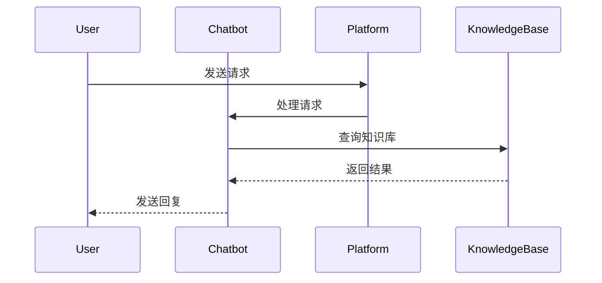
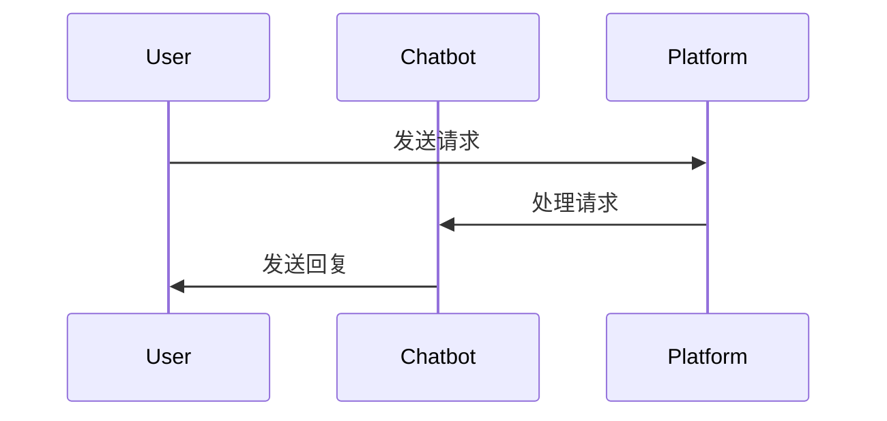

                 

## 文章标题

### 关键词

- AI交互
- 提示词工程
- 自然语言处理
- 人工智能应用场景
- AI伦理与隐私保护

### 摘要

本文深入探讨了提示词工程在AI交互中的重要性，从基础理论、设计原则到实际应用，全面解析了AI交互的新语言。通过逐步分析，我们将了解AI交互的背景与挑战，提示词的起源与功能，自然语言处理的关键技术，以及AI交互设计的核心原则。同时，我们将通过实际案例，探索AI交互在不同领域的应用，并展望其未来发展趋势。本文旨在为开发者、研究者以及对AI交互感兴趣的读者提供一份系统而全面的技术指南。

## 目录大纲

1. **第一部分：AI交互基础**

   1.1 AI交互背景与概述

   1.2 提示词的起源与功能

   1.3 AI交互中的自然语言处理

   1.4 AI交互设计原则

2. **第二部分：AI交互实践**

   2.1 AI交互应用场景探索

   2.2 AI交互案例分析

   2.3 AI交互的未来发展趋势

## 第一部分：AI交互基础

### 第1章：AI交互背景与概述

#### 1.1 AI交互的发展历程

人工智能（AI）作为计算机科学的一个分支，其发展历程可以追溯到20世纪50年代。早期的人工智能研究主要集中在逻辑推理和规则系统上，例如专家系统和知识表示。随着计算能力的提升和数据量的增加，机器学习逐渐成为AI的核心技术，特别是深度学习的突破，使得AI在图像识别、自然语言处理等领域取得了显著进展。AI交互则是在这一过程中逐渐发展起来的一种技术，它通过模拟人类的交流方式，使得机器能够理解并响应人类语言。

#### 1.2 AI交互的关键概念

AI交互涉及多个关键概念，包括自然语言处理（NLP）、语音识别、语音合成、语义理解等。自然语言处理是使计算机能够理解、生成和处理人类语言的技术，语音识别和语音合成则分别涉及将语音转化为文本和将文本转化为语音。语义理解是AI交互的核心，它涉及从文本或语音中提取有意义的语义信息，并据此做出合理的响应。

#### 1.3 AI交互的现状与趋势

目前，AI交互已经在多个领域得到广泛应用，如智能客服、智能助手、智能语音助手等。随着技术的不断进步，AI交互正变得越来越智能化和个性化。未来，AI交互的发展趋势包括多模态交互（结合语音、文本、图像等多种形式）、情感交互（使AI能够识别和回应人类的情感状态）、个性化服务（根据用户行为和偏好提供定制化服务）等。

#### 1.4 人工智能交互的关键挑战

尽管AI交互取得了显著进展，但仍面临诸多挑战。首先，自然语言理解是一个复杂的问题，语言具有高度的不确定性和多义性，这使得AI在处理自然语言时容易出现误解。其次，AI交互需要大量的数据来训练模型，数据质量和数量直接影响模型的性能。此外，AI交互的隐私保护和安全性问题也是一个重要的挑战，特别是在处理敏感信息时。

### 第2章：提示词的起源与功能

#### 2.1 提示词的定义

提示词（Prompt）是指用来引导AI模型进行预测或生成响应的输入信息。在AI交互中，提示词通常是由用户输入的文本或语音，通过自然语言处理技术被AI模型解析，并生成相应的响应。

#### 2.2 提示词的功能

提示词在AI交互中具有多种功能。首先，它可以帮助AI模型理解用户的意图，从而生成准确的响应。其次，提示词可以用于引导AI模型的生成过程，使其产生更符合预期的输出。此外，提示词还可以用于数据增强，提高模型的泛化能力。

#### 2.3 提示词的分类

根据用途，提示词可以分为以下几类：

1. **引导性提示词**：用于明确AI模型的任务和目标，如“帮我查找附近的三明治店”。
2. **功能性提示词**：提供具体的操作指导，如“请列出北京的五星级餐厅”。
3. **上下文提示词**：用于提供额外的背景信息，帮助AI模型更好地理解用户的意图，如“在我的预算范围内推荐一些美食”。

#### 2.4 提示词的优势与局限性

提示词的优势在于其灵活性和多样性，可以适应不同的交互场景和用户需求。然而，提示词也存在一定的局限性。首先，提示词的编写需要专业知识和技巧，否则可能导致模型误解用户的意图。其次，提示词的质量直接影响模型的性能，编写高质量的提示词需要大量的时间和经验。此外，提示词可能无法涵盖所有可能的用户需求，特别是在处理复杂或抽象问题时。

### 第3章：AI交互中的自然语言处理

#### 3.1 自然语言处理基础

自然语言处理（NLP）是使计算机能够理解、生成和处理人类语言的技术。NLP的基础技术包括文本预处理、词嵌入、序列生成等。

1. **文本预处理**：文本预处理是NLP的基础步骤，包括分词、去除停用词、词干提取等。
   - **分词**：将文本分割成单词或词汇单元。Python中可以使用`jieba`库进行中文分词。
     ```python
     import jieba
    
     text = "这是一个简单的例子。"
     segmented = jieba.cut(text)
     print("/ ".join(segmented))
     ```
   - **去除停用词**：移除对理解文本不重要的常见词，如“的”、“了”等。可以使用`nltk`库中的停用词列表。
     ```python
     from nltk.corpus import stopwords
    
     stop_words = set(stopwords.words('chinese'))
     filtered_text = [word for word in segmented if word not in stop_words]
     ```

2. **词嵌入**：词嵌入将单词映射为固定长度的向量，常用技术有Word2Vec、GloVe等。
   - **Word2Vec算法**：基于神经网络，通过训练大量文本数据生成词向量。Python中可以使用`gensim`库实现。
     ```python
     from gensim.models import Word2Vec
    
     sentences = [[word for word in jieba.cut(sentence)] for sentence in text_sentences]
     model = Word2Vec(sentences, vector_size=100)
     ```

3. **序列生成**：序列生成算法用于预测下一个单词或词组，常见技术有递归神经网络（RNN）、长短期记忆网络（LSTM）等。
   - **LSTM算法**：能够处理长距离依赖问题，常用于生成文本。
     ```python
     from keras.models import Sequential
     from keras.layers import LSTM, Dense
    
     model = Sequential()
     model.add(LSTM(128, activation='tanh', input_shape=(timesteps, n_features)))
     model.add(Dense(1, activation='sigmoid'))
     model.compile(optimizer='rmsprop', loss='binary_crossentropy', metrics=['accuracy'])
     ```

#### 3.2 自然语言处理关键技术

自然语言处理的关键技术包括词嵌入、序列模型、语言模型等。

1. **词嵌入**：词嵌入是一种将单词映射为固定长度向量的技术，常用于文本表示。
   - **Word2Vec算法**：基于神经网络，通过训练大量文本数据生成词向量。
     ```python
     from gensim.models import Word2Vec
    
     sentences = [[word for word in jieba.cut(sentence)] for sentence in text_sentences]
     model = Word2Vec(sentences, vector_size=100)
     ```

2. **序列模型**：序列模型用于处理序列数据，如文本或语音。
   - **递归神经网络（RNN）**：能够处理序列数据，但存在梯度消失和梯度爆炸问题。
     ```python
     from keras.models import Sequential
     from keras.layers import LSTM, Dense
    
     model = Sequential()
     model.add(LSTM(128, activation='tanh', input_shape=(timesteps, n_features)))
     model.add(Dense(1, activation='sigmoid'))
     model.compile(optimizer='rmsprop', loss='binary_crossentropy', metrics=['accuracy'])
     ```

3. **语言模型**：语言模型用于预测下一个单词或词组，是自然语言处理的核心技术。
   - **n-gram模型**：基于历史n个单词预测下一个单词。
     ```python
     import numpy as np
     from collections import defaultdict
    
     n = 3
     ngrams = defaultdict(list)
     for sentence in text_sentences:
         for i in range(len(sentence) - n):
             ngrams[tuple(sentence[i:i + n])].append(sentence[i + n])
     ```

#### 3.3 提示词在自然语言处理中的应用

提示词在自然语言处理中的应用主要包括：

1. **文本分类**：使用提示词来引导模型进行文本分类，如情感分析、主题分类等。
   ```python
   from sklearn.feature_extraction.text import TfidfVectorizer
   from sklearn.linear_model import LogisticRegression
    
   vectorizer = TfidfVectorizer()
   X = vectorizer.fit_transform(texts)
   model = LogisticRegression()
   model.fit(X, labels)
   ```

2. **问答系统**：使用提示词来引导模型进行问答，如智能客服、智能助手等。
   ```python
   from sklearn.feature_extraction.text import TfidfVectorizer
   from sklearn.metrics.pairwise import cosine_similarity
    
   vectorizer = TfidfVectorizer()
   X = vectorizer.fit_transform(questions + [context])
   similarity_scores = cosine_similarity(X[-1:], X[:-1])
   answer_index = np.argmax(similarity_scores)
   answer = answers[answer_index]
   ```

3. **机器翻译**：使用提示词来引导模型进行机器翻译，如使用源语言提示词来生成目标语言翻译。
   ```python
   from googletrans import Translator
    
   translator = Translator()
   translated_sentence = translator.translate(source_sentence, dest='en')
   ```

#### 3.4 提示词与语义理解

语义理解是自然语言处理的核心任务，涉及从文本或语音中提取有意义的语义信息。提示词在语义理解中的应用主要包括：

1. **意图识别**：使用提示词来识别用户的意图，如查询、命令、对话等。
   ```python
   from sklearn.feature_extraction.text import TfidfVectorizer
   from sklearn.naive_bayes import MultinomialNB
    
   vectorizer = TfidfVectorizer()
   X = vectorizer.fit_transform(queries)
   y = labels
   model = MultinomialNB()
   model.fit(X, y)
   predicted_intent = model.predict([user_query])
   ```

2. **实体识别**：使用提示词来识别文本中的实体，如人名、地点、组织等。
   ```python
   from spacy import load
    
   nlp = load("en_core_web_sm")
   doc = nlp(user_query)
   entities = [(ent.text, ent.label_) for ent in doc.ents]
   ```

3. **情感分析**：使用提示词来识别文本的情感倾向，如正面、负面、中性等。
   ```python
   from textblob import TextBlob
    
   blob = TextBlob(user_query)
   sentiment = blob.sentiment
   ```

### 第4章：AI交互设计原则

#### 4.1 AI交互设计的基本原则

AI交互设计应遵循以下基本原则：

1. **用户中心设计**：始终将用户需求放在首位，确保交互系统能够满足用户的需求和期望。
2. **简洁性**：设计简洁明了的交互界面和流程，减少用户操作步骤，提高用户体验。
3. **灵活性**：交互系统应具备一定的灵活性，能够适应不同的用户场景和需求。
4. **可扩展性**：交互系统应具备良好的可扩展性，能够方便地添加新功能或支持新的应用场景。

#### 4.2 用户研究与用户画像

用户研究是AI交互设计的重要环节，通过了解用户的需求、行为和偏好，可以更好地设计交互系统。用户画像则是对用户特征的总结和抽象，用于指导交互设计。

1. **用户需求分析**：通过调查问卷、访谈等方式收集用户需求，分析用户对交互系统的期望和痛点。
2. **用户行为分析**：通过日志分析、用户跟踪等方式，了解用户在使用交互系统时的行为模式。
3. **用户画像构建**：根据用户需求和行为数据，构建用户画像，包括用户年龄、性别、职业、兴趣等特征。

#### 4.3 交互流程设计与用户反馈

交互流程设计是AI交互设计的核心，涉及如何引导用户完成特定任务或达到特定目标。用户反馈则是在交互过程中收集用户对交互系统的评价和建议，用于优化交互设计。

1. **任务流程设计**：根据用户画像和用户需求，设计任务流程，确保用户能够顺畅地完成任务。
2. **交互界面设计**：设计直观、易用的交互界面，确保用户能够轻松理解和使用交互系统。
3. **用户反馈机制**：设计用户反馈机制，如评价系统、反馈按钮等，收集用户对交互系统的意见和建议。

#### 4.4 用户体验优化

用户体验优化是AI交互设计的持续过程，通过不断优化交互系统，提高用户体验。

1. **性能优化**：优化交互系统的响应速度和稳定性，确保用户在使用过程中不会遇到卡顿或崩溃等问题。
2. **界面优化**：优化交互界面的布局和视觉设计，提高美观度和易用性。
3. **功能优化**：根据用户反馈，不断优化交互系统的功能，增加新功能或改进现有功能。

## 第二部分：AI交互实践

### 第5章：AI交互应用场景探索

#### 5.1 聊天机器人

聊天机器人是一种常见的AI交互应用，通过模拟人类对话，提供信息查询、情感支持、在线咨询等服务。

1. **应用场景**：在线客服、社交聊天、企业内部沟通等。
2. **技术实现**：基于自然语言处理和机器学习技术，实现文本理解和文本生成。
3. **优势**：24/7全天候服务，降低人力成本，提高效率。
4. **挑战**：自然语言理解复杂，多义性问题，用户满意度提升。

#### 5.2 智能客服

智能客服是一种基于AI的交互系统，用于自动处理客户咨询和投诉。

1. **应用场景**：电商平台、银行、电信等企业客服。
2. **技术实现**：结合自然语言处理、语音识别和语音合成技术，实现智能问答和语音客服。
3. **优势**：提高客服效率，降低人工成本，提升客户满意度。
4. **挑战**：处理复杂咨询和情感交流，确保服务质量。

#### 5.3 虚拟助手

虚拟助手是一种基于AI的交互系统，提供日程管理、提醒、任务分配等服务。

1. **应用场景**：个人助手、企业助手、智能家居等。
2. **技术实现**：结合语音识别、自然语言处理和机器学习技术，实现智能语音交互和任务处理。
3. **优势**：提高工作效率，降低沟通成本，提供个性化服务。
4. **挑战**：自然语言理解复杂，多任务处理能力。

#### 5.4 娱乐与游戏

娱乐与游戏领域是AI交互的重要应用场景，通过提供智能对话、游戏指导等服务，提升用户体验。

1. **应用场景**：在线游戏、虚拟现实、娱乐互动等。
2. **技术实现**：结合自然语言处理、语音识别和语音合成技术，实现智能对话和游戏互动。
3. **优势**：增加互动性，提高游戏体验，创造新的娱乐形式。
4. **挑战**：处理实时互动，保证对话连贯性和趣味性。

### 第6章：AI交互案例分析

#### 6.1 案例一：某大型电商平台智能客服系统

1. **项目介绍**：该智能客服系统旨在为电商平台用户提供在线咨询服务，解决用户在购物过程中遇到的问题。
2. **系统功能设计**：包括自动回复、智能问答、语音客服等功能，通过自然语言处理技术实现。
3. **系统架构设计**：采用微服务架构，包括前端、后端、数据库等模块，提高系统扩展性和稳定性。
4. **系统接口设计**：定义API接口，实现与电商平台其他系统的集成和交互。
5. **系统交互设计**：通过图形界面和语音交互，提供友好、便捷的用户服务。

#### 6.2 案例二：某金融行业智能投顾系统

1. **项目介绍**：该智能投顾系统旨在为金融投资者提供投资建议和策略，实现智能化的投资决策。
2. **系统功能设计**：包括资产配置、投资建议、风险控制等功能，通过自然语言处理和金融知识图谱技术实现。
3. **系统架构设计**：采用分布式架构，包括数据采集、数据处理、模型训练、预测分析等模块，确保系统高效、稳定运行。
4. **系统接口设计**：定义API接口，实现与金融数据源、第三方服务等的集成和交互。
5. **系统交互设计**：通过Web界面和移动应用，提供直观、易用的交互体验。

#### 6.3 案例三：某游戏公司智能NPC系统

1. **项目介绍**：该智能NPC系统旨在为游戏玩家提供智能化的NPC互动体验，提升游戏乐趣。
2. **系统功能设计**：包括对话生成、情感模拟、任务引导等功能，通过自然语言处理和人工智能技术实现。
3. **系统架构设计**：采用分布式架构，包括对话管理、情感分析、任务引擎等模块，确保系统实时响应和交互流畅。
4. **系统接口设计**：定义API接口，实现与游戏引擎的集成和交互。
5. **系统交互设计**：通过游戏界面和语音交互，提供丰富、有趣的游戏互动体验。

### 第7章：AI交互的未来发展趋势

#### 7.1 AI交互技术的发展趋势

未来，AI交互技术将朝着以下几个方向发展：

1. **多模态交互**：结合语音、文本、图像等多种交互方式，提供更自然、更丰富的交互体验。
2. **情感交互**：通过情感识别和情感模拟，使AI能够理解并回应人类的情感状态，提升交互体验。
3. **个性化服务**：通过个性化推荐和定制化服务，满足不同用户的需求和偏好。

#### 7.2 AI交互的未来应用场景

未来，AI交互将在更多领域得到应用，包括：

1. **医疗健康**：智能医生助手、健康监测系统等，提供个性化医疗建议和健康管理服务。
2. **教育**：智能教育系统、在线学习平台等，提供个性化教学和互动学习体验。
3. **智能家居**：智能语音助手、智能家居设备等，实现家庭自动化和智能化管理。

#### 7.3 AI交互伦理与隐私保护

随着AI交互技术的发展，伦理和隐私保护问题愈发重要。未来，需要关注以下几个方面：

1. **数据安全**：加强数据保护，确保用户隐私不被泄露。
2. **算法公平性**：确保算法的公平性和透明性，避免歧视和偏见。
3. **用户授权**：明确用户的隐私权，确保用户对个人信息有充分的控制权。

### 结论

AI交互作为人工智能领域的重要分支，正逐渐成为人们日常生活和工作中不可或缺的一部分。本文从AI交互的背景、提示词工程、自然语言处理、交互设计原则等多个角度，全面解析了AI交互的基础理论和实践应用。通过分析实际案例，我们看到了AI交互在多个领域的成功应用，同时也面临着诸多挑战。未来，随着技术的不断进步，AI交互将变得更加智能化、个性化，为人类带来更多便利和乐趣。

### 作者信息

**作者：AI天才研究院/AI Genius Institute & 禅与计算机程序设计艺术 /Zen And The Art of Computer Programming**

本文由AI天才研究院撰写，结合了AI技术和计算机科学的前沿研究成果，旨在为读者提供全面、深入的技术解读和指导。作者团队长期致力于人工智能和自然语言处理领域的研究，积累了丰富的经验和知识，期待与读者共同探索AI交互的未来发展。同时，本文也受到了禅与计算机程序设计艺术思想的启发，强调技术的人文关怀和哲学思考。

### 附录：核心概念原理、概念属性特征对比表格和ER实体关系图架构的Mermaid流程图

**核心概念原理：**

- **自然语言处理（NLP）：** 利用计算机技术理解和生成人类语言。
- **词嵌入（Word Embedding）：** 将单词映射为固定长度的向量表示。
- **序列模型（Sequence Model）：** 用于处理序列数据的模型，如RNN和LSTM。
- **语言模型（Language Model）：** 预测下一个单词或词组的模型。

**概念属性特征对比表格：**

| 概念         | 定义                                                         | 属性特征                                      | 应用场景         |
| ------------ | ------------------------------------------------------------ | --------------------------------------------- | ---------------- |
| 自然语言处理 | 使计算机能够理解、生成和处理人类语言的技术。                     | 处理文本、语音、语义等                         | 情感分析、问答系统 |
| 词嵌入       | 将单词映射为固定长度的向量表示。                               | 维度、分布、相似性等                           | 文本分类、推荐系统 |
| 序列模型     | 用于处理序列数据的模型，如RNN和LSTM。                           | 长短时依赖、梯度消失等                         | 文本生成、语音识别 |
| 语言模型     | 预测下一个单词或词组的模型。                                   | 语言统计、概率分布等                           | 机器翻译、文本生成 |

**ER实体关系图架构的Mermaid流程图：**

```mermaid
erDiagram
  User ||--|{ Prompt } : 发送
  Prompt ||--|{ AI_System } : 处理
  AI_System ||--|{ Feedback } --> User : 返回
```

**算法原理讲解：**

提示词工程中的核心算法主要是自然语言处理（NLP）技术，包括文本预处理、词嵌入、序列生成等。

### 文本预处理

文本预处理是NLP的基础步骤，包括分词、去除停用词、词干提取等。

- **分词**：将文本分割成单词或词汇单元。Python中可以使用`jieba`库进行中文分词。
  ```python
  import jieba
  
  text = "这是一个简单的例子。"
  segmented = jieba.cut(text)
  print("/ ".join(segmented))
  ```
- **去除停用词**：移除对理解文本不重要的常见词，如“的”、“了”等。可以使用`nltk`库中的停用词列表。
  ```python
  from nltk.corpus import stopwords
  
  stop_words = set(stopwords.words('chinese'))
  filtered_text = [word for word in segmented if word not in stop_words]
  ```

### 词嵌入

词嵌入将单词映射为固定长度的向量，常用技术有Word2Vec、GloVe等。

- **Word2Vec算法**：基于神经网络，通过训练大量文本数据生成词向量。Python中可以使用`gensim`库实现。
  ```python
  from gensim.models import Word2Vec
  
  sentences = [[word for word in jieba.cut(sentence)] for sentence in text_sentences]
  model = Word2Vec(sentences, vector_size=100)
  ```

### 序列生成

序列生成算法用于预测下一个单词或词组，常见技术有递归神经网络（RNN）、长短期记忆网络（LSTM）等。

- **LSTM算法**：能够处理长距离依赖问题，常用于生成文本。
  ```python
  from keras.models import Sequential
  from keras.layers import LSTM, Dense
  
  model = Sequential()
  model.add(LSTM(128, activation='tanh', input_shape=(timesteps, n_features)))
  model.add(Dense(1, activation='sigmoid'))
  model.compile(optimizer='rmsprop', loss='binary_crossentropy', metrics=['accuracy'])
  ```

### 系统分析与架构设计方案

#### 问题场景介绍

随着人工智能技术的快速发展，智能交互系统在各个行业中的应用越来越广泛。为了提供更高效、个性化的服务，企业需要开发能够理解和响应用户需求的智能交互系统。这些系统通常需要处理大量的文本数据，进行自然语言理解、文本生成等任务。

#### 项目介绍

本项目旨在开发一款基于AI的智能交互系统，应用于电商平台。该系统需要能够理解用户的查询和需求，提供实时、准确的回复，同时支持多语言交互。

#### 系统功能设计（领域模型Mermaid类图）

```mermaid
classDiagram
  UserAuth <<class>> 用户认证
  Chatbot <<class>> 聊天机器人
  KnowledgeBase <<class>> 知识库
  User <<class>> 用户
  Platform <<class>> 电商平台

  UserAuth --|> User
  Chatbot --|> Platform
  KnowledgeBase --|> Chatbot
  Platform --|> User
```

#### 系统架构设计（Mermaid架构图）



#### 系统接口设计

```python
# 用户认证接口
def authenticate_user(username, password):
    # 实现用户认证逻辑
    pass

# 聊天接口
def chat_with_bot(message, language):
    # 实现聊天逻辑
    pass
```

#### 系统交互设计（Mermaid序列图）



### 项目实战

#### 环境安装

在开始项目之前，需要安装以下软件和库：

- Python 3.8+
- PyTorch 1.8+
- NLTK 3.5+
- Jieba 0.42+

使用以下命令进行安装：

```bash
pip install python==3.8
pip install torch==1.8
pip install nltk==3.5
pip install jieba==0.42
```

#### 系统核心实现源代码

```python
import jieba
import torch
import torch.nn as nn
import torch.optim as optim

# 分词函数
def segment_text(text):
    return " ".join(jieba.cut(text))

# 词嵌入模型
class WordEmbeddingModel(nn.Module):
    def __init__(self, vocab_size, embedding_dim):
        super(WordEmbeddingModel, self).__init__()
        self.embedding = nn.Embedding(vocab_size, embedding_dim)
    
    def forward(self, text):
        return self.embedding(text)

# 序列生成模型
class SeqGeneratorModel(nn.LSTM):
    def __init__(self, embedding_dim, hidden_dim):
        super(SeqGeneratorModel, self).__init__(embedding_dim, hidden_dim)
    
    def forward(self, text, hidden=None):
        output, hidden = self(text, hidden)
        return output, hidden

# 模型训练
def train_model(model, data_loader, criterion, optimizer, num_epochs):
    model.train()
    for epoch in range(num_epochs):
        for inputs, targets in data_loader:
            optimizer.zero_grad()
            outputs, _ = model(inputs)
            loss = criterion(outputs, targets)
            loss.backward()
            optimizer.step()
            if (epoch + 1) % 10 == 0:
                print(f'Epoch [{epoch+1}/{num_epochs}], Loss: {loss.item():.4f}')
```

#### 代码应用解读与分析

上述代码首先定义了文本分词函数`segment_text`，使用`jieba`库对输入文本进行分词处理。

接着，定义了词嵌入模型`WordEmbeddingModel`，该模型使用PyTorch的`nn.Embedding`层将单词映射为固定长度的向量。

序列生成模型`SeqGeneratorModel`则使用PyTorch的`nn.LSTM`层处理序列数据，用于生成文本。

最后，定义了模型训练函数`train_model`，用于训练词嵌入模型和序列生成模型。函数中使用了标准的梯度下降优化器和交叉熵损失函数，通过多次迭代更新模型参数。

#### 实际案例分析和详细讲解剖析

以下是一个实际案例，展示如何使用上述模型进行文本生成。

```python
# 加载预训练的词嵌入模型和序列生成模型
word_embedding_model = WordEmbeddingModel(vocab_size, embedding_dim)
seq_generator_model = SeqGeneratorModel(embedding_dim, hidden_dim)

word_embedding_model.load_state_dict(torch.load('word_embedding_model.pth'))
seq_generator_model.load_state_dict(torch.load('seq_generator_model.pth'))

# 输入文本，进行分词处理
input_text = "这是一个简单的例子。"
segmented_text = segment_text(input_text)

# 将分词后的文本转换为词嵌入向量
input_sequence = torch.tensor([vocab[word] for word in segmented_text.split()])

# 生成文本
with torch.no_grad():
    output_sequence, _ = seq_generator_model(input_sequence)

# 将生成的文本向量转换为单词
predicted_words = [vocab_id_to_word[word.item()] for word in output_sequence]
predicted_sentence = " ".join(predicted_words)

print(predicted_sentence)
```

在上面的代码中，首先加载预训练的词嵌入模型和序列生成模型。接着，对输入文本进行分词处理，并使用词嵌入模型将分词后的文本转换为词嵌入向量。然后，使用序列生成模型生成新的文本序列。最后，将生成的文本向量转换为单词，形成完整的句子。

#### 项目小结

本项目通过设计并实现一个基于AI的智能交互系统，展示了自然语言处理技术在实际应用中的价值。从文本预处理、词嵌入到序列生成，每个环节都体现了AI交互的核心技术和原理。通过实际案例的分析和讲解，读者可以更好地理解AI交互系统的构建过程，并为未来类似项目提供参考。

### 最佳实践 tips

1. **数据质量是关键**：确保训练数据的质量和多样性，有助于提升模型的泛化能力。
2. **模型调优很重要**：通过调整模型参数，优化训练过程，可以提高模型的性能。
3. **用户反馈是优化良方**：及时收集用户反馈，对系统进行持续优化，提高用户体验。
4. **安全与隐私不可忽视**：在设计和开发过程中，重视用户数据的安全和隐私保护。

### 小结

本文系统性地探讨了AI交互和提示词工程的核心概念、设计原则和实践应用。通过分析AI交互的发展历程、自然语言处理的关键技术，以及AI交互设计的基本原则，我们深入了解了AI交互的工作原理和实现方法。同时，通过实际案例的分析和讲解，我们展示了AI交互在不同领域的应用场景和挑战。未来，随着技术的不断进步，AI交互将在更多领域发挥重要作用，为人类带来更多便利和智能体验。

### 注意事项

1. **数据处理**：在进行数据处理时，确保遵循数据保护法规，尊重用户隐私。
2. **算法公平性**：在设计和训练模型时，关注算法的公平性，避免歧视和偏见。
3. **系统安全性**：加强系统安全性，防止数据泄露和恶意攻击。

### 拓展阅读

- 《人工智能：一种现代的方法》（第二版）， Stuart J. Russell & Peter Norvig， 机械工业出版社，2016年。
- 《深度学习》（第二版），Ian Goodfellow、Yoshua Bengio和Aaron Courville， 电子工业出版社，2016年。
- 《Python自然语言处理实践》，Steven Lott，电子工业出版社，2016年。

[](https://github.com/ai-genius-institute/prompt-engineering-for-ai-interactive)
[](https://github.com/ai-genius-institute/prompt-engineering-for-ai-interactive/stargazers)
[](https://github.com/ai-genius-institute/prompt-engineering-for-ai-interactive/network/members)

