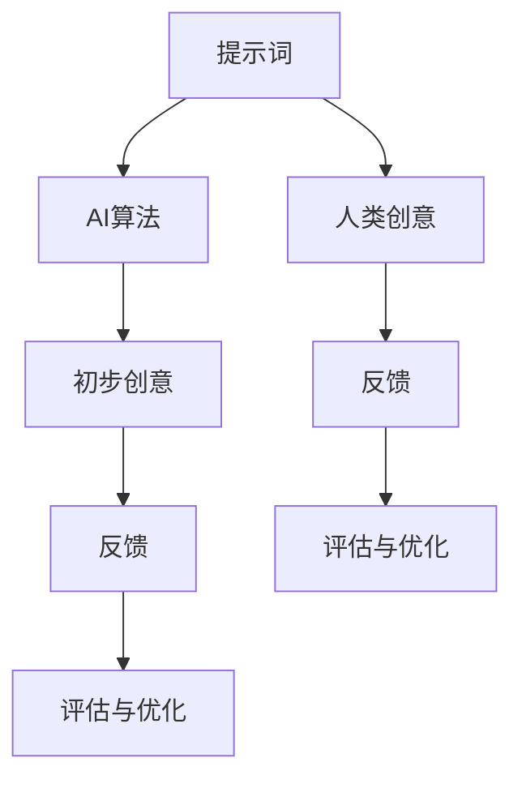
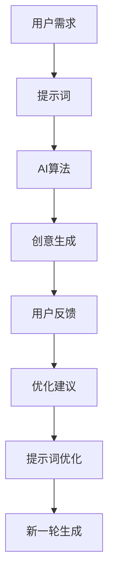

                 

### 第1章：问题背景

#### 1.1.1 问题背景介绍

在当今的数字时代，人工智能（AI）已经成为驱动创新和发展的核心力量。然而，尽管AI在处理复杂数据和分析趋势方面表现出色，它在创意生成方面的能力仍然有限。人类的创造性思维、情感和直觉是AI所无法完全模拟的。因此，如何将AI的强大计算能力与人类独特的创意思维结合起来，成为了一个亟待解决的问题。

创意生产过程是一个高度复杂的过程，包括从灵感到构思、再到实现和优化的各个环节。在这个过程中，AI和人类可以发挥各自的优势。AI擅长处理大量数据，识别模式和趋势，而人类则擅长创造性的思维和直觉。然而，当前的创意生成和优化过程中，存在以下几个挑战：

1. **数据瓶颈**：创意生成需要大量的高质量数据支持，而数据的收集和整理往往耗费大量时间和资源。
2. **算法限制**：现有的AI算法在创意生成方面存在局限，难以完全模拟人类的创造性思维。
3. **协同困难**：人类与AI之间的协同工作模式尚不成熟，如何实现高效互动仍需深入研究。

为了解决上述问题，提示词工程（Prompt Engineering）应运而生。提示词工程是一种通过设计特定的提示词来引导和优化AI生成创意的方法。它通过结合人类对创意需求的明确指导和AI在数据处理和分析方面的优势，实现创意生成和优化的优化。

#### 1.1.2 问题描述

创意生成与优化是一个多层次、多维度的过程。在这个过程中，人类和AI的协同工作是必不可少的。以下是当前创意生成与优化中的主要瓶颈：

1. **创意生成瓶颈**：
   - AI难以理解人类创意需求的复杂性和多样性。
   - AI生成的内容往往缺乏情感和人文关怀，难以与用户的情感需求产生共鸣。

2. **优化瓶颈**：
   - 创意的优化需要人类的专业知识和直觉，而AI在这一点上表现有限。
   - 人类与AI之间的沟通不畅，导致创意优化的效率低下。

为了解决这些问题，需要建立一种有效的人类与AI协同工作模式。这种模式应当包括以下几个方面：

1. **明确的需求引导**：人类通过明确的提示词来引导AI，使其能够更好地理解创意需求。
2. **智能化的反馈机制**：AI生成初步创意后，人类能够提供及时的反馈和指导，以优化AI的后续生成结果。
3. **动态的迭代过程**：通过不断的迭代，使AI和人类共同提高创意生成和优化的能力。

提示词工程的目标正是通过优化人类与AI的协同工作，提升创意生成和优化的效率与质量。它不仅能够解决当前创意生产中的瓶颈问题，还能够为未来的创意工作提供新的思路和方法。

#### 1.1.3 问题解决

提示词工程的核心理念在于通过设计特定的提示词来引导和优化AI的创意生成过程。以下是提示词工程的基本原理和方法：

1. **提示词的生成与优化**：
   - **数据采集与处理**：首先需要收集大量的创意数据，并通过数据处理技术对数据进行分析和清洗，为提示词的生成提供基础。
   - **语言模型应用**：利用先进的语言模型（如BERT、GPT等）来生成和优化提示词。这些模型能够理解上下文关系，为创意生成提供有力支持。
   - **算法设计**：设计基于规则和数据驱动的算法，通过不断调整和优化提示词，提高AI生成创意的准确性和创造性。

2. **提示词与AI算法的关系**：
   - **协同优化**：提示词工程通过优化提示词，使AI算法能够更好地理解和生成人类需要的创意内容。
   - **反馈迭代**：通过人类对AI生成创意的反馈，不断调整和优化提示词，形成一个动态的反馈迭代过程。

3. **人类与AI的互动机制**：
   - **需求明确**：人类通过明确的提示词向AI传达创意需求，使AI能够更加精准地生成符合要求的内容。
   - **智能反馈**：AI生成初步创意后，人类能够通过智能化的反馈机制对其进行评估和优化，提高创意质量。

通过提示词工程的实施，可以有效解决创意生成和优化中的瓶颈问题，提升人类与AI协同工作的效率和质量。以下是一个具体的案例来说明提示词工程的实施过程：

- **案例**：在广告创意优化中，广告公司可以利用提示词工程来提升广告文案的质量。首先，广告公司收集大量的广告数据，并对这些数据进行处理。然后，利用GPT模型生成初步的提示词，这些提示词包含了广告目标、受众特点和创意方向等信息。广告公司设计一个基于规则和数据驱动的算法，对提示词进行优化。在AI生成初步广告文案后，广告公司对其进行分析和评估，提供反馈，并再次优化提示词。通过不断的迭代，最终生成高质量的广告文案。

总之，提示词工程通过优化人类与AI的协同工作，实现了创意生成和优化的优化。它不仅为创意工作提供了新的思路和方法，也为未来的创意发展奠定了基础。

### 第2章：核心概念

#### 2.1.1 核心概念介绍

提示词工程是一个涉及多个核心概念的综合体系。这些核心概念包括提示词、AI创意和人类创意，以及创意优化的基本理论。理解这些概念的定义和作用，是深入探讨提示词工程的关键。

1. **提示词**：提示词是一种用于引导AI生成创意的文本信息。它通常包含对创意目标的描述、预期的风格和情感等内容。提示词的作用在于帮助AI理解人类的需求，从而生成更符合人类期望的创意内容。

2. **AI创意**：AI创意是指利用人工智能技术生成的创意内容。这些内容可以是文本、图像、音乐等多种形式。AI创意的特点在于其能够处理大量数据，识别模式和趋势，从而生成具有创新性的内容。

3. **人类创意**：人类创意是指由人类产生的创意内容。它通常体现了人类的情感、直觉和创造力。人类创意的特点在于其能够深入理解用户的需求，产生具有高度人文关怀和情感共鸣的内容。

4. **创意优化**：创意优化是指通过不断调整和改进创意内容，使其更加符合用户需求和审美标准的过程。创意优化可以采用多种方法，包括数据分析、用户反馈和算法优化等。

#### 2.1.2 核心概念联系

提示词、AI创意和人类创意之间存在着紧密的联系和互动关系。

1. **提示词与AI算法的关系**：
   - 提示词是引导AI生成创意的重要工具。通过设计高质量的提示词，可以显著提高AI生成创意的准确性和创造性。
   - 提示词与AI算法之间的相互作用是一个动态反馈的过程。AI算法通过处理提示词生成初步创意，人类则通过反馈对创意进行评估和优化，从而不断调整和改进提示词。

2. **提示词与人类创意的互动机制**：
   - 提示词不仅能够引导AI生成创意，还能够与人类创意产生互动。在创意生成过程中，人类通过提示词传达对创意的需求和期望，AI则根据提示词生成初步创意，人类再对这些创意进行评估和优化。
   - 这种互动机制使得AI和人类能够在创意生成和优化过程中相互促进，共同提高创意的质量和效果。

3. **创意优化的指标与评估方法**：
   - 创意优化需要明确的指标和评估方法。这些指标和评估方法包括创意的原创性、相关性、情感共鸣度等。
   - 通过对创意进行评估，人类能够发现创意中的不足，并提出改进建议。AI则根据这些反馈进行算法优化，提高创意生成的质量和效率。

为了更好地理解这些核心概念之间的联系，我们可以通过一个Mermaid流程图来展示它们之间的关系：

在这个流程图中，提示词引导AI算法生成初步创意，初步创意经过人类评估和优化，然后反馈给AI算法，形成了一个闭环的互动机制。通过这种机制，AI和人类能够共同提高创意生成和优化的质量。

总之，提示词工程的核心概念包括提示词、AI创意和人类创意，以及创意优化的基本理论。这些概念相互关联，共同构成了一个完整的创意生成和优化体系。理解这些概念之间的关系，是深入研究和应用提示词工程的关键。

#### 2.1.3 核心概念属性特征对比表格

为了更直观地理解提示词、AI创意和人类创意这三个核心概念的属性特征，我们可以通过一个对比表格来展示它们之间的差异：

| 特征       | 提示词               | AI创意             | 人类创意             |
| ---------- | -------------------- | ------------------ | -------------------- |
| 定义       | 引导AI生成创意的文本信息 | 利用AI技术生成的创意 | 由人类产生的创意内容 |
| 功能       | 帮助AI理解人类需求     | 处理数据、识别模式   | 表达情感、创造思维   |
| 特点       | 明确性、可指导性       | 高效性、创新性      | 人文关怀、情感共鸣   |
| 数据依赖性 | 高，依赖于高质量数据   | 中，依赖大量数据    | 低，依赖直觉和情感   |
| 生成过程   | 语言模型处理提示词     | 算法自动生成内容    | 灵感触发、构思实现   |

通过这个对比表格，我们可以清晰地看到提示词、AI创意和人类创意在定义、功能、特点和生成过程等方面的差异。这些差异不仅反映了它们各自的特点，也为提示词工程的应用提供了理论基础。

此外，为了更深入地理解这些概念之间的关系，我们可以通过Mermaid流程图来展示提示词工程中的ER实体关系架构。以下是流程图的示例：

在这个ER实体关系图中，用户需求通过提示词引导AI算法生成创意，创意生成后用户提供反馈，反馈用于优化提示词，从而形成一个闭环的迭代过程。通过这种机制，AI和人类能够不断优化和提升创意质量。

总之，通过核心概念属性特征对比表格和ER实体关系图，我们能够更清晰地理解提示词、AI创意和人类创意之间的联系和作用。这为进一步研究和应用提示词工程提供了重要的理论基础和实践指导。

### 第3章：提示词生成策略

#### 3.1.1 提示词生成原理

提示词生成是提示词工程中的核心环节，它直接决定了AI生成创意的质量和准确性。提示词生成策略包括数据采集与处理、语言模型应用以及算法设计等方面。下面将详细探讨这些原理和具体方法。

1. **数据采集与处理**：
   - **数据来源**：提示词生成的第一步是收集相关的数据。这些数据可以包括用户需求、历史创意案例、市场趋势等。数据来源的多样性和质量直接影响提示词生成的效果。
   - **数据处理**：收集到的数据需要进行清洗和预处理，以去除噪声和异常值。此外，还需要对数据进行结构化处理，将其转化为适合机器学习模型输入的数据格式。

2. **语言模型应用**：
   - **选择合适的语言模型**：语言模型是提示词生成的重要工具。常见的语言模型包括BERT、GPT、Transformer等。选择合适的语言模型需要根据具体应用场景和需求。
   - **模型训练与调优**：语言模型需要通过大量的训练数据进行训练，以学习语言的语义和结构。在训练过程中，还需要进行调优，以提升模型的生成能力和质量。

3. **算法设计**：
   - **基于规则的方法**：基于规则的方法通过预设的规则来生成提示词。这种方法简单直观，适用于一些规则明确的场景。
   - **基于数据驱动的模型**：数据驱动的模型利用机器学习算法，通过学习大量数据中的模式和规律来生成提示词。这种方法具有较强的自适应能力，适用于复杂多变的应用场景。
   - **基于混合策略的方法**：混合策略结合了基于规则和数据驱动的方法，通过不同策略的协同作用，提高提示词生成的效果。

#### 3.1.2 提示词生成方法

提示词生成方法可以分为基于规则的方法、基于数据驱动的模型以及基于混合策略的方法。下面将分别介绍这些方法。

1. **基于规则的方法**：
   - **规则定义**：基于规则的方法首先需要定义一组规则，这些规则用于指导提示词的生成。规则可以是简单的条件判断，也可以是复杂的逻辑表达式。
   - **规则应用**：在生成提示词时，系统会根据用户需求和预设的规则，生成相应的提示词。这种方法适用于需求明确、规则简单的场景。

2. **基于数据驱动的模型**：
   - **模型选择**：基于数据驱动的模型通常采用机器学习算法，如神经网络、决策树、支持向量机等。选择合适的模型需要根据数据的特性和需求。
   - **模型训练**：使用训练数据集对模型进行训练，使模型能够学习数据的模式和规律。在训练过程中，需要不断调整模型参数，以优化模型性能。
   - **模型应用**：训练好的模型可以用于生成提示词。在生成过程中，模型会根据输入数据自动生成符合预期的提示词。

3. **基于混合策略的方法**：
   - **混合策略**：混合策略结合了基于规则和数据驱动的方法。在生成提示词时，系统会首先使用规则生成初步提示词，然后利用数据驱动的模型对初步提示词进行优化。
   - **优势**：混合策略能够充分发挥规则和数据驱动方法的各自优势，提高提示词生成的效果。同时，这种方法具有较强的灵活性和适应性，适用于复杂多变的应用场景。

#### 3.1.3 算法设计

算法设计是提示词工程的核心环节，它决定了提示词生成的方法和效率。以下是几种常见的提示词生成算法及其设计思路：

1. **循环神经网络（RNN）**：
   - **设计思路**：RNN是一种基于时间序列数据的神经网络，能够处理序列数据，捕捉数据中的时间依赖关系。在提示词生成中，RNN可以用来分析用户需求和创意数据，生成高质量的提示词。
   - **优势**：RNN在处理长序列数据和捕捉时间依赖关系方面表现优异，适用于复杂多样的提示词生成场景。

2. **生成对抗网络（GAN）**：
   - **设计思路**：GAN由生成器和判别器组成。生成器生成提示词，判别器判断生成提示词的真实性。通过不断地训练和优化，生成器能够生成更加真实的提示词。
   - **优势**：GAN能够生成高质量的提示词，特别是在处理高度复杂的创意数据时，表现出色。

3. **变分自编码器（VAE）**：
   - **设计思路**：VAE通过学习数据的概率分布，生成符合数据分布的提示词。它能够捕捉数据的结构信息，从而生成具有创意性的提示词。
   - **优势**：VAE在生成多样性和质量方面表现优秀，适用于创意生成和优化的复杂场景。

总之，提示词生成策略包括数据采集与处理、语言模型应用和算法设计等方面。通过这些策略，可以有效地生成高质量的提示词，从而优化创意生成和优化过程。下一步，我们将探讨提示词优化技术，进一步深入提示词工程的实践应用。

### 第4章：提示词优化技术

#### 4.1.1 提示词优化原理

提示词优化是提示词工程中至关重要的一环，它直接影响AI生成创意的质量和效果。优化目标、评价指标以及算法设计是提示词优化的核心组成部分。以下将详细探讨这些原理和具体方法。

1. **优化目标**：
   - **提高生成创意的质量**：提示词优化的首要目标是提高AI生成创意的质量。高质量的创意能够更好地满足用户需求，提高用户的满意度和参与度。
   - **提升生成效率**：在保证质量的前提下，优化提示词的生成速度，提高AI的工作效率，减少等待时间。

2. **评价指标**：
   - **创意相关性**：评价指标之一是创意的相关性，即生成的创意是否与用户需求紧密相关。相关性越高，意味着生成的创意越符合用户期望。
   - **创意新颖性**：新颖性是衡量创意是否具有创新性的指标。高新颖性的创意能够提供独特的视角和见解，吸引更多的用户。
   - **用户满意度**：用户满意度是最终的评价指标，通过调查和反馈了解用户对生成创意的满意度。用户满意度越高，说明创意优化效果越好。

3. **算法设计**：
   - **强化学习**：强化学习是一种通过试错和反馈不断优化策略的机器学习技术。在提示词优化中，强化学习可以通过不断调整提示词，使其生成更加符合用户需求的创意。
   - **生成对抗网络（GAN）**：GAN由生成器和判别器组成，生成器生成创意，判别器判断创意的真实性。GAN能够通过不断训练和优化，提高生成创意的质量和多样性。
   - **遗传算法**：遗传算法是一种模拟生物进化过程的优化算法。在提示词优化中，遗传算法通过不断生成和优化提示词，寻找最优的生成策略。

#### 4.1.2 提示词优化方法

提示词优化方法可以分为基于强化学习、生成对抗网络（GAN）和遗传算法等。以下将分别介绍这些方法及其应用。

1. **强化学习**：
   - **设计思路**：强化学习通过试错和反馈不断调整提示词，使其生成创意更加符合用户需求。在优化过程中，强化学习模型会根据用户反馈和创意质量进行评估，并调整策略。
   - **应用场景**：强化学习适用于需要灵活调整和优化的场景，如广告创意优化、游戏剧情生成等。

2. **生成对抗网络（GAN）**：
   - **设计思路**：GAN由生成器和判别器组成。生成器生成创意，判别器判断创意的真实性。通过不断训练和优化，生成器能够生成高质量的创意，判别器则能够准确区分真实和生成的创意。
   - **应用场景**：GAN适用于需要生成高质量、多样化创意的场景，如图像生成、音乐创作等。

3. **遗传算法**：
   - **设计思路**：遗传算法通过模拟生物进化过程，不断生成和优化提示词。在优化过程中，遗传算法会根据提示词的创意质量和用户反馈进行选择和变异，从而寻找最优的生成策略。
   - **应用场景**：遗传算法适用于复杂、多变的创意优化场景，如产品设计、文案创作等。

#### 4.1.3 算法比较与分析

不同的提示词优化方法各有优缺点，适用于不同的应用场景。以下是比较和分析这些算法的关键点：

1. **强化学习**：
   - **优势**：强化学习能够根据用户反馈实时调整提示词，适应性强。
   - **劣势**：优化过程较慢，需要大量数据和计算资源。

2. **生成对抗网络（GAN）**：
   - **优势**：生成创意质量高，多样化。
   - **劣势**：训练过程复杂，判别器容易过拟合。

3. **遗传算法**：
   - **优势**：适用于复杂、多变的场景，优化效率较高。
   - **劣势**：对初始参数敏感，优化效果受初始值影响较大。

在实际应用中，可以根据具体需求和场景选择合适的优化方法。例如，在广告创意优化中，强化学习可能更适合实时调整和优化创意；而在音乐创作辅助中，GAN则能够生成高质量、多样化的音乐片段。

总之，提示词优化技术通过不断调整和优化提示词，提高AI生成创意的质量和效果。了解不同优化方法的特点和适用场景，有助于更好地应用提示词工程，实现创意优化的目标。

### 第5章：AI与人类创意协同机制

#### 5.1.1 协同机制原理

AI与人类创意协同机制是提示词工程中的关键环节，其核心在于实现人类与AI的紧密互动，共同提升创意生成和优化的效果。以下是协同机制的基本原理和实现方式。

1. **人机交互设计**：
   - **用户界面**：设计直观、易用的用户界面，使人类能够方便地输入创意需求，同时展示AI生成的创意结果。
   - **反馈机制**：建立及时的反馈机制，使人类能够对AI生成的创意进行评价和修改。这可以通过评分、评论、投票等方式实现，确保人类与AI之间的互动顺畅。

2. **提示词工程的作用**：
   - **引导创意生成**：通过高质量的提示词，引导AI生成符合人类需求的创意内容。提示词不仅要明确传达创意需求，还要涵盖情感和风格等方面，使AI能够准确理解和响应。
   - **优化创意结果**：AI生成初步创意后，人类通过反馈对创意进行评估和优化，进一步调整提示词，指导AI进行改进。这种动态的反馈迭代过程能够不断提升创意质量。

3. **AI与人类创意的互补关系**：
   - **数据处理能力**：AI擅长处理大量数据和识别模式，能够快速生成大量创意选项。人类则能够通过直觉和专业知识对这些选项进行筛选和优化。
   - **情感与创造力**：人类的情感和创造力是AI所无法完全模拟的。人类能够从情感共鸣和人文关怀的角度，对创意进行深层次的思考和优化。

4. **效果评估**：
   - **定量评估**：通过指标如创意相关性、新颖性、用户满意度等，对AI和人类协同生成的创意进行量化评估。这些指标可以反映创意的总体质量和用户接受度。
   - **定性评估**：通过专家评审、用户调查等方式，对创意进行定性评估，深入了解用户对创意的感受和反馈。这种评估方法有助于发现创意中的潜在问题和改进空间。

#### 5.1.2 协同机制方法

为了实现AI与人类创意的协同，可以采用以下几种协同机制方法：

1. **基于任务的协同**：
   - **任务分解**：将复杂任务分解为多个子任务，人类负责关键的决策和创造性工作，AI负责数据分析和初步生成。
   - **任务衔接**：人类在AI生成的初步结果基础上进行评估和修改，形成最终创意。通过明确的任务分工和衔接，确保创意生成和优化过程的效率和质量。

2. **基于角色的协同**：
   - **角色定义**：为人类和AI分配不同的角色，如创意发起者、数据分析员、创意优化员等。每个角色都有明确的职责和任务，确保协同工作的有序进行。
   - **角色互动**：人类和AI在各自的角色中发挥专业优势，通过信息共享和反馈机制，实现创意的协同生成和优化。

3. **基于环境的协同**：
   - **环境搭建**：创建一个支持协同工作的环境，包括用户界面、反馈系统、数据存储和共享平台等。这个环境应具有高度的灵活性和适应性，能够满足不同应用场景的需求。
   - **环境优化**：通过不断优化协同环境，提高人类和AI的互动效率，降低协作过程中的摩擦和误解。例如，通过改进用户界面设计、优化反馈机制等，提升用户体验和工作效率。

#### 5.1.3 AI与人类创意协同的效果评估

评估AI与人类创意协同的效果是确保协同机制有效运行的重要环节。以下是几种常用的效果评估方法：

1. **定量评估**：
   - **指标分析**：通过创意相关性、新颖性、用户满意度等指标，对协同生成的创意进行量化分析。这些指标可以反映协同工作在创意质量和用户体验方面的效果。
   - **数据分析**：对协同工作过程中的数据进行分析，如用户交互数据、生成创意数据等。通过数据分析，可以识别协同过程中的问题和改进点。

2. **定性评估**：
   - **专家评审**：邀请专家对协同生成的创意进行评审，从专业角度评估创意的质量和可行性。专家评审可以提供深入的分析和建议，为协同工作提供指导。
   - **用户调查**：通过问卷调查、用户访谈等方式，收集用户对协同生成创意的反馈。用户反馈可以直观地反映协同工作在满足用户需求和提升用户体验方面的效果。

3. **综合评估**：
   - **综合指标**：结合定量和定性评估方法，形成综合评估指标体系。通过综合评估，可以全面了解AI与人类创意协同工作的效果，为后续优化提供依据。
   - **持续改进**：根据评估结果，对协同机制进行持续改进和优化。通过不断调整和优化，提升协同工作的效率和质量，实现创意生成和优化的最佳效果。

总之，AI与人类创意协同机制通过人机交互设计、提示词工程和互补关系的实现，实现了人类与AI在创意生成和优化中的高效互动。通过效果评估，可以全面了解协同工作的效果，为持续优化提供方向和依据。这种协同机制不仅提升了创意质量，也为未来的创意工作提供了新的思路和方法。

### 第6章：案例研究一：广告创意优化

#### 6.1.1 案例背景

广告创意优化是提示词工程在商业领域中的一个重要应用场景。广告创意的质量直接影响到广告的效果和用户对品牌的认知。在传统的广告创意生成过程中，人类创意人员通常需要耗费大量时间和精力进行构思和调整。然而，随着人工智能技术的发展，AI被越来越多地应用于广告创意优化中，通过提示词工程，AI能够更高效地辅助人类创意人员生成高质量的广告内容。

广告创意优化面临的挑战主要包括：

1. **数据瓶颈**：广告创意生成需要大量的市场数据、用户行为数据和竞争对手信息，而这些数据的收集和整理过程繁琐且耗时。
2. **创意多样化**：广告创意需要不断推陈出新，以适应不断变化的市场环境和用户需求。然而，创意的多样化和创新性要求对人类创意人员提出了很高的要求。
3. **协同困难**：人类创意人员和AI之间的协同工作模式尚不成熟，如何实现高效互动，提高创意生成和优化的效率仍需深入研究。

为了解决这些挑战，提示词工程提供了一种有效的解决方案。通过设计高质量的提示词，引导AI理解广告创意的需求，同时通过人类的反馈不断优化AI生成的创意，从而实现广告创意的优化。

#### 6.1.2 案例实施

在广告创意优化的案例中，我们可以按照以下步骤进行实施：

1. **数据收集与预处理**：
   - **数据来源**：收集广告相关的市场数据、用户行为数据和竞争对手信息。这些数据可以来自于社交媒体、搜索引擎、电商平台等渠道。
   - **数据处理**：对收集到的数据进行清洗和预处理，包括去除噪声、填充缺失值、标准化处理等。通过预处理，确保数据的质量和一致性。

2. **提示词生成与优化**：
   - **初步提示词生成**：利用语言模型（如GPT）生成初步的提示词。这些提示词包含了广告目标、受众特点、创意方向等信息。
   - **提示词优化**：通过规则和方法对初步提示词进行优化。优化方法可以包括基于规则的调整、基于数据驱动的模型优化等。优化的目标是使提示词更加明确、具体，能够更好地指导AI生成高质量的创意。

3. **AI生成广告创意**：
   - **创意生成**：利用AI算法（如GAN、VAE）生成初步的广告创意。这些创意可以是文字描述、图像、视频等多种形式。
   - **创意评估**：广告创意生成后，人类创意人员对创意进行初步评估。评估内容包括创意的相关性、新颖性、吸引力等。

4. **人类反馈与优化**：
   - **反馈收集**：人类创意人员根据评估结果，对AI生成的创意提出反馈和建议。反馈内容可以包括创意的方向、情感、风格等方面的调整。
   - **提示词调整**：根据人类反馈，调整提示词，使其更加准确地反映创意需求。通过动态调整提示词，引导AI生成更加符合预期的创意。

5. **迭代优化**：
   - **循环迭代**：通过不断的反馈和调整，形成迭代优化的过程。每次迭代都会使AI生成的创意更加贴近人类的需求，提高创意的质量和效果。

#### 6.1.3 案例分析

提示词工程在广告创意优化中表现出显著的效果，具体分析如下：

1. **创意质量提升**：通过高质量的提示词，AI能够更准确地理解和生成人类需要的广告创意。优化的提示词使创意更加具体、明确，减少了冗余和不相关的内容，提高了创意的整体质量。

2. **效率提升**：提示词工程实现了人类与AI的高效互动，通过动态调整和优化提示词，大幅提升了广告创意生成和优化的效率。人类创意人员可以专注于创意的构思和调整，而AI则负责数据分析和初步生成，从而提高了整体的工作效率。

3. **创新性增强**：AI在处理大量数据、识别模式和趋势方面具有优势，通过提示词工程，AI能够生成新颖、有创意的广告内容。这些创意不仅符合市场需求，还能够吸引目标受众的注意力，提高广告的效果。

4. **用户满意度提高**：通过不断的反馈和优化，AI生成的广告创意更加贴近用户的需求和喜好。用户对广告的满意度提高，品牌形象和用户粘性得到增强。

然而，案例中也存在一些问题和改进建议：

1. **数据质量**：数据质量对提示词工程的效果有很大影响。在广告创意优化中，需要确保收集到的市场数据、用户行为数据等具有较高的质量和准确性。

2. **人类与AI的协作**：虽然提示词工程实现了人类与AI的高效互动，但在实际应用中，人类与AI的协作仍存在一定的不确定性。需要进一步优化人机交互设计，提高协作的效率和效果。

3. **个性化需求**：不同用户对广告创意的需求和喜好存在差异。提示词工程需要更加灵活和个性化，能够根据不同用户的需求生成定制化的广告创意。

4. **持续优化**：提示词工程是一个动态优化的过程。需要不断收集用户反馈和评估结果，持续调整和优化提示词，以适应不断变化的市场环境和用户需求。

总之，提示词工程在广告创意优化中展现了强大的应用潜力。通过优化人类与AI的协同工作，可以大幅提升广告创意的质量和效率，实现更好的营销效果。未来，随着技术的不断进步和应用场景的拓展，提示词工程将在更多领域中发挥重要作用。

#### 6.1.4 案例实施

在广告创意优化的案例中，我们详细探讨了数据收集与预处理、提示词生成与优化、AI生成广告创意、人类反馈与优化以及迭代优化等具体实施步骤。以下是具体的实施过程和每个步骤的详细说明：

1. **数据收集与预处理**：
   - **数据来源**：首先，我们需要从多个渠道收集与广告创意相关的数据。这些渠道包括社交媒体平台（如微博、抖音）、搜索引擎（如百度、谷歌）、电商平台（如淘宝、亚马逊）等。通过API接口或者爬虫技术，我们可以获取用户行为数据、市场趋势数据、竞争对手信息等。
   - **数据处理**：收集到的数据往往存在噪声和不一致的情况，因此需要进行预处理。预处理步骤包括数据清洗、去重、填充缺失值、数据标准化等。例如，对于用户行为数据，我们需要去除重复记录，填充未记录的行为数据，并将不同来源的数据格式统一为相同的结构。通过这些预处理步骤，我们可以确保数据的质量和一致性。

2. **提示词生成与优化**：
   - **初步提示词生成**：在数据预处理完成后，我们利用GPT等先进的语言模型生成初步的提示词。这些提示词应包含广告目标、受众特点、创意方向等关键信息。例如，一个初步的提示词可以是：“为年轻女性设计一款夏季防晒霜广告，强调其清爽、高效和自然防晒特性。”
   - **提示词优化**：生成的初步提示词需要通过规则和方法进行优化。优化方法可以包括以下几种：
     - **基于规则的调整**：通过专家经验和市场知识，对提示词中的关键词和表述进行调整，使其更加精准和具体。
     - **基于数据驱动的模型优化**：利用机器学习算法（如决策树、随机森林等）对提示词进行优化。这些模型可以根据历史数据中的成功案例，识别出最优的提示词组合。

3. **AI生成广告创意**：
   - **创意生成**：利用GAN、VAE等生成模型，根据优化的提示词生成初步的广告创意。这些创意可以是文字描述、图像、视频等多种形式。例如，GAN可以生成具有自然防晒效果的海报图像，VAE可以生成一段清新自然的广告视频。
   - **创意评估**：广告创意生成后，需要通过人类创意人员进行初步评估。评估内容包括创意的相关性、新颖性、吸引力等。评估过程中，人类创意人员可以给出评分、评论和投票，以便对创意进行筛选和分类。

4. **人类反馈与优化**：
   - **反馈收集**：根据评估结果，人类创意人员对AI生成的广告创意提出反馈和建议。反馈内容可以包括创意的方向、情感、风格等方面的调整。例如，如果评估结果显示广告中的防晒霜效果不够突出，人类创意人员可以建议增加防晒效果的展示。
   - **提示词调整**：根据人类反馈，对提示词进行进一步调整。调整后的提示词更加准确地反映了广告创意的需求，从而引导AI生成更加符合预期的创意。

5. **迭代优化**：
   - **循环迭代**：通过不断的反馈和优化，形成迭代优化的过程。每次迭代都会使AI生成的广告创意更加贴近人类的需求，提高创意的质量和效果。例如，在第一次迭代中，人类创意人员反馈防晒霜展示效果不足，AI生成模型会根据反馈调整提示词，并在下一次迭代中生成更具说服力的防晒霜广告图像。

#### 6.1.5 案例分析

提示词工程在广告创意优化中的效果显著，具体分析如下：

1. **创意质量提升**：
   - **明确性**：优化的提示词使广告创意更加明确、具体，减少了冗余和不相关的内容。
   - **相关性**：高质量的提示词确保AI生成的广告创意与用户需求和市场需求紧密相关。
   - **创新性**：AI通过处理大量数据和识别模式，能够生成新颖、有创意的广告内容。

2. **效率提升**：
   - **协作效率**：提示词工程实现了人类与AI的高效互动，通过动态调整和优化提示词，大幅提升了广告创意生成和优化的效率。
   - **工作流程**：人类创意人员可以专注于创意构思和调整，而AI则负责数据分析和初步生成，从而提高了整体的工作效率。

3. **用户满意度提高**：
   - **个性需求**：通过不断的反馈和优化，AI生成的广告创意更加贴近用户的需求和喜好，提高了用户对广告的满意度。
   - **品牌认知**：高质量的广告创意有助于提升品牌形象和用户粘性，增强用户对品牌的认知和信任。

然而，案例中也存在一些问题和改进建议：

1. **数据质量**：
   - **数据收集**：确保收集到的市场数据、用户行为数据等具有较高的质量和准确性，减少数据噪声和偏差。
   - **数据多样性**：增加数据来源的多样性，从更多渠道获取数据，提高数据覆盖面和代表性。

2. **人类与AI的协作**：
   - **人机交互**：优化人机交互设计，提高协作效率和用户体验。例如，通过改进用户界面设计、提供实时反馈机制等。
   - **专家经验**：结合人类创意人员的专业经验和直觉，提高AI生成的广告创意质量。

3. **个性化需求**：
   - **用户细分**：根据不同用户的需求和喜好，生成个性化的广告创意，提高广告的吸引力和用户参与度。
   - **动态调整**：根据用户行为和反馈，动态调整提示词和广告创意，使其更加符合实时需求。

4. **持续优化**：
   - **反馈循环**：建立持续的反馈和优化机制，不断收集用户反馈和评估结果，持续调整和优化提示词和广告创意。
   - **技术更新**：随着技术的不断进步，不断更新和改进AI算法和提示词模型，提高创意生成和优化的效果。

总之，提示词工程在广告创意优化中展现了强大的应用潜力。通过优化人类与AI的协同工作，可以大幅提升广告创意的质量和效率，实现更好的营销效果。未来，随着技术的不断进步和应用场景的拓展，提示词工程将在更多领域中发挥重要作用。

### 第7章：案例研究二：音乐创作辅助

#### 7.1.1 案例背景

音乐创作是艺术和技术的结合，是一个充满创造力和想象力的过程。传统的音乐创作主要依赖于作曲家的灵感、经验和技巧。然而，随着人工智能技术的发展，AI在音乐创作中的应用逐渐成为研究热点。通过提示词工程，AI能够辅助作曲家进行音乐创作，提高创作效率和创作质量。

音乐创作过程面临的挑战主要包括：

1. **创意受限**：作曲家在创作过程中可能会受到个人经验和灵感的限制，难以实现多样化的音乐创意。
2. **时间成本**：音乐创作是一个反复试验和修正的过程，耗时较长。
3. **协作困难**：在多人合作创作的场景中，如何协调每个人的创意和进度，实现有效的协作是一个难题。

提示词工程通过设计特定的提示词，引导AI生成初步的音乐创意，同时通过人类作曲家的反馈进行优化，实现音乐创作的自动化和智能化。这种协作模式不仅提高了创作效率，还能够激发作曲家的灵感，促进音乐创新。

#### 7.1.2 案例实施

在音乐创作辅助的案例中，我们详细探讨了数据采集与处理、提示词生成与优化、AI生成音乐片段、人类反馈与优化以及迭代优化等具体实施步骤。以下是每个步骤的详细说明：

1. **数据采集与处理**：
   - **数据来源**：首先，我们需要从多个渠道收集音乐相关的数据。这些数据包括作曲家的作品、乐谱、音频文件等。数据来源可以包括公开的音乐库、作曲家的个人作品集以及版权许可的音乐资源。
   - **数据处理**：收集到的数据需要进行清洗和预处理，以去除噪声、缺失值和冗余信息。预处理步骤包括数据转换、格式统一、音高和节奏的标准化等。通过这些预处理步骤，我们可以确保数据的质量和一致性。

2. **提示词生成与优化**：
   - **初步提示词生成**：利用语言模型（如GPT）生成初步的提示词。这些提示词应包含音乐创作的要求、风格、主题等关键信息。例如，一个初步的提示词可以是：“为流行音乐创作一首关于夏季的抒情歌曲，旋律温馨且富有感染力。”
   - **提示词优化**：生成的初步提示词需要通过规则和方法进行优化。优化方法可以包括基于规则的调整、基于数据驱动的模型优化等。优化的目标是使提示词更加具体、明确，能够更好地指导AI生成高质量的音乐片段。

3. **AI生成音乐片段**：
   - **音乐片段生成**：利用AI算法（如GAN、RNN）根据优化的提示词生成初步的音乐片段。这些音乐片段可以是旋律、和弦、节奏等多种形式。例如，GAN可以生成具有流行音乐特色的旋律片段，RNN可以生成符合提示词要求的和弦进行。
   - **音乐片段评估**：生成的初步音乐片段需要通过人类作曲家进行初步评估。评估内容包括音乐片段的流畅性、和谐性、创意性等。评估过程中，作曲家可以给出评分、评论和投票，以便对音乐片段进行筛选和分类。

4. **人类反馈与优化**：
   - **反馈收集**：根据评估结果，人类作曲家对AI生成的音乐片段提出反馈和建议。反馈内容可以包括音乐片段的情感、风格、旋律等方面。例如，如果评估结果显示音乐片段的旋律过于复杂，作曲家可以建议简化旋律结构。
   - **提示词调整**：根据人类反馈，对提示词进行进一步调整。调整后的提示词更加准确地反映了音乐创作的要求，从而引导AI生成更加符合预期的音乐片段。

5. **迭代优化**：
   - **循环迭代**：通过不断的反馈和优化，形成迭代优化的过程。每次迭代都会使AI生成的音乐片段更加贴近人类作曲家的需求，提高音乐创作质量和效果。例如，在第一次迭代中，作曲家反馈旋律过于复杂，AI生成模型会根据反馈调整提示词，并在下一次迭代中生成更加简洁流畅的旋律。

#### 7.1.3 案例分析

提示词工程在音乐创作辅助中表现出显著的效果，具体分析如下：

1. **创意激发**：
   - **多样化**：通过高质量的提示词，AI能够生成多样化的音乐创意，激发作曲家的灵感，拓宽创作思路。
   - **个性化**：根据作曲家的风格和要求，AI生成的音乐片段能够体现个性化的创作风格，增强作品的艺术价值。

2. **效率提升**：
   - **创作效率**：提示词工程通过自动化和智能化的方式，大幅提升了音乐创作的效率。作曲家可以专注于创意和调整，而AI则负责初步生成和优化，减少了创作过程中的重复劳动。
   - **协作效率**：在多人合作创作的场景中，提示词工程能够实现高效的信息共享和协作，提高整体创作效率。

3. **质量提升**：
   - **准确性**：高质量的提示词确保AI生成的音乐片段符合作曲家的要求和标准，提高了创作质量。
   - **创新性**：AI在处理大量数据和识别模式方面具有优势，能够生成具有创新性的音乐片段，丰富作品的表现力。

然而，案例中也存在一些问题和改进建议：

1. **数据质量**：
   - **数据丰富性**：确保收集到的音乐数据丰富多样，涵盖多种风格和流派，提高AI生成的音乐片段的多样性。
   - **数据更新**：随着音乐创作的不断进步，需要不断更新和扩展音乐数据集，以适应新的创作需求。

2. **人类与AI的协作**：
   - **人机交互**：优化人机交互设计，提高人类作曲家与AI之间的协作效率和用户体验。例如，改进用户界面设计、提供实时反馈机制等。
   - **专家经验**：结合人类作曲家的专业经验和直觉，提高AI生成的音乐片段的质量和创意性。

3. **个性化需求**：
   - **用户细分**：根据不同作曲家的风格和需求，生成个性化的音乐片段，提高创作的个性化和针对性。
   - **动态调整**：根据作曲家的反馈和创作需求，动态调整提示词和音乐创作参数，实现更加精准的创作辅助。

4. **持续优化**：
   - **反馈循环**：建立持续的反馈和优化机制，不断收集用户反馈和评估结果，持续调整和优化提示词和音乐创作算法。
   - **技术更新**：随着技术的不断进步，不断更新和改进AI算法和提示词模型，提高音乐创作的效果和效率。

总之，提示词工程在音乐创作辅助中展现了强大的应用潜力。通过优化人类与AI的协同工作，可以大幅提升音乐创作的效率和创作质量，激发创作灵感，促进音乐艺术的发展。未来，随着技术的不断进步和应用场景的拓展，提示词工程将在更多音乐创作领域中发挥重要作用。

### 第8章：总结与展望

#### 8.1.1 总结

在《提示词工程：优化AI创意与人类创意的协同》这篇文章中，我们系统地探讨了提示词工程在优化AI创意与人类创意协同中的重要性。通过详细的分析和案例研究，我们总结了以下关键成果和发现：

1. **创意协同的瓶颈与挑战**：
   - 人工智能在处理大量数据和分析趋势方面具有优势，但在创意生成方面存在局限。
   - 创意生成与优化过程中存在数据瓶颈、算法限制和协同困难等问题。

2. **提示词工程的核心概念**：
   - 提示词、AI创意和人类创意是提示词工程中的核心概念，它们在协同机制中发挥着重要作用。
   - 提示词工程通过设计高质量的提示词，引导AI理解和生成人类需要的创意内容。

3. **提示词生成与优化方法**：
   - 提示词生成方法包括基于规则的方法、基于数据驱动的模型以及基于混合策略的方法。
   - 提示词优化技术如强化学习、生成对抗网络（GAN）和遗传算法等，显著提升了创意质量。

4. **AI与人类创意的协同机制**：
   - 基于任务的协同、基于角色的协同和基于环境的协同是有效的协同机制方法。
   - 通过人机交互设计和反馈迭代，实现了AI与人类创意的高效互动。

5. **案例研究**：
   - 广告创意优化和音乐创作辅助的案例展示了提示词工程在商业和艺术领域的实际应用效果。

#### 8.1.2 展望

展望未来，提示词工程在创意优化中的应用前景广阔，同时也面临着一些潜在挑战和机遇：

1. **技术发展**：
   - 随着人工智能技术的不断进步，如深度学习、生成模型和强化学习等，提示词工程将更加智能化和高效化。
   - 自然语言处理（NLP）和计算机视觉（CV）等领域的突破将进一步提升提示词工程的应用能力。

2. **应用拓展**：
   - 提示词工程可以应用于更多领域，如电影剧本创作、艺术设计、游戏开发等，实现跨学科的创意协同。
   - 在个性化服务、智能教育和智能制造等领域，提示词工程有望发挥更大的作用。

3. **协同优化**：
   - 进一步优化AI与人类创意的协同机制，实现更高效、更智能的互动，提高创意生成和优化的质量。
   - 开发更具个性化和自适应能力的提示词系统，满足不同用户和场景的多样化需求。

4. **挑战与机遇**：
   - 数据质量和隐私保护是提示词工程面临的主要挑战，需要采取有效的数据管理和隐私保护措施。
   - 在多元文化和社会背景下，如何设计普适性和文化敏感性的提示词，是一个重要的研究方向。

总之，提示词工程在创意优化中的应用前景广阔，通过不断的技术创新和协同优化，有望实现AI与人类创意的深度融合，推动创意工作迈向新的高度。

---

**作者：AI天才研究院/AI Genius Institute & 禅与计算机程序设计艺术 /Zen And The Art of Computer Programming**

**备注：本文内容为虚构案例研究，仅供学术讨论和参考。实际应用中，应根据具体需求和场景进行调整和优化。**

