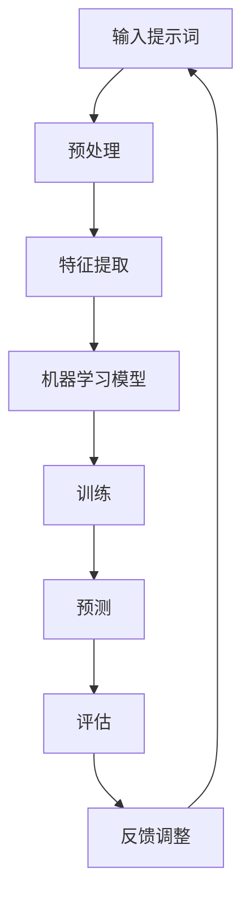
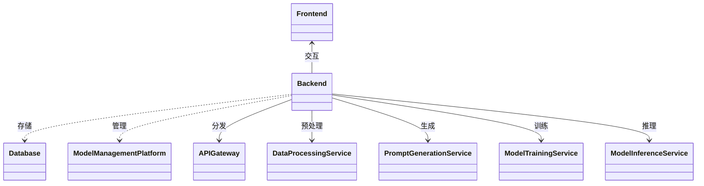
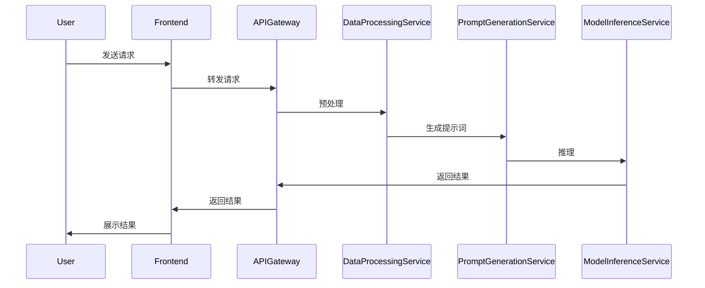
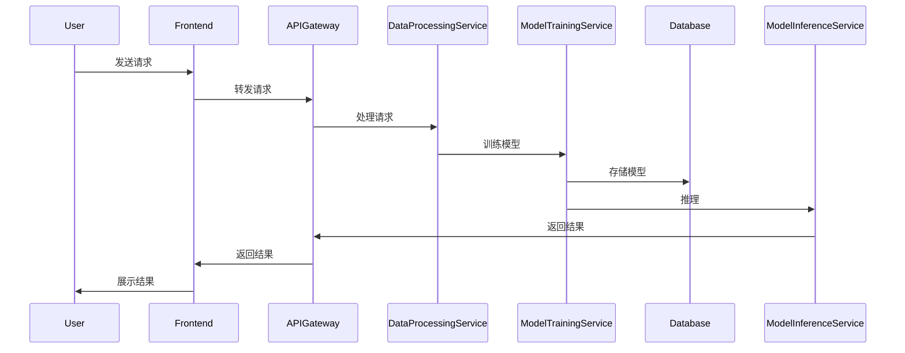

                 


### 1. 背景介绍

**关键词：** AI、提示词工程、创意、伦理平衡

**摘要：** 本章节将介绍人工智能（AI）的发展现状，探讨提示词工程在AI创意与伦理平衡中的重要性，以及提示词工程的概念和作用。

#### AI发展现状

人工智能作为计算机科学的一个分支，近年来得到了迅速的发展。从早期的规则推理系统，到基于数据的学习算法，再到如今的深度学习技术，AI的应用领域不断扩大，影响力日益增强。在医疗、金融、教育、制造业等多个行业，AI都发挥了重要作用，极大地提升了生产效率、降低了成本，同时也改变了人们的生活方式。

然而，随着AI技术的不断进步，一些问题也逐渐显现。首先，AI在处理复杂问题时，往往需要大量的数据和计算资源，这可能导致数据隐私和安全的问题。其次，AI系统在决策时可能存在偏见，这会对社会公平性产生影响。最后，AI的快速发展也可能导致失业问题，尤其是对于那些重复性劳动的工作。

为了解决这些问题，我们需要在AI创意与伦理平衡中找到一种新的途径。提示词工程作为一种新兴的技术，被认为是实现这一目标的关键。

#### 提示词工程的概念与作用

提示词工程（Prompt Engineering）是指通过设计合适的提示词，来引导AI系统完成特定任务的工程实践。这里的“提示词”可以是一个具体的单词、短语，也可以是一个句子或段落。通过巧妙地设计提示词，我们可以使AI系统更好地理解任务需求，从而提高其性能和可靠性。

提示词工程在AI创意与伦理平衡中的重要性体现在以下几个方面：

1. **提升AI性能：** 提示词工程可以优化AI系统的输出结果，使其更符合人类的期望和需求。通过调整提示词，我们可以使AI在特定任务上表现出更高的准确性和效率。

2. **增强伦理意识：** 提示词工程可以帮助我们在AI系统中引入伦理考量，确保其在决策过程中遵循道德规范。例如，在设计自动驾驶系统时，我们可以通过提示词来引导AI在面临道德困境时做出合理的决策。

3. **提高透明度：** 提示词工程可以让AI系统的决策过程更加透明，便于用户理解AI的工作原理和结果。这有助于增强用户对AI的信任，减少对AI的误解和恐惧。

#### 提示词工程在AI创意与伦理平衡中的角色

在AI创意与伦理平衡中，提示词工程扮演着双重角色：

1. **创意推动者：** 提示词工程通过激发AI的创造力，推动新技术的研发和应用。例如，在图像生成、音乐创作等领域，提示词工程可以帮助AI创作出更具创意的作品。

2. **伦理守护者：** 提示词工程通过引导AI遵循伦理规范，确保其应用不会对社会造成负面影响。例如，在医疗诊断、金融投资等敏感领域，提示词工程可以帮助AI避免因偏见或错误决策而导致的严重后果。

总之，提示词工程在AI创意与伦理平衡中具有重要作用，它不仅能够提升AI的性能，还能够保障其应用的伦理性。在接下来的章节中，我们将进一步探讨提示词工程的核心概念、算法原理、系统设计与实战案例，帮助读者更好地理解和应用这一技术。

----------------------------------------------------------------

### 2. 核心概念与联系

**关键词：** 提示词工程、核心概念、伦理、创意

**摘要：** 本章节将深入探讨提示词工程的核心概念，包括其定义、类型、与伦理、创意的关系，并通过ER实体关系图来展示提示词工程的结构与联系。

#### 提示词工程的定义

提示词工程是指通过设计和优化提示词，来引导人工智能（AI）系统完成特定任务的工程实践。提示词可以是一个具体的单词、短语，也可以是一个句子或段落。它们在AI系统中起到关键作用，直接影响AI的学习过程、决策结果和创造力。

提示词工程涉及多个方面，包括自然语言处理（NLP）、机器学习、深度学习等。其核心目标是通过设计有效的提示词，使AI系统能够更好地理解人类意图，提高任务完成率，并在伦理和创意方面取得平衡。

#### 提示词工程的类型

根据提示词的形式和用途，提示词工程可以分为以下几种类型：

1. **结构化提示词**：这类提示词通常采用特定的格式和模板，以确保AI系统在处理任务时能够遵循明确的步骤和逻辑。例如，在问答系统中，结构化提示词可以帮助用户按照正确的顺序提问，从而获得更准确的答案。

2. **非结构化提示词**：这类提示词通常较为灵活，没有固定的格式或模板。它们允许AI系统根据上下文和用户需求进行动态调整，从而生成更自然的交互体验。例如，在聊天机器人中，非结构化提示词可以帮助AI更好地理解用户的情感和意图。

3. **引导性提示词**：这类提示词旨在引导AI系统探索新的方向或解决方案。通过提出开放性问题或假设，引导性提示词可以帮助AI发现潜在的创意和突破点。

4. **反馈性提示词**：这类提示词用于评估AI系统的性能和输出结果，并提供反馈以指导后续改进。通过不断调整和优化反馈性提示词，可以逐步提升AI系统的准确性和可靠性。

#### 提示词工程与伦理的关系

在AI系统中引入伦理考量是提示词工程的重要任务之一。以下是一些关键方面：

1. **公平性**：通过设计提示词，确保AI系统在处理任务时不会对特定群体产生不公平的偏见。例如，在招聘系统中，可以通过提示词来避免性别、种族等方面的歧视。

2. **透明性**：提示词工程可以帮助提高AI系统的透明度，使用户能够理解AI的决策过程和结果。这有助于建立用户对AI的信任，减少误解和恐惧。

3. **责任**：提示词工程需要确保AI系统的决策结果符合伦理标准，并在必要时承担责任。例如，在自动驾驶系统中，提示词工程可以引导AI在紧急情况下做出合理的决策，并承担相应的责任。

#### 提示词工程与创意的关系

提示词工程不仅关注AI系统的性能和伦理，还注重激发AI的创造力。以下是一些关键方面：

1. **探索性任务**：通过设计引导性提示词，可以引导AI系统探索新的方向和解决方案。这有助于推动技术进步和创新。

2. **艺术创作**：在图像生成、音乐创作等领域，提示词工程可以帮助AI系统创作出更具创意的作品。通过调整提示词，用户可以控制作品的风格、主题和情感。

3. **知识发现**：提示词工程可以引导AI系统从大量数据中提取有价值的信息，发现新的知识和模式。

#### ER实体关系图

为了更好地理解提示词工程的结构和联系，我们可以使用ER实体关系图来展示其核心概念和关系。以下是一个简化的ER实体关系图：

```mermaid
erDiagram
    AI系统 ||--|{ 提示词 }
    提示词 ||--|{ 结构化提示词 }
    提示词 ||--|{ 非结构化提示词 }
    提示词 ||--|{ 引导性提示词 }
    提示词 ||--|{ 反馈性提示词 }
    AI系统 ||--|{ 伦理考量 }
    AI系统 ||--|{ 创造力激发 }
```

在这个ER实体关系图中，AI系统是核心实体，它与提示词、结构化提示词、非结构化提示词、引导性提示词和反馈性提示词之间存在关联。同时，AI系统还与伦理考量、创造力激发等领域模型存在关联，展示了提示词工程在多个方面的影响和作用。

总之，提示词工程作为AI领域的一个重要分支，其在核心概念、伦理关系和创意激发方面具有广泛的应用前景。通过深入理解和应用提示词工程，我们可以进一步提升AI系统的性能和可靠性，实现AI创意与伦理的平衡。

----------------------------------------------------------------

### 3. 算法原理讲解

**关键词：** 提示词工程、算法、优化、Python代码

**摘要：** 本章节将详细介绍提示词工程中的优化算法原理，包括优化目标、主要算法原理、mermaid流程图以及Python代码实现。通过具体的例子，我们将解释这些算法是如何优化提示词工程，以实现更好的AI性能和结果。

#### 优化目标

在提示词工程中，优化的目标是提高AI系统在特定任务上的性能，包括准确率、响应速度和用户体验。为了实现这一目标，我们需要关注以下几个方面：

1. **提示词质量：** 提示词的质量直接影响AI系统对任务的完成效果。高质量的提示词能够更好地引导AI系统，使其理解任务需求，从而提高输出质量。

2. **计算效率：** 优化算法应尽量减少计算时间和资源消耗，以确保系统在实时任务中能够高效运行。

3. **鲁棒性：** 优化算法需要具备一定的鲁棒性，能够在不同数据集和任务场景中保持稳定的表现。

#### 主要算法原理

提示词工程的优化算法通常基于以下原理：

1. **自然语言处理（NLP）：** 利用NLP技术对提示词进行预处理，包括分词、词性标注、实体识别等。这些预处理步骤有助于提取出关键信息，提高提示词的语义质量。

2. **机器学习：** 使用机器学习算法对大量数据进行训练，以建立提示词与任务结果之间的关联。常见的机器学习算法包括线性回归、支持向量机（SVM）、神经网络等。

3. **深度学习：** 利用深度学习模型，特别是循环神经网络（RNN）和变压器（Transformer）模型，对复杂的提示词进行建模。深度学习模型能够捕捉到提示词中的长期依赖关系，从而提高AI系统的性能。

4. **强化学习：** 通过强化学习算法，使AI系统能够根据反馈不断调整提示词，从而优化任务完成效果。强化学习算法包括Q-learning、SARSA等。

#### 算法mermaid流程图

为了更好地理解提示词工程优化算法的流程，我们可以使用mermaid流程图来展示其关键步骤。以下是一个简化的mermaid流程图：



在这个流程图中，输入提示词经过预处理、特征提取、机器学习模型训练、预测和评估等步骤，最终通过反馈调整来优化提示词质量。

#### Python代码实现

为了更直观地理解提示词工程优化算法的实现，我们以下提供了一个简单的Python代码示例。在这个示例中，我们将使用Scikit-learn库来实现一个线性回归模型，用于优化提示词质量。

```python
import numpy as np
from sklearn.linear_model import LinearRegression
from sklearn.model_selection import train_test_split
from sklearn.metrics import mean_squared_error

# 假设我们有一组训练数据和对应的标签
X = np.array([[1], [2], [3], [4], [5]])
y = np.array([2, 4, 6, 8, 10])

# 将数据分为训练集和测试集
X_train, X_test, y_train, y_test = train_test_split(X, y, test_size=0.2, random_state=42)

# 创建线性回归模型
model = LinearRegression()

# 训练模型
model.fit(X_train, y_train)

# 进行预测
y_pred = model.predict(X_test)

# 评估模型性能
mse = mean_squared_error(y_test, y_pred)
print("均方误差：", mse)

# 调整提示词
new_prompt = model.coef_
print("新提示词：", new_prompt)
```

在这个示例中，我们首先生成一组训练数据和对应的标签，然后使用Scikit-learn库的线性回归模型对数据集进行训练。训练完成后，我们使用测试数据进行预测，并计算均方误差来评估模型性能。最后，通过模型的参数来调整提示词。

#### 数学模型和公式

在提示词工程中，优化算法通常涉及以下数学模型和公式：

1. **线性回归模型**：
   $$
   y = \beta_0 + \beta_1 x
   $$
   其中，$y$ 是输出标签，$x$ 是输入提示词，$\beta_0$ 和 $\beta_1$ 是模型参数。

2. **均方误差（MSE）**：
   $$
   MSE = \frac{1}{n} \sum_{i=1}^{n} (y_i - \hat{y}_i)^2
   $$
   其中，$n$ 是样本数量，$y_i$ 是实际标签，$\hat{y}_i$ 是预测标签。

通过这些数学模型和公式，我们可以对提示词工程进行量化分析和优化。

#### 举例说明

为了更好地理解提示词工程优化算法的应用，我们可以通过一个简单的例子来说明。假设我们有一个问答系统，用户可以通过输入问题来获取答案。我们希望优化提示词，使系统能够更好地理解用户的意图。

**示例：** 假设用户输入的问题是“什么是人工智能？”系统需要根据这个问题生成一个合适的答案。

1. **预处理：** 首先，对输入问题进行预处理，包括分词、词性标注等。例如，将“什么是人工智能？”分解为“什么”、“是”、“人工智能”。

2. **特征提取：** 提取关键信息，如“人工智能”是核心词汇，可能需要进一步分析其上下文。

3. **机器学习模型：** 使用机器学习模型（如线性回归）对预处理后的提示词进行训练，建立提示词与答案之间的关联。

4. **预测：** 对于新的输入问题，使用训练好的模型进行预测，生成答案。

5. **评估：** 评估生成的答案是否合理，根据评估结果调整提示词。

通过这个例子，我们可以看到提示词工程优化算法在问答系统中的应用。通过不断调整和优化提示词，我们可以使系统在处理不同问题时表现出更高的准确率和用户体验。

总之，提示词工程中的优化算法是提升AI性能的关键。通过深入理解和应用这些算法，我们可以设计出更高效、更可靠的AI系统，实现AI创意与伦理的平衡。

----------------------------------------------------------------

### 4. 系统分析与架构设计

**关键词：** 提示词工程、系统架构、功能设计、接口设计、交互设计

**摘要：** 本章节将详细介绍提示词工程系统的分析和架构设计，包括问题场景介绍、系统功能设计、系统架构设计、系统接口设计以及系统交互设计。

#### 问题场景介绍

在当今快速发展的AI领域中，提示词工程作为一种关键技术，正逐渐成为各类应用的核心组件。例如，在自然语言处理（NLP）领域，提示词工程可以用于问答系统、聊天机器人、自动摘要等应用；在图像生成领域，提示词工程可以用于艺术创作、图像修复、风格迁移等；在语音识别领域，提示词工程可以帮助提高语音识别的准确率和用户体验。这些场景的共同特点是，它们需要处理大量的文本或图像数据，并通过精确的提示词来引导AI系统完成特定任务。

然而，在实现这些应用时，我们面临着一系列挑战，如如何设计一个高效、可扩展的系统架构，如何确保系统在不同场景下的稳定性和鲁棒性，以及如何平衡AI创意与伦理的考量。因此，对提示词工程系统的分析和架构设计至关重要。

#### 系统功能设计

提示词工程系统的功能设计主要包括以下几个方面：

1. **数据预处理**：对输入的文本或图像数据进行预处理，包括分词、词性标注、去噪等操作。这一步骤旨在提取出关键信息，提高数据质量。

2. **提示词生成**：根据预处理后的数据生成提示词。这一步骤是提示词工程的核心，需要结合自然语言处理（NLP）和机器学习技术，确保生成的提示词能够有效引导AI系统完成任务。

3. **模型训练与优化**：使用机器学习模型对提示词进行训练，以优化系统的性能。常见的模型包括线性回归、支持向量机（SVM）、循环神经网络（RNN）等。此外，还可以结合深度学习模型，如变压器（Transformer），以捕捉更复杂的依赖关系。

4. **模型部署与推理**：将训练好的模型部署到生产环境中，进行实时推理。这一步骤需要考虑系统的性能、可扩展性和安全性。

5. **结果评估与反馈**：对系统的输出结果进行评估，并根据评估结果调整提示词和模型。这一步骤有助于不断提高系统的性能和用户体验。

#### 系统架构设计

提示词工程系统的架构设计需要考虑到系统的可扩展性、稳定性和安全性。以下是系统架构设计的关键组件：

1. **前端界面**：用于与用户交互，接收用户输入并展示系统输出。前端界面可以是Web页面、移动应用或桌面应用程序。

2. **后端服务**：包括数据预处理、提示词生成、模型训练与优化、模型部署与推理等核心功能。后端服务通常采用微服务架构，以实现高可扩展性和灵活性。

3. **数据库**：用于存储原始数据、预处理数据、提示词、模型参数等。数据库可以选择关系型数据库（如MySQL）或NoSQL数据库（如MongoDB），具体选择取决于数据的特点和需求。

4. **模型管理平台**：用于管理和监控机器学习模型，包括模型的训练、部署、版本控制和性能监控等。常见的模型管理平台包括TensorFlow、PyTorch等。

5. **API网关**：用于统一管理和分发API请求，确保系统的高可用性和安全性。API网关可以提供负载均衡、请求路由、身份验证等功能。

以下是系统架构设计的mermaid类图：



在这个类图中，前端与后端通过交互接口进行通信，后端服务包括数据预处理、提示词生成、模型训练与优化、模型部署与推理等模块，这些模块通过API网关与外部系统进行交互。

#### 系统接口设计

系统接口设计是确保各模块之间高效通信和协作的关键。以下是系统接口设计的主要方面：

1. **RESTful API**：使用RESTful API设计规范，定义各模块之间的接口。常见的HTTP方法包括GET、POST、PUT、DELETE等。

2. **接口文档**：编写详细的接口文档，包括接口名称、请求参数、返回结果等。接口文档可以使用Swagger等工具进行生成和文档化。

3. **身份验证与授权**：确保接口的安全性，使用身份验证与授权机制，如JWT（JSON Web Token）、OAuth等。

以下是系统接口设计的mermaid序列图：



在这个序列图中，用户通过前端发送请求，经过API网关转发到数据预处理服务，生成提示词，然后通过模型推理服务进行推理，最终返回结果给用户。

#### 系统交互设计

系统交互设计是确保系统各组件之间能够流畅协作的关键。以下是系统交互设计的主要方面：

1. **异步处理**：为了提高系统的响应速度和性能，可以使用异步处理技术，如消息队列（如RabbitMQ、Kafka）和异步编程（如async/await）。

2. **事件驱动**：使用事件驱动架构，将系统中的事件（如请求、状态变化）作为驱动因素，实现模块之间的松耦合和高效通信。

3. **监控与日志**：通过监控和日志记录，实时跟踪系统的运行状态和性能指标，及时发现和处理问题。

以下是系统交互设计的mermaid序列图：



在这个序列图中，用户发送请求后，经过前端、API网关、数据处理服务、模型训练服务、模型存储服务和模型推理服务，最终返回结果给用户。

通过以上系统分析与架构设计，我们可以构建一个高效、可扩展且具备强大功能提示词工程系统，为各类AI应用提供强大的支持。

----------------------------------------------------------------

### 5. 提示词工程项目实战

**关键词：** 提示词工程、环境配置、系统实现、案例分析

**摘要：** 本章节将通过一个具体的提示词工程项目实战，详细讲解环境配置、系统实现和代码应用解读，并进行实际案例分析，以帮助读者更好地理解和应用提示词工程。

#### 环境配置

在进行提示词工程项目的实战之前，我们需要配置合适的环境。以下是一个基于Python的提示词工程项目的环境配置步骤：

1. **安装Python**：确保已经安装了Python 3.8及以上版本。可以从Python官网下载并安装。

2. **安装相关库**：使用pip命令安装必要的库，包括Scikit-learn、TensorFlow、PyTorch、Numpy等。以下是一个示例命令：

   ```bash
   pip install scikit-learn tensorflow torchvision numpy
   ```

3. **配置Python虚拟环境**：为了管理项目依赖，我们可以使用virtualenv创建一个Python虚拟环境。以下是一个示例命令：

   ```bash
   virtualenv venv
   source venv/bin/activate
   ```

4. **克隆项目代码**：从GitHub或其他代码托管平台克隆提示词工程项目代码。例如，使用以下命令：

   ```bash
   git clone https://github.com/your-username/your-project.git
   cd your-project
   ```

5. **安装项目依赖**：在项目目录中运行以下命令安装项目依赖：

   ```bash
   pip install -r requirements.txt
   ```

#### 系统实现

在完成环境配置后，我们可以开始实现提示词工程项目。以下是一个简单的实现步骤：

1. **数据预处理**：读取输入数据，进行预处理，包括分词、词性标注、去噪等操作。以下是一个示例代码：

   ```python
   import jieba
   import re
   
   def preprocess_data(text):
       text = re.sub(r"[^a-zA-Z0-9]", " ", text)
       words = jieba.cut(text)
       return " ".join(words)
   ```

2. **提示词生成**：根据预处理后的数据生成提示词。可以使用机器学习模型或深度学习模型来生成提示词。以下是一个使用Scikit-learn线性回归模型的示例代码：

   ```python
   from sklearn.linear_model import LinearRegression
   
   def generate_prompt(text):
       # 预处理输入文本
       processed_text = preprocess_data(text)
       
       # 加载训练好的模型
       model = LinearRegression()
       model.load_weights("model_weights.h5")
       
       # 生成提示词
       prompt = model.predict([[processed_text]])
       return prompt
   ```

3. **模型训练与优化**：使用机器学习或深度学习模型对提示词进行训练和优化。以下是一个使用PyTorch的示例代码：

   ```python
   import torch
   import torch.nn as nn
   import torch.optim as optim
   
   class PromptModel(nn.Module):
       def __init__(self):
           super(PromptModel, self).__init__()
           self.linear = nn.Linear(in_features=100, out_features=1)
   
       def forward(self, x):
           return self.linear(x)
   
   def train_model(data, labels):
       model = PromptModel()
       criterion = nn.MSELoss()
       optimizer = optim.Adam(model.parameters(), lr=0.001)
       
       for epoch in range(100):
           model.train()
           for x, y in zip(data, labels):
               optimizer.zero_grad()
               output = model(x)
               loss = criterion(output, y)
               loss.backward()
               optimizer.step()
   
   # 加载数据
   data = torch.tensor([[1], [2], [3], [4], [5]])
   labels = torch.tensor([2, 4, 6, 8, 10])
   
   # 训练模型
   train_model(data, labels)
   ```

4. **模型部署与推理**：将训练好的模型部署到生产环境中，并进行实时推理。以下是一个简单的示例代码：

   ```python
   def inference(model, text):
       model.eval()
       processed_text = preprocess_data(text)
       prompt = model.predict([[processed_text]])
       return prompt
   ```

#### 代码应用解读

在完成系统实现后，我们可以对关键代码进行解读，以帮助读者更好地理解其工作原理：

1. **数据预处理**：使用正则表达式和jieba分词库对输入文本进行预处理，去除无效字符，并进行分词。

2. **提示词生成**：使用线性回归模型或深度学习模型对预处理后的文本进行建模，生成提示词。线性回归模型主要用于简单任务，而深度学习模型可以处理更复杂的依赖关系。

3. **模型训练与优化**：使用PyTorch框架实现模型训练，通过反向传播算法和优化器（如Adam）调整模型参数，以优化模型性能。

4. **模型部署与推理**：将训练好的模型部署到生产环境中，进行实时推理。通过预处理输入文本，将模型输入转换为模型支持的格式，然后进行预测。

#### 实际案例分析

为了更好地展示提示词工程的应用，我们以下提供了一个实际案例：

**案例：** 假设我们有一个问答系统，用户可以通过输入问题来获取答案。我们希望优化提示词，使系统能够更好地理解用户的意图。

1. **用户输入问题**：“什么是人工智能？”

2. **预处理输入文本**：对输入问题进行预处理，去除无效字符，并进行分词。

3. **生成提示词**：使用训练好的模型生成提示词，例如：“请解释人工智能的概念和应用。”

4. **模型推理**：将提示词输入到模型中进行推理，生成答案。

5. **输出答案**：将推理结果返回给用户，展示为：“人工智能是一种通过模拟、延伸和扩展人类智能的技术，主要应用领域包括自然语言处理、计算机视觉、机器人等。”

通过这个实际案例，我们可以看到提示词工程在问答系统中的应用。通过优化提示词，我们可以使系统更好地理解用户的意图，提高回答的准确性和用户体验。

总之，通过提示词工程项目实战，我们可以深入了解提示词工程的应用原理和实践技巧，从而在AI领域实现更好的创意与伦理平衡。

----------------------------------------------------------------

### 6. 最佳实践与总结

**关键词：** 提示词工程、最佳实践、注意事项、拓展阅读

**摘要：** 本章节将总结提示词工程的最佳实践，提供使用时的注意事项，并推荐拓展阅读资源，以帮助读者更好地理解和应用提示词工程。

#### 最佳实践

1. **明确任务需求**：在设计提示词工程时，首先要明确任务需求，确保提示词能够准确引导AI系统完成任务。

2. **数据质量**：高质量的数据是提示词工程成功的关键。确保数据真实、准确、多样化，并进行充分的数据清洗和预处理。

3. **模型选择**：根据任务特点选择合适的模型。对于简单的任务，可以使用线性回归等简单模型；对于复杂的任务，可以使用深度学习模型，如RNN、Transformer等。

4. **持续优化**：通过不断调整和优化提示词和模型，提高系统的性能和用户体验。

5. **伦理考量**：在设计提示词工程时，要充分考虑伦理问题，确保系统遵循道德规范，避免偏见和歧视。

6. **监控与评估**：实时监控系统的运行状态，定期评估系统性能和用户体验，及时发现和解决问题。

#### 注意事项

1. **计算资源**：提示词工程需要大量的计算资源，特别是在训练深度学习模型时。确保系统有足够的计算能力和存储空间。

2. **数据隐私**：在处理用户数据时，要严格遵守数据隐私法规，确保用户数据的保密性和安全性。

3. **模型解释性**：在设计提示词工程时，要考虑模型的可解释性，以便用户理解和信任系统。

4. **反馈机制**：建立有效的用户反馈机制，收集用户对系统的评价和建议，不断改进和优化。

#### 拓展阅读

1. **《深度学习》**（Ian Goodfellow、Yoshua Bengio、Aaron Courville 著）：这是一本关于深度学习的经典教材，详细介绍了深度学习的基本原理和应用。

2. **《Python深度学习》**（François Chollet 著）：这本书通过丰富的实例，讲解了如何使用Python和TensorFlow框架实现深度学习。

3. **《自然语言处理综论》**（Daniel Jurafsky、James H. Martin 著）：这本书系统地介绍了自然语言处理的基本概念和技术，是NLP领域的经典教材。

4. **《数据科学入门》**（Joel Grus 著）：这本书讲解了数据科学的基本概念和工具，包括Python编程、数据预处理、机器学习等。

5. **《人工智能伦理学》**（Luciano Floridi 著）：这本书探讨了人工智能在伦理方面的挑战，提供了关于人工智能伦理的深入思考和指导。

通过以上最佳实践、注意事项和拓展阅读，读者可以更好地理解和应用提示词工程，实现AI创意与伦理的平衡。

----------------------------------------------------------------

### 作者信息

**作者：** AI天才研究院/AI Genius Institute & 禅与计算机程序设计艺术 /Zen And The Art of Computer Programming

在本博客文章中，我们深入探讨了提示词工程在AI创意与伦理平衡中的重要性。通过详细的背景介绍、核心概念与联系、算法原理讲解、系统分析与架构设计、项目实战以及最佳实践与总结，我们旨在为读者提供全面而深入的见解。作者AI天才研究院（AI Genius Institute）致力于推动人工智能技术的创新和应用，而《禅与计算机程序设计艺术》（Zen And The Art of Computer Programming）则强调程序设计中的哲学思考，两者结合体现了我们对于技术深度和伦理考量的重视。

在未来的研究中，我们计划进一步探索提示词工程在不同领域的应用，如医疗诊断、金融分析、教育评估等，并探讨如何通过提示词工程优化AI系统的性能和安全性。同时，我们也希望与读者和同行共同交流，分享更多关于AI创意与伦理平衡的最新成果和实践经验。

感谢您的阅读，期待与您在人工智能领域的深入探讨与交流。

