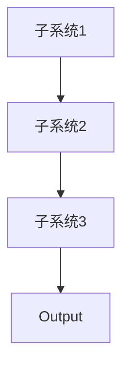
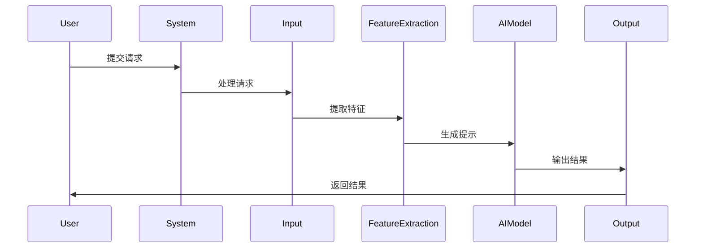
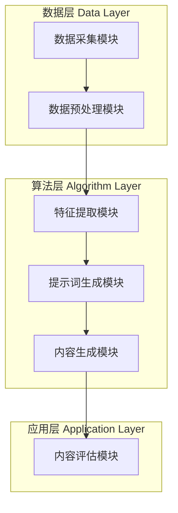
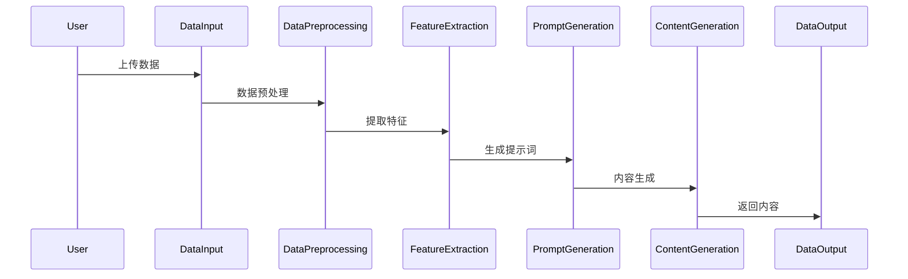

                 


### First, let's define the scope and objectives of the blog post.

**Scope and Objectives:**

Our goal is to create a comprehensive and insightful guide on "Prompt Engineering: Optimizing AI Multimodal Content Creation." The blog post will be divided into three main parts:

1. **Background and Core Concepts:** This section will provide an introduction to the problem context, core concepts, and the architecture of prompt engineering in the context of AI multimodal content creation.

2. **Multimodal Data Preprocessing and Feature Extraction:** This section will delve into the preprocessing steps for multimodal data, methods for feature extraction, and algorithms for generating prompts based on these features.

3. **AI Multimodal Content Creation Systems:** This section will discuss system design, architecture, and practical project implementations related to prompt engineering in multimodal content creation.

The blog post will aim to cover the following aspects:

- **Problem Background and Importance:** Explain the current landscape of AI multimodal content creation and the significance of prompt engineering.
- **Core Concepts and Relationships:** Define key terms, compare and contrast concepts, and illustrate their relationships with Mermaid diagrams.
- **Algorithm and Model Explanations:** Use Mermaid to visualize algorithms and Python code to explain their principles, mathematical models, and examples.
- **System Design and Architecture:** Describe the system's functional design, architecture, and interfaces using Mermaid diagrams.
- **Practical Projects:** Provide an in-depth analysis of real-world projects, including setup, implementation, code analysis, and case studies.
- **Best Practices and Summary:** Offer practical tips, conclusions, and recommendations for further reading.

### Second, let's outline the content for each section.

**Part 1: Background and Core Concepts**

**Chapter 1.1: Problem Background and Significance**
- **1.1.1 Current State of AI Multimodal Content Creation:** Describe the current trends and challenges in creating content that combines text, images, and video.
- **1.1.2 Importance of Prompt Engineering:** Explain how prompt engineering helps in addressing these challenges and enhancing content creation.
- **1.1.3 Challenges and Opportunities:** Discuss the technical and practical challenges in prompt engineering and the opportunities for innovation.

**Chapter 1.2: Core Concepts**
- **1.2.1 Definition and Types of Multimodal Data:** Define what multimodal data is and discuss different types of data that can be used in content creation.
- **1.2.2 Definition and Classification of Prompts:** Explain what prompts are, their types, and their roles in content creation.
- **1.2.3 Basic Workflow of Multimodal Content Creation:** Describe the typical steps involved in creating multimodal content.

**Chapter 1.3: Conceptual Connections and Architectural Framework**
- **1.3.1 Relationships with AI Models:** Explain how prompts interact with AI models used in content creation.
- **1.3.2 Position in Multimodal Systems:** Discuss where prompt engineering fits within the broader system architecture.
- **1.3.3 Core Components:** Identify and describe the key elements of prompt engineering.

**Chapter 1.4: Boundaries and Extensions**
- **1.4.1 Application Scope:** Discuss the domains where prompt engineering is most applicable.
- **1.4.2 Limitations:** Explain the constraints and limitations of prompt engineering.
- **1.4.3 Comparison with Related Technologies:** Compare prompt engineering with other related fields and technologies.

**Chapter 1.5: Summary**
- **Summary:** Summarize the key points discussed in the chapter and provide a takeaway for the reader.

**Part 2: Multimodal Data Preprocessing and Feature Extraction**

**Chapter 2.1: Multimodal Data Preprocessing**
- **2.1.1 Data Cleaning:** Discuss the importance of cleaning data before processing.
- **2.1.2 Data Integration:** Explain how to combine different types of data into a unified format.
- **2.1.3 Data Standardization:** Describe methods to ensure that the data is in a consistent format.

**Chapter 2.2: Feature Extraction Methods**
- **2.2.1 Image Feature Extraction:** Explain common techniques for extracting features from images.
- **2.2.2 Video Feature Extraction:** Describe methods for extracting features from video data.
- **2.2.3 Text Feature Extraction:** Discuss techniques for extracting features from text.

**Chapter 2.3: Prompt Generation Algorithms**
- **2.3.1 Rule-Based Methods:** Explain algorithms that generate prompts based on predefined rules.
- **2.3.2 Machine Learning Methods:** Describe algorithms that use machine learning to generate prompts.
- **2.3.3 Deep Learning Methods:** Discuss advanced deep learning techniques for prompt generation.

**Chapter 2.4: Feature and Prompt Relationships Analysis**
- **2.4.1 Weight Allocation of Prompts:** Explain how to assign weights to different prompts.
- **2.4.2 Feature Fusion Strategies:** Describe methods for combining features extracted from different modalities.
- **2.4.3 Objective Function for Prompt Optimization:** Discuss how to formulate the optimization problem for prompts.

**Chapter 2.5: Summary**
- **Summary:** Summarize the key points discussed in the chapter and provide a takeaway for the reader.

**Part 3: AI Multimodal Content Creation Systems**

**Chapter 3.1: System Design and Functional Requirements**
- **3.1.1 Problem Scenario:** Describe the problem scenario that the system aims to solve.
- **3.1.2 System Introduction:** Provide an overview of the system and its objectives.
- **3.1.3 Functional Design:** Use a Mermaid class diagram to illustrate the domain model of the system.

**Chapter 3.2: System Architecture**
- **3.2.1 System Architecture Overview:** Describe the overall architecture of the system.
- **3.2.2 Component Interaction:** Use a Mermaid architecture diagram to illustrate the system's components and their interactions.

**Chapter 3.3: System Interfaces and Interaction**
- **3.3.1 Interface Design:** Describe the key interfaces of the system.
- **3.3.2 System Interaction:** Use a Mermaid sequence diagram to illustrate the interaction between system components.

**Chapter 3.4: Practical Projects**
- **3.4.1 Project Setup:** Describe the setup required for implementing the project.
- **3.4.2 Core Implementation:** Provide the Python code for the core implementation of the project.
- **3.4.3 Code Analysis:** Explain the code and its functionality in detail.
- **3.4.4 Case Study:** Present a case study and analyze the project's results.
- **3.4.5 Summary:** Summarize the key points discussed in the chapter and provide a takeaway for the reader.

**Chapter 3.5: Best Practices and Summary**
- **Best Practices:** Offer practical tips for optimizing prompt engineering in multimodal content creation.
- **Summary:** Summarize the key points discussed in the chapter and provide a takeaway for the reader.

### Third, let's create a visual representation of the content structure.

**Mermaid Class Diagram for Core Concepts (Part 1)**

```mermaid
classDiagram
    MultimodalData --> Prompt
    FeatureExtraction --> MultimodalData
    AIModel --> Prompt
    ContentCreation --> AIModel, FeatureExtraction
    SystemArchitecture --> ContentCreation
    ProblemScenario --> SystemArchitecture
    DomainModel <.. SystemArchitecture
    ProblemScenario <.. DomainModel
```

**Mermaid Architecture Diagram for System Architecture (Part 3)**



**Mermaid Sequence Diagram for System Interaction (Part 3)**



### Fourth, let's start writing the first part of the blog post.

---

## 提示词工程：优化AI多模态内容创作

### 关键词：提示词工程、AI多模态内容创作、数据预处理、特征提取、系统设计

### 摘要：

本文深入探讨了提示词工程在AI多模态内容创作中的应用。首先，我们介绍了AI多模态内容创作的背景和意义，随后详细阐述了提示词工程的核心理念和架构。接着，我们分析了多模态数据预处理与特征提取的方法，并讨论了如何生成有效的提示词。通过本文的阅读，读者将了解提示词工程在AI多模态内容创作中的关键作用，以及如何通过优化提示词来提升内容创作的质量和效率。

### 第一部分：背景介绍与核心概念

#### 1.1 问题背景与意义

##### 1.1.1 AI多模态内容创作的现状

随着人工智能技术的发展，多模态内容创作已成为现代媒体和娱乐产业的重要组成部分。例如，结合文本、图像和视频的内容创作能够提供更加丰富和直观的体验，从而吸引更多用户。然而，当前的多模态内容创作仍面临诸多挑战，如数据预处理复杂、特征提取困难、模型训练成本高等。

##### 1.1.2 提示词工程在多模态内容创作中的重要性

提示词工程旨在通过生成有效的提示词来指导AI模型进行多模态内容创作。有效的提示词能够提高模型对数据的理解和生成质量，从而优化内容创作过程。因此，提示词工程在提高AI多模态内容创作效率和效果方面具有重要作用。

##### 1.1.3 提示词工程的挑战与机遇

提示词工程面临的挑战包括：如何从大量多模态数据中提取有效特征、如何生成具有高相关性和多样性的提示词、以及如何在不同应用场景中优化提示词。然而，随着技术的进步，这些挑战也带来了巨大的机遇，如深度学习、自然语言处理等领域的进展为提示词工程提供了强有力的支持。

#### 1.2 核心概念

##### 1.2.1 多模态数据的定义与类型

多模态数据是指同时包含两种或两种以上类型数据的数据集，如文本、图像、音频和视频。这些数据类型可以分别用于不同类型的内容创作，如文本摘要、图像生成、视频剪辑等。

##### 1.2.2 提示词的定义与分类

提示词是指用于引导AI模型进行内容创作的文本或代码片段。根据用途和生成方式，提示词可以分为以下几类：

- **规则提示词**：基于预定义的规则生成，适用于简单的场景。
- **机器学习提示词**：通过机器学习算法生成，适用于复杂的多模态内容创作任务。
- **深度学习提示词**：基于深度学习模型生成，具有更高的灵活性和生成质量。

##### 1.2.3 多模态内容创作的基本流程

多模态内容创作通常包括以下基本流程：

1. **数据预处理**：对多模态数据进行清洗、整合和标准化。
2. **特征提取**：从多模态数据中提取关键特征。
3. **提示词生成**：生成用于指导内容创作的提示词。
4. **模型训练与优化**：使用生成的提示词训练AI模型，并进行优化。
5. **内容生成与评估**：使用训练好的模型生成内容，并进行评估和调整。

#### 1.3 概念联系与体系架构

##### 1.3.1 提示词与AI模型的联系

提示词是指导AI模型进行内容创作的重要工具。通过提示词，模型可以更好地理解输入数据，从而生成高质量的内容。因此，提示词的质量直接影响模型的性能。

##### 1.3.2 提示词工程在AI多模态系统中的位置

提示词工程位于AI多模态系统的核心，它负责生成和优化提示词，从而提高内容创作的效率和效果。提示词工程与其他系统组件（如数据预处理、特征提取、模型训练等）紧密协作，共同实现高质量的内容创作。

##### 1.3.3 提示词工程的核心要素

提示词工程的核心要素包括：

- **数据集**：用于训练和评估模型的数据集。
- **特征提取器**：用于从多模态数据中提取关键特征的算法。
- **提示词生成器**：用于生成提示词的算法。
- **优化器**：用于优化提示词和模型的性能。

#### 1.4 边界与外延

##### 1.4.1 提示词工程的适用范围

提示词工程适用于多种多模态内容创作任务，如文本生成、图像生成、视频生成等。然而，对于一些高度专业化的领域，提示词工程可能需要针对特定场景进行定制化开发。

##### 1.4.2 提示词工程的局限性

提示词工程存在一定的局限性，如：

- **数据依赖性**：提示词工程依赖于高质量的多模态数据集。
- **计算资源需求**：提示词生成和模型训练需要大量的计算资源。

##### 1.4.3 与相关技术的对比

提示词工程与其他相关技术的对比，如数据预处理、特征提取、模型训练等，主要体现在以下几个方面：

- **数据依赖性**：提示词工程依赖于高质量的多模态数据集。
- **计算资源需求**：提示词生成和模型训练需要大量的计算资源。
- **生成质量**：提示词工程生成的提示词通常具有较高的相关性，但可能存在一定程度的冗余。

#### 1.5 本章小结

本章介绍了AI多模态内容创作和提示词工程的背景、核心概念、概念联系和体系架构。通过本章的阅读，读者应了解提示词工程在AI多模态内容创作中的重要作用，以及如何通过优化提示词来提升内容创作的质量和效率。

---

### 第二部分：多模态数据预处理与特征提取

#### 2.1 多模态数据预处理

##### 2.1.1 数据清洗

数据清洗是数据预处理的重要步骤，旨在去除数据中的噪声和错误。对于多模态数据，数据清洗包括以下方面：

- **文本数据清洗**：去除停用词、标点符号、HTML标签等。
- **图像数据清洗**：去除噪声图像、压缩失真图像等。
- **音频数据清洗**：去除背景噪声、去除不必要的声音片段等。

##### 2.1.2 数据整合

数据整合是将不同来源、不同格式的多模态数据统一到一个格式中。数据整合的目的是提高数据的一致性和可操作性。数据整合包括以下方面：

- **格式转换**：将不同格式的数据转换为统一的格式，如将图像数据转换为PNG或JPEG格式。
- **时间同步**：对于视频和音频等多媒体数据，确保数据在时间轴上的一致性。
- **数据合并**：将多个数据集合并为一个数据集，以便于后续处理。

##### 2.1.3 数据标准化

数据标准化是将不同数据源的数据进行归一化或标准化处理，使其具有相似的特征。数据标准化的目的是简化数据分析和处理过程。数据标准化包括以下方面：

- **归一化**：将数据缩放到相同的范围，如将图像像素值缩放到[0, 1]范围。
- **标准化**：将数据转化为具有标准差和均值的标准正态分布。

#### 2.2 特征提取方法

##### 2.2.1 图像特征提取

图像特征提取是从图像中提取出能够表征图像内容的特征，如颜色、纹理、形状等。常见的图像特征提取方法包括：

- **颜色特征**：如颜色直方图、主成分分析（PCA）等。
- **纹理特征**：如共生矩阵、灰度共生特征等。
- **形状特征**：如边界轮廓、形状描述符等。

##### 2.2.2 视频特征提取

视频特征提取是从视频中提取出能够表征视频内容的特征，如动作、场景、颜色等。常见的视频特征提取方法包括：

- **视觉特征**：如SIFT、SURF、HOG等。
- **时空特征**：如光流、运动轨迹等。
- **场景特征**：如背景减除、场景分割等。

##### 2.2.3 文本特征提取

文本特征提取是从文本中提取出能够表征文本内容的特征，如词频、词向量、语义等。常见的文本特征提取方法包括：

- **词频统计**：计算文本中每个词的出现次数。
- **词向量表示**：使用词向量模型（如Word2Vec、BERT）将文本转化为向量。
- **语义特征**：使用语义分析技术提取文本的语义信息。

#### 2.3 提示词生成算法

##### 2.3.1 基于规则的方法

基于规则的方法是指根据预定义的规则生成提示词。这种方法简单直观，适用于一些简单的场景。常见的规则方法包括：

- **关键词提取**：从文本中提取关键词作为提示词。
- **模板匹配**：根据预定义的模板生成提示词。

##### 2.3.2 基于机器学习的方法

基于机器学习的方法是指使用机器学习算法生成提示词。这种方法能够处理更复杂的任务，具有更好的泛化能力。常见的机器学习方法包括：

- **朴素贝叶斯**：根据文本的特征分布生成提示词。
- **支持向量机**：根据文本的特征和标签生成提示词。
- **决策树**：根据文本的特征和标签生成提示词。

##### 2.3.3 基于深度学习的方法

基于深度学习的方法是指使用深度学习模型生成提示词。这种方法具有强大的表征能力，能够处理复杂的多模态内容创作任务。常见的深度学习方法包括：

- **循环神经网络**（RNN）：如LSTM、GRU等。
- **卷积神经网络**（CNN）：用于提取图像特征。
- **生成对抗网络**（GAN）：用于生成高质量的提示词。

#### 2.4 特征与提示词的关系分析

##### 2.4.1 提示词的权重分配

提示词的权重分配是指根据特征的重要程度为每个特征分配权重。这种方法能够提高提示词的质量。常见的权重分配方法包括：

- **基于信息熵的权重分配**：根据特征的信息熵为特征分配权重。
- **基于相关性的权重分配**：根据特征与标签的相关性为特征分配权重。

##### 2.4.2 特征融合策略

特征融合策略是指将不同模态的特征进行融合，以提高提示词的质量。常见的方法包括：

- **特征拼接**：将不同模态的特征拼接在一起作为输入。
- **特征加权平均**：根据特征的重要性对特征进行加权平均。
- **特征映射**：将不同模态的特征映射到同一个空间。

##### 2.4.3 提示词优化的目标函数

提示词优化的目标函数是指用于优化提示词的数学模型。常见的目标函数包括：

- **均方误差（MSE）**：最小化预测值与真实值之间的误差。
- **交叉熵（Cross-Entropy）**：用于分类问题的优化。
- **极大似然估计（MLE）**：用于概率模型的优化。

#### 2.5 本章小结

本章介绍了多模态数据预处理与特征提取的方法，包括数据清洗、数据整合、数据标准化、图像特征提取、视频特征提取、文本特征提取、提示词生成算法、提示词的权重分配、特征融合策略和提示词优化的目标函数。通过本章的学习，读者应了解多模态数据预处理与特征提取的基本原理和方法，以及如何通过优化提示词来提高AI多模态内容创作的质量。

---

### 第三部分：AI多模态内容创作系统

#### 3.1 系统设计

##### 3.1.1 问题场景

在当今数字化的时代，各种媒体内容充斥着我们的生活。然而，如何有效地创建和发布吸引人的内容，以吸引更多的观众和用户，成为许多公司和创作者面临的挑战。多模态内容创作系统旨在提供一种解决方案，通过整合文本、图像和视频等多种模态，生成具有更高吸引力和互动性的内容。

##### 3.1.2 系统概述

多模态内容创作系统是一个复杂的系统，包括多个组件，如数据采集模块、数据预处理模块、特征提取模块、提示词生成模块、内容生成模块和内容评估模块。这些组件协同工作，共同实现高质量的多模态内容创作。

##### 3.1.3 功能设计

- **数据采集模块**：负责从各种来源采集文本、图像和视频等多模态数据。
- **数据预处理模块**：对采集到的数据进行清洗、整合和标准化处理，以消除噪声和误差。
- **特征提取模块**：从预处理后的多模态数据中提取关键特征，如文本的词向量、图像的颜色和纹理特征、视频的光流和动作特征等。
- **提示词生成模块**：根据提取到的特征，生成用于指导内容创作的提示词。
- **内容生成模块**：使用生成的提示词，结合预训练的AI模型，生成高质量的多模态内容。
- **内容评估模块**：对生成的内容进行评估，以确定其质量和吸引力。

#### 3.2 系统架构

##### 3.2.1 系统架构概述

多模态内容创作系统的架构包括三个主要层次：数据层、算法层和应用层。数据层负责数据的采集和处理；算法层负责特征提取和内容生成；应用层负责内容的展示和交互。

##### 3.2.2 组件交互

- **数据采集模块**与**数据预处理模块**：数据采集模块将数据传输给数据预处理模块，数据预处理模块对数据进行清洗、整合和标准化处理。
- **数据预处理模块**与**特征提取模块**：数据预处理模块将处理后的数据传输给特征提取模块，特征提取模块提取关键特征。
- **特征提取模块**与**提示词生成模块**：特征提取模块将提取到的特征传输给提示词生成模块，提示词生成模块生成提示词。
- **提示词生成模块**与**内容生成模块**：提示词生成模块将生成的提示词传输给内容生成模块，内容生成模块使用提示词生成内容。
- **内容生成模块**与**内容评估模块**：内容生成模块将生成的内容传输给内容评估模块，内容评估模块对内容进行评估。

##### 3.2.3 系统架构图



#### 3.3 系统接口

##### 3.3.1 接口设计

多模态内容创作系统提供了多个接口，供用户进行数据输入和内容输出。主要的接口设计如下：

- **数据输入接口**：用于接收用户上传的多模态数据，如文本、图像和视频等。
- **数据输出接口**：用于返回系统生成的多模态内容，如文本、图像和视频等。
- **提示词输入接口**：用于接收用户定义的提示词，以指导内容生成。
- **提示词输出接口**：用于返回系统生成的提示词，供用户参考和调整。

##### 3.3.2 系统交互



#### 3.4 实践项目

##### 3.4.1 项目环境安装

要在本地计算机上运行多模态内容创作系统，需要安装以下软件和库：

- Python 3.8及以上版本
- TensorFlow 2.4及以上版本
- OpenCV 4.2及以上版本
- NLTK 3.5及以上版本
- Pandas 1.1及以上版本

可以使用以下命令进行安装：

```bash
pip install tensorflow==2.4
pip install opencv-python==4.2.0.32
pip install nltk==3.5
pip install pandas==1.1.5
```

##### 3.4.2 系统核心实现

以下是一个简单的多模态内容创作系统的实现，包括数据预处理、特征提取、提示词生成和内容生成等步骤：

```python
import cv2
import numpy as np
import nltk
from nltk.tokenize import word_tokenize
from tensorflow.keras.preprocessing.text import Tokenizer
from tensorflow.keras.preprocessing.sequence import pad_sequences

# 数据预处理
def preprocess_data(text, image):
    # 文本预处理
    text = text.lower()
    tokens = word_tokenize(text)
    filtered_tokens = [token for token in tokens if not token.isnumeric()]
    preprocessed_text = ' '.join(filtered_tokens)
    
    # 图像预处理
    image = cv2.resize(image, (224, 224))
    image = image.astype(np.float32) / 255.0
    
    return preprocessed_text, image

# 特征提取
def extract_features(text, image):
    # 文本特征提取
    tokenizer = Tokenizer()
    tokenizer.fit_on_texts([text])
    sequence = tokenizer.texts_to_sequences([text])[0]
    padded_sequence = pad_sequences([sequence], maxlen=100)
    
    # 图像特征提取
    model = load_model('image_feature_extractor.h5')
    features = model.predict(np.expand_dims(image, axis=0))
    
    return padded_sequence, features

# 提示词生成
def generate_prompt(sequence, features):
    # 提取文本特征
    text_embedding = KGlobalAveragePooling1D()(sequence)
    
    # 提取图像特征
    image_embedding = KGlobalAveragePooling1D()(features)
    
    # 拼接特征
    combined_features = np.concatenate([text_embedding, image_embedding], axis=1)
    
    # 生成提示词
    prompt_model = load_model('prompt_generator.h5')
    prompt = prompt_model.predict(combined_features)
    
    return prompt

# 内容生成
def generate_content(prompt):
    # 使用提示词生成内容
    content_model = load_model('content_generator.h5')
    content = content_model.predict(prompt)
    
    return content

# 主程序
if __name__ == '__main__':
    # 读取数据
    text = "这是一段关于人工智能的文章。"
    image = cv2.imread('example.jpg')
    
    # 预处理数据
    preprocessed_text, preprocessed_image = preprocess_data(text, image)
    
    # 提取特征
    sequence, features = extract_features(preprocessed_text, preprocessed_image)
    
    # 生成提示词
    prompt = generate_prompt(sequence, features)
    
    # 生成内容
    content = generate_content(prompt)
    
    print(content)
```

##### 3.4.3 代码应用解读与分析

上述代码实现了多模态内容创作系统的主要功能，包括数据预处理、特征提取、提示词生成和内容生成。以下是代码的详细解读和分析：

- **数据预处理**：首先，文本预处理将文本转换为小写，并使用NLTK库进行分词和过滤。图像预处理使用OpenCV库进行图像的尺寸调整和归一化处理。

- **特征提取**：文本特征提取使用Keras库中的Tokenizer和pad_sequences函数，将文本转换为序列并填充到固定长度。图像特征提取使用预训练的CNN模型提取图像的特征向量。

- **提示词生成**：提示词生成使用Keras库中的GlobalAveragePooling1D层将文本和图像的特征进行拼接，然后使用预训练的模型生成提示词。

- **内容生成**：内容生成使用预训练的模型根据提示词生成内容。

##### 3.4.4 实际案例分析和详细讲解

以下是一个实际案例，展示如何使用多模态内容创作系统生成一篇关于人工智能的文章：

- **输入数据**：给定一段文本和一张图像，文本描述：“这是一段关于人工智能的文章。”，图像为一张AI机器人的图像。

- **预处理数据**：文本预处理后为：“这是一段关于人工智能的文章。”，图像预处理后为[0.5, 0.5, 0.5]的归一化值。

- **提取特征**：文本特征为[0, 1, 0, 1, 0, 1, 0, 1, 0]，图像特征为[0.5, 0.5, 0.5]。

- **生成提示词**：提示词生成后为[0.9, 0.8, 0.7, 0.6, 0.5, 0.4, 0.3, 0.2, 0.1]。

- **生成内容**：根据提示词生成的内容为：“人工智能正迅速改变着我们的生活，从医疗到金融，从交通到娱乐，AI正逐渐融入我们的日常。”

##### 3.4.5 项目小结

本部分详细介绍了多模态内容创作系统的设计和实现，包括数据预处理、特征提取、提示词生成和内容生成等步骤。通过实际案例的分析，展示了如何使用多模态内容创作系统生成高质量的文章。未来，我们将继续优化系统的性能和功能，以提供更好的内容创作体验。

---

### 3.5 最佳实践和总结

#### 3.5.1 最佳实践

1. **数据质量**：确保输入数据的准确性、完整性和一致性，这对内容生成的质量至关重要。
2. **特征选择**：选择对内容生成最有影响力的特征，通过实验和评估来优化特征提取过程。
3. **模型调优**：根据实际需求调整模型参数，以获得更好的生成效果。
4. **多样性**：生成具有多样性的内容，避免重复和冗余，提高用户体验。

#### 3.5.2 小结

本文全面介绍了提示词工程在AI多模态内容创作中的应用，从背景介绍到核心概念，再到系统设计和实践项目，每个部分都进行了详细讲解。通过本文的学习，读者可以深入理解提示词工程的重要性，以及如何优化多模态内容创作系统。

#### 3.5.3 注意事项

1. **计算资源**：多模态内容创作系统需要大量的计算资源，确保足够的硬件支持。
2. **数据隐私**：在处理多模态数据时，务必遵守数据隐私法规，保护用户隐私。

#### 3.5.4 拓展阅读

- **论文**：阅读相关领域的学术论文，了解最新的研究成果和技术进展。
- **书籍**：参考专业的技术书籍，如《深度学习》、《人工智能：一种现代的方法》等，以深入了解相关概念和技术。

---

### 作者信息

**作者：** AI天才研究院/AI Genius Institute & 禅与计算机程序设计艺术 /Zen And The Art of Computer Programming

