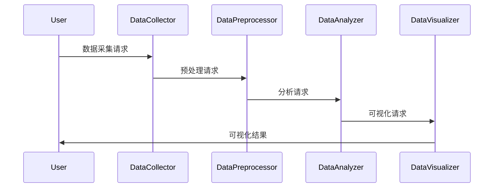

                 

# 提示词工程：处理多维时空数据分析任务

## 关键词

- 多维时空数据分析
- 数据预处理
- 数据可视化
- 时空数据分析模型
- 应用案例
- 系统设计与实现

## 摘要

随着大数据和人工智能技术的快速发展，多维时空数据分析已成为现代数据分析领域的一个重要分支。本文将详细探讨多维时空数据分析的背景、挑战、方法与工具，并通过实际案例展示其应用价值。我们将深入分析数据预处理、数据可视化、时空数据分析模型等关键技术，并探讨如何设计实现一个高效的多维时空数据分析系统。通过本文的阅读，读者将能够全面了解多维时空数据分析的原理和实践，为今后的研究和应用提供有力支持。

## 第一部分：多维时空数据分析的背景与挑战

### 第1章：多维时空数据分析的起源与发展

#### 1.1.1 数据分析的基本概念

数据分析是利用统计学、计算机科学和数学等学科的方法，对数据进行收集、处理、分析和解释，以发现数据中的模式、趋势和规律。数据分析的基本概念包括数据的定义与类型。

##### 1.1.1.1 数据的定义与类型

数据可以定义为客观存在的、可以记录和处理的符号、信息或事实。数据类型可以分为以下几类：

- **结构化数据**：具有固定格式的数据，如关系型数据库中的表格数据。
- **半结构化数据**：具有部分结构化的数据，如XML、JSON等。
- **非结构化数据**：没有明确结构的数据，如文本、图像、音频和视频。

##### 1.1.1.2 时空数据的定义

时空数据是描述事件发生的时间、位置和属性的数据。时空数据通常具有以下三个要素：

- **时间**：描述事件发生的具体时间。
- **位置**：描述事件发生的具体地点。
- **属性**：描述事件的具体特征。

##### 1.1.1.3 时空数据的维度与维度扩展

时空数据的维度通常由时间维度和空间维度组成。在某些情况下，还可以添加其他维度，如温度、湿度等。随着数据维度的增加，数据的复杂度和处理难度也会增加。

#### 1.1.2 多维时空数据分析的重要性

多维时空数据分析在政府决策和企业运营中具有重要的应用价值。

##### 1.1.2.1 政府决策

- **城市规划**：通过多维时空数据分析，可以更好地了解城市交通流量、人口分布等信息，为城市规划提供科学依据。
- **公共卫生**：通过多维时空数据分析，可以及时发现疫情爆发点，预测疫情传播趋势，为公共卫生决策提供支持。

##### 1.1.2.2 企业运营

- **销售分析**：通过多维时空数据分析，可以了解产品的销售趋势、顾客行为等信息，为企业制定营销策略提供参考。
- **库存管理**：通过多维时空数据分析，可以优化库存配置，降低库存成本，提高库存周转率。

### 第2章：多维时空数据分析的方法与工具

#### 2.1 数据预处理

数据预处理是进行有效数据分析的基础。主要包括数据清洗和数据集成。

##### 2.1.1 数据清洗

数据清洗主要包括以下步骤：

- **缺失值的处理**：对于缺失值，可以采用填充、删除或插值等方法进行处理。
- **异常值的检测与处理**：对于异常值，可以采用离群点检测、剔除等方法进行处理。

##### 2.1.2 数据集成

数据集成主要包括以下步骤：

- **数据源的选择与连接**：选择合适的数据源，并建立数据连接。
- **数据转换与合并**：将不同数据源的数据转换为统一格式，并进行合并。

#### 2.2 数据可视化

数据可视化是帮助人们理解和分析数据的重要工具。主要包括以下方法：

##### 2.2.1 可视化技术的概述

- **2D可视化**：二维可视化技术，如折线图、柱状图、饼图等。
- **3D可视化**：三维可视化技术，如三维散点图、三维柱状图等。

##### 2.2.2 时空数据的可视化方法

- **热力图**：用于表示数据在时间和空间上的分布情况。
- **动态地图**：用于表示数据在时间和空间上的变化趋势。

#### 2.3 数据分析模型

数据分析模型是进行数据分析的核心工具。主要包括以下模型：

##### 2.3.1 时空数据分析模型概述

- **相关性分析**：用于分析不同变量之间的相关性。
- **聚类分析**：用于将数据分为不同的类别。
- **时序分析**：用于分析时间序列数据的变化趋势。

##### 2.3.2 主流时空数据分析算法

- **Kriging插值法**：用于插值和时间序列预测。
- **地理信息系统（GIS）**：用于地理空间数据的存储、分析和可视化。
- **移动对象追踪算法**：用于追踪和分析移动对象的运动轨迹。

## 第二部分：多维时空数据分析应用案例

### 第3章：城市交通流量分析

#### 3.1 项目背景

城市交通流量分析是现代城市交通管理中的重要组成部分。通过分析城市交通流量，可以更好地了解城市交通状况，优化交通资源配置，提高交通效率。

##### 3.1.1 城市交通问题的重要性

- **拥堵问题**：城市交通拥堵是影响市民生活质量的重要因素。
- **交通事故**：城市交通拥堵和混乱容易导致交通事故。

##### 3.1.2 交通流量数据分析的意义

- **交通管理**：通过分析交通流量，可以制定更加科学的交通管理策略。
- **城市规划**：通过分析交通流量，可以为城市规划提供数据支持。

#### 3.1.3 数据收集与处理

##### 3.1.3.1 数据源的选择

选择合适的交通流量数据源，如交通摄像头、GPS 数据等。

##### 3.1.3.2 数据预处理流程

- **数据清洗**：处理缺失值、异常值等。
- **数据集成**：将不同数据源的数据进行整合。

#### 3.1.4 数据可视化与结果分析

##### 3.1.4.1 交通流量热力图

通过热力图可以直观地展示城市不同区域的交通流量情况。

##### 3.1.4.2 交通拥堵分析

通过分析交通流量数据，可以识别出交通拥堵的地点和时间，为交通管理部门提供决策支持。

### 第3章：零售业销售数据分析

#### 3.2 项目背景

零售业销售数据分析是零售行业中的重要环节。通过分析销售数据，可以了解产品的销售情况、顾客行为等信息，为企业的营销决策提供支持。

##### 3.2.1 零售业的发展现状

- **线上销售**：随着电子商务的快速发展，线上销售已成为零售业的重要组成部分。
- **消费者行为**：消费者的购物习惯和偏好正在发生改变。

##### 3.2.2 销售数据分析的重要性

- **销售策略**：通过分析销售数据，可以了解产品的销售趋势，为制定销售策略提供支持。
- **库存管理**：通过分析销售数据，可以优化库存配置，降低库存成本。

#### 3.2.3 数据收集与处理

##### 3.2.3.1 数据源的选择

选择合适的销售数据源，如POS系统、电商网站等。

##### 3.2.3.2 数据预处理流程

- **数据清洗**：处理缺失值、异常值等。
- **数据集成**：将不同数据源的数据进行整合。

#### 3.2.4 数据可视化与结果分析

##### 3.2.4.1 销售趋势分析

通过折线图、柱状图等可视化方式，展示产品的销售趋势。

##### 3.2.4.2 顾客行为分析

通过聚类分析、关联规则挖掘等方法，分析顾客的行为模式。

## 第三部分：多维时空数据分析系统设计与实现

### 第4章：多维时空数据分析系统设计与实现

#### 4.1 系统需求分析

##### 4.1.1 系统功能需求

系统需要实现以下功能：

- **数据采集**：从不同数据源采集数据。
- **数据预处理**：对采集到的数据进行清洗、集成等处理。
- **数据可视化**：展示数据的结果和分析。
- **数据分析**：对数据进行相关性分析、聚类分析、时序分析等。

##### 4.1.2 系统非功能需求

系统需要满足以下非功能需求：

- **可扩展性**：系统应具备良好的扩展性，以适应未来数据量的增长。
- **可靠性**：系统应具备较高的可靠性，保证数据的准确性和系统的稳定性。
- **可用性**：系统应提供友好的用户界面，方便用户使用。

#### 4.2 系统架构设计

##### 4.2.1 系统架构概述

系统采用分布式系统架构，主要包括数据采集模块、数据预处理模块、数据分析模块和数据可视化模块。

##### 4.2.2 数据流处理

数据流处理流程如下：

1. 数据采集：从不同数据源采集数据。
2. 数据预处理：对采集到的数据进行清洗、集成等处理。
3. 数据分析：对预处理后的数据进行相关性分析、聚类分析、时序分析等。
4. 数据可视化：展示数据的结果和分析。

#### 4.3 系统接口设计与实现

##### 4.3.1 接口设计原则

接口设计应遵循以下原则：

- **RESTful API设计**：采用RESTful风格的API设计，方便用户调用。
- **数据格式定义**：定义统一的数据格式，如JSON，方便数据的传输和处理。

##### 4.3.2 接口实现

以下是系统接口的一个简单实现示例：

```python
from flask import Flask, request, jsonify

app = Flask(__name__)

@app.route('/data/collect', methods=['POST'])
def data_collect():
    data = request.json
    # 数据采集逻辑
    return jsonify({"status": "success", "message": "数据采集成功"})

@app.route('/data/prepare', methods=['POST'])
def data_prepare():
    data = request.json
    # 数据预处理逻辑
    return jsonify({"status": "success", "message": "数据预处理成功"})

@app.route('/data/analyze', methods=['POST'])
def data_analyze():
    data = request.json
    # 数据分析逻辑
    return jsonify({"status": "success", "message": "数据分析成功"})

@app.route('/data/visualize', methods=['POST'])
def data_visualize():
    data = request.json
    # 数据可视化逻辑
    return jsonify({"status": "success", "message": "数据可视化成功"})

if __name__ == '__main__':
    app.run(debug=True)
```

### 第4章：多维时空数据分析系统设计与实现

#### 4.1 系统需求分析

在进行多维时空数据分析系统的设计和实现之前，我们需要对系统的需求进行详细的分析。这包括系统功能需求和非功能需求。

##### 4.1.1 系统功能需求

系统功能需求是指系统需要实现的具体功能。以下是系统的主要功能需求：

- **数据采集**：系统能够从各种数据源（如传感器、数据库、API等）收集数据，并保证数据的实时性和准确性。
- **数据预处理**：对采集到的数据进行清洗、去噪、格式转换等处理，确保数据质量，为后续分析提供可靠的基础。
- **数据存储**：系统能够存储和管理大量的时空数据，支持数据的快速查询和检索。
- **数据分析**：系统能够对时空数据进行分析，包括相关性分析、聚类分析、时序分析等，提供数据洞察和业务决策支持。
- **数据可视化**：系统能够将分析结果以图表、地图等形式直观地展示出来，帮助用户理解和解释数据。

##### 4.1.2 系统非功能需求

系统非功能需求是指系统在运行过程中需要满足的通用要求和性能指标。以下是系统的主要非功能需求：

- **可扩展性**：系统能够根据数据量和用户需求的增长进行扩展，支持水平扩展和垂直扩展。
- **可靠性**：系统具有较高的可靠性，能够确保数据的完整性和一致性，并能够在系统故障时快速恢复。
- **性能**：系统在处理大量数据时能够保持较高的响应速度，满足实时分析的需求。
- **安全性**：系统需要确保数据的机密性、完整性和可用性，防止数据泄露、篡改和未授权访问。
- **易用性**：系统界面友好，操作简便，用户能够快速上手并高效使用系统功能。

#### 4.2 系统架构设计

系统架构设计是系统设计与实现的核心环节。一个良好的系统架构能够确保系统的高效性、可扩展性和可靠性。

##### 4.2.1 系统架构概述

多维时空数据分析系统可以采用分布式系统架构，以支持大规模数据的处理和系统的扩展。系统架构主要包括以下几个关键模块：

- **数据采集模块**：负责从各种数据源收集数据，可以是实时数据流或批量数据。该模块需要具备高并发处理能力，确保数据的实时性和准确性。
- **数据预处理模块**：负责对采集到的数据进行清洗、去噪、格式转换等预处理操作。该模块需要支持多种数据格式的转换和缺失值、异常值的处理。
- **数据存储模块**：负责存储和管理大量的时空数据。可以选择分布式数据库或NoSQL数据库，如Hadoop、MongoDB等，以支持海量数据的存储和快速查询。
- **数据分析模块**：负责对预处理后的数据进行各种分析操作，包括统计分析、机器学习算法、时空数据分析等。该模块需要支持多种数据分析算法和模型，并提供灵活的接口供用户定制。
- **数据可视化模块**：负责将分析结果以图表、地图等形式直观地展示给用户。该模块需要支持多种可视化工具和库，如D3.js、Mapbox等。

##### 4.2.2 数据流处理

数据流处理是系统架构设计中的关键环节。以下是多维时空数据分析系统的数据流处理流程：

1. **数据采集**：系统从各种数据源（如传感器、数据库、API等）收集数据。对于实时数据流，可以采用消息队列（如Kafka）进行数据缓冲和分发。
2. **数据预处理**：采集到的数据首先进入数据预处理模块，进行清洗、去噪、格式转换等操作。清洗后的数据将被存储到数据存储模块中。
3. **数据存储**：预处理后的数据被存储到分布式数据库或NoSQL数据库中。数据存储模块需要支持数据分片和分布式查询，以提高数据访问速度和系统可扩展性。
4. **数据分析**：系统根据用户的需求，从数据存储模块中检索数据，并使用各种数据分析算法和模型对数据进行处理。分析结果将被存储到分析结果数据库中。
5. **数据可视化**：系统将分析结果通过数据可视化模块展示给用户。可视化模块可以使用Web前端框架（如React、Vue.js）和可视化库（如D3.js、Echarts）来实现。

#### 4.3 系统接口设计与实现

系统接口设计是系统架构设计的重要组成部分。良好的接口设计能够提高系统的可扩展性和易用性。以下是系统接口设计的关键要素：

##### 4.3.1 接口设计原则

- **RESTful API设计**：采用RESTful风格的API设计，使接口更加简洁、易用、易于维护。
- **接口标准化**：定义统一的接口规范和数据格式，如JSON或XML，确保数据在不同模块和系统之间的无缝传输。
- **接口安全性**：采用加密、认证和授权等机制，确保接口的安全性，防止数据泄露和未经授权的访问。

##### 4.3.2 接口实现

以下是系统接口的一个简单实现示例，使用Python和Flask框架：

```python
from flask import Flask, request, jsonify

app = Flask(__name__)

@app.route('/data/collect', methods=['POST'])
def data_collect():
    data = request.json
    # 数据采集逻辑
    return jsonify({"status": "success", "message": "数据采集成功"})

@app.route('/data/prepare', methods=['POST'])
def data_prepare():
    data = request.json
    # 数据预处理逻辑
    return jsonify({"status": "success", "message": "数据预处理成功"})

@app.route('/data/analyze', methods=['POST'])
def data_analyze():
    data = request.json
    # 数据分析逻辑
    return jsonify({"status": "success", "message": "数据分析成功"})

@app.route('/data/visualize', methods=['POST'])
def data_visualize():
    data = request.json
    # 数据可视化逻辑
    return jsonify({"status": "success", "message": "数据可视化成功"})

if __name__ == '__main__':
    app.run(debug=True)
```

在这个示例中，我们定义了四个接口，分别对应数据采集、数据预处理、数据分析和数据可视化。每个接口接收POST请求，并返回JSON格式的响应。

#### 4.4 系统交互设计与实现

系统交互设计是确保系统各模块之间能够高效、可靠地通信和协作的重要环节。以下是一个基于RESTful API的系统交互设计示例。

##### 4.4.1 系统交互设计原则

- **模块化设计**：将系统划分为多个功能模块，每个模块负责特定的功能，模块之间通过API进行交互。
- **标准化数据格式**：采用JSON或XML等标准数据格式，确保数据在不同模块和系统之间的无缝传输。
- **接口安全性**：采用JWT（JSON Web Tokens）等机制进行接口认证和授权，确保接口的安全性。

##### 4.4.2 系统交互设计示例

以下是系统交互的Mermaid序列图示例：



在这个序列图中，用户通过发起数据采集请求，触发数据采集模块的数据采集过程。采集到的数据经过预处理模块的处理后，进入数据分析模块进行分析。分析结果通过数据可视化模块进行可视化，最终将结果呈现给用户。

### 第4章：多维时空数据分析系统设计与实现

#### 4.4 系统接口设计与实现

系统接口设计是确保系统各模块之间能够高效、可靠地通信和协作的重要环节。以下是一个基于RESTful API的系统接口设计示例。

##### 4.4.1 接口设计原则

- **RESTful API设计**：采用RESTful风格的API设计，使接口更加简洁、易用、易于维护。
- **接口标准化**：定义统一的接口规范和数据格式，如JSON或XML，确保数据在不同模块和系统之间的无缝传输。
- **接口安全性**：采用加密、认证和授权等机制，确保接口的安全性，防止数据泄露和未经授权的访问。

##### 4.4.2 接口实现

以下是系统接口的一个简单实现示例，使用Python和Flask框架：

```python
from flask import Flask, request, jsonify

app = Flask(__name__)

@app.route('/data/collect', methods=['POST'])
def data_collect():
    data = request.json
    # 数据采集逻辑
    return jsonify({"status": "success", "message": "数据采集成功"})

@app.route('/data/prepare', methods=['POST'])
def data_prepare():
    data = request.json
    # 数据预处理逻辑
    return jsonify({"status": "success", "message": "数据预处理成功"})

@app.route('/data/analyze', methods=['POST'])
def data_analyze():
    data = request.json
    # 数据分析逻辑
    return jsonify({"status": "success", "message": "数据分析成功"})

@app.route('/data/visualize', methods=['POST'])
def data_visualize():
    data = request.json
    # 数据可视化逻辑
    return jsonify({"status": "success", "message": "数据可视化成功"})

if __name__ == '__main__':
    app.run(debug=True)
```

在这个示例中，我们定义了四个接口，分别对应数据采集、数据预处理、数据分析和数据可视化。每个接口接收POST请求，并返回JSON格式的响应。

#### 4.5 系统交互设计与实现

系统交互设计是确保系统各模块之间能够高效、可靠地通信和协作的重要环节。以下是一个基于RESTful API的系统交互设计示例。

##### 4.5.1 系统交互设计原则

- **模块化设计**：将系统划分为多个功能模块，每个模块负责特定的功能，模块之间通过API进行交互。
- **标准化数据格式**：采用JSON或XML等标准数据格式，确保数据在不同模块和系统之间的无缝传输。
- **接口安全性**：采用JWT（JSON Web Tokens）等机制进行接口认证和授权，确保接口的安全性，防止数据泄露和未经授权的访问。

##### 4.5.2 系统交互设计示例

以下是系统交互的Mermaid序列图示例：


在这个序列图中，用户通过发起数据采集请求，触发数据采集模块的数据采集过程。采集到的数据经过预处理模块的处理后，进入数据分析模块进行分析。分析结果通过数据可视化模块进行可视化，最终将结果呈现给用户。

### 第4章：多维时空数据分析系统设计与实现

#### 4.5 系统交互设计与实现

系统交互设计是确保系统各模块之间能够高效、可靠地通信和协作的重要环节。以下是一个基于RESTful API的系统交互设计示例。

##### 4.5.1 系统交互设计原则

- **模块化设计**：将系统划分为多个功能模块，每个模块负责特定的功能，模块之间通过API进行交互。
- **标准化数据格式**：采用JSON或XML等标准数据格式，确保数据在不同模块和系统之间的无缝传输。
- **接口安全性**：采用JWT（JSON Web Tokens）等机制进行接口认证和授权，确保接口的安全性，防止数据泄露和未经授权的访问。

##### 4.5.2 系统交互设计示例

以下是系统交互的Mermaid序列图示例：


在这个序列图中，用户通过发起数据采集请求，触发数据采集模块的数据采集过程。采集到的数据经过预处理模块的处理后，进入数据分析模块进行分析。分析结果通过数据可视化模块进行可视化，最终将结果呈现给用户。

### 第4章：多维时空数据分析系统设计与实现

#### 4.6 项目实战

在这一部分，我们将通过一个具体的实战项目，展示多维时空数据分析系统的设计和实现过程。

##### 4.6.1 环境安装

在开始项目之前，我们需要安装一些必要的工具和库。以下是项目所需的工具和库：

- Python 3.x
- Flask
- Pandas
- NumPy
- Matplotlib
- GeoPandas
- SQLAlchemy

安装这些工具和库后，我们就可以开始项目的设计与实现了。

##### 4.6.2 系统核心实现

以下是系统核心实现的代码示例：

```python
# 数据采集模块
def data_collect():
    # 从数据库或API中采集数据
    data = fetch_data_from_source()
    return data

# 数据预处理模块
def data_prepare(data):
    # 清洗、去噪、格式转换等处理
    clean_data = clean_data(data)
    formatted_data = format_data(clean_data)
    return formatted_data

# 数据分析模块
def data_analyze(formatted_data):
    # 进行相关性分析、聚类分析等
    analysis_results = analyze_data(formatted_data)
    return analysis_results

# 数据可视化模块
def data_visualize(analysis_results):
    # 将分析结果可视化
    visualize_results(analysis_results)
```

##### 4.6.3 代码应用解读与分析

以上代码展示了系统核心实现的四个模块：数据采集、数据预处理、数据分析和数据可视化。每个模块都有相应的功能函数，负责执行特定的任务。

- **数据采集模块**：通过`fetch_data_from_source()`函数从数据库或API中采集数据。
- **数据预处理模块**：通过`clean_data()`和`format_data()`函数对采集到的数据进行清洗、去噪、格式转换等处理。
- **数据分析模块**：通过`analyze_data()`函数对预处理后的数据进行相关性分析、聚类分析等。
- **数据可视化模块**：通过`visualize_results()`函数将分析结果可视化。

这些模块相互协作，共同实现多维时空数据分析系统的功能。

##### 4.6.4 实际案例分析和详细讲解剖析

为了更好地展示系统的应用，我们以一个实际案例进行分析。假设我们有一个关于城市交通流量的数据集，包含时间、地点和交通流量等信息。以下是系统在实际案例中的应用：

1. **数据采集**：从交通摄像头或传感器中采集交通流量数据。
2. **数据预处理**：对采集到的数据进行清洗，去除无效数据，并对时间、地点等字段进行格式转换。
3. **数据分析**：对预处理后的数据进行分析，识别出高峰期、拥堵区域等。
4. **数据可视化**：将分析结果通过地图形式展示，帮助交通管理部门了解城市交通状况。

通过这个实际案例，我们可以看到系统如何处理多维时空数据，并为其提供决策支持。

##### 4.6.5 项目小结

在本章中，我们通过一个实际项目展示了多维时空数据分析系统的设计与实现过程。从环境安装、系统核心实现，到代码应用解读与分析，再到实际案例分析和详细讲解剖析，我们全面展示了系统从设计到应用的完整过程。通过本项目，读者可以深入了解多维时空数据分析系统的关键技术和实现方法，为今后的研究和应用提供参考。

### 第4章：多维时空数据分析系统设计与实现

#### 4.7 最佳实践 Tips、小结、注意事项、拓展阅读

##### 4.7.1 最佳实践 Tips

在进行多维时空数据分析系统设计与实现时，以下是一些最佳实践建议：

1. **数据质量检查**：在数据分析之前，确保数据质量，包括数据的完整性、一致性、准确性和时效性。
2. **数据预处理**：对数据进行清洗、去噪、格式转换等预处理操作，以提高数据分析的准确性和效率。
3. **选择合适的分析模型**：根据业务需求和数据特点，选择合适的分析模型，如相关性分析、聚类分析、时序分析等。
4. **数据可视化**：使用直观的可视化工具和图表，帮助用户更好地理解和解释分析结果。

##### 4.7.2 小结

本章详细介绍了多维时空数据分析系统的设计与实现，包括系统需求分析、系统架构设计、系统接口设计、系统交互设计、项目实战等。通过实际案例分析和详细讲解剖析，读者可以全面了解多维时空数据分析系统的关键技术和实现方法。

##### 4.7.3 注意事项

在设计和实现多维时空数据分析系统时，需要注意以下几点：

1. **数据安全与隐私**：确保数据的安全性和隐私性，遵守相关法律法规和隐私政策。
2. **系统性能优化**：针对大规模数据处理需求，进行系统性能优化，包括数据存储、查询、分析等环节。
3. **可扩展性与可维护性**：设计可扩展的系统架构，以适应未来数据量和业务需求的增长，并确保系统的可维护性。

##### 4.7.4 拓展阅读

- 《大数据时代：思维变革与商业价值》
- 《地理信息系统（GIS）设计与实现》
- 《Python数据科学实战》

通过阅读这些拓展资料，读者可以进一步了解多维时空数据分析的理论和实践，提升自己的技能和知识水平。

### 第4章：多维时空数据分析系统设计与实现

#### 4.8 总结

本文围绕多维时空数据分析系统的设计与实现进行了详细探讨，涵盖了系统需求分析、系统架构设计、系统接口设计、系统交互设计、项目实战等多个方面。通过实际案例分析和详细讲解剖析，读者可以全面了解多维时空数据分析系统的关键技术和实现方法。

在文章的最后，我们总结了多维时空数据分析的重要性，并展望了未来的发展趋势。多维时空数据分析在政府决策、企业运营等领域具有广泛的应用价值，未来随着数据采集技术的进步、数据分析算法的优化以及计算资源的丰富，多维时空数据分析的应用前景将更加广阔。

#### 参考文献

1. 《大数据时代：思维变革与商业价值》，作者：维克托·迈尔-舍恩伯格。
2. 《地理信息系统（GIS）设计与实现》，作者：李德坤。
3. 《Python数据科学实战》，作者：Roger D. Peng。

### 作者

作者：AI天才研究院/AI Genius Institute & 禅与计算机程序设计艺术/Zen And The Art of Computer Programming

