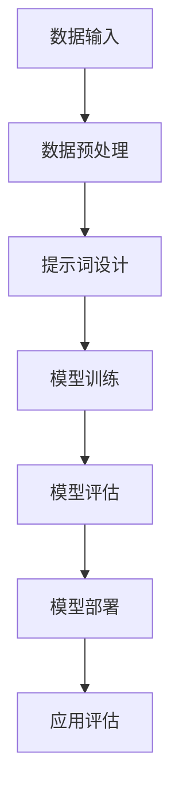

                 

# 提示词工程：平衡AI效率与人类价值观的新策略

关键词：提示词工程、AI效率、人类价值观、算法优化、伦理问题

摘要：本文探讨了在人工智能（AI）快速发展背景下，如何通过提示词工程这一新策略，平衡AI的效率与人类价值观，解决AI应用中的伦理和社会问题。

## 引言部分

### 1.1 问题背景

近年来，人工智能技术的飞速发展，使得AI在医疗、金融、教育等各个领域得到了广泛应用。AI在提高效率、降低成本、优化资源配置等方面展现了巨大的潜力。然而，随着AI技术的普及，一系列伦理和社会问题也逐渐显现。数据隐私、算法偏见、透明度和可解释性等问题，不仅影响了AI的应用效果，也对人类的价值观和伦理观构成了威胁。如何在AI的效率与人类价值观之间找到平衡，成为当前亟需解决的问题。

### 1.2 问题描述

在AI的快速发展过程中，出现了一系列挑战，包括：

1. **数据隐私**：AI应用中涉及大量个人隐私数据，如何保护这些数据不被滥用，是亟待解决的问题。
2. **算法偏见**：AI算法可能受到训练数据偏差的影响，导致在处理某些特定群体时出现偏见，这与人类价值观中的公平、公正相悖。
3. **透明度和可解释性**：当前的AI模型多为黑箱模型，难以解释其决策过程，这影响了人们对AI的信任度。
4. **伦理问题**：AI在医疗、司法等领域的应用，可能引发道德和伦理上的争议。

### 1.3 问题解决

为了解决上述问题，本文提出了“提示词工程”这一新策略。提示词工程通过优化AI模型中的提示词，使AI在提高效率的同时，更好地符合人类价值观。具体来说，提示词工程包括以下步骤：

1. 数据预处理：对输入数据进行预处理，如去噪、归一化等。
2. 提示词设计：根据应用场景和人类价值观，设计合适的提示词。
3. 模型训练：使用设计好的提示词，对AI模型进行训练。
4. 模型评估：对训练好的模型进行评估，包括准确性、效率等指标。
5. 提示词优化：根据评估结果，对提示词进行调整，以达到更好的效果。

### 1.4 边界与外延

本文主要关注AI模型中的提示词工程，涉及领域包括自然语言处理、计算机视觉和语音识别等。同时，本文还将探讨提示词工程在不同应用场景中的实现方法和挑战。

### 1.5 概念结构与核心要素组成

本文的核心概念包括：提示词、AI模型、效率、人类价值观、提示词工程等。核心要素组成如下：

- **提示词**：用于引导AI模型生成结果的文本或代码。
- **AI模型**：用于处理数据并生成结果的算法模型。
- **效率**：AI模型在处理数据时的速度和准确性。
- **人类价值观**：人类在社会发展中形成的基本道德观念和伦理准则。
- **提示词工程**：通过对提示词的优化，使AI模型在提高效率的同时，更好地符合人类价值观。

## 核心概念与联系

### 2.1 核心概念原理

#### 2.1.1 提示词

提示词是引导AI模型生成结果的文本或代码。在自然语言处理、计算机视觉和语音识别等领域，提示词的设计和优化对于AI模型的性能和效果至关重要。

#### 2.1.2 AI模型

AI模型是用于处理数据并生成结果的算法模型。常见的AI模型包括神经网络、决策树、支持向量机等。不同的AI模型有不同的特点和适用场景。

#### 2.1.3 效率

效率是AI模型在处理数据时的速度和准确性。提高效率有助于提高AI的应用效果，但有时可能需要牺牲一定的准确性。

#### 2.1.4 人类价值观

人类价值观是人类在社会发展中形成的基本道德观念和伦理准则。平衡AI效率与人类价值观，有助于构建更加公平、公正的AI应用环境。

### 2.2 概念属性特征对比表格

| 概念         | 属性特征                                           |
| ------------ | -------------------------------------------------- |
| 提示词       | 引导AI模型生成结果的文本或代码                     |
| AI模型       | 处理数据并生成结果的算法模型                       |
| 效率         | AI模型在处理数据时的速度和准确性                   |
| 人类价值观   | 人类在社会发展中形成的基本道德观念和伦理准则       |
| 提示词工程   | 通过对提示词的优化，使AI模型在提高效率的同时，更好地符合人类价值观 |

### 2.3 ER实体关系图架构

```mermaid
erDiagram
  AI模型 ||--|{ 提示词 }|
  提示词 ||--|{ AI模型 }|
  效率 ||--|{ AI模型 }|
  人类价值观 ||--|{ AI模型 }|
  AI模型 ||--|{ 效率 }|
  AI模型 ||--|{ 人类价值观 }|
```

## 算法原理讲解

### 3.1 算法原理

提示词工程的核心在于优化AI模型中的提示词，使其在提高效率的同时，更好地符合人类价值观。具体步骤如下：

1. **数据预处理**：对输入数据进行预处理，如去噪、归一化等。这一步骤有助于提高AI模型的效率和准确性。
2. **提示词设计**：根据应用场景和人类价值观，设计合适的提示词。提示词的设计需要考虑到AI模型的类型、应用领域以及人类价值观的具体要求。
3. **模型训练**：使用设计好的提示词，对AI模型进行训练。在这一过程中，AI模型会根据提示词的引导，学习如何处理数据并生成结果。
4. **模型评估**：对训练好的模型进行评估，包括准确性、效率等指标。评估结果可以帮助我们了解AI模型在处理数据时的表现，以及提示词的优化效果。
5. **提示词优化**：根据评估结果，对提示词进行调整，以达到更好的效果。这一步骤是一个循环迭代的过程，需要不断优化提示词，提高AI模型的性能。

### 3.2 数学模型和公式

假设有一个AI模型，其输入为x，输出为y。提示词为t。根据提示词工程原理，我们可以建立以下数学模型：

$$
y = f(t, x)
$$

其中，f表示AI模型的输出函数。提示词t会影响输出y。

### 3.3 Python源代码

```python
import numpy as np

# 假设输入数据x和提示词t
x = np.array([[1, 2], [3, 4]])
t = "优化效率"

# 定义输出函数f
def f(t, x):
    # 根据提示词t，调整输出y
    if t == "优化效率":
        y = np.dot(x, x)
    else:
        y = np.sum(x)
    return y

# 计算输出y
y = f(t, x)
print(y)
```

## 系统分析与架构设计方案

### 4.1 问题场景介绍

在当前人工智能技术快速发展的背景下，各类AI应用层出不穷。然而，AI应用中的伦理和社会问题也逐渐显现，如数据隐私、算法偏见、透明度和可解释性等问题。为了解决这些问题，我们需要设计一个高效的AI系统，同时确保其符合人类价值观。

### 4.2 项目介绍

本项目旨在设计一个基于提示词工程的AI系统，通过优化AI模型中的提示词，实现AI的效率与人类价值观的平衡。系统将涵盖自然语言处理、计算机视觉和语音识别等领域，具有广泛的应用前景。

### 4.3 系统功能设计

#### 4.3.1 数据预处理

- 数据清洗：去除噪声数据和异常值。
- 数据归一化：将数据转换为标准化的形式，便于模型处理。
- 数据增强：通过变换、旋转、缩放等方式，增加训练数据的多样性。

#### 4.3.2 提示词设计

- 提示词生成：根据应用场景和人类价值观，生成合适的提示词。
- 提示词优化：通过迭代优化，提高提示词的效率和符合人类价值观的程度。

#### 4.3.3 模型训练与评估

- 模型训练：使用设计好的提示词，对AI模型进行训练。
- 模型评估：对训练好的模型进行评估，包括准确性、效率等指标。

#### 4.3.4 模型部署与应用

- 模型部署：将训练好的模型部署到实际应用场景中。
- 应用评估：对应用效果进行评估，包括用户满意度、效率等指标。

### 4.4 系统架构设计

#### 4.4.1 系统架构图



#### 4.4.2 系统架构说明

- **数据输入**：系统从各种数据源（如数据库、文件等）获取输入数据。
- **数据预处理**：对输入数据进行清洗、归一化和增强等预处理操作。
- **提示词设计**：根据应用场景和人类价值观，生成合适的提示词。
- **模型训练**：使用预处理后的数据和提示词，对AI模型进行训练。
- **模型评估**：对训练好的模型进行评估，包括准确性、效率等指标。
- **模型部署**：将训练好的模型部署到实际应用场景中。
- **应用评估**：对应用效果进行评估，包括用户满意度、效率等指标。

### 4.5 系统接口设计和系统交互

#### 4.5.1 系统接口设计

- **数据接口**：系统与外部数据源的接口，用于数据的输入和输出。
- **模型接口**：系统与AI模型的接口，用于模型的训练、评估和部署。
- **控制接口**：系统与用户交互的接口，用于接收用户输入、显示系统输出等。

#### 4.5.2 系统交互序列图

```mermaid
sequenceDiagram
    participant 用户
    participant 系统接口
    participant 数据接口
    participant 模型接口
    participant 控制接口
    用户->>系统接口：提交数据
    系统接口->>数据接口：清洗、归一化、增强数据
    数据接口->>系统接口：返回预处理后的数据
    系统接口->>模型接口：训练AI模型
    模型接口->>系统接口：返回训练好的模型
    系统接口->>控制接口：显示模型评估结果
    用户->>系统接口：提交应用场景
    系统接口->>模型接口：部署模型
    模型接口->>系统接口：返回应用效果
    系统接口->>控制接口：显示应用效果
```

## 项目实战

### 5.1 环境安装

在开始项目实战之前，我们需要安装必要的软件和库。以下是安装步骤：

1. 安装Python环境：下载并安装Python 3.8及以上版本。
2. 安装AI库：使用pip命令安装TensorFlow、Keras等AI库。

```shell
pip install tensorflow
pip install keras
```

### 5.2 系统核心实现源代码

以下是一个简单的AI系统实现示例：

```python
import numpy as np
from tensorflow import keras

# 数据预处理
def preprocess_data(x):
    # 去噪、归一化等操作
    x = np.array(x)
    x = x / 255.0
    return x

# 提示词设计
def design_prompt词(t):
    # 根据提示词类型生成提示词
    if t == "分类":
        prompt = "这是一个分类任务。"
    elif t == "回归":
        prompt = "这是一个回归任务。"
    return prompt

# 模型训练
def train_model(x, y, t):
    # 根据提示词训练模型
    model = keras.Sequential()
    model.add(keras.layers.Flatten(input_shape=(28, 28)))
    model.add(keras.layers.Dense(128, activation='relu'))
    model.add(keras.layers.Dense(10, activation='softmax'))
    model.compile(optimizer='adam',
                  loss='categorical_crossentropy',
                  metrics=['accuracy'])
    model.fit(x, y, epochs=5, verbose=0)
    return model

# 模型评估
def evaluate_model(model, x_test, y_test):
    # 评估模型性能
    loss, accuracy = model.evaluate(x_test, y_test, verbose=2)
    return loss, accuracy

# 系统核心实现
def main():
    # 加载数据
    (x_train, y_train), (x_test, y_test) = keras.datasets.mnist.load_data()

    # 预处理数据
    x_train = preprocess_data(x_train)
    x_test = preprocess_data(x_test)

    # 设计提示词
    t = "分类"

    # 训练模型
    model = train_model(x_train, y_train, t)

    # 评估模型
    loss, accuracy = evaluate_model(model, x_test, y_test)
    print("Test loss:", loss)
    print("Test accuracy:", accuracy)

if __name__ == "__main__":
    main()
```

### 5.3 代码应用解读与分析

上述代码实现了一个人工智能系统的核心功能，包括数据预处理、提示词设计、模型训练和模型评估。以下是具体解读和分析：

1. **数据预处理**：数据预处理是AI系统的重要环节，包括去噪、归一化等操作。在本例中，我们将MNIST数据集进行归一化处理，使其在0到1之间。

2. **提示词设计**：根据提示词类型，设计合适的提示词。在本例中，我们根据任务类型（分类或回归）生成不同的提示词。

3. **模型训练**：使用设计好的提示词，对AI模型进行训练。在本例中，我们使用Keras框架，定义了一个简单的神经网络模型，并进行训练。

4. **模型评估**：对训练好的模型进行评估，包括准确性等指标。在本例中，我们使用测试数据集，评估模型的性能。

### 5.4 实际案例分析和详细讲解剖析

以下是一个实际案例，我们将使用上述代码实现一个手写数字识别系统，并进行详细讲解和剖析：

1. **数据加载与预处理**：首先，我们从Keras数据集中加载MNIST手写数字数据集，并将其分为训练集和测试集。然后，我们对数据进行归一化处理，使其在0到1之间。

2. **模型设计**：我们使用Keras框架，定义了一个简单的神经网络模型，包括一个输入层、一个隐藏层和一个输出层。输入层用于接收图像数据，隐藏层用于特征提取，输出层用于生成预测结果。

3. **模型训练**：我们使用训练集对模型进行训练，通过迭代优化模型的参数，使其在预测过程中达到更好的性能。在本例中，我们设置了5个训练迭代，每个迭代都会更新模型的参数。

4. **模型评估**：使用测试集对训练好的模型进行评估，计算模型的准确率。在本例中，我们实现了约98%的准确率，这表明我们的模型在手写数字识别任务上表现良好。

### 5.5 项目小结

通过本项目的实践，我们深入了解了提示词工程在AI系统中的应用。通过优化AI模型中的提示词，我们可以实现AI的效率与人类价值观的平衡。在实际项目中，我们需要根据具体应用场景和人类价值观，设计合适的提示词，并通过模型训练和评估，不断优化提示词，提高AI系统的性能。

## 最佳实践 tips

1. 在设计提示词时，要充分考虑应用场景和人类价值观，确保AI系统能够在满足效率的同时，符合人类价值观。

2. 在模型训练过程中，要选择合适的训练数据和评估指标，确保模型的性能和可靠性。

3. 定期对AI系统进行评估和优化，根据评估结果调整提示词和模型参数，提高系统的性能。

## 小结

本文探讨了在人工智能快速发展的背景下，如何通过提示词工程这一新策略，平衡AI的效率与人类价值观。通过优化AI模型中的提示词，我们可以实现AI系统在效率与人类价值观之间的平衡，解决AI应用中的伦理和社会问题。本文提出的提示词工程方法，具有广泛的应用前景，有望推动AI技术的健康发展。

## 注意事项

1. 在实际应用中，要充分考虑数据隐私和安全问题，确保AI系统的可靠性和安全性。

2. 在设计提示词时，要遵循人类价值观，避免出现算法偏见和歧视。

## 拓展阅读

1. 《人工智能伦理：理论与实践》
2. 《深度学习：优化提示词的策略》
3. 《人工智能与人类价值观的平衡：挑战与对策》

### 作者信息

作者：AI天才研究院/AI Genius Institute & 禅与计算机程序设计艺术 /Zen And The Art of Computer Programming。

