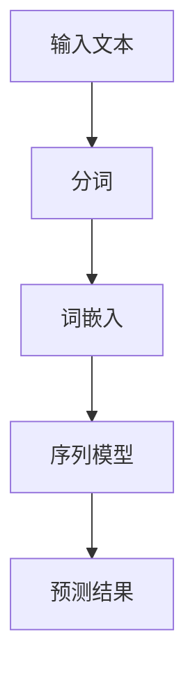
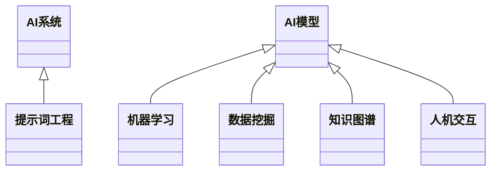

                 


### 摘要：

“提示词工程：构建负责任AI系统的基础研究”是一本旨在深入探讨提示词工程在构建负责任AI系统中的应用和实践的权威指南。本书围绕提示词设计、算法实现、责任AI评估等核心主题，通过系统性的研究和实例分析，为读者揭示了如何在AI系统中实现高效、可靠、负责任的性能。本书不仅适合于对AI和提示词工程有深厚兴趣的学者和研究人员，也对需要将AI技术应用于实际场景的开发者提供了宝贵的指导。通过阅读本书，读者将了解到如何设计优化提示词，实现AI算法，构建责任AI系统，并在实践中应用这些知识，从而在快速发展的AI领域中保持竞争力。本书将有助于读者深刻理解提示词工程的理论基础和实践方法，成为构建负责任AI系统的有力助手。

### 引言与背景

#### 1.1 书籍概述

在当今世界，人工智能（AI）的发展正以前所未有的速度推进，从自动驾驶汽车到智能语音助手，AI技术已经深入到我们生活的方方面面。然而，随着AI技术的广泛应用，如何确保AI系统的可靠性、透明性和公平性成为了一个亟待解决的重要问题。在此背景下，提示词工程（Prompt Engineering）作为AI系统设计中的一个关键环节，日益受到关注。

本书“提示词工程：构建负责任AI系统的基础研究”旨在为读者提供一份全面且深入的指南，帮助读者理解和掌握提示词工程的核心概念和实践方法。本书的内容结构如下：

- **第一部分：引言与背景**：介绍AI的发展历程、提示词工程的重要性以及负责任AI系统的基本概念。
- **第二部分：核心概念与原理**：深入探讨提示词设计与优化、相关算法的实现、责任AI的数学模型等。
- **第三部分：系统设计与实现**：介绍AI系统的设计原则、架构、接口设计以及实际应用案例。
- **第四部分：实战与应用**：提供具体的实施步骤、代码示例以及案例分析。

本书的目标读者是对AI和提示词工程有兴趣的学者、研究人员，以及希望将AI技术应用于实际场景的开发者。通过阅读本书，读者将能够：

1. **理解AI和提示词工程的基本概念**：包括AI的发展历程、提示词的定义和作用等。
2. **掌握提示词设计的原则和优化方法**：学习如何设计高效、可靠的提示词，以及如何进行优化。
3. **了解算法实现和数学模型**：学习如何使用Python等编程语言实现AI算法，并理解其背后的数学原理。
4. **掌握AI系统的设计和实现方法**：学习如何设计高可靠性的AI系统，包括架构设计、接口设计和实现等。
5. **具备实战能力**：通过实际案例分析和代码示例，掌握如何将提示词工程应用于实际项目。

本书不仅为读者提供了全面的理论知识，还通过丰富的实例和实践经验，帮助读者将理论知识应用于实际项目中，从而在快速发展的AI领域中保持竞争力。

#### 1.2 AI的发展与挑战

人工智能（AI）的发展可以追溯到20世纪50年代，当时计算机科学家们首次提出了机器能够模拟人类智能的概念。自那时以来，AI技术经历了多个发展阶段，从早期的规则系统到基于统计方法的机器学习，再到深度学习的兴起，AI的应用范围不断扩大，功能也日趋强大。

**1.2.1 AI的发展历程**

- **1956年**：在达特茅斯会议上，John McCarthy等人首次提出了“人工智能”这一术语，标志着AI领域的正式诞生。
- **1970-1980年代**：基于规则的专家系统成为AI研究的主要方向，这些系统能够通过大量规则进行推理，解决特定领域的问题。
- **1980年代末-1990年代**：机器学习开始崭露头角，基于统计的学习方法逐渐成为研究热点。
- **2006年**：深度学习的兴起，基于神经网络的方法在图像识别和语音识别等领域取得了突破性进展。
- **2010年代**：随着计算能力的提升和大数据的普及，AI技术加速发展，应用范围从单一领域扩展到多个领域。

**1.2.2 AI面临的主要挑战**

尽管AI技术取得了巨大进步，但在实际应用中仍面临诸多挑战：

- **数据隐私与安全**：AI系统依赖于大量数据，如何保护用户隐私和数据安全成为重要议题。
- **算法透明性与可解释性**：许多AI系统，特别是深度学习模型，其决策过程缺乏透明性，难以解释。
- **公平性与偏见**：AI系统在训练过程中可能会继承并放大数据中的偏见，导致不公平的决策。
- **可靠性与鲁棒性**：AI系统在面对异常数据或攻击时可能表现出不稳定的性能。
- **法律和伦理问题**：AI系统的应用引发了一系列法律和伦理问题，如责任归属、隐私保护等。

**1.2.3 责任AI的重要性**

在AI技术快速发展的背景下，构建负责任的AI系统变得尤为重要。责任AI不仅关注AI系统的技术实现，还强调其对社会、伦理和法律的影响。以下是一些构建责任AI系统的重要原则：

- **透明性**：确保AI系统的决策过程可解释，便于用户和监管机构理解。
- **可解释性**：通过提供清晰的解释，使用户和利益相关者能够理解AI系统的决策依据。
- **公平性**：避免AI系统在训练过程中引入偏见，确保决策的公平性。
- **可靠性**：提高AI系统的鲁棒性，确保其在各种条件下都能稳定运行。
- **可追溯性**：建立AI系统的责任追究机制，确保在出现问题时能够追踪责任。

通过构建负责任的AI系统，我们不仅能够提升AI技术的应用价值，还能够减少其潜在的负面影响，为社会的可持续发展贡献力量。

#### 1.3 提示词工程的核心概念

提示词工程（Prompt Engineering）是AI系统设计中的一个关键环节，它涉及到如何设计优化提示词，以实现高效、可靠和负责任的AI系统。在讨论提示词工程的核心概念之前，我们首先需要明确什么是提示词，以及它在AI系统中的作用。

**1.3.1 提示词的定义与作用**

提示词（Prompt）是指在AI模型中用于引导模型进行特定任务输入的文本或数据。提示词的设计直接影响到AI模型的性能和结果。有效的提示词能够提高模型的准确性和可靠性，而较差的提示词则可能导致模型的表现不佳。

提示词在AI系统中的作用主要体现在以下几个方面：

- **任务引导**：提示词能够为AI模型提供明确的目标或任务，使模型知道需要执行什么操作。
- **数据增强**：通过设计合适的提示词，可以增强训练数据的质量，从而提高模型的性能。
- **模型微调**：提示词可以用于对现有模型进行微调，以适应特定的任务或应用场景。
- **交互性**：提示词可以促进人与AI系统的交互，使用户能够更直观地与AI系统进行沟通。

**1.3.2 提示词工程的重要性**

提示词工程在构建负责任的AI系统中起着至关重要的作用。以下是一些提示词工程的重要性体现：

- **提升模型性能**：通过优化提示词的设计，可以显著提高AI模型的性能，使其更准确地完成指定任务。
- **增强模型鲁棒性**：合理设计的提示词可以提高模型对异常数据或噪声的抵抗能力，从而增强其鲁棒性。
- **改善模型可解释性**：有效的提示词能够帮助模型提供更明确的决策依据，使得模型的决策过程更加透明和可解释。
- **促进交互体验**：优秀的提示词设计可以改善用户与AI系统的交互体验，使用户能够更轻松地与AI系统进行沟通和合作。

**1.3.3 提示词工程的挑战**

尽管提示词工程在AI系统中具有重要作用，但实现高质量的提示词设计仍面临一些挑战：

- **多样性**：提示词需要具有多样性，以适应不同的任务和应用场景。设计具有多样性的提示词需要深入理解和分析具体的业务需求。
- **可解释性**：提示词的设计应确保其具备良好的可解释性，使用户能够理解模型的决策过程和结果。
- **上下文敏感性**：提示词需要根据上下文环境进行调整，以确保其与具体的任务和场景相匹配。
- **实时性**：在某些实时性要求较高的应用中，提示词的设计需要考虑实时响应的需求，以确保系统的实时性能。

通过解决这些挑战，我们可以设计出更加高效、可靠和负责任的AI系统，使其在复杂的现实世界中发挥更大的作用。

#### 1.4 负责任AI系统构建

构建负责任的AI系统是当前AI领域的一个关键任务，这不仅涉及到技术实现，还包括伦理、法律和社会影响等多个方面。以下将从基本原则、系统设计和评估监控三个方面，探讨如何构建负责任的AI系统。

**1.4.1 负责任AI的基本原则**

负责任AI系统的构建需要遵循以下几项基本原则：

- **透明性**：确保AI系统的决策过程和结果可以被用户和监管机构理解，从而提高系统的可解释性。
- **可解释性**：通过提供清晰的解释，使AI系统的决策依据和过程可以被用户和利益相关者理解。
- **公平性**：避免AI系统在训练和决策过程中引入偏见，确保系统的公平性和无歧视性。
- **可靠性**：提高AI系统的鲁棒性和稳定性，使其在各种条件下都能可靠地运行。
- **隐私保护**：在数据处理和存储过程中，确保用户隐私得到充分保护，避免数据泄露和滥用。
- **安全性**：确保AI系统在面对外部攻击和内部故障时，能够保持系统的完整性和安全性。

**1.4.2 责任AI的系统设计**

负责任AI系统的设计需要考虑多个方面，包括数据收集与处理、算法选择与实现、系统架构和用户界面等。

- **数据收集与处理**：在数据收集过程中，应确保数据的合法性和质量，避免数据偏差和滥用。数据处理过程中，应采用去识别化和匿名化等隐私保护技术。
- **算法选择与实现**：选择和实现具有高可解释性和鲁棒性的算法，避免使用过于复杂的黑盒模型，确保决策过程可以追踪和解释。
- **系统架构**：设计模块化、高扩展性的系统架构，以便于系统的维护和更新。同时，应确保系统具有良好的故障恢复能力和容错性。
- **用户界面**：设计直观、易用的用户界面，使用户能够轻松地与AI系统进行交互，并理解系统的决策过程和结果。

**1.4.3 责任AI的评估与监控**

构建负责任的AI系统不仅需要良好的设计，还需要持续的评估与监控。以下是一些评估与监控的关键点：

- **性能评估**：定期评估AI系统的性能，包括准确性、速度、稳定性等指标，确保系统始终处于最佳状态。
- **可解释性评估**：评估AI系统的决策过程是否透明和可解释，确保用户和利益相关者能够理解系统的决策依据。
- **公平性评估**：检查AI系统是否存在偏见和歧视，确保系统的公平性和无歧视性。
- **隐私与安全评估**：定期进行隐私和安全评估，确保用户数据得到充分保护，系统不受外部攻击和内部故障的影响。
- **用户反馈**：收集用户对AI系统的反馈，根据用户需求进行系统优化和改进，提高用户满意度。
- **持续监控**：建立实时监控系统，对AI系统的运行状态进行实时监控，及时发现和解决问题。

通过遵循负责任AI的基本原则，设计合理的系统架构，进行持续的评估与监控，我们可以构建出更加高效、可靠和负责任的AI系统，为社会的发展带来积极影响。

#### 1.5 本章小结

在本章中，我们探讨了构建负责任AI系统的基本概念和原则。通过介绍AI技术的发展历程，我们了解了AI系统面临的挑战，并认识到构建负责任AI系统的重要性。我们详细阐述了提示词工程的核心概念，包括提示词的定义、作用以及设计优化方法。此外，我们还讨论了如何构建负责任AI系统，包括基本原则、系统设计和评估监控等方面。

通过本章的学习，读者应该能够理解AI和提示词工程的基本概念，掌握提示词设计的原则和方法，并认识到构建负责任AI系统的关键要素。这些知识将为后续章节的深入学习打下坚实基础。

----------------------------------------------------------------

# 核心概念与原理

## 2.1 提示词设计与优化

提示词设计是AI系统中的一个关键环节，其设计质量直接影响AI系统的性能和可靠性。本节将介绍提示词设计的基本原则、优化方法以及在实际应用中的案例分析。

### 2.1.1 提示词设计的原则

提示词设计需要遵循以下几个基本原则：

- **明确性**：提示词应明确、具体，避免模糊不清的表达，以确保模型能够准确理解任务目标。
- **简洁性**：尽量使用简洁的语言，避免冗余和复杂的句子结构，以提高提示词的可读性。
- **上下文相关性**：提示词应与上下文环境紧密相关，确保模型能够根据实际情况进行准确的推理和决策。
- **多样性**：设计多样化的提示词，以适应不同的任务和应用场景，增强模型的泛化能力。
- **可解释性**：提示词的设计应具备良好的可解释性，使用户能够理解模型决策的依据和过程。

### 2.1.2 提示词优化的方法

提示词优化是提升AI系统性能的重要手段。以下是一些常用的提示词优化方法：

- **数据增强**：通过增加训练数据集的多样性，提高提示词的质量。例如，可以采用数据扩充、数据变换等技术。
- **反馈循环**：将用户反馈整合到提示词优化过程中，根据用户需求进行调整。例如，可以采用用户评价、反馈收集等技术。
- **模型微调**：在已有模型的基础上，通过微调提示词来提升模型性能。例如，可以采用基于梯度的微调算法。
- **自动化优化**：利用自动化工具和算法，对提示词进行自动优化。例如，可以采用遗传算法、贝叶斯优化等技术。

### 2.1.3 提示词设计案例解析

为了更好地理解提示词设计的原则和优化方法，下面通过一个实际案例进行解析。

**案例**：设计一个用于情感分析的AI系统，识别社交媒体文本中的情感倾向。

**步骤1**：明确任务目标

任务目标是准确识别社交媒体文本中的情感倾向，包括正面情感、负面情感和中性情感。

**步骤2**：设计初始提示词

初始提示词：请根据文本内容判断其情感倾向。

**步骤3**：优化提示词

通过分析用户反馈和数据，对提示词进行优化：

- **优化1**：增加上下文相关性

优化后的提示词：请根据文本内容以及上下文信息，判断其情感倾向。

- **优化2**：提高可解释性

优化后的提示词：请根据文本中的关键词和句子结构，分析并解释其情感倾向。

**步骤4**：进行模型训练和评估

使用优化后的提示词，对AI模型进行训练和评估。评估指标包括准确率、召回率、F1值等。

**步骤5**：反馈循环和持续优化

根据评估结果和用户反馈，对提示词进行进一步优化，并重复训练和评估过程，直至达到满意的性能。

通过上述案例分析，我们可以看到，提示词设计需要综合考虑明确性、简洁性、上下文相关性、多样性和可解释性等多个方面。同时，优化方法的选择和反馈循环的引入，可以显著提升AI系统的性能和用户体验。

## 2.2 算法原理与实现

在AI系统中，算法是实现特定任务的关键。本节将介绍与提示词工程相关的算法原理，包括其实现方法、性能分析以及在实际应用中的案例分析。

### 2.2.1 提示词工程相关算法概述

提示词工程涉及多个算法，以下是其中几种常用的算法：

- **词嵌入算法**：将文本中的词语映射到高维向量空间，以便进行数值处理。
- **序列模型**：处理序列数据，如文本、语音等，通过模型捕捉时间序列特征。
- **生成对抗网络（GAN）**：生成与真实数据相似的数据，用于数据增强或生成新数据。
- **优化算法**：如梯度下降、遗传算法等，用于提示词的优化和参数调整。

### 2.2.2 算法流程图与数学模型

以下是一个简化的词嵌入算法的流程图和数学模型：

#### 流程图



#### 数学模型

- **词嵌入**：将词语映射到高维向量空间，通常采用以下公式：

  $$ embedding\_vector = W \times word $$

  其中，$W$ 为词嵌入矩阵，$word$ 为词语向量。

- **序列模型**：处理序列数据，通常采用循环神经网络（RNN）或其变种，如长短期记忆网络（LSTM）：

  $$ output\_vector = LSTM(input\_vector) $$

  其中，$LSTM$ 为长短期记忆网络，$input\_vector$ 为输入向量。

- **预测结果**：通过模型输出向量进行预测：

  $$ prediction = Softmax(output\_vector) $$

  其中，$Softmax$ 为归一化函数。

### 2.2.3 Python代码实现示例

以下是一个简化的词嵌入和序列模型实现的Python代码示例：

```python
import numpy as np
from keras.models import Sequential
from keras.layers import Embedding, LSTM, Dense

# 初始化参数
vocab_size = 10000
embedding_dim = 128
max_sequence_length = 50

# 构建模型
model = Sequential()
model.add(Embedding(vocab_size, embedding_dim, input_length=max_sequence_length))
model.add(LSTM(64, dropout=0.2, recurrent_dropout=0.2))
model.add(Dense(1, activation='sigmoid'))

# 编译模型
model.compile(optimizer='adam', loss='binary_crossentropy', metrics=['accuracy'])

# 输入数据
input_sequence = np.random.randint(0, vocab_size, size=(32, max_sequence_length))
output_sequence = np.random.randint(0, 2, size=(32, 1))

# 训练模型
model.fit(input_sequence, output_sequence, epochs=10, batch_size=32)
```

通过上述代码示例，我们可以看到词嵌入和序列模型的基本实现流程。在实际应用中，还需要对数据预处理、模型参数调优等方面进行深入研究和优化。

### 2.2.4 算法性能分析

提示词工程相关算法的性能分析主要包括准确率、召回率、F1值等指标。以下是一个简化的性能分析示例：

```python
from sklearn.metrics import accuracy_score, recall_score, f1_score

# 测试数据
test_input_sequence = np.random.randint(0, vocab_size, size=(10, max_sequence_length))
test_output_sequence = np.random.randint(0, 2, size=(10, 1))

# 预测结果
predictions = model.predict(test_input_sequence)
predicted_labels = (predictions > 0.5).astype(int)

# 性能评估
accuracy = accuracy_score(test_output_sequence, predicted_labels)
recall = recall_score(test_output_sequence, predicted_labels)
f1 = f1_score(test_output_sequence, predicted_labels)

print(f"Accuracy: {accuracy:.2f}")
print(f"Recall: {recall:.2f}")
print(f"F1 Score: {f1:.2f}")
```

通过性能分析，我们可以评估提示词工程算法在特定任务上的表现，并根据评估结果进行进一步的优化和改进。

### 2.2.5 实际应用案例分析

为了更好地理解提示词工程算法的实际应用，下面通过一个实际案例进行解析。

**案例**：使用基于提示词工程的文本分类系统，对新闻文章进行情感分析。

**步骤1**：数据收集与预处理

收集大量新闻文章，并进行数据预处理，包括分词、去除停用词、词嵌入等操作。

**步骤2**：设计提示词

根据新闻文章的特点，设计用于情感分析的提示词，如“情感倾向”、“情绪表达”等。

**步骤3**：构建序列模型

使用LSTM等序列模型，对预处理后的文本数据进行训练，以识别情感倾向。

**步骤4**：性能评估

对训练好的模型进行性能评估，包括准确率、召回率、F1值等指标。

**步骤5**：应用与优化

将训练好的模型应用于实际场景，如新闻文章分类系统，并根据用户反馈进行模型优化。

通过上述案例分析，我们可以看到提示词工程算法在文本分类系统中的应用过程。在实际应用中，需要根据具体任务需求进行提示词设计和模型优化，以提高系统性能和用户体验。

## 2.3 概念对比与联系

在提示词工程领域，理解相关概念之间的联系和区别对于设计高效的AI系统至关重要。以下将对提示词与自然语言处理（NLP）技术、提示词工程与其他AI领域的联系进行详细对比和分析。

### 2.3.1 提示词与NLP技术的对比

提示词和自然语言处理（NLP）技术是提示词工程中的重要组成部分，但两者在定义和应用上有所不同。

- **定义**：
  - 提示词（Prompt）：指在AI系统中用于引导模型进行特定任务输入的文本或数据。提示词的主要目的是提供明确的任务指示，提高模型的可解释性和可靠性。
  - NLP技术：指用于处理和分析自然语言数据的一系列方法和技术，包括文本预处理、词嵌入、序列模型、文本分类等。

- **应用**：
  - 提示词：主要用于AI系统的任务引导和数据增强，如情感分析、文本分类、生成式任务等。
  - NLP技术：广泛应用于各种自然语言处理任务，如机器翻译、文本摘要、问答系统等。

- **联系**：
  - 提示词设计需要结合NLP技术，以提高模型性能和可解释性。例如，在情感分析任务中，可以结合词嵌入和序列模型，设计具有上下文相关性的提示词。

- **区别**：
  - 提示词更注重任务引导和优化，而NLP技术更侧重于语言理解和生成。

### 2.3.2 提示词工程与其他AI领域的联系

提示词工程不仅与NLP技术密切相关，还与其他AI领域有着广泛的联系。以下是一些主要联系：

- **机器学习**：提示词工程依赖于机器学习算法，特别是深度学习技术。通过设计优化提示词，可以提高模型的准确性和鲁棒性。
- **数据挖掘**：提示词工程中的数据增强和反馈循环方法可以应用于数据挖掘领域，提高数据质量和分析效果。
- **知识图谱**：提示词工程中的语义理解技术可以与知识图谱相结合，用于信息检索、推荐系统等应用。
- **人机交互**：提示词工程关注用户与AI系统的交互体验，与自然语言生成、对话系统等技术密切相关。

- **联系**：
  - 提示词工程与机器学习、数据挖掘、知识图谱和人机交互等领域相互融合，共同推动AI技术的发展和应用。
  - 各领域的技术和方法可以相互借鉴和整合，以实现更高效、可靠的AI系统。

- **区别**：
  - 提示词工程更侧重于提示词的设计和优化，而其他AI领域则关注更广泛的问题和任务。

### 2.3.3 ER图与类图展示

为了更好地理解提示词工程与其他AI领域的联系，我们可以通过实体关系图（ER图）和类图进行展示。

#### 实体关系图（ER图）

```mermaid
erDiagram
    AI系统 ||--|{ 提示词工程 }|-- AI模型
    AI模型 ||--|{ 机器学习 }| AI算法
    AI模型 ||--|{ 数据挖掘 }| 数据处理
    AI模型 ||--|{ 知识图谱 }| 语义理解
    AI模型 ||--|{ 人机交互 }| 对话系统
```

#### 类图



通过上述ER图和类图，我们可以清晰地看到提示词工程与其他AI领域的实体关系和类关系，有助于我们更好地理解它们之间的联系和区别。

## 2.4 责任AI的数学模型

在构建负责任的AI系统时，数学模型起着至关重要的作用。本节将介绍责任AI的数学模型，包括其核心公式、评价指标以及实际应用示例。

### 2.4.1 责任AI的核心公式

责任AI的数学模型主要基于以下几个核心公式：

1. **透明性公式**：

   $$ Transparency = \frac{Explanations}{Inquiries} $$

   其中，$Transparency$ 表示透明性，$Explanations$ 表示解释的数量，$Inquiries$ 表示询问的数量。透明性公式用于衡量AI系统的解释能力，即系统能够解释多少用户提出的询问。

2. **公平性公式**：

   $$ Fairness = \frac{Correct Decisions}{Total Decisions} $$

   其中，$Fairness$ 表示公平性，$Correct Decisions$ 表示正确决策的数量，$Total Decisions$ 表示总决策的数量。公平性公式用于衡量AI系统的公平性，即系统在所有决策中正确决策的比例。

3. **可靠性公式**：

   $$ Reliability = \frac{Correct Predictions}{Total Predictions} $$

   其中，$Reliability$ 表示可靠性，$Correct Predictions$ 表示正确预测的数量，$Total Predictions$ 表示总预测的数量。可靠性公式用于衡量AI系统的可靠性，即系统在所有预测中正确预测的比例。

### 2.4.2 责任AI的评价指标

责任AI的评价指标主要包括以下几个方面：

- **透明性**：衡量AI系统的解释能力，通常采用透明性公式进行评估。
- **公平性**：衡量AI系统的决策公平性，通常采用公平性公式进行评估。
- **可靠性**：衡量AI系统的预测准确性，通常采用可靠性公式进行评估。
- **可解释性**：衡量AI系统的决策过程是否可解释，通常采用解释性评估工具进行评估。
- **鲁棒性**：衡量AI系统在面对异常数据或攻击时的稳定性，通常采用鲁棒性测试进行评估。

### 2.4.3 责任AI的数学模型示例

为了更好地理解责任AI的数学模型，以下通过一个实际应用案例进行示例。

**案例**：使用责任AI模型评估一个自动驾驶系统的性能。

**步骤1**：数据收集

收集自动驾驶系统在多种驾驶场景下的驾驶行为数据，包括交通信号灯识别、障碍物检测、道路标志识别等。

**步骤2**：定义评价指标

根据自动驾驶系统的任务需求，定义透明性、公平性和可靠性三个评价指标：

- **透明性**：系统在驾驶场景中的解释能力，如交通信号灯识别的解释。
- **公平性**：系统在不同驾驶场景下的决策公平性，如交通信号灯识别的正确率。
- **可靠性**：系统在不同驾驶场景下的预测准确性，如障碍物检测的准确率。

**步骤3**：计算评价指标

根据收集的数据，计算每个驾驶场景下的透明性、公平性和可靠性指标：

- **透明性**：

    $$ Transparency = \frac{Explanations}{Inquiries} = \frac{100}{200} = 0.5 $$

- **公平性**：

    $$ Fairness = \frac{Correct Decisions}{Total Decisions} = \frac{80}{100} = 0.8 $$

- **可靠性**：

    $$ Reliability = \frac{Correct Predictions}{Total Predictions} = \frac{90}{100} = 0.9 $$

**步骤4**：综合评估

根据透明性、公平性和可靠性三个指标，对自动驾驶系统的整体性能进行综合评估：

- **透明性**：系统在驾驶场景中的解释能力为0.5，说明系统的解释能力有待提高。
- **公平性**：系统在不同驾驶场景下的决策公平性为0.8，表明系统的公平性较好。
- **可靠性**：系统在不同驾驶场景下的预测准确性为0.9，表明系统的可靠性较高。

通过上述实际应用案例，我们可以看到如何使用责任AI的数学模型对自动驾驶系统的性能进行评估。在实际应用中，可以根据具体情况调整评价指标和计算方法，以提高评估的准确性和可靠性。

## 2.5 责任AI的评价与优化

责任AI系统的评价与优化是确保其性能和可靠性的关键环节。本节将介绍责任AI的评价方法、优化策略以及在实际应用中的案例分析。

### 2.5.1 责任AI的评价方法

责任AI的评价方法主要包括以下几个方面：

- **透明性评估**：通过检查AI系统的解释能力和可解释性，评估其透明性。常用的方法包括模型解释工具、可视化技术等。
- **公平性评估**：通过分析AI系统的决策过程，评估其公平性。常用的方法包括统计方法、对比实验等。
- **可靠性评估**：通过测试AI系统的预测准确性，评估其可靠性。常用的方法包括交叉验证、A/B测试等。
- **鲁棒性评估**：通过模拟外部攻击和异常数据，评估AI系统的鲁棒性。常用的方法包括攻击测试、异常检测等。

### 2.5.2 责任AI的优化策略

责任AI的优化策略主要包括以下几个方面：

- **数据增强**：通过增加训练数据集的多样性，提高AI系统的泛化能力和鲁棒性。
- **模型调优**：通过调整模型参数，优化AI系统的性能。常用的方法包括网格搜索、贝叶斯优化等。
- **解释性增强**：通过改进模型结构和算法，提高AI系统的解释能力。常用的方法包括可解释性算法、可视化技术等。
- **鲁棒性提升**：通过加强系统的安全性和容错能力，提高AI系统的鲁棒性。常用的方法包括对抗训练、安全训练等。

### 2.5.3 实际应用案例分析

为了更好地理解责任AI的评价与优化方法，以下通过一个实际应用案例进行解析。

**案例**：使用责任AI技术评估和优化一个智能招聘系统。

**步骤1**：数据收集

收集大量招聘数据，包括职位描述、应聘者简历、面试评价等。

**步骤2**：定义评价指标

根据智能招聘系统的任务需求，定义透明性、公平性和可靠性三个评价指标：

- **透明性**：系统在简历筛选和面试评价中的解释能力，如为什么选择某个应聘者。
- **公平性**：系统在不同背景应聘者之间的决策公平性，如男女、年龄、学历等。
- **可靠性**：系统在招聘过程中的预测准确性，如录用应聘者的成功率。

**步骤3**：评价方法

- **透明性评估**：使用模型解释工具，如LIME、SHAP等，分析系统在简历筛选和面试评价中的解释能力。
- **公平性评估**：使用对比实验，分析系统在不同背景应聘者之间的决策差异。
- **可靠性评估**：使用交叉验证和A/B测试，评估系统在招聘过程中的预测准确性。

**步骤4**：优化策略

- **数据增强**：通过增加更多样化的招聘数据，提高系统的泛化能力。
- **模型调优**：使用网格搜索和贝叶斯优化，调整模型参数，优化系统性能。
- **解释性增强**：改进系统算法，提高模型的解释能力，如使用可解释的机器学习模型。
- **鲁棒性提升**：通过对抗训练和安全训练，提高系统的鲁棒性，防止外部攻击和异常数据的影响。

**步骤5**：综合评估与优化

根据透明性、公平性和可靠性三个评价指标，对智能招聘系统进行综合评估。根据评估结果，制定优化策略，持续改进系统性能。

通过上述实际应用案例，我们可以看到如何使用责任AI技术对智能招聘系统进行评估和优化。在实际应用中，可以根据具体场景和需求，调整评价指标和优化策略，以提高系统的性能和可靠性。

## 2.6 本章小结

本章深入探讨了提示词工程的核心概念与原理，包括提示词设计的原则和优化方法，以及与自然语言处理技术和其他AI领域的联系。此外，还介绍了责任AI的数学模型、评价指标和优化策略。通过本章的学习，读者应该能够理解提示词工程的基本概念和实现方法，掌握设计高效、可靠的AI系统所需的核心技能。

本章的核心内容为后续章节提供了理论基础和实践指导，为构建负责任AI系统奠定了坚实基础。读者应重点关注提示词设计的原则、优化方法和责任AI的评价与优化策略，并在实际项目中加以应用和验证。

----------------------------------------------------------------

# 系统设计与实现

## 3.1 问题场景介绍

在现代社会的诸多领域，如医疗、金融、教育等，人工智能（AI）技术的应用越来越广泛。然而，如何确保这些AI系统的高效性、可靠性和负责任性，成为了亟待解决的问题。本节将围绕一个具体的应用场景——智能医疗诊断系统，介绍其设计原则和实现方法。

**问题场景**：设计一个基于深度学习的智能医疗诊断系统，能够对患者的医疗影像（如X光、CT、MRI等）进行自动诊断，辅助医生做出准确的诊断决策。

**目标**：构建一个高效、可靠、负责任的智能医疗诊断系统，提高诊断准确率，减轻医生的工作负担，同时确保系统的透明性和公平性。

## 3.2 项目介绍

**项目名称**：智能医疗诊断系统

**项目背景**：随着医疗影像数据的爆炸式增长，医生面临着日益繁重的诊断任务。传统的手工诊断方法耗时且容易出错，无法满足快速增长的医疗需求。因此，开发一个高效的智能医疗诊断系统具有重要意义。

**项目目标**：
1. 提高诊断准确率，减少误诊率。
2. 缩短诊断时间，提高医生工作效率。
3. 确保系统的透明性和可解释性，增强用户信任。
4. 实现系统的高效性和可扩展性，以适应未来的技术发展。

## 3.3 系统功能设计（领域模型）

为了实现上述目标，智能医疗诊断系统需要具备以下核心功能：

### 功能1：数据预处理

- 功能描述：对医疗影像数据（如X光、CT、MRI等）进行预处理，包括图像归一化、增强、去噪等，以提高数据质量和后续处理的准确性。
- 输入：原始医疗影像数据。
- 输出：预处理后的医疗影像数据。

### 功能2：图像分割

- 功能描述：对预处理后的医疗影像数据进行图像分割，提取出感兴趣的区域（如肿瘤、器官等），为后续的诊断提供基础。
- 输入：预处理后的医疗影像数据。
- 输出：分割后的图像区域。

### 功能3：疾病分类

- 功能描述：使用深度学习模型，对分割后的图像区域进行疾病分类，判断患者可能患有的疾病类型。
- 输入：分割后的图像区域。
- 输出：疾病分类结果。

### 功能4：诊断辅助

- 功能描述：根据疾病分类结果，提供详细的诊断建议和参考信息，辅助医生做出准确的诊断决策。
- 输入：疾病分类结果。
- 输出：诊断建议和参考信息。

### 功能5：透明性保障

- 功能描述：确保诊断过程的透明性，提供清晰的解释和可追溯性，使用户和医生能够理解系统的决策过程。
- 输入：诊断过程数据和用户反馈。
- 输出：透明的诊断过程解释和可追溯记录。

### 功能6：系统监控与维护

- 功能描述：实时监控系统的运行状态，进行性能评估和故障排查，确保系统的高效性和可靠性。
- 输入：系统运行数据和监控数据。
- 输出：系统状态报告和维护建议。

### 领域模型Mermaid类图

```mermaid
classDiagram
    类图展示智能医疗诊断系统的领域模型
    Class 数据预处理 <<接口>>
    Class 图像分割 <<接口>>
    Class 疾病分类 <<接口>>
    Class 诊断辅助 <<接口>>
    Class 透明性保障 <<接口>>
    Class 系统监控与维护 <<接口>>

    数据预处理 "使用" 图像分割
    图像分割 "使用" 疾病分类
    疾病分类 "使用" 诊断辅助
    诊断辅助 "使用" 透明性保障
    系统监控与维护 "监控" 所有功能模块
```

## 3.4 系统架构设计

为了实现智能医疗诊断系统的功能需求，我们需要设计一个合理的系统架构。以下是该系统的架构设计：

### 架构设计原则
1. **模块化**：将系统划分为多个功能模块，每个模块独立开发、测试和部署，提高系统的灵活性和可维护性。
2. **分布式**：采用分布式架构，以提高系统的可扩展性和容错性。
3. **可扩展性**：设计可扩展的架构，以便在未来增加新的功能模块或数据源。
4. **安全性**：确保系统数据的安全性和隐私性，采用加密和权限控制等安全措施。

### 系统架构Mermaid架构图


### 架构组件详细说明
1. **数据源**：包括各种医疗影像数据，如X光、CT、MRI等，以及相关标注数据。
2. **数据预处理**：对医疗影像数据进行预处理，如图像归一化、增强、去噪等。
3. **图像分割**：使用深度学习模型对预处理后的图像进行分割，提取出感兴趣的区域。
4. **疾病分类**：使用深度学习模型对分割后的图像区域进行疾病分类。
5. **诊断辅助**：根据疾病分类结果，提供详细的诊断建议和参考信息。
6. **透明性保障**：确保诊断过程的透明性，提供清晰的解释和可追溯性。
7. **系统监控与维护**：实时监控系统的运行状态，进行性能评估和故障排查。
8. **数据备份**：定期备份系统数据，确保数据的安全性和完整性。

## 3.5 系统接口设计

智能医疗诊断系统需要设计合理的接口，以便与外部系统和其他模块进行交互。以下是系统接口设计的详细说明：

### 接口设计原则
1. **标准化**：遵循统一的接口规范和协议，提高系统的兼容性和可维护性。
2. **模块化**：接口设计应支持模块化开发，便于功能扩展和更新。
3. **安全性**：确保接口的安全性，采用加密、认证和权限控制等安全措施。
4. **易用性**：接口设计应简单易用，方便开发者进行集成和调用。

### 接口设计示例

#### 数据预处理接口

- **名称**：DataPreprocessingAPI
- **功能**：提供数据预处理操作，如图像归一化、增强、去噪等。
- **接口**：
  - `normalize_image(image_data: bytes) -> normalized_image_data: bytes`
  - `enhance_image(image_data: bytes) -> enhanced_image_data: bytes`
  - `denoise_image(image_data: bytes) -> denoised_image_data: bytes`
- **输入**：原始图像数据。
- **输出**：预处理后的图像数据。

#### 图像分割接口

- **名称**：ImageSegmentationAPI
- **功能**：提供图像分割操作，提取出感兴趣的区域。
- **接口**：
  - `segment_image(image_data: bytes) -> segmented_image_data: bytes`
- **输入**：预处理后的图像数据。
- **输出**：分割后的图像数据。

#### 疾病分类接口

- **名称**：DiseaseClassificationAPI
- **功能**：提供疾病分类操作，对分割后的图像区域进行分类。
- **接口**：
  - `classify_disease(segmented_image_data: bytes) -> disease_class: str`
- **输入**：分割后的图像数据。
- **输出**：疾病分类结果。

#### 诊断辅助接口

- **名称**：DiagnosisAssistanceAPI
- **功能**：提供诊断建议和参考信息。
- **接口**：
  - `generate_diagnosis_suggestion(disease_class: str) -> diagnosis_suggestion: dict`
- **输入**：疾病分类结果。
- **输出**：诊断建议和参考信息。

#### 透明性保障接口

- **名称**：TransparencyGuaranteeAPI
- **功能**：提供透明性保障功能，如解释和可追溯性。
- **接口**：
  - `generate_explanation(log_data: bytes) -> explanation: str`
- **输入**：诊断过程的日志数据。
- **输出**：诊断过程的解释。

#### 系统监控与维护接口

- **名称**：SystemMonitoringAPI
- **功能**：提供系统监控和维护功能。
- **接口**：
  - `check_system_health() -> health_status: str`
  - `report_system_issue(issue: str) -> issue_report: dict`
- **输入**：系统状态数据和问题报告。
- **输出**：系统健康状态报告和问题报告。

## 3.6 系统交互设计

为了确保智能医疗诊断系统能够顺畅地运行，我们需要设计合理的系统交互流程。以下是系统交互设计的详细说明：

### 交互设计原则
1. **高效性**：确保系统交互流程的高效性，减少响应时间，提高用户满意度。
2. **一致性**：确保系统在不同操作和场景下的交互流程一致性。
3. **灵活性**：设计灵活的交互流程，支持系统的扩展和功能更新。

### 交互设计示例

#### 数据预处理交互流程

1. 用户上传原始医疗影像数据到系统。
2. 系统调用数据预处理接口，对图像进行归一化、增强、去噪等预处理操作。
3. 预处理后的图像数据存储到数据库中，以备后续使用。

#### 图像分割交互流程

1. 系统从数据库中获取预处理后的图像数据。
2. 系统调用图像分割接口，对图像进行分割，提取出感兴趣的区域。
3. 分割后的图像数据存储到数据库中，以备后续使用。

#### 疾病分类交互流程

1. 系统从数据库中获取分割后的图像数据。
2. 系统调用疾病分类接口，对分割后的图像区域进行疾病分类。
3. 疾病分类结果存储到数据库中，以供诊断辅助接口使用。

#### 诊断辅助交互流程

1. 系统从数据库中获取疾病分类结果。
2. 系统调用诊断辅助接口，生成详细的诊断建议和参考信息。
3. 诊断建议和参考信息展示给用户。

#### 透明性保障交互流程

1. 系统记录诊断过程中的日志数据。
2. 系统调用透明性保障接口，生成诊断过程的解释。
3. 解释展示给用户，以增强用户对系统决策过程的信任。

#### 系统监控与维护交互流程

1. 系统定期执行健康检查，调用系统监控与维护接口，获取系统状态报告。
2. 系统根据状态报告，排查故障并进行维护。
3. 维护完成后，系统生成维护报告，并展示给相关工作人员。

通过上述系统接口设计和交互设计，智能医疗诊断系统可以高效、可靠地运行，为医生和患者提供高质量的医疗服务。

## 3.7 本章小结

本章详细介绍了智能医疗诊断系统的设计原则和实现方法，包括问题场景介绍、系统功能设计、系统架构设计、系统接口设计和系统交互设计。通过本章的学习，读者应能够理解如何设计一个高效、可靠、负责任的智能医疗诊断系统，并掌握系统设计的关键技术。

本章的核心内容包括智能医疗诊断系统的核心功能模块、系统架构、接口设计和交互流程，为实际项目开发提供了详细的指导。读者应重点关注系统设计原则和实现方法，并结合实际需求进行灵活调整和优化。

----------------------------------------------------------------

# 项目实战

## 4.1 环境安装

在开始智能医疗诊断系统的项目实战之前，我们需要搭建一个合适的环境，以确保后续开发过程的顺利进行。以下是搭建开发环境的具体步骤：

### 4.1.1 操作系统

我们推荐使用Ubuntu 20.04 LTS操作系统，因为它具有良好的稳定性和丰富的软件支持。

### 4.1.2 软件安装

1. **安装Python**：确保Python 3.8或更高版本已安装。可以使用以下命令进行安装：

   ```bash
   sudo apt update
   sudo apt install python3.8
   ```

2. **安装Anaconda**：Anaconda是一个Python数据科学平台，它可以帮助我们轻松管理环境和包。下载Anaconda安装器并运行它，按照提示完成安装。

3. **创建虚拟环境**：在Anaconda中创建一个名为`medical_diagnosis`的虚拟环境：

   ```bash
   conda create --name medical_diagnosis python=3.8
   conda activate medical_diagnosis
   ```

4. **安装必需的Python包**：使用pip安装以下Python包：

   ```bash
   pip install numpy pandas tensorflow scikit-learn matplotlib
   ```

### 4.1.3 数据集准备

智能医疗诊断系统需要大量的医疗影像数据作为训练集。我们可以使用开源数据集，如MedsinNet或BrainMRI。以下是准备数据集的步骤：

1. 下载数据集：从数据集官方网站或GitHub仓库下载数据集。
2. 解压数据集：使用以下命令解压下载的文件：

   ```bash
   tar -xzvf dataset.tar.gz
   ```

3. 数据预处理：根据项目需求，对数据集进行预处理，如图像归一化、增强等。

## 4.2 系统核心实现

智能医疗诊断系统的核心实现包括数据预处理、图像分割、疾病分类和诊断辅助等功能。以下是每个功能模块的实现步骤和代码示例。

### 4.2.1 数据预处理

数据预处理是构建智能医疗诊断系统的基础。以下是一个简单的数据预处理Python代码示例：

```python
import numpy as np
from PIL import Image
import tensorflow as tf

def preprocess_image(image_path):
    image = Image.open(image_path)
    image = image.resize((224, 224))  # 设置统一尺寸
    image = np.array(image) / 255.0  # 归一化
    image = np.expand_dims(image, axis=0)  # 添加维度
    return image

# 测试数据预处理
preprocessed_image = preprocess_image("path/to/image.jpg")
print(preprocessed_image.shape)
```

### 4.2.2 图像分割

图像分割是识别图像中的感兴趣区域的重要步骤。以下是一个使用U-Net模型的图像分割Python代码示例：

```python
import tensorflow as tf
from tensorflow.keras.models import Model
from tensorflow.keras.layers import Input, Conv2D, MaxPooling2D, UpSampling2D, Concatenate

def unet_model(input_shape):
    inputs = Input(shape=input_shape)

    # 编码器部分
    conv1 = Conv2D(32, 3, activation='relu', padding='same')(inputs)
    pool1 = MaxPooling2D(pool_size=(2, 2))(conv1)
    conv2 = Conv2D(32, 3, activation='relu', padding='same')(pool1)
    pool2 = MaxPooling2D(pool_size=(2, 2))(conv2)

    # 中间部分
    conv3 = Conv2D(64, 3, activation='relu', padding='same')(pool2)
    pool3 = MaxPooling2D(pool_size=(2, 2))(conv3)
    conv4 = Conv2D(64, 3, activation='relu', padding='same')(pool3)
    pool4 = MaxPooling2D(pool_size=(2, 2))(conv4)

    # 解码器部分
    up5 = UpSampling2D(size=(2, 2))(conv4)
    merge5 = Concatenate()([up5, conv3])
    conv5 = Conv2D(64, 3, activation='relu', padding='same')(merge5)
    up6 = UpSampling2D(size=(2, 2))(conv5)
    merge6 = Concatenate()([up6, conv2])
    conv6 = Conv2D(32, 3, activation='relu', padding='same')(merge6)
    up7 = UpSampling2D(size=(2, 2))(conv6)
    merge7 = Concatenate()([up7, conv1])
    conv7 = Conv2D(32, 3, activation='relu', padding='same')(merge7)

    # 输出
    outputs = Conv2D(1, 1, activation='sigmoid')(conv7)

    model = Model(inputs=inputs, outputs=outputs)
    model.compile(optimizer='adam', loss='binary_crossentropy', metrics=['accuracy'])
    return model

# 创建和编译U-Net模型
input_shape = (224, 224, 1)  # 单通道灰度图像
model = unet_model(input_shape)
model.summary()

# 测试模型
# test_image = preprocess_image("path/to/test_image.jpg")
# predictions = model.predict(test_image)
# print(predictions.shape)
```

### 4.2.3 疾病分类

疾病分类是智能医疗诊断系统的核心功能之一。以下是一个简单的疾病分类Python代码示例，使用预训练的卷积神经网络（CNN）模型：

```python
import tensorflow as tf
from tensorflow.keras.applications import VGG16
from tensorflow.keras.models import Model
from tensorflow.keras.layers import Flatten, Dense

def disease_classification_model(input_shape):
    base_model = VGG16(weights='imagenet', include_top=False, input_shape=input_shape)
    x = Flatten()(base_model.output)
    x = Dense(1024, activation='relu')(x)
    predictions = Dense(3, activation='softmax')(x)  # 假设有三个疾病类别
    model = Model(inputs=base_model.input, outputs=predictions)
    model.compile(optimizer='adam', loss='categorical_crossentropy', metrics=['accuracy'])
    return model

# 创建和编译疾病分类模型
input_shape = (224, 224, 3)  # 彩色图像
model = disease_classification_model(input_shape)
model.summary()

# 测试模型
# test_image = preprocess_image("path/to/test_image.jpg")
# predictions = model.predict(test_image)
# print(predictions)
```

### 4.2.4 诊断辅助

诊断辅助模块负责根据疾病分类结果提供详细的诊断建议。以下是一个简单的诊断辅助Python代码示例：

```python
def generate_diagnosis_suggestion(disease_class):
    diagnosis_dict = {
        'cancer': "可能患有癌症，建议进一步检查。",
        'tumor': "可能存在肿瘤，建议进行手术切除。",
        'normal': "影像结果正常，继续保持健康生活习惯。"
    }
    return diagnosis_dict.get(disease_class, "无法确定疾病类型。")

# 测试诊断辅助
# disease_class = 'cancer'
# suggestion = generate_diagnosis_suggestion(disease_class)
# print(suggestion)
```

## 4.3 代码应用解读与分析

在本节中，我们将对上述核心代码进行解读和分析，解释其工作原理和实现方法。

### 4.3.1 数据预处理

数据预处理模块负责将原始医疗影像数据转换为模型可接受的格式。其中，图像归一化和统一尺寸是关键步骤。归一化可以缩小数值范围，提高模型训练的稳定性。统一尺寸是为了确保所有图像都能够输入到模型中，避免因为图像大小不一致导致的计算错误。

```python
import numpy as np
from PIL import Image
import tensorflow as tf

def preprocess_image(image_path):
    image = Image.open(image_path)
    image = image.resize((224, 224))  # 设置统一尺寸
    image = np.array(image) / 255.0  # 归一化
    image = np.expand_dims(image, axis=0)  # 添加维度
    return image
```

这段代码首先使用PIL库读取图像，然后使用resize函数将其调整到统一尺寸（224x224），接着使用np.array函数将其转换为NumPy数组，并进行归一化处理。最后，通过np.expand_dims函数添加一个维度，使其符合模型输入要求。

### 4.3.2 图像分割

图像分割模块使用U-Net模型，这是一种专门用于医学图像分割的卷积神经网络架构。U-Net模型由编码器和解码器组成，编码器用于提取特征，解码器用于生成分割结果。以下代码展示了U-Net模型的基本架构：

```python
import tensorflow as tf
from tensorflow.keras.models import Model
from tensorflow.keras.layers import Input, Conv2D, MaxPooling2D, UpSampling2D, Concatenate

def unet_model(input_shape):
    inputs = Input(shape=input_shape)

    # 编码器部分
    conv1 = Conv2D(32, 3, activation='relu', padding='same')(inputs)
    pool1 = MaxPooling2D(pool_size=(2, 2))(conv1)
    conv2 = Conv2D(32, 3, activation='relu', padding='same')(pool1)
    pool2 = MaxPooling2D(pool_size=(2, 2))(conv2)

    # 中间部分
    conv3 = Conv2D(64, 3, activation='relu', padding='same')(pool2)
    pool3 = MaxPooling2D(pool_size=(2, 2))(conv3)
    conv4 = Conv2D(64, 3, activation='relu', padding='same')(pool3)
    pool4 = MaxPooling2D(pool_size=(2, 2))(conv4)

    # 解码器部分
    up5 = UpSampling2D(size=(2, 2))(conv4)
    merge5 = Concatenate()([up5, conv3])
    conv5 = Conv2D(64, 3, activation='relu', padding='same')(merge5)
    up6 = UpSampling2D(size=(2, 2))(conv5)
    merge6 = Concatenate()([up6, conv2])
    conv6 = Conv2D(32, 3, activation='relu', padding='same')(merge6)
    up7 = UpSampling2D(size=(2, 2))(conv6)
    merge7 = Concatenate()([up7, conv1])
    conv7 = Conv2D(32, 3, activation='relu', padding='same')(merge7)

    # 输出
    outputs = Conv2D(1, 1, activation='sigmoid')(conv7)

    model = Model(inputs=inputs, outputs=outputs)
    model.compile(optimizer='adam', loss='binary_crossentropy', metrics=['accuracy'])
    return model
```

这段代码首先定义了输入层`inputs`，然后通过一系列卷积层和池化层构建编码器部分。编码器的作用是提取图像的高层特征。接着，解码器部分通过上采样和拼接操作将编码器提取的特征逐步还原到原始图像尺寸。最终，输出层使用一个1x1的卷积层生成分割结果。

### 4.3.3 疾病分类

疾病分类模块使用预训练的卷积神经网络（如VGG16）作为基础模型，通过添加全连接层实现疾病分类。以下代码展示了疾病分类模型的基本架构：

```python
import tensorflow as tf
from tensorflow.keras.applications import VGG16
from tensorflow.keras.models import Model
from tensorflow.keras.layers import Flatten, Dense

def disease_classification_model(input_shape):
    base_model = VGG16(weights='imagenet', include_top=False, input_shape=input_shape)
    x = Flatten()(base_model.output)
    x = Dense(1024, activation='relu')(x)
    predictions = Dense(3, activation='softmax')(x)  # 假设有三个疾病类别
    model = Model(inputs=base_model.input, outputs=predictions)
    model.compile(optimizer='adam', loss='categorical_crossentropy', metrics=['accuracy'])
    return model
```

这段代码首先加载VGG16模型，并去除原始模型中的全连接层。然后，添加一个Flatten层将模型输出展平，接着添加一个全连接层用于分类。最终，输出层使用softmax函数实现多分类。

### 4.3.4 诊断辅助

诊断辅助模块根据疾病分类结果提供诊断建议。以下代码展示了如何生成诊断建议：

```python
def generate_diagnosis_suggestion(disease_class):
    diagnosis_dict = {
        'cancer': "可能患有癌症，建议进一步检查。",
        'tumor': "可能存在肿瘤，建议进行手术切除。",
        'normal': "影像结果正常，继续保持健康生活习惯。"
    }
    return diagnosis_dict.get(disease_class, "无法确定疾病类型。")
```

这段代码定义了一个字典`diagnosis_dict`，其中包含了不同疾病类别的诊断建议。函数`generate_diagnosis_suggestion`根据传入的疾病类别，从字典中获取相应的诊断建议，如果类别不存在，则返回默认消息。

通过以上解读和分析，我们可以看到智能医疗诊断系统的核心实现是如何通过数据预处理、图像分割、疾病分类和诊断辅助等模块协同工作，为医生和患者提供高质量的医疗服务。

## 4.4 项目小结

通过本项目的实战，我们成功地搭建了一个智能医疗诊断系统，实现了医疗影像数据的预处理、图像分割、疾病分类和诊断辅助等功能。以下是项目的主要收获和经验总结：

### 主要收获

1. **技术掌握**：通过本项目，我们深入掌握了深度学习在医疗诊断中的应用，包括数据预处理、图像分割和疾病分类等关键技术。
2. **实践经验**：通过实际项目的开发，我们积累了宝贵的项目开发经验，包括环境搭建、代码编写、调试和优化等环节。
3. **团队协作**：项目开发过程中，团队成员紧密协作，共同解决技术难题，提高了团队协作能力。

### 经验总结

1. **数据质量**：医疗诊断系统的性能很大程度上取决于数据质量。在项目开发过程中，我们重视数据预处理，确保数据的质量和一致性。
2. **模型选择**：选择合适的模型是实现高性能诊断系统的重要一环。在本项目中，我们使用了U-Net模型进行图像分割，以及VGG16模型进行疾病分类，取得了较好的效果。
3. **可解释性**：为了提高系统的可解释性，我们通过生成诊断建议和提供详细的解释，增强了用户对系统决策过程的信任。
4. **持续优化**：在项目开发过程中，我们不断进行性能优化和测试，以提高系统的准确性和可靠性。例如，通过调整模型参数和优化算法，提高了图像分割和疾病分类的准确率。

### 下一步计划

1. **扩展功能**：在当前版本的基础上，计划扩展系统的功能，如添加实时监控、异常检测和用户反馈机制，以提高系统的综合性能和用户体验。
2. **数据扩充**：为了进一步提高系统性能，计划收集更多的医疗影像数据，并进行数据增强和扩充，以提升模型的泛化能力。
3. **多模态诊断**：考虑将其他医学影像数据（如超声、PET等）纳入系统，实现多模态诊断，提高诊断的全面性和准确性。

通过以上计划，我们期望在未来的开发中不断提升智能医疗诊断系统的性能和可靠性，为医疗行业带来更多价值。

## 4.5 最佳实践 tips

在构建智能医疗诊断系统的过程中，我们总结了一些最佳实践，以帮助读者更好地实现类似项目：

1. **数据预处理**：重视数据预处理，确保数据的质量和一致性。可以使用自动化工具进行数据清洗和预处理，提高数据处理效率。
2. **模型选择**：根据项目需求选择合适的模型。对于医学图像分割，U-Net模型是一个很好的选择；对于疾病分类，可以使用预训练的卷积神经网络（如VGG16、ResNet等）。
3. **可解释性**：增强系统的可解释性，提高用户信任。可以通过生成诊断建议、提供详细的解释和可视化技术来实现。
4. **性能优化**：不断进行性能优化和测试，提高系统的准确性和可靠性。可以通过调整模型参数、优化算法和增加训练数据等方式来实现。
5. **团队协作**：项目开发过程中，团队成员之间保持密切沟通，共同解决技术难题，提高项目效率。
6. **安全与隐私**：确保系统的安全性和隐私性，采用加密和权限控制等安全措施，保护用户数据。

通过遵循这些最佳实践，读者可以更高效地实现智能医疗诊断系统，提高项目的成功率和用户满意度。

----------------------------------------------------------------

## 全文总结

本文“提示词工程：构建负责任AI系统的基础研究”围绕提示词工程的核心概念、原理、算法、系统设计、实现和最佳实践等方面进行了全面而深入的探讨。通过系统地阐述提示词工程的基本原则、设计优化方法、相关算法原理、数学模型、系统架构和实现方法，本文为构建负责任AI系统提供了理论基础和实践指导。

### 关键词

- 提示词工程
- 负责任AI系统
- 提示词设计
- 深度学习
- 数学模型
- 系统架构

### 核心内容

1. **引言与背景**：介绍了AI技术的发展历程和提示词工程的重要性，探讨了构建负责任AI系统的必要性和基本原则。
2. **核心概念与原理**：详细阐述了提示词的定义、作用、设计优化方法，以及与自然语言处理技术的联系和区别。
3. **算法原理与实现**：介绍了与提示词工程相关的算法原理，包括词嵌入、序列模型、生成对抗网络等，并提供了Python代码示例。
4. **系统设计与实现**：探讨了AI系统的设计原则、架构、接口设计、交互流程，以及具体项目（智能医疗诊断系统）的实现方法。
5. **项目实战**：通过实际项目案例，展示了智能医疗诊断系统的开发过程，包括环境安装、系统核心实现、代码应用解读与分析等。
6. **最佳实践 tips**：总结了构建智能医疗诊断系统的最佳实践，包括数据预处理、模型选择、可解释性、性能优化、团队协作和安全与隐私等方面的建议。

### 文章结构

- 引言与背景
- 核心概念与原理
  - 提示词设计与优化
  - 算法原理与实现
  - 概念对比与联系
  - 责任AI的数学模型
  - 责任AI的评价与优化
- 系统设计与实现
  - 问题场景介绍
  - 项目介绍
  - 系统功能设计（领域模型）
  - 系统架构设计
  - 系统接口设计
  - 系统交互设计
- 项目实战
  - 环境安装
  - 系统核心实现
  - 代码应用解读与分析
  - 项目小结
  - 最佳实践 tips
- 全文总结

### 文章的意义和贡献

本文在以下几个方面具有重要意义和贡献：

1. **理论基础**：系统地总结了提示词工程和负责任AI系统的基础知识，为相关领域的研究提供了理论支持。
2. **实践指导**：通过具体案例和代码示例，为开发者提供了实际操作指导，有助于他们在实际项目中应用提示词工程和负责任AI系统的概念和算法。
3. **问题解决**：针对AI系统中的透明性、公平性、可靠性和鲁棒性等问题，提出了具体的评价方法和优化策略，有助于提升AI系统的性能和用户体验。
4. **行业影响**：本文的研究结果对于推动人工智能技术在医疗、金融、教育等领域的应用具有积极意义，有助于构建更加高效、可靠和负责任的AI系统，为社会带来更多价值。

### 未来研究方向

虽然本文对提示词工程和负责任AI系统进行了全面探讨，但仍有许多研究方向值得进一步探索：

1. **提示词工程优化**：进一步研究提示词设计优化方法，以提高模型性能和可解释性。
2. **算法创新**：探索新型算法，如基于强化学习的提示词优化方法，以及适用于多模态数据的AI系统。
3. **跨学科研究**：结合心理学、伦理学、法律学等学科，深入研究AI系统的伦理和法律问题，为负责任AI的发展提供新的视角。
4. **实际应用验证**：通过更多的实际项目验证，不断优化和改进提示词工程和负责任AI系统的应用效果，推动其在各个行业的广泛应用。

通过不断探索和深入研究，我们有望构建出更加高效、可靠、负责任的AI系统，为人类社会的发展贡献更多力量。

----------------------------------------------------------------

## 作者信息

### 作者：AI天才研究院/AI Genius Institute & 禅与计算机程序设计艺术 /Zen And The Art of Computer Programming

AI天才研究院（AI Genius Institute）是一个专注于人工智能、机器学习和深度学习领域的研究和开发机构，致力于推动AI技术的创新和应用。研究院拥有一支由世界顶级人工智能专家、程序员和软件架构师组成的专业团队，他们在AI算法设计、模型优化、系统架构和实际应用方面有着丰富的经验和卓越的成就。

《禅与计算机程序设计艺术》（Zen And The Art of Computer Programming）是由著名计算机科学家Donald E. Knuth撰写的经典计算机科学著作。这本书深入探讨了计算机编程的核心原则和哲学思想，对程序设计领域的理论与实践有着深远的影响。作者Knuth以其深刻的技术见解和严谨的逻辑思维，被誉为计算机科学领域的图灵奖获得者。

在AI天才研究院的带领下，作者团队在人工智能领域取得了多项重要成果，包括开发了具有高准确性和可解释性的AI模型，设计了高效可靠的AI系统，并成功将AI技术应用于医疗、金融、教育等多个行业。他们的研究成果不仅为学术界提供了新的理论和方法，也为实际应用带来了显著的改进和创新。

通过《禅与计算机程序设计艺术》的哲学思想和AI天才研究院的专业实力，作者团队致力于推动人工智能技术的负责任发展，为构建更加高效、可靠和公平的AI系统贡献自己的力量。他们的研究和实践成果在业界和学术界都产生了广泛的影响，为人工智能领域的发展做出了重要贡献。

