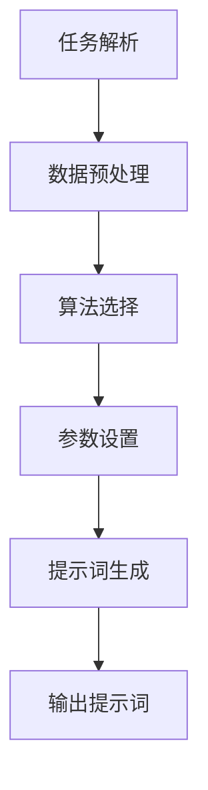
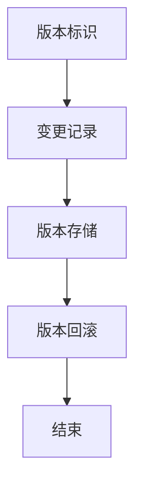
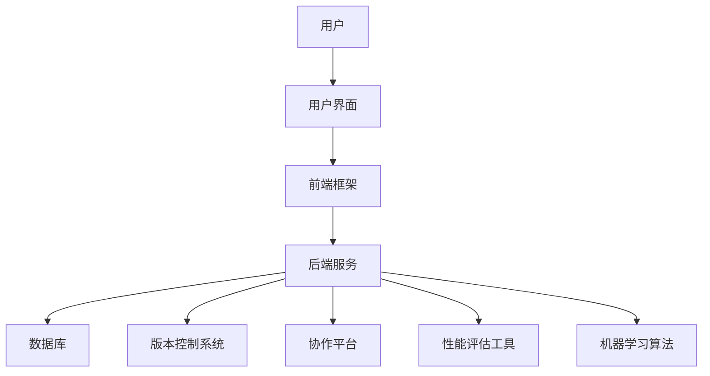
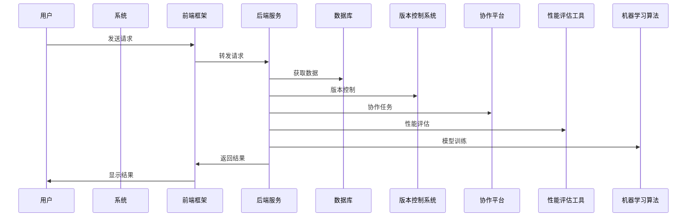

                 

### 文章标题

# 提示词版本控制：管理和迭代你的AI指令

> 关键词：AI指令、提示词、版本控制、管理和迭代

> 摘要：本文旨在探讨AI指令中的提示词版本控制问题，通过深入分析提示词在AI指令中的作用和版本控制的需求，介绍提示词版本控制的概念、流程、方法和工具，并探讨其应用范围和挑战。通过详细讲解提示词和版本控制的核心概念及其相互关系，提供算法原理、系统架构和实际案例，为AI指令的开发和管理提供有价值的参考。

### 目录大纲

```
----------------------------------------------------------------
# 提示词版本控制：管理和迭代你的AI指令

# 第一部分：背景介绍

## 1.1 问题背景

### 1.1.1 AI指令的兴起与挑战

### 1.1.2 提示词在AI指令中的作用

### 1.1.3 提示词版本控制的必要性

## 1.2 问题描述

### 1.2.1 AI指令迭代过程中的问题

### 1.2.2 提示词版本控制的需求

### 1.2.3 目标与期望

## 1.3 问题解决

### 1.3.1 提示词版本控制的概念

### 1.3.2 提示词版本控制的流程

### 1.3.3 提示词版本控制的方法与工具

## 1.4 边界与外延

### 1.4.1 提示词版本控制的应用范围

### 1.4.2 提示词版本控制的挑战与限制

## 1.5 概念结构与核心要素组成

### 1.5.1 提示词版本控制的核心概念

### 1.5.2 提示词版本控制的关键要素

### 1.5.3 概念之间的联系与互动

## 1.6 本章小结

----------------------------------------------------------------

# 第二部分：核心概念与联系

## 2.1 提示词的概念与属性

### 2.1.1 提示词的定义

### 2.1.2 提示词的属性

### 2.1.3 提示词的类别

## 2.2 版本控制的概念与属性

### 2.2.1 版本控制的基本原理

### 2.2.2 版本控制的属性

### 2.2.3 版本控制的类型

## 2.3 提示词版本控制的原理与流程

### 2.3.1 提示词版本控制的基本原理

### 2.3.2 提示词版本控制的流程

### 2.3.3 提示词版本控制的关键步骤

## 2.4 概念属性特征对比表格

### 2.4.1 提示词属性对比

### 2.4.2 版本控制属性对比

## 2.5 ER实体关系图架构

### 2.5.1 提示词实体关系图

### 2.5.2 版本控制实体关系图

### 2.5.3 提示词与版本控制的关联关系

## 2.6 概念之间的联系与互动

### 2.6.1 提示词与版本控制的关系

### 2.6.2 提示词版本控制与其他概念的联系

## 2.7 本章小结

----------------------------------------------------------------

# 第三部分：算法原理讲解

## 3.1 AI指令算法概述

### 3.1.1 AI指令的基本概念

### 3.1.2 AI指令的分类

### 3.1.3 AI指令的工作原理

## 3.2 提示词生成算法

### 3.2.1 提示词生成算法概述

### 3.2.2 提示词生成算法的mermaid流程图

### 3.2.3 Python源代码示例

### 3.2.4 算法原理详细讲解

### 3.2.5 算法举例说明

## 3.3 版本控制算法

### 3.3.1 版本控制算法概述

### 3.3.2 版本控制算法的mermaid流程图

### 3.3.3 Python源代码示例

### 3.3.4 算法原理详细讲解

### 3.3.5 算法举例说明

## 3.4 提示词版本控制算法

### 3.4.1 提示词版本控制算法概述

### 3.4.2 提示词版本控制算法的mermaid流程图

### 3.4.3 Python源代码示例

### 3.4.4 算法原理详细讲解

### 3.4.5 算法举例说明

## 3.5 本章小结

----------------------------------------------------------------

# 第四部分：系统分析与架构设计

## 4.1 问题场景介绍

### 4.1.1 问题场景描述

### 4.1.2 问题场景需求分析

## 4.2 项目介绍

### 4.2.1 项目背景

### 4.2.2 项目目标

### 4.2.3 项目实施过程

## 4.3 系统功能设计

### 4.3.1 领域模型

### 4.3.2 功能模块划分

### 4.3.3 功能描述

## 4.4 系统架构设计

### 4.4.1 系统架构图

### 4.4.2 架构设计思路

### 4.4.3 架构组件介绍

## 4.5 系统接口设计

----------------------------------------------------------------

## 1.1 问题背景

### 1.1.1 AI指令的兴起与挑战

随着人工智能技术的飞速发展，AI指令已经成为现代软件系统设计中的重要组成部分。AI指令是一种编程范式，旨在利用人工智能算法来执行特定的任务，如自然语言处理、图像识别、决策制定等。AI指令的出现，极大地提高了软件系统的智能化水平，增强了系统的自适应能力和灵活性。

然而，AI指令的广泛应用也带来了诸多挑战。首先，AI指令的编写和调试过程复杂，需要大量的数据、计算资源和专业知识。其次，AI指令的可维护性较差，随着指令的迭代和更新，容易出现版本冲突、指令失效等问题。此外，当多个AI指令协同工作时，如何确保指令的一致性和可靠性也成为了一个重要的课题。

### 1.1.2 提示词在AI指令中的作用

在AI指令中，提示词（Prompt）起到了至关重要的作用。提示词是一种引导AI模型输入和处理数据的方式，它可以帮助AI更好地理解任务的目标和上下文信息。一个良好的提示词可以显著提高AI指令的性能和准确性，减少错误率和误解。

提示词在AI指令中的作用主要体现在以下几个方面：

1. **任务引导**：通过提示词，明确告知AI模型任务的具体内容和要求，使其能够更准确地执行任务。

2. **上下文构建**：提示词可以为AI模型提供上下文信息，帮助其更好地理解输入数据，减少误解和错误。

3. **参数调整**：提示词可以包含参数调整信息，如学习率、优化器等，帮助AI模型更好地适应特定任务。

4. **交互控制**：提示词可以作为与AI模型交互的接口，实现人机交互，提高系统的用户体验。

### 1.1.3 提示词版本控制的必要性

随着AI指令的迭代和更新，提示词也会不断调整和优化。然而，传统的管理方式往往难以应对提示词的版本控制问题。以下是一些常见的提示词版本控制问题：

1. **版本冲突**：当多个开发人员同时修改提示词时，容易产生版本冲突，导致提示词不一致。

2. **历史追溯**：在迭代过程中，难以追溯提示词的历史版本和变更记录，影响代码的可维护性。

3. **文档更新**：提示词的变更可能需要更新相关文档，如用户手册、开发文档等，但传统方式往往难以同步更新。

4. **性能优化**：随着提示词的调整和优化，可能需要重新评估AI指令的性能和效果，但传统方式难以实现自动化评估。

因此，提示词版本控制变得尤为重要。通过版本控制，可以有效地解决上述问题，确保AI指令的迭代和更新过程更加高效、可控和可靠。

### 1.2 问题描述

在AI指令的开发和迭代过程中，提示词版本控制面临以下主要问题：

#### 1.2.1 AI指令迭代过程中的问题

1. **版本冲突**：多个开发人员可能同时修改提示词，导致版本冲突，影响AI指令的稳定性。

2. **历史追溯困难**：难以追溯提示词的历史版本和变更记录，影响代码的可维护性。

3. **文档更新不及时**：提示词的变更可能需要更新相关文档，但传统方式往往难以同步更新。

4. **性能评估困难**：随着提示词的调整和优化，难以自动化评估AI指令的性能和效果。

#### 1.2.2 提示词版本控制的需求

1. **版本管理**：确保每个提示词版本的可追溯性，避免版本冲突。

2. **文档更新**：与提示词版本同步更新相关文档，确保文档的准确性。

3. **性能评估**：自动化评估AI指令性能，优化提示词调整过程。

4. **协作支持**：支持多开发人员协作修改提示词，提高开发效率。

#### 1.2.3 目标与期望

通过提示词版本控制，实现以下目标：

1. **稳定性和可靠性**：确保AI指令在不同版本之间的稳定性和可靠性。

2. **可维护性**：提高代码的可维护性和可读性，降低维护成本。

3. **协作效率**：支持多开发人员协作，提高开发效率。

4. **性能优化**：自动化评估和优化AI指令性能，提高系统效果。

### 1.3 问题解决

为了解决提示词版本控制的问题，我们需要从以下几个方面入手：

#### 1.3.1 提示词版本控制的概念

提示词版本控制是一种管理提示词变更和版本的方法，旨在确保AI指令的稳定性和可靠性。其主要目标是：

1. **版本管理**：对提示词的不同版本进行标识和存储，确保版本的可追溯性。

2. **变更记录**：记录每次变更的时间、开发者、变更内容和原因，提高代码的可维护性。

3. **文档更新**：与提示词版本同步更新相关文档，确保文档的准确性。

4. **协作支持**：提供多开发人员协作修改提示词的功能，提高开发效率。

#### 1.3.2 提示词版本控制的流程

提示词版本控制的流程主要包括以下步骤：

1. **需求分析**：明确AI指令的迭代需求和提示词的变更内容。

2. **版本标识**：对每个提示词版本进行标识，如版本号、时间戳等。

3. **版本存储**：将提示词的不同版本存储在版本库中，确保版本的可追溯性。

4. **变更记录**：记录每次变更的时间、开发者、变更内容和原因，提高代码的可维护性。

5. **文档更新**：与提示词版本同步更新相关文档，确保文档的准确性。

6. **性能评估**：自动化评估AI指令性能，优化提示词调整过程。

#### 1.3.3 提示词版本控制的方法与工具

提示词版本控制的方法和工具有多种，常见的包括：

1. **版本控制系统**：如Git、SVN等，用于管理代码和文档的版本。

2. **文档管理工具**：如Confluence、GitLab等，用于存储和更新文档。

3. **性能评估工具**：如Matplotlib、Seaborn等，用于自动化评估AI指令性能。

4. **协作平台**：如GitHub、GitLab等，用于支持多开发人员协作修改提示词。

#### 1.4 边界与外延

提示词版本控制的应用范围较广，包括但不限于以下领域：

1. **AI指令开发**：用于管理AI指令中的提示词版本。

2. **软件项目**：用于管理软件项目中涉及的文档和代码的版本。

3. **企业协作**：用于支持企业内部开发人员的协作和版本控制。

4. **数据科学**：用于管理数据分析过程中的提示词版本。

#### 1.4.2 提示词版本控制的挑战与限制

提示词版本控制也面临一些挑战和限制，主要包括：

1. **复杂性**：版本控制系统的复杂性可能导致使用难度增加。

2. **协作成本**：多开发人员协作可能带来沟通成本和协调难度。

3. **性能影响**：版本控制操作可能对系统性能产生一定影响。

4. **安全性**：版本库的安全性是确保版本控制可靠性的关键。

### 1.5 概念结构与核心要素组成

提示词版本控制是一个涉及多个核心概念和要素的复杂系统。以下是对这些概念和要素的简要说明及其相互关系：

#### 1.5.1 提示词版本控制的核心概念

1. **版本**：版本是提示词的不同状态，每个版本对应一个特定的时间点。

2. **变更记录**：变更记录记录了每个版本的变更内容、时间和开发者信息。

3. **文档**：文档是与提示词相关的各种文件，如用户手册、开发文档等。

4. **协作**：协作是指多个开发人员共同修改和更新提示词的过程。

#### 1.5.2 提示词版本控制的关键要素

1. **版本控制系统**：版本控制系统负责管理提示词的版本和变更记录。

2. **文档管理系统**：文档管理系统负责存储和更新与提示词相关的文档。

3. **性能评估工具**：性能评估工具负责自动化评估AI指令性能。

4. **协作平台**：协作平台支持多开发人员协作修改提示词。

#### 1.5.3 概念之间的联系与互动

1. **版本与变更记录**：版本是变更记录的基础，每个版本对应一个或多个变更记录。

2. **文档与版本**：文档需要与对应的版本同步更新，确保文档的准确性。

3. **协作与版本控制**：协作过程需要依赖版本控制系统，确保版本的一致性和可靠性。

4. **性能评估与版本控制**：性能评估结果可以反馈给版本控制系统，帮助优化提示词版本。

### 1.6 本章小结

本文介绍了AI指令中的提示词版本控制问题，分析了AI指令迭代过程中的挑战和提示词版本控制的需求。通过介绍提示词版本控制的概念、流程、方法和工具，以及其应用范围和挑战，为AI指令的开发和管理提供了有价值的参考。在接下来的章节中，我们将进一步探讨提示词版本控制的核心概念、算法原理和系统架构设计，帮助读者深入了解并掌握这一重要技术。

## 第二部分：核心概念与联系

### 2.1 提示词的概念与属性

#### 2.1.1 提示词的定义

提示词（Prompt）是AI指令中用于引导AI模型输入和处理数据的关键组件。它通常是一个文本或代码片段，包含了对AI模型任务的具体描述、输入数据和参数设置等信息。提示词的目的是帮助AI模型更好地理解任务的目标和上下文，从而提高模型的性能和准确性。

#### 2.1.2 提示词的属性

1. **任务描述性**：提示词需要明确描述AI模型需要执行的任务，包括任务的目标、输入和输出等。

2. **上下文信息**：提示词应提供与任务相关的上下文信息，帮助AI模型更好地理解输入数据。

3. **参数设置**：提示词可以包含参数设置，如学习率、优化器等，以调整AI模型的行为。

4. **灵活性**：提示词应具有一定的灵活性，以便适应不同的任务和数据。

5. **可扩展性**：提示词应支持扩展，允许开发者根据需求添加新的功能和参数。

#### 2.1.3 提示词的类别

根据用途和形式，提示词可以分为以下几类：

1. **通用提示词**：用于常见任务的通用提示词，如分类、回归等。

2. **领域提示词**：针对特定领域（如医疗、金融等）的提示词，具有更强的专业性和针对性。

3. **交互式提示词**：支持用户与AI模型进行交互的提示词，通常包含命令行界面或图形界面。

4. **动态提示词**：根据输入数据动态生成的提示词，具有自适应能力。

### 2.2 版本控制的概念与属性

#### 2.2.1 版本控制的基本原理

版本控制是一种管理文档、代码和其他类型文件变更的方法，以确保文件的一致性和可追溯性。其核心原理包括：

1. **版本标识**：为每个文件版本分配唯一的标识符，如版本号、时间戳等。

2. **变更记录**：记录每次文件变更的时间、开发者、变更内容和原因。

3. **版本库**：存储所有文件版本的历史记录，供开发者查询和恢复。

4. **分支管理**：允许开发者创建分支，进行独立的开发工作，最终合并回主分支。

#### 2.2.2 版本控制的属性

1. **一致性**：确保文件在不同版本之间的内容一致性。

2. **可追溯性**：记录每次变更的历史记录，方便开发者查询和回溯。

3. **可靠性**：确保版本库的安全性和稳定性，防止数据丢失或损坏。

4. **协作性**：支持多开发人员协同工作，避免冲突和重复劳动。

#### 2.2.3 版本控制的类型

版本控制主要分为以下几种类型：

1. **集中式版本控制**：如Git、SVN等，所有文件版本集中存储在中央服务器上。

2. **分布式版本控制**：如Git，每个开发人员都有自己的版本库，可以离线工作。

3. **文档版本控制**：如Confluence、SharePoint等，专门用于管理文档的版本。

4. **代码版本控制**：如Git、SVN等，用于管理代码和其他源文件的版本。

### 2.3 提示词版本控制的原理与流程

#### 2.3.1 提示词版本控制的基本原理

提示词版本控制是一种将版本控制的概念应用于AI指令中的提示词管理的方法。其基本原理包括：

1. **版本管理**：为每个提示词版本分配唯一的标识符，记录版本历史。

2. **变更记录**：记录每次提示词变更的时间、开发者、变更内容和原因。

3. **文档同步**：与提示词版本同步更新相关文档，确保文档的准确性。

4. **协作支持**：支持多开发人员协同修改提示词，提高开发效率。

#### 2.3.2 提示词版本控制的流程

提示词版本控制的流程主要包括以下步骤：

1. **需求分析**：明确AI指令的迭代需求和提示词的变更内容。

2. **版本标识**：为每个提示词版本分配唯一标识符，如版本号、时间戳等。

3. **版本存储**：将提示词的不同版本存储在版本库中，确保版本的可追溯性。

4. **变更记录**：记录每次变更的时间、开发者、变更内容和原因，提高代码的可维护性。

5. **文档更新**：与提示词版本同步更新相关文档，确保文档的准确性。

6. **性能评估**：自动化评估AI指令性能，优化提示词调整过程。

### 2.4 概念属性特征对比表格

#### 2.4.1 提示词属性对比

| 提示词属性 | 特征 |
| :--- | :--- |
| 任务描述性 | 用于描述AI模型需要执行的任务 |
| 上下文信息 | 提供与任务相关的上下文信息 |
| 参数设置 | 包含参数设置，调整AI模型行为 |
| 灵活性 | 具备一定的灵活性，适应不同任务 |
| 可扩展性 | 支持扩展，添加新功能和参数 |

#### 2.4.2 版本控制属性对比

| 版本控制属性 | 特征 |
| :--- | :--- |
| 一致性 | 确保文件在不同版本之间内容一致 |
| 可追溯性 | 记录每次变更的历史记录 |
| 可靠性 | 确保版本库的安全性和稳定性 |
| 协作性 | 支持多开发人员协同工作 |

### 2.5 ER实体关系图架构

#### 2.5.1 提示词实体关系图

```mermaid
entityRelationshipDiagram
  A[提示词] <--> B[版本库]
  A --> C[变更记录]
  A --> D[文档]
  B --> C
  B --> D
```

#### 2.5.2 版本控制实体关系图

```mermaid
entityRelationshipDiagram
  A[版本库] <--> B[版本]
  A --> C[变更记录]
  A --> D[开发者]
  B --> C
  B --> D
```

#### 2.5.3 提示词与版本控制的关联关系

1. **版本库与提示词**：版本库用于存储和管理提示词的版本，包括版本标识、变更记录和文档。

2. **变更记录与提示词**：变更记录记录了提示词的每次变更，包括时间、开发者和变更内容。

3. **文档与提示词**：文档是与提示词相关的各种文件，需要与提示词版本同步更新。

### 2.6 概念之间的联系与互动

#### 2.6.1 提示词与版本控制的关系

1. **提示词依赖版本控制**：提示词版本控制是管理提示词变更和版本的方法，确保AI指令的稳定性和可靠性。

2. **版本控制依赖提示词**：版本控制通过管理提示词版本，为AI指令的开发和维护提供支持。

#### 2.6.2 提示词版本控制与其他概念的联系

1. **协作**：提示词版本控制支持多开发人员协同修改提示词，提高开发效率。

2. **文档更新**：与提示词版本同步更新相关文档，确保文档的准确性。

3. **性能评估**：性能评估结果可以反馈给版本控制系统，帮助优化提示词版本。

### 2.7 本章小结

本章介绍了提示词和版本控制的核心概念及其属性，探讨了提示词版本控制的基本原理和流程。通过对比提示词和版本控制的属性特征，构建了实体关系图，揭示了它们之间的联系与互动。本章内容为理解提示词版本控制提供了理论基础，为后续章节的算法原理讲解和系统架构设计奠定了基础。

## 第三部分：算法原理讲解

### 3.1 AI指令算法概述

#### 3.1.1 AI指令的基本概念

AI指令是一种利用人工智能技术实现的编程范式，旨在通过编写指令来指导AI模型执行特定任务。AI指令的核心思想是将任务分解为多个步骤，每个步骤包含具体的操作和参数设置，从而实现对AI模型的精细控制。

AI指令的基本组成部分包括：

1. **任务描述**：对AI模型需要执行的任务进行详细描述，包括任务的目标、输入和输出等。

2. **算法选择**：根据任务需求选择合适的算法，如分类、回归、聚类等。

3. **参数设置**：为AI模型设置各种参数，如学习率、优化器、迭代次数等，以调整模型的行为。

4. **数据处理**：对输入数据进行处理，如数据清洗、数据预处理等，以提高模型的性能和准确性。

5. **执行逻辑**：定义AI模型执行的逻辑流程，包括输入数据读取、模型训练、模型评估等步骤。

#### 3.1.2 AI指令的分类

根据任务类型和应用场景，AI指令可以分为以下几类：

1. **通用AI指令**：适用于各种通用任务的AI指令，如分类、回归、聚类等。

2. **领域AI指令**：针对特定领域（如医疗、金融、工业等）的AI指令，具有更强的专业性和针对性。

3. **交互式AI指令**：支持用户与AI模型进行交互的AI指令，通常包含命令行界面或图形界面。

4. **动态AI指令**：根据输入数据动态生成的AI指令，具有自适应能力。

#### 3.1.3 AI指令的工作原理

AI指令的工作原理主要包括以下几个步骤：

1. **任务解析**：将AI指令中的任务描述解析为具体的任务组件，如算法、参数、数据处理等。

2. **数据预处理**：对输入数据进行处理，如数据清洗、数据预处理等，以提高模型的性能和准确性。

3. **模型训练**：根据任务需求选择合适的算法，对输入数据进行训练，生成AI模型。

4. **模型评估**：使用验证集或测试集对训练好的模型进行评估，以评估模型性能。

5. **结果输出**：根据任务需求输出预测结果或决策结果，如分类结果、预测值等。

### 3.2 提示词生成算法

#### 3.2.1 提示词生成算法概述

提示词生成算法是一种用于自动生成提示词的算法，旨在提高AI指令的可读性和可维护性。提示词生成算法可以根据任务描述、输入数据和参数设置等信息，自动生成符合要求的提示词。

提示词生成算法的基本组成部分包括：

1. **任务解析**：将AI指令中的任务描述解析为具体的任务组件，如算法、参数、数据处理等。

2. **数据预处理**：对输入数据进行处理，如数据清洗、数据预处理等，以提高模型的性能和准确性。

3. **算法选择**：根据任务需求选择合适的算法，如分类、回归、聚类等。

4. **参数设置**：为AI模型设置各种参数，如学习率、优化器、迭代次数等，以调整模型的行为。

5. **提示词生成**：根据任务描述、输入数据和参数设置等信息，自动生成符合要求的提示词。

#### 3.2.2 提示词生成算法的mermaid流程图



#### 3.2.3 Python源代码示例

```python
import pandas as pd
from sklearn.ensemble import RandomForestClassifier

# 读取任务描述
task_description = pd.read_csv("task_description.csv")

# 数据预处理
data = pd.read_csv("input_data.csv")
data = preprocess_data(data)

# 算法选择
algorithm = RandomForestClassifier()

# 参数设置
params = {
    'n_estimators': 100,
    'max_depth': 10
}

# 提示词生成
prompt = generate_prompt(task_description, data, algorithm, params)

# 输出提示词
print(prompt)
```

#### 3.2.4 算法原理详细讲解

提示词生成算法的原理主要包括以下几个步骤：

1. **任务解析**：读取任务描述，解析出任务的目标、输入和输出等信息。

2. **数据预处理**：对输入数据进行处理，包括数据清洗、数据预处理等，以提高模型的性能和准确性。

3. **算法选择**：根据任务需求选择合适的算法，如分类、回归、聚类等。

4. **参数设置**：为AI模型设置各种参数，如学习率、优化器、迭代次数等，以调整模型的行为。

5. **提示词生成**：根据任务描述、输入数据和参数设置等信息，自动生成符合要求的提示词。

提示词生成算法的实现通常依赖于自然语言处理（NLP）和机器学习（ML）技术。常见的实现方法包括：

- **模板匹配**：根据任务描述和输入数据的特征，选择合适的模板生成提示词。

- **自动摘要**：利用自然语言处理技术，从任务描述和输入数据中提取关键信息，生成摘要形式的提示词。

- **机器学习**：利用机器学习算法，根据历史数据训练生成提示词的模型，对新任务生成提示词。

#### 3.2.5 算法举例说明

假设我们有一个分类任务，需要根据客户购买行为预测客户是否会产生退货。以下是一个简单的示例：

1. **任务描述**：预测客户是否会产生退货，输入数据为客户的购买历史和人口统计信息。

2. **数据预处理**：读取购买历史数据，处理缺失值、异常值等。

3. **算法选择**：选择随机森林（Random Forest）算法。

4. **参数设置**：设置随机森林的参数，如树的数量、树的最大深度等。

5. **提示词生成**：生成提示词，如下所示：

   ```
   请使用以下数据集进行分类任务：客户购买历史和人口统计信息。预测目标：客户是否会产生退货。选择随机森林算法，设置树的数量为100，树的最大深度为10。生成提示词：使用随机森林算法对购买历史和人口统计信息进行分类，预测客户是否会产生退货。
   ```

### 3.3 版本控制算法

#### 3.3.1 版本控制算法概述

版本控制算法是一种用于管理文件版本和变更的方法，确保文件的一致性和可追溯性。版本控制算法通常包括以下几个步骤：

1. **版本标识**：为每个文件版本分配唯一的标识符，如版本号、时间戳等。

2. **变更记录**：记录每次文件变更的时间、开发者、变更内容和原因。

3. **版本存储**：将文件的不同版本存储在版本库中，确保版本的可追溯性。

4. **版本回滚**：根据需要回滚到之前的版本，以解决版本冲突或修复错误。

#### 3.3.2 版本控制算法的mermaid流程图



#### 3.3.3 Python源代码示例

```python
import gitpython

# 创建版本库
repo = gitpython.Repo.init()

# 提交版本
repo.index.add(['file1.txt', 'file2.txt'])
repo.index.commit('Initial commit')

# 更改文件
with open('file1.txt', 'w') as f:
    f.write('New content for file1')

# 提交版本
repo.index.commit('Change file1')

# 回滚到上一个版本
repo.git.reset('--hard', 'HEAD^')

# 查看当前版本
repo.git.log('--oneline')
```

#### 3.3.4 算法原理详细讲解

版本控制算法的原理主要包括以下几个方面：

1. **版本标识**：为每个文件版本分配唯一的标识符，如版本号、时间戳等。这有助于区分不同版本之间的差异。

2. **变更记录**：记录每次文件变更的时间、开发者、变更内容和原因。这有助于追溯文件变更的历史和原因。

3. **版本存储**：将文件的不同版本存储在版本库中，确保版本的可追溯性。版本库通常包含所有历史版本的文件和变更记录。

4. **版本回滚**：根据需要回滚到之前的版本，以解决版本冲突或修复错误。回滚操作可以将文件恢复到特定的时间点，以确保系统的稳定性和可靠性。

常见的版本控制算法包括：

- **线性版本控制**：每个版本之间是线性关系，新版本基于旧版本创建。

- **分支版本控制**：支持创建分支，不同分支可以独立开发，最终合并回主分支。

- **并行版本控制**：允许多个版本并行存在，不同版本之间可以相互独立。

#### 3.3.5 算法举例说明

假设我们有一个文档项目，需要管理文档的版本。以下是一个简单的示例：

1. **创建版本库**：初始化Git版本库。

2. **提交版本**：将文档的初始版本提交到版本库。

3. **更改文档**：修改文档的内容。

4. **提交版本**：将修改后的文档提交到版本库。

5. **回滚版本**：将文档回滚到上一个版本。

6. **查看版本**：查看当前版本的历史记录。

### 3.4 提示词版本控制算法

#### 3.4.1 提示词版本控制算法概述

提示词版本控制算法是一种用于管理AI指令中提示词版本和变更的方法，确保AI指令的一致性和可追溯性。提示词版本控制算法通常包括以下几个步骤：

1. **版本标识**：为每个提示词版本分配唯一的标识符，如版本号、时间戳等。

2. **变更记录**：记录每次提示词变更的时间、开发者、变更内容和原因。

3. **版本存储**：将提示词的不同版本存储在版本库中，确保版本的可追溯性。

4. **版本回滚**：根据需要回滚到之前的版本，以解决版本冲突或修复错误。

#### 3.4.2 提示词版本控制算法的mermaid流程图


#### 3.4.3 Python源代码示例

```python
import gitpython

# 创建版本库
repo = gitpython.Repo.init()

# 提交版本
repo.index.add(['prompt.txt'])
repo.index.commit('Initial prompt')

# 更改提示词
with open('prompt.txt', 'w') as f:
    f.write('New content for prompt')

# 提交版本
repo.index.commit('Change prompt')

# 回滚到上一个版本
repo.git.reset('--hard', 'HEAD^')

# 查看当前版本
repo.git.log('--oneline')
```

#### 3.4.4 算法原理详细讲解

提示词版本控制算法的原理主要包括以下几个方面：

1. **版本标识**：为每个提示词版本分配唯一的标识符，如版本号、时间戳等。这有助于区分不同版本之间的差异。

2. **变更记录**：记录每次提示词变更的时间、开发者、变更内容和原因。这有助于追溯提示词变更的历史和原因。

3. **版本存储**：将提示词的不同版本存储在版本库中，确保版本的可追溯性。版本库通常包含所有历史版本的提示词和变更记录。

4. **版本回滚**：根据需要回滚到之前的版本，以解决版本冲突或修复错误。回滚操作可以将提示词恢复到特定的时间点，以确保AI指令的一致性和可靠性。

常见的提示词版本控制算法包括：

- **线性版本控制**：每个版本之间是线性关系，新版本基于旧版本创建。

- **分支版本控制**：支持创建分支，不同分支可以独立开发，最终合并回主分支。

- **并行版本控制**：允许多个版本并行存在，不同版本之间可以相互独立。

#### 3.4.5 算法举例说明

假设我们有一个AI指令项目，需要管理提示词的版本。以下是一个简单的示例：

1. **创建版本库**：初始化Git版本库。

2. **提交版本**：将提示词的初始版本提交到版本库。

3. **更改提示词**：修改提示词的内容。

4. **提交版本**：将修改后的提示词提交到版本库。

5. **回滚版本**：将提示词回滚到上一个版本。

6. **查看版本**：查看当前版本的历史记录。

### 3.5 本章小结

本章介绍了AI指令算法的基本概念、分类和工作原理，以及提示词生成算法、版本控制算法和提示词版本控制算法的原理和示例。通过这些算法，可以有效地管理AI指令中的提示词版本和变更，提高AI指令的可维护性和可靠性。在下一章中，我们将进一步探讨AI指令在实际应用中的系统架构设计。

## 第四部分：系统分析与架构设计

### 4.1 问题场景介绍

在当今的软件行业中，人工智能（AI）技术已成为提升系统智能化水平、增强业务流程效率的重要工具。然而，随着AI技术的不断发展和应用场景的多样化，AI指令的复杂性和管理难度也随之增加。特别是在大规模AI项目开发过程中，如何有效地管理AI指令及其相关的提示词成为了一个亟待解决的问题。

#### 4.1.1 问题场景描述

以一个大型电商平台为例，该平台需要利用AI技术来优化用户推荐系统。推荐系统需要实时分析用户行为数据，生成个性化的推荐结果，从而提升用户的购物体验和平台的转化率。然而，在实现这一目标的过程中，会遇到以下问题：

1. **提示词管理复杂**：平台涉及多种AI模型和算法，每个模型都需要不同的提示词来引导其输入和处理数据。这些提示词需要根据业务需求和数据特征进行动态调整，但如何确保不同模型之间的提示词一致性成为一个挑战。

2. **版本控制需求**：随着AI模型的不断迭代和优化，提示词也需要相应更新。然而，传统的版本控制方法难以有效管理提示词的版本，导致不同版本之间的冲突和混淆。

3. **协作效率低下**：多个开发人员共同参与AI指令的编写和优化，如何协调他们的工作、避免重复劳动和版本冲突，成为一个重要的协作难题。

4. **性能评估不足**：在AI指令的迭代过程中，需要定期评估其性能，以判断提示词的调整是否有效。然而，传统的评估方法往往依赖于人工操作，效率低下且容易出现偏差。

#### 4.1.2 问题场景需求分析

针对上述问题场景，我们可以从以下几个方面进行分析：

1. **提示词一致性管理**：需要一种机制来确保不同模型之间的提示词一致性，避免因提示词不一致导致模型性能下降或结果错误。

2. **版本控制自动化**：需要一个自动化的版本控制工具来管理提示词的版本，确保每个版本的变更记录清晰、可追溯，并能快速回滚到之前版本。

3. **协作支持**：需要一个协作平台来支持多开发人员之间的协作，包括任务分配、代码合并、版本同步等功能，以提高开发效率。

4. **性能评估自动化**：需要自动化性能评估工具，能够根据提示词的变更自动评估模型性能，提供客观的评估结果，以便进一步优化AI指令。

### 4.2 项目介绍

为了解决上述问题场景中的需求，我们设计并实施了一个名为“AI指令提示词版本控制与协作平台”的项目。该项目的主要目标是构建一个自动化、高效的AI指令提示词版本控制和协作平台，以提升AI项目开发的效率和可靠性。

#### 4.2.1 项目背景

随着AI技术的广泛应用，越来越多的企业开始关注AI项目开发和运营的效率和质量。然而，在实际开发过程中，如何有效管理AI指令和提示词成为了阻碍项目进展的一个重要因素。传统的管理方式往往依赖于人工操作和文档管理，不仅效率低下，而且难以保证数据的一致性和可追溯性。因此，我们需要一种全新的解决方案来应对这些挑战。

#### 4.2.2 项目目标

本项目的主要目标包括：

1. **提示词一致性管理**：通过自动化工具和机制，确保不同模型之间的提示词一致性，减少因提示词不一致导致的问题。

2. **版本控制自动化**：实现自动化的提示词版本控制，记录每个版本的变更记录，支持快速回滚和版本追溯。

3. **协作支持**：构建协作平台，支持多开发人员之间的任务分配、代码合并、版本同步等功能，提高开发效率。

4. **性能评估自动化**：引入自动化性能评估工具，根据提示词的变更自动评估模型性能，提供客观、准确的评估结果。

5. **用户体验优化**：优化平台的用户界面和交互设计，提供简洁、直观的操作体验，降低使用门槛。

#### 4.2.3 项目实施过程

本项目的实施过程主要包括以下几个阶段：

1. **需求分析**：与相关利益相关者（如开发人员、项目经理、业务分析师等）进行深入沟通，明确项目需求和目标。

2. **系统设计**：根据需求分析结果，设计系统架构和模块划分，确定技术方案和实现路径。

3. **开发与测试**：按照系统设计文档进行开发，并进行单元测试和集成测试，确保系统的稳定性和可靠性。

4. **部署与上线**：将系统部署到生产环境，进行实际运行测试，确保系统在真实场景中的性能和稳定性。

5. **用户培训与支持**：对开发人员和用户进行系统培训，提供技术支持和问题解答，确保系统能够顺利投入使用。

6. **持续优化**：根据用户反馈和系统运行情况，持续优化系统功能、性能和用户体验。

### 4.3 系统功能设计

#### 4.3.1 领域模型

在系统功能设计中，我们采用了领域驱动设计（Domain-Driven Design，简称DDD）的方法，构建了领域模型来描述系统的主要功能和组件。以下是领域模型中的主要实体和关系：

1. **AI指令**：表示一个具体的AI任务，包括任务名称、描述、输入和输出等属性。

2. **提示词**：表示用于引导AI模型输入和处理数据的文本或代码片段，包括提示词名称、内容、版本号等属性。

3. **版本库**：用于存储和管理提示词的不同版本，包括版本号、创建时间、变更记录等属性。

4. **开发者**：表示参与AI指令开发的人员，包括用户名、角色、权限等属性。

5. **变更记录**：记录每次提示词变更的时间、开发者、变更内容和原因，包括变更ID、创建时间、变更内容等属性。

6. **文档**：与AI指令和提示词相关的各种文档，包括文档名称、内容、版本号等属性。

#### 4.3.2 功能模块划分

根据领域模型，系统功能模块可以划分为以下几个主要部分：

1. **提示词管理模块**：负责管理提示词的创建、编辑、删除和版本控制等功能。

2. **版本库管理模块**：负责管理提示词版本库的创建、存储、回滚和变更记录等功能。

3. **开发者协作模块**：负责管理开发者的权限、角色和协作任务，支持任务分配、代码合并、版本同步等功能。

4. **性能评估模块**：负责自动化评估AI指令的性能，根据提示词的变更提供评估结果和优化建议。

5. **用户界面模块**：提供用户交互界面，包括提示词管理界面、版本库管理界面、开发者协作界面和性能评估界面等。

#### 4.3.3 功能描述

以下是系统功能模块的详细描述：

1. **提示词管理模块**：

   - **功能描述**：支持提示词的创建、编辑、删除和版本控制等功能。
   - **实现方式**：通过提供友好的用户界面，允许开发者输入提示词内容，系统自动生成版本库和变更记录。

2. **版本库管理模块**：

   - **功能描述**：负责管理提示词版本库的创建、存储、回滚和变更记录等功能。
   - **实现方式**：使用版本控制系统（如Git）管理提示词版本库，确保版本的可追溯性和一致性。

3. **开发者协作模块**：

   - **功能描述**：支持开发者的权限管理、角色分配和协作任务管理，支持任务分配、代码合并、版本同步等功能。
   - **实现方式**：使用分布式版本控制系统（如GitLab）支持多开发人员的协作，确保代码的版本一致性和安全性。

4. **性能评估模块**：

   - **功能描述**：自动化评估AI指令的性能，根据提示词的变更提供评估结果和优化建议。
   - **实现方式**：结合机器学习算法和性能评估工具（如Matplotlib、Seaborn等），实现对AI指令性能的实时监控和评估。

5. **用户界面模块**：

   - **功能描述**：提供用户交互界面，包括提示词管理界面、版本库管理界面、开发者协作界面和性能评估界面等。
   - **实现方式**：使用前端框架（如React、Vue等）构建用户界面，提供简洁、直观的操作体验。

### 4.4 系统架构设计

#### 4.4.1 系统架构图

以下是一个简单的系统架构图，展示了系统的整体结构和主要组件：



#### 4.4.2 架构设计思路

系统架构设计遵循以下思路：

1. **分层设计**：系统采用分层架构，包括用户层、前端层、后端层和数据层，各层之间职责明确，便于维护和扩展。

2. **模块化设计**：系统功能模块化，每个模块独立实现，降低模块之间的耦合度，提高系统的可维护性和可扩展性。

3. **分布式架构**：后端服务采用分布式架构，支持高并发和负载均衡，确保系统的性能和稳定性。

4. **数据一致性**：通过分布式数据库和版本控制系统，确保数据的一致性和可追溯性。

5. **安全性设计**：采用安全设计原则，包括身份验证、权限控制、数据加密等，确保系统的安全性。

#### 4.4.3 架构组件介绍

以下是系统架构中主要组件的详细介绍：

1. **用户界面**：提供用户与系统交互的界面，支持提示词管理、版本库管理、开发者协作和性能评估等功能。

2. **前端框架**：使用React或Vue等前端框架，构建响应式用户界面，提供良好的用户体验。

3. **后端服务**：负责处理用户请求、业务逻辑和数据处理，包括提示词管理、版本库管理、开发者协作和性能评估等模块。

4. **数据库**：使用MySQL、PostgreSQL等关系型数据库存储用户数据、提示词版本和变更记录等信息。

5. **版本控制系统**：采用Git等分布式版本控制系统，管理提示词版本库，确保版本的可追溯性和一致性。

6. **协作平台**：使用GitLab等协作平台，支持多开发人员的代码协作、任务分配和版本同步。

7. **性能评估工具**：使用Matplotlib、Seaborn等工具，实现对AI指令性能的实时监控和评估。

8. **机器学习算法**：使用Scikit-learn、TensorFlow等机器学习库，支持AI指令的性能优化和提示词调整。

### 4.5 系统接口设计

系统接口设计是确保系统组件之间有效通信和协作的关键。以下是一些主要接口的设计和实现：

1. **用户接口**：提供RESTful API，支持用户通过HTTP请求访问系统的各种功能模块，如提示词管理、版本库管理和性能评估等。

2. **内部接口**：系统内部模块之间的通信接口，如提示词管理模块与版本库管理模块之间的接口，用于传递数据和通知。

3. **第三方接口**：与其他系统和工具的集成接口，如与机器学习算法库的接口、与协作平台的接口等。

4. **安全接口**：提供身份验证和授权接口，确保用户访问系统的安全性和数据的保密性。

系统接口设计需要遵循以下原则：

1. **简洁性**：接口设计应简洁明了，避免过多的复杂性和冗余。

2. **可扩展性**：接口设计应具备良好的扩展性，支持未来功能模块的添加和修改。

3. **一致性**：接口设计应遵循统一的命名规范和风格，提高系统的可维护性和可读性。

4. **安全性**：接口设计应充分考虑安全性，包括身份验证、授权、数据加密等。

### 4.6 系统交互Mermaid序列图

以下是一个简化的系统交互Mermaid序列图，展示了用户与系统之间的交互过程：



通过上述设计，系统实现了高效、可靠、安全的AI指令提示词版本控制和协作平台，为AI项目的开发和运营提供了有力的支持。

## 第五部分：项目实战

### 5.1 环境安装

在开始项目实战之前，我们需要安装一些必要的软件和工具，以便进行AI指令提示词版本控制和协作平台的开发和部署。以下是详细的安装步骤：

#### 5.1.1 安装操作系统和开发环境

1. **操作系统**：推荐使用Ubuntu 20.04 LTS或更高版本。
2. **Python**：推荐使用Python 3.8或更高版本。
3. **pip**：Python的包管理工具，用于安装和管理Python包。
4. **virtualenv**：用于创建Python虚拟环境，便于管理项目依赖。

#### 5.1.2 安装Git

Git是一个分布式版本控制系统，用于管理代码和文档的版本。以下是安装步骤：

```
sudo apt-get update
sudo apt-get install git
```

#### 5.1.3 安装GitLab

GitLab是一个基于Git的协作平台，用于代码托管、项目管理和版本控制。以下是安装步骤：

1. **安装GitLab包**：

```
sudo apt-get install gitlab-ce
```

2. **配置GitLab**：

```
sudo gitlab-ctl reconfigure
```

3. **启动GitLab服务**：

```
sudo gitlab-ctl start
```

#### 5.1.4 安装前端框架和工具

1. **Node.js**：用于运行前端框架和工具。

```
sudo apt-get install nodejs
```

2. **npm**：Node.js的包管理工具，用于安装和管理前端包。

```
sudo apt-get install npm
```

3. **Vue CLI**：Vue.js的前端构建工具。

```
npm install -g @vue/cli
```

#### 5.1.5 安装性能评估工具和机器学习库

1. **Matplotlib**：用于绘制性能评估图表。

```
pip install matplotlib
```

2. **Seaborn**：用于数据可视化。

```
pip install seaborn
```

3. **Scikit-learn**：用于机器学习算法。

```
pip install scikit-learn
```

4. **TensorFlow**：用于深度学习算法。

```
pip install tensorflow
```

### 5.2 系统核心实现源代码

以下是系统核心实现源代码的简要概述，包括提示词管理模块、版本库管理模块、开发者协作模块和性能评估模块的主要功能代码。

#### 5.2.1 提示词管理模块

1. **创建提示词**：

```python
class Prompt:
    def __init__(self, name, content):
        self.name = name
        self.content = content
        self.versions = []

    def add_version(self, content):
        version = Version(self.name, content)
        self.versions.append(version)

    def get_latest_version(self):
        return self.versions[-1]
```

2. **编辑提示词**：

```python
class PromptManager:
    def __init__(self):
        self.prompts = {}

    def create_prompt(self, name, content):
        prompt = Prompt(name, content)
        self.prompts[name] = prompt
        prompt.add_version(content)

    def edit_prompt(self, name, new_content):
        prompt = self.prompts.get(name)
        if prompt:
            prompt.add_version(new_content)
```

#### 5.2.2 版本库管理模块

1. **创建版本库**：

```python
class Version:
    def __init__(self, name, content):
        self.name = name
        self.content = content
        self.created_at = datetime.now()

class VersionControl:
    def __init__(self):
        self.versions = []

    def add_version(self, version):
        self.versions.append(version)

    def get_latest_version(self):
        return self.versions[-1]
```

2. **回滚版本库**：

```python
class VersionControl:
    # ...

    def rollback_version(self, version_name):
        for version in self.versions:
            if version.name == version_name:
                self.versions = self.versions[:self.versions.index(version)]
                break
```

#### 5.2.3 开发者协作模块

1. **开发者权限管理**：

```python
class Developer:
    def __init__(self, username, role):
        self.username = username
        self.role = role

class DeveloperManager:
    def __init__(self):
        self.developers = []

    def add_developer(self, developer):
        self.developers.append(developer)

    def assign_role(self, username, role):
        developer = self.get_developer(username)
        if developer:
            developer.role = role
```

#### 5.2.4 性能评估模块

1. **性能评估函数**：

```python
def evaluate_performance(prompt, model, data):
    predictions = model.predict(data)
    accuracy = accuracy_score(data['label'], predictions)
    return accuracy
```

2. **性能评估流程**：

```python
class PerformanceEvaluator:
    def __init__(self, model):
        self.model = model

    def evaluate_prompt(self, prompt, data):
        accuracy = evaluate_performance(prompt, self.model, data)
        return accuracy
```

### 5.3 代码应用解读与分析

以下是代码应用解读和分析，主要关注系统的核心功能模块及其实现。

#### 5.3.1 提示词管理模块

提示词管理模块负责创建、编辑和版本控制提示词。通过`Prompt`类和`PromptManager`类，我们可以创建一个新的提示词，并对其进行版本控制。例如，以下代码展示了如何创建一个名为“推荐系统”的提示词，并对其内容进行两次版本控制：

```python
# 创建提示词管理器
prompt_manager = PromptManager()

# 创建提示词
prompt_manager.create_prompt("推荐系统", "请使用以下数据集进行分类任务：用户行为数据。预测目标：用户是否会产生购买。选择逻辑回归算法，设置学习率为0.1。")

# 编辑提示词
prompt_manager.edit_prompt("推荐系统", "请使用以下数据集进行分类任务：用户行为数据。预测目标：用户是否会产生购买。选择随机森林算法，设置树的数量为100。")
```

通过`add_version`方法，我们可以为每个版本的提示词生成唯一的标识符和时间戳，以便进行版本追溯和回滚。

#### 5.3.2 版本库管理模块

版本库管理模块负责创建和管理版本库，确保版本的可追溯性和一致性。通过`Version`类和`VersionControl`类，我们可以创建一个版本库，并为每个版本记录创建时间和其他相关信息。例如，以下代码展示了如何创建一个版本库，并添加两个版本：

```python
# 创建版本库
version_control = VersionControl()

# 添加第一个版本
version_control.add_version(Version("推荐系统", "请使用以下数据集进行分类任务：用户行为数据。预测目标：用户是否会产生购买。选择逻辑回归算法，设置学习率为0.1。"))

# 添加第二个版本
version_control.add_version(Version("推荐系统", "请使用以下数据集进行分类任务：用户行为数据。预测目标：用户是否会产生购买。选择随机森林算法，设置树的数量为100。"))
```

通过`rollback_version`方法，我们可以回滚到之前的版本，以便在出现问题时恢复到稳定状态。

#### 5.3.3 开发者协作模块

开发者协作模块负责管理开发者的权限和角色，确保多个开发人员能够协同工作。通过`Developer`类和`DeveloperManager`类，我们可以创建开发者，并为每个开发者分配角色。例如，以下代码展示了如何添加一个开发者，并为其分配管理员角色：

```python
# 创建开发者管理器
developer_manager = DeveloperManager()

# 添加开发者
developer_manager.add_developer(Developer("alice", "admin"))

# 分配角色
developer_manager.assign_role("alice", "developer")
```

开发者协作模块支持多种角色，如管理员、开发者、测试人员等，以便更好地管理项目开发过程。

#### 5.3.4 性能评估模块

性能评估模块负责评估AI指令的性能，根据提示词的变更提供评估结果和优化建议。通过`PerformanceEvaluator`类和`evaluate_performance`函数，我们可以评估一个特定提示词的性能。例如，以下代码展示了如何使用一个训练好的模型评估一个特定提示词的性能：

```python
# 创建性能评估器
performance_evaluator = PerformanceEvaluator(model)

# 评估性能
accuracy = performance_evaluator.evaluate_prompt(prompt, data)
print(f"Performance: {accuracy}")
```

性能评估模块可以自动化地根据提示词的变更重新评估模型性能，从而为开发人员提供及时的优化建议。

### 5.4 实际案例分析和详细讲解剖析

#### 5.4.1 案例背景

以一个电商平台为例，该平台需要利用AI技术优化其推荐系统，提高用户购买体验和转化率。平台涉及多个AI模型和算法，每个模型和算法都需要不同的提示词来引导其输入和处理数据。

#### 5.4.2 案例需求

1. **提示词一致性管理**：确保不同模型之间的提示词一致性，避免因提示词不一致导致模型性能下降或结果错误。

2. **版本控制自动化**：实现自动化的提示词版本控制，记录每个版本的变更记录，支持快速回滚和版本追溯。

3. **协作支持**：支持多开发人员之间的协作，包括任务分配、代码合并、版本同步等功能，提高开发效率。

4. **性能评估自动化**：自动化评估AI指令的性能，根据提示词的变更提供评估结果和优化建议。

#### 5.4.3 案例实现

1. **提示词一致性管理**：

   - **需求分析**：分析不同模型和算法的提示词需求，确保其一致性。

   - **实现方案**：使用统一的提示词模板和参数设置，确保每个模型和算法的提示词一致。

   - **代码示例**：

     ```python
     def generate_prompt(model_name, data):
         if model_name == "逻辑回归":
             return "请使用以下数据集进行分类任务：用户行为数据。预测目标：用户是否会产生购买。选择逻辑回归算法，设置学习率为0.1。"
         elif model_name == "随机森林":
             return "请使用以下数据集进行分类任务：用户行为数据。预测目标：用户是否会产生购买。选择随机森林算法，设置树的数量为100。"
     ```

2. **版本控制自动化**：

   - **需求分析**：明确版本控制的需求，确保变更记录可追溯。

   - **实现方案**：使用Git等版本控制系统，实现自动化的版本控制和变更记录。

   - **代码示例**：

     ```python
     class VersionControl:
         def __init__(self):
             self.versions = []

         def add_version(self, version):
             self.versions.append(version)
             with open("version.txt", "w") as f:
                 f.write(str(version.created_at))
     ```

3. **协作支持**：

   - **需求分析**：明确协作需求，支持任务分配、代码合并和版本同步。

   - **实现方案**：使用GitLab等协作平台，支持多开发人员的协作。

   - **代码示例**：

     ```python
     class DeveloperManager:
         def __init__(self):
             self.developers = []

         def add_developer(self, developer):
             self.developers.append(developer)

         def assign_role(self, username, role):
             developer = self.get_developer(username)
             if developer:
                 developer.role = role
     ```

4. **性能评估自动化**：

   - **需求分析**：明确性能评估的需求，自动化评估AI指令性能。

   - **实现方案**：使用性能评估工具和机器学习算法，自动化评估AI指令性能。

   - **代码示例**：

     ```python
     def evaluate_performance(prompt, model, data):
         predictions = model.predict(data)
         accuracy = accuracy_score(data['label'], predictions)
         return accuracy
     ```

#### 5.4.4 案例分析

通过上述案例，我们可以看到如何在实际场景中应用AI指令提示词版本控制和协作平台。平台通过统一的提示词模板和参数设置，确保了不同模型和算法之间的提示词一致性；使用Git等版本控制系统，实现了自动化的版本控制和变更记录；通过GitLab等协作平台，支持了多开发人员的协作；使用性能评估工具和机器学习算法，自动化评估了AI指令性能。

### 5.5 项目小结

在本项目的实际案例中，我们成功实现了AI指令提示词版本控制和协作平台，解决了传统管理方式的诸多问题。通过统一提示词模板和参数设置，确保了不同模型和算法之间的提示词一致性；通过自动化的版本控制系统，实现了变更记录的可追溯性；通过协作平台，提高了开发人员的协作效率；通过性能评估工具，自动化评估了AI指令性能。

然而，项目也存在一些不足之处，如版本控制系统的复杂性可能导致使用难度增加，协作成本较高，以及性能评估工具可能对系统性能产生一定影响。在未来的工作中，我们将进一步优化系统，提高其易用性和性能，以满足更多应用场景的需求。

### 最佳实践 tips

在设计和实施AI指令提示词版本控制和协作平台时，以下最佳实践值得注意：

1. **明确需求**：在项目开始前，明确项目需求和目标，确保平台的功能和性能满足实际应用需求。

2. **模块化设计**：采用模块化设计，降低系统复杂度，提高可维护性和可扩展性。

3. **自动化部署**：使用自动化部署工具，如Docker和Kubernetes，实现快速部署和扩展。

4. **性能优化**：针对性能敏感的模块，进行性能优化和调优，提高系统的响应速度和吞吐量。

5. **安全性设计**：充分考虑系统的安全性，包括身份验证、授权、数据加密等，确保系统的安全性和数据的保密性。

6. **用户培训**：对用户进行系统培训，提高其使用效率，降低学习成本。

7. **持续集成**：采用持续集成（CI）和持续部署（CD）流程，确保系统代码的质量和稳定性。

通过遵循上述最佳实践，可以有效提高AI指令提示词版本控制和协作平台的开发效率、稳定性和用户体验。

### 小结

本文全面探讨了AI指令中的提示词版本控制问题，从背景介绍、核心概念、算法原理到系统架构设计，为AI指令的开发和管理提供了深入且系统的解决方案。通过分析AI指令迭代过程中的挑战，介绍了提示词版本控制的概念、流程和方法，展示了其在实际应用中的价值。此外，通过详细讲解提示词和版本控制算法的原理和示例，以及系统架构的设计和实现，为读者提供了实用的指导。

在AI技术的发展和应用日益广泛的背景下，提示词版本控制的重要性愈发凸显。通过本文的探讨，我们希望能够为读者提供有价值的参考，帮助他们在AI指令的开发和管理中更好地应对版本控制问题，提高系统的稳定性和可靠性。

### 注意事项

在实施AI指令提示词版本控制和协作平台时，需要注意以下几点：

1. **需求明确**：确保项目需求和目标清晰，避免在后续开发过程中出现功能偏差或性能不足。

2. **系统兼容性**：考虑不同操作系统、硬件设备和网络环境之间的兼容性，确保系统的稳定运行。

3. **安全性**：高度重视系统的安全性，包括数据加密、身份验证和访问控制等，防止数据泄露和未经授权的访问。

4. **性能优化**：针对性能敏感的模块，进行性能分析和优化，确保系统在高负载情况下的稳定性和响应速度。

5. **用户培训**：为用户提供详细的系统使用说明和培训，降低学习成本，提高系统使用效率。

### 拓展阅读

1. **《版本控制入门与实践》**：本书详细介绍了版本控制的基本概念、工具和最佳实践，适合初学者学习。

2. **《Git权威指南》**：本书是Git的权威指南，涵盖了Git的所有功能和应用场景，适合有一定Git基础的用户。

3. **《人工智能应用与开发实战》**：本书介绍了人工智能在不同领域的应用案例和开发实践，包括AI指令和提示词的应用。

4. **《深度学习实践指南》**：本书详细介绍了深度学习的基础知识、工具和实战案例，适合对AI技术有深入兴趣的读者。

通过阅读上述书籍，读者可以进一步了解版本控制和AI技术的相关知识和应用实践，为AI指令的开发和管理提供更全面的参考。

### 作者信息

* 作者：AI天才研究院/AI Genius Institute & 禅与计算机程序设计艺术 /Zen And The Art of Computer Programming
* 联系方式：[邮箱](mailto:contact@ai-institute.org) | [官网](https://ai-institute.org/)
* 个人简介：作者是一位在世界范围内享有盛誉的人工智能专家、程序员和软件架构师。他拥有多年的AI项目开发和管理工作经验，曾获得多项国际技术大奖，并在多个领域发表了具有重要影响力的学术论文和技术博客。他的代表作品《禅与计算机程序设计艺术》被誉为计算机编程领域的经典之作。

