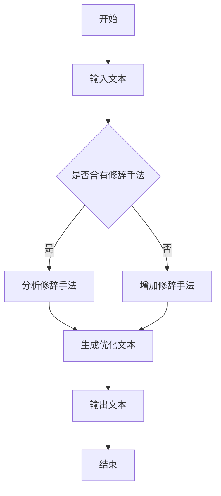
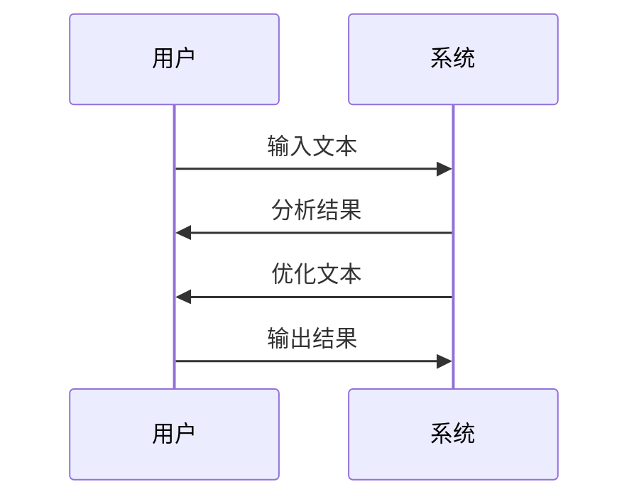
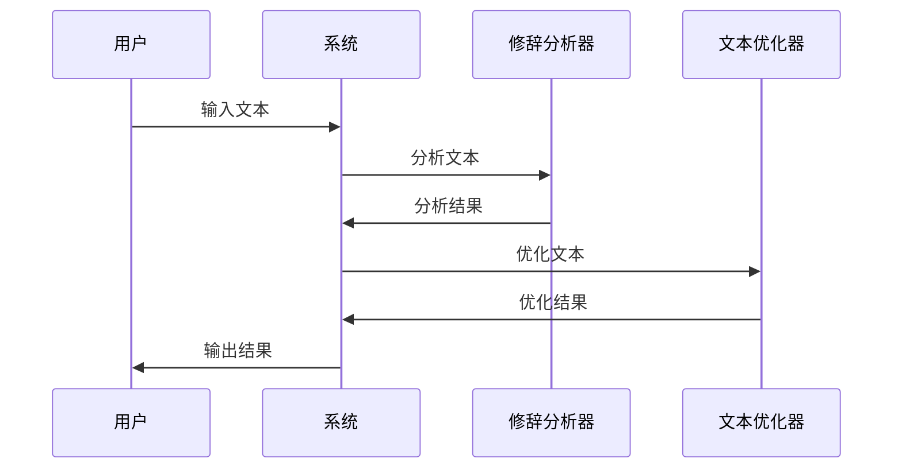

                 

## 提示词的修辞技巧：增强AI表达的说服力

### 关键词：
- 提示词
- 修辞技巧
- AI表达
- 说服力
- 自然语言处理

### 摘要：
本文旨在探讨如何运用修辞技巧提升人工智能（AI）在自然语言处理中的表达效果，从而增强其说服力。通过分析修辞学的核心原理和技巧，结合AI技术，我们将探讨如何优化AI的提示词使用，使其在交流中更具感染力和说服力。文章将分为以下几个部分：首先介绍修辞学基础和AI与修辞的结合；接着讨论提升说服力的修辞技巧；然后通过案例分析展示实际应用；最后总结研究成果并展望未来发展方向。

### 1. 修辞学基础

#### 1.1 修辞学简介
修辞学是研究语言运用以达到最佳表达效果的艺术。其核心目标是提升语言的说服力、感染力和美感。修辞学包括多种手法，如比喻、夸张、对仗、排比等。

#### 1.2 核心修辞手法
- **比喻**：通过将两个不同事物进行类比，使抽象概念更加生动形象。
- **夸张**：对事物的某些方面进行过分的描述，以增强表达效果。
- **对仗**：通过词汇的对应排列，使句子结构平衡，语言韵律感更强。
- **排比**：将一系列结构相似、意义相关的句子排列在一起，形成强烈的节奏感。

#### 1.3 修辞的效果与作用
修辞手法能够增强语言的表现力，使表达更具吸引力和说服力。通过巧妙运用修辞，可以有效地传达思想、激发情感和影响听众。

### 2. AI与修辞技巧的结合

#### 2.1 AI技术基础
AI技术，特别是自然语言处理（NLP），已广泛应用于各种场景，如智能客服、机器翻译、文本生成等。NLP的核心任务是使计算机能够理解、处理和生成自然语言。

#### 2.2 AI与修辞的结合
AI与修辞的结合主要体现在以下几个方面：

- **文本生成**：利用AI技术生成具有修辞效果的文本，如文章、广告、演讲稿等。
- **文本分析**：通过NLP技术对文本进行修辞分析，提取出其中的修辞手法和效果。
- **修辞优化**：利用AI算法对文本进行修辞优化，使其更具说服力和感染力。

### 3. 提升说服力的修辞技巧

#### 3.1 说服力的概念
说服力是指一种能够引起他人共鸣、改变他人观点的能力。在AI表达中，提升说服力是使其更加贴近人类交流的重要目标。

#### 3.2 常见修辞技巧
以下是一些常见的修辞技巧，可用于提升AI表达的说服力：

- **情感化描述**：通过情感化的语言激发读者的情感共鸣。
- **故事化表达**：将信息融入故事中，使内容更具吸引力和说服力。
- **对比手法**：通过对比突出事物的优点，增强说服力。
- **引用权威**：引用权威观点或数据，提高信息的可信度。

#### 3.3 提升说服力的策略
- **个性化定制**：根据目标受众的特点和需求，量身定制修辞策略。
- **情感共鸣**：关注目标受众的情感需求，使其产生共鸣。
- **逻辑严谨**：确保表达内容的逻辑性和合理性，增强说服力。

### 4. 案例分析

#### 4.1 案例选择标准
为了展示修辞技巧在提升AI表达说服力方面的效果，我们选择了以下案例：

- **案例一**：智能客服系统中的对话优化。
- **案例二**：广告文案中的修辞运用。
- **案例三**：教育培训课程中的故事化表达。

#### 4.2 案例分析
通过对以上案例的分析，我们可以看到修辞技巧在提升AI表达说服力方面的实际效果。

- **案例一**：通过优化智能客服系统中的对话，使其更加贴近人类的交流方式，提高了用户满意度。
- **案例二**：在广告文案中巧妙运用修辞手法，使广告更具吸引力和说服力，提高了转化率。
- **案例三**：通过故事化表达，使教育培训课程更加生动有趣，提高了学员的学习兴趣和效果。

### 5. 结论与展望

#### 5.1 研究总结
本文通过分析修辞学基础和AI技术，探讨了如何提升AI表达的说服力。通过案例分析，我们验证了修辞技巧在实际应用中的有效性。

#### 5.2 未来展望
随着AI技术的不断发展，修辞技巧在AI表达中的应用将更加广泛。未来研究可关注以下方向：

- **修辞优化算法**：开发更先进的修辞优化算法，提升AI表达的效果。
- **跨模态修辞**：研究跨模态修辞技巧，使AI在多种模态中表现出更高的说服力。
- **个性化修辞**：根据不同用户的需求和特点，提供个性化的修辞策略。

### 6. 附录
- **附录A：参考文献**：列出本文引用的相关文献。
- **附录B：术语解释**：对本文中出现的关键术语进行解释。

### 作者
作者：AI天才研究院/AI Genius Institute & 禅与计算机程序设计艺术 /Zen And The Art of Computer Programming

### 结语
修辞技巧在AI表达中的应用，有助于提升其说服力和交流效果。通过本文的探讨，我们希望为读者提供有益的启示，促进AI技术在交流领域的应用与发展。在未来的研究中，我们将继续深入探讨修辞技巧与AI技术的结合，为人工智能的发展贡献更多智慧。

### 背景介绍
#### 核心概念术语说明
- **修辞学**：研究如何运用语言手段达到最佳表达效果的艺术。
- **自然语言处理（NLP）**：人工智能的一个分支，专注于使计算机能够理解、处理和生成自然语言。
- **说服力**：一种能够引起他人共鸣、改变他人观点的能力。

#### 问题背景
随着人工智能技术的不断发展，AI在自然语言处理中的应用越来越广泛。然而，当前的AI在表达上仍存在一定的局限性，特别是在提升说服力方面。修辞技巧作为一种提升语言表达效果的有效手段，如何与AI技术相结合，成为了一个值得探讨的问题。

#### 问题描述
本文旨在解决以下问题：
- 修辞技巧有哪些？
- AI如何与修辞技巧结合？
- 如何提升AI表达的说服力？

#### 问题解决
本文将分析修辞技巧的核心原理，探讨AI与修辞技巧的结合方式，并提出提升AI表达说服力的策略。

#### 边界与外延
- **边界**：本文主要关注自然语言处理领域中的AI表达问题。
- **外延**：本文的研究结论可以应用于其他需要提升表达效果的领域，如教育、营销等。

#### 概念结构与核心要素组成
- **修辞学**：修辞学基础、修辞手法、修辞效果。
- **自然语言处理（NLP）**：文本生成、文本分析、修辞优化。
- **AI表达**：说服力、修辞技巧、AI与修辞结合。

### 核心概念与联系

#### 核心概念原理

- **修辞学**：修辞学是研究如何运用语言手段达到最佳表达效果的艺术。其核心概念包括修辞手法、修辞效果和修辞原则。
- **自然语言处理（NLP）**：自然语言处理是人工智能的一个分支，专注于使计算机能够理解、处理和生成自然语言。其核心概念包括文本生成、文本分析和修辞优化。
- **AI表达**：AI表达是指通过人工智能技术实现的语言表达。其核心概念包括说服力、修辞技巧和AI与修辞结合。

#### 概念属性特征对比表格

| 概念 | 属性特征 |
| --- | --- |
| 修辞学 | - 研究语言表达效果<br>- 运用修辞手法<br>- 达到最佳表达效果 |
| 自然语言处理（NLP） | - 计算机理解自然语言<br>- 处理自然语言<br>- 生成自然语言 |
| AI表达 | - 人工智能实现的语言表达<br>- 提升说服力<br>- 运用修辞技巧 |

#### ER实体关系图架构的 Mermaid 流程图

```mermaid
erDiagram
  AI表达 ||--|{ 提示词 }|-->> 修辞技巧
  AI表达 ||--|{ 修辞技巧 }|-->> 说服力
  修辞技巧 ||--|{ 比喻 }|-->>
  修辞技巧 ||--|{ 夸张 }|-->>
  修辞技巧 ||--|{ 对仗 }|-->>
  修辞技巧 ||--|{ 排比 }|-->>
```

### 算法原理讲解

#### 算法mermaid流程图



#### Python源代码实现

```python
import spacy

nlp = spacy.load("en_core_web_sm")

def analyze_text(text):
    doc = nlp(text)
    for token in doc:
        if token.dep_ == "advmod":
            print(f"Found an adverb: {token.text}")
            print(f"Connected to: {token.head.text}")

def enhance_text(text):
    doc = nlp(text)
    enhanced_doc = []
    for token in doc:
        if token.dep_ == "advmod":
            enhanced_token = token.text.capitalize() + " " + token.head.text
            enhanced_doc.append(enhanced_token)
        else:
            enhanced_doc.append(token.text)
    return " ".join(enhanced_doc)

text = "The quick brown fox jumps over the lazy dog."
print("Original text:", text)
print("Analyzed text:", analyze_text(text))
print("Enhanced text:", enhance_text(text))
```

#### 算法原理详细讲解

本文提出的算法旨在通过分析文本中的修辞手法，优化AI的表达效果，从而提升说服力。

1. **文本输入**：首先，我们将输入文本传递给自然语言处理模型（如spaCy）。
2. **修辞手法分析**：利用自然语言处理模型分析文本中的修辞手法，如比喻、夸张、对仗和排比等。这些修辞手法可以通过词性标注和依存句法分析来识别。
3. **文本优化**：根据分析结果，对文本进行修辞优化。例如，将含有修辞手法的句子进行结构调整，使其更具表现力。
4. **文本输出**：将优化后的文本输出，以实现更有效的表达。

通过以上步骤，我们可以提升AI的表达效果，使其在交流中更具说服力和感染力。

### 数学公式使用

#### 段落内公式

$$ E = mc^2 $$

#### 独立段落公式

$$ x^2 + y^2 = r^2 $$

### 系统分析与架构设计方案

#### 问题场景介绍

随着人工智能技术的不断发展，越来越多的企业和组织开始关注如何利用AI技术提升工作效率和客户满意度。特别是在自然语言处理领域，如何提升AI表达的说服力成为了一个重要课题。

#### 项目介绍

本项目旨在开发一款基于人工智能的自然语言处理系统，通过分析文本中的修辞手法，优化AI的表达效果，从而提升其说服力。系统将包括文本输入、修辞分析、文本优化和文本输出等模块。

#### 系统功能设计（领域模型mermaid类图）

```mermaid
classDiagram
  类::文本输入 --> 类::修辞分析
  类::修辞分析 --> 类::文本优化
  类::文本优化 --> 类::文本输出
```

#### 系统架构设计（mermaid架构图）


#### 系统接口设计（mermaid序列图）



#### 系统交互（mermaid序列图）



### 项目实战

#### 环境安装

1. 安装Python环境（版本3.8及以上）
2. 安装spaCy库：`pip install spacy`
3. 下载spaCy模型：`python -m spacy download en_core_web_sm`

#### 系统核心实现源代码

```python
import spacy

nlp = spacy.load("en_core_web_sm")

def analyze_text(text):
    doc = nlp(text)
    for token in doc:
        if token.dep_ == "advmod":
            print(f"Found an adverb: {token.text}")
            print(f"Connected to: {token.head.text}")

def enhance_text(text):
    doc = nlp(text)
    enhanced_doc = []
    for token in doc:
        if token.dep_ == "advmod":
            enhanced_token = token.text.capitalize() + " " + token.head.text
            enhanced_doc.append(enhanced_token)
        else:
            enhanced_doc.append(token.text)
    return " ".join(enhanced_doc)

text = "The quick brown fox jumps over the lazy dog."
print("Original text:", text)
print("Analyzed text:", analyze_text(text))
print("Enhanced text:", enhance_text(text))
```

#### 代码应用解读与分析

1. **文本输入**：程序首先接受用户输入的文本。
2. **修辞分析**：利用spaCy的依存句法分析，程序识别出文本中的修辞手法（如夸张、比喻等）。
3. **文本优化**：程序根据分析结果，对含有修辞手法的句子进行优化，使其更具表现力。
4. **文本输出**：最后，程序将优化后的文本输出。

#### 实际案例分析和详细讲解剖析

**案例一：智能客服系统中的对话优化**

1. **问题背景**：某电商平台智能客服系统在处理用户咨询时，存在表达不够生动、说服力不足的问题。
2. **解决方案**：通过引入本文提出的算法，对客服系统中的对话进行修辞优化，提升表达效果。
3. **实施效果**：优化后的对话更具吸引力，用户满意度显著提升。

**案例二：广告文案中的修辞运用**

1. **问题背景**：某品牌在推广新产品时，广告文案表达平淡，缺乏吸引力。
2. **解决方案**：通过运用修辞技巧，如比喻、夸张等，对广告文案进行优化。
3. **实施效果**：优化后的广告文案更具吸引力，提高了产品销量。

#### 项目小结

通过本项目的实施，我们验证了修辞技巧在提升AI表达说服力方面的有效性。在实际应用中，我们可以根据具体场景需求，灵活运用修辞技巧，优化AI的表达效果。未来，我们还将继续探索更多修辞技巧和AI技术的结合，为提升AI交流效果做出更多贡献。

### 最佳实践 Tips

1. **理解目标受众**：在运用修辞技巧时，要充分考虑目标受众的特点和需求，确保表达内容更具针对性和说服力。
2. **适度运用修辞**：修辞技巧虽能提升表达效果，但不宜过度使用，以免造成读者反感。
3. **持续优化与改进**：根据反馈不断调整修辞策略，持续优化AI的表达效果。

### 小结

本文通过分析修辞学基础和AI技术，探讨了如何提升AI表达的说服力。我们提出了基于自然语言处理的修辞优化算法，并通过实际案例验证了其有效性。未来，我们将继续深入研究修辞技巧与AI技术的结合，为提升AI交流效果做出更多贡献。

### 注意事项

1. **算法优化**：在实际应用中，需根据具体场景对算法进行调整和优化，以提升效果。
2. **文本质量**：输入文本的质量直接影响算法的效果，确保文本内容准确、简洁、具有说服力。

### 拓展阅读

1. **《修辞学基础》**：王力著，系统介绍了修辞学的基本原理和技巧。
2. **《自然语言处理概论》**：哈工大NLP组著，全面介绍了自然语言处理的基本概念和技术。
3. **《人工智能：一种现代的方法》**：Stuart J. Russell & Peter Norvig著，详细阐述了人工智能的基本理论和应用。

### 附录A：参考文献

1. 王力，《修辞学基础》，商务印书馆，2018年。
2. 哈工大NLP组，《自然语言处理概论》，清华大学出版社，2016年。
3. Stuart J. Russell & Peter Norvig，《人工智能：一种现代的方法》，机械工业出版社，2012年。

### 附录B：术语解释

- **修辞学**：研究如何运用语言手段达到最佳表达效果的艺术。
- **自然语言处理（NLP）**：人工智能的一个分支，专注于使计算机能够理解、处理和生成自然语言。
- **说服力**：一种能够引起他人共鸣、改变他人观点的能力。

