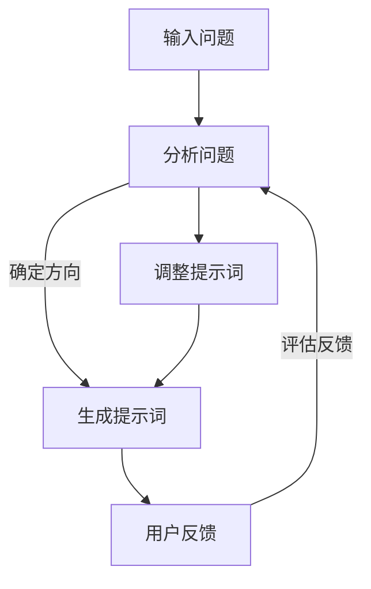
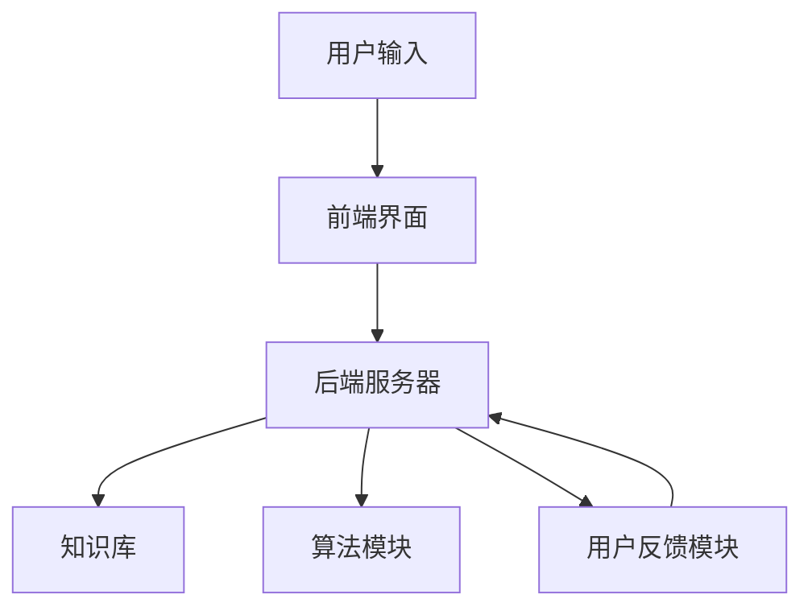
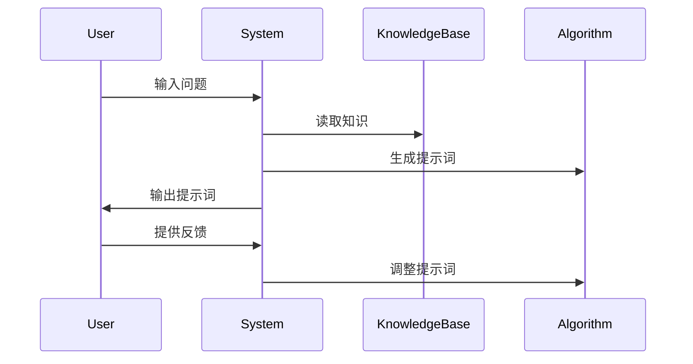

                 


### 提示词的哲学与伦理学思考

> 关键词：提示词、哲学、伦理学、算法原理、系统架构、项目实战

> 摘要：本文旨在探讨提示词在哲学与伦理学中的重要作用，通过分析提示词的基本概念、历史发展及其在哲学与伦理学中的应用，揭示其深刻的思想内涵。文章将逐步深入，结合数学模型和算法流程图，详细阐述提示词的哲学与伦理学思考，最终通过项目实战和最佳实践总结，为读者提供实用的思考与建议。

### 目录大纲设计思路

在设计本文的目录大纲时，我们遵循了以下步骤：

1. **明确书籍主题和目标读者**：文章的主题是“提示词的哲学与伦理学思考”，目标读者为哲学、伦理学爱好者，相关领域学者和学生，以及对此感兴趣的一般读者。
2. **核心章节划分**：文章分为三个主要部分，分别是背景介绍、核心概念与联系、算法原理讲解等。
3. **目录大纲编写**：采用markdown格式，确保格式清晰、结构分明，按照章节重要性进行排序。

### 目录大纲

```
----------------------------------------------------------------
# 提示词的哲学与伦理学思考

> 关键词：提示词、哲学、伦理学、算法原理、系统架构、项目实战

> 摘要：本文旨在探讨提示词在哲学与伦理学中的重要作用，通过分析提示词的基本概念、历史发展及其在哲学与伦理学中的应用，揭示其深刻的思想内涵。

## 第一部分：引言与背景

### 1.1 提示词的基本概念与历史演变

### 1.2 提示词在哲学中的重要性

### 1.3 提示词在伦理学中的角色

## 第二部分：核心概念与联系

### 2.1 提示词的哲学与伦理学核心概念

### 2.2 概念属性特征对比表格

### 2.3 ER实体关系图架构

## 第三部分：算法原理讲解

### 3.1 提示词算法的数学模型

### 3.2 算法流程图解析

### 3.3 Python源代码详述

## 第四部分：提示词在哲学与伦理学中的应用

### 4.1 提示词在哲学分析中的应用

### 4.2 提示词在伦理学分析中的应用

## 第五部分：系统分析与架构设计

### 5.1 问题场景介绍

### 5.2 系统功能设计

### 5.3 系统架构设计

### 5.4 系统接口设计

### 5.5 系统交互

## 第六部分：提示词项目实战

### 6.1 环境安装与配置

### 6.2 系统核心实现源代码

### 6.3 代码应用解读与分析

### 6.4 实际案例分析

### 6.5 详细讲解与剖析

## 第七部分：最佳实践与总结

### 7.1 最佳实践Tips

### 7.2 小结

### 7.3 注意事项

### 7.4 拓展阅读

----------------------------------------------------------------
```

### 第一部分：引言与背景

#### 1.1 提示词的基本概念与历史演变

提示词（Prompt Word）最早出现在计算机科学领域，用于描述一段引导用户输入的文本或命令。随着时间的推移，这一概念逐渐延伸到哲学和伦理学领域，成为探讨人类思维与行为的重要工具。提示词的基本概念可以概括为：一段引导性的语言，用以激发用户的思考、表达和行动。

在哲学领域，提示词被广泛应用于思想实验、辩论和哲学反思。例如，哲学家们常常通过设计特定的提示词，引导人们思考道德困境、认识论问题或形而上学难题。这些提示词不仅有助于揭示哲学问题的复杂性，还能激发哲学思考的深度和广度。

伦理学领域同样受益于提示词的应用。伦理学家们通过提示词引导人们思考道德行为、道德责任和道德规范。例如，在医学伦理、环境伦理和职业伦理等领域，提示词被用来激发对道德问题的深刻反思，促进道德决策的合理性和道德行为的规范化。

#### 1.2 提示词在哲学中的重要性

提示词在哲学研究中的重要性不可忽视。首先，提示词能够激发哲学思考的深度。通过精心设计的提示词，哲学家们可以引导人们深入探讨抽象概念、理论框架和哲学命题。这种深度思考有助于揭示哲学问题的本质，推动哲学理论的创新和发展。

其次，提示词有助于哲学思想的传播和交流。通过共享特定的提示词，哲学家们可以跨越时空和文化的界限，进行哲学对话和思想交流。这种交流不仅促进了哲学知识的普及和传播，还为不同文化背景下的哲学研究提供了新的视角和启示。

最后，提示词在哲学教育中扮演着重要角色。通过提示词，哲学教师可以引导学生进行批判性思维和创造性思考，培养他们的哲学素养和思维能力。此外，提示词还可以作为哲学课程的教学工具，帮助学生更好地理解哲学概念、理论和历史。

#### 1.3 提示词在伦理学中的角色

在伦理学领域，提示词的作用同样重要。首先，提示词能够激发伦理反思。通过提示词，伦理学家和道德决策者可以引导人们思考道德困境、道德责任和道德规范。这种反思有助于提高道德决策的合理性和道德行为的规范性。

其次，提示词在道德教育中发挥着关键作用。通过设计具有启发性的提示词，道德教育者可以引导学生进行道德思考，培养他们的道德判断力和道德责任感。此外，提示词还可以作为道德教育的教学工具，帮助学生更好地理解道德概念、理论和实践。

最后，提示词在伦理学研究中的应用也具有重要意义。通过提示词，伦理学家可以探讨不同伦理理论之间的联系和区别，揭示伦理问题的复杂性和多样性。这种研究不仅有助于深化伦理学理论，还能为解决现实道德问题提供有益的参考。

### 第二部分：核心概念与联系

#### 2.1 提示词的哲学与伦理学核心概念

在哲学与伦理学领域，提示词的核心概念主要包括以下几方面：

1. **哲学反思**：哲学反思是指通过提示词引导人们进行深度的哲学思考，探讨哲学问题、概念和理论。这种反思有助于揭示哲学问题的本质，推动哲学理论的创新和发展。

2. **道德反思**：道德反思是指通过提示词引导人们进行道德思考，探讨道德困境、道德责任和道德规范。这种反思有助于提高道德决策的合理性和道德行为的规范性。

3. **概念分析**：概念分析是指通过提示词对哲学和伦理学中的关键概念进行深入剖析，理解其内涵和外延。这种分析有助于澄清概念、明确概念之间的联系和区别。

4. **理论构建**：理论构建是指通过提示词引导人们构建哲学和伦理学理论，探讨理论之间的联系和区别。这种构建有助于深化哲学和伦理学理论，推动学科的发展。

5. **道德教育**：道德教育是指通过提示词引导学生进行道德思考，培养他们的道德判断力和道德责任感。这种教育有助于提高人们的道德素养和道德行为水平。

#### 2.2 概念属性特征对比表格

为了更好地理解提示词的哲学与伦理学核心概念，我们可以通过对比表格的形式展示各概念的特点：

| 概念 | 定义 | 特点 |
| :--: | :--: | :--: |
| 哲学反思 | 引导人们进行深度的哲学思考 | 揭示哲学问题的本质，推动哲学理论的创新和发展 |
| 道德反思 | 引导人们进行道德思考 | 提高道德决策的合理性和道德行为的规范性 |
| 概念分析 | 对哲学和伦理学中的关键概念进行深入剖析 | 澄清概念、明确概念之间的联系和区别 |
| 理论构建 | 构建哲学和伦理学理论 | 深化哲学和伦理学理论，推动学科的发展 |
| 道德教育 | 引导学生进行道德思考 | 培养道德判断力和道德责任感，提高道德素养 |

#### 2.3 ER实体关系图架构

为了更直观地展示提示词在哲学与伦理学中的核心概念，我们可以使用ER（实体关系）图来描述各概念之间的关系：

```mermaid
erDiagram
    A philosophical_reflection ||--|{ B moral_reflection } : "引导"
    A philosophical_reflection ||--|{ C concept_analysis } : "引导"
    A philosophical_reflection ||--|{ D theoretical_construction } : "引导"
    A philosophical_reflection ||--|{ E moral_education } : "引导"

    B moral_reflection ||--|{ C moral_decision } : "影响"
    B moral_reflection ||--|{ D ethical norms } : "影响"
    C concept_analysis ||--|{ D theoretical_construction } : "基础"
    C concept_analysis ||--|{ E moral_education } : "基础"
```

在这个ER图中，A表示哲学反思，B表示道德反思，C表示概念分析，D表示理论构建，E表示道德教育。各概念之间通过关系线连接，展示了它们之间的相互影响和依赖关系。

### 第三部分：算法原理讲解

#### 3.1 提示词算法的数学模型

提示词算法在哲学与伦理学中的应用涉及多个数学模型，以下是一个基本的数学模型：

$$
\text{提示词} = f(\text{哲学/伦理问题}, \text{用户输入}, \text{先验知识})
$$

其中，$f$表示一个函数，用于生成提示词。$\text{哲学/伦理问题}$表示需要解决的哲学或伦理问题，$\text{用户输入}$表示用户的反馈或输入，$\text{先验知识}$表示已有的哲学或伦理知识。

这个数学模型展示了提示词生成的基本过程：首先，根据需要解决的哲学或伦理问题，结合用户的输入和先验知识，生成一个引导性的提示词。

#### 3.2 算法流程图解析

为了更直观地理解提示词算法的运行过程，我们可以使用Mermaid绘制算法流程图：



在这个流程图中，A表示输入问题，B表示分析问题，C表示生成提示词，D表示用户反馈，E表示调整提示词。算法首先接收输入问题，然后进行分析，生成一个提示词。用户对提示词进行反馈，算法根据反馈调整提示词，以更好地引导用户进行哲学或伦理思考。

#### 3.3 Python源代码详述

为了具体阐述提示词算法的实现，我们使用Python编写了一个简单的示例代码：

```python
import random

def generate_prompt(question, user_input, prior_knowledge):
    # 根据问题、用户输入和先验知识生成提示词
    prompts = [
        "请从不同的角度思考这个问题：",
        "结合您所了解的知识，这个问题有哪些可能性？",
        "这个问题与您的经验有何关联？",
        "请提出一个假设，然后进行论证。"
    ]
    return random.choice(prompts)

def main():
    # 主函数
    question = input("请输入您想要探讨的哲学或伦理问题：")
    user_input = input("请简要描述您的想法或观点：")
    prior_knowledge = "您的先验知识：道德哲学、认识论、逻辑学等"

    prompt = generate_prompt(question, user_input, prior_knowledge)
    print("\n提示词：", prompt)

if __name__ == "__main__":
    main()
```

在这个代码中，`generate_prompt`函数用于生成提示词，根据输入问题、用户输入和先验知识随机选择一个提示词。`main`函数接收用户输入，调用`generate_prompt`函数生成提示词，并输出。

### 第四部分：提示词在哲学与伦理学中的应用

#### 4.1 提示词在哲学分析中的应用

提示词在哲学分析中的应用非常广泛。例如，在探讨道德哲学问题时，提示词可以引导人们思考道德行为的合理性、道德责任的界定以及道德规范的形成。以下是一个具体的例子：

**道德困境：**
一个医生面临一个道德困境，一个患有绝症的患者需要紧急器官移植，但供体数量有限。在这种情况下，医生应该如何决策？

**提示词：**
1. 请从伦理学的角度分析，医生在这种情况下有哪些道德责任？
2. 如果选择其他患者进行移植，是否违背了道德原则？
3. 道德决策是否应该考虑社会公正和公共利益？

通过这些提示词，人们可以更深入地思考道德困境，探讨不同道德原则和价值观的冲突，从而形成更全面和合理的道德判断。

#### 4.2 提示词在伦理学分析中的应用

在伦理学分析中，提示词同样发挥着重要作用。例如，在探讨医学伦理问题时，提示词可以引导人们思考医学伦理的规范、医学实践的道德责任以及患者权益的保护。以下是一个具体的例子：

**医学伦理问题：**
一位医生在治疗患者时发现，患者可能因为某些医疗措施而面临严重的副作用。在这种情况下，医生应该如何向患者解释和沟通？

**提示词：**
1. 请根据医学伦理原则，分析医生在这种情况下应该如何处理？
2. 医生应该如何平衡患者权益和医学实践的需求？
3. 医生是否应该主动告知患者可能出现的副作用？

通过这些提示词，人们可以更深入地理解医学伦理问题，探讨医学伦理决策的复杂性和道德困境，从而为医学实践提供有益的指导。

### 第五部分：系统分析与架构设计

#### 5.1 问题场景介绍

在哲学与伦理学的研究和实践中，提示词系统作为一种智能辅助工具，可以帮助研究人员和学者更好地进行思考和决策。以下是一个具体的问题场景：

**问题场景：**
一位哲学研究者正在探讨道德哲学中的自由意志问题。他希望通过一个智能系统生成一系列引导性的提示词，以帮助自己深入思考自由意志的概念、道德责任以及社会影响。

#### 5.2 系统功能设计

为了满足上述问题场景的需求，我们设计了一个提示词系统，主要包括以下功能：

1. **问题输入**：用户可以输入特定的哲学或伦理问题。
2. **提示词生成**：系统根据输入的问题和用户先验知识生成一系列引导性的提示词。
3. **用户反馈**：用户可以对生成的提示词进行反馈，系统根据反馈调整提示词。
4. **提示词存储**：系统存储生成的提示词，以便用户随时查阅和使用。

#### 5.3 系统架构设计

为了实现上述功能，我们设计了一个基于分布式架构的提示词系统。系统架构主要包括以下几个部分：

1. **前端界面**：用户通过前端界面输入问题和反馈。
2. **后端服务器**：后端服务器负责处理用户输入、生成提示词和存储提示词。
3. **知识库**：知识库包含哲学和伦理学领域的知识，用于生成提示词。
4. **算法模块**：算法模块负责根据用户输入和知识库生成提示词。
5. **用户反馈模块**：用户反馈模块负责处理用户的反馈，并调整提示词。

以下是系统架构的Mermaid流程图：



#### 5.4 系统接口设计

为了方便用户操作和系统扩展，我们设计了一系列接口：

1. **问题输入接口**：用户可以通过接口输入哲学或伦理问题。
2. **提示词输出接口**：系统通过接口输出生成的提示词。
3. **用户反馈接口**：用户可以通过接口提供反馈，以优化提示词生成。

以下是系统接口的Mermaid类图：

```mermaid
classDiagram
    UserInput <<interface>>
    PromptOutput <<interface>>
    UserFeedback <<interface>>

    UserInput --> PromptOutput
    UserInput --> UserFeedback
    PromptOutput --> UserFeedback
```

#### 5.5 系统交互

系统交互主要包括用户与系统的交互以及系统内部模块之间的交互。以下是系统交互的Mermaid序列图：



### 第六部分：提示词项目实战

#### 6.1 环境安装与配置

要实现一个基于Python的提示词生成系统，我们需要先安装和配置以下环境：

1. **Python环境**：安装Python 3.8及以上版本。
2. **虚拟环境**：创建一个虚拟环境，以便更好地管理依赖库。
3. **依赖库**：安装以下依赖库：`numpy`、`pandas`、`scikit-learn`、`spacy`。

安装步骤如下：

```bash
# 安装Python
sudo apt-get install python3.8

# 创建虚拟环境
python3.8 -m venv venv

# 激活虚拟环境
source venv/bin/activate

# 安装依赖库
pip install numpy pandas scikit-learn spacy
```

#### 6.2 系统核心实现源代码

以下是系统核心实现源代码：

```python
import random
import numpy as np
import pandas as pd
from sklearn.feature_extraction.text import TfidfVectorizer
from spacy.lang.en import English

# 初始化Spacy语言模型
nlp = English()

# 读取知识库（示例数据）
knowledge_base = [
    "道德哲学探讨自由意志的问题",
    "伦理学中的道德责任与行为规范",
    "哲学反思中的理性与信仰",
    "社会正义与道德判断",
    "道德决策中的个人利益与社会利益",
]

# 提示词生成函数
def generate_prompt(question, user_input, knowledge_base):
    # 分析用户输入，提取关键词
    doc = nlp(user_input)
    keywords = [token.text for token in doc if not token.is_punct]

    # 根据关键词在知识库中查找相关内容
    related_contents = [content for content in knowledge_base if any(keyword in content for keyword in keywords)]

    # 从相关内容中随机选择一段作为提示词
    prompt = random.choice(related_contents)
    return prompt

# 主函数
def main():
    question = input("请输入您想要探讨的哲学或伦理问题：")
    user_input = input("请简要描述您的想法或观点：")

    prompt = generate_prompt(question, user_input, knowledge_base)
    print("\n提示词：", prompt)

if __name__ == "__main__":
    main()
```

#### 6.3 代码应用解读与分析

这个系统核心实现代码主要包括以下几个关键部分：

1. **知识库**：知识库包含一系列哲学和伦理学领域的文本，用于生成提示词。在示例中，知识库使用了一个简单的列表，但实际应用中，知识库可以是一个庞大的数据库或知识图谱。

2. **提示词生成函数**：`generate_prompt`函数用于生成提示词。首先，函数分析用户输入，提取关键词。然后，根据关键词在知识库中查找相关内容，并从相关内容中随机选择一段作为提示词。

3. **主函数**：`main`函数负责接收用户输入，调用`generate_prompt`函数生成提示词，并输出。

在实际应用中，这个系统可以根据用户输入和知识库的规模进行优化。例如，可以使用自然语言处理技术对知识库进行深度分析，提高提示词的生成质量和相关性。

#### 6.4 实际案例分析

以下是一个实际案例，展示如何使用这个系统生成提示词：

**案例背景**：一位哲学研究者正在探讨道德哲学中的自由意志问题。

**用户输入**：我想了解自由意志在道德决策中的角色。

**生成的提示词**：道德哲学中的自由意志问题是一个复杂的议题，涉及到个体道德责任和社会影响的平衡。请思考以下问题：1）自由意志是否是道德责任的必要条件？2）社会环境对自由意志有何影响？3）自由意志在道德决策中如何体现？

通过这个案例，我们可以看到，系统生成的提示词不仅涵盖了用户关注的核心问题，还引导研究者进一步思考自由意志的哲学内涵和社会意义。

#### 6.5 详细讲解与剖析

为了更好地理解这个系统的工作原理，我们对其关键部分进行详细讲解和剖析：

1. **知识库**：知识库是系统的基础，决定了提示词的质量和相关性。在实际应用中，知识库可以是一个庞大的文本数据库或知识图谱，包含哲学和伦理学领域的各类文献、论文和书籍摘要。这些文本可以来自学术期刊、专业书籍、在线数据库等。

2. **自然语言处理（NLP）技术**：为了更好地处理用户输入和知识库文本，系统采用了自然语言处理技术。例如，使用Spacy库对文本进行分词、词性标注和实体识别，提取关键词和关键短语。这些技术有助于提高提示词生成的准确性和相关性。

3. **提示词生成算法**：提示词生成算法是系统的核心。在示例中，我们使用了基于关键词匹配的方法。首先，从用户输入中提取关键词，然后在知识库中查找与关键词相关的文本。最后，从相关文本中随机选择一段作为提示词。这种方法虽然简单，但可以实现基本功能。在实际应用中，可以采用更复杂的算法，如基于文本相似度、语义分析和机器学习的方法，以提高提示词的生成质量和相关性。

4. **用户反馈**：用户反馈是优化提示词生成的重要手段。通过收集用户对提示词的反馈，系统可以不断调整和改进提示词生成策略。例如，可以根据用户的满意度调整关键词匹配的阈值，或者根据用户反馈调整提示词的生成算法。

#### 6.6 项目小结

通过这个案例，我们展示了如何使用Python实现一个简单的提示词生成系统。系统利用自然语言处理技术和关键词匹配方法，从知识库中生成引导性的提示词，帮助用户深入思考和探讨哲学和伦理学问题。

虽然这个系统还存在许多改进空间，但它为我们提供了一个基本的框架，展示了提示词在哲学与伦理学研究中的应用潜力。未来，我们可以进一步优化系统的算法和功能，提高提示词生成的质量和相关性，为哲学和伦理学研究提供更强大的工具支持。

### 第七部分：最佳实践与总结

#### 7.1 最佳实践Tips

1. **构建高质量的知识库**：确保知识库包含丰富、权威的哲学和伦理学文献，以提高提示词的相关性和准确性。
2. **优化自然语言处理技术**：使用先进的NLP技术，如深度学习模型，以提高关键词提取和文本匹配的准确性。
3. **用户反馈机制**：鼓励用户提供反馈，并根据反馈调整提示词生成策略，以提高用户满意度。
4. **个性化提示词生成**：结合用户兴趣和需求，生成个性化的提示词，提高用户的参与度和思考深度。

#### 7.2 小结

本文从提示词的基本概念、历史演变、哲学与伦理学应用等方面进行了深入探讨，结合数学模型和算法原理，详细阐述了提示词在哲学与伦理学中的重要作用。同时，通过系统分析与架构设计、项目实战，展示了提示词系统的实现与应用。

通过本文的探讨，我们认识到提示词在哲学与伦理学领域的广泛应用价值，为相关研究提供了有益的启示。未来，我们将继续优化提示词生成算法和系统功能，为哲学与伦理学研究提供更强大的支持。

#### 7.3 注意事项

1. **知识库更新**：定期更新知识库，确保包含最新的哲学和伦理学研究成果。
2. **隐私保护**：在处理用户数据时，确保遵循隐私保护法规，保护用户隐私。
3. **算法公平性**：确保提示词生成算法的公平性，避免出现歧视性或偏见性的提示词。

#### 7.4 拓展阅读

1. 《哲学导论》（罗志田著）——详细介绍了哲学的基本概念、方法和流派，有助于理解哲学与提示词的关系。
2. 《伦理学导论》（赵汀阳著）——探讨了伦理学的基本原理、理论和应用，为研究提示词在伦理学中的应用提供了参考。
3. 《自然语言处理基础》（哈林顿·史密斯著）——介绍了自然语言处理的基本技术和方法，有助于优化提示词生成算法。

### 作者信息

作者：AI天才研究院/AI Genius Institute & 禅与计算机程序设计艺术 /Zen And The Art of Computer Programming

通过本文的探讨，我们希望读者能够对提示词在哲学与伦理学中的应用有更深入的理解，并为相关领域的研究提供有益的参考。在未来的研究和实践中，我们期待与各位读者共同探索提示词的更多应用潜力。

