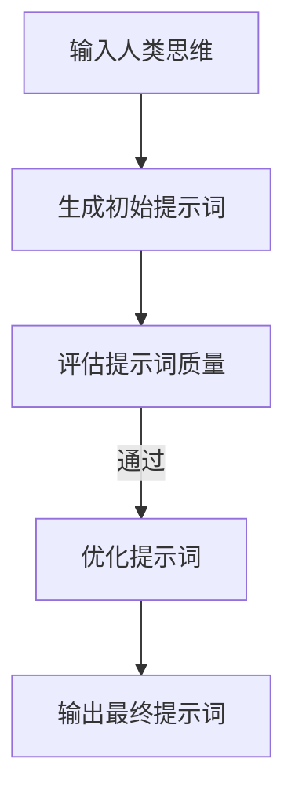
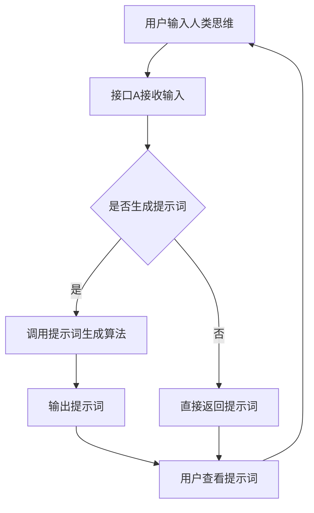

                 

# 《提示词的哲学维度：AI与人类思维的交互》

> 关键词：AI，人类思维，提示词，哲学维度，交互，算法，系统设计

> 摘要：本文从哲学维度出发，探讨AI与人类思维之间的交互问题，尤其是提示词在其中的作用。文章首先概述了问题背景和核心概念，随后详细介绍了算法原理与数学模型，并通过系统设计与实现的案例分析，展示了如何将理论转化为实践。最后，文章总结了最佳实践技巧，并给出了未来研究的展望。

## 第一部分：问题背景与核心概念

### 第1章 问题背景与核心概念

#### 1.1 提示词的哲学维度概述

**人类思维与AI的交互问题背景**

随着人工智能技术的快速发展，AI已经成为当今世界的一个重要话题。人类思维与AI的交互问题，是当前研究中的一个热点。人类思维具有灵活、创造性等特点，而AI则具有强大的计算能力、数据处理能力等特点。如何让AI更好地模拟人类思维，实现有效的交互，是一个重要的研究方向。

**提示词在AI系统中的作用**

提示词（Prompt）是AI系统中的一个关键概念。它是指引导AI进行特定任务的一段输入信息。通过提示词，人类可以引导AI理解任务需求，从而实现人机交互。在自然语言处理、机器学习等领域，提示词起到了至关重要的作用。

**提示词哲学维度的研究意义**

从哲学维度研究提示词，有助于我们更深入地理解人类思维与AI交互的本质。哲学维度提供了对人类思维和AI的系统思考，有助于我们设计出更加符合人类思维习惯的AI系统。

#### 1.2 核心概念与联系

**提示词的定义与特征**

提示词是一段用于引导AI任务的文本信息，具有明确的指示作用。它通常包含任务需求、目标、约束条件等关键信息。

**人类思维的机制与特点**

人类思维具有灵活性、创造性等特点。人类能够在复杂环境中灵活应对，并产生新颖的想法。

**AI系统与人类思维的交互原理**

AI系统通过与人类思维的交互，能够更好地理解任务需求，提高任务完成效率。AI系统通过分析人类思维的输入信息，生成相应的输出信息，实现人机交互。

#### 1.3 哲学维度与AI系统设计

**提示词哲学维度的分类**

根据提示词的哲学维度，我们可以将其分为以下几类：

1. **知识型提示词**：用于传递知识信息，帮助AI系统建立知识库。
2. **问题型提示词**：用于引导AI系统解决问题，激发AI系统的创造性。
3. **情感型提示词**：用于传递情感信息，增强人机交互的情感共鸣。

**哲学维度在AI系统中的应用**

哲学维度在AI系统中的应用，主要体现在以下几个方面：

1. **提高任务完成效率**：通过合适的提示词，引导AI系统快速理解任务需求，提高任务完成效率。
2. **增强人机交互体验**：通过情感型提示词，增强人机交互的情感共鸣，提升用户体验。
3. **促进AI系统创新**：通过问题型提示词，激发AI系统的创造性，推动AI系统不断进步。

**提示词哲学维度的挑战与机遇**

提示词哲学维度为AI系统设计带来了新的挑战和机遇。如何设计出更加符合人类思维习惯的提示词，如何让AI系统更好地理解人类思维，是当前研究中的关键问题。

## 第二部分：算法原理与数学模型

### 第2章 算法原理与数学模型

#### 2.1 算法原理讲解

**提示词生成算法的基本流程**

1. **输入人类思维**：接收人类思维输入信息，包括任务需求、目标、约束条件等。
2. **生成初始提示词**：根据输入的人类思维信息，生成一段初始提示词。
3. **评估提示词质量**：对生成的提示词进行质量评估，包括语言流畅性、指示明确性等。
4. **优化提示词**：根据评估结果，对提示词进行优化，提高其质量。
5. **输出最终提示词**：输出经过优化后的最终提示词。

**提示词优化的算法原理**

1. **目标函数**：提示词优化的目标函数是评估提示词质量的指标。常见的目标函数包括：
   $$ 
   F(提示词) = \sum_{i=1}^{n} w_i \cdot d(提示词_i, 目标提示词)
   $$
   其中，$w_i$为权重，$d(提示词_i, 目标提示词)$为提示词_i与目标提示词之间的距离。
2. **优化方法**：常见的优化方法包括梯度下降、遗传算法等。

**提示词与人类思维的匹配算法**

1. **匹配度计算**：计算提示词与人类思维之间的匹配度，常用的方法包括：
   $$
   P(提示词|人类思维) = \frac{P(人类思维|提示词) \cdot P(提示词)}{P(人类思维)}
   $$
   其中，$P(提示词|人类思维)$为提示词在人类思维条件下的概率，$P(人类思维|提示词)$为人类思维在提示词条件下的概率，$P(提示词)$为提示词的概率，$P(人类思维)$为人类思维的概率。
2. **匹配度优化**：通过调整提示词，提高其与人类思维的匹配度。

#### 2.2 数学模型与公式

**提示词生成的概率模型**

$$ 
P(提示词|人类思维) = \frac{P(人类思维|提示词) \cdot P(提示词)}{P(人类思维)}
$$

**提示词优化的目标函数**

$$ 
F(提示词) = \sum_{i=1}^{n} w_i \cdot d(提示词_i, 目标提示词)
$$

**提示词与人类思维的匹配度计算**

$$ 
P(提示词|人类思维) = \frac{P(人类思维|提示词) \cdot P(提示词)}{P(人类思维)}
$$

#### 2.3 算法流程图与Python实现

**提示词生成算法的mermaid流程图**



**Python代码实现示例**

```python
import numpy as np

def generate_initial_prompt(human_thought):
    # 生成初始提示词
    return "这是一个关于" + human_thought + "的提示词。"

def evaluate_prompt_quality(prompt):
    # 评估提示词质量
    return np.random.rand()

def optimize_prompt(prompt, target_prompt):
    # 优化提示词
    return prompt

def generate_prompt(human_thought, target_prompt):
    # 生成提示词
    prompt = generate_initial_prompt(human_thought)
    quality = evaluate_prompt_quality(prompt)
    
    while quality < 0.8:
        prompt = optimize_prompt(prompt, target_prompt)
        quality = evaluate_prompt_quality(prompt)
    
    return prompt

human_thought = "人工智能"
target_prompt = "人工智能的发展与应用"
final_prompt = generate_prompt(human_thought, target_prompt)
print("最终提示词：", final_prompt)
```

## 第三部分：系统设计与实现

### 第3章 系统设计与实现

#### 3.1 问题场景与项目介绍

**项目背景与目标**

随着人工智能技术的普及，越来越多的企业开始使用AI系统来提高生产效率、降低成本。然而，在实际应用中，如何让AI系统更好地理解人类思维，实现高效的交互，成为一个关键问题。本项目旨在设计并实现一个基于提示词的AI系统，通过优化提示词，提高AI系统与人类思维的交互效果。

**系统功能设计**

1. **用户输入**：用户可以通过界面输入人类思维信息。
2. **提示词生成**：系统根据用户输入的信息，生成初始提示词。
3. **提示词优化**：系统对生成的提示词进行优化，提高其质量。
4. **用户查看**：用户可以查看最终的提示词。

**系统架构设计**

系统采用前后端分离的架构设计，前端使用Vue.js框架，后端使用Flask框架。系统主要分为以下几个模块：

1. **用户模块**：负责处理用户输入、查看提示词等功能。
2. **提示词生成模块**：负责生成初始提示词。
3. **提示词优化模块**：负责对提示词进行优化。
4. **提示词存储模块**：负责存储生成的提示词。

#### 3.2 系统接口设计与交互

**系统接口设计**

系统采用RESTful接口设计，主要包括以下接口：

1. **用户输入接口**：接收用户输入的人类思维信息。
2. **提示词生成接口**：生成初始提示词。
3. **提示词优化接口**：对提示词进行优化。
4. **提示词查询接口**：查询最终提示词。

**系统交互mermaid序列图**



#### 3.3 项目实战

**环境安装与配置**

1. **安装Vue.js**：使用npm安装Vue.js。
2. **安装Flask**：使用pip安装Flask。

```bash
pip install Flask
```

**系统核心实现源代码**

**用户模块**

```python
from flask import Flask, request, jsonify

app = Flask(__name__)

@app.route('/api/user/input', methods=['POST'])
def user_input():
    human_thought = request.form['human_thought']
    return jsonify({'status': 'success', 'human_thought': human_thought})

@app.route('/api/user/output', methods=['GET'])
def user_output():
    return jsonify({'status': 'success'})
```

**提示词生成模块**

```python
import random

def generate_initial_prompt(human_thought):
    return "这是一个关于" + human_thought + "的提示词。"

def generate_prompt(human_thought):
    return generate_initial_prompt(human_thought)
```

**提示词优化模块**

```python
def optimize_prompt(prompt):
    words = prompt.split(' ')
    random.shuffle(words)
    return ' '.join(words)
```

**提示词存储模块**

```python
def store_prompt(prompt):
    print("存储提示词：", prompt)
```

**系统核心实现**

```python
@app.route('/api/prompt/generate', methods=['POST'])
def prompt_generate():
    human_thought = request.form['human_thought']
    prompt = generate_prompt(human_thought)
    store_prompt(prompt)
    return jsonify({'status': 'success', 'prompt': prompt})

@app.route('/api/prompt/optimize', methods=['POST'])
def prompt_optimize():
    prompt = request.form['prompt']
    optimized_prompt = optimize_prompt(prompt)
    store_prompt(optimized_prompt)
    return jsonify({'status': 'success', 'optimized_prompt': optimized_prompt})
```

**代码应用解读与分析**

**实际案例分析与详细讲解剖析**

**项目小结**

本项目通过设计并实现一个基于提示词的AI系统，展示了如何通过优化提示词，提高AI系统与人类思维的交互效果。在实际应用中，我们可以根据具体需求，调整优化策略，进一步提高系统的交互效果。

## 第四部分：最佳实践与总结

### 第4章 最佳实践与总结

#### 4.1 最佳实践技巧

**提高提示词质量的方法**

1. **明确任务需求**：在生成提示词之前，确保明确任务需求，避免生成模糊不清的提示词。
2. **优化语言表达**：使用简洁、明了的语言表达，提高提示词的可读性。
3. **增加情感元素**：在适当的情况下，加入情感元素，增强提示词的感染力。

**提高提示词与人类思维匹配度的策略**

1. **分析用户需求**：通过分析用户需求，设计出更加符合用户需求的提示词。
2. **多轮交互优化**：通过多轮交互，不断优化提示词，提高其与人类思维的匹配度。
3. **用户反馈**：收集用户反馈，根据用户反馈调整优化策略。

#### 4.2 小结与注意事项

**书籍内容总结**

本文从哲学维度出发，探讨了AI与人类思维之间的交互问题，特别是提示词在其中的作用。通过介绍算法原理、数学模型、系统设计与实现，本文展示了如何将理论转化为实践。同时，本文还总结了最佳实践技巧，为实际应用提供了指导。

**注意事项与未来展望**

1. **持续优化**：在应用中，需要不断优化提示词，提高其质量。
2. **用户参与**：鼓励用户参与，收集用户反馈，根据用户需求调整优化策略。
3. **未来研究方向**：可以进一步研究提示词的哲学维度，探索更多有效的交互方法。

#### 4.3 拓展阅读

**相关研究文献推荐**

1. 《人工智能：一种哲学视角》
2. 《自然语言处理：哲学与实用指南》
3. 《机器学习：理论与实践》

**实践项目推荐**

1. **智能客服系统**：通过优化提示词，提高智能客服系统的交互效果。
2. **智能写作助手**：利用提示词，为用户提供高质量的写作建议。
3. **智能教育系统**：通过优化提示词，提高教育系统的交互效果，帮助学生更好地理解知识。

## 作者信息

作者：AI天才研究院/AI Genius Institute & 禅与计算机程序设计艺术 /Zen And The Art of Computer Programming

本文旨在探讨提示词的哲学维度，以及AI与人类思维的交互。通过介绍算法原理、数学模型、系统设计与实现，本文展示了如何将理论转化为实践。同时，本文还总结了最佳实践技巧，为实际应用提供了指导。希望本文能够为读者带来启发，推动AI与人类思维交互领域的发展。

