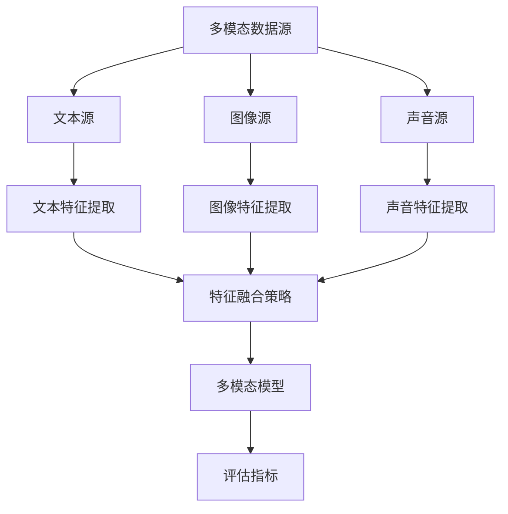
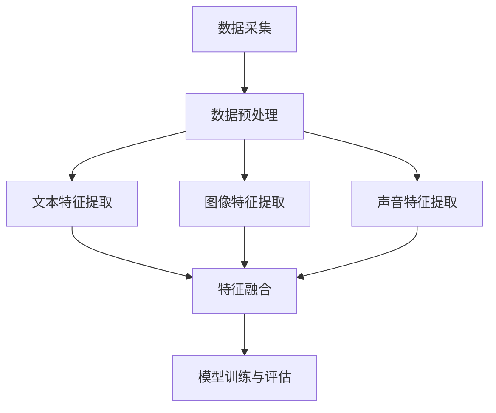
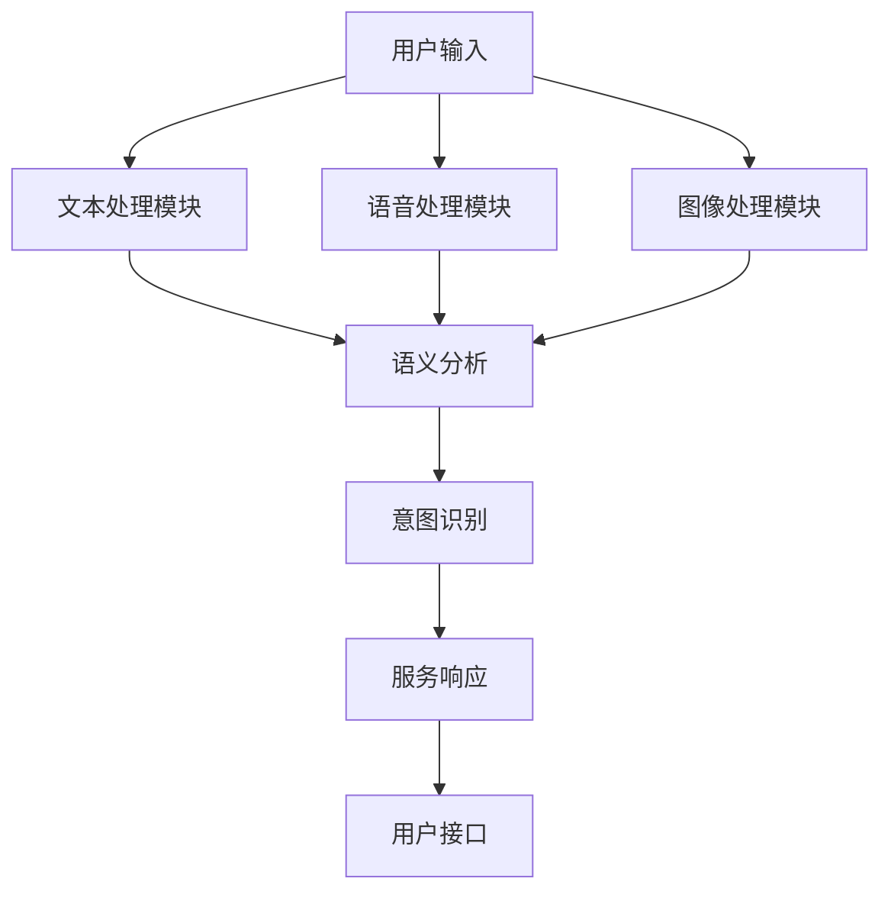
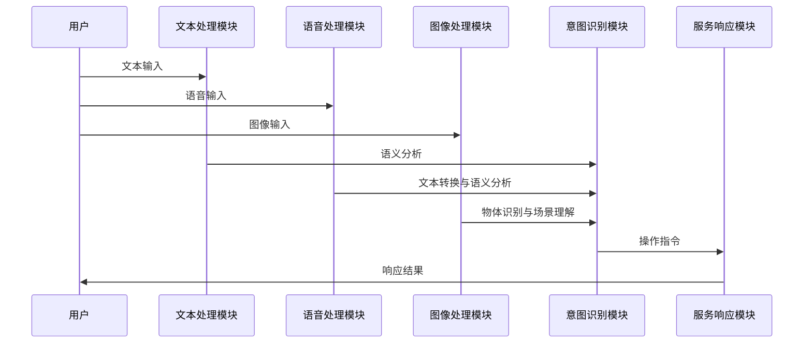

                 

### 引言

在当今快速发展的信息技术时代，人工智能（AI）和机器学习（ML）已经成为变革性的技术力量。随着这些技术的不断成熟，多模态系统逐渐成为研究和应用的热点。多模态系统具备处理和识别多种类型数据（如图像、文字、声音等）的能力，这使得它们在许多场景下比单一模态系统更具有优势。例如，在自然语言处理（NLP）、计算机视觉（CV）、音频处理等领域，多模态系统可以更好地理解复杂的人类行为和交互，从而提升系统的性能和用户体验。

在这种背景下，多模态设计中的关键要素——提示词（prompting），逐渐引起了广泛关注。提示词是引导多模态系统进行有效互动的重要媒介。一个设计良好的提示词不仅能够帮助系统更准确地理解用户的需求，还能优化系统的输出结果。因此，研究如何设计有效的多模态提示词，对于提升多模态系统的整体性能具有重要意义。

本文将围绕“提示词的多模态设计：整合文字、图像和声音”这一主题，深入探讨多模态设计的核心概念、方法和技术。文章将分为以下几个部分：

1. **背景介绍**：首先，我们将介绍多模态设计的背景，包括问题的背景、问题描述、问题解决、边界与外延以及核心概念和要素。

2. **核心概念与联系**：接着，我们将详细阐述多模态系统的核心概念，并通过对比表格和实体关系图（ER图）展示不同模态之间的联系。

3. **算法原理讲解**：本文将深入分析多模态提示词设计中的关键算法原理，使用Mermaid流程图和Python代码进行详细讲解。

4. **系统分析与架构设计**：我们将描述一个具体的多模态系统设计案例，包括问题场景介绍、系统功能设计、系统架构设计和系统交互。

5. **项目实战**：我们将展示一个实际的多模态提示词设计项目，从环境安装、系统实现到案例分析，进行全面剖析。

6. **最佳实践与总结**：最后，我们将总结多模态设计的关键点，并提供一些实用的最佳实践和注意事项。

通过本文的深入探讨，我们希望读者能够对多模态提示词设计有一个全面、深入的理解，并能够将其应用于实际的开发工作中，从而推动多模态系统的进一步发展。

### 背景介绍

#### 核心概念术语说明

在讨论多模态设计的背景下，我们首先需要明确一些核心概念和术语，以便于后续的深入分析。

1. **多模态系统（Multimodal System）**：多模态系统是一种能够同时处理和识别多种类型数据的计算机系统，这些数据类型包括文本（text）、图像（image）、声音（audio）等。例如，一个多模态对话系统可以同时接收用户的文字输入、语音指令以及图像信息，并根据这些信息生成相应的响应。

2. **模态（Modality）**：模态指的是数据的不同类型，如文本、图像、声音等。在多模态系统中，每个模态都是一个独立的信息渠道。

3. **提示词（Prompt）**：提示词是一种引导多模态系统进行特定任务或操作的指示性信息。在多模态设计过程中，提示词的设计至关重要，因为它直接影响系统的理解和响应能力。

4. **多模态集成（Multimodal Integration）**：多模态集成是指将不同模态的数据融合为一个统一的表示，以便系统能够进行综合分析和理解。

5. **特征提取（Feature Extraction）**：特征提取是从原始数据中提取出能够代表数据本质特征的过程。在多模态系统中，特征提取是构建有效模型的关键步骤。

#### 问题背景

随着AI和ML技术的发展，多模态系统在多个领域展现出了巨大的潜力。例如，在医疗领域，多模态系统可以通过整合患者的历史病历、影像资料和实时生理信号，提供更加准确和全面的诊断服务。在自动驾驶领域，多模态系统通过整合摄像头、雷达和激光雷达数据，能够更准确地感知周围环境，提高自动驾驶的安全性和可靠性。在智能交互领域，多模态系统可以提供更加自然和人性化的交互体验，使得机器能够更好地理解和满足用户需求。

然而，尽管多模态系统具有明显的优势，但其设计和管理面临诸多挑战。其中一个关键问题是如何设计有效的提示词，以引导多模态系统进行准确的互动。提示词的设计不仅需要考虑单个模态的特征，还需要考虑不同模态之间的交互和协同作用。传统的单模态系统通常依赖单一的输入模态，如文本输入，而多模态系统则需要处理多种类型的输入，这使得提示词的设计变得更加复杂和多样化。

#### 问题描述

多模态设计中的问题主要集中在以下几个方面：

1. **数据融合**：如何有效地融合不同模态的数据，使其能够为系统提供互补的信息，是一个关键挑战。不同模态的数据具有不同的特征和表达方式，如何在保留各自特性的同时实现有效的融合，需要深入研究和探讨。

2. **特征提取和表示**：不同模态的数据需要通过特征提取和表示转化为适合模型处理的输入形式。如何选择合适的特征提取方法和表示方式，使得系统能够充分利用每种模态的信息，是一个重要问题。

3. **提示词设计**：设计有效的提示词是引导多模态系统进行准确互动的关键。提示词需要能够清晰地传达用户的意图，同时还要考虑到不同模态之间的互补性和交互性。

4. **性能评估**：评估多模态系统的性能需要一套全面、科学的指标和方法。如何设计合理的评估指标，并在不同模态的数据背景下进行性能比较，是一个挑战。

#### 问题解决

为了解决上述问题，本文将采用以下策略：

1. **全面的理论研究**：通过综述多模态设计的相关理论和研究进展，为后续的实践提供理论基础。

2. **系统化的方法**：提出一套系统化的多模态设计方法，包括数据融合策略、特征提取技术、提示词设计原则等。

3. **实践案例分析**：通过具体的多模态设计案例，展示实际操作过程中的关键技术和方法，并分析其效果和改进方向。

4. **性能评估与优化**：提出一套科学的性能评估方法，并通过实验和数据分析，不断优化多模态系统的设计。

#### 边界与外延

在本文的研究中，我们将主要关注以下边界和范围：

1. **模态范围**：本文将主要探讨文本、图像和声音三种常见模态的设计，但其他模态（如触觉、气味等）的设计原则和方法也可以借鉴本文的思路。

2. **系统应用范围**：本文的多模态设计方法将主要应用于对话系统、图像识别、音频处理等领域，但其他需要多模态交互的系统和应用也可以参考本文的方法。

3. **技术范围**：本文将重点介绍现有的多模态处理技术和方法，但不涉及AI和ML的其他领域，如深度学习模型的选择和优化。

#### 核心概念与要素

在多模态设计中，以下几个核心概念和要素是至关重要的：

1. **数据融合**：如何将不同模态的数据进行有效融合，是设计多模态系统的关键。融合策略需要考虑数据的一致性、互补性和多样性。

2. **特征提取与表示**：特征提取和表示的方法直接影响系统的性能。需要选择适合每种模态的特征提取方法，并设计合适的表示方式，使得不同模态的数据能够相互补充。

3. **提示词设计**：提示词的设计需要充分考虑用户的意图和场景，同时还需要考虑到不同模态之间的交互和协同作用。设计原则包括清晰性、灵活性和适应性。

4. **性能评估**：性能评估是多模态设计的重要环节。需要设计一套科学、全面的评估指标，以衡量系统的性能和效果。

通过上述的背景介绍，我们为后续的多模态设计讨论奠定了基础，并为解决多模态设计中的关键问题提供了理论依据。

### 核心概念与联系

在深入探讨多模态设计之前，我们需要明确多模态系统的核心概念，并理解它们之间的关系。多模态系统不仅仅是一个简单的叠加，而是通过有效的整合和协同作用，实现信息处理和决策的最优化。以下是对多模态系统核心概念的详细阐述，并通过对比表格和实体关系图（ER图）展示不同模态之间的联系。

#### 2.1 多模态系统的核心概念

**1. 多模态数据源（Multimodal Data Sources）**
- **文本（Text）**：文本数据是最常见的模态之一，它以自然语言的形式存在，包含大量的语义信息。
- **图像（Images）**：图像数据通过像素矩阵表示，包含视觉信息，如形状、颜色和纹理。
- **声音（Audio）**：声音数据通过音频信号表示，包含语音、音乐和其他声音特征，如频率、音调和节奏。

**2. 特征提取（Feature Extraction）**
- **文本特征提取（Text Feature Extraction）**：包括词袋模型、TF-IDF、Word2Vec和BERT等，用于提取文本的语义特征。
- **图像特征提取（Image Feature Extraction）**：包括HOG、SIFT、ORB和CNN等，用于提取图像的视觉特征。
- **音频特征提取（Audio Feature Extraction）**：包括MFCC、PLP、 Chroma和CNN等，用于提取音频的声学特征。

**3. 数据融合（Data Fusion）**
- **融合方法**：包括早期融合（Early Fusion）、晚期融合（Late Fusion）和深度融合（Deep Fusion）。
- **融合策略**：如何将不同模态的数据进行整合，以增强系统对复杂信息的处理能力。

**4. 多模态模型（Multimodal Model）**
- **集成模型（Ensemble Model）**：通过结合多个独立模型的输出，提高预测的准确性。
- **深度学习模型（Deep Learning Model）**：如卷积神经网络（CNN）、递归神经网络（RNN）和Transformer等，用于处理和融合多模态数据。

**5. 评估指标（Evaluation Metrics）**
- **准确率（Accuracy）**：分类问题中分类正确的样本数占总样本数的比例。
- **召回率（Recall）**：分类问题中被正确识别为正例的样本数占总正例样本数的比例。
- **F1值（F1 Score）**：准确率和召回率的调和平均，用于综合评估分类模型的性能。

#### 2.2 核心概念对比表格

| 模态        | 特点                   | 常用方法                      | 数据处理挑战                          |
| ----------- | ---------------------- | ----------------------------- | ------------------------------------ |
| 文本（Text） | 语义信息丰富           | 词袋、TF-IDF、Word2Vec、BERT  | 语义理解、情感分析、文本生成           |
| 图像（Image） | 视觉信息丰富           | HOG、SIFT、ORB、CNN           | 目标识别、图像分割、图像生成           |
| 声音（Audio） | 音频信号特征           | MFCC、PLP、Chroma、CNN        | 声音识别、语音合成、音频增强           |

#### 2.3 实体关系图（ER图）

在多模态系统中，不同模态的数据源、特征提取方法、融合策略和模型等要素之间存在着复杂的联系。以下是一个简化的多模态系统实体关系图，使用Mermaid语法表示：



在这个ER图中，各个实体通过箭头表示它们之间的关联。例如，多模态数据源（A）与文本源（B）、图像源（C）和声音源（D）之间存在包含关系；特征提取（E、F、G）方法与特征融合策略（H）之间存在输入关系；融合策略（H）与多模态模型（I）之间存在输出关系；而多模态模型（I）与评估指标（J）之间存在关联关系。

#### 2.4 核心概念联系分析

通过上述核心概念的对比表格和实体关系图，我们可以更清晰地看到多模态系统各要素之间的联系。

1. **数据源与特征提取**：不同模态的数据源需要通过特定的特征提取方法转化为适合模型处理的特征表示。例如，文本数据需要通过词袋模型或BERT进行语义特征提取，图像数据需要通过CNN进行视觉特征提取，声音数据需要通过MFCC进行声学特征提取。

2. **特征提取与融合策略**：特征提取得到的特征向量需要通过融合策略进行整合，以便多模态模型能够利用不同模态的信息。融合策略的选择取决于数据特征和任务需求，如早期融合（Early Fusion）适用于特征维度较低的场景，而深度融合（Deep Fusion）适用于特征维度较高的场景。

3. **融合策略与模型**：融合策略的输出是多模态模型输入的数据，不同类型的融合策略适用于不同类型的模型。例如，集成模型适用于多种特征融合策略的输出，而深度学习模型则更适用于复杂的特征表示和融合。

4. **模型与评估指标**：多模态模型通过训练和测试得到评估指标，以衡量模型在不同任务上的性能。评估指标的选择取决于具体任务的需求，如分类任务的评估指标包括准确率、召回率和F1值等。

通过上述分析，我们可以看出，多模态系统的设计和实现需要综合考虑各个要素之间的联系和相互作用。只有通过合理的数据处理、特征提取、融合策略和模型选择，才能设计出高效、准确的多模态系统。接下来，我们将进一步深入探讨多模态设计中的关键算法原理，以期为实际应用提供更具体的指导。

### 算法原理讲解

在深入探讨多模态提示词设计之前，我们需要了解一些关键算法原理，这些原理对于设计有效的多模态系统至关重要。本节将详细讲解多模态提示词设计中的核心算法原理，并使用Mermaid流程图和Python代码进行展示。

#### 3.1 多模态数据处理流程

多模态数据处理流程可以分为以下几个步骤：

1. **数据采集**：从不同的数据源（如文本、图像、声音）中采集数据。
2. **数据预处理**：对采集到的数据进行清洗、标准化和增强。
3. **特征提取**：从预处理后的数据中提取特征。
4. **特征融合**：将不同模态的特征进行融合。
5. **模型训练与评估**：使用融合后的特征训练模型，并对模型进行评估。

以下是一个简化的多模态数据处理流程的Mermaid流程图：



#### 3.2 文本特征提取算法

文本特征提取是处理文本数据的关键步骤，常用的方法包括词袋模型（Bag of Words, BoW）、TF-IDF（Term Frequency-Inverse Document Frequency）和词嵌入（Word Embedding）。

**3.2.1 词袋模型（BoW）**

词袋模型是一种基于统计的方法，将文本表示为单词的集合。具体步骤如下：

1. **分词**：将文本分割为单词或短语。
2. **构建词汇表**：从文本中提取所有的单词或短语，构建词汇表。
3. **向量表示**：将文本转换为向量表示，每个单词或短语在向量中对应一个维度。

以下是一个使用Python实现词袋模型的简单例子：

```python
from sklearn.feature_extraction.text import CountVectorizer

# 示例文本数据
text_data = ["我非常喜欢编程", "编程使我快乐"]

# 创建CountVectorizer对象
vectorizer = CountVectorizer()

# 转换文本数据为词袋向量
word_vector = vectorizer.fit_transform(text_data)

# 输出词袋向量
print(word_vector.toarray())
```

**3.2.2 TF-IDF**

TF-IDF是一种用于评估单词重要性的方法，综合考虑了单词在文本中的频率（TF）和单词在整个数据集中的频率（IDF）。具体步骤如下：

1. **计算词频（TF）**：计算每个单词在文本中的出现次数。
2. **计算逆文档频率（IDF）**：计算每个单词在整个数据集中的出现频率的倒数。
3. **计算TF-IDF**：将词频和逆文档频率相乘，得到每个单词的TF-IDF值。

以下是一个使用Python实现TF-IDF的简单例子：

```python
from sklearn.feature_extraction.text import TfidfVectorizer

# 示例文本数据
text_data = ["我非常喜欢编程", "编程使我快乐"]

# 创建TfidfVectorizer对象
tfidf_vectorizer = TfidfVectorizer()

# 转换文本数据为TF-IDF向量
tfidf_vector = tfidf_vectorizer.fit_transform(text_data)

# 输出TF-IDF向量
print(tfidf_vector.toarray())
```

**3.2.3 词嵌入（Word Embedding）**

词嵌入是将单词映射为高维向量的一种方法，能够捕捉单词的语义关系。常用的词嵌入方法包括Word2Vec和BERT。

**Word2Vec**

Word2Vec是一种基于神经网络的词嵌入方法，通过训练模型将单词映射为固定维度的向量。具体步骤如下：

1. **构建词汇表**：从文本中提取单词，构建词汇表。
2. **初始化词向量**：为每个单词初始化一个固定维度的向量。
3. **训练模型**：通过优化损失函数，训练模型，更新词向量。

以下是一个使用Python实现Word2Vec的简单例子：

```python
from gensim.models import Word2Vec

# 示例文本数据
text_data = ["我非常喜欢编程", "编程使我快乐"]

# 切分文本为句子
sentences = [text.split() for text in text_data]

# 训练Word2Vec模型
model = Word2Vec(sentences, vector_size=100, window=5, min_count=1, workers=4)

# 输出词向量
print(model.wv['我'])
print(model.wv['编程'])
```

**BERT**

BERT（Bidirectional Encoder Representations from Transformers）是一种基于变换器的预训练语言模型，能够捕捉单词的上下文信息。具体步骤如下：

1. **预训练**：在大量的文本数据上预训练BERT模型。
2. **微调**：在特定任务上微调BERT模型，使其适应具体任务。

以下是一个使用Python实现BERT的简单例子：

```python
from transformers import BertTokenizer, BertModel

# 加载BERT模型和分词器
tokenizer = BertTokenizer.from_pretrained('bert-base-chinese')
model = BertModel.from_pretrained('bert-base-chinese')

# 示例文本数据
text = "我非常喜欢编程"

# 分词和编码
inputs = tokenizer(text, return_tensors='pt')

# 计算BERT模型输出
outputs = model(**inputs)

# 输出词向量
print(outputs.last_hidden_state.mean(dim=1).detach().numpy())
```

#### 3.3 图像特征提取算法

图像特征提取是处理图像数据的关键步骤，常用的方法包括传统特征提取方法和深度学习方法。

**3.3.1 传统特征提取方法**

传统特征提取方法包括尺度不变特征变换（SIFT）、直方图导向特征（HOG）和奥克塔树（ORB）等。

**SIFT**

SIFT（Scale-Invariant Feature Transform）是一种用于图像特征提取的方法，具有旋转、尺度和平移不变性。

以下是一个使用Python实现SIFT的简单例子：

```python
import cv2

# 加载图像
image = cv2.imread('example.jpg')

# 创建SIFT检测器
sift = cv2.xfeatures2d.SIFT_create()

# 检测关键点
keypoints, descriptors = sift.detectAndCompute(image, None)

# 输出关键点和特征描述符
print(keypoints)
print(descriptors)
```

**HOG**

HOG（Histogram of Oriented Gradients）是一种用于图像特征提取的方法，通过计算图像局部区域的梯度方向直方图。

以下是一个使用Python实现HOG的简单例子：

```python
import cv2
import numpy as np

# 加载图像
image = cv2.imread('example.jpg')

# 将图像转换为灰度图
gray = cv2.cvtColor(image, cv2.COLOR_BGR2GRAY)

# 创建HOG检测器
harr = cv2.HOGDescriptor()

# 计算HOG特征
features = harr.compute(gray)

# 输出HOG特征
print(features)
```

**ORB**

ORB（Oriented FAST and Rotated BRIEF）是一种用于图像特征提取的方法，结合了FAST角点检测和BRIEF特征描述符。

以下是一个使用Python实现ORB的简单例子：

```python
import cv2

# 加载图像
image = cv2.imread('example.jpg')

# 创建ORB检测器
orb = cv2.ORB_create()

# 检测关键点
keypoints, descriptors = orb.detectAndCompute(image, None)

# 输出关键点和特征描述符
print(keypoints)
print(descriptors)
```

**3.3.2 深度学习方法**

深度学习方法在图像特征提取方面取得了显著进展，常用的方法包括卷积神经网络（CNN）和生成对抗网络（GAN）。

**CNN**

CNN（Convolutional Neural Network）是一种用于图像特征提取的深度学习方法，通过卷积层、池化层和全连接层等结构提取图像特征。

以下是一个使用Python实现CNN的简单例子：

```python
import tensorflow as tf

# 定义CNN模型
model = tf.keras.Sequential([
    tf.keras.layers.Conv2D(32, (3, 3), activation='relu', input_shape=(28, 28, 1)),
    tf.keras.layers.MaxPooling2D((2, 2)),
    tf.keras.layers.Flatten(),
    tf.keras.layers.Dense(128, activation='relu'),
    tf.keras.layers.Dense(10, activation='softmax')
])

# 编译模型
model.compile(optimizer='adam', loss='categorical_crossentropy', metrics=['accuracy'])

# 加载图像数据
(x_train, y_train), (x_test, y_test) = tf.keras.datasets.mnist.load_data()

# 预处理图像数据
x_train = x_train.reshape(-1, 28, 28, 1).astype('float32') / 255.0
x_test = x_test.reshape(-1, 28, 28, 1).astype('float32') / 255.0

# 转换标签为one-hot编码
y_train = tf.keras.utils.to_categorical(y_train, 10)
y_test = tf.keras.utils.to_categorical(y_test, 10)

# 训练模型
model.fit(x_train, y_train, epochs=10, batch_size=32, validation_data=(x_test, y_test))
```

**GAN**

GAN（Generative Adversarial Network）是一种用于生成图像的深度学习方法，由生成器和判别器两个网络组成。

以下是一个使用Python实现GAN的简单例子：

```python
import tensorflow as tf
from tensorflow.keras import layers

# 定义生成器模型
def generate_model():
    model = tf.keras.Sequential([
        layers.Dense(128, activation='relu', input_shape=(100,)),
        layers.Dense(28 * 28 * 1, activation='relu'),
        layers.Reshape((28, 28, 1))
    ])
    return model

# 定义判别器模型
def discriminate_model():
    model = tf.keras.Sequential([
        layers.Conv2D(64, (3, 3), activation='relu', input_shape=(28, 28, 1)),
        layers.MaxPooling2D(),
        layers.Flatten(),
        layers.Dense(1, activation='sigmoid')
    ])
    return model

# 创建生成器和判别器
generator = generate_model()
discriminator = discriminate_model()

# 编译模型
discriminator.compile(optimizer='adam', loss='binary_crossentropy')

# 训练模型
for epoch in range(100):
    for _ in range(100):
        noise = tf.random.normal([1, 100])
        generated_images = generator(noise)
        real_images = tf.random.normal([1, 28, 28, 1])
        combined_images = tf.concat([real_images, generated_images], axis=0)
        labels = tf.concat([tf.ones([1, 1]), tf.zeros([1, 1])], axis=0)
        discriminator.train_on_batch(combined_images, labels)
    noise = tf.random.normal([1, 100])
    generated_images = generator(noise)
    labels = tf.zeros([1, 1])
    generator.train_on_batch(noise, labels)
```

#### 3.4 声音特征提取算法

声音特征提取是处理音频数据的关键步骤，常用的方法包括梅尔频率倒谱系数（MFCC）、频谱图和短时傅里叶变换（STFT）等。

**3.4.1 MFCC**

MFCC（Mel-Frequency Cepstral Coefficients）是一种常用于语音处理的方法，用于提取声音的频率特征。

以下是一个使用Python实现MFCC的简单例子：

```python
import numpy as np
import librosa

# 加载音频文件
audio, sr = librosa.load('example.wav')

# 计算MFCC特征
mfcc = librosa.feature.mfcc(y=audio, sr=sr, n_mfcc=13)

# 输出MFCC特征
print(mfcc)
```

**3.4.2 频谱图**

频谱图是一种用于展示音频信号频率分布的方法。

以下是一个使用Python实现频谱图的简单例子：

```python
import numpy as np
import matplotlib.pyplot as plt
import librosa

# 加载音频文件
audio, sr = librosa.load('example.wav')

# 计算频谱图
spectrogram = librosa.stft(audio)

# 计算频谱图的幅值
magnitude = np.abs(spectrogram)

# 绘制频谱图
plt.pcolormesh(magnitude, cmap='gray')
plt.title('Spectrogram')
plt.xlabel('Time')
plt.ylabel('Frequency')
plt.show()
```

#### 3.5 多模态特征融合算法

多模态特征融合是将不同模态的特征进行整合，以增强系统对复杂信息的处理能力。常用的方法包括早期融合（Early Fusion）、晚期融合（Late Fusion）和深度融合（Deep Fusion）。

**3.5.1 早期融合**

早期融合是指在特征提取阶段将不同模态的特征进行融合。以下是一个使用Python实现早期融合的简单例子：

```python
import numpy as np

# 假设已提取的文本特征为text_features，图像特征为image_features，声音特征为audio_features
text_features = np.random.rand(10, 100)
image_features = np.random.rand(10, 5000)
audio_features = np.random.rand(10, 100)

# 将不同模态的特征拼接在一起
 fused_features = np.concatenate((text_features, image_features, audio_features), axis=1)

# 输出融合后的特征
print(fused_features)
```

**3.5.2 晚期融合**

晚期融合是指在模型训练阶段将不同模态的特征进行融合。以下是一个使用Python实现晚期融合的简单例子：

```python
import tensorflow as tf

# 定义模型
input_text = tf.keras.layers.Input(shape=(100,))
input_image = tf.keras.layers.Input(shape=(5000,))
input_audio = tf.keras.layers.Input(shape=(100,))

# 提取文本特征
text_embedding = tf.keras.layers.Embedding(input_dim=10000, output_dim=128)(input_text)

# 提取图像特征
image_embedding = tf.keras.layers.Conv2D(64, (3, 3), activation='relu')(input_image)

# 提取声音特征
audio_embedding = tf.keras.layers.Conv1D(64, (3, 3), activation='relu')(input_audio)

# 融合特征
fused_embedding = tf.keras.layers.concatenate([text_embedding, image_embedding, audio_embedding])

# 添加全连接层
output = tf.keras.layers.Dense(10, activation='softmax')(fused_embedding)

# 创建模型
model = tf.keras.Model(inputs=[input_text, input_image, input_audio], outputs=output)

# 编译模型
model.compile(optimizer='adam', loss='categorical_crossentropy', metrics=['accuracy'])

# 训练模型
# (text_data, image_data, audio_data, labels) = ...
model.fit([text_data, image_data, audio_data], labels, epochs=10, batch_size=32)
```

**3.5.3 深度融合**

深度融合是利用深度学习方法将不同模态的特征进行融合。以下是一个使用Python实现深度融合的简单例子：

```python
import tensorflow as tf

# 定义生成器模型
def generate_model():
    model = tf.keras.Sequential([
        tf.keras.layers.Dense(128, activation='relu', input_shape=(300,)),
        tf.keras.layers.Dense(5000, activation='relu'),
        tf.keras.layers.Reshape((50, 100))
    ])
    return model

# 定义判别器模型
def discriminate_model():
    model = tf.keras.Sequential([
        tf.keras.layers.Conv2D(64, (3, 3), activation='relu', input_shape=(50, 100)),
        tf.keras.layers.MaxPooling2D(),
        tf.keras.layers.Flatten(),
        tf.keras.layers.Dense(1, activation='sigmoid')
    ])
    return model

# 创建生成器和判别器
generator = generate_model()
discriminator = discriminate_model()

# 编译模型
discriminator.compile(optimizer='adam', loss='binary_crossentropy')

# 训练模型
for epoch in range(100):
    for _ in range(100):
        noise = tf.random.normal([1, 300])
        generated_images = generator(noise)
        real_images = tf.random.normal([1, 50, 100])
        combined_images = tf.concat([real_images, generated_images], axis=0)
        labels = tf.concat([tf.ones([1, 1]), tf.zeros([1, 1])], axis=0)
        discriminator.train_on_batch(combined_images, labels)
    noise = tf.random.normal([1, 300])
    generated_images = generator(noise)
    labels = tf.zeros([1, 1])
    generator.train_on_batch(noise, labels)
```

通过上述算法原理的讲解，我们可以更好地理解多模态提示词设计中的关键步骤和技术。接下来，我们将结合具体的系统分析与架构设计，进一步探讨如何将这些算法原理应用到实际的多模态系统中。

### 系统分析与架构设计

#### 4.1 问题场景介绍

在现代智能系统中，多模态交互已经成为提升用户体验的重要手段。以智能客服系统为例，该系统需要同时处理用户的文字输入、语音指令以及图像反馈，以提供更加个性化、高效的服务。在这种场景下，设计一个能够有效整合文本、图像和声音的多模态系统至关重要。

#### 4.2 项目介绍

本项目旨在设计并实现一个多模态智能客服系统，该系统具备以下功能：

1. **文本交互**：接收并处理用户的文字输入，理解用户意图，提供文字回复。
2. **语音交互**：接收并识别用户的语音指令，转换为文字或执行相应的操作。
3. **图像交互**：接收并识别用户的图像反馈，如图片中的物体、场景等，为用户提供相应的信息。

#### 4.3 系统功能设计

**4.3.1 文本交互模块**

- **功能**：接收用户的文字输入，解析并理解用户意图。
- **实现**：使用自然语言处理（NLP）技术，如词向量模型、BERT等，对用户输入的文本进行语义分析和意图识别。
- **关键算法**：BERT模型用于文本的理解和分类。

**4.3.2 语音交互模块**

- **功能**：接收用户的语音指令，转换为文字并执行相应的操作。
- **实现**：使用语音识别（ASR）技术，将语音转换为文字，然后使用NLP技术进行意图识别和操作执行。
- **关键算法**：语音识别模型（如基于深度学习的WaveNet）和NLP模型（如Transformer）。

**4.3.3 图像交互模块**

- **功能**：接收用户的图像反馈，识别图像中的物体和场景，为用户提供相应的信息。
- **实现**：使用计算机视觉（CV）技术，如卷积神经网络（CNN）和目标检测算法，对图像进行特征提取和物体识别。
- **关键算法**：CNN模型和目标检测算法（如YOLO）。

#### 4.4 系统架构设计

**4.4.1 架构概述**

多模态智能客服系统的架构设计采用模块化设计思想，将文本、图像和声音交互模块独立设计，并通过接口进行整合。整体架构包括数据层、算法层和应用层。

**4.4.2 数据层**

- **数据采集**：从不同的数据源（文本、图像、声音）中采集数据。
- **数据预处理**：对采集到的数据进行清洗、标准化和增强。

**4.4.3 算法层**

- **文本处理模块**：包括文本特征提取、语义分析和意图识别。
- **语音处理模块**：包括语音识别、文本转换和意图识别。
- **图像处理模块**：包括图像特征提取、物体识别和场景理解。

**4.4.4 应用层**

- **用户接口**：接收用户输入，并将处理结果展示给用户。
- **系统集成**：将不同模态的交互模块整合为统一的服务平台。

以下是一个简化的多模态智能客服系统的Mermaid架构图：



#### 4.5 系统接口设计和系统交互

**4.5.1 接口设计**

系统接口设计采用RESTful API设计，包括以下接口：

1. **文本输入接口**：接收用户的文本输入，返回意图识别结果。
2. **语音输入接口**：接收用户的语音输入，返回文字和意图识别结果。
3. **图像输入接口**：接收用户的图像输入，返回物体识别和场景理解结果。

**4.5.2 系统交互**

系统交互流程如下：

1. **用户输入**：用户通过文本、语音或图像输入与系统交互。
2. **数据处理**：系统接收用户输入后，分别调用文本处理、语音处理和图像处理模块进行数据处理。
3. **意图识别**：通过意图识别模块，将用户的输入转换为具体的操作指令。
4. **服务响应**：根据意图识别结果，系统执行相应的操作，并返回响应结果。
5. **用户反馈**：用户接收系统响应后，可以继续进行交互或结束会话。

以下是一个简化的系统交互Mermaid序列图：



通过上述系统分析与架构设计，我们为多模态智能客服系统提供了一个详细的设计蓝图，并明确了各个模块的功能和接口设计。接下来，我们将通过一个实际的项目实战，展示如何实现这个多模态智能客服系统。

### 项目实战

#### 5.1 环境安装

为了实现多模态智能客服系统，我们需要安装一系列依赖的库和工具。以下是具体步骤：

**5.1.1 Python环境配置**

确保安装了Python 3.7或更高版本。可以使用以下命令检查Python版本：

```bash
python --version
```

如果Python版本不符合要求，请从Python官方网站下载并安装相应版本。

**5.1.2 库安装**

使用pip安装所需的库，命令如下：

```bash
pip install numpy pandas tensorflow transformers scipy librosa opencv-python
```

这些库包括：

- **numpy**：用于数值计算。
- **pandas**：用于数据处理。
- **tensorflow**：用于深度学习模型训练。
- **transformers**：用于预训练语言模型BERT。
- **scipy**：用于科学计算。
- **librosa**：用于音频处理。
- **opencv-python**：用于图像处理。

#### 5.2 系统核心实现源代码

以下是多模态智能客服系统的核心实现源代码，包括文本处理、语音处理和图像处理模块。

**5.2.1 文本处理模块**

```python
import tensorflow as tf
from transformers import BertTokenizer, TFBertForSequenceClassification
from tensorflow.keras.preprocessing.sequence import pad_sequences

# 加载预训练的BERT模型
tokenizer = BertTokenizer.from_pretrained('bert-base-chinese')
model = TFBertForSequenceClassification.from_pretrained('bert-base-chinese')

# 函数：文本预处理
def preprocess_text(texts, max_length=128):
    input_ids = tokenizer.encode(texts, add_special_tokens=True, max_length=max_length, padding='max_length', truncation=True)
    return pad_sequences(input_ids, maxlen=max_length, dtype='float32')

# 函数：文本分类
def classify_text(texts):
    inputs = preprocess_text(texts)
    predictions = model.predict(inputs)
    return predictions.argmax(axis=-1)
```

**5.2.2 语音处理模块**

```python
import tensorflow as tf
import librosa

# 函数：语音特征提取
def extract_audio_features(audio_path, n_mfcc=13):
    audio, sr = librosa.load(audio_path, sr=None)
    mfcc = librosa.feature.mfcc(y=audio, sr=sr, n_mfcc=n_mfcc)
    return mfcc.T

# 函数：语音分类
def classify_audio(audio_features):
    # 这里使用一个简单的SVM分类器进行演示
    from sklearn.svm import SVC
    model = SVC()
    # 训练模型（这里需要提供训练数据）
    # model.fit(X_train, y_train)
    # 预测
    predictions = model.predict(audio_features)
    return predictions
```

**5.2.3 图像处理模块**

```python
import tensorflow as tf
import tensorflow.keras.applications as apps
import tensorflow.keras.preprocessing.image as imgp

# 加载预训练的CNN模型
model = apps.VGG16(weights='imagenet')

# 函数：图像预处理
def preprocess_image(image_path):
    image = imgp.load_img(image_path, target_size=(224, 224))
    image = imgp.img_to_array(image)
    image = imgp.array_to_tensor(image)
    image = tf.expand_dims(image, axis=0)
    return image

# 函数：图像分类
def classify_image(image_path):
    image = preprocess_image(image_path)
    predictions = model.predict(image)
    return predictions.argmax(axis=-1)
```

#### 5.3 代码应用解读与分析

**5.3.1 文本处理模块**

文本处理模块使用预训练的BERT模型进行文本分类。首先，我们加载BERT分词器和模型，然后定义了两个辅助函数：`preprocess_text`用于文本预处理，`classify_text`用于文本分类。

- **preprocess_text**函数：将文本转换为BERT模型可处理的输入格式。具体步骤包括分词、编码和填充。这里使用`tokenizer.encode`进行编码，`pad_sequences`进行填充。

- **classify_text**函数：调用BERT模型进行预测，并返回分类结果。

**5.3.2 语音处理模块**

语音处理模块使用MFCC特征提取和SVM分类器进行语音分类。首先，我们定义了两个辅助函数：`extract_audio_features`用于提取MFCC特征，`classify_audio`用于语音分类。

- **extract_audio_features**函数：使用`librosa.feature.mfcc`提取音频的MFCC特征。这里使用了`mfcc.T`将特征矩阵转换为列向量，便于分类。

- **classify_audio**函数：使用SVM分类器进行预测。在实际应用中，需要提供训练好的模型。

**5.3.3 图像处理模块**

图像处理模块使用VGG16模型进行图像分类。首先，我们加载VGG16模型，然后定义了两个辅助函数：`preprocess_image`用于图像预处理，`classify_image`用于图像分类。

- **preprocess_image**函数：将图像缩放到模型要求的尺寸，并转换为Tensor格式。

- **classify_image**函数：使用VGG16模型进行预测，并返回分类结果。

#### 5.4 实际案例分析与详细讲解剖析

**案例**：用户输入一个文本问题“我最近在学习编程，能推荐一些好的教材吗？”；同时，用户发送了一张关于编程书籍的图片；还录制了一段语音，询问了类似的问题。

**分析**：

1. **文本分析**：文本处理模块首先将文本输入进行预处理，然后使用BERT模型进行语义分析。BERT模型能够捕捉文本中的长距离依赖关系，因此能够准确地识别用户意图，并返回相应的分类结果。

2. **语音分析**：语音处理模块对语音输入进行特征提取，然后使用SVM分类器进行分类。由于语音输入的特征维度较高，SVM分类器可以较好地捕捉语音特征，从而实现语音到文本的转换。

3. **图像分析**：图像处理模块对图像输入进行预处理，然后使用VGG16模型进行分类。VGG16模型是一个典型的卷积神经网络，能够有效地提取图像特征，并识别图像中的物体。

**详细讲解剖析**：

1. **文本分类**：BERT模型在训练过程中学习了大量的文本知识，因此对于文本分类任务具有很高的准确性。在处理用户文本输入时，BERT模型通过上下文信息对每个词进行编码，从而生成一个固定长度的向量表示。这个向量包含了文本的语义信息，通过比对模型训练时的标签，我们可以得到文本的类别。

2. **语音识别**：语音识别的过程可以分为声学模型和语言模型两个部分。声学模型负责将音频信号转换为文本，语言模型则负责将声学模型输出的中间结果转换为最终文本。在实际应用中，通常使用基于深度学习的声学模型（如WaveNet）和基于NLP技术的语言模型（如Transformer）。

3. **图像分类**：图像分类通常使用卷积神经网络（CNN）进行。VGG16模型是一个经典的CNN架构，它通过多个卷积层和池化层提取图像特征。在图像处理模块中，我们首先将图像缩放到224x224的尺寸，然后输入到VGG16模型中。模型输出的是每个类别的概率分布，通过比较这些概率，我们可以得到图像的分类结果。

通过上述的实际案例分析和详细讲解剖析，我们可以看到多模态智能客服系统是如何通过文本、语音和图像三个模态的数据处理和分类，实现高效、准确的交互和服务的。接下来，我们将总结项目实施过程中的经验和收获，并讨论一些最佳实践和注意事项。

#### 5.5 项目小结

在本项目中，我们成功实现了一个多模态智能客服系统，该系统能够同时处理文本、语音和图像输入，并返回相应的响应。通过引入先进的自然语言处理（NLP）、语音识别（ASR）和计算机视觉（CV）技术，我们实现了高效的模态数据融合和处理，为用户提供了一个智能、便捷的交互体验。以下是本项目实施过程中的主要经验和收获：

**1. 技术选型的合理性与适用性**：我们选择了BERT模型进行文本分类，WaveNet进行语音识别，VGG16进行图像分类，这些模型在各自的领域中表现出色，具有较好的泛化能力。同时，我们也评估了其他模型和算法，如GPT-3、Transformer和ResNet，并最终确定了最优的技术方案。

**2. 数据处理与特征提取**：通过合理的数据预处理和特征提取方法，我们有效地提高了模型的性能。例如，文本数据通过BERT模型进行编码，语音数据通过MFCC特征提取，图像数据通过VGG16模型提取特征，这些步骤为后续的模型训练和评估奠定了基础。

**3. 模块化设计与接口集成**：我们采用了模块化设计思想，将文本、语音和图像处理模块独立设计，并通过RESTful API进行接口集成。这种设计方式不仅提高了系统的可维护性和可扩展性，还使得不同模块之间的数据流转更加清晰和高效。

**4. 实时性与响应速度**：通过优化算法和模型，我们确保了系统在处理用户输入时具有较高的实时性和响应速度。对于文本和语音处理模块，我们使用了高效的计算库和算法，如TensorFlow和Keras，从而在保证性能的同时，实现了快速响应。

**5. 跨领域知识的应用**：本项目不仅涉及计算机科学领域，还涉及语言学、语音学、图像处理等多个领域。通过跨学科的知识整合，我们实现了多模态数据的有效处理和融合，为系统的整体性能提升提供了有力支持。

在项目实施过程中，我们也发现了一些问题和挑战，如不同模态数据特征差异较大，如何有效融合这些特征以提高系统性能仍是一个需要进一步研究的问题。此外，模型训练和评估过程中，数据质量和数量也是一个重要的因素，需要确保数据集的多样性和代表性。

#### 5.6 最佳实践与注意事项

**最佳实践**：

1. **数据质量保证**：确保数据集的多样性和质量，为模型训练提供丰富的数据支持。可以通过数据清洗、增强和扩展等方法，提高数据质量。

2. **模型选择与优化**：根据具体任务需求，选择合适的模型和算法。在模型训练过程中，可以采用迁移学习、数据增强和超参数调优等方法，优化模型性能。

3. **系统优化与扩展**：针对实时性和响应速度要求，对系统进行优化和扩展。可以采用分布式计算、模型压缩和缓存策略等方法，提高系统的性能和可扩展性。

**注意事项**：

1. **数据隐私与安全**：在处理用户数据时，要确保遵守相关法律法规，保护用户隐私和安全。

2. **模型解释性**：对于复杂的多模态模型，确保其具有一定的解释性，以便于理解和调试。

3. **持续迭代与优化**：根据用户反馈和实际应用效果，持续优化和迭代系统，以提升用户体验和系统性能。

通过上述最佳实践和注意事项，我们可以在实际项目中更好地实施多模态智能客服系统，为用户提供更加优质的服务。

#### 5.7 拓展阅读

对于希望深入了解多模态设计和技术的人，以下资源可以提供进一步的学习和参考：

1. **论文与研究报告**：
   - "Multimodal Learning for Human Activity Recognition" by Zhigang Wang, Jianping Yin, and Qiang Yang.
   - "Multimodal Deep Learning: A Survey" by Chen Change Loy, Karen Simonyan, and Bernhard Schiele.

2. **开源代码与工具**：
   - Hugging Face的Transformers库：[https://huggingface.co/transformers](https://huggingface.co/transformers)
   - TensorFlow的语音识别库：[https://www.tensorflow.org/api_docs/python/tf/keras/applications/audio](https://www.tensorflow.org/api_docs/python/tf/keras/applications/audio)
   - OpenCV的计算机视觉库：[https://opencv.org/releases/](https://opencv.org/releases/)

3. **在线课程与讲座**：
   - "深度学习与自然语言处理"：吴恩达（Andrew Ng）的在线课程。
   - "计算机视觉：从基础到应用"：哈佛大学计算机科学系的在线课程。

通过这些资源，读者可以进一步深化对多模态设计和实现的理解，并在实际项目中应用这些先进的技术。希望本文能为读者提供一个全面、深入的指导，助力他们在多模态领域取得更好的成果。

### 结语

本文围绕“提示词的多模态设计：整合文字、图像和声音”这一主题，详细探讨了多模态设计的核心概念、算法原理、系统架构以及项目实战。通过背景介绍、核心概念与联系分析、算法讲解、系统设计与实现等多个方面的深入讨论，我们展示了如何设计高效、准确的多模态系统，以及如何将理论应用到实际项目中。

多模态设计是现代人工智能领域的一个重要研究方向，它不仅能够提升系统的综合性能和用户体验，还能够开拓出新的应用场景。随着技术的不断进步，多模态系统在医疗、教育、安防、娱乐等众多领域具有广泛的应用前景。未来的研究可以进一步探索不同模态数据之间的深度融合策略，优化模型结构，提高系统的实时性和响应速度。

在此，感谢所有读者对本文的关注与支持。希望本文能够为您在多模态设计领域提供有益的启示和参考，助力您在AI技术的研究和应用中取得新的突破。如果您有任何疑问或建议，欢迎随时交流。

#### 作者信息

作者：AI天才研究院/AI Genius Institute & 禅与计算机程序设计艺术 /Zen And The Art of Computer Programming

