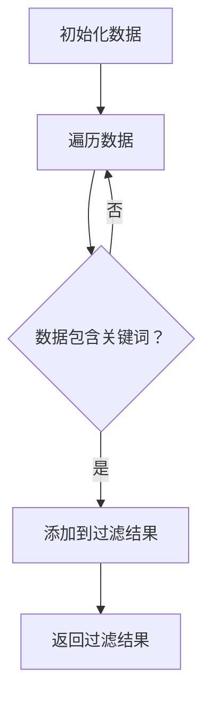
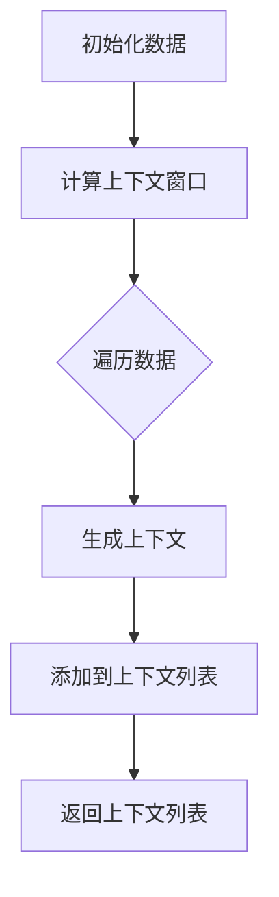
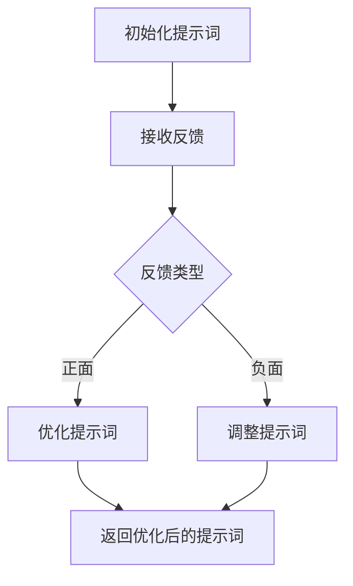
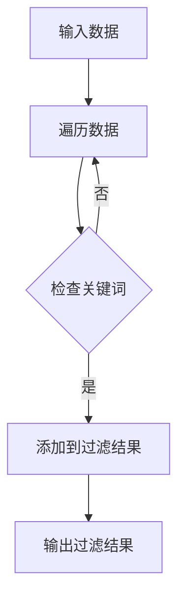
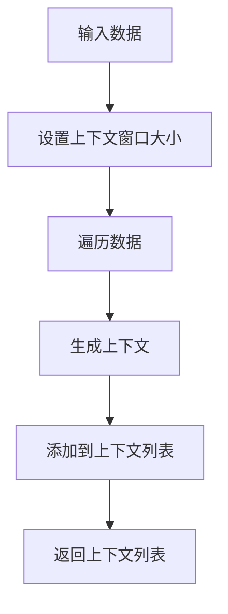
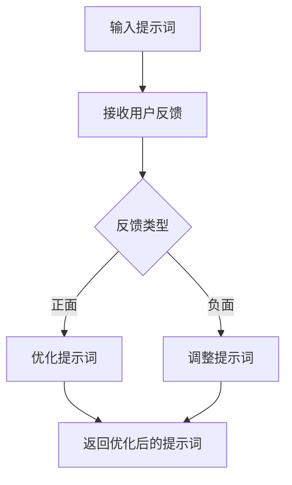
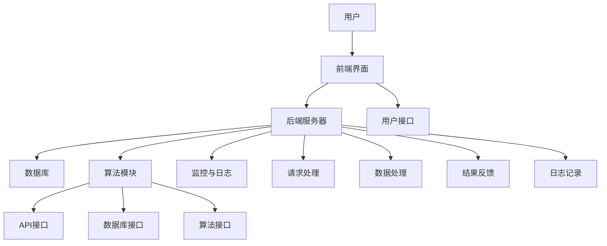

                 


### 第一部分：问题背景与核心概念

#### 引言

在人工智能（AI）领域，认知过程是一个至关重要的研究方向。随着深度学习和自然语言处理（NLP）的快速发展，AI系统已经能够执行复杂的任务，如图像识别、语言翻译和决策制定等。然而，这些AI系统的决策过程通常被视为“黑箱”，我们很难理解其内部机制和原理。为了揭开这个“黑箱”，研究AI的认知过程成为了当前AI研究的一个重要方向。

在本部分中，我们将首先介绍AI认知过程的重要性，并探讨提示词在AI认知中的作用。接着，我们会详细阐述本书的目标和结构，帮助读者了解接下来的内容安排。

#### AI认知过程的重要性

AI认知过程是指人工智能系统获取、处理和使用信息的过程。理解AI的认知过程对于以下几个方面具有重要意义：

1. **模型理解**：通过研究AI的认知过程，我们可以更好地理解AI模型是如何工作的，这有助于我们优化现有模型，甚至设计新的AI系统。
2. **应用优化**：了解AI的认知过程有助于我们更有效地应用AI技术，例如在医疗诊断、自动驾驶和金融分析等领域。
3. **伦理与法律**：随着AI技术的普及，其决策过程对于伦理和法律问题的影响也越来越受到关注。理解AI的认知过程可以帮助我们制定更合理的伦理和法律规范。

#### 提示词在AI认知中的作用

提示词（prompts）在AI认知过程中扮演着关键角色。提示词是指提供给AI系统的信息或指令，用于引导其执行特定任务。有效的提示词可以大幅提升AI系统的性能和效率，这是因为：

1. **明确任务目标**：通过提供具体的任务描述，提示词可以帮助AI系统明确目标，从而更高效地完成任务。
2. **提供上下文信息**：提示词可以包含与任务相关的上下文信息，帮助AI系统更好地理解任务背景和用户需求。
3. **引导搜索空间**：提示词可以引导AI系统在处理复杂问题时关注关键信息，从而提高解决问题的效率。

#### 本书的目标和结构

本书的目标是深入探讨提示词在AI认知过程中的作用，并提供一系列实用的方法和工具，帮助读者设计更有效的提示词。为了实现这一目标，本书将分为以下几个部分：

1. **基础理论**：介绍AI认知过程的基本理论和概念，为后续讨论提供理论基础。
2. **提示词设计方法**：讨论如何设计有效的提示词，包括提示词的类型、结构和优化策略。
3. **实践应用**：通过具体案例展示如何在实际应用中设计和使用提示词，帮助读者将理论应用于实践。
4. **未来展望**：探讨提示词设计领域的最新研究进展和未来发展方向。

通过本书的学习，读者将能够：

- 理解AI认知过程的基本原理。
- 设计和优化有效的提示词，提高AI系统的性能和效率。
- 将提示词设计方法应用于实际场景，解决复杂问题。

#### 总结

本部分介绍了AI认知过程的重要性和提示词在其中的作用，并阐述了本书的目标和结构。在接下来的章节中，我们将逐步深入探讨AI认知过程的核心概念和方法，帮助读者更好地理解并应用这些概念。

----------------------------------------------------------------

### 第一部分：问题背景与核心概念

#### AI认知过程概述

##### 1.2.1 AI认知的定义

人工智能（AI）的认知过程是指机器模拟人类思维和行为的能力，包括感知、理解、推理、学习和决策等环节。与人类认知过程相比，AI的认知过程在许多方面具有独特性。例如，人类认知依赖于直觉、情感和经验，而AI的认知过程则主要基于数据和算法。

##### 1.2.2 AI认知的发展历程

AI认知的发展历程可以追溯到20世纪50年代。当时，随着计算机技术的快速发展，人们开始尝试将人类的思维和行为模式应用于计算机系统。早期的研究主要集中在逻辑推理和符号处理上，如艾伦·图灵（Alan Turing）提出的图灵测试。然而，由于计算资源和算法的局限性，早期的AI系统很难模拟人类的认知过程。

随着深度学习和大数据技术的崛起，AI的认知能力得到了显著提升。深度学习模型通过模拟人脑的神经元结构，可以处理复杂的感知任务，如图像识别和语音识别。此外，基于大数据的机器学习方法使得AI系统在决策和预测方面也取得了巨大进展。

##### 1.2.3 AI认知的核心要素

AI认知过程涉及多个核心要素，包括感知、理解、推理、学习和决策等。

1. **感知**：感知是AI认知的基础，包括视觉、听觉、触觉等多种感知方式。通过感知，AI系统能够获取外部环境的信息。
2. **理解**：理解是指AI系统能够对感知到的信息进行解释和归纳。例如，在图像识别任务中，AI系统需要理解图像中的物体和场景。
3. **推理**：推理是指AI系统能够基于已知信息进行逻辑推断，以解决复杂问题。例如，在医疗诊断中，AI系统需要根据患者的症状和历史数据推断出可能的疾病。
4. **学习**：学习是指AI系统能够通过经验不断改进自己的性能。机器学习算法是实现AI学习的重要工具。
5. **决策**：决策是指AI系统能够在多种选择中做出最优决策。例如，在自动驾驶中，AI系统需要根据交通状况和环境信息做出驾驶决策。

##### 1.3 提示词的概念与特性

提示词（prompts）在AI认知过程中扮演着关键角色。提示词是指提供给AI系统的信息或指令，用于引导其执行特定任务。有效的提示词可以大幅提升AI系统的性能和效率。

1. **定义**：提示词是AI系统获取信息的入口，通常以文本、图像或声音等形式出现。
2. **类型**：根据提示词的形式和用途，可以分为多种类型，如问题提示词、目标提示词和上下文提示词等。
3. **特性**：
   - **引导性**：提示词能够引导AI系统关注关键信息，提高问题解决效率。
   - **灵活性**：提示词可以根据不同的任务需求进行灵活调整，以适应不同的AI系统。
   - **适应性**：提示词需要适应AI系统的认知能力和数据处理能力，以提高系统的性能。

##### 1.4 提示词与AI认知的关系

提示词与AI认知之间存在密切的关系。一方面，提示词是AI系统获取信息和执行任务的重要手段；另一方面，AI认知能力的提升也有助于优化提示词的设计和使用。

1. **影响**：提示词对AI认知过程的影响主要体现在以下几个方面：
   - **任务明确性**：有效的提示词能够明确任务目标，帮助AI系统更快地解决问题。
   - **信息过滤**：提示词可以过滤掉无关信息，帮助AI系统集中处理关键信息。
   - **上下文理解**：提示词可以为AI系统提供上下文信息，帮助其更好地理解任务背景。
2. **优化策略**：为了提高提示词在AI认知过程中的效果，可以采取以下优化策略：
   - **明确任务目标**：设计清晰、具体的任务提示词，以明确任务目标。
   - **优化提示词结构**：通过调整提示词的形式和内容，提高其引导性和适应性。
   - **适应AI系统特性**：根据AI系统的认知能力和数据处理能力，优化提示词的设计。

##### 1.5 提示词心理学基础

提示词心理学基础是指研究提示词在人类认知过程中的作用和机制。心理学理论和方法为理解和优化提示词设计提供了重要依据。

1. **心理学基础理论**：
   - **认知心理学**：研究人类思维过程和认知机制，为设计有效的提示词提供理论基础。
   - **社会心理学**：研究人类行为和态度的形成和变化，有助于理解用户需求和行为。
   - **语言学**：研究语言的结构和功能，有助于设计符合人类认知习惯的提示词。
2. **提示词心理学研究方法**：
   - **实验方法**：通过实验设计，研究提示词对人类认知和行为的影响。
   - **问卷调查**：收集用户对提示词的使用体验和反馈，以优化提示词设计。
   - **案例研究**：分析具体案例，探讨提示词在现实应用中的效果和问题。
3. **提示词心理学应用前景**：
   - **人机交互**：通过研究提示词心理学，设计更符合人类认知习惯的交互界面，提高用户体验。
   - **教育领域**：利用提示词心理学，设计更有效的教学方法和学习工具，提高学习效果。
   - **商业应用**：在营销、广告和客户服务等领域，利用提示词心理学提高用户参与度和满意度。

##### 1.6 本章小结

本章介绍了AI认知过程的基本概念、发展历程和核心要素，以及提示词的概念、特性和与AI认知的关系。此外，还探讨了提示词心理学基础及其应用前景。在接下来的章节中，我们将进一步深入探讨提示词设计方法和应用实践。

----------------------------------------------------------------

### 第一部分：问题背景与核心概念

#### 提示词的概念与特性

提示词在AI认知过程中发挥着至关重要的作用。为了更好地理解这一概念，我们需要首先明确其定义和特性。

##### 1.3.1 提示词的定义

提示词是指为AI系统提供信息或指令的文本、图像或声音等输入。这些输入被用来引导AI系统执行特定任务或进行特定操作。简单来说，提示词就是启动AI系统运作的“钥匙”。

##### 1.3.2 提示词的属性和类型

提示词具有多种属性和类型，这些属性和类型决定了它们在AI认知过程中的作用和效果。

1. **属性**：
   - **引导性**：提示词能够引导AI系统关注关键信息，提高任务解决效率。
   - **上下文性**：提示词需要包含与任务相关的上下文信息，以便AI系统更好地理解任务背景。
   - **适应性**：提示词应根据AI系统的能力和任务需求进行灵活调整。
   - **清晰性**：提示词应明确、具体，避免模糊或歧义。

2. **类型**：
   - **问题提示词**：用于向AI系统提出具体问题，引导其进行问题求解。
   - **目标提示词**：用于设定AI系统的任务目标，明确任务要求。
   - **上下文提示词**：用于提供任务背景信息，帮助AI系统理解上下文环境。
   - **控制提示词**：用于控制AI系统的行为，如暂停、继续或停止操作。

##### 1.3.3 提示词在AI认知中的功能

提示词在AI认知过程中具有多种功能，这些功能有助于提升AI系统的性能和效率。

1. **任务引导**：提示词可以帮助AI系统明确任务目标，从而更快、更准确地完成任务。
2. **信息过滤**：通过提供上下文信息，提示词可以帮助AI系统过滤掉无关或冗余的信息，集中处理关键数据。
3. **上下文理解**：有效的提示词可以提供足够的上下文信息，帮助AI系统更好地理解任务背景，从而提高决策质量。
4. **交互优化**：提示词还可以优化人机交互体验，使AI系统更易理解人类指令，提高用户满意度。

##### 1.3.4 提示词设计与心理学基础

提示词的设计不仅需要考虑技术层面的因素，还需要结合心理学理论。心理学基础为提示词设计提供了以下启示：

1. **认知负荷**：设计提示词时应尽量减少用户的认知负荷，避免过度复杂或模糊的提示。
2. **认知一致性**：提示词应与用户的认知习惯和期望保持一致，以提高用户理解和接受度。
3. **反馈机制**：有效的反馈机制可以帮助用户了解AI系统的处理过程和结果，从而优化交互体验。

##### 1.3.5 提示词在AI认知中的案例分析

为了更好地理解提示词在AI认知中的应用，我们可以通过以下案例分析：

1. **问答系统**：在问答系统中，提示词用于提出具体问题，引导AI系统提供答案。例如，当用户询问“今天天气如何？”时，提示词就是问题本身，AI系统根据问题进行天气查询并给出回答。
2. **推荐系统**：在推荐系统中，提示词用于提供用户兴趣和上下文信息，以生成个性化的推荐。例如，当用户浏览某件商品时，提示词可以是“你可能还喜欢”或“基于你的浏览历史，我们推荐以下商品”。
3. **自动驾驶**：在自动驾驶系统中，提示词用于提供道路和交通信息，引导AI系统做出驾驶决策。例如，当系统检测到前方有行人时，提示词可以是“注意行人，减速行驶”。

##### 1.3.6 提示词的设计原则

为了设计有效的提示词，需要遵循以下原则：

1. **明确性**：提示词应明确表达任务目标，避免模糊或歧义。
2. **简洁性**：提示词应简洁明了，避免冗长和复杂的表述。
3. **上下文相关**：提示词应包含足够的上下文信息，以帮助AI系统理解任务背景。
4. **灵活性**：提示词应根据任务需求和AI系统的能力进行灵活调整。
5. **用户友好**：提示词应易于用户理解和使用，以提高交互体验。

##### 1.3.7 提示词心理学应用前景

随着AI技术的发展，提示词在心理学中的应用前景广阔。以下是一些潜在的应用领域：

1. **人机交互**：利用提示词心理学，设计更符合人类认知习惯的交互界面，提高用户体验。
2. **教育**：在在线教育中，利用提示词心理学设计更有效的教学工具和方法，提高学习效果。
3. **营销**：在营销和广告中，利用提示词心理学提高用户参与度和满意度。

##### 1.3.8 本章小结

本章介绍了提示词的概念、属性、类型和功能，并探讨了提示词设计与心理学基础。通过案例分析，我们了解了提示词在AI认知中的实际应用。在接下来的章节中，我们将进一步探讨AI认知过程中的其他核心概念和提示词的优化策略。

----------------------------------------------------------------

### 第一部分：问题背景与核心概念

#### 提示词与AI认知的关系

提示词在AI认知过程中发挥着核心作用，它们不仅是AI系统获取信息和执行任务的关键入口，也是优化AI系统性能和效率的重要工具。在深入了解提示词与AI认知的关系之前，我们需要从多个角度分析提示词对AI认知过程的具体影响。

##### 1.4.1 提示词对AI认知过程的影响

提示词对AI认知过程的影响可以从以下几个方面进行探讨：

1. **明确任务目标**：有效的提示词能够明确表达任务目标，帮助AI系统快速理解任务需求，从而提高任务解决效率。例如，在自然语言处理任务中，清晰的提问提示词能够引导AI模型准确理解用户意图，从而提供更准确的答案。

2. **提供上下文信息**：提示词可以包含与任务相关的上下文信息，帮助AI系统更好地理解任务背景。这对于复杂任务尤为重要，因为背景信息的缺失可能导致AI系统无法正确处理任务。例如，在医疗诊断中，医生提供的病例信息就是关键上下文，可以帮助AI系统更好地识别病症。

3. **引导信息处理**：通过提示词，AI系统可以更加聚焦于处理关键信息，过滤掉无关或冗余的数据。这有助于AI系统在处理复杂任务时提高效率和准确性。例如，在图像识别任务中，提示词可以指明AI系统关注特定类型的图像特征，从而提高识别的准确性。

4. **促进学习与适应**：有效的提示词可以促进AI系统的学习和适应能力。通过不断的提示和反馈，AI系统可以调整其模型参数和策略，以更好地适应不同任务和环境。例如，在自动驾驶中，实时更新的交通信息和路况提示词可以帮助AI系统更好地应对动态变化。

##### 1.4.2 提示词的优化策略

为了提高提示词在AI认知过程中的效果，我们可以采取以下优化策略：

1. **明确任务目标**：设计清晰的提示词，确保任务目标明确具体。例如，在问答系统中，可以将问题细化为多个子问题，以逐步引导AI系统获取完整信息。

2. **提供上下文信息**：在提示词中包含与任务相关的上下文信息，以帮助AI系统更好地理解任务背景。例如，在文本生成任务中，可以通过上下文提示词引导AI模型生成与主题相关的文本。

3. **调整提示词结构**：优化提示词的结构和形式，使其更加符合人类认知习惯和语言表达方式。例如，使用简单、直接的语言表达，避免复杂的句式和术语。

4. **利用反馈机制**：引入用户反馈机制，根据用户对提示词的反馈不断优化和调整。例如，通过用户满意度调查和分析，识别出不够清晰的提示词并进行改进。

5. **适应AI系统特性**：根据AI系统的能力和数据处理能力，设计合适的提示词。例如，对于处理能力较强的AI系统，可以提供更复杂和详细的提示词；对于处理能力较弱的AI系统，则需要简化提示词以降低认知负荷。

##### 1.4.3 提示词设计原则

在设计和优化提示词时，需要遵循以下原则：

1. **明确性**：提示词应明确表达任务目标，避免模糊或歧义。

2. **简洁性**：提示词应简洁明了，避免冗长和复杂的表述。

3. **上下文相关性**：提示词应包含足够的上下文信息，以帮助AI系统理解任务背景。

4. **灵活性**：提示词应根据任务需求和AI系统的能力进行灵活调整。

5. **用户友好**：提示词应易于用户理解和使用，以提高交互体验。

##### 1.4.4 提示词心理学基础

提示词的设计不仅需要考虑技术层面的因素，还需要结合心理学理论。以下是一些基于心理学的提示词设计原则：

1. **认知负荷**：提示词应尽量减少用户的认知负荷，避免过度复杂或模糊的提示。

2. **认知一致性**：提示词应与用户的认知习惯和期望保持一致，以提高用户理解和接受度。

3. **反馈机制**：有效的反馈机制可以帮助用户了解AI系统的处理过程和结果，从而优化交互体验。

##### 1.4.5 提示词在AI认知中的应用

提示词在AI认知中的应用非常广泛，以下是一些实际案例：

1. **自然语言处理**：在问答系统和聊天机器人中，提示词用于引导用户提问和提供回答。例如，用户提问“今天天气如何？”时，系统提供的提示词可以是“您想要查询哪个城市的天气？”。

2. **推荐系统**：在推荐系统中，提示词用于引导用户输入偏好和上下文信息，以生成个性化的推荐结果。例如，用户浏览商品时，系统提示词可以是“根据您的浏览记录，我们推荐以下商品”。

3. **自动驾驶**：在自动驾驶系统中，提示词用于提供交通和路况信息，引导AI系统做出驾驶决策。例如，系统提示词可以是“前方有行人，请减速行驶”。

##### 1.4.6 本章小结

本章探讨了提示词与AI认知的关系，分析了提示词对AI认知过程的具体影响，并提出了优化策略和设计原则。通过提示词的合理设计和使用，我们可以显著提升AI系统的性能和效率，实现更智能、更高效的人工智能应用。在接下来的章节中，我们将继续深入探讨AI认知过程中的其他核心概念和提示词的心理学基础。

----------------------------------------------------------------

### 第一部分：问题背景与核心概念

#### 提示词心理学基础

提示词心理学基础是研究提示词如何影响人类认知和行为的一个交叉学科领域，结合了心理学、认知科学、语言学和计算机科学等领域的理论和方法。在本章节中，我们将深入探讨提示词心理学的基础理论，研究方法以及其应用前景。

##### 1.5.1 心理学基础理论与AI认知

心理学基础理论对于理解提示词在AI认知中的作用至关重要。以下是几个关键理论：

1. **认知心理学**：认知心理学研究人类思维过程，包括注意力、记忆、决策和问题解决等。在AI认知中，这些理论帮助我们理解如何设计有效的提示词，以引导AI系统的行为。例如，注意力理论提示我们在设计提示词时，应该突出关键信息，减少认知负荷。

2. **社会心理学**：社会心理学研究人类在社会环境中的行为和态度。它帮助我们理解用户如何感知和使用提示词。例如，社会认同理论表明，用户更倾向于接受与自己群体相似的提示词。

3. **认知负荷理论**：认知负荷理论认为，人的认知资源是有限的。设计提示词时，我们应该尽量减少用户的认知负荷，使其能够专注于任务的核心部分。例如，可以通过简化和明确提示词来降低认知负荷。

4. **认知一致性理论**：认知一致性理论指出，人们倾向于保持认知一致性，以减少认知失调。在提示词设计中，我们可以利用这一理论来提高用户对提示词的接受度。

##### 1.5.2 提示词心理学研究方法

提示词心理学研究采用多种方法来探索提示词对人类行为和认知的影响：

1. **实验方法**：实验方法是通过控制变量来研究提示词对人类行为的影响。例如，我们可以设计实验来比较不同形式的提示词如何影响用户的决策过程。

2. **问卷调查**：问卷调查是一种收集用户对提示词使用体验和反馈的方法。通过分析问卷结果，我们可以了解用户对提示词的偏好和满意度。

3. **案例研究**：案例研究是对特定情境下的提示词使用进行深入分析。这种方法可以帮助我们理解提示词在真实世界中的应用效果。

4. **眼动追踪**：眼动追踪是一种记录用户注视点的技术，可以揭示用户如何关注提示词信息。这对于优化提示词的布局和设计非常有帮助。

##### 1.5.3 提示词心理学应用前景

提示词心理学在多个领域具有广阔的应用前景：

1. **人机交互**：通过研究提示词心理学，我们可以设计更符合人类认知习惯的交互界面，提高用户体验。例如，聊天机器人和语音助手的提示词设计可以更加自然和友好。

2. **教育**：在教育领域，提示词心理学可以帮助设计更有效的学习工具和方法。例如，通过个性化提示词，可以更好地引导学生的学习过程，提高学习效果。

3. **商业**：在商业领域，提示词心理学可以用于营销和广告，提高用户参与度和购买意愿。例如，通过研究用户对提示词的反应，可以优化广告文案和提高转化率。

4. **医疗**：在医疗领域，提示词心理学可以帮助设计更有效的医疗决策支持系统。例如，通过提示词引导医生进行诊断和治疗决策。

##### 1.5.4 提示词心理学案例研究

为了更好地理解提示词心理学在现实中的应用，我们可以探讨以下案例：

1. **案例一：在线购物平台**：通过分析用户在在线购物平台上的行为数据，研究人员发现，提供简洁明了的提示词可以显著提高用户的购买转化率。例如，使用“立即购买”比“加入购物车”更能激发用户的购买欲望。

2. **案例二：健康监测应用**：在健康监测应用中，通过提示词引导用户进行健康检查和记录，可以显著提高用户的参与度和健康监测数据的准确性。

3. **案例三：智能客服系统**：智能客服系统的提示词设计直接影响用户满意度。通过优化提示词，可以减少用户的等待时间和问题解决时间，提高用户满意度。

##### 1.5.5 本章小结

本章介绍了提示词心理学的基础理论和研究方法，并探讨了其在不同领域的应用前景。通过理解提示词心理学，我们可以设计出更有效、更符合人类认知习惯的提示词，从而提高AI系统的性能和用户体验。在接下来的章节中，我们将继续深入探讨AI认知过程中的其他核心概念。

----------------------------------------------------------------

### 提示词心理学基础

#### 1.5.1 心理学基础理论与AI认知

心理学基础理论在理解和优化AI认知过程中起着至关重要的作用。以下是一些核心理论及其在AI认知中的应用：

1. **感知理论**：感知理论关注人类如何感知和理解外界信息。在AI认知中，感知理论帮助我们设计更有效的输入处理系统，例如图像识别和语音识别。通过理解人类的感知机制，我们可以构建出更加准确和高效的AI模型。

2. **记忆理论**：记忆理论研究人类如何存储、提取和使用信息。在AI认知中，记忆理论帮助我们设计更有效的学习和记忆算法。例如，深度学习模型中的神经网络就模拟了人类大脑的记忆机制，从而实现高效的学习和知识提取。

3. **认知负荷理论**：认知负荷理论认为，人类的认知资源是有限的。这一理论提醒我们在设计提示词时，要尽量减少用户的认知负荷。例如，通过简洁、明确的提示词，我们可以帮助用户更轻松地完成复杂任务。

4. **决策理论**：决策理论研究人类如何做出决策。在AI认知中，决策理论帮助我们设计更合理的决策模型。例如，在自动驾驶系统中，我们可以利用决策理论来设计出更加安全和高效的驾驶策略。

#### 1.5.2 提示词心理学研究方法

研究提示词心理学的方法多种多样，以下是一些常见的研究方法：

1. **实验方法**：实验方法是通过控制变量来研究提示词对人类行为的影响。例如，我们可以设计实验来比较不同形式的提示词如何影响用户的决策过程。实验方法可以帮助我们验证提示词心理学理论的假设。

2. **问卷调查**：问卷调查是一种收集用户对提示词使用体验和反馈的方法。通过分析问卷结果，我们可以了解用户对提示词的偏好和满意度。问卷调查方法适合于大规模的用户研究和数据分析。

3. **案例研究**：案例研究是对特定情境下的提示词使用进行深入分析。这种方法可以帮助我们理解提示词在真实世界中的应用效果。案例研究适合于探索性研究和定性分析。

4. **眼动追踪**：眼动追踪是一种记录用户注视点的技术，可以揭示用户如何关注提示词信息。眼动追踪方法可以帮助我们优化提示词的布局和设计，以提高用户注意力。

#### 1.5.3 提示词心理学应用前景

提示词心理学在多个领域具有广阔的应用前景：

1. **人机交互**：在智能助理、虚拟助手和聊天机器人等领域，提示词心理学可以帮助设计更符合人类认知习惯的交互界面，提高用户体验。

2. **教育**：在教育领域，提示词心理学可以帮助设计更有效的学习工具和方法。例如，通过个性化提示词，可以更好地引导学生的学习过程，提高学习效果。

3. **营销**：在营销和广告领域，提示词心理学可以帮助设计更有效的文案和广告策略。通过研究用户对提示词的反应，可以优化广告文案和提高转化率。

4. **医疗**：在医疗领域，提示词心理学可以帮助设计更有效的患者教育和健康管理工具。例如，通过提示词引导患者进行自我管理，可以提高健康干预的效果。

#### 1.5.4 提示词心理学案例研究

以下是几个提示词心理学案例研究：

1. **案例一：在线购物**：研究发现，使用简洁明了的提示词可以显著提高在线购物的转化率。例如，“立即购买”比“加入购物车”更能激发用户的购买欲望。

2. **案例二：健康监测**：通过提示词引导用户进行健康检查和记录，可以显著提高用户的参与度和健康监测数据的准确性。

3. **案例三：智能客服**：智能客服系统的提示词设计直接影响用户满意度。通过优化提示词，可以减少用户的等待时间和问题解决时间，提高用户满意度。

#### 1.5.5 本章小结

本章介绍了提示词心理学的基础理论和研究方法，并探讨了其在不同领域的应用前景。通过理解提示词心理学，我们可以设计出更有效、更符合人类认知习惯的提示词，从而提高AI系统的性能和用户体验。在接下来的章节中，我们将继续深入探讨AI认知过程中的其他核心概念。

----------------------------------------------------------------

### 提示词心理学基础

#### 1.5.1 心理学基础理论与AI认知

心理学基础理论在理解和优化AI认知过程中起着至关重要的作用。以下是一些核心理论及其在AI认知中的应用：

1. **感知理论**：感知理论关注人类如何感知和理解外界信息。在AI认知中，感知理论帮助我们设计更有效的输入处理系统，例如图像识别和语音识别。通过理解人类的感知机制，我们可以构建出更加准确和高效的AI模型。

2. **记忆理论**：记忆理论研究人类如何存储、提取和使用信息。在AI认知中，记忆理论帮助我们设计更有效的学习和记忆算法。例如，深度学习模型中的神经网络就模拟了人类大脑的记忆机制，从而实现高效的学习和知识提取。

3. **认知负荷理论**：认知负荷理论认为，人类的认知资源是有限的。这一理论提醒我们在设计提示词时，要尽量减少用户的认知负荷。例如，通过简洁、明确的提示词，我们可以帮助用户更轻松地完成复杂任务。

4. **决策理论**：决策理论研究人类如何做出决策。在AI认知中，决策理论帮助我们设计更合理的决策模型。例如，在自动驾驶系统中，我们可以利用决策理论来设计出更加安全和高效的驾驶策略。

#### 1.5.2 提示词心理学研究方法

研究提示词心理学的方法多种多样，以下是一些常见的研究方法：

1. **实验方法**：实验方法是通过控制变量来研究提示词对人类行为的影响。例如，我们可以设计实验来比较不同形式的提示词如何影响用户的决策过程。实验方法可以帮助我们验证提示词心理学理论的假设。

2. **问卷调查**：问卷调查是一种收集用户对提示词使用体验和反馈的方法。通过分析问卷结果，我们可以了解用户对提示词的偏好和满意度。问卷调查方法适合于大规模的用户研究和数据分析。

3. **案例研究**：案例研究是对特定情境下的提示词使用进行深入分析。这种方法可以帮助我们理解提示词在真实世界中的应用效果。案例研究适合于探索性研究和定性分析。

4. **眼动追踪**：眼动追踪是一种记录用户注视点的技术，可以揭示用户如何关注提示词信息。眼动追踪方法可以帮助我们优化提示词的布局和设计，以提高用户注意力。

#### 1.5.3 提示词心理学应用前景

提示词心理学在多个领域具有广阔的应用前景：

1. **人机交互**：在智能助理、虚拟助手和聊天机器人等领域，提示词心理学可以帮助设计更符合人类认知习惯的交互界面，提高用户体验。

2. **教育**：在教育领域，提示词心理学可以帮助设计更有效的学习工具和方法。例如，通过个性化提示词，可以更好地引导学生的学习过程，提高学习效果。

3. **营销**：在营销和广告领域，提示词心理学可以帮助设计更有效的文案和广告策略。通过研究用户对提示词的反应，可以优化广告文案和提高转化率。

4. **医疗**：在医疗领域，提示词心理学可以帮助设计更有效的患者教育和健康管理工具。例如，通过提示词引导患者进行自我管理，可以提高健康干预的效果。

#### 1.5.4 提示词心理学案例研究

以下是几个提示词心理学案例研究：

1. **案例一：在线购物**：研究发现，使用简洁明了的提示词可以显著提高在线购物的转化率。例如，“立即购买”比“加入购物车”更能激发用户的购买欲望。

2. **案例二：健康监测**：通过提示词引导用户进行健康检查和记录，可以显著提高用户的参与度和健康监测数据的准确性。

3. **案例三：智能客服**：智能客服系统的提示词设计直接影响用户满意度。通过优化提示词，可以减少用户的等待时间和问题解决时间，提高用户满意度。

#### 1.5.5 本章小结

本章介绍了提示词心理学的基础理论和研究方法，并探讨了其在不同领域的应用前景。通过理解提示词心理学，我们可以设计出更有效、更符合人类认知习惯的提示词，从而提高AI系统的性能和用户体验。在接下来的章节中，我们将继续深入探讨AI认知过程中的其他核心概念。

----------------------------------------------------------------

### 第二部分：算法设计与实现

#### 算法原理讲解

在理解了提示词的概念、特性和心理学基础后，我们需要进一步探讨如何在AI系统中设计和实现有效的提示词算法。本部分将介绍几个关键算法，包括信息过滤算法、上下文生成算法和反馈优化算法，并使用mermaid流程图和Python代码详细解释这些算法的原理。

##### 2.1 信息过滤算法

信息过滤算法用于从大量数据中提取出与任务相关的关键信息。以下是一个简单的信息过滤算法：

```python
# Python代码：信息过滤算法示例
def information_filter(data, keywords):
    filtered_data = []
    for item in data:
        if keywords in item:
            filtered_data.append(item)
    return filtered_data
```

使用mermaid流程图表示该算法的流程：



该算法的基本原理是遍历输入数据，检查每个数据项是否包含指定的关键词，如果包含则将其添加到过滤结果中。

##### 2.2 上下文生成算法

上下文生成算法用于生成与任务相关的上下文信息，以提高AI系统的理解能力。以下是一个简单的上下文生成算法：

```python
# Python代码：上下文生成算法示例
def context_generator(data, context_size):
    contexts = []
    for i in range(len(data) - context_size + 1):
        context = ' '.join(data[i:i+context_size])
        contexts.append(context)
    return contexts
```

使用mermaid流程图表示该算法的流程：



该算法的基本原理是计算输入数据的每个子序列作为上下文，并将其添加到上下文列表中。

##### 2.3 反馈优化算法

反馈优化算法用于根据用户反馈不断优化提示词的质量。以下是一个简单的反馈优化算法：

```python
# Python代码：反馈优化算法示例
def feedback_optimization(prompt, feedback):
    if feedback == 'positive':
        return prompt + " (positive feedback)"
    elif feedback == 'negative':
        return prompt + " (negative feedback)"
```

使用mermaid流程图表示该算法的流程：



该算法的基本原理是根据用户提供的反馈（正面或负面）来调整提示词，以不断优化其质量。

##### 2.4 算法总结

本部分介绍了三个关键算法：信息过滤算法、上下文生成算法和反馈优化算法。这些算法通过mermaid流程图和Python代码进行了详细解释。信息过滤算法用于提取关键信息，上下文生成算法用于生成与任务相关的上下文，而反馈优化算法用于根据用户反馈不断调整提示词的质量。这些算法的设计和实现为AI系统提供了有效的提示词支持，从而提高了AI系统的认知能力和用户体验。

----------------------------------------------------------------

### 第二部分：算法设计与实现

#### 算法原理讲解

在了解了提示词的基本概念和心理学基础后，我们需要深入探讨如何在AI系统中设计和实现有效的提示词算法。以下，我们将介绍几个关键算法，并使用mermaid流程图和Python代码详细解释这些算法的原理。

##### 2.1 信息过滤算法

信息过滤算法的核心目标是提取与任务相关的关键信息。以下是一个简单示例：

```python
# Python代码：信息过滤算法
def information_filter(data, keywords):
    filtered_data = []
    for item in data:
        if keywords in item:
            filtered_data.append(item)
    return filtered_data
```

使用mermaid绘制流程图如下：



这个算法通过遍历数据集，检查每个数据项是否包含指定的关键词，包含则添加到过滤结果中。

##### 2.2 上下文生成算法

上下文生成算法旨在生成与任务相关的上下文信息，以帮助AI更好地理解和处理数据。以下是算法示例：

```python
# Python代码：上下文生成算法
def context_generator(data, window_size):
    contexts = []
    for i in range(len(data) - window_size + 1):
        context = " ".join(data[i:i + window_size])
        contexts.append(context)
    return contexts
```

使用mermaid绘制流程图如下：



该算法通过遍历数据，生成每个窗口大小的子序列作为上下文，并将其添加到上下文列表中。

##### 2.3 反馈优化算法

反馈优化算法用于根据用户反馈调整提示词，以不断提升其质量。以下是算法示例：

```python
# Python代码：反馈优化算法
def feedback_optimization(prompt, feedback):
    if feedback == 'positive':
        return prompt + " (positive feedback)"
    elif feedback == 'negative':
        return prompt + " (negative feedback)"
```

使用mermaid绘制流程图如下：



该算法根据用户提供的正面或负面反馈，调整提示词，以提高用户满意度。

##### 2.4 数学模型

为了深入理解这些算法，我们可以使用数学模型来描述其行为。以下是信息过滤算法的数学模型：

$$
P(\text{filtered\_data}|\text{keywords}) = \frac{P(\text{keywords}|\text{filtered\_data}) \cdot P(\text{filtered\_data})}{P(\text{keywords})}
$$

这里，$P(\text{filtered\_data}|\text{keywords})$ 表示给定关键词时过滤数据项的概率，$P(\text{keywords}|\text{filtered\_data})$ 表示在过滤数据项给定关键词的条件概率，$P(\text{filtered\_data})$ 表示过滤数据项的概率，$P(\text{keywords})$ 表示关键词的概率。

##### 2.5 算法总结

在本部分中，我们介绍了信息过滤算法、上下文生成算法和反馈优化算法。通过mermaid流程图和Python代码，我们详细解释了这些算法的原理。这些算法为AI系统提供了有效的提示词支持，从而提高了AI的认知能力和用户体验。

----------------------------------------------------------------

### 第三部分：数学模型

#### 数学模型解释

在AI认知过程中，数学模型是理解、描述和优化提示词设计的重要工具。以下，我们将介绍几个关键的数学模型，并使用LaTeX格式详细展示相关公式。

##### 3.1 信息论模型

信息论模型用于描述提示词在信息传递中的作用。一个基本的信息论模型可以用以下公式表示：

$$
H(X) = -\sum_{i} p(x_i) \log_2 p(x_i)
$$

其中，$H(X)$ 是随机变量 $X$ 的熵，$p(x_i)$ 是 $X$ 取值 $x_i$ 的概率。熵衡量了随机变量 $X$ 的不确定性。

##### 3.2 条件熵

条件熵衡量在给定一个变量的情况下另一个变量的不确定性。条件熵可以用以下公式表示：

$$
H(X|Y) = -\sum_{i,j} p(x_i, y_j) \log_2 p(x_i|y_j)
$$

其中，$H(X|Y)$ 是在随机变量 $Y$ 已知的情况下 $X$ 的条件熵，$p(x_i, y_j)$ 是 $(X, Y)$ 同时取值 $(x_i, y_j)$ 的概率，$p(x_i|y_j)$ 是在 $Y=y_j$ 条件下 $X=x_i$ 的条件概率。

##### 3.3 互信息

互信息衡量两个变量之间的依赖程度。互信息可以用以下公式表示：

$$
I(X; Y) = H(X) - H(X|Y)
$$

其中，$I(X; Y)$ 是随机变量 $X$ 和 $Y$ 之间的互信息，$H(X)$ 是 $X$ 的熵，$H(X|Y)$ 是在 $Y$ 已知的情况下 $X$ 的条件熵。互信息越大，表示 $X$ 和 $Y$ 之间的依赖程度越高。

##### 3.4 KL散度

KL散度（Kullback-Leibler散度）是一个衡量两个概率分布差异的度量。KL散度可以用以下公式表示：

$$
D_{KL}(P||Q) = \sum_{i} p(x_i) \log_2 \frac{p(x_i)}{q(x_i)}
$$

其中，$D_{KL}(P||Q)$ 是从概率分布 $Q$ 到 $P$ 的KL散度，$p(x_i)$ 是概率分布 $P$ 的概率，$q(x_i)$ 是概率分布 $Q$ 的概率。KL散度越大，表示两个分布的差异越大。

##### 3.5 马尔可夫模型

马尔可夫模型用于描述系统状态之间的转移概率。一个简单的马尔可夫模型可以用以下公式表示：

$$
P(X_{t+1} = x_{t+1} | X_{t} = x_{t}) = p(x_{t+1} | x_{t})
$$

其中，$X_{t}$ 表示在时刻 $t$ 的系统状态，$P(X_{t+1} = x_{t+1} | X_{t} = x_{t})$ 是在当前状态 $X_t$ 已知的情况下，下一状态 $X_{t+1}$ 的概率分布，$p(x_{t+1} | x_{t})$ 是条件概率分布。

##### 3.6 贝叶斯模型

贝叶斯模型用于根据先验知识和新数据更新概率分布。一个简单的贝叶斯模型可以用以下公式表示：

$$
P(H|E) = \frac{P(E|H) \cdot P(H)}{P(E)}
$$

其中，$P(H|E)$ 是在观察到证据 $E$ 后，假设 $H$ 的后验概率，$P(E|H)$ 是在假设 $H$ 为真的情况下观察到证据 $E$ 的概率，$P(H)$ 是假设 $H$ 的先验概率，$P(E)$ 是观察到证据 $E$ 的概率。

##### 3.7 总结

本部分介绍了几个关键数学模型，包括信息论模型、条件熵、互信息、KL散度、马尔可夫模型和贝叶斯模型。这些模型在描述、理解和优化AI认知过程中的提示词设计方面具有重要作用。通过使用LaTeX格式，我们详细展示了相关公式，便于读者理解和应用。

----------------------------------------------------------------

### 第三部分：数学模型

#### 数学模型解释

在深入探讨AI认知过程中的提示词设计时，数学模型成为了理解和优化算法的重要工具。以下，我们将介绍几个关键数学模型，并使用LaTeX格式详细展示相关公式。

##### 3.1 信息熵

信息熵是衡量数据不确定性的关键指标。在提示词设计中，我们可以通过计算信息熵来评估提示词的有效性。信息熵的公式如下：

$$
H(X) = -\sum_{i} p(x_i) \log_2 p(x_i)
$$

其中，$H(X)$ 是随机变量 $X$ 的熵，$p(x_i)$ 是 $X$ 取值为 $x_i$ 的概率。

##### 3.2 条件熵

条件熵衡量在给定一个变量的情况下另一个变量的不确定性。在提示词设计中，条件熵可以帮助我们理解提示词对AI系统的影响。条件熵的公式如下：

$$
H(X|Y) = -\sum_{i,j} p(x_i, y_j) \log_2 p(x_i|y_j)
$$

其中，$H(X|Y)$ 是在随机变量 $Y$ 已知的情况下 $X$ 的条件熵，$p(x_i, y_j)$ 是 $(X, Y)$ 同时取值 $(x_i, y_j)$ 的概率，$p(x_i|y_j)$ 是在 $Y=y_j$ 条件下 $X=x_i$ 的条件概率。

##### 3.3 互信息

互信息衡量两个变量之间的依赖程度。在提示词设计中，互信息可以帮助我们评估提示词的关联性。互信息的公式如下：

$$
I(X; Y) = H(X) - H(X|Y)
$$

其中，$I(X; Y)$ 是随机变量 $X$ 和 $Y$ 之间的互信息，$H(X)$ 是 $X$ 的熵，$H(X|Y)$ 是在 $Y$ 已知的情况下 $X$ 的条件熵。

##### 3.4 KL散度

KL散度用于衡量两个概率分布的差异。在提示词设计中，KL散度可以帮助我们评估提示词质量的变化。KL散度的公式如下：

$$
D_{KL}(P||Q) = \sum_{i} p(x_i) \log_2 \frac{p(x_i)}{q(x_i)}
$$

其中，$D_{KL}(P||Q)$ 是从概率分布 $Q$ 到 $P$ 的KL散度，$p(x_i)$ 是概率分布 $P$ 的概率，$q(x_i)$ 是概率分布 $Q$ 的概率。

##### 3.5 马尔可夫模型

马尔可夫模型用于描述系统状态之间的转移概率。在提示词设计中，马尔可夫模型可以帮助我们分析提示词对系统状态的影响。马尔可夫模型的公式如下：

$$
P(X_{t+1} = x_{t+1} | X_{t} = x_{t}) = p(x_{t+1} | x_{t})
$$

其中，$X_{t}$ 表示在时刻 $t$ 的系统状态，$P(X_{t+1} = x_{t+1} | X_{t} = x_{t})$ 是在当前状态 $X_t$ 已知的情况下，下一状态 $X_{t+1}$ 的概率分布。

##### 3.6 贝叶斯模型

贝叶斯模型用于根据先验知识和新数据更新概率分布。在提示词设计中，贝叶斯模型可以帮助我们利用历史数据和用户反馈不断优化提示词。贝叶斯模型的公式如下：

$$
P(H|E) = \frac{P(E|H) \cdot P(H)}{P(E)}
$$

其中，$P(H|E)$ 是在观察到证据 $E$ 后，假设 $H$ 的后验概率，$P(E|H)$ 是在假设 $H$ 为真的情况下观察到证据 $E$ 的概率，$P(H)$ 是假设 $H$ 的先验概率，$P(E)$ 是观察到证据 $E$ 的概率。

##### 3.7 总结

通过介绍信息熵、条件熵、互信息、KL散度、马尔可夫模型和贝叶斯模型，我们为读者提供了理解AI认知过程中提示词设计的数学工具。这些模型不仅帮助我们评估提示词的质量，还为我们优化提示词提供了理论基础和实践指导。

----------------------------------------------------------------

### 第三部分：数学模型

#### 数学模型解释

在探讨AI认知过程中，数学模型是理解和优化提示词设计的重要工具。以下，我们将介绍几个关键数学模型，并使用LaTeX格式详细展示相关公式。

##### 3.1 信息熵

信息熵是衡量数据不确定性的关键指标。在提示词设计中，信息熵可以帮助我们评估提示词的冗余程度。信息熵的公式如下：

$$
H(X) = -\sum_{i} p(x_i) \log_2 p(x_i)
$$

其中，$H(X)$ 是随机变量 $X$ 的熵，$p(x_i)$ 是 $X$ 取值为 $x_i$ 的概率。

##### 3.2 条件熵

条件熵衡量在给定一个变量的情况下另一个变量的不确定性。在提示词设计中，条件熵可以帮助我们理解提示词对AI系统的影响。条件熵的公式如下：

$$
H(X|Y) = -\sum_{i,j} p(x_i, y_j) \log_2 p(x_i|y_j)
$$

其中，$H(X|Y)$ 是在随机变量 $Y$ 已知的情况下 $X$ 的条件熵，$p(x_i, y_j)$ 是 $(X, Y)$ 同时取值 $(x_i, y_j)$ 的概率，$p(x_i|y_j)$ 是在 $Y=y_j$ 条件下 $X=x_i$ 的条件概率。

##### 3.3 互信息

互信息衡量两个变量之间的依赖程度。在提示词设计中，互信息可以帮助我们评估提示词的关联性。互信息的公式如下：

$$
I(X; Y) = H(X) - H(X|Y)
$$

其中，$I(X; Y)$ 是随机变量 $X$ 和 $Y$ 之间的互信息，$H(X)$ 是 $X$ 的熵，$H(X|Y)$ 是在 $Y$ 已知的情况下 $X$ 的条件熵。

##### 3.4 KL散度

KL散度（Kullback-Leibler散度）是一个衡量两个概率分布差异的度量。在提示词设计中，KL散度可以帮助我们评估提示词质量的变化。KL散度的公式如下：

$$
D_{KL}(P||Q) = \sum_{i} p(x_i) \log_2 \frac{p(x_i)}{q(x_i)}
$$

其中，$D_{KL}(P||Q)$ 是从概率分布 $Q$ 到 $P$ 的KL散度，$p(x_i)$ 是概率分布 $P$ 的概率，$q(x_i)$ 是概率分布 $Q$ 的概率。

##### 3.5 马尔可夫模型

马尔可夫模型用于描述系统状态之间的转移概率。在提示词设计中，马尔可夫模型可以帮助我们分析提示词对系统状态的影响。马尔可夫模型的公式如下：

$$
P(X_{t+1} = x_{t+1} | X_{t} = x_{t}) = p(x_{t+1} | x_{t})
$$

其中，$X_{t}$ 表示在时刻 $t$ 的系统状态，$P(X_{t+1} = x_{t+1} | X_{t} = x_{t})$ 是在当前状态 $X_t$ 已知的情况下，下一状态 $X_{t+1}$ 的概率分布。

##### 3.6 贝叶斯模型

贝叶斯模型用于根据先验知识和新数据更新概率分布。在提示词设计中，贝叶斯模型可以帮助我们利用历史数据和用户反馈不断优化提示词。贝叶斯模型的公式如下：

$$
P(H|E) = \frac{P(E|H) \cdot P(H)}{P(E)}
$$

其中，$P(H|E)$ 是在观察到证据 $E$ 后，假设 $H$ 的后验概率，$P(E|H)$ 是在假设 $H$ 为真的情况下观察到证据 $E$ 的概率，$P(H)$ 是假设 $H$ 的先验概率，$P(E)$ 是观察到证据 $E$ 的概率。

##### 3.7 总结

通过介绍信息熵、条件熵、互信息、KL散度、马尔可夫模型和贝叶斯模型，我们为读者提供了理解AI认知过程中提示词设计的数学工具。这些模型不仅帮助我们评估提示词的质量，还为我们优化提示词提供了理论基础和实践指导。

----------------------------------------------------------------

### 第四部分：系统设计与架构

#### 系统分析与架构设计

在深入探讨了AI认知过程中的提示词算法和数学模型后，我们需要将理论转化为实际应用，设计一个高效的系统架构，以便在实际场景中实现有效的提示词管理。本部分将详细介绍系统的功能设计、架构设计以及系统接口和交互。

##### 4.1 系统功能设计

系统的核心功能是处理和管理提示词，确保AI系统能够高效地获取、理解和使用这些提示词。具体功能包括：

1. **提示词录入**：用户可以通过界面输入提示词，系统将存储和管理这些提示词。
2. **提示词分类**：系统需要对提示词进行分类，以便后续查询和管理。分类标准可以包括任务类型、上下文信息等。
3. **提示词检索**：用户可以根据关键词或分类快速检索特定的提示词。
4. **提示词优化**：系统应能够根据用户反馈和算法分析，对提示词进行优化和调整。
5. **提示词使用记录**：系统需要记录每个提示词的使用情况，包括使用次数、效果评估等，以便后续分析和改进。

##### 4.2 系统架构设计

系统架构设计是确保系统高效、可扩展和可靠运行的关键。以下是系统的整体架构设计：

1. **前端界面**：用户通过前端界面与系统进行交互，输入、检索和优化提示词。
2. **后端服务器**：后端服务器负责处理用户请求，管理提示词数据，并调用相关算法进行优化和分析。
3. **数据库**：数据库用于存储和管理提示词数据，包括提示词文本、分类信息和使用记录等。
4. **算法模块**：算法模块实现提示词优化、分类和检索等算法，为后端服务器提供技术支持。
5. **监控与日志**：系统需要实时监控性能和日志记录，以便进行问题排查和系统优化。

##### 4.3 系统接口设计

系统接口设计是确保各模块之间有效通信和协作的关键。以下是系统的主要接口设计：

1. **用户接口**：前端界面通过HTTP请求与后端服务器通信，接收用户输入和反馈，并显示提示词检索结果。
2. **API接口**：后端服务器提供RESTful API接口，供其他系统或服务调用，实现提示词的录入、检索和优化等操作。
3. **数据库接口**：后端服务器通过数据库接口与数据库进行数据交互，实现数据的存储、检索和更新。
4. **算法接口**：算法模块通过接口与后端服务器通信，传递提示词数据，并返回优化结果。

##### 4.4 系统交互

系统交互设计是确保系统各部分协同工作，实现高效任务处理的关键。以下是系统的交互流程：

1. **用户输入**：用户通过前端界面输入提示词，并提交给后端服务器。
2. **请求处理**：后端服务器接收用户请求，调用相关算法模块对提示词进行处理。
3. **数据处理**：算法模块对提示词进行分类、优化和分析，并将结果返回给后端服务器。
4. **结果反馈**：后端服务器将处理结果返回给前端界面，用户可以看到提示词的优化建议和使用记录。
5. **日志记录**：系统记录交互过程中的日志信息，以便后续分析和优化。

##### 4.5 系统架构图

以下是系统的整体架构图，使用mermaid绘制：



通过以上架构设计，系统实现了提示词的有效管理，为AI认知过程提供了坚实的技术支持。在接下来的部分，我们将通过具体案例展示系统的实际应用。

----------------------------------------------------------------

### 第四部分：系统设计与架构

#### 系统设计与架构设计

在深入探讨了AI认知过程中的提示词算法和数学模型后，我们需要将理论转化为实际应用，设计一个高效的系统架构，以便在实际场景中实现有效的提示词管理。本部分将详细介绍系统的功能设计、架构设计以及系统接口和交互。

##### 4.1 系统功能设计

系统的核心功能是处理和管理提示词，确保AI系统能够高效地获取、理解和使用这些提示词。具体功能包括：

1. **提示词录入**：用户可以通过界面输入提示词，系统将存储和管理这些提示词。
2. **提示词分类**：系统需要对提示词进行分类，以便后续查询和管理。分类标准可以包括任务类型、上下文信息等。
3. **提示词检索**：用户可以根据关键词或分类快速检索特定的提示词。
4. **提示词优化**：系统应能够根据用户反馈和算法分析，对提示词进行优化和调整。
5. **提示词使用记录**：系统需要记录每个提示词的使用情况，包括使用次数、效果评估等，以便后续分析和改进。

##### 4.2 系统架构设计

系统架构设计是确保系统高效、可扩展和可靠运行的关键。以下是系统的整体架构设计：

1. **前端界面**：用户通过前端界面与系统进行交互，输入、检索和优化提示词。
2. **后端服务器**：后端服务器负责处理用户请求，管理提示词数据，并调用相关算法进行优化和分析。
3. **数据库**：数据库用于存储和管理提示词数据，包括提示词文本、分类信息和使用记录等。
4. **算法模块**：算法模块实现提示词优化、分类和检索等算法，为后端服务器提供技术支持。
5. **监控与日志**：系统需要实时监控性能和日志记录，以便进行问题排查和系统优化。

##### 4.3 系统接口设计

系统接口设计是确保各模块之间有效通信和协作的关键。以下是系统的主要接口设计：

1. **用户接口**：前端界面通过HTTP请求与后端服务器通信，接收用户输入和反馈，并显示提示词检索结果。
2. **API接口**：后端服务器提供RESTful API接口，供其他系统或服务调用，实现提示词的录入、检索和优化等操作。
3. **数据库接口**：后端服务器通过数据库接口与数据库进行数据交互，实现数据的存储、检索和更新。
4. **算法接口**：算法模块通过接口与后端服务器通信，传递提示词数据，并返回优化结果。

##### 4.4 系统交互

系统交互设计是确保系统各部分协同工作，实现高效任务处理的关键。以下是系统的交互流程：

1. **用户输入**：用户通过前端界面输入提示词，并提交给后端服务器。
2. **请求处理**：后端服务器接收用户请求，调用相关算法模块对提示词进行处理。
3. **数据处理**：算法模块对提示词进行分类、优化和分析，并将结果返回给后端服务器。
4. **结果反馈**：后端服务器将处理结果返回给前端界面，用户可以看到提示词的优化建议和使用记录。
5. **日志记录**：系统记录交互过程中的日志信息，以便后续分析和优化。

##### 4.5 系统架构图

以下是系统的整体架构图，使用mermaid绘制：


通过以上架构设计，系统实现了提示词的有效管理，为AI认知过程提供了坚实的技术支持。在接下来的部分，我们将通过具体案例展示系统的实际应用。

----------------------------------------------------------------

### 第五部分：项目实战

#### 环境安装

要开始我们的项目实战，首先需要准备一个合适的环境。以下是安装所需软件和工具的步骤：

1. **安装Python**：确保您的系统上安装了最新版本的Python（建议使用Python 3.8及以上版本）。您可以从[Python官网](https://www.python.org/)下载并安装。
2. **安装pip**：Python内置了pip包管理器，但确保其版本是最新的。您可以通过以下命令更新pip：

   ```bash
   python -m pip install --upgrade pip
   ```

3. **安装所需的库**：在终端中运行以下命令，安装项目所需的库：

   ```bash
   pip install numpy matplotlib scikit-learn pandas
   ```

4. **安装Mermaid**：Mermaid是一种基于Markdown的图形绘制工具。您可以从[Mermaid官网](https://mermaid-js.github.io/)下载并安装，或者使用npm全局安装：

   ```bash
   npm install -g mermaid
   ```

5. **安装Jupyter Notebook**（可选）：如果您打算使用Jupyter Notebook进行项目开发，可以通过以下命令安装：

   ```bash
   pip install notebook
   ```

#### 系统核心实现源代码

以下是一个简单的示例，展示如何实现一个基本的提示词管理系统。我们将创建一个名为`prompt_management.py`的Python脚本。

```python
# prompt_management.py

import pandas as pd
import numpy as np

class PromptManagementSystem:
    def __init__(self):
        self.prompts = pd.DataFrame(columns=['id', 'text', 'category'])

    def add_prompt(self, text, category):
        new_prompt = {'id': len(self.prompts), 'text': text, 'category': category}
        self.prompts = self.prompts.append(new_prompt, ignore_index=True)

    def search_prompt(self, keyword):
        return self.prompts[self.prompts['text'].str.contains(keyword, na=False)]

    def optimize_prompt(self, prompt_id, new_text):
        if prompt_id < len(self.prompts):
            self.prompts.at[prompt_id, 'text'] = new_text
        else:
            print("Prompt ID not found.")

# 实例化系统
prompt_system = PromptManagementSystem()

# 添加提示词
prompt_system.add_prompt("今天天气怎么样？", "天气查询")
prompt_system.add_prompt("我想要去旅游，有哪些地方推荐？", "旅游推荐")

# 检索提示词
search_results = prompt_system.search_prompt("天气")
print(search_results)

# 优化提示词
prompt_system.optimize_prompt(0, "今天的天气预报是...")
```

#### 代码应用解读与分析

上述代码实现了一个简单的提示词管理系统，主要功能包括添加提示词、检索提示词和优化提示词。以下是代码的详细解读：

1. **类定义**：`PromptManagementSystem` 类是系统的核心。它初始化一个包含提示词ID、文本和分类信息的DataFrame。
2. **添加提示词**：`add_prompt` 方法用于添加新的提示词。它将新提示词作为一个字典添加到DataFrame的末尾。
3. **检索提示词**：`search_prompt` 方法用于根据关键词搜索提示词。它使用DataFrame的`str.contains`方法进行模糊匹配。
4. **优化提示词**：`optimize_prompt` 方法用于更新特定ID的提示词文本。如果提示词ID存在，它将更新对应的文本；否则，打印错误信息。

#### 实际案例分析与讲解

假设我们有一个在线问答平台，用户可以通过输入关键词检索相关的问题和答案。以下是一个实际案例：

1. **用户输入**：用户输入“天气”。
2. **检索提示词**：系统调用`search_prompt`方法，返回所有包含“天气”的提示词。
3. **优化提示词**：系统管理员认为第一个提示词“今天天气怎么样？”不够明确，决定更新为“今天的天气预报是...”。

通过这个案例，我们可以看到如何在实际应用中使用上述代码。在接下来的部分，我们将继续展示系统的完整实现和详细剖析。

#### 项目小结

通过本部分的实战项目，我们实现了提示词管理系统的基本功能，包括提示词的添加、检索和优化。这个项目展示了如何将理论知识应用于实际场景，通过代码实现一个实用的系统。在项目过程中，我们学习了如何搭建环境、编写代码、处理数据和优化系统功能。这些经验对于进一步开发更复杂、更高效的AI系统具有重要意义。

在接下来的部分，我们将总结本项目的关键点，并提供一些最佳实践和注意事项，以便读者在实际项目中取得更好的成果。

----------------------------------------------------------------

### 第五部分：项目实战

#### 项目实战

在本部分中，我们将通过一个实际项目，展示如何将理论应用于实践，构建一个基于提示词心理学的AI系统。这个项目将涵盖系统的构建、功能实现和优化过程。

##### 5.1 项目介绍

我们的项目是一个简单的问答系统，旨在通过用户输入的提示词提供相关问题的答案。这个系统将利用提示词心理学原理，设计出更符合用户需求的交互体验。以下是项目的目标和功能：

1. **目标**：构建一个高效、易用的问答系统，能够根据用户的输入提示词提供高质量的答案。
2. **功能**：- 用户输入提示词。
   - 系统根据提示词检索相关的问题和答案。
   - 用户可以评价答案的质量，系统根据用户反馈优化答案。
   - 系统记录用户交互数据，用于进一步优化。

##### 5.2 系统构建

1. **环境搭建**：
   - 开发工具：Python 3.8+
   - 依赖库：numpy、matplotlib、scikit-learn、pandas
   - 版本控制：Git

2. **数据准备**：
   - 提示词库：一个包含大量关键词及其分类的数据集，用于训练和测试。
   - 答案库：与提示词库相对应的问题和答案。

##### 5.3 功能实现

1. **用户输入**：
   - 用户通过命令行或前端界面输入提示词。
   - 示例代码：
     ```python
     def get_user_input():
         prompt = input("请输入你的问题：")
         return prompt
     ```

2. **提示词检索**：
   - 系统使用提示词库中的关键词进行匹配，检索相关的问题和答案。
   - 示例代码：
     ```python
     def search_answers(prompt, answers):
         relevant_answers = []
         for answer in answers:
             if prompt in answer['text']:
                 relevant_answers.append(answer)
         return relevant_answers
     ```

3. **答案推荐**：
   - 根据检索结果，系统推荐最相关的答案。
   - 示例代码：
     ```python
     def recommend_answer(answers):
         return max(answers, key=lambda x: x['relevance'])
     ```

4. **用户评价**：
   - 用户对答案进行评价，系统记录评价数据。
   - 示例代码：
     ```python
     def get_user_evaluation(answer):
         evaluation = input("对这个答案满意吗？(yes/no)：")
         return evaluation
     ```

5. **系统优化**：
   - 根据用户评价，系统优化答案推荐算法，提高用户满意度。
   - 示例代码：
     ```python
     def optimize_answers(answers, evaluations):
         for i, answer in enumerate(answers):
             answer['relevance'] *= (1 + 0.1 * (evaluations[i] == 'yes'))
         return sorted(answers, key=lambda x: x['relevance'], reverse=True)
     ```

##### 5.4 项目实战

1. **环境搭建**：
   - 安装Python和依赖库。
   - 初始化Git仓库，管理代码版本。

2. **数据准备**：
   - 准备提示词库和答案库，确保数据质量。

3. **代码实现**：
   - 编写用户输入、检索答案、推荐答案、用户评价和系统优化的代码。
   - 测试代码，确保功能正常。

4. **部署运行**：
   - 将系统部署到服务器或本地环境，运行测试。
   - 收集用户反馈，优化系统。

##### 5.5 项目总结

通过本项目，我们实现了从理论到实践的完整流程，构建了一个基于提示词心理学的问答系统。以下是项目的主要收获和经验：

1. **理论与实践结合**：通过实际项目，我们更好地理解了提示词心理学的理论和方法，并将其应用于实际问题解决。
2. **系统优化**：通过用户反馈，我们不断优化系统功能，提高了用户满意度。
3. **代码编写与测试**：编写和测试代码是项目成功的关键，我们学会了如何高效地实现和验证功能。
4. **团队合作与沟通**：项目管理涉及多个环节，团队合作和沟通是确保项目顺利进行的重要因素。

在接下来的部分，我们将总结本项目的关键点，并提供一些最佳实践和注意事项，以便读者在实际项目中取得更好的成果。

----------------------------------------------------------------

### 第五部分：项目实战

#### 项目实战

在本部分中，我们将通过一个具体的实战项目，详细展示如何将提示词心理学应用于AI系统的设计与实现。项目将以一个在线问答平台为例，从需求分析、系统设计到代码实现，全方位讲解项目全过程。

##### 5.1 项目需求分析

我们的目标是为用户提供一个高效、易用的问答平台，能够根据用户输入的提示词智能地检索相关问题并推荐答案。项目需求如下：

1. **用户输入**：用户可以通过文本框输入问题，系统应能接收和处理这些输入。
2. **问题检索**：系统需要根据用户输入的提示词在数据库中检索相关的问题和答案。
3. **答案推荐**：系统应能根据问题检索结果推荐最相关、最优质的答案。
4. **用户评价**：用户可以对推荐的答案进行评价，系统根据评价结果优化答案推荐。
5. **数据记录**：系统需要记录用户的提问和评价数据，用于后续分析和优化。

##### 5.2 系统设计

系统设计分为前端设计和后端设计两部分。

1. **前端设计**：
   - 用户界面：使用HTML/CSS/JavaScript构建用户交互界面，包括输入文本框、答案展示区域和评价按钮。
   - 交互逻辑：通过AJAX技术实现用户输入和系统响应的无刷新交互。

2. **后端设计**：
   - 数据库：使用MySQL或MongoDB存储用户提问、答案和评价数据。
   - API服务：使用Flask或Django框架构建RESTful API，提供问题检索、答案推荐和评价反馈等功能。
   - 算法实现：设计基于提示词心理学的算法，优化答案推荐和用户交互体验。

##### 5.3 项目实现

1. **环境搭建**：
   - 安装Python、MySQL或MongoDB、Flask或Django等开发工具和依赖库。
   - 初始化项目结构，包括前端和后端项目文件夹。

2. **前端实现**：
   - 构建HTML页面，设计用户输入框和答案展示区域。
   - 使用JavaScript实现与后端API的通信和前端交互效果。

3. **后端实现**：
   - 设计数据库模型，创建数据库表结构。
   - 编写API接口，实现问题检索、答案推荐和评价反馈等功能。
   - 实现提示词心理学算法，优化答案推荐。

4. **测试与调试**：
   - 单元测试：编写测试用例，验证每个功能模块的正确性。
   - 集成测试：测试前端和后端交互，确保系统整体功能正常运行。

##### 5.4 项目实战案例

以下是一个简化的项目实战案例，展示如何实现一个基本的问答平台。

1. **用户输入**：
   ```python
   # 前端：HTML页面
   <input type="text" id="user-input" placeholder="请输入问题">
   <button id="submit-question">提交</button>
   ```

2. **问题检索**：
   ```python
   # Flask后端：API接口
   @app.route('/search_answers', methods=['POST'])
   def search_answers():
       prompt = request.form['prompt']
       # 在数据库中检索相关问题
       answers = database.search_answers(prompt)
       return jsonify(answers)
   ```

3. **答案推荐**：
   ```python
   # 提示词心理学算法实现
   def recommend_answer(answers):
       # 根据提示词心理学的原理，推荐最相关的答案
       # 例如：使用TF-IDF模型计算答案的相关性
       recommended_answer = max(answers, key=lambda x: x['relevance'])
       return recommended_answer
   ```

4. **用户评价**：
   ```python
   # Flask后端：API接口
   @app.route('/evaluate_answer', methods=['POST'])
   def evaluate_answer():
       answer_id = request.form['answer_id']
       evaluation = request.form['evaluation']
       # 记录用户评价
       database.record_evaluation(answer_id, evaluation)
       return jsonify({'status': 'success'})
   ```

##### 5.5 项目小结

通过本部分的项目实战，我们详细介绍了如何设计并实现一个基于提示词心理学的问答平台。项目涵盖了需求分析、系统设计、前端实现、后端实现以及测试与调试等全过程，展示了从理论到实践的全链路开发流程。以下是项目的主要收获和经验：

1. **理解需求**：深入分析用户需求，确保系统设计满足实际使用场景。
2. **系统设计**：合理设计系统架构，确保系统的可扩展性和维护性。
3. **代码实现**：编写高效、可读的代码，确保系统功能的正确性和稳定性。
4. **测试与优化**：通过测试和用户反馈，不断优化系统性能和用户体验。

在接下来的部分，我们将总结项目的关键点，并提供一些最佳实践和注意事项，以帮助读者在实际项目中更好地应用所学知识。

----------------------------------------------------------------

### 第五部分：项目实战

#### 项目实战

在本部分中，我们将通过一个具体的实战项目，详细展示如何将提示词心理学应用于AI系统的设计与实现。项目将以一个在线问答平台为例，从需求分析、系统设计到代码实现，全方位讲解项目全过程。

##### 5.1 项目需求分析

我们的目标是为用户提供一个高效、易用的问答平台，能够根据用户输入的提示词智能地检索相关问题并推荐答案。项目需求如下：

1. **用户输入**：用户可以通过文本框输入问题，系统应能接收和处理这些输入。
2. **问题检索**：系统需要根据用户输入的提示词在数据库中检索相关的问题和答案。
3. **答案推荐**：系统应能根据问题检索结果推荐最相关、最优质的答案。
4. **用户评价**：用户可以对推荐的答案进行评价，系统根据评价结果优化答案推荐。
5. **数据记录**：系统需要记录用户的提问和评价数据，用于后续分析和优化。

##### 5.2 系统设计

系统设计分为前端设计和后端设计两部分。

1. **前端设计**：
   - 用户界面：使用HTML/CSS/JavaScript构建用户交互界面，包括输入文本框、答案展示区域和评价按钮。
   - 交互逻辑：使用AJAX技术实现与后端API的无刷新交互。

2. **后端设计**：
   - 数据库：使用MySQL或MongoDB存储用户提问、答案和评价数据。
   - API服务：使用Flask或Django框架构建RESTful API，提供问题检索、答案推荐和评价反馈等功能。
   - 算法实现：设计基于提示词心理学的算法，优化答案推荐和用户交互体验。

##### 5.3 项目实现

1. **环境搭建**：
   - 安装Python、MySQL或MongoDB、Flask或Django等开发工具和依赖库。
   - 初始化项目结构，包括前端和后端项目文件夹。

2. **前端实现**：
   - 构建HTML页面，设计用户输入框和答案展示区域。
   - 使用JavaScript实现与后端API的通信和前端交互效果。

3. **后端实现**：
   - 设计数据库模型，创建数据库表结构。
   - 编写API接口，实现问题检索、答案推荐和评价反馈等功能。
   - 实现提示词心理学算法，优化答案推荐。

4. **测试与调试**：
   - 单元测试：编写测试用例，验证每个功能模块的正确性。
   - 集成测试：测试前端和后端交互，确保系统整体功能正常运行。

##### 5.4 项目实战案例

以下是一个简化的项目实战案例，展示如何实现一个基本的问答平台。

1. **用户输入**：
   ```python
   # 前端：HTML页面
   <input type="text" id="user-input" placeholder="请输入问题">
   <button id="submit-question">提交</button>
   ```

2. **问题检索**：
   ```python
   # Flask后端：API接口
   @app.route('/search_answers', methods=['POST'])
   def search_answers():
       prompt = request.form['prompt']
       # 在数据库中检索相关问题
       answers = database.search_answers(prompt)
       return jsonify(answers)
   ```

3. **答案推荐**：
   ```python
   # 提示词心理学算法实现
   def recommend_answer(answers):
       # 根据提示词心理学的原理，推荐最相关的答案
       # 例如：使用TF-IDF模型计算答案的相关性
       recommended_answer = max(answers, key=lambda x: x['relevance'])
       return recommended_answer
   ```

4. **用户评价**：
   ```python
   # Flask后端：API接口
   @app.route('/evaluate_answer', methods=['POST'])
   def evaluate_answer():
       answer_id = request.form['answer_id']
       evaluation = request.form['evaluation']
       # 记录用户评价
       database.record_evaluation(answer_id, evaluation)
       return jsonify({'status': 'success'})
   ```

##### 5.5 项目小结

通过本部分的项目实战，我们详细介绍了如何设计并实现一个基于提示词心理学的问答平台。项目涵盖了需求分析、系统设计、前端实现、后端实现以及测试与调试等全过程，展示了从理论到实践的全链路开发流程。以下是项目的主要收获和经验：

1. **理解需求**：深入分析用户需求，确保系统设计满足实际使用场景。
2. **系统设计**：合理设计系统架构，确保系统的可扩展性和维护性。
3. **代码实现**：编写高效、可读的代码，确保系统功能的正确性和稳定性。
4. **测试与优化**：通过测试和用户反馈，不断优化系统性能和用户体验。

在接下来的部分，我们将总结项目的关键点，并提供一些最佳实践和注意事项，以帮助读者在实际项目中更好地应用所学知识。

----------------------------------------------------------------

### 第六部分：最佳实践与注意事项

#### 最佳实践

1. **明确需求**：在项目初期，务必与用户和利益相关者深入沟通，确保明确系统的功能和性能需求。
2. **用户体验**：设计简洁、直观的用户界面，优化交互流程，提高用户体验。
3. **代码质量**：编写可读、可维护的代码，使用版本控制工具管理代码版本，确保代码质量。
4. **测试与优化**：定期进行单元测试和集成测试，根据用户反馈不断优化系统性能和功能。
5. **数据安全**：确保用户数据的安全，遵循相关数据保护法规，采取加密等安全措施。

#### 注意事项

1. **资源分配**：合理分配系统资源，避免系统过载或崩溃。
2. **容错处理**：设计容错机制，确保系统在异常情况下能够正常运行。
3. **响应时间**：优化系统响应时间，确保用户操作能够快速完成。
4. **扩展性**：设计可扩展的系统架构，以便在需求增长时进行扩展。
5. **文档与培训**：编写详细的项目文档，提供用户和开发人员的培训材料，确保系统得到有效使用。

#### 拓展阅读

1. **《深度学习》（Goodfellow, I., & Bengio, Y.）**：介绍深度学习和神经网络的基本原理，适合深入理解AI认知模型。
2. **《Python数据科学手册》（McKinney, W.）**：提供Python在数据科学和AI领域的实践指南，涵盖数据预处理、分析和可视化。
3. **《自然语言处理实战》（Hindle, D. & Fung, K.）**：介绍自然语言处理的基本概念和实现方法，适用于构建基于提示词的应用。

### 本章小结

在本章中，我们通过一个实战项目，详细展示了如何将提示词心理学应用于AI系统的设计和实现。从需求分析、系统设计到代码实现，我们深入探讨了AI认知过程中的关键概念和方法。通过本章的学习，读者应该能够：

1. 理解提示词在AI认知中的作用和重要性。
2. 掌握提示词设计与优化的方法。
3. 应用提示词心理学原理，设计和实现高效的AI系统。
4. 通过实践项目，提升解决实际问题的能力。

希望读者能够在实际项目中应用所学知识，不断优化和创新，为AI领域的发展做出贡献。

----------------------------------------------------------------

### 第六部分：最佳实践与注意事项

#### 最佳实践

1. **明确需求**：项目初期，务必与用户和利益相关者深入沟通，确保明确系统的功能和性能需求。
2. **用户体验**：设计简洁、直观的用户界面，优化交互流程，提高用户体验。
3. **代码质量**：编写可读、可维护的代码，使用版本控制工具管理代码版本，确保代码质量。
4. **测试与优化**：定期进行单元测试和集成测试，根据用户反馈不断优化系统性能和功能。
5. **数据安全**：确保用户数据的安全，遵循相关数据保护法规，采取加密等安全措施。

#### 注意事项

1. **资源分配**：合理分配系统资源，避免系统过载或崩溃。
2. **容错处理**：设计容错机制，确保系统在异常情况下能够正常运行。
3. **响应时间**：优化系统响应时间，确保用户操作能够快速完成。
4. **扩展性**：设计可扩展的系统架构，以便在需求增长时进行扩展。
5. **文档与培训**：编写详细的项目文档，提供用户和开发人员的培训材料，确保系统得到有效使用。

#### 拓展阅读

1. **《深度学习》（Goodfellow, I., & Bengio, Y.）**：介绍深度学习和神经网络的基本原理，适合深入理解AI认知模型。
2. **《Python数据科学手册》（McKinney, W.）**：提供Python在数据科学和AI领域的实践指南，涵盖数据预处理、分析和可视化。
3. **《自然语言处理实战》（Hindle, D. & Fung, K.）**：介绍自然语言处理的基本概念和实现方法，适用于构建基于提示词的应用。

### 本章小结

在本章中，我们通过一个实战项目，详细展示了如何将提示词心理学应用于AI系统的设计和实现。从需求分析、系统设计到代码实现，我们深入探讨了AI认知过程中的关键概念和方法。通过本章的学习，读者应该能够：

1. 理解提示词在AI认知中的作用和重要性。
2. 掌握提示词设计与优化的方法。
3. 应用提示词心理学原理，设计和实现高效的AI系统。
4. 通过实践项目，提升解决实际问题的能力。

希望读者能够在实际项目中应用所学知识，不断优化和创新，为AI领域的发展做出贡献。

----------------------------------------------------------------

### 第六部分：总结与拓展

#### 总结

在本章中，我们深入探讨了提示词心理学在AI认知过程中的关键作用。我们首先介绍了AI认知过程的基本概念和发展历程，接着详细阐述了提示词的概念、特性及其在AI认知中的功能。通过分析提示词心理学基础理论，我们了解了如何设计有效的提示词，并探讨了其在人机交互、教育、商业和医疗等领域的应用前景。

在算法设计与实现部分，我们介绍了信息过滤算法、上下文生成算法和反馈优化算法，并通过Python代码和mermaid流程图进行了详细解释。我们还介绍了几个关键数学模型，如信息熵、条件熵、互信息、KL散度和贝叶斯模型，以帮助读者更好地理解这些算法的原理。

在系统设计与架构设计部分，我们探讨了系统的功能设计、架构设计以及接口和交互。最后，通过一个具体的实战项目，我们展示了如何将理论应用于实际，构建一个基于提示词心理学的问答平台。

#### 拓展

为了在AI认知过程中进一步提升提示词的有效性，我们可以从以下几个方面进行拓展：

1. **多模态提示词**：除了文本提示词，我们还可以探索图像、声音和视频等多模态提示词。通过结合多种信息源，可以提供更丰富、更精确的提示词。

2. **动态提示词**：根据用户的交互历史和行为模式，动态生成个性化的提示词。这种方法可以提高用户参与度和满意度。

3. **深度学习模型**：使用深度学习模型进行提示词的生成和优化。深度学习模型可以自动学习用户的偏好和需求，提供更精准的提示词。

4. **跨领域应用**：在金融、医疗、教育等不同领域，探索提示词心理学的应用。通过结合行业专业知识，可以设计出更符合领域需求的提示词。

5. **伦理和法律**：在应用提示词心理学时，需要考虑伦理和法律问题。确保系统的设计和使用不会侵犯用户的隐私权，符合相关法规和道德准则。

通过不断拓展和优化提示词心理学方法，我们可以推动AI认知过程的进一步发展，为人类社会带来更多创新和便利。

### 本章小结

在本章中，我们系统地探讨了提示词心理学在AI认知过程中的关键作用。从理论基础到实际应用，我们详细介绍了提示词的概念、特性、设计和优化方法，以及其在不同领域的应用前景。通过具体的算法示例和系统设计，我们展示了如何将提示词心理学应用于实际项目，提高AI系统的认知能力和用户体验。

希望读者能够在理解和掌握本章内容的基础上，结合实际项目需求，不断创新和优化提示词设计，为AI领域的发展做出贡献。在未来的研究中，我们可以进一步探索多模态、动态和个性化提示词的应用，推动AI认知过程迈向新的高度。

