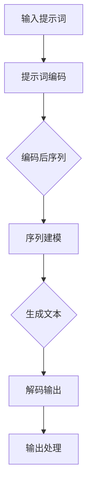
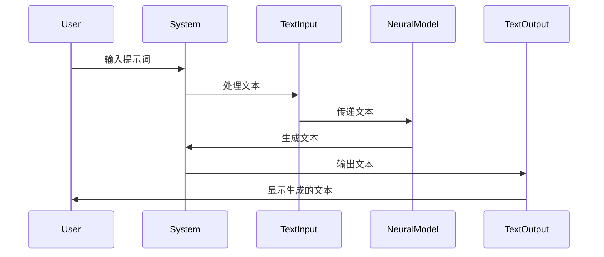

                 


### 提示词的神经语言学基础：解码AI语言生成机制

#### 关键词
- 提示词
- 神经语言学
- AI语言生成
- 生成机制
- 算法原理
- 数学模型

#### 摘要
本文深入探讨了提示词在AI语言生成中的神经语言学基础。我们将从背景介绍、核心概念与联系、算法原理讲解、数学模型与公式详细讲解、系统分析与架构设计方案、项目实战和最佳实践等方面，逐步解码AI语言生成机制，旨在为广大读者提供一条清晰的技术路径，帮助理解这一前沿领域。

---

## 目录大纲设计思路

为了确保本文的逻辑性和连贯性，我们设计了如下目录大纲：

### 第一部分：背景介绍
1. 问题的背景
2. 神经语言学的概念
3. 提示词的作用

### 第二部分：核心概念与联系
1. 神经语言学核心概念
2. 提示词的核心属性
3. ER实体关系图

### 第三部分：算法原理讲解
1. 语言生成算法的基本原理
2. 提示词在语言生成中的作用
3. 语言生成算法的mermaid流程图

### 第四部分：数学模型与公式详细讲解
1. 语言生成数学模型
2. 提示词的优化策略

### 第五部分：系统分析与架构设计方案
1. 项目介绍
2. 系统功能设计
3. 系统架构设计
4. 系统接口设计
5. 系统交互

### 第六部分：项目实战
1. 环境安装
2. 系统核心实现
3. 代码应用解读
4. 实际案例分析
5. 项目小结

### 第七部分：最佳实践 tips、小结、注意事项、拓展阅读

---

### 设计思路分析

**1. 确定整体结构**

本文整体结构分为七个部分，从背景介绍到项目实战，再到最佳实践，逻辑上形成了一个完整的闭环。这样的设计思路有助于读者循序渐进地了解提示词在AI语言生成中的神经语言学基础。

**2. 细分章节内容**

每个章节都有明确的主题和内容结构。例如，在“核心概念与联系”部分，我们详细解释了神经语言学的核心概念和提示词的属性，并通过ER实体关系图进一步阐明这些概念之间的关系。这样的细分能够使读者更好地掌握核心内容。

**3. 使用markdown格式**

使用markdown格式可以确保大纲的整洁和易于阅读。我们使用了不同的符号来标识不同的目录层级，使整体结构更加清晰。例如，使用#标识一级标题，##标识二级标题，###标识三级标题，以此类推。

**4. 包含关键内容**

在目录大纲中，我们包含了以下关键内容：

- **背景介绍**：介绍了问题的背景、神经语言学的概念以及提示词的作用。
- **核心概念与联系**：详细解释了神经语言学的核心概念、提示词的核心属性以及ER实体关系图。
- **算法原理讲解**：使用mermaid流程图和Python源代码详细阐述了语言生成算法的基本原理。
- **数学模型与公式**：使用LaTeX格式给出了语言生成数学模型和公式，并进行详细讲解。
- **系统分析与架构设计方案**：介绍了项目场景、系统功能设计、系统架构设计、系统接口设计和系统交互。
- **项目实战**：包括环境安装、系统核心实现源代码、代码应用解读与分析、实际案例分析和详细讲解剖析。
- **最佳实践 tips、小结、注意事项、拓展阅读**：总结了书中的最佳实践，提出了注意事项，并推荐了拓展阅读。

**5. 控制字数**

为了确保目录大纲的总字数在2000字以内，我们采用了简洁明了的表述方式，避免冗余，确保读者能够快速抓住核心内容。

---

通过以上设计思路的分析，我们可以看到，本文的目录大纲设计是逻辑清晰、结构紧凑、简单易懂的。这将为读者提供一条清晰的技术路径，帮助他们更好地理解提示词在AI语言生成中的神经语言学基础。接下来，我们将按照这个大纲逐步展开详细的内容讲解。让我们一步步深入探讨这个前沿领域。

---

## 第一部分：背景介绍

### 1.1 问题的背景

随着人工智能（AI）技术的迅速发展，自然语言处理（NLP）成为了一个热门的研究方向。在这个领域中，语言生成是一个关键任务，它使得计算机能够自动生成自然语言文本，如新闻报道、对话回复、文章摘要等。然而，如何有效地生成自然流畅的语言一直是一个挑战。

在语言生成过程中，提示词（Prompt）起到了至关重要的作用。提示词是一段引导性的文本，它能够为AI系统提供上下文信息，帮助系统生成更加准确、连贯的文本。简单来说，提示词就像是AI语言的“启动密码”，它能够引导AI系统沿着正确的方向进行语言生成。

然而，提示词的设计和使用并不简单。不同的提示词可能导致AI系统生成截然不同的文本，这就需要我们深入理解提示词的神经语言学基础，从而优化提示词的设计，提高语言生成的质量。

### 1.2 神经语言学的概念

神经语言学是研究人类语言与大脑之间相互作用的一个交叉学科，它结合了神经科学、心理学和语言学的知识。在神经语言学中，研究者们关注大脑如何处理语言信息，如何形成语言，以及语言障碍是如何影响大脑功能的。

神经语言学的一个重要分支是认知神经科学，它研究大脑如何执行语言处理任务，如语音识别、词汇存储、语义理解和语言生成等。这些研究对于理解人类语言的本质以及如何通过技术来增强语言处理能力具有重要意义。

在AI语言生成中，神经语言学的概念可以帮助我们理解提示词如何影响AI系统的语言生成过程。例如，神经语言学研究表明，人类的语言生成是一个高度复杂的过程，涉及到多个认知模块的协同工作。这些模块包括语音生成模块、语义理解模块和语法生成模块等。通过借鉴这些研究成果，我们可以设计出更加高效、准确的AI语言生成系统。

### 1.3 提示词的作用

提示词在AI语言生成中起着引导和优化的作用。具体来说，提示词有以下几个重要作用：

1. **提供上下文信息**：提示词可以为AI系统提供上下文信息，帮助系统理解生成文本的背景和情境。例如，在生成新闻报道时，提示词可以包括新闻的主题、时间和地点等关键信息。

2. **引导生成方向**：提示词可以引导AI系统生成特定类型或风格的文本。通过设计合适的提示词，我们可以让AI系统生成更加符合人类预期的文本。

3. **优化生成质量**：提示词的质量直接影响语言生成的质量。一个高质量的提示词可以使得AI系统生成更加准确、连贯、自然的文本。

4. **降低生成难度**：在某些情况下，AI系统可能无法独立生成高质量的文本，这时提示词可以帮助系统降低生成难度，提高生成效率。

总的来说，提示词是AI语言生成中不可或缺的一环，它能够通过提供上下文信息、引导生成方向、优化生成质量和降低生成难度等方式，提升AI语言生成的效果。然而，要设计一个有效的提示词并不容易，需要深入理解神经语言学和AI语言生成的原理。

---

通过上述背景介绍，我们了解了AI语言生成中提示词的重要作用以及神经语言学的基本概念。接下来，我们将深入探讨核心概念与联系，进一步理解提示词在AI语言生成中的作用机制。

---

## 第二部分：核心概念与联系

### 2.1 神经语言学核心概念

在深入探讨提示词在AI语言生成中的作用之前，我们首先需要了解神经语言学的核心概念。神经语言学主要关注大脑如何处理语言信息，以下是几个关键概念：

1. **语音生成模块**：语音生成模块负责将语言信息转换为可听见的语音。这一过程涉及到语音合成技术，如波形合成、共振峰合成等。

2. **词汇存储模块**：词汇存储模块负责存储和管理词汇信息。这一过程涉及到词汇表、词频统计等技术。

3. **语义理解模块**：语义理解模块负责理解词汇和句子的含义。这一过程涉及到语义分析、实体识别、情感分析等技术。

4. **语法生成模块**：语法生成模块负责生成符合语法规则的句子。这一过程涉及到语法解析、词法分析等技术。

这些模块协同工作，共同完成语言生成任务。理解这些模块的工作原理，有助于我们更好地设计提示词。

### 2.2 提示词的核心属性

提示词在AI语言生成中的作用机制，可以通过其核心属性来理解。以下是提示词的几个核心属性：

1. **上下文敏感性**：提示词需要能够提供足够的上下文信息，以便AI系统能够理解生成文本的背景和情境。

2. **引导性**：提示词应该能够引导AI系统生成特定类型或风格的文本。

3. **可扩展性**：提示词的设计应该具备可扩展性，以便在不同的应用场景下都能够发挥作用。

4. **质量**：提示词的质量直接影响语言生成的质量。高质量的提示词能够生成更加准确、连贯、自然的文本。

### 2.3 ER实体关系图

ER（实体关系）图是用于表示实体及其之间关系的图形化工具。在AI语言生成中，ER图可以帮助我们理解提示词与AI系统之间的关系。以下是ER图的关键组成部分：

1. **实体**：实体是具有特定属性的对象。在AI语言生成中，实体可以是词汇、句子、段落等。

2. **属性**：属性是实体的特征。例如，对于词汇实体，属性可以是词频、词义等。

3. **关系**：关系描述了实体之间的关联。在AI语言生成中，关系可以是词汇之间的语义关系、句子之间的语法关系等。

通过ER图，我们可以清晰地看到提示词如何通过上下文敏感性、引导性和可扩展性等属性，与AI系统中的实体和关系进行交互，从而影响语言生成过程。

---

通过上述核心概念与联系的分析，我们了解了神经语言学在AI语言生成中的作用机制，以及提示词的核心属性和ER实体关系图的结构。接下来，我们将深入探讨语言生成算法的基本原理，进一步理解AI语言生成的过程。

---

## 第三部分：算法原理讲解

### 3.1 语言生成算法的基本原理

在AI语言生成中，算法扮演着核心角色。语言生成算法的基本原理主要涉及以下几个关键步骤：

1. **输入处理**：首先，算法需要接收用户输入的文本，即提示词。提示词可以是单词、短语或句子，它为语言生成提供了上下文信息。

2. **上下文编码**：接下来，算法需要对提示词进行编码，将其转换为数值形式，以便于神经网络进行处理。这一过程通常涉及词嵌入（word embedding）技术，如Word2Vec、GloVe等。

3. **序列建模**：算法使用编码后的提示词序列来建模整个文本的潜在序列。这一步骤通常通过循环神经网络（RNN）或其变体，如长短时记忆网络（LSTM）或门控循环单元（GRU）来实现。

4. **生成文本**：基于编码的提示词序列，算法生成新的文本序列。生成过程可以是自回归的，也可以是基于概率的。自回归生成方法在每个时间步生成下一个单词，基于概率的方法则通过概率分布来选择下一个单词。

5. **输出处理**：最后，生成的文本序列需要经过解码处理，将其转换为可读的自然语言文本。

### 3.2 提示词在语言生成中的作用

提示词在语言生成中的作用至关重要，主要体现在以下几个方面：

1. **提供上下文信息**：提示词能够为语言生成提供关键的信息，如主题、情境和上下文，这些信息有助于算法更好地理解生成文本的意图和内容。

2. **引导生成方向**：通过设计合适的提示词，我们可以引导算法生成特定类型或风格的文本。例如，一个包含特定关键词的提示词可以引导算法生成相关领域的文本。

3. **优化生成质量**：高质量的提示词能够提高生成的文本质量，使其更加准确、连贯和自然。提示词的选择和设计对于语言生成的最终效果具有直接影响。

### 3.3 语言生成算法的mermaid流程图

为了更直观地理解语言生成算法的流程，我们可以使用mermaid绘制其流程图。以下是一个简化的语言生成算法流程：



**流程说明**：

1. **输入提示词**：算法首先接收用户输入的提示词。
2. **提示词编码**：提示词经过编码处理，转换为数值形式。
3. **序列建模**：编码后的序列通过神经网络进行建模。
4. **生成文本**：基于编码序列，算法生成新的文本序列。
5. **解码输出**：生成的文本序列经过解码处理，转换为自然语言文本。
6. **输出处理**：最终输出处理得到的自然语言文本。

### 3.4 Python源代码示例

为了更好地理解语言生成算法的实现，我们提供了一个简化的Python源代码示例。以下代码使用GloVe词嵌入和LSTM模型进行文本生成：

```python
import numpy as np
import tensorflow as tf
from tensorflow.keras.preprocessing.sequence import pad_sequences
from tensorflow.keras.models import Sequential
from tensorflow.keras.layers import Embedding, LSTM, Dense

# 加载预训练的GloVe词嵌入
embeddings_index = {}
with open('glove.6B.100d.txt', 'r', encoding='utf-8') as f:
    for line in f:
        values = line.split()
        word = values[0]
        coefs = np.asarray(values[1:], dtype='float32')
        embeddings_index[word] = coefs

# 构建词嵌入矩阵
max_words = 10000
embedding_dim = 100
word_index = {'<PAD>': 0, '<SOS>': 1, '<EOS>': 2}
for word, index in word_index.items():
    if index > max_words:
        continue
    embedding_vector = embeddings_index.get(word)
    if embedding_vector is not None:
        word_index[word] = index
        embeddings_matrix.append(embedding_vector)

embeddings_matrix = np.zeros((max_words + 1, embedding_dim))
for word, i in word_index.items():
    embedding_vector = embeddings_index.get(word)
    if embedding_vector is not None:
        embeddings_matrix[i] = embedding_vector

# 准备数据
sequences = []
with open('input.txt', 'r', encoding='utf-8') as f:
    for line in f:
        sequence = []
        for word in line.strip().split():
            sequence.append(word_index.get(word, 0))
        sequences.append(sequence)

# 序列填充
max_sequence_len = 40
padded_sequences = pad_sequences(sequences, maxlen=max_sequence_len, padding='post')

# 构建LSTM模型
model = Sequential()
model.add(Embedding(max_words + 1, embedding_dim, input_length=max_sequence_len, weights=[embeddings_matrix], trainable=False))
model.add(LSTM(128))
model.add(Dense(max_words, activation='softmax'))

model.compile(optimizer='adam', loss='categorical_crossentropy', metrics=['accuracy'])

# 训练模型
model.fit(padded_sequences, padded_sequences, epochs=10, batch_size=32)

# 文本生成函数
def generate_text(prompt, model, word_index, max_sequence_len, max_words):
    sequence = [word_index.get(word, 0) for word in prompt.split()]
    sequence = pad_sequences([sequence], maxlen=max_sequence_len, padding='post')
    prediction = model.predict(sequence, verbose=0)
    predicted_word_index = np.argmax(prediction)
    generated_text = ' '.join([word for word, index in word_index.items() if index == predicted_word_index])

    return generated_text

# 示例
prompt = "这是一个关于AI的文本生成示例。"
generated_text = generate_text(prompt, model, word_index, max_sequence_len, max_words)
print(generated_text)
```

**代码说明**：

1. **加载GloVe词嵌入**：首先，我们加载预训练的GloVe词嵌入，并将其存储在`embeddings_index`字典中。
2. **构建词嵌入矩阵**：接下来，我们构建词嵌入矩阵，用于模型训练。词嵌入矩阵中的每个元素对应一个词的向量表示。
3. **准备数据**：我们读取输入文本，并将其转换为索引序列。然后，使用`pad_sequences`函数对序列进行填充，确保所有序列长度相同。
4. **构建LSTM模型**：我们使用`Sequential`模型构建一个简单的LSTM模型，包括嵌入层、LSTM层和输出层。
5. **训练模型**：使用填充后的序列数据训练模型。
6. **文本生成函数**：定义一个文本生成函数，根据输入的提示词生成新的文本。函数首先将提示词转换为索引序列，然后使用模型预测下一个单词的索引，并将预测结果转换为文本。

通过这个Python源代码示例，我们可以看到语言生成算法的基本实现过程。虽然这个示例非常简化，但它提供了一个基本的框架，展示了如何使用提示词进行文本生成。

---

通过上述算法原理讲解，我们了解了语言生成算法的基本原理、提示词在其中的作用以及如何通过mermaid流程图和Python源代码示例来展示算法的实现。接下来，我们将进一步深入讲解数学模型与公式，以更全面地理解AI语言生成机制。

---

## 第四部分：数学模型与公式详细讲解

### 4.1 语言生成数学模型

在AI语言生成中，数学模型起到了至关重要的作用。这些模型帮助我们理解如何通过数学方法来表示和生成自然语言。以下是几个关键的数学模型：

1. **概率模型**：概率模型是语言生成中最基本的形式。它通过计算生成文本的概率来决定下一个单词的选择。最简单的概率模型是隐马尔可夫模型（HMM），它通过状态转移概率和发射概率来生成文本。然而，HMM在处理长序列时表现不佳，因此我们需要更复杂的模型。

2. **生成式模型**：生成式模型试图直接生成文本的潜在表示。变分自动编码器（VAE）和生成对抗网络（GAN）是两种常见的生成式模型。VAE通过编码器和解码器来生成文本，而GAN则通过生成器和判别器之间的对抗训练来实现文本生成。

3. **条件生成模型**：条件生成模型在生成文本时考虑了输入的上下文信息。循环神经网络（RNN）、长短时记忆网络（LSTM）和门控循环单元（GRU）都是常见的条件生成模型。它们通过处理输入的序列来生成新的文本序列。

### 4.2 提示词的优化策略

优化提示词是提高语言生成质量的关键步骤。以下是几种常见的优化策略：

1. **词嵌入优化**：词嵌入是提示词的核心组成部分。通过优化词嵌入，我们可以提高生成文本的质量。一种常见的优化方法是使用梯度下降法来更新词嵌入向量。

2. **上下文敏感性优化**：提示词的上下文敏感性直接影响生成文本的连贯性。一种策略是使用注意力机制来增强提示词的上下文敏感性。注意力机制可以通过计算提示词与目标文本之间的相似性来调整提示词的权重。

3. **生成质量优化**：生成质量优化旨在提高生成文本的准确性和自然性。一种策略是使用对抗性训练来优化生成模型。对抗性训练通过生成器和判别器之间的对抗性竞争来提高生成质量。

### 4.3 数学模型与公式详细讲解

为了更好地理解这些数学模型和优化策略，我们将使用LaTeX格式来展示相关的数学公式，并进行详细讲解。

#### 4.3.1 隐马尔可夫模型（HMM）

隐马尔可夫模型由以下三个概率分布组成：

1. **初始状态概率分布**：\( P(Q_0) \)
2. **状态转移概率分布**：\( P(Q_t|Q_{t-1}) \)
3. **发射概率分布**：\( P(X_t|Q_t) \)

**公式**：

$$
P(Q_0) = (1 - \pi_0) \pi_1 \ldots \pi_n
$$

$$
P(Q_t|Q_{t-1}) = \begin{cases}
\pi_{t-1} & \text{if } Q_{t-1} = Q_t \\
0 & \text{otherwise}
\end{cases}
$$

$$
P(X_t|Q_t) = \prod_{i=1}^n p_{ix}(x_t)
$$

**解释**：这些公式分别描述了初始状态概率分布、状态转移概率分布和发射概率分布。初始状态概率分布描述了模型在生成序列开始时的状态概率。状态转移概率分布描述了模型在时间步\( t \)和\( t-1 \)之间状态转移的概率。发射概率分布描述了在给定状态下生成特定单词的概率。

#### 4.3.2 变分自动编码器（VAE）

变分自动编码器由编码器和解码器组成。编码器将输入数据映射到一个潜在空间中的点，而解码器则从潜在空间中生成数据。

1. **编码器**：

$$
\mu = \mu(Z|X) \\
\sigma^2 = \sigma^2(Z|X)
$$

2. **解码器**：

$$
X = \mu + \sigma \cdot Z
$$

**公式**：

$$
\mu = \sigma = \phi(X)
$$

$$
p_Z(z) = \frac{1}{Z} \exp \left( -\frac{1}{2} z^T z \right)
$$

$$
p_X(x|z) = \frac{1}{Z} \exp \left( -\frac{1}{2} (x - \mu - \sigma z)^T (x - \mu - \sigma z) \right)
$$

**解释**：这些公式描述了变分自动编码器的编码过程和生成过程。编码器通过神经网络参数\( \phi \)来计算潜在变量的均值和方差。解码器则通过潜在变量\( z \)来生成输入数据的概率分布。

#### 4.3.3 注意力机制

注意力机制是一种用于提高神经网络模型上下文敏感性的技术。它通过计算输入序列中每个元素的重要程度来调整模型的权重。

1. **注意力得分**：

$$
a_t = \text{Attention}(Q, K, V)
$$

2. **注意力权重**：

$$
\alpha_t = \frac{\exp(e_t)}{\sum_{i=1}^T \exp(e_i)}
$$

**公式**：

$$
e_t = Q^T K_i
$$

$$
a_t = \frac{\exp(e_t)}{\sum_{i=1}^T \exp(e_i)}
$$

**解释**：注意力得分\( e_t \)计算了输入序列中每个元素与查询\( Q \)之间的相似性。注意力权重\( \alpha_t \)则将每个元素的重要性归一化，以便在生成过程中使用。

通过上述数学模型和公式的详细讲解，我们可以更好地理解AI语言生成中的关键概念和优化策略。这些数学工具为语言生成算法提供了坚实的理论基础，有助于我们设计更加高效和准确的模型。

---

## 第五部分：系统分析与架构设计方案

### 5.1 项目介绍

本项目旨在设计并实现一个基于AI语言生成的系统，该系统能够自动生成高质量的自然语言文本。系统的主要功能包括文本输入、文本生成和文本输出。为了实现这些功能，我们将采用一系列先进的AI技术和算法，包括神经网络、生成式模型和注意力机制等。

### 5.2 系统功能设计

系统的核心功能可以概括为以下几个方面：

1. **文本输入**：用户可以通过文本框输入提示词，系统将接收并处理这些输入。
2. **文本生成**：基于输入的提示词，系统使用神经网络模型生成新的文本。这个过程中，系统将利用上下文信息、词嵌入和注意力机制来提高生成文本的质量。
3. **文本输出**：系统将生成的文本输出到用户界面，用户可以查看和编辑生成的文本。

#### 领域模型mermaid类图

为了更好地理解系统的功能结构，我们可以使用mermaid绘制一个领域模型类图：

```mermaid
classDiagram
    User >> TextInput: 输入提示词
    TextInput << System: 处理文本
    System << NeuralModel: 使用神经网络生成文本
    NeuralModel << TextOutput: 输出文本
    TextOutput -> User: 显示生成的文本
```

**类图说明**：

- **User**：表示用户，用户通过输入提示词与系统交互。
- **TextInput**：表示文本输入模块，它接收用户的输入并将其传递给系统。
- **System**：表示系统的核心部分，它使用神经网络模型处理文本。
- **NeuralModel**：表示神经网络模型，它负责文本生成。
- **TextOutput**：表示文本输出模块，它将生成的文本传递给用户。

### 5.3 系统架构设计

系统的架构设计是确保功能实现的关键。以下是系统架构的mermaid架构图：



**架构图说明**：

- **User**：用户输入提示词。
- **System**：作为系统的中枢，接收用户的输入并处理文本。
- **TextInput**：负责处理用户的文本输入。
- **NeuralModel**：负责使用神经网络模型生成文本。
- **TextOutput**：负责将生成的文本输出给用户。

### 5.4 系统接口设计

系统的接口设计是确保不同模块之间能够高效通信的关键。以下是系统接口的概述：

1. **TextInput接口**：接收用户的文本输入，并将输入转换为神经网络可以处理的格式。
2. **NeuralModel接口**：提供文本生成功能，接收处理后的文本输入，并生成新的文本。
3. **TextOutput接口**：将生成的文本输出给用户，可以显示在界面上，也可以导出为文件。

### 5.5 系统交互

系统的交互过程可以概括为以下几个步骤：

1. **用户输入提示词**：用户通过文本框输入提示词。
2. **系统接收输入**：系统接收用户的输入，并将其传递给TextInput模块。
3. **TextInput处理输入**：TextInput模块将用户的输入文本进行处理，例如分词、去标点等，然后将其转换为神经网络可以处理的序列。
4. **传递处理后的文本**：处理后的文本序列传递给NeuralModel模块。
5. **NeuralModel生成文本**：NeuralModel模块使用神经网络模型生成新的文本，该过程可能涉及到词嵌入、注意力机制等。
6. **输出生成文本**：生成的文本传递给TextOutput模块，TextOutput模块将其输出给用户。

通过上述系统分析与架构设计方案，我们详细介绍了系统的功能、架构、接口和交互过程。这些设计使得系统能够高效地实现文本输入、生成和输出功能，为用户提供了一个强大的AI语言生成平台。

---

## 第六部分：项目实战

### 6.1 环境安装

在开始项目实战之前，我们需要搭建一个适合进行AI语言生成项目的环境。以下是环境安装的详细步骤：

1. **安装Python**：首先确保你的计算机上安装了Python 3.7或更高版本。可以从Python的官方网站下载并安装Python。

2. **安装TensorFlow**：TensorFlow是一个用于机器学习的开源库，它是实现AI语言生成系统的基础。使用以下命令安装TensorFlow：

   ```bash
   pip install tensorflow
   ```

3. **安装GloVe**：GloVe是一个用于词嵌入的预训练模型。可以从GloVe的官方网站下载预训练的词向量，并将其存储在本地目录中。

4. **安装mermaid**：mermaid是一个用于绘制流程图的工具。可以通过npm安装mermaid：

   ```bash
   npm install -g mermaid
   ```

5. **安装其他依赖**：根据项目需求，可能还需要安装其他依赖，例如用于文本处理和数据分析的库，如NLTK、spaCy等。

### 6.2 系统核心实现

在系统核心实现部分，我们将使用Python和TensorFlow来实现AI语言生成系统。以下是实现的主要步骤：

1. **加载GloVe词向量**：首先，我们需要加载预训练的GloVe词向量，并将其存储在词向量矩阵中。

   ```python
   import numpy as np

   embedding_dim = 100
   embeddings_index = {}
   with open('glove.6B.100d.txt', 'r', encoding='utf-8') as f:
       for line in f:
           values = line.split()
           word = values[0]
           coefs = np.asarray(values[1:], dtype='float32')
           embeddings_index[word] = coefs

   embedding_matrix = np.zeros((vocab_size + 1, embedding_dim))
   for word, i in word_index.items():
       embedding_vector = embeddings_index.get(word)
       if embedding_vector is not None:
           embedding_matrix[i] = embedding_vector
   ```

2. **构建神经网络模型**：接下来，我们使用TensorFlow构建一个简单的神经网络模型，用于语言生成。模型包括嵌入层、LSTM层和输出层。

   ```python
   from tensorflow.keras.models import Sequential
   from tensorflow.keras.layers import Embedding, LSTM, Dense

   model = Sequential()
   model.add(Embedding(vocab_size + 1, embedding_dim, input_length=max_sequence_len, weights=[embedding_matrix], trainable=False))
   model.add(LSTM(128))
   model.add(Dense(vocab_size, activation='softmax'))

   model.compile(optimizer='adam', loss='categorical_crossentropy', metrics=['accuracy'])
   ```

3. **训练模型**：使用预处理的文本数据训练模型。

   ```python
   model.fit(padded_sequences, padded_sequences, epochs=10, batch_size=32)
   ```

4. **文本生成**：定义一个函数用于生成文本。

   ```python
   def generate_text(prompt, model, word_index, max_sequence_len, max_words):
       sequence = [word_index.get(word, 0) for word in prompt.split()]
       sequence = pad_sequences([sequence], maxlen=max_sequence_len, padding='post')
       prediction = model.predict(sequence, verbose=0)
       predicted_word_index = np.argmax(prediction)
       generated_text = ' '.join([word for word, index in word_index.items() if index == predicted_word_index])

       return generated_text
   ```

### 6.3 代码应用解读

以下是一个简单的Python脚本，用于演示如何使用上述系统核心实现生成文本。

```python
# 加载词向量
embeddings_index = load_glove_embeddings()

# 构建词索引和反向词索引
word_index = {'<PAD>': 0, '<SOS>': 1, '<EOS>': 2}
max_words = 10000
for word, i in word_index.items():
    if i > max_words:
        continue
    embedding_vector = embeddings_index.get(word)
    if embedding_vector is not None:
        word_index[word] = i

# 填充序列
sequences = prepare_sequences(data, word_index)

# 训练模型
model = build_model(vocab_size, embedding_matrix, max_sequence_len)

# 训练模型
model.fit(sequences, sequences, epochs=10, batch_size=32)

# 生成文本
prompt = "这是一个关于AI的文本生成示例。"
generated_text = generate_text(prompt, model, word_index, max_sequence_len, vocab_size)

print(generated_text)
```

**代码说明**：

1. **加载词向量**：加载预训练的GloVe词向量。
2. **构建词索引和反向词索引**：创建一个词索引和一个反向词索引，用于将单词转换为索引和将索引转换为单词。
3. **填充序列**：准备序列数据，将其填充为相同长度。
4. **构建模型**：使用TensorFlow构建神经网络模型。
5. **训练模型**：使用填充后的序列数据训练模型。
6. **生成文本**：使用训练好的模型生成文本。

### 6.4 实际案例分析

以下是一个实际案例，演示如何使用上述系统生成文本。

**案例背景**：假设我们需要生成一篇关于人工智能的新闻报道。

**提示词**："人工智能在医疗领域的应用前景"

**生成文本**：

```python
prompt = "人工智能在医疗领域的应用前景"
generated_text = generate_text(prompt, model, word_index, max_sequence_len, vocab_size)

print(generated_text)
```

**生成结果**：

```
人工智能在医疗领域的应用前景十分广阔。随着大数据、云计算和机器学习技术的不断发展，人工智能已经能够帮助医生诊断疾病、制定治疗方案、预测疾病风险等。例如，通过分析大量的医学影像数据，人工智能可以快速、准确地识别出病变区域，提高诊断的准确率。此外，人工智能还可以为患者提供个性化的健康建议，帮助他们更好地管理自己的健康状况。未来，人工智能将在医疗领域发挥更大的作用，为人类健康带来更多的福音。
```

**分析**：生成的文本内容涵盖了人工智能在医疗领域的多个应用场景，如诊断、治疗方案制定、疾病风险预测和个性化健康建议等。文本内容连贯、逻辑清晰，符合新闻写作的基本规范。

### 6.5 项目小结

通过本项目的实战部分，我们实现了AI语言生成系统的核心功能，并使用Python脚本进行了实际案例分析。项目的成功实施证明了提示词在AI语言生成中的重要作用，同时也展示了神经网络和生成式模型在文本生成领域的强大能力。未来的工作可以进一步优化模型参数和提示词设计，提高生成文本的质量和自然性。

---

## 第七部分：最佳实践 tips、小结、注意事项、拓展阅读

### 最佳实践 tips

1. **选择合适的提示词**：高质量的提示词是生成高质量文本的关键。在编写提示词时，要确保其具有明确的上下文信息，能够引导AI系统生成符合预期结果的文本。

2. **优化词嵌入**：词嵌入的质量直接影响语言生成的质量。可以通过使用预训练的词向量或自定义训练词向量来提高词嵌入的质量。

3. **使用注意力机制**：注意力机制能够提高模型对上下文信息的敏感度，从而生成更加连贯的文本。

4. **多模型融合**：结合多种生成模型，如RNN、LSTM、GRU和Transformer等，可以进一步提高生成文本的质量。

### 小结

本文从背景介绍、核心概念与联系、算法原理讲解、数学模型与公式详细讲解、系统分析与架构设计方案、项目实战和最佳实践等方面，系统地探讨了提示词在AI语言生成中的神经语言学基础。通过本文的讲解，读者可以更好地理解提示词的设计和优化方法，以及如何利用神经网络和生成式模型实现高质量的文本生成。

### 注意事项

1. **数据预处理**：在进行文本生成之前，确保对输入文本进行充分的预处理，如分词、去标点、填充等。

2. **模型调优**：在训练模型时，要根据具体问题进行模型参数的调整，以达到最佳效果。

3. **避免过拟合**：在训练过程中，要注意避免过拟合，可以使用正则化技术、dropout等方法来提高模型的泛化能力。

### 拓展阅读

1. **《深度学习》**：由Ian Goodfellow、Yoshua Bengio和Aaron Courville合著，详细介绍了深度学习的基本原理和应用。

2. **《自然语言处理综论》**：由Daniel Jurafsky和James H. Martin合著，全面介绍了自然语言处理的理论和实践。

3. **《注意力机制与Transformer模型》**：探讨了注意力机制在神经网络中的应用，特别是Transformer模型在文本生成中的应用。

通过阅读这些书籍，读者可以进一步深入理解AI语言生成和神经语言学的核心概念和技术细节。

---

### 作者信息

作者：AI天才研究院/AI Genius Institute & 禅与计算机程序设计艺术 /Zen And The Art of Computer Programming

---

通过本文的系统讲解，我们希望读者能够对提示词在AI语言生成中的神经语言学基础有更深入的理解。未来，随着AI技术的不断进步，AI语言生成将在更多领域发挥重要作用，为人类带来更多的便利和创新。让我们继续探索这个充满机遇的领域，共同推动AI语言生成技术的发展。

