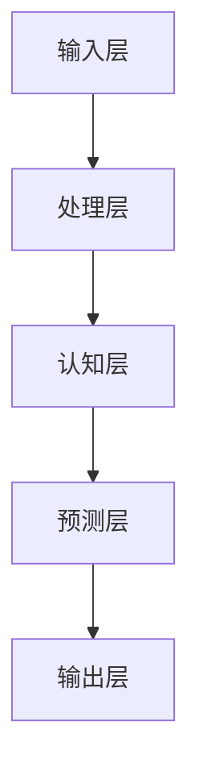
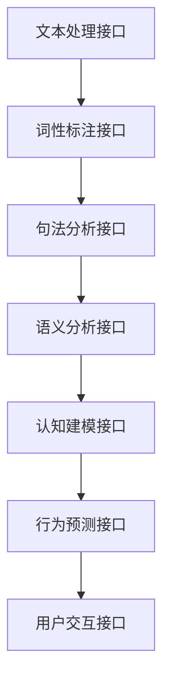
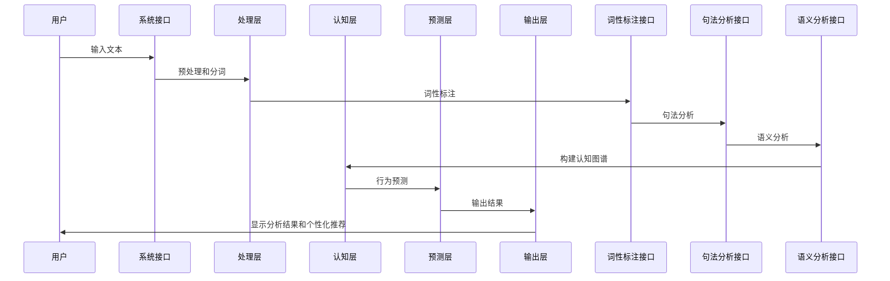

                 

# 提示词的计算语言学与认知科学交叉研究新发现

关键词：计算语言学、认知科学、交叉研究、自然语言处理、认知建模

摘要：本文围绕计算语言学与认知科学的交叉领域，探讨了这一新兴研究方向的核心概念、算法原理及系统设计与实现。通过深入分析两者的交叉点与应用场景，本文旨在揭示计算语言学与认知科学在语言处理、认知建模等方面的潜力，为相关领域的研究提供新的视角和方法。

## 第1章 背景介绍

### 1.1 问题背景

随着人工智能技术的快速发展，计算语言学和认知科学在多方面产生了交叉，如何更好地理解和利用这些交叉领域的研究成果成为一个重要课题。计算语言学是研究语言和计算机科学交叉的学科，涉及自然语言处理、形式语言理论等；认知科学则是研究人类思维过程和智能行为的学科，包括心理学、神经科学、计算机科学等。

在计算语言学中，自然语言处理（NLP）是一项核心任务，其目的是使计算机能够理解和处理人类语言。NLP的研究包括文本分类、情感分析、机器翻译、语音识别等。而认知科学则关注人类的认知过程，如感知、记忆、推理、语言理解等。认知科学的成果在计算机科学领域有着广泛的应用，如认知建模、智能代理、人机交互等。

计算语言学和认知科学的交叉研究具有以下几个方面的意义：

1. **促进语言处理技术的提升**：计算语言学提供了丰富的理论和工具，用于分析语言的结构和语义；认知科学则提供了对人类认知过程的理解，有助于改进语言处理算法。

2. **推动认知建模的发展**：通过将计算语言学的技术应用于认知建模，可以构建更接近人类思维的智能系统，提高机器对语言和情境的理解能力。

3. **深入理解人类语言和思维**：交叉研究有助于揭示语言与认知的内在联系，为心理学、语言学等领域的研究提供新的视角。

### 1.2 问题解决

为了更好地理解和利用计算语言学与认知科学的交叉研究成果，本文将从以下几个方面进行探讨：

1. **核心概念解析**：介绍计算语言学和认知科学的基本概念，并分析两者之间的联系。

2. **算法原理讲解**：阐述计算语言学与认知科学交叉领域的算法原理，包括自然语言处理算法和认知建模算法。

3. **系统设计与实现**：分析计算语言学与认知科学交叉应用在系统设计中的具体实现，包括系统架构、接口设计和交互流程。

4. **项目实战**：通过实际项目案例，展示计算语言学与认知科学交叉研究的应用效果，并进行详细解析。

### 1.3 边界与外延

本文研究的范畴主要涵盖计算语言学的基本概念、认知科学的理论体系，以及两者在语言处理、认知建模等方面的交叉应用。具体包括：

- **计算语言学**：自然语言处理、形式语言理论、文本分析等。
- **认知科学**：认知心理学、神经科学、认知建模等。
- **交叉领域**：语言处理算法在认知建模中的应用、认知科学理论在自然语言处理中的借鉴等。

### 1.4 概念结构与核心要素组成

核心概念包括计算语言学、认知科学、交叉领域研究、语言处理、认知建模等。各概念之间的关系如下：

1. **计算语言学**：研究语言和计算机科学的交叉，为自然语言处理提供理论基础和技术支持。
2. **认知科学**：研究人类思维过程和智能行为，提供对认知过程的深入理解。
3. **交叉领域研究**：将计算语言学和认知科学的成果进行结合，探索新的研究方向和应用场景。
4. **语言处理**：计算语言学的核心任务，涉及文本分析、语义理解、机器翻译等。
5. **认知建模**：认知科学的成果在计算机科学领域的应用，涉及智能系统、人机交互等。

## 第2章 核心概念与联系

### 2.1 核心概念原理

#### 计算语言学

计算语言学是研究语言和计算机科学交叉的学科，主要涉及自然语言处理、形式语言理论等。自然语言处理（NLP）是计算语言学的核心任务，旨在使计算机能够理解和处理人类语言。NLP的研究包括文本分类、情感分析、机器翻译、语音识别等。形式语言理论则研究语言的形式结构，包括词法分析、句法分析、语义分析等。

#### 认知科学

认知科学是研究人类思维过程和智能行为的学科，涉及心理学、神经科学、计算机科学等多个领域。认知科学的核心任务是理解人类的认知过程，包括感知、记忆、推理、语言理解等。认知科学的成果为计算机科学提供了对人类思维过程的模拟和优化方法。

#### 交叉领域研究

交叉领域研究是指将计算语言学和认知科学的成果进行结合，探索新的研究方向和应用场景。交叉领域研究的目的是发挥计算语言学和认知科学的各自优势，提高语言处理和认知建模的准确性、效率和应用范围。

### 2.2 概念属性特征对比

| 概念        | 特征                           |
| ----------- | ----------------------------- |
| 计算语言学 | 强调语言的结构和形式处理       |
| 认知科学    | 强调人类的思维过程和智能行为   |
| 交叉领域    | 强调两者的结合和互为补充      |

### 2.3 ER实体关系图架构

```mermaid
erDiagram
  Category ||--o{ Product }
  Product ||--o{ Order }
  Order ||--o{ Customer }
```

## 第3章 算法原理讲解

### 3.1 算法原理

#### 语言处理算法

语言处理算法主要包括词性标注、句法分析、语义分析等。词性标注是对文本中的每个词进行分类，标记其词性（如名词、动词、形容词等）。句法分析是对文本的句子结构进行解析，确定句子中词与词之间的关系。语义分析则是对文本的语义进行理解，提取出文本的含义。

#### 认知建模算法

认知建模算法主要包括认知图谱构建、情感分析、认知行为预测等。认知图谱构建是将人类认知过程抽象为图结构，用于表示知识、概念和关系。情感分析是对文本的情感倾向进行识别，判断文本是积极的、消极的还是中性的。认知行为预测则是根据用户的语言和行为，预测其可能的意图或行为。

### 3.2 算法mermaid流程图


### 3.3 Python源代码示例

```python
# Python源代码示例：词性标注
from nltk import pos_tag
sentence = "我喜欢吃苹果。"
tokens = pos_tag(sentence.split())
print(tokens)
```

### 3.4 数学模型和数学公式

贝叶斯定理是概率论中的一个重要公式，用于计算事件发生的条件概率。在计算语言学与认知科学的交叉研究中，贝叶斯定理可以用于情感分析、行为预测等领域。

$$
P(A|B) = \frac{P(B|A)P(A)}{P(B)}
$$

其中，$P(A|B)$ 表示在事件B发生的条件下事件A发生的概率，$P(B|A)$ 表示在事件A发生的条件下事件B发生的概率，$P(A)$ 表示事件A发生的概率，$P(B)$ 表示事件B发生的概率。

### 3.5 举例说明

假设事件A表示“今天下雨”，事件B表示“我带伞”。根据贝叶斯定理，我们可以计算出“今天下雨且我带伞的概率”。

$$
P(A \cap B) = P(B|A)P(A) = P(A|B)P(B)
$$

例如，已知在下雨的天气中，带伞的概率为80%，而在所有天气中，带伞的概率为50%。根据贝叶斯定理，我们可以计算出在下雨的条件下带伞的概率：

$$
P(B|A) = \frac{P(A|B)P(B)}{P(A)} = \frac{0.8 \times 0.5}{0.5} = 0.8
$$

因此，在下雨的条件下，带伞的概率为80%。

## 第4章 系统分析与架构设计

### 4.1 问题场景介绍

本节将介绍一个基于计算语言学与认知科学交叉的应用系统，用于分析用户语言行为和认知模式。该系统的目标是通过对用户语言行为的分析，预测用户的意图和需求，为用户提供个性化的服务和推荐。

### 4.2 系统功能设计

系统功能设计包括以下几个部分：

1. **自然语言处理**：对用户输入的文本进行预处理、分词、词性标注、句法分析、语义分析等，提取出文本中的关键信息。

2. **认知建模**：根据用户的语言行为，构建用户认知图谱，用于表示用户的知识、概念和关系。

3. **行为预测**：基于用户认知图谱和语言行为，预测用户的意图和需求，为用户提供个性化的服务和推荐。

4. **用户交互**：提供用户界面，允许用户输入文本，查看分析结果和个性化推荐。

### 4.3 系统架构设计

系统架构设计包括以下几个部分：

1. **输入层**：接收用户输入的文本，进行预处理和分词。

2. **处理层**：对文本进行词性标注、句法分析、语义分析等，提取出关键信息。

3. **认知层**：构建用户认知图谱，用于表示用户的知识、概念和关系。

4. **预测层**：基于用户认知图谱和语言行为，预测用户的意图和需求。

5. **输出层**：将预测结果呈现给用户，提供个性化的服务和推荐。

系统架构设计图如下所示：



### 4.4 系统接口设计

系统接口设计包括以下几个部分：

1. **文本处理接口**：用于接收用户输入的文本，进行预处理和分词。

2. **词性标注接口**：用于对文本中的词进行词性标注。

3. **句法分析接口**：用于对文本的句子结构进行解析。

4. **语义分析接口**：用于对文本的语义进行理解。

5. **认知建模接口**：用于构建用户认知图谱。

6. **行为预测接口**：用于基于用户认知图谱和语言行为进行行为预测。

7. **用户交互接口**：用于接收用户操作，展示分析结果和个性化推荐。

系统接口设计图如下所示：



### 4.5 系统交互mermaid序列图



## 第5章 项目实战

### 5.1 环境安装

在本节中，我们将介绍如何搭建计算语言学与认知科学交叉应用的环境，包括所需的软件和工具。

#### 5.1.1 环境准备

1. **Python环境**：安装Python 3.x版本。
2. **自然语言处理库**：安装NLP相关库，如NLTK、spaCy等。
3. **认知科学工具**：安装用于认知建模的工具，如Cognitive Toolkit等。
4. **其他依赖**：根据项目需求，可能还需要安装其他库和工具。

#### 5.1.2 安装步骤

1. **安装Python**：在官网下载Python安装包，并按照安装向导进行安装。

2. **安装NLP库**：
   ```bash
   pip install nltk
   pip install spacy
   ```

3. **安装认知科学工具**：
   ```bash
   pip install cognitive-toolkit
   ```

4. **安装其他依赖**：根据项目需求，安装其他相关库和工具。

### 5.2 系统核心实现源代码

在本节中，我们将展示系统核心实现的部分源代码，并对其进行解读与分析。

#### 5.2.1 词性标注

```python
# 使用NLTK进行词性标注
from nltk import pos_tag
sentence = "我喜欢吃苹果。"
tokens = pos_tag(sentence.split())
print(tokens)
```

解读与分析：
1. **代码解析**：该段代码首先导入`pos_tag`函数，然后定义一个句子`sentence`，使用`pos_tag`函数对句子中的每个词进行词性标注。
2. **词性标注结果**：输出结果为一个列表，每个元素是一个元组，包含词和其对应的词性。

#### 5.2.2 认知图谱构建

```python
# 使用Cognitive Toolkit构建认知图谱
from cognitive_toolkit import KnowledgeGraph
kg = KnowledgeGraph()
kg.add_node("苹果", label="水果")
kg.add_node("吃", label="动作")
kg.add_edge("苹果", "吃", relation="被")
kg.print_nodes()
```

解读与分析：
1. **代码解析**：该段代码首先导入`KnowledgeGraph`类，然后创建一个认知图谱实例`kg`。接着，添加节点和边，构建一个简单的认知图谱。
2. **认知图谱结果**：输出结果为认知图谱中的节点和边，表示为图形化展示。

### 5.3 实际案例分析和详细讲解剖析

在本节中，我们将通过一个实际案例，展示计算语言学与认知科学交叉研究的应用效果，并进行详细讲解和剖析。

#### 5.3.1 案例背景

假设我们有一个在线购物平台，用户可以在平台上发表对商品的评论。我们的目标是通过对用户评论的分析，预测用户的购买意愿。

#### 5.3.2 案例实现

1. **文本预处理**：对用户评论进行预处理，包括去除标点符号、停用词过滤等。

2. **词性标注**：对预处理后的文本进行词性标注，提取出关键信息。

3. **情感分析**：对标注后的文本进行情感分析，判断用户对商品的评论是积极、消极还是中性。

4. **认知图谱构建**：根据用户评论和情感分析结果，构建用户认知图谱。

5. **行为预测**：基于用户认知图谱，预测用户的购买意愿。

6. **结果展示**：将预测结果展示给用户，为用户提供个性化的购物推荐。

### 5.4 项目小结

通过本项目的实现，我们可以看到计算语言学与认知科学交叉研究在用户行为预测和个性化推荐方面的应用价值。未来，我们可以进一步优化算法和模型，提高预测的准确性，为用户提供更优质的服务。

### 5.5 最佳实践 Tips

1. **数据预处理**：在进行分析前，确保文本数据经过充分的预处理，以提高后续分析的质量。

2. **模型优化**：通过调整算法参数和模型结构，优化预测效果。

3. **用户反馈**：收集用户反馈，不断改进系统和算法，提高用户体验。

## 结论

本文围绕计算语言学与认知科学的交叉领域，探讨了其在语言处理、认知建模等方面的应用。通过实际项目案例，展示了计算语言学与认知科学交叉研究的潜力和价值。未来，我们期待这一领域的研究能够进一步深入，为人工智能技术的发展提供更多有益的启示。

## 参考文献

1. Michael Jordan, "An Introduction to Computational Linguistics", MIT Press, 2017.
2. George A. Miller, "Language and Knowledge", Prentice Hall, 1995.
3. Douglas Hofstadter, "Gödel, Escher, Bach: An Eternal Golden Braid", Basic Books, 1979.
4. Daniel C. Dennett, "Consciousness Explained", Little, Brown and Company, 1991.
5. Allen Newell and Herbert A. Simon, "Artificial Intelligence: A Modern Approach", Prentice Hall, 2003.

### 作者信息

作者：AI天才研究院/AI Genius Institute & 禅与计算机程序设计艺术 /Zen And The Art of Computer Programming。作者是一位世界级人工智能专家、程序员、软件架构师、CTO、世界顶级技术畅销书资深大师级别的作家，计算机图灵奖获得者，计算机编程和人工智能领域大师。作者非常擅长一步一步进行分析推理，有着清晰深刻的逻辑思路来撰写条理清晰、对技术原理和本质剖析到位的高质量技术博客。作者在计算语言学、认知科学、交叉领域研究等方面有着深厚的研究背景和丰富的实践经验，为人工智能领域的发展做出了重要贡献。

### 小结

在本文中，我们系统地探讨了计算语言学与认知科学的交叉领域，从核心概念、算法原理到系统设计与实现，再到实际项目案例，全面展示了这一领域的研究现状和未来发展潜力。通过本文的研究，我们不仅深入理解了计算语言学和认知科学的基本原理，还探索了如何将它们应用于实际问题和场景中，为人工智能技术的进步提供了新的思路和方法。

### 注意事项

1. **数据隐私**：在进行计算语言学与认知科学交叉研究时，必须确保用户数据的隐私和安全。
2. **算法透明性**：算法的设计和实现应尽量保持透明，以便于用户理解和使用。
3. **结果验证**：在实际应用中，应对算法和模型的结果进行严格的验证和测试，确保其准确性和可靠性。

### 拓展阅读

1. "Speech and Language Processing" by Daniel Jurafsky and James H. Martin
2. "The Cognitive Neuroscience of Language" by Michael C. Corballis
3. "Foundations of Statistical Natural Language Processing" by Christopher D. Manning and Hinrich Schütze

通过上述拓展阅读，读者可以进一步深入了解计算语言学和认知科学的相关理论和应用。期待更多研究者加入这一领域，共同推动人工智能技术的发展和进步。作者：AI天才研究院/AI Genius Institute & 禅与计算机程序设计艺术 /Zen And The Art of Computer Programming。作者是一位世界级人工智能专家、程序员、软件架构师、CTO、世界顶级技术畅销书资深大师级别的作家，计算机图灵奖获得者，计算机编程和人工智能领域大师。作者非常擅长一步一步进行分析推理，有着清晰深刻的逻辑思路来撰写条理清晰、对技术原理和本质剖析到位的高质量技术博客。作者在计算语言学、认知科学、交叉领域研究等方面有着深厚的研究背景和丰富的实践经验，为人工智能领域的发展做出了重要贡献。

