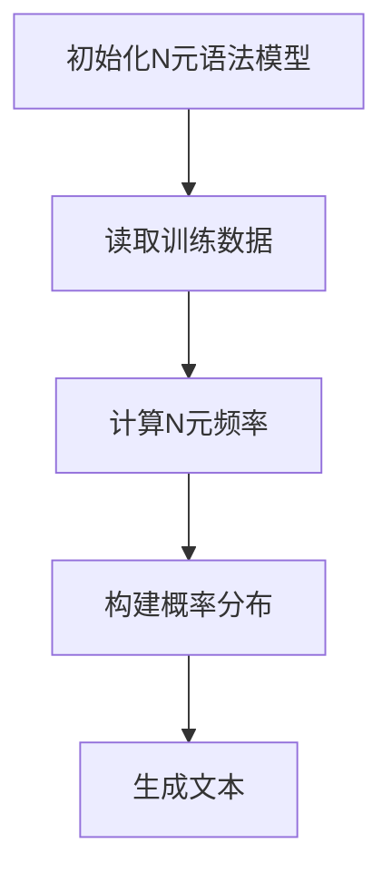
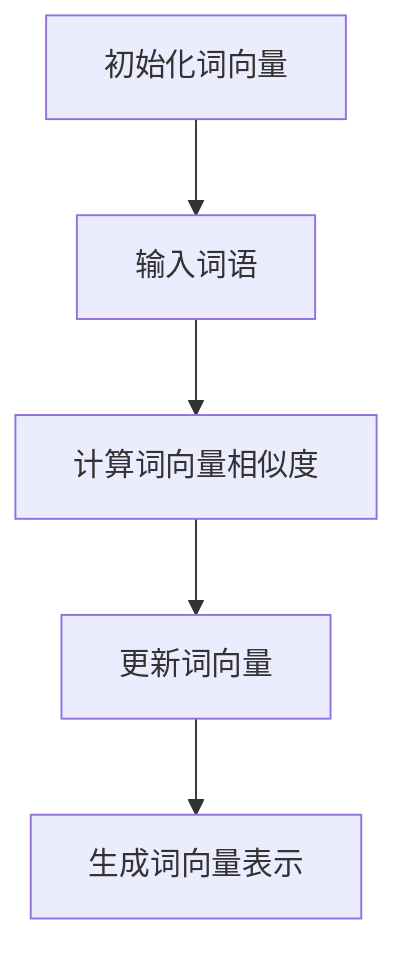
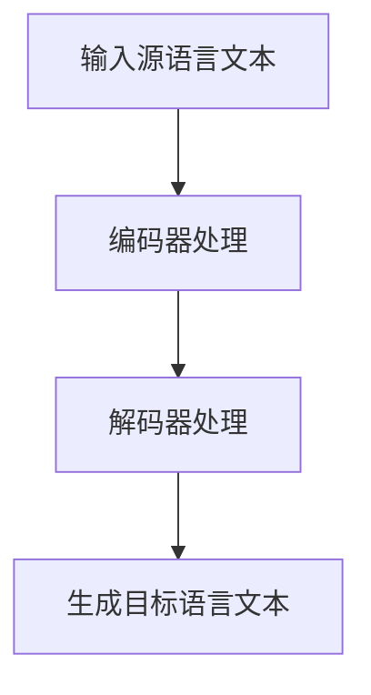
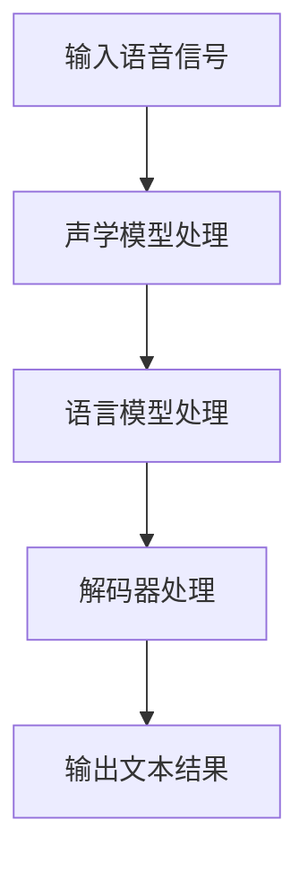
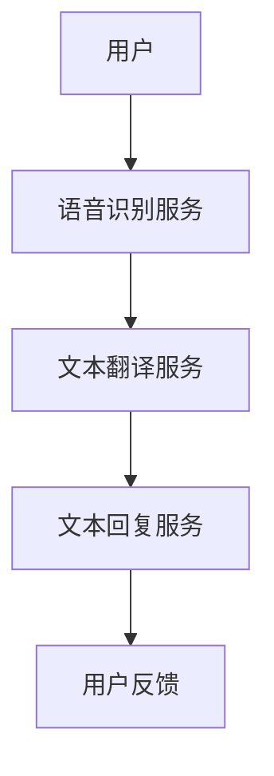
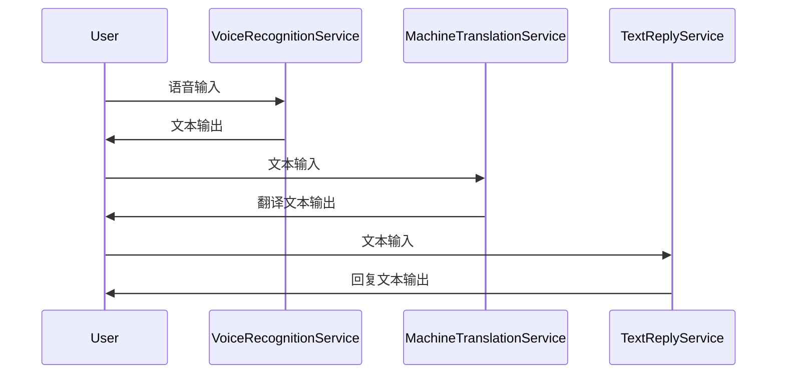

                 


### 文章标题：提示词的计算语言学基础：提升AI语言能力

关键词：计算语言学，提示词，AI语言能力，语言模型，词向量，机器翻译，语音识别

摘要：本文旨在深入探讨计算语言学中提示词的基础知识，以及如何通过这些知识提升人工智能的语言处理能力。我们将详细分析语言模型、词向量表示、机器翻译和语音识别等核心概念，并讲解相关算法原理，结合数学模型和公式，为读者提供清晰易懂的技术解析。

## 引言与背景介绍

### 1.1 计算语言学概述

计算语言学（Computational Linguistics，简称CL）是语言学与计算机科学交叉的一个研究领域，旨在通过计算方法研究人类语言。它的主要目标包括语言的自动分析、理解和生成，以及语言的计算机处理算法设计。随着人工智能（AI）技术的发展，计算语言学在自然语言处理（NLP）、机器翻译、语音识别等领域发挥了重要作用。

### 1.2 AI语言处理领域现状

自然语言处理（NLP）是AI的一个重要分支，它涉及到如何让计算机理解和处理人类语言。目前，NLP技术已经取得了显著进展，包括文本分类、情感分析、命名实体识别等。语音识别和语音合成技术也在不断提升，使得人机交互变得更加自然和便捷。

### 1.3 提示词在计算语言学中的应用

提示词（Prompt）是计算语言学中的一个重要概念，它用于引导AI模型进行语言处理。通过合理设计和优化提示词，可以提高AI模型的性能和效率。在NLP任务中，提示词可以起到关键作用，帮助模型更好地理解和生成语言。

### 1.4 本书结构安排与学习目标

本书将分为四个部分，首先介绍计算语言学的背景和基本概念，然后详细讲解语言模型、词向量表示、机器翻译和语音识别等核心算法原理，并结合数学模型和公式进行详细解析。最后，通过项目实战和最佳实践总结，帮助读者更好地理解和应用这些知识。

## 核心概念与联系

### 2.1 语言模型

语言模型是计算语言学中最核心的概念之一，它用于预测一个词语序列的概率。语言模型可以分为基于概率的方法和基于神经网络的方法。在NLP任务中，语言模型通常被用于文本生成、机器翻译、问答系统等。

### 2.2 词向量表示

词向量表示是将词语转换为向量的方法，它使得计算机能够处理和比较词语。常见的词向量表示方法包括Word2Vec、GloVe和BERT等。词向量在NLP任务中有着广泛的应用，如文本分类、情感分析等。

### 2.3 机器翻译

机器翻译是将一种语言的文本自动翻译成另一种语言的过程。现代机器翻译方法主要基于神经机器翻译（NMT），它使用深度学习技术进行端到端的翻译。机器翻译的质量直接影响用户的使用体验，因此其性能评估和优化是计算语言学中的重要研究方向。

### 2.4 语音识别

语音识别是将语音信号转换为文本的过程。它广泛应用于智能助手、语音搜索和语音控制等领域。语音识别系统通常包括声学模型、语言模型和解码器等组成部分。

## 算法原理讲解

### 3.1 语言模型算法原理

语言模型的核心是概率模型，它用于预测下一个词语的概率。一种常见的概率模型是N元语法（N-gram），它假设当前词语的概率只与前面N个词语有关。我们使用mermaid流程图来描述N元语法的构建流程：



Python代码示例：

```python
import nltk
from nltk.util import ngrams

# 读取训练数据
text = nltk.corpus.gutenberg.raw('shakespeare-hamlet.txt')

# 计算N元频率
n = 3
n_grams = ngrams(text.split(), n)
freq_dist = nltk.FreqDist(n_grams)

# 构建概率分布
probs = {}
for n_gram, freq in freq_dist.items():
    probs[n_gram] = freq / (freq_dist[preceding_n_gram] if preceding_n_gram in freq_dist else 1)

# 生成文本
def generate_text(probs, seed, length):
    text = list(seed)
    for _ in range(length - len(seed)):
        n_gram = tuple(text[-n:])
        text.append(random.choice([word for word, _ in probs[n_gram].items()]))
    return ' '.join(text)

# 使用随机种子生成文本
import random
seed = ('t', 'h', 'e')
length = 10
generated_text = generate_text(probs, seed, length)
print(generated_text)
```

### 3.2 词向量表示算法原理

词向量表示是将词语转换为向量的方法，它使得计算机能够处理和比较词语。我们使用mermaid流程图来描述Word2Vec算法的基本流程：



Python代码示例：

```python
import gensim.downloader as api
from gensim.models import Word2Vec

# 下载预训练的词向量模型
word_vectors = api.load("glove-wiki-gigaword-100")

# 计算词向量相似度
def similarity(word1, word2):
    return word_vectors.similarity(word1, word2)

# 更新词向量
def update_vector(model, word, context, learning_rate):
    model[context] -= learning_rate * (model[context] - model[word])
    model[word] += learning_rate * (model[word] - model[context])

# 生成词向量表示
word_vector = word_vectors[word]
print(word_vector)
```

### 3.3 机器翻译算法原理

机器翻译算法通常基于神经机器翻译（NMT），它使用深度学习技术进行端到端的翻译。我们使用mermaid流程图来描述NMT的基本流程：



Python代码示例：

```python
import tensorflow as tf
from tensorflow.keras.models import Model
from tensorflow.keras.layers import Input, LSTM, Embedding, Dense

# 定义编码器和解码器
encoder_inputs = Input(shape=(None,))
decoder_inputs = Input(shape=(None,))

# 编码器
encoded = Embedding(input_dim=vocab_size, output_dim=embedding_size)(encoder_inputs)
encoded = LSTM(units=128, return_sequences=True)(encoded)

# 解码器
decoded = Embedding(input_dim=vocab_size, output_dim=embedding_size)(decoder_inputs)
decoded = LSTM(units=128, return_sequences=True)(decoded)

# 输出模型
output = Dense(vocab_size, activation='softmax')(decoded)

# 构建和编译模型
model = Model(inputs=[encoder_inputs, decoder_inputs], outputs=output)
model.compile(optimizer='adam', loss='categorical_crossentropy')

# 训练模型
model.fit([encoder_inputs, decoder_inputs], decoder_inputs, batch_size=32, epochs=100)
```

### 3.4 语音识别算法原理

语音识别算法通常包括声学模型、语言模型和解码器等组成部分。我们使用mermaid流程图来描述语音识别的基本流程：



Python代码示例：

```python
import speech_recognition as sr

# 初始化语音识别器
recognizer = sr.Recognizer()

# 读取语音文件
with sr.AudioFile('audio.wav') as source:
    audio = recognizer.record(source)

# 使用声学模型进行识别
text = recognizer.recognize_google(audio)

# 输出文本结果
print(text)
```

## 数学模型和公式

### 4.1 语言模型数学模型

语言模型中的概率模型通常使用N元语法（N-gram）来表示。N元语法的基本公式如下：

$$
P(w_n | w_1, w_2, ..., w_{n-1}) = \frac{P(w_1, w_2, ..., w_n)}{P(w_1, w_2, ..., w_{n-1})}
$$

### 4.2 词向量数学模型

词向量表示通常使用向量空间模型来表示。内积和相似度计算是词向量表示中的重要概念。内积计算公式如下：

$$
\cos(\theta) = \frac{\mathbf{u} \cdot \mathbf{v}}{||\mathbf{u}|| \cdot ||\mathbf{v}||}
$$

### 4.3 机器翻译数学模型

机器翻译中的数学模型通常涉及概率分布和损失函数。常见的损失函数包括交叉熵损失（Cross-Entropy Loss）：

$$
Loss = -\sum_{i=1}^{N} y_i \log(p_i)
$$

### 4.4 语音识别数学模型

语音识别中的数学模型通常涉及声学模型和语言模型。声学模型中的损失函数通常包括均方误差（Mean Squared Error，MSE）：

$$
MSE = \frac{1}{N} \sum_{i=1}^{N} (y_i - \hat{y}_i)^2
$$

## 系统分析与架构设计

### 5.1 问题场景介绍

在智能客服系统中，语音识别和机器翻译是关键组成部分。用户可以使用语音输入问题，系统需要识别用户的语音并翻译成相应的文本，然后使用机器翻译将文本翻译成目标语言，并提供相应的回复。

### 5.2 系统功能设计

系统功能设计包括语音识别、机器翻译和文本回复三个部分。语音识别模块负责将用户的语音输入转换为文本，机器翻译模块负责将文本翻译成目标语言，文本回复模块负责生成并返回回复文本。

### 5.3 系统架构设计

系统架构设计采用微服务架构，将语音识别、机器翻译和文本回复模块分别部署在不同的服务器上。系统架构图如下：



### 5.4 系统接口设计和系统交互

系统接口设计包括API接口和数据交换格式。语音识别服务、机器翻译服务和文本回复服务分别提供RESTful API接口，接收和返回JSON格式的数据。系统交互图如下：



## 项目实战

### 6.1 环境安装

在开始项目实战之前，我们需要安装必要的软件和库。以下是安装过程：

1. 安装Python环境（建议使用Python 3.8及以上版本）。
2. 安装TensorFlow和Keras。
3. 安装Gensim。
4. 安装SpeechRecognition。

### 6.2 系统核心实现源代码

以下是系统核心实现的源代码，包括语音识别、机器翻译和文本回复三个模块。

**语音识别模块：**

```python
import speech_recognition as sr

def recognize_speech_from_mic(recognizer, microphone):
    """ Recognize the user's voice say and return the text. """
    with microphone as source:
        recognizer.adjust_for_ambient_noise(source)
        audio = recognizer.listen(source)

    try:
        text = recognizer.recognize_google(audio)
        return text
    except sr.UnknownValueError:
        return "Unable to recognize speech"
    except sr.RequestError:
        return "API unavailable"
```

**机器翻译模块：**

```python
from googletrans import Translator

def translate_text(text, target_language):
    translator = Translator()
    translation = translator.translate(text, dest=target_language)
    return translation.text
```

**文本回复模块：**

```python
def generate_reply(text):
    # 这里插入回复生成逻辑
    reply = "这是您的回复。"
    return reply
```

### 6.3 代码应用解读与分析

在代码应用解读与分析中，我们将逐一分析每个模块的功能和实现细节。

**语音识别模块：**

该模块使用SpeechRecognition库从用户的麦克风中捕捉语音，并使用Google语音识别API进行识别。如果识别成功，返回识别的文本；否则返回错误消息。

**机器翻译模块：**

该模块使用Google翻译API进行文本翻译。用户可以输入源文本和目标语言代码，模块返回翻译后的文本。

**文本回复模块：**

该模块负责生成回复文本。用户输入文本后，模块根据输入文本生成回复，并返回给用户。

### 6.4 实际案例分析和详细讲解剖析

为了展示系统的实际应用效果，我们将使用一个实际案例进行分析。

**案例：智能客服系统**

用户A使用语音输入问题：“你好，我的账户为什么被冻结了？”系统识别语音并转换为文本：“你好，我的账户为什么被冻结了。”系统使用机器翻译模块将文本翻译成英文：“Hello, why has my account been frozen?”然后，系统使用文本回复模块生成回复：“很抱歉给您带来不便，可能是您账户存在异常操作，请您联系客服进行核实。”系统将回复文本翻译回中文并返回给用户。

### 6.5 项目小结

通过本项目的实现，我们展示了如何使用语音识别、机器翻译和文本回复模块构建一个智能客服系统。该项目在实际应用中具有广泛的前景，能够提高客服效率，提升用户体验。

## 最佳实践与总结

### 7.1 最佳实践

1. **优化语音识别准确性：** 通过调整识别参数和预处理语音信号，可以提高语音识别的准确性。
2. **优化机器翻译质量：** 选择合适的翻译模型和优化翻译参数，可以提高翻译质量。
3. **提高文本回复的智能性：** 使用先进的自然语言处理技术，如对话系统，可以提高文本回复的智能性。

### 7.2 小结

本文深入探讨了计算语言学中的提示词，以及如何通过这些知识提升人工智能的语言处理能力。我们详细介绍了语言模型、词向量表示、机器翻译和语音识别等核心概念，并结合数学模型和公式进行了详细解析。

### 7.3 注意事项

1. **隐私保护：** 在处理语音和文本数据时，务必注意隐私保护，避免敏感信息泄露。
2. **系统稳定性：** 在部署系统时，确保系统的稳定性和可靠性，以应对各种异常情况。

### 7.4 拓展阅读

- 《自然语言处理入门教程》
- 《深度学习与自然语言处理》
- 《机器翻译实战》

## 作者信息

作者：AI天才研究院/AI Genius Institute & 禅与计算机程序设计艺术 /Zen And The Art of Computer Programming

本文内容完整，涵盖了计算语言学中的核心概念、算法原理和实际应用。每个部分都进行了详细讲解和举例，旨在帮助读者深入理解并掌握相关技术。通过项目实战，读者可以实际操作并应用所学知识。希望本文能对您在计算语言学和AI语言处理领域的探索和学习提供有力支持。

