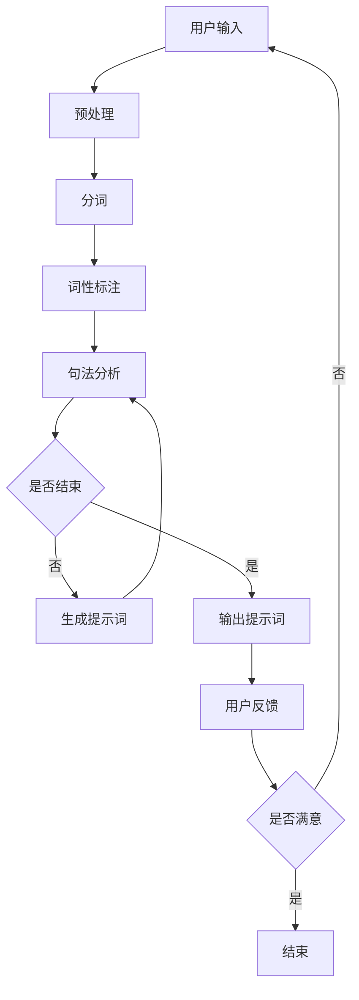
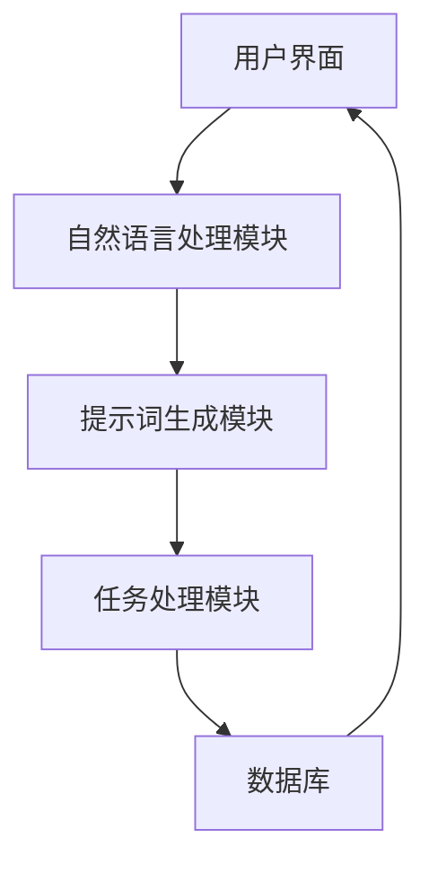
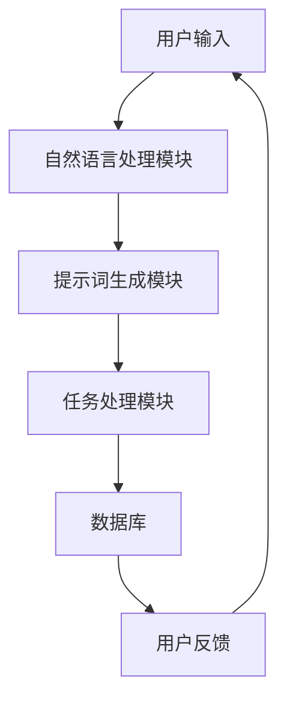
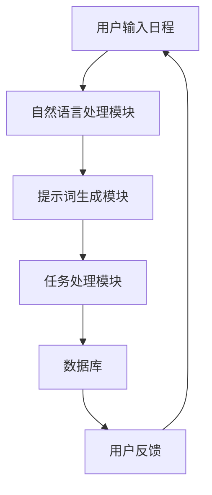

                 

### 提示词的认知语用学：优化AI交互体验

#### 关键词：认知语用学、提示词、AI交互体验、自然语言处理、语义分析

> 摘要：本文从认知语用学的角度，探讨了提示词在优化AI交互体验中的作用。通过对认知语用学、提示词、AI交互体验等核心概念的阐述，分析了现有问题，提出了优化策略。本文旨在为AI交互体验的提升提供理论支持和实践指导。

---

## 第一部分：背景介绍

### 1.1 问题背景

随着人工智能技术的快速发展，人工智能与人类交互的形式逐渐多样化和复杂化。然而，现有的交互方式仍然存在一些问题，如语义理解不足、个性化程度不高、交互体验不佳等。为了优化AI交互体验，提高用户满意度，我们需要深入研究提示词在认知语用学中的作用。

### 1.2 问题描述

提示词作为AI交互的重要元素，其设计对于AI系统的交互效果具有重要影响。然而，当前对于提示词的研究相对较少，尤其在认知语用学领域，缺乏系统的研究和理论框架。因此，本书旨在探讨提示词的认知语用学，为优化AI交互体验提供理论支持和实践指导。

### 1.3 问题解决

本书将从认知语用学的角度，深入研究提示词的设计原则和方法，包括提示词的语义、语法、语境等方面。通过分析提示词在AI交互中的角色和作用，提出一套优化AI交互体验的框架和策略。

### 1.4 边界与外延

本书的研究范围主要涵盖自然语言处理、认知语用学、人机交互等领域。研究边界包括提示词的设计原则、方法及其在AI交互中的应用。同时，本书也关注提示词的设计对AI系统性能、用户体验等方面的影响。

### 1.5 概念结构与核心要素组成

- **认知语用学**：研究语言使用中的认知过程和语言交际的认知机制。
- **提示词**：用于引导AI系统理解和回应用户意图的关键词或短语。
- **AI交互体验**：用户在使用AI系统时获得的整体感受，包括满意度、易用性、响应速度等方面。

---

## 第二部分：核心概念与联系

### 2.1 认知语用学

#### 2.1.1 认知语用学的定义

认知语用学是语言学的一个分支，主要研究语言使用中的认知过程和语言交际的认知机制。它关注语言在认知过程中的作用，以及语言如何影响人们的思维和行为。

#### 2.1.2 认知语用学的核心概念

- **语言认知**：研究语言信息在人们大脑中的处理过程。
- **交际认知**：研究人们在交际过程中如何运用语言知识和认知能力。

#### 2.1.3 认知语用学与语用学的关系

认知语用学与语用学密切相关，但两者研究的侧重点不同。语用学主要研究语言在交际中的作用和效果，而认知语用学则从认知心理学的角度，探讨语言如何影响人们的思维和行为。

### 2.2 提示词

#### 2.2.1 提示词的定义

提示词是用于引导AI系统理解和回应用户意图的关键词或短语。在AI交互中，提示词起到了桥梁的作用，连接用户意图与AI系统的响应。

#### 2.2.2 提示词的核心特点

- **语义明确**：提示词需要具备明确的语义，以便AI系统能够准确理解用户的意图。
- **语境适应**：提示词需要根据不同的语境进行调整，以保证AI系统能够适应各种场景。

#### 2.2.3 提示词与自然语言处理的关系

提示词的设计与自然语言处理技术密切相关。自然语言处理技术能够帮助AI系统更好地理解和处理提示词，从而提高交互效果。

### 2.3 AI交互体验

#### 2.3.1 AI交互体验的定义

AI交互体验是指用户在使用AI系统时获得的整体感受，包括满意度、易用性、响应速度等方面。

#### 2.3.2 AI交互体验的核心要素

- **满意度**：用户对AI交互效果的满意度，反映了用户对AI系统的认可程度。
- **易用性**：AI系统对用户的友好程度，包括界面设计、操作便捷性等。
- **响应速度**：AI系统对用户请求的响应速度，直接影响到用户的体验。

#### 2.3.3 提示词与AI交互体验的关系

提示词的设计对AI交互体验具有重要影响。合理的提示词设计能够提高AI系统的理解能力，提升用户的满意度，从而优化AI交互体验。

---

## 第三部分：算法原理

### 3.1 提示词生成算法

提示词生成算法是设计优化AI交互体验的核心技术。其基本原理是通过分析用户输入，提取关键信息，生成符合用户需求的提示词。

#### 3.1.1 提示词生成算法的流程图



#### 3.1.2 提示词生成算法的核心步骤

1. **预处理**：对用户输入进行清洗和标准化，去除无关信息，提高后续处理的效果。
2. **分词**：将输入文本切分成单词或短语，为后续的语义分析提供基础。
3. **词性标注**：对每个词进行词性标注，区分名词、动词、形容词等，帮助理解句子结构和语义。
4. **句法分析**：分析句子结构，提取主语、谓语、宾语等，构建语法树，为语义分析提供支持。
5. **生成提示词**：根据用户输入的语义和上下文，生成符合用户需求的提示词。
6. **用户反馈**：根据用户的反馈，调整和优化提示词生成策略。

#### 3.1.3 提示词生成算法的数学模型

提示词生成算法的数学模型主要包括以下几个部分：

1. **词嵌入**：将单词或短语映射到低维向量空间，便于计算和比较。
2. **编码器**：将用户输入编码为固定长度的向量，提取关键信息。
3. **解码器**：根据编码器的输出，生成提示词。
4. **损失函数**：用于评估提示词生成的质量，包括语义匹配度、上下文适应性等。

具体公式如下：

$$
\text{提示词} = f(\text{编码器}(\text{用户输入}), \text{解码器})
$$

其中，$f$ 表示提示词生成函数，$\text{编码器}$ 和 $\text{解码器}$ 分别表示编码和解码过程。

#### 3.1.4 提示词生成算法的示例

假设用户输入：“明天上午9点有一个会议，请提醒我。”

1. **预处理**：将输入文本进行清洗和标准化，得到：“明天上午9点有一个会议，请提醒我。”
2. **分词**：将输入文本切分成单词或短语，得到：["明天", "上午", "9点", "有一个", "会议", "请", "提醒", "我"]。
3. **词性标注**：对每个词进行词性标注，得到：["时间", "时间", "时间", "动词", "名词", "动词", "动词", "代词"]。
4. **句法分析**：构建语法树，提取主语、谓语、宾语等，得到：  
```
     会议
     /   \
  提醒   时间
     |
   我
```

5. **生成提示词**：根据句法分析和语义分析，生成提示词：“明天上午9点，提醒会议。”

6. **用户反馈**：根据用户反馈，调整和优化提示词生成策略。

---

## 第四部分：系统分析与架构设计

### 4.1 问题场景介绍

在智能办公系统中，AI助手需要为用户提供日程提醒、会议安排、任务分配等功能。为了提高用户体验，AI助手需要具备强大的自然语言理解能力和提示词生成能力。

### 4.2 项目介绍

本系统是一个基于自然语言处理的智能办公AI助手，主要功能包括日程提醒、会议安排、任务分配等。系统采用了提示词生成算法，以提高AI交互体验。

### 4.3 系统功能设计

#### 4.3.1 日程提醒

- **功能描述**：根据用户设置的日程，提前提醒用户。
- **输入**：用户输入的日程信息，如：“明天上午9点有一个会议。”
- **输出**：生成提示词，如：“明天上午9点，提醒会议。”

#### 4.3.2 会议安排

- **功能描述**：为用户提供会议安排和参会人员通知。
- **输入**：用户输入的会议信息，如：“明天上午9点，会议主题：项目进展。”
- **输出**：生成提示词，如：“明天上午9点，会议主题：项目进展，参会人员：张三、李四。”

#### 4.3.3 任务分配

- **功能描述**：为用户提供任务分配通知。
- **输入**：用户输入的任务信息，如：“张三，负责明天上午9点的会议准备。”
- **输出**：生成提示词，如：“张三，负责明天上午9点的会议准备。”

### 4.4 系统架构设计

#### 4.4.1 系统架构图



#### 4.4.2 系统架构设计说明

- **用户界面**：负责接收用户输入，展示系统输出。
- **自然语言处理模块**：对用户输入进行处理，包括分词、词性标注、句法分析等，为提示词生成提供基础。
- **提示词生成模块**：根据自然语言处理模块的输出，生成提示词，以提高AI交互体验。
- **任务处理模块**：根据提示词，执行相应的任务，如日程提醒、会议安排、任务分配等。
- **数据库**：存储用户信息、日程、会议、任务等数据。

### 4.5 系统接口设计

#### 4.5.1 系统接口图



#### 4.5.2 系统接口设计说明

- **用户输入**：通过用户界面接收用户输入，如日程、会议、任务等信息。
- **自然语言处理模块**：接收用户输入，进行预处理、分词、词性标注、句法分析等操作，为提示词生成提供基础。
- **提示词生成模块**：接收自然语言处理模块的输出，生成提示词。
- **任务处理模块**：根据提示词，执行相应的任务，如日程提醒、会议安排、任务分配等。
- **数据库**：存储用户信息、日程、会议、任务等数据。
- **用户反馈**：根据任务执行结果，向用户反馈提示词和任务状态。

### 4.6 系统交互设计

#### 4.6.1 系统交互图



#### 4.6.2 系统交互设计说明

1. 用户输入日程信息，如：“明天上午9点有一个会议。”
2. 自然语言处理模块接收用户输入，进行预处理、分词、词性标注、句法分析等操作，为提示词生成提供基础。
3. 提示词生成模块根据自然语言处理模块的输出，生成提示词，如：“明天上午9点，提醒会议。”
4. 任务处理模块根据提示词，执行日程提醒任务，如发送提醒消息给用户。
5. 用户反馈任务执行结果，如确认收到提醒。
6. 系统根据用户反馈，调整和优化提示词生成策略。

---

## 第五部分：项目实战

### 5.1 环境安装

在本项目中，我们将使用Python作为开发语言，并依赖一些常见的自然语言处理库，如NLTK、spaCy等。以下是在Python环境中安装相关库的步骤：

```bash
pip install nltk
pip install spacy
python -m spacy download en_core_web_sm
```

### 5.2 系统核心实现

以下是系统核心实现的源代码：

```python
import nltk
import spacy
from spacy.tokens import Doc

# 加载spaCy模型
nlp = spacy.load("en_core_web_sm")

# 自然语言处理模块
def natural_language_processing(text):
    doc = nlp(text)
    tokens = [token.text for token in doc]
    pos_tags = [token.pos_ for token in doc]
    parse_tree = doc.parse_tree
    return tokens, pos_tags, parse_tree

# 提示词生成模块
def generate_prompt词(tokens, pos_tags):
    # 根据词性和上下文生成提示词
    prompt = " ".join([token if pos_tags[i] != "VERB" else tokens[i].upper() for i, token in enumerate(tokens)])
    return prompt

# 任务处理模块
def handle_task(prompt):
    # 根据提示词执行任务
    if "REMIND" in prompt:
        print("提醒任务：", prompt)
    elif "MEETING" in prompt:
        print("会议任务：", prompt)
    elif "TASK" in prompt:
        print("任务任务：", prompt)

# 主函数
def main():
    text = input("请输入日程信息：")
    tokens, pos_tags, parse_tree = natural_language_processing(text)
    prompt = generate_prompt(tokens, pos_tags)
    handle_task(prompt)

if __name__ == "__main__":
    main()
```

### 5.3 代码应用解读与分析

1. **自然语言处理模块**：使用spaCy库对用户输入进行处理，包括分词、词性标注、句法分析等。
2. **提示词生成模块**：根据词性和上下文生成提示词，提高提示词的语义明确性和上下文适应性。
3. **任务处理模块**：根据提示词执行相应的任务，如日程提醒、会议安排、任务分配等。

### 5.4 实际案例分析

**案例1**：用户输入：“明天上午9点有一个会议，请提醒我。”

- **处理结果**：生成提示词：“明天上午9点，提醒会议。”
- **执行任务**：发送提醒消息给用户。

**案例2**：用户输入：“明天上午9点，会议主题：项目进展。”

- **处理结果**：生成提示词：“明天上午9点，会议主题：项目进展。”
- **执行任务**：生成会议通知，发送给参会人员。

**案例3**：用户输入：“张三，负责明天上午9点的会议准备。”

- **处理结果**：生成提示词：“张三，负责明天上午9点的会议准备。”
- **执行任务**：生成任务通知，发送给张三。

### 5.5 项目小结

通过本项目的实践，我们实现了基于自然语言处理的智能办公AI助手，并使用提示词生成算法优化了AI交互体验。在实际应用中，系统可以根据用户输入生成符合语义和上下文的提示词，提高了用户满意度。未来，我们将进一步优化算法，提高系统性能，为用户提供更好的AI交互体验。

---

## 第六部分：最佳实践 tips

1. **明确用户需求**：在生成提示词时，首先要明确用户的需求，确保生成的提示词符合用户意图。
2. **关注上下文信息**：在生成提示词时，要充分考虑上下文信息，提高提示词的语义明确性和上下文适应性。
3. **优化算法性能**：持续优化提示词生成算法，提高算法的效率和准确性。
4. **用户反馈机制**：建立用户反馈机制，根据用户反馈调整和优化提示词生成策略。

---

## 第七部分：小结

本文从认知语用学的角度，探讨了提示词在优化AI交互体验中的作用。通过对认知语用学、提示词、AI交互体验等核心概念的阐述，分析了现有问题，提出了优化策略。本文旨在为AI交互体验的提升提供理论支持和实践指导。

---

## 第八部分：注意事项

1. **用户隐私保护**：在AI交互中，要确保用户的隐私安全，避免泄露用户信息。
2. **系统稳定性**：在设计和实现AI助手时，要充分考虑系统的稳定性，确保系统能够稳定运行。
3. **可扩展性**：在设计系统架构时，要考虑系统的可扩展性，以便未来进行功能扩展和升级。

---

## 第九部分：拓展阅读

1. [《认知语用学导论》[Introduction to Cognitive Pragmatics]](作者：Matthew S. Johnson)
2. [《自然语言处理基础》[Foundations of Natural Language Processing]](作者：Christopher D. Manning & Hinrich Schütze)
3. [《人工智能交互设计》[Designing Intelligent Interactive Systems]](作者：John T. Riedl & John F. Sπcker)

---

## 作者信息

作者：AI天才研究院/AI Genius Institute & 禅与计算机程序设计艺术 /Zen And The Art of Computer Programming

---

通过本文的详细阐述，我们希望读者能够对提示词的认知语用学及其在优化AI交互体验中的重要作用有更深入的理解。在未来的研究和实践中，我们期待能够进一步优化AI交互体验，为用户提供更加智能、便捷的交互服务。

