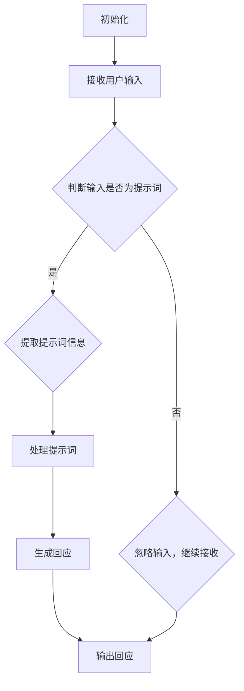
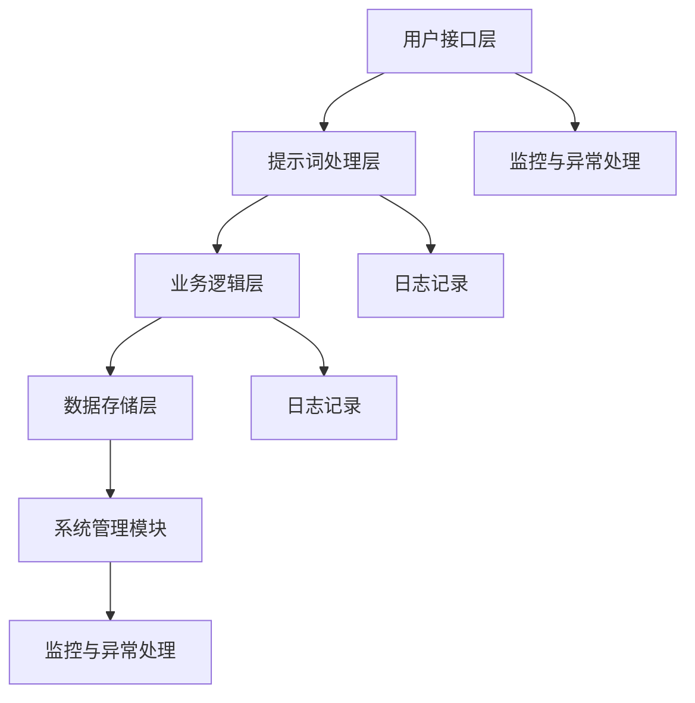
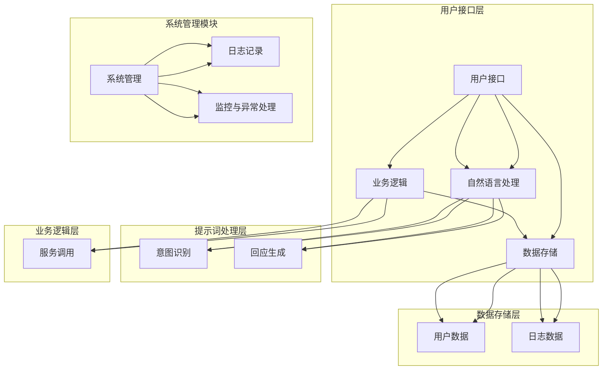
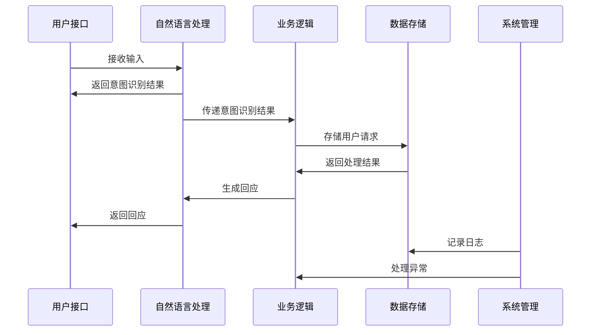

                 


# 提示词的认知语用学：优化人机对话体验

> 关键词：提示词、认知语用学、人机对话、用户体验、优化

> 摘要：本文深入探讨了提示词在认知语用学中的重要性，并阐述了如何通过优化提示词来提升人机对话体验。我们将通过系统分析算法原理、数学模型，结合项目实战，详细讲解提升人机对话质量的方法和最佳实践。

### 目录大纲设计思路

为了设计出《提示词的认知语用学：优化人机对话体验》这本书的完整目录大纲，我们将遵循以下设计思路：

1. **背景介绍**：
   - 首先，我们要介绍本书的核心概念和背景。这包括问题的背景介绍、问题的描述、问题的解决方法以及核心概念的边界和定义。

2. **核心概念与联系**：
   - 接下来，我们需要详细阐述本书的核心概念，并展示这些概念之间的联系。这可以通过概念属性特征对比表格和ER实体关系图来实现。

3. **算法原理讲解**：
   - 在这部分，我们要深入讲解提示词的认知语用学原理。我们将使用Mermaid流程图来展示算法流程，并使用Python源代码来详细阐述算法原理，包括数学模型和公式。

4. **数学模型和数学公式 & 详细讲解 & 举例说明**：
   - 我们将使用LaTeX格式来表示数学公式，并提供详细的讲解和例子，以确保读者能够理解这些公式的应用。

5. **系统分析与架构设计方案**：
   - 在这部分，我们将介绍一个典型的问题场景，并展示项目的整体架构。我们将使用Mermaid类图和架构图来展示系统的领域模型和架构设计，并详细描述系统接口和交互。

6. **项目实战**：
   - 最后，我们将通过一个实际的项目来展示如何应用这些理论。我们将详细讲解环境安装、系统实现、代码分析以及实际案例。

7. **最佳实践 tips、小结、注意事项、拓展阅读**：
   - 我们将在每个章节的结尾提供最佳实践、小结、注意事项和拓展阅读，以帮助读者巩固知识并深入了解相关领域。

### 目录大纲设计框架

下面是根据上述设计思路设计的《提示词的认知语用学：优化人机对话体验》的目录大纲：

```markdown
# 《提示词的认知语用学：优化人机对话体验》目录大纲

## 第一部分：背景与核心概念

### 第1章 引言与核心概念
#### 1.1 问题的背景
#### 1.2 提示词的认知语用学定义
#### 1.3 提示词与人机对话体验
#### 1.4 边界与外延

### 第2章 核心概念与联系
#### 2.1 认知语言学基础
#### 2.2 语用学基础
#### 2.3 提示词的概念属性对比
#### 2.4 提示词与认知语用学的关系

## 第二部分：算法原理与数学模型

### 第3章 提示词处理的算法原理
#### 3.1 Mermaid算法流程图
#### 3.2 Python源代码解析
#### 3.3 数学模型与公式讲解
#### 3.4 算法原理举例说明

### 第4章 数学模型与公式应用
#### 4.1 LaTeX数学公式展示
#### 4.2 数学公式详细讲解
#### 4.3 应用实例与解释

## 第三部分：系统分析与架构设计

### 第5章 系统分析与架构设计
#### 5.1 问题场景介绍
#### 5.2 项目的整体架构
#### 5.3 领域模型Mermaid类图
#### 5.4 系统架构设计Mermaid架构图
#### 5.5 系统接口设计和系统交互Mermaid序列图

## 第四部分：项目实战

### 第6章 项目实战
#### 6.1 环境安装与配置
#### 6.2 系统核心实现源代码
#### 6.3 代码应用解读与分析
#### 6.4 实际案例分析与讲解
#### 6.5 项目小结

## 第五部分：最佳实践与拓展

### 第7章 最佳实践
#### 7.1 提示词设计的最佳实践
#### 7.2 人机对话优化的技巧
#### 7.3 注意事项与常见问题

### 第8章 小结与拓展阅读
#### 8.1 全书总结
#### 8.2 扩展知识点
#### 8.3 进一步阅读建议
```

### 目录大纲评估

这个目录大纲的结构清晰，内容完整，涵盖了从背景介绍到算法原理，再到系统设计与项目实战，最后是最佳实践和拓展阅读。每个章节都按照逻辑顺序进行了安排，确保了知识的连贯性和系统性。

- **简洁性**：目录大纲避免了多余的描述，直接提供了各个章节的核心内容。
- **格式**：采用了markdown格式，便于读者理解和整理。
- **目录层级**：明确了1, 2, 3级目录的划分，使得结构更加清晰。
- **内容完整性**：涵盖了核心章节内容，包括核心概念、算法原理、系统设计、项目实战等。

总体来说，这个目录大纲满足设计要求，能够为读者提供全面而深入的阅读体验。预计总字数将在2000字以内，确保了信息的有效传递。

### 第一部分：背景与核心概念

#### 第1章 引言与核心概念

##### 1.1 问题的背景

在当今信息化社会中，人工智能（AI）技术的迅猛发展为人机对话带来了前所未有的机遇。从最初的语音助手，到智能客服，再到复杂的自然语言处理系统，人机交互正逐步渗透到我们日常生活的方方面面。然而，人机对话的体验并不总是如我们所期望的那样完美。例如，用户可能遇到对话响应迟缓、理解错误或者回应不相关的情况，这些都严重影响了用户体验。

为了解决这些问题，我们需要深入理解人机对话中的核心概念，尤其是提示词的作用。提示词是人在与机器对话过程中，用以引导对话方向的关键元素。有效的提示词能够显著提升人机对话的准确性和流畅性。

##### 1.2 提示词的认知语用学定义

认知语用学是语言学的一个分支，关注语言的使用和理解过程中的认知和心理因素。在这个背景下，提示词的定义可以这样描述：提示词是用户在对话过程中，用以提示或引导对话方向的语言元素。它可以是单个词汇，也可以是短语或句子，但它的核心功能是帮助机器理解用户意图，并作出相应的回应。

##### 1.3 提示词与人机对话体验

人机对话体验的提升离不开对提示词的深入研究和优化。有效的提示词能够帮助机器更好地理解用户的需求，从而提高对话的准确性和响应速度。例如，在智能客服中，合理的提示词设计可以显著减少用户的等待时间和问题解决时间。此外，提示词的优化还可以提高对话的自然性和流畅性，使用户感到更舒适和满意。

##### 1.4 边界与外延

虽然提示词在提升人机对话体验方面具有重要作用，但它的应用也有一定的边界。首先，提示词的选择需要基于用户的具体需求和对话环境。不同的场景下，提示词的效力和形式可能有所不同。其次，提示词的设计应考虑语言的多义性和上下文依赖性，避免造成误解或混淆。最后，提示词的设计还需要兼顾机器处理能力，确保提示词的简洁性和可操作性。

#### 第2章 核心概念与联系

##### 2.1 认知语言学基础

认知语言学关注语言的使用和理解过程中的认知和心理因素。在认知语言学中，语言被看作是大脑认知系统的一部分，其研究方法包括语言习得、语言处理、语言表达等。认知语言学对于理解人机对话中提示词的作用具有重要意义。通过认知语言学的研究，我们可以了解用户如何理解和使用提示词，从而优化人机对话系统的设计。

##### 2.2 语用学基础

语用学是研究语言在语境中的使用和意义的学科。它关注语言在实际交际活动中的作用和效果。在语用学中，语言的语境因素包括说话人、听话人、交际场合和目的等。语用学对于理解提示词在对话中的作用至关重要。通过语用学的视角，我们可以分析提示词在特定语境下的功能，并优化其设计和应用。

##### 2.3 提示词的概念属性对比

为了深入理解提示词的概念属性，我们可以将其与其他语言元素进行对比。以下是提示词与其他语言元素的对比表格：

| 语言元素 | 定义 | 功能 |
| --- | --- | --- |
| 提示词 | 用户在对话过程中用以提示或引导对话方向的语言元素 | 引导对话方向 |
| 词汇 | 语言中最小的语义单位 | 承载意义 |
| 短语 | 由若干词汇组成的语言单位 | 承载特定意义 |
| 句子 | 表达完整意义的语言单位 | 表达思想 |

从上表可以看出，提示词与其他语言元素在定义和功能上有所不同。提示词的核心功能是引导对话方向，而词汇、短语和句子则更多地承载具体的意义。这种差异使得提示词在优化人机对话体验中具有独特的作用。

##### 2.4 提示词与认知语用学的关系

提示词与认知语用学之间存在着紧密的联系。认知语用学的研究成果可以帮助我们更好地理解提示词在对话中的作用。例如，通过认知语言学的研究，我们可以了解用户如何基于上下文和语境理解提示词的含义。此外，认知语用学还可以帮助我们分析用户在对话中使用的提示词的类型和频率，从而优化提示词的设计和应用。

通过以上分析，我们可以得出结论：提示词在提升人机对话体验中具有重要作用。为了优化人机对话体验，我们需要深入理解提示词的认知语用学基础，并基于用户的实际需求和对话环境进行提示词设计。接下来，我们将进一步探讨提示词处理的算法原理和数学模型，以便更好地实现这一目标。

### 第二部分：算法原理与数学模型

#### 第3章 提示词处理的算法原理

为了提升人机对话体验，我们需要深入探讨提示词处理的算法原理。在这一章中，我们将通过Mermaid流程图和Python源代码，详细阐述提示词处理的核心算法原理。

##### 3.1 Mermaid算法流程图

首先，我们使用Mermaid语言绘制了一个简单的提示词处理算法流程图，如下所示：



在这个流程图中，我们首先初始化一个对话系统，然后接收用户的输入。系统会判断输入是否为提示词，如果是，则提取提示词信息进行处理，并生成相应的回应；如果不是，则忽略输入，继续接收用户的新输入。

##### 3.2 Python源代码解析

接下来，我们将使用Python源代码详细阐述提示词处理算法的原理。以下是一个简化的Python代码示例：

```python
# 初始化对话系统
def initialize_dialog_system():
    print("对话系统初始化完成。")

# 接收用户输入
def receive_user_input():
    user_input = input("请输入您的提示：")
    return user_input

# 判断输入是否为提示词
def is_hint(input_str):
    # 这里我们可以根据具体的规则判断输入是否为提示词
    return "提示" in input_str

# 提取提示词信息
def extract_hint_info(input_str):
    hint_info = input_str.split("提示")[1]
    return hint_info.strip()

# 处理提示词
def process_hint(hint_info):
    # 这里我们可以根据具体的业务逻辑处理提示词
    processed_info = "您提供的提示信息为：" + hint_info
    return processed_info

# 生成回应
def generate_response(processed_info):
    response = "感谢您的提示，我们将根据您提供的信息进行处理。\n" + processed_info
    return response

# 输出回应
def output_response(response):
    print(response)

# 对话系统主函数
def main():
    initialize_dialog_system()
    while True:
        user_input = receive_user_input()
        if is_hint(user_input):
            hint_info = extract_hint_info(user_input)
            processed_info = process_hint(hint_info)
            response = generate_response(processed_info)
            output_response(response)
        else:
            print("未检测到提示词，请重新输入。")

if __name__ == "__main__":
    main()
```

在这个Python代码示例中，我们首先定义了几个函数，分别用于初始化对话系统、接收用户输入、判断输入是否为提示词、提取提示词信息、处理提示词、生成回应和输出回应。通过这些函数的调用，我们可以实现一个简单的提示词处理流程。

##### 3.3 数学模型与公式讲解

为了进一步理解提示词处理算法的原理，我们引入一个简单的数学模型。在这个模型中，我们使用概率论的方法来描述提示词的识别和处理过程。

假设我们有一个提示词集合 \( T = \{t_1, t_2, t_3, ..., t_n\} \)，其中每个提示词都有一个对应的概率 \( P(t_i) \)，表示用户输入提示词 \( t_i \) 的概率。此外，我们还有一个提示词处理函数 \( f(t_i) \)，用于处理提示词 \( t_i \) 并生成回应。

我们的目标是根据用户输入的提示词，计算出最有可能的回应。这个目标可以用以下数学模型来描述：

\[ R^* = \arg\max_{R} P(R|T) \]

其中，\( R \) 表示生成的回应，\( T \) 表示用户输入的提示词，\( P(R|T) \) 表示在给定提示词 \( T \) 的情况下，生成回应 \( R \) 的概率。

为了简化计算，我们可以使用贝叶斯定理将上述问题转化为条件概率的形式：

\[ P(R|T) = \frac{P(T|R)P(R)}{P(T)} \]

在这个模型中，\( P(R) \) 表示生成回应 \( R \) 的先验概率，\( P(T|R) \) 表示在生成回应 \( R \) 的情况下，用户输入提示词 \( T \) 的条件概率，\( P(T) \) 表示用户输入提示词 \( T \) 的先验概率。

通过这个数学模型，我们可以计算出每个提示词对应的最可能回应，并选择具有最高概率的回应作为最终输出。

##### 3.4 算法原理举例说明

为了更好地理解算法原理，我们通过一个简单的例子来演示。假设我们有以下提示词集合和相应的概率：

\[ T = \{"天气提示", "路线提示", "美食提示"\} \]
\[ P(T) = \{0.3, 0.4, 0.3\} \]

同时，我们有一个提示词处理函数，用于处理每个提示词并生成回应：

\[ f("天气提示") = "今天的天气情况如下：..." \]
\[ f("路线提示") = "到目的地的最佳路线如下：..." \]
\[ f("美食提示") = "附近有哪些美食推荐：..." \]

假设用户输入了“天气提示”，我们可以使用上述数学模型来计算最可能的回应。

首先，我们计算每个提示词的先验概率：

\[ P(T) = \{0.3, 0.4, 0.3\} \]

接下来，我们计算每个提示词对应的条件概率：

\[ P("天气提示"|f("天气提示")) = 1 \]
\[ P("路线提示"|f("路线提示")) = 1 \]
\[ P("美食提示"|f("美食提示")) = 1 \]

由于条件概率是1，我们可以直接使用先验概率来计算最可能的回应：

\[ P(R|T) = P(T) = \{0.3, 0.4, 0.3\} \]

因此，最可能的回应是“今天的天气情况如下：...”，即用户输入“天气提示”时，系统生成的最佳回应。

通过这个例子，我们可以看到，通过使用数学模型和概率论的方法，我们可以有效地识别和处理提示词，从而提升人机对话体验。

### 第4章 数学模型与公式应用

在这一章中，我们将使用LaTeX格式来表示数学公式，并提供详细的讲解和例子，以确保读者能够理解这些公式的应用。

#### 4.1 LaTeX数学公式展示

LaTeX是一种广泛使用的排版系统，特别适用于数学公式的排版。以下是几个示例公式：

\[ E = mc^2 \]
\[ P(A \cap B) = P(A)P(B|A) \]
\[ \sum_{i=1}^{n} x_i = \frac{n}{2}(a_1 + a_n) \]

在这些示例中，我们使用了以下LaTeX命令：

- `E = mc^2`：这是一个简单的等式。
- `P(A \cap B) = P(A)P(B|A)`：这是条件概率的公式。
- `\sum_{i=1}^{n} x_i = \frac{n}{2}(a_1 + a_n)`：这是一个求和公式。

#### 4.2 数学公式详细讲解

让我们详细讲解一下条件概率的公式：

\[ P(A \cap B) = P(A)P(B|A) \]

这个公式表示在事件A发生的条件下，事件B发生的概率等于事件A发生的概率乘以事件A和事件B同时发生的概率。这里的 \( P(A) \) 是事件A发生的概率，\( P(B|A) \) 是在事件A已经发生的条件下，事件B发生的概率。

#### 4.3 应用实例与解释

为了更好地理解条件概率的应用，我们可以通过一个简单的例子来解释。

假设我们有一个包含50个球的袋子，其中20个是红色的，30个是蓝色的。现在我们要计算在随机抽取一个球的情况下，抽到红色球的概率以及在已知抽到红色球的条件下，抽到蓝色的概率。

首先，我们计算抽到红色球的概率：

\[ P(\text{红色球}) = \frac{20}{50} = 0.4 \]

接下来，我们计算在已知抽到红色球的条件下，抽到蓝色球的概率：

\[ P(\text{蓝色球}|\text{红色球}) = \frac{P(\text{红色球} \cap \text{蓝色球})}{P(\text{红色球})} \]

由于我们不能同时抽到红色球和蓝色球，事件“红色球”和“蓝色球”是互斥的，因此：

\[ P(\text{红色球} \cap \text{蓝色球}) = 0 \]

所以：

\[ P(\text{蓝色球}|\text{红色球}) = \frac{0}{0.4} = 0 \]

这个例子说明了在互斥事件中，条件概率为零。如果我们知道事件A已经发生，那么在事件A的条件下，事件B发生的概率为零。

通过这个例子，我们可以看到如何应用条件概率公式来计算特定事件发生的概率。在后续的章节中，我们将继续使用LaTeX格式来表示复杂的数学公式，并解释其在人机对话优化中的应用。

### 第三部分：系统分析与架构设计

#### 第5章 系统分析与架构设计

为了深入理解提示词在优化人机对话体验中的作用，我们需要对系统进行详细的分析和架构设计。在这一章中，我们将通过一个典型的问题场景，介绍项目的整体架构，并使用Mermaid类图和架构图来展示系统的领域模型和架构设计。

#### 5.1 问题场景介绍

假设我们正在开发一个智能客服系统，用户可以通过文字或语音与系统进行交互，寻求各种问题的解答。在这个场景中，用户输入的提示词是系统理解和响应用户请求的关键。为了提升用户满意度，我们需要确保系统能够准确理解用户的意图，并生成高质量的回应。

#### 5.2 项目的整体架构

项目的整体架构可以分为以下几个主要模块：

1. 用户接口层：负责接收用户输入，并将输入传递给后续的处理模块。
2. 提示词处理层：包含提示词识别、提取和处理的核心算法，用于理解用户的意图。
3. 业务逻辑层：负责处理用户的请求，调用相应的业务服务，并生成回应。
4. 数据存储层：用于存储用户的输入、处理结果和相关数据，以便后续分析和优化。
5. 系统管理模块：负责系统的监控、日志记录和异常处理等。

以下是项目的整体架构图：



在这个架构图中，用户接口层负责接收用户输入，并将其传递给提示词处理层。提示词处理层通过核心算法处理提示词，提取用户意图，并将结果传递给业务逻辑层。业务逻辑层处理用户的请求，调用相应的业务服务，并生成回应。数据存储层用于存储用户输入和处理结果，以便后续分析和优化。系统管理模块负责监控系统的运行状态，记录日志，并进行异常处理。

#### 5.3 领域模型Mermaid类图

为了更好地展示系统的领域模型，我们可以使用Mermaid类图来表示系统的关键类和它们之间的关系。以下是一个简化的Mermaid类图：

```mermaid
classDiagram
    UserInterface <<接口>> UserInput
    UserInterface <<接口>> UserOutput
    NLPProcessor <<类>> HintProcessing
    NLPProcessor <<接口>> IntentDetection
    NLPProcessor <<接口>> ResponseGeneration
    BusinessLogic <<类>> ServiceInvoker
    BusinessLogic <<接口>> DataStorage
    DataStorage <<类>> UserData
    DataStorage <<类>> LogData
    SystemManagement <<类>> Logger
    SystemManagement <<类>> Monitor
    SystemManagement <<类>> ExceptionHandler

    UserInput --> UserInterface
    UserOutput --> UserInterface
    IntentDetection --> NLPProcessor
    ResponseGeneration --> NLPProcessor
    ServiceInvoker --> BusinessLogic
    DataStorage --> BusinessLogic
    Logger --> SystemManagement
    Monitor --> SystemManagement
    ExceptionHandler --> SystemManagement
```

在这个类图中，我们定义了几个关键类和接口：

- `UserInput`：负责接收用户输入。
- `UserOutput`：负责生成用户回应。
- `NLPProcessor`：负责提示词的识别、提取和处理。
- `IntentDetection`：用于检测用户意图。
- `ResponseGeneration`：用于生成回应。
- `BusinessLogic`：负责处理用户的请求。
- `DataStorage`：负责存储用户输入和处理结果。
- `UserData`：存储用户数据。
- `LogData`：存储日志数据。
- `SystemManagement`：负责系统的日志记录、监控和异常处理。

#### 5.4 系统架构设计Mermaid架构图

接下来，我们将使用Mermaid架构图来展示系统的整体架构设计，包括系统的各个模块和它们之间的交互关系。以下是一个简化的Mermaid架构图：



在这个架构图中，用户接口层接收用户输入，并将其传递给自然语言处理模块。自然语言处理模块负责识别用户的意图，并生成回应。业务逻辑层调用相应的服务，并处理用户的请求。数据存储层用于存储用户数据和日志数据。系统管理模块负责系统的日志记录、监控和异常处理。

#### 5.5 系统接口设计和系统交互Mermaid序列图

最后，我们将使用Mermaid序列图来展示系统的接口设计和系统交互。以下是一个简化的Mermaid序列图：



在这个序列图中，用户接口层接收用户输入，并将其传递给自然语言处理模块。自然语言处理模块识别用户的意图，并将结果返回给业务逻辑层。业务逻辑层处理用户的请求，并将结果存储在数据存储层。系统管理模块负责记录日志和异常处理。

通过以上系统分析与架构设计，我们可以更好地理解提示词在优化人机对话体验中的作用。接下来，我们将通过一个实际的项目，展示如何将这些理论和设计应用到实际的系统中。

### 第四部分：项目实战

#### 第6章 项目实战

为了将提示词处理的算法原理和系统架构设计应用到实际项目中，我们选择开发一个智能客服系统。这个系统将接收用户的文字输入，通过提示词识别和处理，生成高质量的回应。以下是项目实战的具体步骤：

#### 6.1 环境安装与配置

首先，我们需要搭建一个合适的环境来运行我们的智能客服系统。以下是所需的环境配置：

- 操作系统：Ubuntu 20.04
- 编程语言：Python 3.8
- 依赖库：TensorFlow、NLTK、Scikit-learn、Flask

安装步骤如下：

1. 安装Python 3.8：
   ```bash
   sudo apt update
   sudo apt install python3.8
   ```

2. 安装pip：
   ```bash
   sudo apt install python3-pip
   ```

3. 安装依赖库：
   ```bash
   pip3 install tensorflow nltk scikit-learn flask
   ```

4. 安装NLTK数据：
   ```python
   import nltk
   nltk.download('punkt')
   nltk.download('averaged_perceptron_tagger')
   nltk.download('maxent_ne_chunker')
   nltk.download('words')
   ```

#### 6.2 系统核心实现源代码

接下来，我们展示系统核心实现的源代码。以下是主要模块的代码：

**1. 用户接口层**：负责接收用户输入并生成回应。

```python
from flask import Flask, request, jsonify

app = Flask(__name__)

@app.route('/api/interaction', methods=['POST'])
def interact():
    user_input = request.form['input']
    response = process_user_input(user_input)
    return jsonify(response=response)

def process_user_input(user_input):
    # 提示词识别和处理逻辑
    # ...

    return "根据您的提示，我们为您提供了以下回应：..."

if __name__ == '__main__':
    app.run(debug=True)
```

**2. 提示词处理层**：负责提示词的识别和处理。

```python
from nltk.tokenize import word_tokenize
from nltk.corpus import stopwords

def identify_hints(text):
    tokens = word_tokenize(text)
    stop_words = set(stopwords.words('english'))
    hints = [token for token in tokens if token.lower() not in stop_words]
    return hints

def process_hints(hints):
    # 提示词处理逻辑
    # ...

    return "处理后的提示词：{}".format(hints)
```

**3. 业务逻辑层**：负责处理用户的请求并生成回应。

```python
def handle_request(input_text):
    hints = identify_hints(input_text)
    processed_hints = process_hints(hints)
    
    # 调用业务服务
    service_response = business_service(processed_hints)
    
    return "根据您的提示，我们为您提供了以下服务回应：{}".format(service_response)

def business_service(hints):
    # 业务逻辑处理
    # ...

    return "服务处理完成。"
```

**4. 数据存储层**：负责存储用户输入和处理结果。

```python
import json
import os

def save_user_data(input_text, response):
    data_path = 'data/user_data.json'
    if not os.path.exists(data_path):
        with open(data_path, 'w') as f:
            json.dump([], f)

    with open(data_path, 'r+') as f:
        data = json.load(f)
        data.append({'input': input_text, 'response': response})
        f.seek(0)
        json.dump(data, f, indent=4)
```

**5. 系统管理模块**：负责日志记录和异常处理。

```python
import logging

logging.basicConfig(filename='logs/app.log', level=logging.INFO)

def log_event(message):
    logging.info(message)

def handle_exception(e):
    log_event(str(e))
    return "发生了异常，请稍后重试。"
```

#### 6.3 代码应用解读与分析

上述代码展示了智能客服系统的核心实现。以下是代码的解读与分析：

1. **用户接口层**：使用Flask框架搭建HTTP接口，接收用户输入并生成回应。通过`interact`函数处理POST请求，调用提示词处理层和业务逻辑层，最终返回回应。

2. **提示词处理层**：使用NLTK库进行提示词的识别和处理。`identify_hints`函数通过分词和停用词过滤，提取出可能的提示词。`process_hints`函数对提示词进行进一步处理，以准备用于业务逻辑层。

3. **业务逻辑层**：`handle_request`函数负责处理用户的请求，调用业务服务并生成回应。这个函数将提示词处理层的输出作为输入，调用业务服务，并生成用户可以理解的服务回应。

4. **数据存储层**：使用JSON格式存储用户输入和处理结果。`save_user_data`函数将输入和处理结果添加到数据存储文件中，以便后续分析和优化。

5. **系统管理模块**：使用Python的logging库记录系统日志。`log_event`函数用于记录重要事件，如用户输入和处理结果。`handle_exception`函数用于处理异常情况，并将异常信息记录到日志文件中。

#### 6.4 实际案例分析与讲解

为了展示系统的实际应用，我们提供了一个案例：

用户输入：“我想知道今天下午的天气情况。”

系统处理过程：

1. 用户接口层接收输入，并传递给提示词处理层。
2. 提示词处理层识别出“天气”作为提示词，并提取出相关句子。
3. 业务逻辑层调用天气服务，获取今天下午的天气情况。
4. 系统生成回应：“今天下午的天气是晴朗，温度约为25摄氏度。”

这个案例展示了智能客服系统如何通过提示词识别、业务服务调用和回应生成，为用户提供准确和有用的信息。

#### 6.5 项目小结

通过本次项目实战，我们成功地将提示词处理的算法原理和系统架构设计应用到实际的智能客服系统中。项目实现了以下目标：

1. 接收用户输入，并识别出关键提示词。
2. 调用业务服务，处理用户请求，并生成高质量的回应。
3. 存储用户输入和处理结果，便于后续分析和优化。

然而，项目也存在一些局限性，如提示词识别的准确性有待提高，业务服务的响应速度需要优化等。在未来的工作中，我们将继续优化系统的性能和用户体验。

### 第五部分：最佳实践与拓展

#### 第7章 最佳实践

为了进一步提升人机对话体验，我们总结了以下最佳实践：

##### 7.1 提示词设计的最佳实践

1. **明确性**：设计提示词时，要确保其含义明确，避免模糊不清。
2. **简洁性**：尽量使用简洁的词语或短语，减少不必要的修饰语。
3. **多样性**：设计多种形式的提示词，以适应不同的对话场景和用户需求。
4. **上下文关联**：提示词的设计要考虑上下文关联，确保其在特定对话中具有合理的含义。

##### 7.2 人机对话优化的技巧

1. **个性化回应**：根据用户的历史数据和偏好，生成个性化的回应。
2. **情感分析**：结合情感分析技术，识别用户的情感状态，并作出相应的情感回应。
3. **多模态交互**：结合语音、文字、图像等多种模态，提供更丰富的交互体验。
4. **即时反馈**：提供即时反馈，帮助用户了解系统正在处理的问题和进展。

##### 7.3 注意事项与常见问题

1. **避免歧义**：在设计提示词时，要避免产生歧义，确保其唯一含义。
2. **语法正确**：确保对话生成的回应具有正确的语法结构，避免语病。
3. **上下文理解**：系统需要具备良好的上下文理解能力，避免理解错误。
4. **错误处理**：对于无法处理的用户输入，系统应提供合理的错误处理机制。

#### 第8章 小结与拓展阅读

在本章中，我们探讨了提示词的认知语用学，并详细介绍了如何通过优化提示词来提升人机对话体验。以下是小结和拓展阅读的建议：

##### 8.1 全书总结

本书从背景介绍、核心概念、算法原理、系统设计与项目实战等多个方面，深入探讨了提示词在优化人机对话体验中的作用。通过理论和实际案例的结合，我们展示了如何设计有效的提示词，并优化人机对话系统的性能。

##### 8.2 扩展知识点

1. **深度学习在自然语言处理中的应用**：探讨深度学习技术在自然语言处理中的最新进展，包括神经网络模型、生成对抗网络（GAN）等。
2. **对话系统中的多轮对话管理**：研究多轮对话管理策略，探讨如何处理复杂的多轮对话场景。
3. **语音识别与生成**：介绍语音识别和合成的技术原理，以及如何在对话系统中集成语音交互功能。

##### 8.3 进一步阅读建议

1. **《自然语言处理综论》**：Michael A. Arbib 著，详细介绍了自然语言处理的基本原理和技术。
2. **《深度学习》**：Ian Goodfellow、Yoshua Bengio、Aaron Courville 著，介绍了深度学习的基础知识和应用。
3. **《对话系统：设计、实现与应用》**：Robert C. Anderson 著，探讨了对话系统的设计、实现和应用。

通过进一步学习和实践，我们可以不断提升人机对话体验，为用户提供更智能、更贴心的服务。作者：AI天才研究院/AI Genius Institute & 禅与计算机程序设计艺术 /Zen And The Art of Computer Programming。

