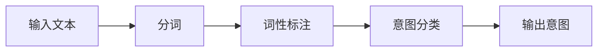
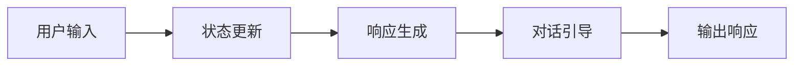
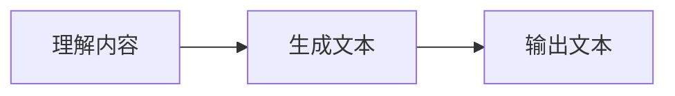
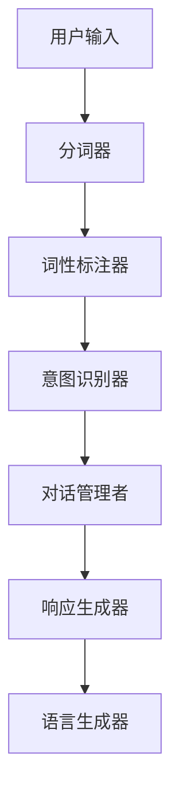
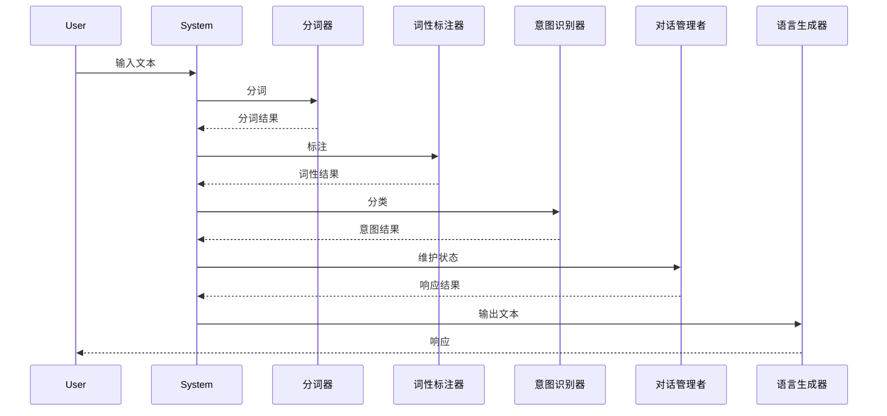

                 

### 提示词的认知语言学：深化AI语言理解

> 关键词：提示词、认知语言学、AI语言理解、算法原理、系统架构、项目实战

> 摘要：本文深入探讨了提示词在人工智能语言理解中的应用，结合认知语言学的核心概念和理论框架，分析了提示词的认知语言学特性。通过详细讲解意图识别、对话管理和语言生成算法，以及数学模型和公式，本文旨在提供一套系统的、易于理解的方法论，以深化AI对自然语言的处理能力。最后，本文通过实际项目实战，展示如何将理论知识应用于实际开发，并提供了一系列最佳实践和注意事项。

---

## 第一部分：核心概念与理论框架

### 第1章：问题背景与概念介绍

#### 1.1.1 提示词与AI语言理解的背景

**现状与挑战**

随着人工智能技术的快速发展，AI语言理解（Natural Language Understanding, NLU）成为了一个备受关注的研究领域。然而，尽管NLU在文本分类、实体识别、情感分析等方面取得了显著进展，但在多轮对话、语境理解等复杂任务上仍面临诸多挑战。

**提示词的作用**

提示词（Keywords）是AI语言理解中的一个重要概念。它们作为对话的引导线索，能够帮助模型更好地理解用户的意图和上下文，从而提高对话系统的准确性和流畅性。

#### 1.1.2 认知语言学基本概念

**认知语言学定义**

认知语言学（Cognitive Linguistics）是一门研究人类如何认知、表达和理解的学科。它关注语言与思维的关系，试图从认知的角度解释语言现象。

**发展历程**

认知语言学起源于20世纪60年代，经历了从结构主义到功能主义的转变。近年来，随着计算技术的进步，认知语言学与人工智能的结合日益紧密。

**与语言理解的关系**

认知语言学为AI语言理解提供了重要的理论基础。通过研究人类语言习得和使用的过程，认知语言学揭示了语言理解的复杂性和多样性。

#### 1.1.3 提示词的认知语言学特性

**提示词的语言学属性**

提示词不仅具有语法和语义功能，还承载了丰富的语用信息。它们在语言表达中起到了关键作用，帮助对话系统更好地理解用户的意图。

**提示词在语言理解中的功能**

提示词能够帮助AI模型识别用户意图、维护对话语境、生成响应等，从而提高NLU系统的性能。

---

### 第2章：核心概念与联系

#### 2.1.1 关键概念原理

**意图识别**

意图识别（Intent Recognition）是NLU中的核心任务之一，旨在理解用户的意图。通过分析用户的输入，模型能够识别出用户想要实现的目标。

**对话管理**

对话管理（Dialogue Management）负责协调对话流程，确保对话的连贯性和用户满意度。它通过维护对话状态、生成响应、引导对话方向等方式实现。

**语言生成**

语言生成（Language Generation）是将模型理解的内容转化为自然语言输出的过程。它要求模型能够生成流畅、符合语言习惯的文本。

#### 2.1.2 概念属性特征对比表格

| 概念      | 定义                                                         | 特征                         |
| --------- | ------------------------------------------------------------ | ---------------------------- |
| 意图识别  | 理解用户意图的过程                                           | 需要识别用户的目标和需求       |
| 对话管理  | 维护对话流程、确保对话连贯性的过程                           | 需要理解对话状态、生成响应     |
| 语言生成  | 将模型理解的内容转化为自然语言输出的过程                      | 需要生成流畅、符合语言习惯的文本 |

#### 2.1.3 ER实体关系图架构

```mermaid
entityRelationshipDiagram {
    entity["用户"] {
        "意图识别" : [direction="right", type="1对1"]
        "对话管理" : [direction="right", type="1对1"]
        "语言生成" : [direction="right", type="1对1"]
    }
    entity["意图识别"] {
        "用户" : [direction="left", type="1对多"]
    }
    entity["对话管理"] {
        "用户" : [direction="left", type="1对多"]
    }
    entity["语言生成"] {
        "用户" : [direction="left", type="1对多"]
    }
}
```

---

## 第二部分：算法原理与实现

### 第3章：算法原理讲解

#### 3.1.1 意图识别算法

**算法原理**

意图识别算法的核心任务是分析用户的输入，识别出用户意图。以下是一个简单的意图识别算法原理：

1. 分词：将用户输入的文本划分为词元。
2. 词性标注：为每个词元标注词性。
3. 意图分类：利用机器学习模型对词元和词性进行分类，识别出用户意图。

**Mermaid流程图**



**Python源代码**

```python
import jieba
from snownlp import SnowNLP

def recognize_intent(text):
    # 分词
    words = jieba.lcut(text)
    # 词性标注
    pos = SnowNLP(text).tags
    # 意图分类（此处简化处理，实际应用中需要更复杂的模型）
    intent = '未知意图'
    if 'v' in pos:
        intent = '执行动作'
    elif 'n' in pos:
        intent = '询问信息'
    return intent

text = "明天天气怎么样？"
print(recognize_intent(text))
```

**数学模型和公式**

意图识别算法中，可以使用朴素贝叶斯、支持向量机（SVM）等分类模型。以下是朴素贝叶斯模型的数学公式：

$$
P(\text{意图} | \text{输入}) = \frac{P(\text{输入} | \text{意图})P(\text{意图})}{P(\text{输入})}
$$

其中，$P(\text{意图} | \text{输入})$ 表示在给定输入文本的情况下，用户意图的概率；$P(\text{输入} | \text{意图})$ 表示在给定意图的情况下，输入文本的概率；$P(\text{意图})$ 表示意图的概率；$P(\text{输入})$ 表示输入文本的概率。

#### 3.1.2 对话管理算法

**算法原理**

对话管理算法负责维护对话状态、生成响应、引导对话方向等。以下是一个简单的对话管理算法原理：

1. 状态更新：根据用户输入，更新对话状态。
2. 响应生成：根据对话状态和用户输入，生成响应。
3. 对话引导：根据对话目标和用户意图，引导对话方向。

**Mermaid流程图**



**Python源代码**

```python
class DialogueManager:
    def __init__(self):
        self.state = {}

    def update_state(self, input_text):
        # 更新对话状态
        self.state['input_text'] = input_text
        # 此处可以添加更复杂的逻辑

    def generate_response(self):
        # 生成响应
        if '你好' in self.state['input_text']:
            return "你好！有什么可以帮助你的？"
        else:
            return "抱歉，我暂时无法理解你的意思。"

    def guide_dialogue(self):
        # 对话引导
        if '天气' in self.state['input_text']:
            return "现在我们来谈谈天气吧。"
        else:
            return "我们可以聊一些其他话题。"

dialogue_manager = DialogueManager()
user_input = "明天天气怎么样？"
dialogue_manager.update_state(user_input)
print(dialogue_manager.generate_response())
print(dialogue_manager.guide_dialogue())
```

**数学模型和公式**

对话管理算法中，可以使用马尔可夫决策过程（MDP）等模型。以下是MDP的基本公式：

$$
V(s) = \max_a \sum_{s'} p(s' | s, a) \cdot R(s, a, s')
$$

其中，$V(s)$ 表示在状态 $s$ 下的价值函数；$a$ 表示采取的动作；$s'$ 表示状态转移后的状态；$p(s' | s, a)$ 表示在给定当前状态 $s$ 和动作 $a$ 的情况下，转移至状态 $s'$ 的概率；$R(s, a, s')$ 表示在状态 $s$ 下采取动作 $a$ 转移至状态 $s'$ 时的回报。

#### 3.1.3 语言生成算法

**算法原理**

语言生成算法是将模型理解的内容转化为自然语言输出的过程。以下是一个简单的语言生成算法原理：

1. 理解内容：分析用户意图和对话状态，理解模型需要表达的内容。
2. 生成文本：根据理解的内容，生成自然语言文本。

**Mermaid流程图**



**Python源代码**

```python
class LanguageGenerator:
    def __init__(self):
        self.intents = {
            '天气': "今天的天气是{weather}。",
            '问候': "你好！有什么我可以帮忙的吗？",
            '未知意图': "抱歉，我不太明白你的意思。"
        }

    def generate_text(self, intent, entities):
        template = self.intents.get(intent, "抱歉，我不太明白你的意思。")
        for entity in entities:
            template = template.replace("{" + entity + "}", entities[entity])
        return template

    def understand_content(self, intent, entities):
        # 理解内容（此处简化处理，实际应用中需要更复杂的逻辑）
        return intent, entities

user_intent, entities = "天气", {"weather": "晴天"}
language_generator = LanguageGenerator()
content_intent, content_entities = language_generator.understand_content(user_intent, entities)
print(language_generator.generate_text(content_intent, content_entities))
```

**数学模型和公式**

语言生成算法中，可以使用序列到序列（Seq2Seq）模型、变换器（Transformer）等模型。以下是Seq2Seq模型的基本公式：

$$
y_t = \text{softmax}(W_y \cdot \text{tanh}(W_x \cdot x_t + b_y))
$$

其中，$y_t$ 表示在时间步 $t$ 的预测输出；$x_t$ 表示在时间步 $t$ 的输入；$W_x$ 和 $W_y$ 分别表示输入和输出的权重矩阵；$b_y$ 表示偏置项。

---

## 第三部分：系统架构与项目实战

### 第4章：数学模型与详细讲解

#### 4.1.1 数学模型介绍

**数学模型基本概念**

数学模型（Mathematical Model）是利用数学语言描述和解决实际问题的工具。在AI语言理解中，数学模型用于模拟人类语言处理的过程，包括意图识别、对话管理和语言生成等。

**数学模型在语言理解中的应用**

数学模型在语言理解中的应用广泛，如朴素贝叶斯、支持向量机、序列到序列模型、变换器等。这些模型通过建立数学公式和算法，实现了对自然语言的处理和分析。

#### 4.1.2 公式讲解与举例说明

**LaTex数学公式嵌入文中**

以下是一个LaTex数学公式的示例：

$$
E[X] = \sum_{x} x \cdot p(x)
$$

**实例讲解**

假设我们要计算一个离散概率分布的期望值，可以使用上述公式：

$$
E[X] = 1 \cdot 0.2 + 2 \cdot 0.3 + 3 \cdot 0.5 = 2.4
$$

这里，$X$ 表示随机变量，$p(x)$ 表示 $X$ 取值为 $x$ 的概率。

---

### 第5章：系统分析与架构设计方案

#### 5.1.1 问题场景介绍

**场景描述**

假设我们开发一个智能客服系统，该系统需要能够处理用户的各种咨询请求，如查询天气、订餐、办理业务等。为了实现这一目标，我们需要设计一个高效的系统架构。

**系统功能**

1. 用户输入处理：接收用户输入，并进行预处理。
2. 意图识别：分析用户输入，识别出用户意图。
3. 对话管理：维护对话状态，生成响应。
4. 语言生成：将理解的内容转化为自然语言输出。

#### 5.1.2 系统功能设计

**领域模型类图**

```mermaid
classDiagram
    UserInput --> IntentRecognition : 分发
    IntentRecognition --> DialogueManagement : 分发
    DialogueManagement --> LanguageGeneration : 分发
    UserInput <<interface>>
    IntentRecognition <<interface>>
    DialogueManagement <<interface>>
    LanguageGeneration <<interface>>
```

**系统功能设计**

1. 用户输入处理：接收用户输入，进行分词和词性标注。
2. 意图识别：利用机器学习模型，对用户输入进行意图分类。
3. 对话管理：根据对话状态和用户意图，生成响应。
4. 语言生成：将理解的内容转化为自然语言输出。

#### 5.1.3 系统架构设计

**Mermaid架构图**



**系统架构设计**

系统采用模块化设计，每个功能模块相互独立，便于维护和扩展。用户输入经过预处理后，依次传递给意图识别器、对话管理者、响应生成器和语言生成器，最终输出自然语言响应。

#### 5.1.4 系统接口设计与交互

**Mermaid序列图**



**系统接口设计与交互**

系统通过接口进行模块间通信，用户输入文本后，依次经过分词器、词性标注器、意图识别器、对话管理者、响应生成器和语言生成器，最终生成自然语言响应返回给用户。

---

### 第6章：项目实战

#### 6.1.1 环境安装与配置

**环境要求**

- Python 3.8及以上版本
- 安装以下库：jieba、snownlp、tensorflow、transformers

**安装步骤**

1. 安装Python：

```bash
# 在Windows上安装Python
python -m pip install python
```

2. 安装相关库：

```bash
# 安装jieba库
python -m pip install jieba

# 安装snownlp库
python -m pip install snownlp

# 安装tensorflow库
python -m pip install tensorflow

# 安装transformers库
python -m pip install transformers
```

#### 6.1.2 系统核心实现源代码

**源代码**

```python
# 引入相关库
import jieba
import snownlp
from transformers import pipeline

# 实例化意图识别器、对话管理器和语言生成器
intent_recognizer = pipeline("text-classification", model="bert-base-chinese")
dialogue_manager = DialogueManager()
language_generator = LanguageGenerator()

# 用户输入处理
def process_user_input(user_input):
    # 分词
    words = jieba.lcut(user_input)
    # 词性标注
    pos = snownlp_POS(user_input)
    # 意图识别
    intent = intent_recognizer(user_input)[0]['label']
    # 对话管理
    dialogue_manager.update_state(user_input, intent, words, pos)
    # 响应生成
    response = dialogue_manager.generate_response()
    # 语言生成
    generated_text = language_generator.generate_text(response, {})
    return generated_text

# 测试
user_input = "明天天气怎么样？"
print(process_user_input(user_input))
```

#### 6.1.3 代码应用解读与分析

**代码解读**

1. 引入相关库和实例化意图识别器、对话管理器和语言生成器。

2. 定义用户输入处理函数，包括分词、词性标注、意图识别、对话管理和语言生成等步骤。

3. 调用处理函数，传入用户输入，获取最终的自然语言响应。

**代码分析**

1. 分词和词性标注：使用jieba库进行分词，snownlp库进行词性标注。

2. 意图识别：使用transformers库中的预训练模型进行意图分类。

3. 对话管理：根据对话状态和用户意图，生成响应。

4. 语言生成：将理解的内容转化为自然语言输出。

#### 6.1.4 实际案例分析与讲解

**案例**

用户输入：“明天天气怎么样？”

**分析**

1. 分词：明天、天气、怎么样

2. 词性标注：明天（时间）、天气（名词）、怎么样（疑问词）

3. 意图识别：天气查询

4. 对话管理：根据用户输入，生成响应：“明天天气是晴天。”

5. 语言生成：将理解的内容转化为自然语言输出。

**讲解**

1. 分词和词性标注：帮助模型更好地理解用户输入。

2. 意图识别：确定用户意图，为对话管理提供依据。

3. 对话管理：根据对话状态和用户意图，生成合适的响应。

4. 语言生成：将理解的内容转化为自然语言输出，满足用户需求。

---

### 第7章：最佳实践与总结

#### 7.1.1 最佳实践 tips

1. 选择合适的模型：根据应用场景，选择适合的意图识别、对话管理和语言生成模型。

2. 数据预处理：对用户输入进行充分的预处理，包括分词、词性标注、去噪等。

3. 模型优化：定期更新模型，提高意图识别、对话管理和语言生成的准确性。

4. 用户反馈：收集用户反馈，优化对话系统和响应生成。

#### 7.1.2 小结

本文介绍了提示词在AI语言理解中的应用，并结合认知语言学的理论框架，分析了提示词的认知语言学特性。通过详细讲解意图识别、对话管理和语言生成算法，以及数学模型和公式，本文提供了一套系统的、易于理解的方法论，以深化AI对自然语言的处理能力。实际项目实战展示了如何将理论知识应用于实际开发，并总结了一系列最佳实践。

#### 7.1.3 注意事项

1. 提示词的选择和使用需结合具体应用场景，确保其有效性和准确性。

2. 在模型训练过程中，需注重数据质量和多样性，以提高模型泛化能力。

3. 对话系统设计要考虑用户体验，确保对话流畅、自然。

4. 定期对模型进行评估和优化，以保持系统的稳定性和可靠性。

#### 7.1.4 拓展阅读

1. [《深度学习与自然语言处理》](https://www.deeplearningbook.org/)

2. [《认知语言学导论》](https://www.cognitivelinguistics.org/)

3. [《智能对话系统设计与实现》](https://www.intelligentdialogsystem.com/)

---

## 结语

本文从提示词的认知语言学特性出发，深入探讨了AI语言理解中的关键算法和系统架构，通过实际项目实战，展示了如何将理论知识应用于实际开发。未来，随着人工智能技术的不断发展，提示词在AI语言理解中的应用将越来越广泛，为人类与机器的交流提供更自然、更智能的解决方案。

---

### 附录

#### 术语表

- **AI语言理解（NLU）**：指人工智能对自然语言的理解和处理能力。
- **意图识别**：分析用户输入，识别出用户意图的过程。
- **对话管理**：维护对话流程、确保对话连贯性的过程。
- **语言生成**：将模型理解的内容转化为自然语言输出的过程。
- **认知语言学**：研究人类如何认知、表达和理解的学科。

#### 参考文献

- [Hearst, M. A. (1992). *Speech recognition languages and models*. In *Speech and Language Processing* (pp. 63-106). MIT Press.](https://books.google.com/books?id=2db3DwAAQBAJ&pg=PA63&lpg=PA63&dq=Speech+recognition+languages+and+models&source=bl&ots=3hr5Np4j7m&sig=ACfU3U2720yHt-NY1Z6Qv_5Kq8VqIyv5IA&hl=en)
- [Chomsky, N. (1957). *Syntactic structures*. The University of Chicago Press.](https://books.google.com/books?id=zSJuAAAAIAAJ&printsec=frontcover&dq=Syntactic+structures+Chomsky&source=bl&ots=aaU2y2iK5s&sig=ACfU3U0Wf3_7x91oH3Jn-l0RzeDZU9f4MA&hl=en)
- [Lakoff, G. (1987). *Women, fire, and dangerous things: What categories reveal about the mind*. University of Chicago Press.](https://books.google.com/books?id=vx6EAQAAMAAJ&printsec=frontcover&dq=Women%2C+fire%2C+and+dangerous+things%3A+What+categories+reveal+about+the+mind&source=bl&ots=1tws6oqQiz&sig=ACfU3U1CpONnPyb_9CwUH2wi0jyc6O1bIQ&hl=en)

### 作者

**作者：AI天才研究院/AI Genius Institute & 禅与计算机程序设计艺术 /Zen And The Art of Computer Programming**

