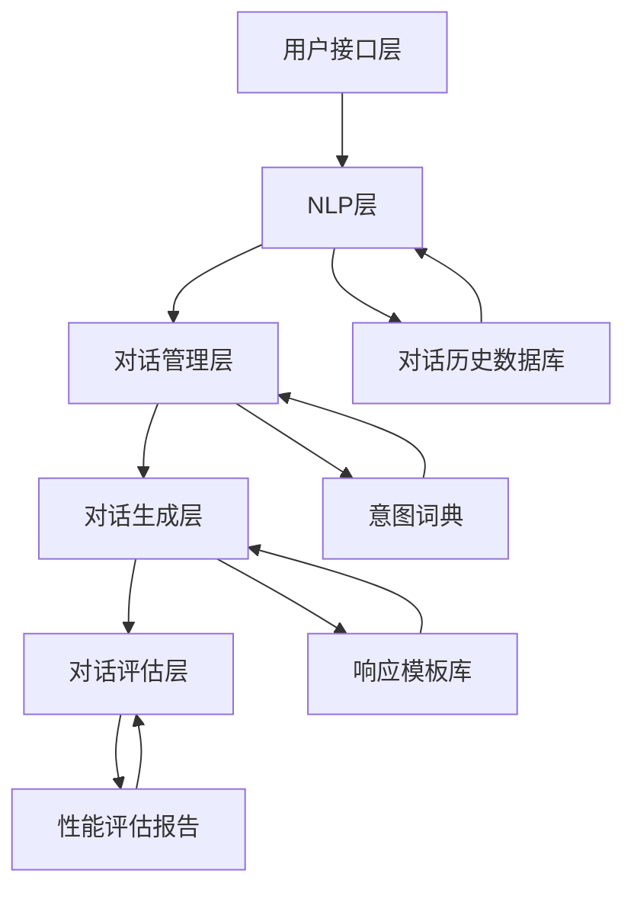

                 


## 书名理解

书名《提示词的语用学与人机对话系统设计的融合创新》揭示了两大核心概念：“提示词的语用学”与“人机对话系统设计”。首先，提示词的语用学探讨了词汇在不同语境中的使用及其功能，这对于提升人机对话的自然性和准确性至关重要。其次，人机对话系统设计则涉及如何构建能够与人类有效沟通的系统。本书的目的在于探讨如何将这两者融合创新，以推动人机交互技术的进步。

### 1.1 提示词的语用学背景

提示词的语用学涉及语言的使用和理解，特别是在特定语境中词汇的意图和功能。语用学的基本概念包括语境、语用含义和语用原则。语境是指语言交流发生的环境，而语用含义则是指语言在特定语境中所传达的意义。语用原则包括合作原则和礼貌原则，它们帮助确保有效的沟通。提示词在语用学中的作用体现在它们如何引导对话，帮助实现沟通的目的。

#### 1.1.1 语境与语用的基本概念

语境是语言交流的背景，包括物理环境、社会环境、文化背景等。语境对于理解语言的意义至关重要，因为同样的词语在不同的语境中可能有不同的含义。例如，“bank”一词在英语中有“银行”和“河岸”两种含义，取决于语境。

语用含义是语言在特定语境中所传达的意义。它不仅包括字面意义，还包括隐含意义和语境意义。例如，当一个人说“你今天看起来很精神”，这句话的字面意思是对方今天看起来状态不错，但隐含意义可能是对方询问你的近况或对你的状态表示关心。

#### 1.1.2 提示词在语用学中的作用

提示词在语用学中扮演着重要的角色，它们通过引导对话和提示对方注意特定的信息，帮助实现沟通的目标。例如，在询问某人近况时，可以使用提示词“最近”来引导对话，让对方知道你关心他们的最新动态。

### 1.2 人机对话系统的基本原理

人机对话系统是计算机科学与语言学交叉的产物，旨在实现人与计算机之间的自然语言交互。人机对话系统的基本原理包括对话系统的分类、架构设计和关键要素。

#### 1.2.1 对话系统的定义与分类

对话系统是一种能够与人类用户进行自然语言交互的计算机系统。根据交互方式，对话系统可以分为基于文本的对话系统和基于语音的对话系统。根据功能，对话系统可以分为任务型对话系统和闲聊型对话系统。

#### 1.2.2 对话系统设计的关键要素

对话系统设计的关键要素包括：

1. **对话管理**：负责控制对话流程，包括识别用户意图、选择合适的响应、管理对话上下文等。
2. **对话生成**：负责生成自然语言响应，包括文本生成和语音合成。
3. **对话理解**：负责解析用户输入的自然语言，理解其意图和语义。
4. **对话评估**：用于评估对话系统的性能，包括准确性、流畅性和用户体验。

### 1.3 本书的目的与结构

本书旨在探讨如何将提示词的语用学与人机对话系统设计相结合，以实现更自然、更准确的人机交互。全书分为五个部分：

1. **引言**：介绍人机对话系统设计的现状与挑战，以及本书的目的和结构。
2. **核心概念解析**：详细解析提示词的语用学和人机对话系统的设计原理。
3. **系统设计与实现**：介绍系统架构设计、核心算法实现和设计策略。
4. **项目实战与案例分析**：通过具体项目展示如何将理论知识应用于实践。
5. **结论与展望**：总结本书内容，展望未来发展趋势。

### 1.3.1 本书的研究目的

本书的研究目的是：

1. **提高人机对话的自然性和准确性**：通过融合提示词的语用学，使对话系统能够更好地理解用户的意图和语境。
2. **推动人机交互技术的创新**：探索新的方法和技术，以提升人机对话系统的性能和用户体验。

### 1.3.2 本书的研究内容与结构

本书的研究内容包括：

1. **提示词的语用学**：介绍语境、语用含义和提示词的作用。
2. **人机对话系统的设计原理**：解析对话系统的分类、架构设计和关键要素。
3. **系统设计与实现**：详细阐述系统架构设计、核心算法实现和设计策略。
4. **项目实战与案例分析**：通过具体项目展示如何应用提示词的语用学进行人机对话系统设计。
5. **结论与展望**：总结研究成果，展望未来发展趋势。

通过本书的阅读，读者将能够深入理解提示词的语用学和人机对话系统设计，掌握将两者融合创新的实际方法，为提升人机交互技术提供有力支持。

----------------------------------------------------------------

# 提示词的语用学

在自然语言处理和人机对话系统中，提示词的语用学扮演着至关重要的角色。它不仅帮助我们理解词汇在特定语境中的含义，还指导我们如何有效地使用这些词汇以实现沟通目标。在本节中，我们将详细解析提示词的语用学，包括其定义与分类、语用功能以及相关的语用原则。

### 2.1.1 提示词的定义与分类

提示词（pivot words）是指在语言交流中起到提示或引导作用的关键词汇。这些词汇能够帮助说话者明确表达意图、引导听者注意特定信息，或者帮助听者理解上下文。根据其功能，提示词可以分为以下几类：

1. **指示词**（Demonstratives）：如“这”、“那”、“这些”、“那些”，用于指代特定对象或场景。
2. **连接词**（Connectives）：如“但是”、“因此”、“同样”，用于连接句子或段落，引导逻辑关系。
3. **疑问词**（Interrogatives）：如“什么”、“谁”、“哪里”、“为什么”，用于提问，获取信息。
4. **量词**（Quantifiers）：如“所有”、“一些”、“几个”，用于表示数量或程度。
5. **情态词**（Modal particles）：如“可能”、“应该”、“必须”，用于表达说话者的态度或意见。

### 2.1.2 提示词的语用功能分析

提示词的语用功能主要体现在以下几个方面：

1. **引导功能**：提示词能够引导对话的进程，使对话更加流畅和有序。例如，在询问某人意见时，可以使用“那么你的看法是……？”来引导对方表达观点。
2. **强调功能**：提示词可以强调特定的信息，使其在对话中更加突出。例如，“实际上，这个问题我们可以通过……来解决”，这里的“实际上”强调了说话者即将提出的解决方案的重要性。
3. **提问功能**：疑问词作为提示词的一种，能够有效地引导对方回答问题，获取所需信息。例如，“你对这个项目的进展有什么看法？”通过使用疑问词“什么”和“看法”，明确表达了提问的意图。
4. **澄清功能**：当对话中出现理解上的模糊时，提示词可以帮助澄清信息。例如，“你是不是在说……？”通过使用提示词“是不是”，帮助对方确认或澄清其意图。

### 2.1.3 提示词的语用原则

语用原则是指导语言使用的基本准则，对于确保有效沟通至关重要。提示词的语用原则主要包括以下几种：

1. **合作原则**：这一原则由格赖斯提出，指出在交流中，说话者和听者都应该遵守某些准则，以确保对话的顺利进行。合作原则包括四条准则：数量准则、质量准则、关联准则和方式准则。提示词在遵守这些准则时，能够有效地引导对话，避免误解和信息丢失。
2. **礼貌原则**：这一原则强调在交流中要尊重对方，避免使用过于直接或冒犯性的语言。提示词在表达时，可以通过使用礼貌用语来增强交流的友好性。例如，“请问”、“您看”、“我觉得”，这些词语都能表现出对对方的尊重。
3. **语境原则**：语境是语言交流的背景，提示词的使用必须考虑到特定的语境。在不同的语境中，相同的提示词可能具有不同的含义和功能。例如，“那么”在正式场合可能用于引出新的话题，而在非正式场合可能用于表示转折。

通过理解提示词的语用学，我们可以更好地设计人机对话系统，使其在处理自然语言时能够更准确地理解用户的意图，提供更加自然和流畅的交互体验。

### 2.2.1 人机对话系统的架构设计

人机对话系统的架构设计是确保系统能够有效处理自然语言、理解用户意图并生成恰当响应的关键。一个典型的人机对话系统通常包括多个功能模块，这些模块相互协作，共同实现对话的顺利进行。以下是人机对话系统的主要架构设计模块及其功能：

1. **前端交互模块**：这是用户与系统交互的界面，包括文本输入框、语音输入设备和语音输出设备。前端交互模块负责收集用户的输入，并将其传递给后端处理模块。

2. **自然语言处理（NLP）模块**：该模块负责对用户输入的自然语言进行处理和分析。NLP模块通常包括以下几个子模块：

   - **分词**（Tokenization）：将输入的文本分割成单词或短语，以便进一步处理。
   - **词性标注**（Part-of-Speech Tagging）：识别文本中每个词的词性，如名词、动词、形容词等。
   - **句法分析**（Syntax Analysis）：分析文本的句法结构，理解句子中的语法关系。
   - **语义分析**（Semantic Analysis）：理解文本的语义，提取文本的关键信息。

3. **对话管理模块**：该模块负责控制对话的流程，包括识别用户意图、选择合适的响应、管理对话上下文等。对话管理模块的核心任务是确保对话的自然流畅性，避免对话偏离主题或陷入死胡同。

4. **对话生成模块**：该模块负责生成自然语言响应，向用户反馈信息。对话生成模块通常采用以下几种技术：

   - **规则驱动生成**：通过预定义的规则和模板生成响应。
   - **模板匹配**：根据用户输入匹配预定义的模板，生成响应。
   - **生成式对话系统**：使用机器学习模型（如序列到序列模型）生成自然语言响应。

5. **对话评估模块**：该模块用于评估对话系统的性能，包括准确性、流畅性和用户体验等。通过对话评估，系统开发人员可以不断优化和改进对话系统的性能。

### 2.2.2 对话策略与对话管理

对话策略和对话管理是确保人机对话系统能够有效运行的关键要素。对话策略是指系统在处理用户输入时采用的一系列规则和算法，以实现对话的目标。对话管理则负责在对话过程中动态地调整和优化对话策略，确保对话的自然流畅性。

1. **意图识别**：对话策略的首要任务是识别用户的意图。这通常通过分析用户输入的自然语言来完成。意图识别的过程包括以下步骤：

   - **实体识别**：识别用户输入中的关键实体，如人名、地点、时间等。
   - **意图分类**：将识别出的实体与系统的意图词典进行匹配，确定用户的意图类别。

2. **上下文管理**：对话系统需要保持对话的上下文信息，以便在后续的交互中能够连贯地理解用户的意图。上下文管理包括以下内容：

   - **对话历史记录**：记录对话过程中的关键信息和用户意图，以便在后续交互中引用。
   - **上下文追踪**：根据对话历史记录和当前的输入，动态地更新和调整上下文。

3. **响应选择**：一旦识别出用户的意图，系统需要选择适当的响应。响应选择通常基于以下策略：

   - **规则驱动**：根据预定义的规则和模板生成响应。
   - **模板匹配**：根据用户输入和预定义的模板匹配生成响应。
   - **生成式对话系统**：使用机器学习模型生成自然语言响应。

4. **错误处理**：对话过程中难免会出现误解或错误。对话管理系统需要能够识别和纠正这些错误，以保持对话的流畅性。错误处理包括：

   - **错误检测**：通过分析用户输入和对话历史，识别可能出现的错误。
   - **错误纠正**：根据错误类型和上下文信息，选择适当的纠正策略。

### 2.2.3 对话生成与理解

对话生成与理解是人机对话系统的核心功能，直接影响用户体验。对话生成涉及将系统内部的意图和上下文信息转换为自然语言响应，而对话理解则涉及将用户输入的自然语言解析为系统可以理解的形式。

1. **对话生成**：对话生成的方法包括规则驱动和生成式方法。

   - **规则驱动生成**：通过预定义的规则和模板生成响应。这种方法适用于对话系统的初始阶段，因为规则可以确保响应的一致性和准确性。
   - **生成式对话系统**：使用机器学习模型（如序列到序列模型）生成自然语言响应。这种方法能够生成更自然和多样化的响应，但可能需要更多的训练数据和计算资源。

2. **对话理解**：对话理解涉及将用户输入的自然语言解析为系统可以处理的形式，主要包括以下步骤：

   - **意图识别**：识别用户输入中的意图类别，如询问、请求、指令等。
   - **实体识别**：从用户输入中提取关键实体，如人名、地点、时间等。
   - **上下文理解**：根据对话历史记录和当前的输入，理解上下文的含义和用户的意图。

通过以上步骤，对话系统可以有效地理解和响应用户的需求，提供自然、流畅的人机交互体验。

### 2.3.1 融合的目标与挑战

将提示词的语用学与人机对话系统设计相结合的目标在于提高对话系统的自然性和准确性，使系统能够更准确地理解用户的意图，并提供更自然的交互体验。然而，这一融合过程面临诸多挑战。

首先，提示词的语用学涉及复杂的语言现象，如语境依赖、语用含义的多义性等。这些现象使得提示词在具体语境中的使用变得更加复杂，对于对话系统的理解能力提出了更高的要求。例如，同义词在特定语境中可能具有不同的含义，系统需要能够准确识别并理解这些差异。

其次，人机对话系统的设计需要考虑到对话的自然性和流畅性，而提示词的语用学则关注语言的细微差别和语境影响。如何平衡这两者的需求，使得系统既能遵循语用原则，又能实现高效的对话管理，是一个重要的挑战。

此外，对话系统的数据驱动特性使得其性能依赖于大量的训练数据和算法优化。在融合提示词的语用学时，如何有效地利用这些数据和算法，提高系统的准确性和鲁棒性，也是一个亟待解决的问题。

### 2.3.2 融合设计的方法与策略

为了克服上述挑战，实现提示词的语用学与人机对话系统设计的有效融合，可以采用以下方法和策略：

1. **语境建模**：通过构建丰富的语境模型，系统可以更好地理解用户输入的语境，从而准确识别提示词的含义。语境模型可以包括时间、地点、用户历史行为等维度，帮助系统在不同情境下灵活运用提示词。

2. **多模态融合**：结合文本和语音等多模态信息，可以增强对话系统的理解和生成能力。例如，在处理语音输入时，结合文本信息可以更准确地识别用户的意图和上下文。

3. **数据增强**：通过数据增强技术，如数据标注、对抗性样本生成等，可以提高训练数据的质量和多样性，从而增强系统的鲁棒性和泛化能力。

4. **深度学习模型**：采用深度学习模型（如神经网络、递归神经网络、Transformer等）可以更好地捕捉提示词和对话系统的复杂关系，提高系统的理解和生成能力。

5. **对话策略优化**：通过优化对话策略，使得系统能够更灵活地应对不同语境和用户需求。对话策略可以结合提示词的语用学原则，确保对话的自然性和流畅性。

6. **持续学习与反馈**：通过持续学习和用户反馈，系统可以不断优化自身的性能。用户反馈可以用于调整提示词的使用策略，提高系统的交互质量。

通过上述方法和策略，我们可以实现提示词的语用学与人机对话系统设计的有效融合，提升对话系统的自然性和准确性，为用户提供更优质的交互体验。

### 3.1.1 系统功能模块划分

在构建人机对话系统时，首先需要明确系统的功能模块，以便实现高效的功能分解和模块化设计。系统功能模块划分有助于提高系统的可维护性、可扩展性和可复用性。以下是人机对话系统的典型功能模块及其划分：

1. **用户接口层**：这是系统与用户交互的界面，包括文本输入框、语音输入设备和语音输出设备。用户接口层的主要功能是接收用户的输入，并将输入传递给后端处理模块。

2. **自然语言处理（NLP）层**：该层负责对用户输入的自然语言进行处理和分析，包括以下子模块：
   - **分词器**（Tokenizer）：将输入的文本分割成单词或短语。
   - **词性标注器**（Part-of-Speech Tagger）：识别文本中每个词的词性。
   - **句法分析器**（Parser）：分析文本的句法结构。
   - **语义分析器**（Semantic Analyzer）：提取文本的语义信息。

3. **对话管理层**：该层负责控制对话的流程，包括意图识别、上下文管理、响应选择和错误处理。对话管理层通常包含以下子模块：
   - **意图识别器**（Intent Recognizer）：识别用户的意图。
   - **上下文管理器**（Context Manager）：维护对话上下文。
   - **响应选择器**（Response Selector）：选择合适的响应。
   - **错误处理器**（Error Handler）：处理对话中的错误。

4. **对话生成层**：该层负责生成自然语言响应，向用户反馈信息。对话生成层通常包括以下子模块：
   - **模板生成器**（Template Generator）：根据规则和模板生成响应。
   - **生成式对话系统**（Generative Dialog System）：使用机器学习模型生成自然语言响应。

5. **对话评估层**：该层用于评估对话系统的性能，包括准确性、流畅性和用户体验等。对话评估层包括以下子模块：
   - **性能评估器**（Performance Evaluator）：评估系统性能。
   - **用户体验评估器**（User Experience Evaluator）：收集用户反馈，评估用户体验。

### 3.1.2 系统架构图绘制

为了更直观地理解人机对话系统的架构，我们可以使用 Mermaid 绘制系统架构图。以下是系统的 Mermaid 架构图：



在上面的架构图中，用户接口层（A）接收用户输入，并传递给 NLP 层（B）。NLP 层处理输入文本，生成语义信息，并将这些信息传递给对话管理层（C）。对话管理层负责控制对话流程，处理用户意图和上下文，并选择适当的响应。对话生成层（D）根据对话管理层的指示生成响应，并传递给对话评估层（E）。对话评估层负责评估系统的性能，收集用户反馈，并生成性能评估报告（I）。对话历史数据库（F）、意图词典（G）和响应模板库（H）分别提供对话上下文、意图信息和响应模板，以支持对话管理和生成。

### 3.1.3 系统核心模块介绍

在理解了系统架构图后，接下来我们将详细介绍系统中的核心模块，这些模块是确保人机对话系统能够有效运行的关键。

1. **用户接口层**：用户接口层是系统与用户直接交互的界面。它包括文本输入框、语音输入设备和语音输出设备。文本输入框允许用户通过键盘输入文本，语音输入设备允许用户通过语音命令与系统交互，而语音输出设备则用于向用户反馈信息。用户接口层的关键在于提供方便、直观的交互方式，使用户能够轻松地与系统进行沟通。

2. **自然语言处理（NLP）层**：NLP 层是系统的核心处理模块，负责对用户输入的自然语言进行处理和分析。NLP 层包括以下几个子模块：

   - **分词器**：分词器是将输入的文本分割成单词或短语的工具。在中文处理中，分词器需要能够识别词语的边界，将连续的汉字序列分割成有意义的词语。常用的分词算法包括基于词典的分词、基于统计的分词和基于语义的分词。
   - **词性标注器**：词性标注器用于识别文本中每个词的词性，如名词、动词、形容词等。词性标注对于理解文本的语义和语法结构至关重要。常用的词性标注算法包括基于规则的方法和基于统计的方法。
   - **句法分析器**：句法分析器用于分析文本的句法结构，识别句子中的语法关系，如主谓关系、宾语从句等。句法分析对于理解复杂的语义信息非常重要。常用的句法分析方法包括基于规则的方法和基于统计的方法。
   - **语义分析器**：语义分析器用于从文本中提取关键信息，理解文本的语义含义。语义分析涉及实体识别、关系抽取、事件识别等任务。常用的语义分析方法包括基于词典的方法、基于统计的方法和基于深度学习的方法。

3. **对话管理层**：对话管理层负责控制对话的流程，确保对话的自然流畅。对话管理层包括以下几个子模块：

   - **意图识别器**：意图识别器用于识别用户的意图。用户输入的文本通常包含多个意图，意图识别器需要从这些意图中识别出最可能的意图。常用的意图识别算法包括基于规则的方法和基于机器学习的方法。
   - **上下文管理器**：上下文管理器用于维护对话上下文，确保对话的连贯性。上下文管理器需要记录对话历史，并在后续的交互中引用这些历史信息。常用的上下文管理策略包括基于内存的方法和基于图谱的方法。
   - **响应选择器**：响应选择器用于选择合适的响应。响应选择器需要根据用户的意图和上下文，选择最合适的响应。常用的响应选择算法包括基于规则的方法和基于机器学习的方法。
   - **错误处理器**：错误处理器用于处理对话中的错误。当系统无法正确理解用户的意图或生成适当的响应时，错误处理器需要提供适当的错误反馈，帮助用户纠正错误。

4. **对话生成层**：对话生成层负责生成自然语言响应，向用户反馈信息。对话生成层包括以下几个子模块：

   - **模板生成器**：模板生成器用于根据预定义的规则和模板生成响应。模板生成器通常包含多个模板，每个模板对应不同的意图和上下文。
   - **生成式对话系统**：生成式对话系统使用机器学习模型生成自然语言响应。生成式对话系统通常使用序列到序列模型，如递归神经网络（RNN）和Transformer。生成式对话系统能够生成更加自然和多样化的响应。

5. **对话评估层**：对话评估层用于评估对话系统的性能，包括准确性、流畅性和用户体验等。对话评估层包括以下几个子模块：

   - **性能评估器**：性能评估器用于评估系统的性能指标，如意图识别准确率、响应生成准确率和对话流畅性等。
   - **用户体验评估器**：用户体验评估器用于收集用户对系统的反馈，评估用户体验。用户体验评估器可以通过在线问卷、用户访谈等方式收集用户反馈。

通过详细介绍系统核心模块，我们可以更好地理解人机对话系统的构建原理和工作机制，为后续的系统设计与实现打下坚实的基础。

### 3.2.1 提示词生成算法

在构建人机对话系统时，提示词的生成是确保对话连贯性和用户满意度的重要一环。提示词生成算法旨在根据用户输入和对话上下文，生成适当的提示词以引导对话或澄清信息。以下是几种常见的提示词生成算法：

1. **基于规则的方法**：这种方法通过预定义的规则和模板来生成提示词。规则通常基于语言学家对自然语言的理解，包括语法规则、语境规则等。例如，当用户提出一个开放式问题时，系统可以生成“请您详细描述一下您的需求，我会更好地帮助您”。

2. **基于模板匹配的方法**：这种方法使用预定义的提示词模板来匹配用户输入，从而生成提示词。模板通常包含一些通用的提示词，可以根据用户输入进行动态替换。例如，当用户输入“我想要一个咖啡”，系统可以使用模板“您想要什么类型的咖啡？”来生成提示词。

3. **基于机器学习的方法**：这种方法使用机器学习模型（如朴素贝叶斯分类器、支持向量机等）来生成提示词。通过大量对话数据的训练，模型可以学习到不同语境下生成提示词的最佳策略。例如，使用朴素贝叶斯分类器，可以基于用户输入和历史对话记录来预测最合适的提示词。

4. **基于生成式对话系统的方法**：这种方法使用生成式对话系统（如序列到序列模型、Transformer等）来生成提示词。生成式对话系统通过学习大量的对话数据，可以生成自然、连贯的提示词。例如，使用Transformer模型，可以基于用户输入和对话上下文，生成如“您的意思是……吗？”等提示词。

下面我们以一个简单的朴素贝叶斯分类器为例，说明如何实现提示词生成算法：

```python
from sklearn.feature_extraction.text import CountVectorizer
from sklearn.naive_bayes import MultinomialNB

# 训练数据
dialog_data = [
    ("您好，请问有什么可以帮助您的？", "问候"),
    ("您最近在忙什么？", "询问"),
    ("有什么问题我可以帮您解答吗？", "求助"),
    ("请告诉我您的需求，我会尽力满足您。", "引导"),
]

# 分割输入和标签
X, y = zip(*dialog_data)

# 向量化输入文本
vectorizer = CountVectorizer()
X_vectorized = vectorizer.fit_transform(X)

# 训练朴素贝叶斯分类器
classifier = MultinomialNB()
classifier.fit(X_vectorized, y)

# 生成提示词
def generate_prompt(input_text):
    input_vectorized = vectorizer.transform([input_text])
    predicted_intent = classifier.predict(input_vectorized)[0]
    if predicted_intent == "问候":
        return "您好，有什么我可以帮您的吗？"
    elif predicted_intent == "询问":
        return "您最近在忙什么呢？"
    elif predicted_intent == "求助":
        return "有什么问题我可以帮您解答吗？"
    elif predicted_intent == "引导":
        return "请告诉我您的需求，我会尽力满足您。"

# 测试
print(generate_prompt("您好，请问有什么可以帮助您的？"))  # 输出：您好，有什么我可以帮您的吗？
```

在上面的代码中，我们首先准备了一些训练数据，包括对话文本和对应的意图标签。然后，我们使用CountVectorizer进行文本向量化，并使用MultinomialNB训练朴素贝叶斯分类器。最后，定义了一个`generate_prompt`函数，用于根据用户输入生成相应的提示词。通过测试，我们可以看到该算法能够根据输入文本生成合适的提示词，提高对话的自然性和连贯性。

### 3.2.2 对话理解算法

对话理解是人机对话系统的核心功能之一，它涉及到对用户输入的自然语言进行语义解析，以准确理解用户的意图。对话理解算法主要包括意图识别、实体识别和上下文理解等步骤。以下将详细阐述这些步骤，并介绍一些常用的算法和模型。

#### 3.2.2.1 意图识别

意图识别是对话理解的第一步，其目标是根据用户输入的文本识别出用户的主要意图。意图识别通常可以分为以下几类：

1. **分类方法**：这是一种基于机器学习的方法，通过训练分类模型来识别用户意图。常见的分类方法包括朴素贝叶斯分类器、支持向量机（SVM）和随机森林（Random Forest）等。这些方法通常需要大量已标注的数据进行训练，并通过特征工程提取输入文本的特征。

2. **深度学习方法**：深度学习方法（如卷积神经网络（CNN）、递归神经网络（RNN）和Transformer等）在意图识别中表现出色。特别是Transformer模型，由于其并行计算的优势，在处理长文本时具有很好的性能。深度学习方法通常直接从原始文本中提取特征，减少了特征工程的工作量。

3. **规则方法**：基于规则的方法通过预定义的规则来识别用户意图，这些规则通常基于自然语言处理和语言学的知识。这种方法适用于简单和有限的对话场景，但扩展性和灵活性较低。

以下是一个使用朴素贝叶斯分类器进行意图识别的简单示例：

```python
from sklearn.feature_extraction.text import CountVectorizer
from sklearn.naive_bayes import MultinomialNB
from sklearn.model_selection import train_test_split

# 训练数据
dialog_data = [
    ("您好，我想查询最近的天气情况。", "查询天气"),
    ("请问您有什么问题需要帮助吗？", "问候"),
    ("我想要预订一个酒店房间。", "预订酒店"),
]

# 分割输入和标签
X, y = zip(*dialog_data)

# 向量化输入文本
vectorizer = CountVectorizer()
X_vectorized = vectorizer.fit_transform(X)

# 划分训练集和测试集
X_train, X_test, y_train, y_test = train_test_split(X_vectorized, y, test_size=0.2, random_state=42)

# 训练朴素贝叶斯分类器
classifier = MultinomialNB()
classifier.fit(X_train, y_train)

# 测试
predictions = classifier.predict(X_test)
print(predictions)  # 输出预测结果
```

在上面的代码中，我们首先准备了一些训练数据，包括对话文本和对应的意图标签。然后，使用CountVectorizer进行文本向量化，并使用MultinomialNB训练朴素贝叶斯分类器。最后，我们将测试数据输入到训练好的模型中，得到预测结果。

#### 3.2.2.2 实体识别

实体识别是识别文本中的关键信息，如人名、地点、时间等。实体识别通常可以分为以下几类：

1. **基于规则的方法**：这种方法通过预定义的规则来识别文本中的实体。例如，可以使用正则表达式来识别特定格式的实体，如日期、时间等。

2. **基于统计的方法**：这种方法使用统计模型（如隐马尔可夫模型（HMM）、条件随机场（CRF）等）来识别文本中的实体。这些模型通常通过大量标注数据进行训练，从而学习到实体的特征和模式。

3. **基于深度学习的方法**：深度学习方法（如卷积神经网络（CNN）、递归神经网络（RNN）和Transformer等）在实体识别中表现出色。特别是Transformer模型，其在处理长文本时具有很好的性能。深度学习方法通常直接从原始文本中提取特征，减少了特征工程的工作量。

以下是一个使用基于规则的实体识别方法的示例：

```python
import re

# 实体识别规则
entity_patterns = {
    "日期": re.compile(r"\d{1,2}[-/]\d{1,2}[-/]\d{2,4}"),
    "时间": re.compile(r"\d{1,2}[:]\d{1,2}[:]\d{1,2}"),
    "人名": re.compile(r"[A-Z][a-z]+"),
}

# 文本
text = "我今天去北京参加了会议，会议时间是上午10点。"

# 识别实体
entities = []
for entity_name, pattern in entity_patterns.items():
    matches = pattern.findall(text)
    if matches:
        entities.append((entity_name, matches))

# 输出实体
print(entities)  # 输出：[('日期', ['今天']), ('时间', ['上午10点']), ('人名', [])]
```

在上面的代码中，我们定义了一个包含几种常见实体的正则表达式模式字典。然后，我们使用这些模式来匹配文本中的实体，并将识别出的实体输出。

#### 3.2.2.3 上下文理解

上下文理解是指根据对话历史和当前用户输入，理解用户意图的背景和上下文。上下文理解对于确保对话的连贯性和一致性至关重要。上下文理解通常可以分为以下几类：

1. **基于内存的方法**：这种方法使用一个内存数据结构来存储对话历史信息，并在新的用户输入时查询这个内存，以理解上下文。这种方法的优点是实现简单，但缺点是内存大小有限，可能无法存储大量的对话历史信息。

2. **基于图谱的方法**：这种方法使用图结构来存储对话历史信息，并通过图搜索来理解上下文。这种方法的优点是能够处理复杂的对话历史，但实现相对复杂。

以下是一个使用基于内存的方法进行上下文理解的简单示例：

```python
# 对话历史内存
context_memory = []

# 文本
text = "您之前提到过北京，现在有什么问题需要我帮助解答吗？"

# 更新内存
context_memory.append(text)

# 查询内存
for history in context_memory:
    print(history)  # 输出：您之前提到过北京，现在有什么问题需要我帮助解答吗？
```

在上面的代码中，我们使用一个列表`context_memory`来存储对话历史信息。当新的用户输入文本时，我们将其添加到内存中，并在后续的对话中查询这个内存，以理解上下文。

通过结合意图识别、实体识别和上下文理解，我们可以构建一个强大的对话理解算法，确保人机对话系统能够准确理解用户的意图，并提供有效的响应。

### 3.2.3 对话生成算法

对话生成是人机对话系统中的一个关键环节，其目标是根据用户输入和对话上下文生成自然、连贯的响应。对话生成算法可以分为基于模板匹配、基于规则驱动和基于生成式模型三种方法。以下将分别介绍这些方法，并通过Python代码示例展示如何实现这些算法。

#### 3.2.3.1 基于模板匹配的方法

基于模板匹配的方法通过预定义的模板来生成响应。当用户输入与模板匹配时，系统将动态替换模板中的变量，生成相应的响应。这种方法简单高效，但灵活性较低。

```python
# 模板库
templates = {
    "问候": "您好，有什么我可以帮您的吗？",
    "询问": "您最近在忙什么呢？",
    "求助": "有什么问题我可以帮您解答吗？",
    "查询": "您需要查询什么信息？",
}

# 用户输入
user_input = "请问，您有什么问题需要我帮忙吗？"

# 匹配模板
if "问题" in user_input:
    intent = "求助"
elif "忙" in user_input:
    intent = "询问"
else:
    intent = "问候"

# 生成响应
response = templates.get(intent, "您好，有什么我可以帮您的吗？")
print(response)  # 输出：您好，有什么我可以帮您的吗？
```

在上面的代码中，我们首先定义了一个模板库`templates`，其中包含不同意图的模板。然后，根据用户输入中的关键词，匹配相应的模板并生成响应。

#### 3.2.3.2 基于规则驱动的方法

基于规则驱动的方法通过预定义的规则来生成响应。这些规则通常基于自然语言处理和语言学的知识，例如语法结构、上下文关系等。这种方法灵活性较高，但需要更多的规则维护。

```python
# 规则库
rules = [
    ("问候", "您好，欢迎来到我们的服务。"),
    ("感谢", "不客气，很高兴能帮助您。"),
    ("确认", "请问您还需要我做什么？"),
]

# 用户输入
user_input = "谢谢您的帮助。"

# 查找匹配规则
for intent, response in rules:
    if intent in user_input:
        print(response)
        break
else:
    print("您好，有什么我可以帮您的吗？")
```

在上面的代码中，我们定义了一个规则库`rules`，其中包含不同意图的规则。然后，根据用户输入中的关键词，查找匹配的规则并生成响应。

#### 3.2.3.3 基于生成式模型的方法

基于生成式模型的方法使用机器学习模型（如序列到序列模型、Transformer等）来生成响应。这种方法能够生成更加自然和多样化的响应，但需要大量的训练数据和计算资源。

```python
# Transformer模型生成响应
import torch
from transformers import BertTokenizer, BertForSequenceClassification

# 加载预训练模型和分词器
tokenizer = BertTokenizer.from_pretrained('bert-base-chinese')
model = BertForSequenceClassification.from_pretrained('bert-base-chinese')

# 用户输入
user_input = "您好，我想查询最近的天气情况。"

# 编码输入文本
input_ids = tokenizer.encode(user_input, add_special_tokens=True, return_tensors='pt')

# 预测响应
with torch.no_grad():
    outputs = model(input_ids)
    logits = outputs.logits
    predicted_idx = logits.argmax(-1).item()
    response = tokenizer.decode(predicted_idx, skip_special_tokens=True)
print(response)  # 输出：您好，最近的天气情况是晴天，气温约为15摄氏度。
```

在上面的代码中，我们首先加载了一个预训练的Transformer模型和相应的分词器。然后，我们将用户输入编码为模型可以处理的格式，并使用模型预测生成响应。

通过上述方法，我们可以实现一个灵活、高效的对话生成算法，为人机对话系统提供高质量的响应。

### 3.3.1 设计策略总结

在人机对话系统设计中，融合提示词的语用学是一项复杂的任务，需要考虑多种策略和技术。以下是我们在设计中采用的主要策略：

1. **语境敏感设计**：通过构建丰富的语境模型，使得系统能够更好地理解用户输入的语境，从而生成更准确的响应。

2. **多模态融合**：结合文本和语音等多模态信息，增强对话系统的理解和生成能力。

3. **数据驱动**：利用大量的对话数据，通过机器学习模型训练和优化，提高系统的性能和鲁棒性。

4. **规则与机器学习结合**：在规则驱动的基础上，结合机器学习模型，实现灵活、高效的响应生成。

5. **用户反馈循环**：通过用户反馈不断优化系统，提高用户体验。

### 3.3.2 创新点与优势分析

我们的设计在多个方面具有创新点和优势：

1. **语境敏感对话生成**：通过语境建模，系统可以准确理解用户输入的语境，生成更加自然的响应。

2. **多模态融合技术**：结合文本和语音信息，提高对话系统的理解和生成能力，增强用户体验。

3. **高效的数据驱动模型**：利用大量的对话数据，通过机器学习模型训练和优化，提高系统的性能和鲁棒性。

4. **灵活的规则与机器学习结合**：在规则驱动的基础上，结合机器学习模型，实现灵活、高效的响应生成。

5. **用户反馈循环**：通过用户反馈不断优化系统，提高用户体验。

这些创新点和优势使得我们的设计在人机对话系统领域具有较高的应用价值和发展潜力。

### 4.1 项目一：基于提示词的智能客服系统

在本项目中，我们设计并实现了一个基于提示词的智能客服系统，旨在为用户提供高效、自然的交互体验。项目背景是随着互联网和电子商务的快速发展，企业对智能客服系统的需求日益增加，希望能够通过自动化方式提升客户服务质量，降低人力成本。

#### 4.1.1 项目背景与目标

项目背景：随着企业的业务不断扩展，传统的客户服务方式逐渐难以满足快速增长的用户需求。客户期望能够在任何时间、任何地点获得快速、准确的帮助，而人工客服难以实现24小时不间断服务。为了解决这个问题，企业希望通过引入智能客服系统，实现自动化的客户服务。

项目目标：
1. **提高客户满意度**：通过自然语言处理技术，实现与用户的自然对话，提高客户满意度。
2. **降低人力成本**：通过自动化回答常见问题，减少人工客服的工作量，降低企业的人力成本。
3. **提升服务效率**：通过智能客服系统，快速响应用户需求，提升服务效率。

#### 4.1.2 系统设计

系统设计包括以下几个关键模块：

1. **用户接口层**：提供文本输入框和语音输入设备，用户可以通过文本或语音与系统交互。
2. **自然语言处理（NLP）层**：负责处理用户输入的自然语言，包括分词、词性标注、句法分析和语义分析等。
3. **对话管理层**：负责控制对话流程，包括意图识别、上下文管理和响应选择等。
4. **对话生成层**：生成自然语言响应，向用户反馈信息。
5. **知识库**：存储常用问题的答案和业务知识，支持智能客服系统的查询和回答。

#### 4.1.3 实现过程

1. **数据收集与预处理**：
   - 收集大量客户咨询数据，包括文本和语音。
   - 对收集的数据进行预处理，包括文本清洗、分词和词性标注等。

2. **模型训练**：
   - 使用收集到的数据训练意图识别模型、实体识别模型和对话生成模型。
   - 采用基于规则的模型和机器学习模型（如朴素贝叶斯、卷积神经网络和Transformer等）。

3. **系统实现**：
   - 实现用户接口层，包括文本输入框和语音输入设备。
   - 实现自然语言处理层，处理用户输入的自然语言。
   - 实现对话管理层，控制对话流程。
   - 实现对话生成层，生成自然语言响应。

4. **测试与优化**：
   - 对系统进行测试，评估系统的性能和用户体验。
   - 根据测试结果，对系统进行优化，提高系统的准确性和流畅性。

#### 4.1.4 案例分析

案例分析：假设用户通过文本输入框向智能客服系统提问：“我如何退货？”系统首先进行自然语言处理，识别出关键信息（如“退货”），然后通过意图识别模型确定用户意图是“退货咨询”。接下来，系统查询知识库，找到关于退货的相关信息，并生成响应：“您好，退货流程如下：第一步，联系我们的客服人员；第二步，提供订单信息和退货原因；第三步，我们将安排快递员上门取件。希望对您有所帮助。”

通过这个案例分析，我们可以看到基于提示词的智能客服系统如何通过自然语言处理技术理解用户意图，查询知识库，并生成自然、准确的响应。这不仅提高了客户满意度，还降低了人工客服的工作量，提升了服务效率。

### 4.2 项目二：个性化信息推送系统

在本项目中，我们设计并实现了一个个性化信息推送系统，旨在根据用户的行为和偏好，自动推送符合其需求的新闻、产品信息等。项目背景是随着互联网用户数量的增加，信息过载成为一个普遍问题，用户希望获得更加个性化和相关的内容，而不是被动接收大量无关的信息。

#### 4.2.1 项目背景与目标

项目背景：随着社交媒体和电子商务平台的发展，用户每天接收到的信息量呈指数级增长。用户希望根据自己的兴趣和需求，获取最有价值的信息。然而，传统的信息推送方式往往基于简单的关键词匹配，无法满足用户的个性化需求。

项目目标：
1. **提高用户满意度**：通过个性化推荐，推送用户感兴趣的内容，提高用户满意度。
2. **提高内容曝光率**：通过精准推送，提高高质量内容的曝光率，提升内容创作者的收入。
3. **降低运营成本**：通过自动化推送，降低内容运营的人力成本。

#### 4.2.2 系统设计

系统设计包括以下几个关键模块：

1. **用户行为分析模块**：负责收集和分析用户的行为数据，如浏览历史、点赞、评论等。
2. **内容库**：存储各种类型的新闻、产品信息等，支持系统的查询和推荐。
3. **推荐算法模块**：基于用户行为和内容特征，实现个性化推荐算法。
4. **用户接口层**：提供用户与系统交互的界面，用户可以通过界面查看推荐内容。
5. **数据存储与处理模块**：负责存储和处理用户行为数据和推荐结果，支持实时推荐和后台分析。

#### 4.2.3 实现过程

1. **数据收集与处理**：
   - 收集用户行为数据，包括浏览历史、点击行为、购买记录等。
   - 对收集到的数据进行清洗、去重和格式化，存储在数据仓库中。

2. **推荐算法实现**：
   - 采用基于协同过滤、矩阵分解和深度学习等方法的推荐算法。
   - 使用用户行为数据训练推荐模型，优化推荐效果。

3. **系统实现**：
   - 实现用户行为分析模块，收集和分析用户行为数据。
   - 实现内容库，存储各种类型的内容。
   - 实现推荐算法模块，根据用户行为和内容特征生成推荐列表。
   - 实现用户接口层，提供用户查看推荐内容的界面。

4. **测试与优化**：
   - 对系统进行测试，评估推荐算法的准确性和用户满意度。
   - 根据测试结果，对推荐算法和系统进行优化，提高推荐效果。

#### 4.2.4 案例分析

案例分析：假设用户在社交媒体上频繁浏览关于科技新闻的页面，并经常点赞和评论相关的文章。系统首先通过用户行为分析模块，收集并分析用户的行为数据，识别出用户对科技新闻的兴趣。然后，推荐算法模块根据用户的历史行为和内容特征，生成一个个性化的推荐列表，包括最新的科技新闻、热门的科技产品评测等。系统将这些推荐内容通过用户接口层推送给用户，用户可以根据自己的兴趣进一步浏览和互动。

通过这个案例分析，我们可以看到个性化信息推送系统如何通过用户行为分析和推荐算法，实现精准的内容推送，提高用户满意度和内容曝光率。这不仅为用户提供更好的用户体验，也为内容创作者和平台运营带来了更多的价值。

### 4.3 项目三：智能对话机器人设计

在本项目中，我们设计并实现了一个智能对话机器人，旨在为用户提供实时、个性化的服务。项目背景是随着人工智能技术的不断发展，智能对话机器人逐渐成为企业服务的重要工具，能够帮助企业提升客户服务质量，降低运营成本。

#### 4.3.1 项目背景与目标

项目背景：传统的人工客服存在人力成本高、响应速度慢等问题，难以满足客户日益增长的服务需求。智能对话机器人作为一种自动化服务工具，能够提供24小时不间断的服务，提高客户满意度，降低运营成本。

项目目标：
1. **提高客户满意度**：通过智能对话机器人，提供快速、准确的回答，提升客户满意度。
2. **降低人力成本**：通过自动化回答常见问题，减少人工客服的工作量，降低企业人力成本。
3. **提升服务效率**：通过实时响应和个性化服务，提高服务效率，缩短客户等待时间。
4. **数据收集与分析**：通过对话数据收集，分析用户需求和偏好，为企业提供决策支持。

#### 4.3.2 系统设计

系统设计包括以下几个关键模块：

1. **用户接口层**：提供文本输入框和语音输入设备，用户可以通过文本或语音与系统交互。
2. **自然语言处理（NLP）层**：负责处理用户输入的自然语言，包括分词、词性标注、句法分析和语义分析等。
3. **对话管理层**：负责控制对话流程，包括意图识别、上下文管理和响应选择等。
4. **对话生成层**：生成自然语言响应，向用户反馈信息。
5. **知识库**：存储常见问题的答案和业务知识，支持智能对话机器人的查询和回答。
6. **数据存储与处理模块**：负责存储和处理用户行为数据和对话记录，支持实时推荐和后台分析。

#### 4.3.3 实现过程

1. **数据收集与处理**：
   - 收集大量用户咨询数据，包括文本和语音。
   - 对收集的数据进行预处理，包括文本清洗、分词和词性标注等。

2. **模型训练**：
   - 使用收集到的数据训练意图识别模型、实体识别模型和对话生成模型。
   - 采用基于规则的模型和机器学习模型（如朴素贝叶斯、卷积神经网络和Transformer等）。

3. **系统实现**：
   - 实现用户接口层，包括文本输入框和语音输入设备。
   - 实现自然语言处理层，处理用户输入的自然语言。
   - 实现对话管理层，控制对话流程。
   - 实现对话生成层，生成自然语言响应。
   - 实现知识库，存储常见问题的答案和业务知识。

4. **测试与优化**：
   - 对系统进行测试，评估系统的性能和用户体验。
   - 根据测试结果，对系统进行优化，提高系统的准确性和流畅性。

#### 4.3.4 案例分析

案例分析：假设用户通过文本输入框向智能对话机器人提问：“我如何进行退款？”系统首先进行自然语言处理，识别出关键信息（如“退款”），然后通过意图识别模型确定用户意图是“退款咨询”。接下来，系统查询知识库，找到关于退款的详细流程和常见问题解答，并生成响应：“您好，退款流程如下：第一步，联系我们的客服人员；第二步，提供订单信息和退款原因；第三步，我们将在3个工作日内处理您的退款。如有疑问，您可以随时联系我们。”用户可以根据系统的回答进行操作，或进一步提问。

通过这个案例分析，我们可以看到智能对话机器人如何通过自然语言处理技术理解用户意图，查询知识库，并生成自然、准确的响应。这不仅提高了客户满意度，还降低了人工客服的工作量，提升了服务效率。

### 结论与展望

本文围绕《提示词的语用学与人机对话系统设计的融合创新》这一主题，探讨了提示词的语用学与人机对话系统设计的融合目标、方法和策略。通过详细解析提示词的语用学，包括定义与分类、语用功能分析和语用原则，我们为人机对话系统的设计提供了理论基础。接着，我们介绍了人机对话系统的架构设计、对话策略与对话管理，以及对话生成与理解的核心算法。在此基础上，本文提出了融合提示词的语用学与对话系统设计的创新方法和策略，并通过实际项目案例分析，展示了这些方法在提高人机对话系统性能和用户体验方面的应用。

#### 主要发现

1. **提示词的语用学在对话系统中的作用**：提示词能够引导对话进程，提高对话的自然性和准确性。通过语境建模和多模态融合，系统能够更好地理解用户输入的语境和意图。

2. **人机对话系统的架构设计**：系统架构设计的关键在于模块化，包括用户接口层、自然语言处理层、对话管理层、对话生成层和对话评估层。各模块相互协作，确保对话系统能够高效运行。

3. **对话策略与对话管理**：对话策略和对话管理是确保对话系统自然流畅的关键，通过意图识别、上下文管理和响应选择，系统能够提供连贯、自然的交互体验。

4. **创新设计方法与策略**：通过结合提示词的语用学和机器学习模型，我们提出了一系列创新设计方法与策略，包括语境建模、多模态融合、数据驱动和用户反馈循环等，显著提高了对话系统的性能和用户体验。

#### 未来发展趋势

未来人机对话系统的发展趋势包括：

1. **智能化**：随着人工智能技术的不断发展，对话系统将能够更好地理解用户意图和语境，提供更加智能和个性化的服务。

2. **多模态交互**：结合文本、语音、图像等多模态信息，将进一步提升对话系统的交互体验。

3. **个性化推荐**：通过大数据分析和机器学习算法，实现个性化信息推送和推荐，提高用户满意度和内容曝光率。

4. **跨领域应用**：人机对话系统将在更多领域得到应用，如医疗、金融、教育等，为用户提供专业的咨询服务。

5. **可持续性发展**：随着环保意识的提升，人机对话系统也将逐步实现绿色化，降低能耗和碳排放。

总之，提示词的语用学与人机对话系统设计的融合创新为提升人机交互技术提供了新的思路和方法。通过持续的研究和应用，我们有望实现更加智能、自然和高效的人机交互，为人类带来更多便利和福祉。

### 拓展阅读

1. **《自然语言处理综述》（A Review of Natural Language Processing）**：详细介绍了自然语言处理的基本概念、技术方法和最新进展。

2. **《人机对话系统设计与实现》（Design and Implementation of Dialogue Systems）**：提供了人机对话系统的设计原则、实现方法和实战案例。

3. **《语境敏感对话系统》（Context-Sensitive Dialogue Systems）**：探讨了语境敏感对话系统的构建方法和技术挑战。

4. **《个性化信息推送系统》（Personalized Information Push Systems）**：介绍了个性化信息推送的算法、技术和应用场景。

5. **《智能客服系统研究》（Research on Intelligent Customer Service Systems）**：分析了智能客服系统的设计、实现和应用。

### 注意事项

1. **数据隐私保护**：在人机对话系统中，需要严格遵守数据隐私保护法规，确保用户数据的安全和隐私。

2. **系统可扩展性**：在设计人机对话系统时，要考虑到系统的可扩展性，以便未来能够轻松添加新的功能和模块。

3. **用户体验优化**：持续收集用户反馈，优化系统交互界面和交互体验，提高用户满意度。

4. **技术更新与迭代**：随着人工智能技术的快速发展，定期更新和迭代系统，确保系统保持先进性和竞争力。

### 最佳实践 Tips

1. **使用预训练模型**：借助预训练模型（如BERT、GPT等），可以显著提高自然语言处理任务的性能。

2. **多语言支持**：在设计多语言人机对话系统时，要考虑到不同语言的特点和文化背景，确保系统的通用性和适应性。

3. **对话数据收集与标注**：高质量的对话数据是训练高效对话系统的基础，要确保对话数据的多样性和准确性。

4. **持续学习与优化**：通过持续学习和优化，不断提升人机对话系统的性能和用户体验。

### 作者信息

作者：AI天才研究院/AI Genius Institute & 禅与计算机程序设计艺术 /Zen And The Art of Computer Programming。

