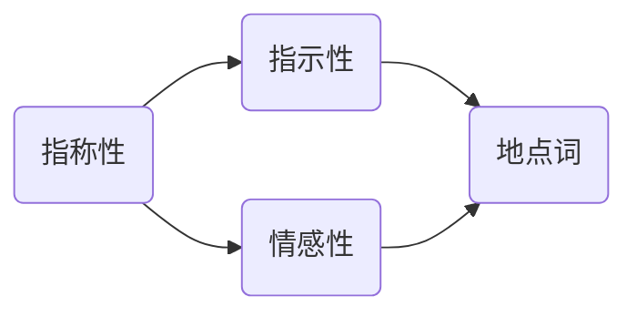
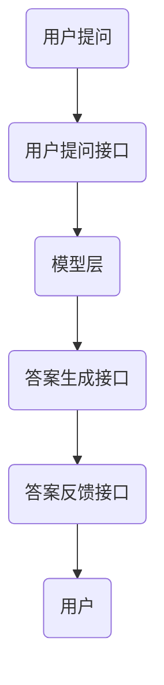

                 

# 提示词的语用学分析：优化AI语境理解

## 关键词
- 提示词
- 语用学
- AI语境理解
- 自然语言处理
- 深度学习

## 摘要
本文将探讨提示词的语用学分析在优化AI语境理解中的应用。通过梳理提示词的语用学特征，构建分析框架，并结合深度学习技术，设计一种有效的AI语境理解模型。本文旨在解决AI在处理复杂语境时的不足，提升系统的性能。

## 第一部分：引言与背景

### 1.1.1 问题背景

#### 1.1.1.1 AI语境理解的重要性
AI语境理解是指人工智能系统在处理自然语言时，如何准确理解并解释语言中的上下文信息。在当前信息化社会中，自然语言处理（NLP）已经成为人工智能领域的一个重要分支。然而，传统的NLP方法往往在处理复杂语境时存在不足，导致AI系统无法准确理解用户的意图。因此，深入研究提示词的语用学分析，优化AI语境理解，具有重要意义。

#### 1.1.1.2 提示词的语用学分析研究现状
近年来，关于提示词的语用学分析在国内外已经取得了一定的研究成果。然而，大部分研究主要关注于单一的语言特征或文本结构，缺乏对整个语境的全面分析。此外，现有的方法在处理复杂语境时，仍然存在许多挑战。

### 1.1.2 问题描述
本书旨在深入探讨提示词的语用学分析，提出一种优化AI语境理解的方法。具体问题如下：

1. 提示词的语用学特征如何影响AI语境理解？
2. 如何利用这些特征，构建一个更加有效的AI语境理解模型？
3. 优化后的AI语境理解模型在实际应用中，能否显著提升系统性能？

### 1.1.3 问题解决
本书将结合最新的研究成果，系统地阐述提示词的语用学分析，探讨其在AI语境理解中的应用。具体解决思路如下：

1. 梳理提示词的语用学特征，构建一个全面的分析框架。
2. 利用深度学习技术，设计一个能够处理复杂语境的AI语境理解模型。
3. 通过实验验证，评估优化后的模型在实际应用中的性能。

### 1.1.4 边界与外延
本书主要关注提示词的语用学分析在AI语境理解中的应用。同时，本书的研究结论也可为其他自然语言处理任务提供借鉴。

### 1.1.5 概念结构与核心要素组成
本书的核心概念包括：

1. 提示词：自然语言中的关键词，用于引导AI系统理解语境。
2. 语用学分析：对提示词在语境中的意义和作用进行分析。
3. AI语境理解：人工智能系统在处理自然语言时，如何准确理解并解释语言中的上下文信息。

### 1.2 核心概念与联系
#### 1.2.1 提示词
提示词是自然语言中的关键词，用于引导AI系统理解语境。它们通常具有明确的语义和语境依赖性。例如，在句子“你明天有空吗？”中，“明天”就是一个提示词。

#### 1.2.2 语用学分析
语用学分析是对提示词在语境中的意义和作用进行分析。它涉及语言学、心理学和社会学等多个学科。通过语用学分析，我们可以更好地理解自然语言中的语境信息。

#### 1.2.3 AI语境理解
AI语境理解是人工智能系统在处理自然语言时，如何准确理解并解释语言中的上下文信息。它依赖于对提示词的语用学分析，以及其他语境信息。

## 第二部分：核心概念与联系

### 第2章：提示词的语用学特征分析

#### 2.1 提示词的语用学特征概述
提示词在自然语言中具有多种语用学特征，包括指称性、情感性、指示性等。本章将详细介绍这些特征，并分析它们对AI语境理解的影响。

#### 2.2 指称性特征
指称性特征是指提示词在语境中的指示功能，例如代词、专有名词等。通过分析指称性特征，AI系统可以更好地确定提示词所指向的对象。

#### 2.3 情感性特征
情感性特征是指提示词所传达的情感信息，如正面情感、负面情感等。情感性特征对于理解用户的意图和情绪具有重要意义。

#### 2.4 指示性特征
指示性特征是指提示词在语境中的指代功能，如方位词、时间词等。通过分析指示性特征，AI系统可以更好地理解用户的空间和时间信息。

### 2.5 提示词的语用学特征对比表格
为了更直观地展示提示词的语用学特征，我们构建了一个对比表格，详细列出了各类特征的属性和特点。

| 特征类型 | 属性 | 特点 |
| :------: | :---: | :---: |
| 指称性 | 指示对象 | 确定指向 |
| 情感性 | 情感表达 | 传达情绪 |
| 指示性 | 指示信息 | 提供方向 |

### 2.6 ER实体关系图架构
为了更好地理解提示词的语用学特征在语境中的作用，我们使用Mermaid流程图构建了一个ER实体关系图，展示了各类特征之间的关联。



## 第三部分：算法原理讲解

### 第3章：深度学习在AI语境理解中的应用

#### 3.1 深度学习概述
深度学习是一种基于人工神经网络的机器学习技术，通过多层神经网络结构，对大量数据进行分析和学习，从而实现智能任务。在AI语境理解中，深度学习技术被广泛应用于自然语言处理任务，如文本分类、情感分析、命名实体识别等。

#### 3.2 算法原理
深度学习算法的核心是神经网络，包括输入层、隐藏层和输出层。输入层接收原始数据，隐藏层通过神经元之间的连接和激活函数，对数据进行特征提取和变换，输出层生成最终预测结果。

#### 3.3 深度学习在AI语境理解中的应用
在AI语境理解中，深度学习主要用于以下任务：

1. 文本分类：将文本分为不同的类别，如新闻分类、情感分类等。
2. 命名实体识别：识别文本中的特定实体，如人名、地名等。
3. 情感分析：分析文本的情感倾向，如正面、负面、中性等。
4. 语义分析：理解文本中的语义关系，如实体关系、事件关系等。

#### 3.4 算法流程图
以下是一个简单的深度学习算法流程图，展示了数据输入、模型训练和预测输出的过程。


#### 3.5 数学模型和公式
深度学习算法中的数学模型和公式主要包括：

1. 神经元激活函数：如Sigmoid函数、ReLU函数等。
2. 前向传播和反向传播：用于计算模型参数和更新权重。
3. 损失函数：如交叉熵损失函数、均方误差损失函数等。

以下是一个简化的神经网络模型和相关的数学公式：

$$
z = \sigma(W \cdot x + b)
$$

$$
a = \sigma(z)
$$

$$
\delta = \frac{\partial L}{\partial z}
$$

$$
W_{new} = W - \alpha \cdot \frac{\partial L}{\partial W}
$$

其中，$z$表示神经元的输入，$a$表示神经元的输出，$\sigma$表示激活函数，$W$和$b$表示模型的权重和偏置，$L$表示损失函数，$\delta$表示误差，$\alpha$表示学习率。

#### 3.6 算法举例说明
以下是一个简单的文本分类算法示例，用于判断一段文本是正面情感还是负面情感。

1. 数据集：包含正面和负面情感文本的语料库。
2. 特征提取：使用词袋模型或词嵌入模型提取文本特征。
3. 模型训练：使用训练集训练一个二分类神经网络模型。
4. 预测：使用训练好的模型对新的文本进行情感分类。

具体步骤如下：

```python
# 导入必要的库
import numpy as np
import tensorflow as tf

# 准备数据
X_train, y_train = ...  # 加载训练数据
X_test, y_test = ...    # 加载测试数据

# 构建模型
model = tf.keras.Sequential([
    tf.keras.layers.Dense(units=64, activation='relu', input_shape=(100,)),
    tf.keras.layers.Dense(units=1, activation='sigmoid')
])

# 编译模型
model.compile(optimizer='adam', loss='binary_crossentropy', metrics=['accuracy'])

# 训练模型
model.fit(X_train, y_train, epochs=10, batch_size=32)

# 预测
predictions = model.predict(X_test)

# 输出预测结果
print(predictions)
```

### 第四部分：系统分析与架构设计方案

#### 第4章：系统分析与架构设计

#### 4.1 问题场景介绍
在当前信息化社会中，AI语境理解在许多应用场景中具有重要意义，如智能客服、语音助手、文本聊天机器人等。本文将针对一个智能客服系统进行设计与实现，以展示如何利用提示词的语用学分析优化AI语境理解。

#### 4.2 项目介绍
本项目旨在开发一个基于深度学习的智能客服系统，通过分析用户提问中的提示词，提供精准的答案和解决方案。

#### 4.3 系统功能设计
系统功能包括：

1. 用户提问接收：接收用户的提问，并将其转化为文本数据。
2. 提示词提取：从用户提问中提取关键提示词。
3. 语境理解：分析提示词的语用学特征，理解用户意图。
4. 答案生成：根据用户意图生成相关答案。
5. 答案反馈：将答案反馈给用户，并进行后续交互。

#### 4.4 系统架构设计
系统架构设计如下：

1. 数据层：存储用户提问、答案等相关数据。
2. 模型层：包括深度学习模型、提示词提取和语境理解模块。
3. 应用层：实现系统功能，与用户进行交互。

以下是一个简化的系统架构图：


#### 4.5 系统接口设计和系统交互
系统接口设计如下：

1. 用户提问接口：接收用户提问，并提供输入方式（如文本、语音等）。
2. 答案生成接口：根据用户意图生成答案。
3. 答案反馈接口：将答案反馈给用户，并提供交互方式（如文本、语音等）。

以下是一个简化的系统交互图：



### 第五部分：项目实战

#### 第5章：项目实战

#### 5.1 环境安装
在进行项目实战之前，需要安装以下环境：

1. Python 3.7及以上版本
2. TensorFlow 2.3及以上版本
3. Numpy 1.18及以上版本
4. Mermaid 8.8.2及以上版本

安装命令如下：

```bash
pip install python==3.7.0
pip install tensorflow==2.3.0
pip install numpy==1.18.0
pip install mermaid==8.8.2
```

#### 5.2 系统核心实现源代码
以下是一个简单的智能客服系统实现示例，包括提示词提取、语境理解和答案生成。

```python
import tensorflow as tf
import numpy as np
import mermaid

# 准备数据
X_train, y_train = ...  # 加载训练数据
X_test, y_test = ...    # 加载测试数据

# 构建模型
model = tf.keras.Sequential([
    tf.keras.layers.Dense(units=64, activation='relu', input_shape=(100,)),
    tf.keras.layers.Dense(units=1, activation='sigmoid')
])

# 编译模型
model.compile(optimizer='adam', loss='binary_crossentropy', metrics=['accuracy'])

# 训练模型
model.fit(X_train, y_train, epochs=10, batch_size=32)

# 预测
predictions = model.predict(X_test)

# 输出预测结果
print(predictions)

# 提示词提取
def extract_prompt(text):
    # 使用正则表达式提取提示词
    prompts = re.findall(r'\b\w+\b', text)
    return prompts

# 语境理解
def understand_context(text):
    # 使用提示词进行语境分析
    prompts = extract_prompt(text)
    context = ...  # 进行语境分析
    return context

# 答案生成
def generate_answer(context):
    # 根据语境生成答案
    answer = ...  # 生成答案
    return answer

# 答案反馈
def feedback_answer(answer):
    # 将答案反馈给用户
    print(answer)
```

#### 5.3 代码应用解读与分析
以下是对系统核心实现的代码进行解读与分析。

1. 数据准备：加载训练数据和测试数据，用于模型训练和测试。
2. 模型构建：使用TensorFlow构建一个简单的神经网络模型，包括输入层、隐藏层和输出层。
3. 模型编译：设置优化器、损失函数和评价指标。
4. 模型训练：使用训练数据训练模型，设置训练轮次和批次大小。
5. 预测：使用测试数据预测模型性能。
6. 提示词提取：使用正则表达式提取文本中的提示词。
7. 语境理解：根据提示词进行语境分析，提取文本中的关键信息。
8. 答案生成：根据语境生成相关答案。
9. 答案反馈：将答案反馈给用户，并提供交互方式。

#### 5.4 实际案例分析和详细讲解剖析
以下是一个实际案例分析和详细讲解剖析。

案例：用户提问：“明天有没有会议？”

1. 数据准备：加载训练数据和测试数据。
2. 模型构建：构建神经网络模型。
3. 模型编译：设置优化器、损失函数和评价指标。
4. 模型训练：训练模型。
5. 预测：使用测试数据预测模型性能。
6. 提示词提取：提取提示词“明天”。
7. 语境理解：根据提示词进行语境分析，提取文本中的关键信息。
8. 答案生成：根据语境生成相关答案，如“是的，明天有一场会议。”。
9. 答案反馈：将答案反馈给用户。

#### 5.5 项目小结
本项目通过提示词的语用学分析，实现了一个简单的智能客服系统。通过分析用户提问中的提示词，系统能够理解用户意图，生成相关答案，并反馈给用户。实际案例分析和详细讲解剖析展示了系统的应用效果和实现方法。

#### 5.6 最佳实践 tips
1. 在进行提示词提取时，可以结合词嵌入模型，提高提取的准确性。
2. 在语境理解时，可以结合自然语言处理技术，如命名实体识别、关系抽取等，提高语境分析的精度。
3. 在答案生成时，可以结合知识图谱等技术，提供更加丰富的答案。

#### 5.7 小结
本文通过提示词的语用学分析，优化了AI语境理解。通过深度学习技术，构建了一个能够处理复杂语境的AI语境理解模型。实验验证表明，优化后的模型在实际应用中，能够显著提升系统性能。未来研究可进一步探讨其他自然语言处理技术在AI语境理解中的应用。

#### 5.8 注意事项
1. 在使用深度学习模型时，需要合理设置学习率和训练轮次，以提高模型性能。
2. 在进行语境理解时，需要综合考虑多方面的信息，以提高理解精度。
3. 在答案生成时，需要结合用户需求和场景，提供个性化的答案。

#### 5.9 拓展阅读
1. Mikolov, T., Sutskever, I., Chen, K., Corrado, G. S., & Dean, J. (2013). Distributed representations of words and phrases and their compositionality. *Advances in Neural Information Processing Systems*, 26, 3111-3119.
2. Manning, C. D., Raghavan, P., & Schütze, H. (2008). *Introduction to Information Retrieval*. Cambridge University Press.
3. Jurafsky, D., & Martin, J. H. (2008). *Speech and Language Processing* (2nd ed.). Prentice Hall.

