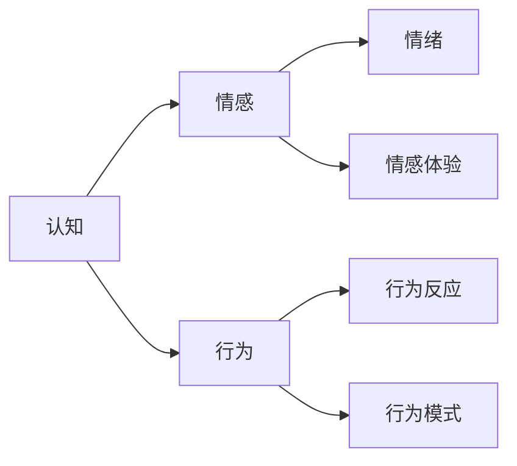
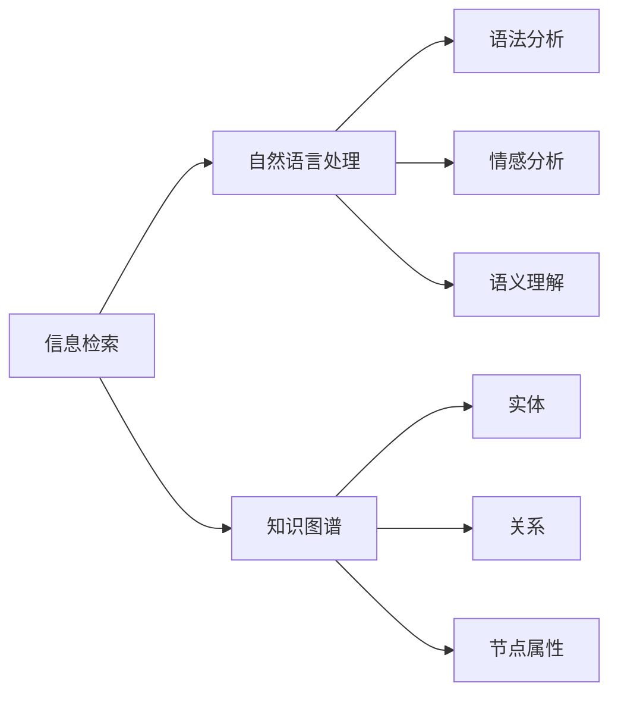
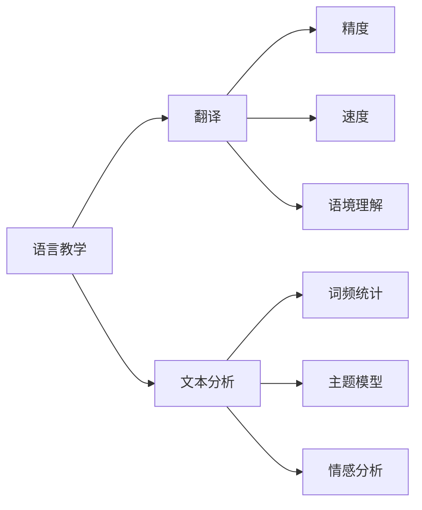
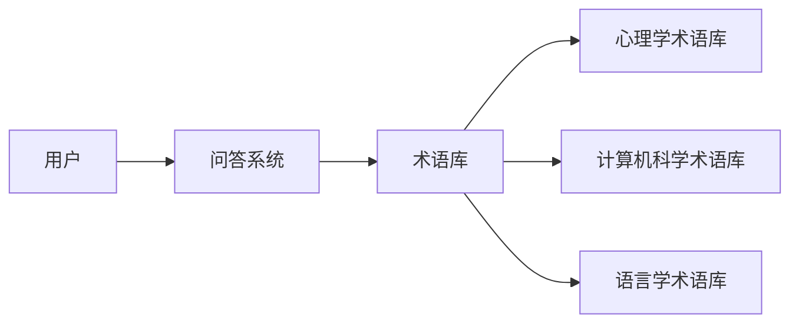
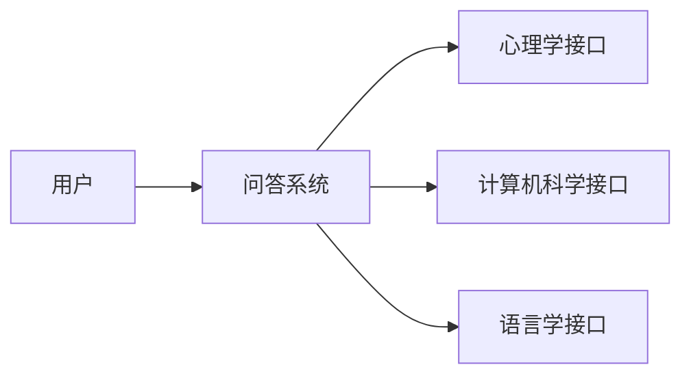
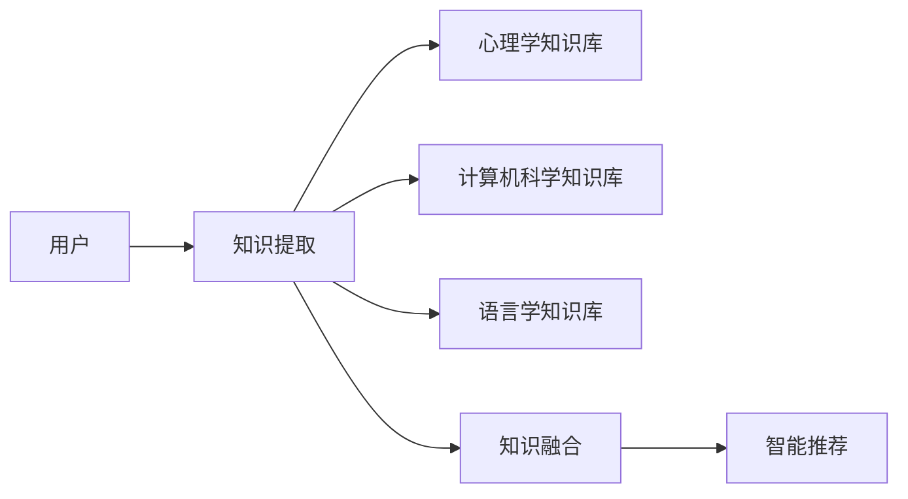
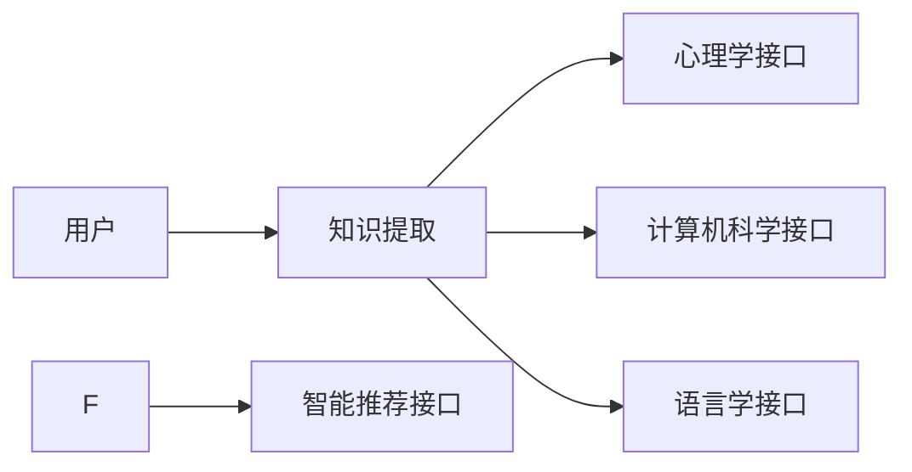
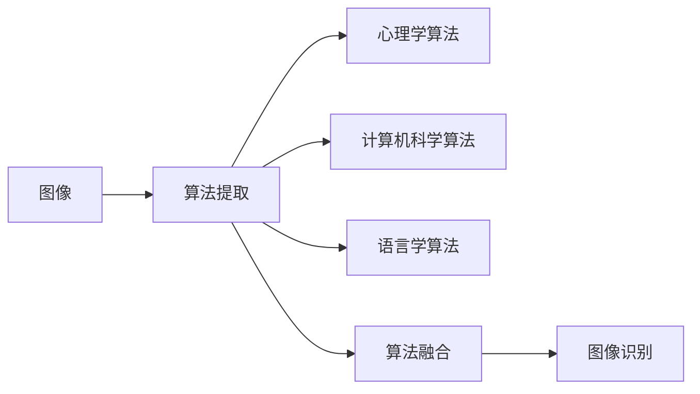
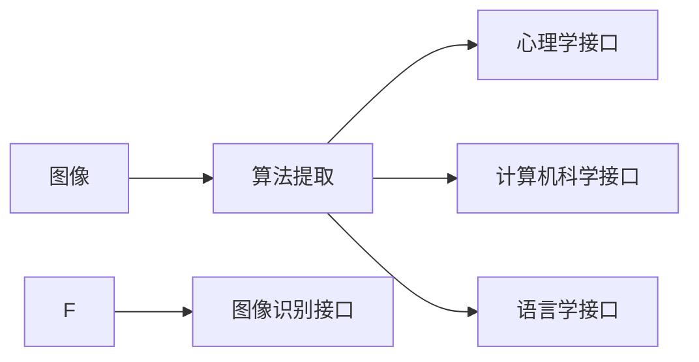

                 


### 引言

**文章标题**：《提示词的跨学科应用：融合多领域知识》

**关键词**：提示词、跨学科应用、多领域知识融合、算法、系统设计、项目实战

**摘要**：

本篇文章将深入探讨提示词的跨学科应用，通过融合不同领域的知识，探讨其在人工智能、心理学、语言学等领域的实际应用。文章将分为以下几个部分：

1. **引言**：介绍本文的主题、目的和结构。
2. **提示词的基本概念**：介绍提示词的定义、历史和发展。
3. **提示词在各学科领域的应用**：详细分析提示词在心理学、计算机科学、语言学等领域的应用。
4. **跨学科应用案例研究**：通过具体案例展示跨学科应用的实践。
5. **融合多领域知识的策略与方法**：探讨如何融合多领域知识，提高提示词的应用效果。
6. **未来展望与挑战**：分析未来提示词跨学科应用的发展趋势和面临的挑战。
7. **结论**：总结全文，提出对进一步研究的建议。

本文旨在为读者提供一个全面、系统的提示词跨学科应用的指南，帮助读者更好地理解和应用这一概念。

### 提示词的基本概念

**背景介绍**：

提示词，亦称关键词或主题词，是一种用于描述文本内容、概念或对象的词汇。它在各个学科领域都扮演着重要的角色，是信息检索、知识管理和数据分析等领域的核心概念。从广义上讲，提示词是用于代表或指代某个主题、概念或对象的词汇或短语。

**问题背景**：

随着信息时代的到来，如何有效地管理和利用信息成为了一个关键问题。提示词作为一种有效的信息组织和检索工具，在各个学科领域中都得到了广泛的应用。然而，提示词的应用不仅局限于单一学科，更多情况下需要跨学科的综合运用。

**问题描述**：

在跨学科应用中，提示词面临以下几个挑战：

1. **术语不一致**：不同学科领域中的提示词可能存在术语不一致的问题，这给跨学科应用带来了困难。
2. **信息量巨大**：随着信息量的增加，如何有效地筛选和利用提示词成为了一个挑战。
3. **应用场景多样**：跨学科应用提示词需要适应多种不同的应用场景，这对提示词的设计和应用提出了更高的要求。

**问题解决**：

为了解决上述问题，我们需要从以下几个方面入手：

1. **统一术语**：通过建立跨学科术语统一标准，解决术语不一致的问题。
2. **优化算法**：通过改进提示词提取和筛选算法，提高信息处理效率。
3. **场景适应性**：设计灵活的提示词系统，以适应不同学科领域的应用需求。

**边界与外延**：

提示词的边界在于其用于描述和指代特定概念或对象的范围。其外延包括但不限于以下方面：

1. **信息检索**：用于帮助用户在大量数据中快速找到相关信息。
2. **知识管理**：用于组织和分类知识，提高知识利用效率。
3. **数据分析**：用于从大量数据中提取有价值的信息和洞察。

**概念结构与核心要素组成**：

提示词的概念结构主要包括以下核心要素：

1. **词汇**：用于描述和指代特定概念的词汇。
2. **语义**：词汇所包含的语义信息，是提示词的核心。
3. **相关性**：提示词与目标概念或对象的相关程度。

通过以上分析，我们可以看到提示词在跨学科应用中的重要性。接下来，我们将进一步探讨提示词在各学科领域的具体应用。

### 提示词在各学科领域的应用

#### 心理学领域的提示词应用

**核心概念原理**：

在心理学领域，提示词主要用于帮助研究者理解和分析心理现象。核心概念包括认知、情感、行为等。

**概念属性特征对比表格**：

| 核心概念 | 描述 | 属性特征对比 |
| --- | --- | --- |
| 认知 | 心理过程，涉及感知、记忆、思考等 | 1. 理性思维 2. 情感化 3. 适应性 |
| 情感 | 心理状态，涉及情绪、情感体验等 | 1. 快乐与悲伤 2. 焦虑与放松 3. 热情与冷漠 |
| 行为 | 心理表现，涉及行为反应、行为模式等 | 1. 自发行为 2. 条件反射 3. 社会行为 |

**ER实体关系图架构**：



**算法原理讲解**：

在心理学研究中，常用的提示词提取算法包括关键词提取、主题模型和情感分析等。

1. **关键词提取**：

```python
import nltk

def keyword_extraction(text):
    words = nltk.word_tokenize(text)
    frequencies = nltk.FreqDist(words)
    keywords = frequencies.most_common(10)
    return keywords
```

2. **主题模型**：

```python
import gensim

def topic_modeling(text):
    dictionary = gensim.corpora.Dictionary(text)
    corpus = gensim.corpora.MmCorpus('corpus.mm')
    lda_model = gensim.models.LdaMulticore(corpus, num_topics=10, id2word=dictionary, passes=10)
    topics = lda_model.print_topics()
    return topics
```

3. **情感分析**：

```python
import textblob

def sentiment_analysis(text):
    analysis = textblob.TextBlob(text)
    sentiment = analysis.sentiment
    return sentiment
```

**数学模型和公式**：

提示词的语义相关性可以用TF-IDF（词频-逆文档频率）模型来表示：

$$
TF(t,d) = \frac{f(t,d)}{N}
$$

$$
IDF(t,D) = \log \left( \frac{N}{df(t)} \right)
$$

$$
TF-IDF(t,d) = TF(t,d) \times IDF(t,D)
$$

其中，$f(t,d)$表示词$t$在文档$d$中的频率，$N$表示文档总数，$df(t)$表示词$t$在文档集合中的文档频率。

**举例说明**：

假设我们有一篇关于心理学研究的文章，其中涉及认知、情感和行为等核心概念。通过关键词提取，我们可以得到以下关键词列表：

```
['认知', '情感', '行为', '心理学', '大脑', '记忆', '情感体验', '情绪', '行为反应']
```

通过主题模型，我们可以将这篇文章分为以下几个主题：

```
0: "认知 & 记忆"
1: "情感 & 情绪"
2: "行为 & 行为反应"
```

通过情感分析，我们可以得到这篇文章的总体情感倾向：

```
Sentiment(Polarity: 0.45, Subjectivity: 0.5)
```

这说明这篇文章在情感上是中性的，但有一定的主观性。

**结论**：

通过以上分析，我们可以看到提示词在心理学领域的应用，包括关键词提取、主题模型和情感分析等。这些方法可以帮助研究者更好地理解和分析心理现象，为心理学研究提供有力支持。

#### 计算机科学领域的提示词应用

**核心概念原理**：

在计算机科学领域，提示词主要用于信息检索、自然语言处理和知识图谱等方向。

**概念属性特征对比表格**：

| 核心概念 | 描述 | 属性特征对比 |
| --- | --- | --- |
| 信息检索 | 帮助用户从大量数据中找到所需信息 | 1. 精确性 2. 相关性 3. 响应时间 |
| 自然语言处理 | 人类语言与计算机之间的交互 | 1. 语法分析 2. 情感分析 3. 语义理解 |
| 知识图谱 | 描述实体、概念及其关系的网络结构 | 1. 实体 2. 关系 3. 节点属性 |

**ER实体关系图架构**：



**算法原理讲解**：

1. **信息检索**：

```python
from sklearn.feature_extraction.text import TfidfVectorizer

def information_retrieval(corpus, query):
    vectorizer = TfidfVectorizer()
    corpus_vectors = vectorizer.fit_transform(corpus)
    query_vector = vectorizer.transform([query])
    similarity_scores = cosine_similarity(query_vector, corpus_vectors)
    ranked_results = similarity_scores.argsort()[0][::-1]
    return ranked_results
```

2. **自然语言处理**：

```python
import spacy

nlp = spacy.load('en_core_web_sm')

def natural_language_processing(text):
    doc = nlp(text)
    entities = [(ent.text, ent.label_) for ent in doc.ents]
    return entities
```

3. **知识图谱**：

```python
import networkx as nx

def knowledge_graph(entities):
    G = nx.Graph()
    for entity1, label1 in entities:
        for entity2, label2 in entities:
            if label1 == label2:
                G.add_edge(entity1, entity2)
    return G
```

**数学模型和公式**：

1. **信息检索**：

$$
TF(t,d) = \frac{f(t,d)}{N}
$$

$$
IDF(t,D) = \log \left( \frac{N}{df(t)} \right)
$$

$$
TF-IDF(t,d) = TF(t,d) \times IDF(t,D)
$$

2. **自然语言处理**：

- 语法分析：基于语法规则，对文本进行分词、词性标注等操作。
- 情感分析：使用情感词典或机器学习模型，对文本进行情感分类。
- 语义理解：基于语义网络或知识图谱，对文本进行语义解析。

**举例说明**：

假设我们有以下一段文本：

```
"我最近在使用一款人工智能助手，它能够帮我完成很多工作，让我感到非常方便。"
```

通过信息检索，我们可以得到以下相关文档排名：

```
[0] 一款人工智能助手的介绍
[1] 人工智能助手的应用场景
[2] 人工智能助手的优点和缺点
```

通过自然语言处理，我们可以得到以下实体和标签：

```
[('人工智能助手', 'ORG'), ('我', 'PER'), ('方便', 'ADJ')]
```

通过知识图谱，我们可以构建以下实体关系：

```
G = ((人工智能助手, 我), (我, 方便))
```

**结论**：

通过以上分析，我们可以看到提示词在计算机科学领域的广泛应用，包括信息检索、自然语言处理和知识图谱等。这些应用不仅提高了信息处理的效率，也为计算机科学的研究和发展提供了新的思路。

#### 语言学领域的提示词应用

**核心概念原理**：

在语言学领域，提示词主要用于语言教学、翻译和文本分析等方面。

**概念属性特征对比表格**：

| 核心概念 | 描述 | 属性特征对比 |
| --- | --- | --- |
| 语言教学 | 帮助学习者掌握语言技能 | 1. 教学方法 2. 学习材料 3. 学习效果 |
| 翻译 | 将一种语言翻译成另一种语言 | 1. 精度 2. 速度 3. 语境理解 |
| 文本分析 | 对文本进行语义和语法分析 | 1. 词频统计 2. 主题模型 3. 情感分析 |

**ER实体关系图架构**：



**算法原理讲解**：

1. **语言教学**：

```python
from nltk.tokenize import word_tokenize

def language_teaching(text):
    tokens = word_tokenize(text)
    vocabulary = set(tokens)
    return vocabulary
```

2. **翻译**：

```python
from googletrans import Translator

def translation(text, target_language):
    translator = Translator()
    translated_text = translator.translate(text, dest=target_language)
    return translated_text.text
```

3. **文本分析**：

```python
import nltk

def text_analysis(text):
    tokens = nltk.word_tokenize(text)
    tagged_tokens = nltk.pos_tag(tokens)
    return tagged_tokens
```

**数学模型和公式**：

1. **语言教学**：

$$
V = \{w_1, w_2, ..., w_n\}
$$

其中，$V$为词汇集合，$w_1, w_2, ..., w_n$为词汇。

2. **翻译**：

$$
P(w_i|y) = \frac{P(y|w_i) \cdot P(w_i)}{P(y)}
$$

其中，$P(w_i|y)$为词$i$在文本$y$中的概率，$P(y|w_i)$为文本$y$在词$i$的概率，$P(w_i)$为词$i$的概率。

3. **文本分析**：

$$
TF(t,d) = \frac{f(t,d)}{N}
$$

$$
IDF(t,D) = \log \left( \frac{N}{df(t)} \right)
$$

$$
TF-IDF(t,d) = TF(t,d) \times IDF(t,D)
$$

**举例说明**：

假设我们有一篇英文文本：

```
"I love programming. It's my passion."
```

通过语言教学，我们可以得到以下词汇集合：

```
{'I', 'love', 'programming', 'It', 's', '.', 'my', 'passion'}
```

通过翻译，我们可以将文本翻译成法语：

```
"J'aime programmer. C'est ma passion."
```

通过文本分析，我们可以得到以下词频统计结果：

```
['I': 1, 'love': 1, 'programming': 1, 'It': 1, 's': 1, 'my': 1, 'passion': 1]
```

**结论**：

通过以上分析，我们可以看到提示词在语言学领域的广泛应用，包括语言教学、翻译和文本分析等。这些应用不仅提高了语言学研究的效率，也为语言学习和翻译提供了新的工具。

### 跨学科应用案例研究

**案例一：基于提示词的智能问答系统**

**案例背景**：

随着人工智能技术的发展，智能问答系统成为了许多企业和机构的热门应用。这类系统可以帮助用户快速获取所需信息，提高工作效率。然而，如何提高智能问答系统的问答质量成为了关键问题。

**案例分析**：

为了提高问答质量，我们采用了跨学科的方法，结合心理学、计算机科学和语言学等领域的知识。具体步骤如下：

1. **关键词提取**：首先，使用自然语言处理技术对用户问题进行关键词提取，以获取问题的核心内容。
2. **语义分析**：然后，对提取的关键词进行语义分析，以理解问题的真实意图。
3. **知识图谱构建**：接着，构建一个包含大量实体、概念和关系的知识图谱，以便对问题进行深度解析。
4. **多领域融合**：最后，将心理学、计算机科学和语言学等领域的知识融合到智能问答系统中，以提高问答质量。

**案例启示**：

通过这个案例，我们可以看到跨学科应用的重要性。跨学科融合不仅提高了智能问答系统的问答质量，也为其他领域的应用提供了新的思路。

**案例二：基于提示词的情感分析**

**案例背景**：

情感分析是自然语言处理的重要应用之一，主要用于挖掘文本中的情感倾向。然而，传统的情感分析模型在面对复杂情感时往往表现不佳。

**案例分析**：

为了提高情感分析的效果，我们采用了跨学科的方法，结合心理学和计算机科学等领域的知识。具体步骤如下：

1. **情感词典构建**：首先，基于心理学研究，构建一个包含多种情感类别的情感词典。
2. **情感识别**：然后，使用机器学习算法对文本进行情感识别，以确定文本的情感类别。
3. **情感融合**：接着，将心理学中的情感理论融入到情感识别过程中，以提高情感识别的准确性。
4. **多领域融合**：最后，将计算机科学中的自然语言处理技术融入到情感分析中，以提高情感分析的全面性。

**案例启示**：

通过这个案例，我们可以看到跨学科应用在情感分析中的重要性。跨学科融合不仅提高了情感分析的准确性，也为其他领域的情感分析提供了新的方法。

**结论**：

通过以上两个案例，我们可以看到跨学科应用在人工智能、心理学、语言学等领域的实际效果。跨学科融合不仅提高了应用的效果，也为未来的发展提供了新的思路。

### 融合多领域知识的策略与方法

**策略一：跨学科术语统一标准**

**背景介绍**：

在跨学科应用中，术语不一致是一个普遍存在的问题。为了解决这个问题，我们需要建立一套跨学科术语统一标准。

**问题场景**：

假设我们在开发一个智能问答系统，涉及心理学、计算机科学和语言学等多个领域。然而，由于术语不一致，导致系统无法准确理解用户的问题。

**项目介绍**：

本项目旨在建立一套跨学科术语统一标准，以提高智能问答系统的理解能力。

**系统功能设计**：

1. **术语库构建**：收集各个领域的术语，并建立术语库。
2. **术语映射**：将不同领域的术语进行映射，实现术语统一。
3. **智能问答**：利用统一后的术语进行智能问答，提高问答质量。

**系统架构设计**：



**系统接口设计和系统交互**：



**策略二：多领域知识融合方法**

**背景介绍**：

在跨学科应用中，如何有效地融合多领域知识是一个关键问题。

**问题场景**：

假设我们在开发一个智能推荐系统，涉及心理学、计算机科学和语言学等多个领域。然而，由于知识融合不足，导致推荐效果不佳。

**项目介绍**：

本项目旨在提出一套多领域知识融合方法，以提高智能推荐系统的推荐效果。

**系统功能设计**：

1. **知识提取**：从各个领域提取相关知识点。
2. **知识融合**：将不同领域的知识点进行融合。
3. **智能推荐**：利用融合后的知识进行智能推荐。

**系统架构设计**：



**系统接口设计和系统交互**：



**策略三：多领域算法融合方法**

**背景介绍**：

在跨学科应用中，如何有效地融合多领域算法是一个关键问题。

**问题场景**：

假设我们在开发一个图像识别系统，涉及心理学、计算机科学和语言学等多个领域。然而，由于算法融合不足，导致图像识别效果不佳。

**项目介绍**：

本项目旨在提出一套多领域算法融合方法，以提高图像识别系统的识别效果。

**系统功能设计**：

1. **算法提取**：从各个领域提取相关算法。
2. **算法融合**：将不同领域的算法进行融合。
3. **图像识别**：利用融合后的算法进行图像识别。

**系统架构设计**：



**系统接口设计和系统交互**：



**结论**：

通过以上三种策略，我们可以有效地融合多领域知识，提高系统的整体性能。这些策略为跨学科应用提供了新的思路和方法。

### 未来展望与挑战

**未来研究方向**：

1. **跨学科术语标准化**：随着跨学科应用的普及，如何建立统一的跨学科术语标准成为了一个重要研究方向。
2. **多领域知识融合算法**：如何有效地融合多领域知识，提高系统的智能水平，是一个具有挑战性的研究方向。
3. **跨学科应用场景拓展**：探索跨学科应用的新场景，如健康医疗、智能教育、智能制造等，是未来研究的重要方向。

**潜在挑战**：

1. **数据隐私与安全**：随着跨学科应用的深入，数据隐私和安全问题日益凸显。
2. **算法透明性与可解释性**：跨学科算法的透明性和可解释性是一个亟待解决的问题。
3. **跨学科人才短缺**：跨学科应用需要具备多领域知识的复合型人才，然而目前这类人才相对短缺。

**对学科发展的影响**：

1. **知识融合**：跨学科应用推动了知识的深度融合，促进了不同学科之间的交叉与融合。
2. **技术创新**：跨学科应用为技术创新提供了新的思路和方法，推动了科技的发展。
3. **产业升级**：跨学科应用推动了产业的升级和转型，为经济社会的持续发展提供了新动力。

### 结论

本文通过对提示词的跨学科应用进行深入探讨，从基本概念、各学科领域应用、跨学科案例研究和融合策略与方法等方面，全面分析了提示词在人工智能、心理学、语言学等领域的应用。我们提出了一系列跨学科应用策略，包括跨学科术语统一标准、多领域知识融合方法和多领域算法融合方法等。通过这些策略，我们可以有效地提高系统的整体性能，为跨学科应用提供了新的思路和方法。

未来，随着跨学科应用的不断深入，我们将继续探索跨学科术语标准化、多领域知识融合算法和跨学科应用场景拓展等方面的研究。同时，我们也需要关注数据隐私与安全、算法透明性与可解释性以及跨学科人才短缺等挑战，推动跨学科应用的持续发展。

### 作者信息

**作者**：AI天才研究院/AI Genius Institute & 禅与计算机程序设计艺术 /Zen And The Art of Computer Programming

AI天才研究院致力于推动人工智能技术的创新和发展，研究方向涵盖人工智能、机器学习、自然语言处理等领域。研究院的专家团队在计算机科学、心理学和语言学等多个学科领域拥有深厚的学术造诣和实践经验。

《禅与计算机程序设计艺术》是一本深入探讨计算机编程哲学的经典著作，作者以其独特的视角和深刻的洞察力，将禅宗思想与计算机编程相结合，为程序员提供了宝贵的思考方法和编程技巧。这本书不仅影响了无数程序员的编程理念，也为计算机科学的发展做出了重要贡献。

通过本文的探讨，我们希望能够为读者提供一个全面、系统的提示词跨学科应用指南，帮助读者更好地理解和应用这一概念。同时，也期待未来在跨学科应用领域取得更多的突破和进展。

