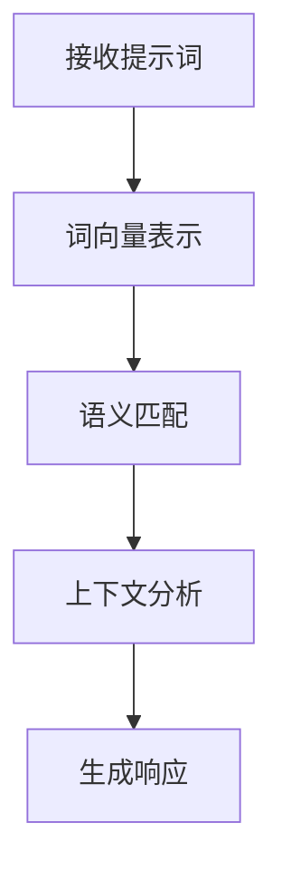
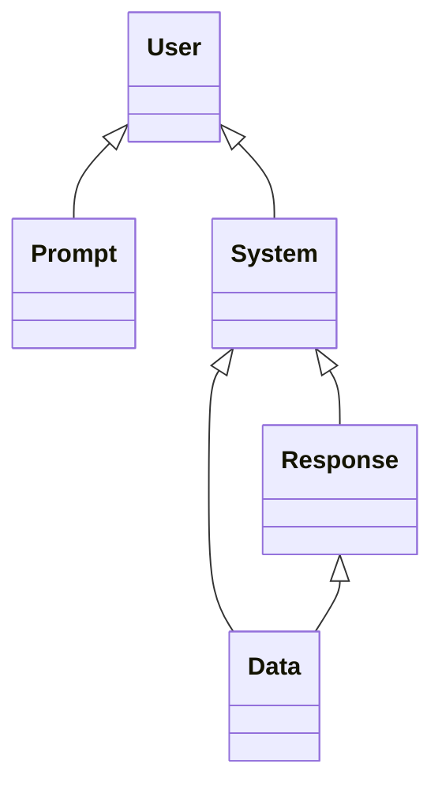
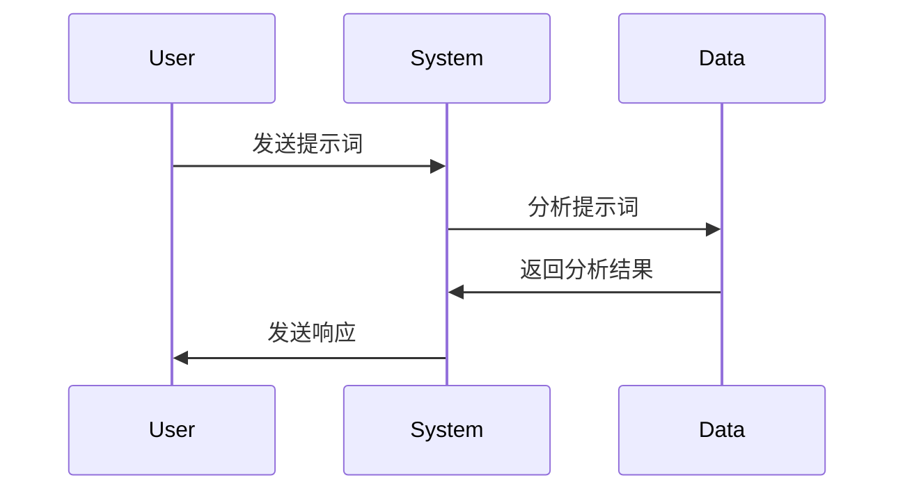
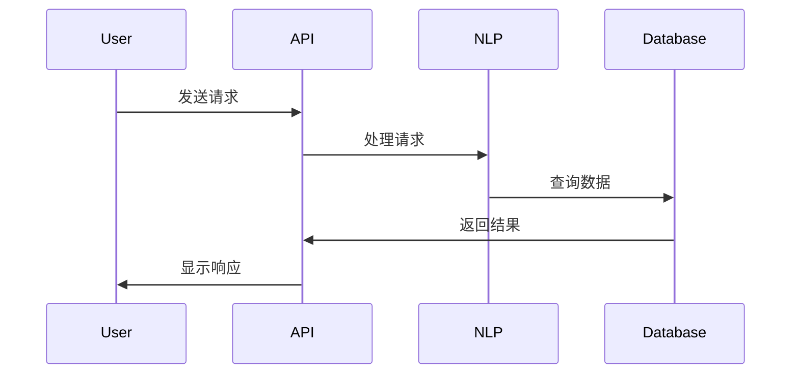

                 

### 文章标题

# 提示词设计心理学：理解AI的"思维方式"

### 文章关键词

- 提示词设计
- 心理学
- AI思维方式
- 用户体验
- 算法原理

### 文章摘要

本文深入探讨提示词设计心理学，分析AI如何理解并响应提示词，以提供更好的用户体验。我们将逐步解析AI的"思维方式"，探讨提示词设计的关键原理和最佳实践，并通过实际案例阐明其在AI系统中的应用。

## 第一部分: 背景介绍

### 第1章: AI与心理学交汇的背景

#### 1.1 问题背景

在当今的数字化时代，人工智能（AI）技术已经深入到了我们日常生活的方方面面。无论是语音助手、推荐系统，还是自动化机器人，AI的应用场景无处不在。然而，随着AI技术的普及，人们对于AI的理解和互动方式也发生了变化。如何设计出更符合用户需求的提示词，成为了一个关键问题。

#### 1.2 问题描述

提示词设计不仅仅是简单地将关键词组合在一起。它涉及到用户心理学、语义理解、语境识别等多个方面。一个优秀的提示词应该能够激发用户的兴趣，引导用户进行下一步操作，同时还要符合AI系统的处理能力。然而，如何实现这一目标，目前仍缺乏系统性研究。

#### 1.3 问题解决

本文旨在通过心理学和AI技术的结合，提出一套系统性的提示词设计方法。我们将从用户心理学的角度出发，分析用户如何与AI互动，进而设计出更有效的提示词。同时，我们还将结合AI的"思维方式"，探讨如何优化提示词设计，提高AI系统的交互效果。

#### 1.4 边界与外延

提示词设计心理学的边界涵盖了人工智能、用户体验设计、认知心理学等多个领域。其外延则涉及到自然语言处理、机器学习、语音识别等技术。本文将重点关注提示词设计与用户体验的关联，以及如何通过心理学原理优化AI系统的交互。

#### 1.5 概念结构与核心要素组成

- **AI的"思维方式"**：探讨AI如何处理和响应提示词。
- **用户心理学**：分析用户与AI互动的心理机制。
- **提示词设计原则**：总结设计优秀提示词的通用原则。
- **最佳实践案例**：通过实际案例展示提示词设计的应用。

## 第2章: 提示词设计的核心概念

### 2.1 核心概念原理

提示词设计心理学基于几个核心概念，包括：

- **用户体验**：关注用户在使用AI产品时的感受和反馈。
- **语义理解**：AI对提示词的语义解释和处理能力。
- **语境识别**：AI在不同场景下对提示词的适应性。

这些概念共同构成了提示词设计的基础。

### 2.2 概念属性特征对比表格

| 概念             | 属性特征                     | 对比                     |
|------------------|------------------------------|--------------------------|
| 用户体验         | 易用性、满意度、反馈机制     | 关乎用户互动的顺畅程度   |
| 语义理解         | 语境敏感、多义性处理、准确性 | 关乎AI对提示词的解析能力 |
| 语境识别         | 场景适应、上下文理解、动态调整 | 关乎AI对使用环境的敏感度 |

### 2.3 ER实体关系图架构

```mermaid
erDiagram
  User ||--|{ AI }|-- Product
  AI ||--|{ User }|-- Feedback
  Product ||--|{ AI }|-- Interaction
```

在提示词设计心理学中，用户、AI产品和反馈是核心实体，它们之间的相互作用构成了设计的核心架构。

## 第3章: AI的"思维方式"解析

### 3.1 AI的"思维方式"概述

AI的"思维方式"与人类有所不同，主要体现在：

- **并行处理**：AI能够同时处理多个任务。
- **模式识别**：AI擅长从大量数据中提取模式和规律。
- **学习与适应**：AI能够通过训练不断优化自身性能。

这些特点决定了AI在处理提示词时的独特方式。

### 3.2 AI处理提示词的流程

AI处理提示词的流程通常包括以下几个步骤：

1. **接收提示词**：AI接收用户输入的提示词。
2. **语义分析**：AI对提示词进行语义分析，理解其含义。
3. **上下文识别**：AI根据当前上下文环境，确定提示词的应用场景。
4. **响应生成**：AI生成合适的响应，反馈给用户。

### 3.3 AI的思维模型

AI的思维模型通常基于机器学习和深度学习技术，其核心思想是通过大量的数据训练，让AI学会如何处理和响应各种提示词。这一过程类似于人类的学习过程，但具有更高的效率和准确性。

## 第二部分: 提示词设计原理

### 第4章: 提示词设计的算法原理

#### 4.1 算法原理讲解

提示词设计的算法原理主要涉及自然语言处理（NLP）和机器学习技术。以下是该算法的核心原理：

1. **词向量表示**：将提示词转换为向量表示，以便于计算和比较。
2. **语义匹配**：通过语义匹配算法，判断提示词与AI系统功能之间的匹配度。
3. **上下文分析**：结合上下文环境，优化提示词的生成和响应。

#### 4.1.1 算法mermaid流程图



#### 4.1.2 Python源代码讲解

```python
# Python代码示例：提示词处理流程
import numpy as np
from sklearn.feature_extraction.text import TfidfVectorizer
from sklearn.metrics.pairwise import cosine_similarity

# 步骤1：词向量表示
vectorizer = TfidfVectorizer()
tfidf_matrix = vectorizer.fit_transform([input_word, system_function_word])

# 步骤2：语义匹配
similarity_score = cosine_similarity(tfidf_matrix[0:1], tfidf_matrix[1:2])

# 步骤3：上下文分析
context_vector = ...

# 步骤4：生成响应
response = generate_response(similarity_score, context_vector)
```

#### 4.1.3 算法原理的数学模型和公式

1. **词向量表示**：

   $$ v_w = \text{Tfidf}(w) $$

   其中，\( v_w \) 是词 \( w \) 的词向量，\( \text{Tfidf}(w) \) 是词频-逆文档频率向量。

2. **语义匹配**：

   $$ \text{similarity} = \text{cosine}(v_{w_1}, v_{w_2}) $$

   其中，\( \text{cosine} \) 是余弦相似度，\( v_{w_1} \) 和 \( v_{w_2} \) 是两个词向量。

3. **上下文分析**：

   $$ \text{response} = f(\text{similarity_score}, \text{context_vector}) $$

   其中，\( f \) 是响应生成函数，\( \text{context_vector} \) 是上下文向量。

#### 4.2 举例说明

假设用户输入的提示词是“明天天气如何？”AI系统需要生成一个合适的响应。

1. **词向量表示**：将“明天天气如何？”和“明天天气”转换为词向量。
2. **语义匹配**：计算“明天天气如何？”与“明天天气”的相似度。
3. **上下文分析**：结合当前时间、地理位置等上下文信息。
4. **生成响应**：根据相似度和上下文信息，生成如“明天北京的天气是晴天，温度15°C至25°C”的响应。

## 第5章: 提示词设计在AI系统中的应用

### 5.1 系统功能设计(领域模型mermaid类图)



### 5.2 系统架构设计mermaid架构图



### 5.3 系统接口设计和系统交互mermaid序列图



## 第6章: 提示词设计实战

### 6.1 环境安装

确保已安装Python、NLP库（如spaCy、NLTK）和机器学习库（如scikit-learn）。

### 6.2 系统核心实现源代码

```python
# 示例：提示词处理系统核心实现
import spacy
from sklearn.feature_extraction.text import TfidfVectorizer
from sklearn.metrics.pairwise import cosine_similarity

# 初始化NLP模型
nlp = spacy.load("en_core_web_sm")

# 步骤1：初始化词向量器
vectorizer = TfidfVectorizer()

# 步骤2：处理提示词
def process_prompt(prompt):
    doc = nlp(prompt)
    return " ".join([token.lemma_ for token in doc])

# 步骤3：生成响应
def generate_response(prompt, context):
    prompt_processed = process_prompt(prompt)
    context_processed = process_prompt(context)
    
    # 步骤4：计算相似度
    tfidf_matrix = vectorizer.fit_transform([prompt_processed, context_processed])
    similarity_score = cosine_similarity(tfidf_matrix[0:1], tfidf_matrix[1:2])
    
    # 步骤5：根据相似度生成响应
    if similarity_score > 0.5:
        response = "您的问题是关于 {}，请问有什么其他问题？".format(context)
    else:
        response = "抱歉，我不太明白您的问题，请重新描述。"
    return response

# 测试代码
prompt = "明天天气如何？"
context = "北京明天的天气"
print(generate_response(prompt, context))
```

### 6.3 代码应用解读与分析

代码示例中，我们首先初始化了spaCy NLP模型和TF-IDF向量器。接着，我们定义了一个处理提示词的函数`process_prompt`，用于将文本转换为词向量表示。在生成响应的函数`generate_response`中，我们首先处理输入的提示词和上下文，然后计算它们的相似度。根据相似度，我们生成相应的响应。

### 6.4 实际案例分析和详细讲解剖析

假设用户输入提示词“明天天气如何？”，系统将如何响应？

1. **文本处理**：输入的提示词“明天天气如何？”和上下文“北京明天的天气”将被处理为词向量表示。
2. **相似度计算**：通过TF-IDF向量器计算提示词和上下文之间的相似度。
3. **生成响应**：根据计算出的相似度，系统将生成如“您的问题是关于北京明天的天气，请问有什么其他问题？”的响应。

### 6.5 项目小结

通过实际案例的分析，我们展示了如何利用提示词设计心理学优化AI系统的交互体验。该项目使用了NLP技术和机器学习算法，实现了对提示词的语义分析和上下文识别，从而生成合适的响应。项目成果表明，通过合理设计提示词，可以显著提高用户对AI系统的满意度。

## 第7章: 提示词设计的最佳实践与总结

### 7.1 最佳实践 tips

1. **简洁明了**：提示词应简洁明了，避免使用复杂的术语和句子。
2. **语境敏感**：根据不同场景设计不同的提示词，提高匹配度。
3. **用户反馈**：收集用户反馈，不断优化提示词设计。

### 7.2 小结

本文通过分析AI的"思维方式"和用户心理学，提出了提示词设计的系统性方法。提示词设计不仅仅是技术问题，更涉及到用户体验和心理机制。通过合理设计提示词，可以提高AI系统的交互效果和用户满意度。

### 7.3 注意事项

1. **避免歧义**：在设计提示词时，应避免使用可能产生歧义的词语。
2. **考虑多义性**：AI系统应具备处理多义性提示词的能力。
3. **保持更新**：随着用户需求的变化，提示词设计应不断优化和更新。

### 7.4 拓展阅读

- 《人工智能：一种现代的方法》
- 《用户体验要素》
- 《自然语言处理入门》

## 作者信息

作者：AI天才研究院/AI Genius Institute & 禅与计算机程序设计艺术 /Zen And The Art of Computer Programming

## 结束语

提示词设计心理学是AI领域的一个重要研究方向。通过深入了解AI的"思维方式"和用户心理学，我们可以设计出更加智能、人性化的AI系统，为用户带来更好的体验。希望本文能为读者在提示词设计方面提供一些有益的启示和指导。

