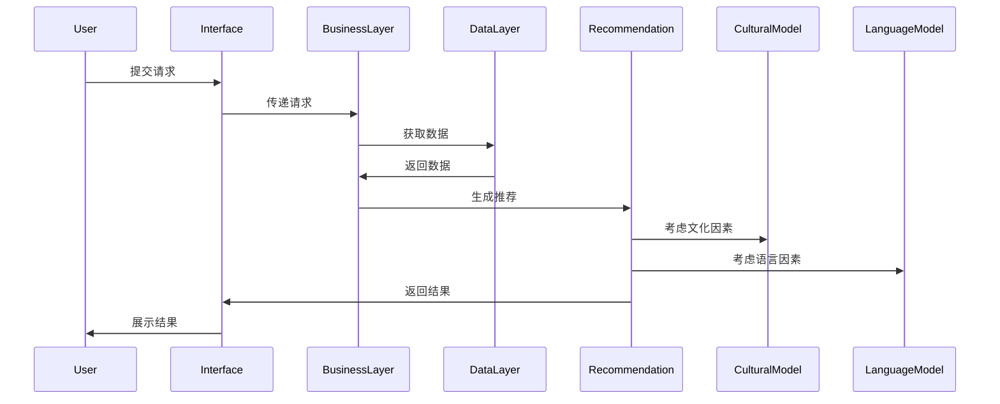
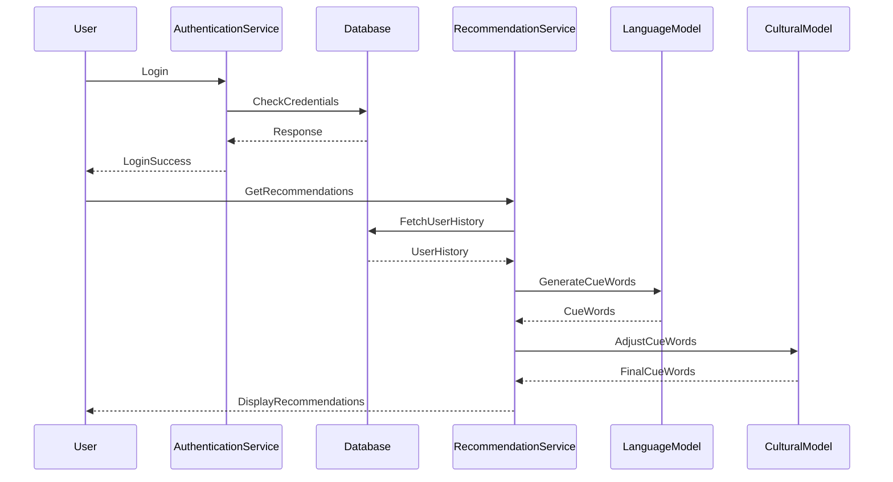

                 

### 第一部分：引言与背景

#### 第1章：问题背景与社会语言学视角

##### 1.1 问题的提出

在当今数字化和信息化的时代，语言作为人类沟通的桥梁，其重要性不言而喻。然而，随着全球化的推进和跨文化交流的日益频繁，如何设计出既符合技术需求又具备文化适应性的提示词，成为一个亟待解决的问题。提示词（Cue Word）作为一种引导用户行为或思维的工具，其设计质量直接影响到用户体验和系统的可用性。

**问题的定义与描述**：提示词设计的问题主要体现在以下几个方面：首先，不同文化背景下的用户对于相同或类似概念的认知和表达存在差异，这导致了提示词在不同文化中的适用性和有效性不同；其次，随着人工智能技术的发展，自动化提示词生成算法的应用越来越广泛，但这些算法往往缺乏对文化背景的敏感性；最后，当前的研究和实践更多关注于技术层面，而忽视了社会语言学视角下的文化适应性问题。

**社会语言学的研究背景**：社会语言学（Sociolinguistics）是研究语言在社会中的使用及其与社会因素的相互关系的学科。它关注语言的社会属性，探讨语言在不同社会群体中的使用差异、语言与权力、语言变异等现象。随着社会语言学研究的深入，其理论和方法逐渐被应用于各个领域，包括语言教育、跨文化交流、人机交互等。

**设计提示词的必要性与重要性**：在信息技术和人工智能领域，提示词的设计不仅需要考虑技术层面的可行性，还需要考虑用户的文化背景和认知习惯。设计符合文化适应性的提示词，有助于提升系统的易用性和用户体验，增强跨文化交流的效率和效果。因此，从社会语言学视角研究提示词设计，具有重要的理论和实践价值。

##### 1.2 社会语言学的定义与核心概念

**社会语言学的概念边界与外延**：社会语言学是语言学的一个分支，主要研究语言在社会中的使用，包括语言变异、语言与社会阶层、语言与性别、语言与权力、语言政策与规划等方面。它关注语言的社会属性，强调语言的使用是与社会情境、文化背景和个体身份等密切相关的。

**核心概念与术语解释**：

1. **语言变异**：指语言在发音、语法、词汇等方面的变化，这些变化通常与地域、社会阶层、性别等因素相关。
2. **语言与社会阶层**：探讨语言在社会阶层分化中的作用，如语言使用与职业、教育、收入等方面的关联。
3. **语言与性别**：研究性别如何影响语言的使用，包括词汇选择、语法结构等。
4. **语言与权力**：探讨语言在权力关系中的角色，如语言霸权、语言歧视等问题。
5. **语言政策与规划**：研究政府如何制定和实施语言政策，以促进社会稳定和经济发展。

**社会语言学的基本原理**：

1. **语言与社会情境的关系**：语言的使用是社会情境的反映，不同的社会情境要求使用不同的语言形式和内容。
2. **语言的功能性**：语言不仅仅是一种沟通工具，还具有表达身份、维护关系、传递信息等多种功能。
3. **语言变异的多样性**：语言变异是语言多样性的体现，反映了社会的多元性和复杂性。

##### 1.3 提示词设计的基本原则

**提示词的定义**：提示词（Cue Word）是指用来引导用户完成特定任务或行为的词语。在信息技术和人工智能系统中，提示词通常用于提示用户输入信息、选择选项、执行操作等。

**设计提示词的原则与策略**：

1. **明确性**：提示词应当清晰明确，避免歧义，确保用户能够迅速理解其含义和用途。
2. **简洁性**：提示词应当简洁易懂，避免使用复杂、冗长的表述。
3. **文化适应性**：提示词应当考虑用户的文化背景和语言习惯，确保其适用于不同文化环境。
4. **一致性**：提示词在整个系统中应当保持一致，避免用户在不同的情境下产生混淆。
5. **反馈性**：提示词的设计应当考虑用户的反馈，根据用户的行为和反应进行调整和优化。

**提示词设计的实际应用场景**：

1. **用户界面设计**：在软件应用和网站设计中，提示词用于引导用户操作，如按钮标签、提示信息等。
2. **语音助手与聊天机器人**：在智能语音助手和聊天机器人中，提示词用于引导用户提问或执行特定操作。
3. **自动化流程**：在自动化流程控制中，提示词用于指示系统执行特定任务或步骤。

##### 1.4 社会语言学视角下的文化适应

**文化适应的概念与特征**：文化适应（Cultural Adaptation）是指个体在新的文化环境中调整自己的行为和思维方式，以适应新环境的心理和行为过程。文化适应的特征包括：

1. **跨文化沟通**：在不同文化背景下，个体需要理解和使用适当的语言和沟通方式。
2. **价值观的调整**：个体需要接受和尊重新文化中的价值观和信念体系。
3. **心理弹性**：个体需要具备应对文化冲突和压力的心理能力。

**社会语言学在文化适应中的作用**：社会语言学在文化适应中扮演了关键角色，主要表现在：

1. **语言工具提供**：社会语言学提供了解释和描述不同文化中语言使用的工具，帮助个体理解和适应新文化的语言习惯。
2. **沟通策略指导**：社会语言学研究为个体提供了有效的跨文化沟通策略，帮助其在不同文化背景下进行有效的沟通。
3. **文化敏感性培养**：社会语言学通过研究文化差异，提高了个体对不同文化的敏感性和理解能力。

**提示词设计在促进文化适应中的潜在作用**：提示词设计在促进文化适应中具有重要作用，主要表现在：

1. **降低语言障碍**：通过设计符合文化适应性的提示词，可以降低用户在跨文化交流中的语言障碍，提高沟通效率。
2. **提升用户体验**：设计符合文化适应性的提示词，可以提高用户的满意度和系统的易用性。
3. **促进文化融合**：提示词设计可以作为跨文化交流的桥梁，促进不同文化之间的理解和融合。

##### 1.5 本章小结

本章从社会语言学视角探讨了提示词设计的必要性和重要性，介绍了社会语言学的核心概念与基本原理，分析了提示词设计的基本原则和实际应用场景，并阐述了提示词设计在促进文化适应中的潜在作用。本章内容为后续章节的深入探讨奠定了基础，对提示词设计在信息技术和人工智能领域的应用具有重要的指导意义。

----------------------------------------------------------------

#### 第2章：核心概念与联系

##### 2.1 核心概念原理

**提示词的概念与类型**：提示词（Cue Word）是指在特定情境下，用于引导用户行为或思维的词语。根据应用场景的不同，提示词可以分为以下几种类型：

1. **功能性提示词**：用于指导用户完成特定任务，如按钮标签、提示信息等。
2. **情感性提示词**：用于表达情感和态度，如问候语、鼓励语等。
3. **导航性提示词**：用于帮助用户在系统中导航，如菜单选项、链接标签等。

**社会语言学的概念联系**：社会语言学与提示词设计有着密切的联系。社会语言学关注语言在社会情境中的使用，研究语言变异、语言与社会阶层、语言与性别等现象。这些研究成果为提示词设计提供了理论依据，帮助设计师理解不同文化背景下用户的语言习惯和需求。

**提示词设计的基本原则**：在设计提示词时，需要遵循以下基本原则：

1. **明确性**：确保提示词清晰明确，避免歧义。
2. **简洁性**：使用简洁的词语，避免冗长的表述。
3. **文化适应性**：考虑用户的文化背景和语言习惯，确保提示词在不同文化中适用。
4. **一致性**：在整个系统中保持提示词的一致性，避免用户产生混淆。
5. **反馈性**：根据用户反馈调整和优化提示词设计。

##### 2.2 概念属性特征对比

**提示词与传统关键词的对比**：

| 特性 | 提示词 | 传统关键词 |
| --- | --- | --- |
| **定义** | 用于引导用户行为或思维的词语 | 用于描述信息或概念的词语 |
| **作用** | 指导用户完成任务或行为 | 描述信息或概念 |
| **情境依赖性** | 强，需考虑用户文化背景 | 弱，更多依赖上下文 |
| **表现形式** | 更灵活，可包含情感、语气等 | 更固定，通常用于正式文本 |

**提示词在不同文化背景下的特性**：

1. **语言表达方式**：不同文化背景下，人们使用语言的方式和习惯不同，这影响到提示词的设计。例如，在一些文化中，直接的表达方式可能被视为不礼貌，而在另一些文化中，间接的表达可能更为合适。
2. **文化敏感度**：提示词设计需要考虑文化差异，确保其在不同文化中的适用性。例如，某些词汇在不同文化中的含义可能截然不同，甚至可能引发负面情绪。
3. **认知负荷**：文化差异可能增加用户的认知负荷，影响其理解和操作。设计时需要尽量降低用户的认知负荷，提高系统的易用性。

**概念属性特征的对比表格**：

| 特性 | 提示词 | 传统关键词 |
| --- | --- | --- |
| **语言表达** | 灵活多样，考虑文化差异 | 固定规范，上下文依赖 |
| **情境适应性** | 强，需适应不同文化背景 | 弱，更多依赖上下文 |
| **认知负荷** | 较高，需降低用户认知负荷 | 较低，但需考虑上下文 |
| **情感表达** | 可表达情感和态度 | 主要用于描述信息 |

##### 2.3 提示词设计的ER实体关系图

**ER实体关系图的基本概念**：实体关系图（Entity-Relationship Diagram，ERD）是数据库设计中的重要工具，用于表示实体之间的关系。在提示词设计中，ERD可以帮助我们理解不同概念之间的关系，为提示词设计提供结构支持。

**提示词设计的实体关系图架构**：

1. **实体**：在提示词设计中，实体可以表示为用户、任务、文化背景等。
2. **属性**：实体的特征或属性，如用户名称、任务描述、文化特征等。
3. **关系**：实体之间的关系，如用户完成任务、任务与文化背景相关联等。

**ER实体关系图的Mermaid流程图展示**：

```mermaid
erDiagram
    User ||--|{Task} Task : performs
    Task ||--|{CulturalBackground} CulturalBackground : matches
    User ||--|{CulturalBackground} CulturalBackground : prefers
    CulturalBackground ||--|{LanguagePattern} LanguagePattern : reflects
    LanguagePattern ||--|{CueWord} CueWord : translates
```

在上面的ERD中，用户与任务之间存在着“执行”关系，任务与文化背景之间存在着“匹配”关系，用户与文化背景之间存在着“偏好”关系，文化背景与语言模式之间存在着“反映”关系，语言模式与提示词之间存在着“翻译”关系。通过这种结构，我们可以更好地理解提示词设计中的各种概念及其相互关系。

##### 2.4 社会语言学视角下的文化适应

**文化适应的概念与要素**：文化适应是指个体在新的文化环境中，调整自己的行为和思维方式，以适应新环境的过程。文化适应的要素包括：

1. **跨文化沟通**：在不同文化背景下，个体需要使用适当的语言和沟通方式。
2. **价值观的调整**：个体需要接受和尊重新文化中的价值观和信念体系。
3. **心理弹性**：个体需要具备应对文化冲突和压力的心理能力。

**社会语言学在文化适应中的应用**：

1. **语言工具提供**：社会语言学提供了解释和描述不同文化中语言使用的工具，帮助个体理解和适应新文化的语言习惯。
2. **沟通策略指导**：社会语言学研究为个体提供了有效的跨文化沟通策略，帮助其在不同文化背景下进行有效的沟通。
3. **文化敏感性培养**：社会语言学通过研究文化差异，提高了个体对不同文化的敏感性和理解能力。

**提示词设计如何促进文化适应**：

1. **降低语言障碍**：通过设计符合文化适应性的提示词，可以降低用户在跨文化交流中的语言障碍，提高沟通效率。
2. **提升用户体验**：设计符合文化适应性的提示词，可以提高用户的满意度和系统的易用性。
3. **促进文化融合**：提示词设计可以作为跨文化交流的桥梁，促进不同文化之间的理解和融合。

##### 2.5 本章小结

本章深入探讨了提示词设计中的核心概念原理，对比了提示词与传统关键词的区别以及在不同文化背景下的特性，通过ER实体关系图展示了提示词设计中的概念关系，并从社会语言学视角分析了文化适应的重要性。本章内容为提示词设计的理论框架和实践应用提供了重要依据，有助于更好地理解和设计符合文化适应性的提示词。后续章节将深入探讨算法原理、系统架构和项目实战，进一步阐述提示词设计的实际应用和效果。

----------------------------------------------------------------

### 第3章：算法原理讲解

在当前信息技术和人工智能系统中，自动化提示词生成算法的应用日益广泛。这类算法不仅提高了提示词设计的效率，还增强了系统的智能化水平。本章节将详细讲解提示词生成算法的基本原理，分析社会语言学对算法的影响，并介绍算法的基本流程和数学模型。

##### 3.1 算法的基本原理

**提示词生成算法概述**：提示词生成算法是指通过一定的算法模型，自动生成符合设计原则的提示词。这类算法通常基于大数据分析和机器学习技术，通过学习大量的文本数据，提取出潜在的模式和规律，用于生成新的提示词。

**社会语言学对算法的影响**：社会语言学在提示词生成算法中扮演了关键角色，主要体现在以下几个方面：

1. **语言习惯的理解**：社会语言学帮助算法理解不同文化背景下的语言习惯和表达方式，使其生成的提示词更加符合用户的需求和预期。
2. **文化差异的适应**：社会语言学提供了一种方法，帮助算法识别和处理不同文化背景下的语言差异，从而生成具有文化适应性的提示词。
3. **语言功能的考量**：社会语言学关注语言的多功能性和复杂性，使算法在生成提示词时，能够考虑到不同的语言功能，如指示、情感表达等。

**算法流程的基本步骤**：

1. **数据收集与预处理**：收集大量的文本数据，并进行清洗和预处理，如去除噪声、分词、词性标注等。
2. **特征提取**：从预处理后的文本数据中提取出与提示词相关的特征，如词汇频率、词性分布、语法结构等。
3. **模型训练**：使用机器学习算法，如朴素贝叶斯、支持向量机、深度学习等，对提取的特征进行训练，建立提示词生成模型。
4. **提示词生成**：根据训练好的模型，生成新的提示词，并根据设计原则进行优化和调整。
5. **评估与反馈**：对生成的提示词进行评估，收集用户反馈，并用于进一步优化算法。

##### 3.2 算法mermaid流程图

**Mermaid流程图的基本概念**：Mermaid是一种基于Markdown的绘图语言，可以用于绘制流程图、UML图、甘特图等。在提示词生成算法的讲解中，使用Mermaid流程图可以帮助我们更直观地理解算法的执行流程。

**提示词生成算法的Mermaid流程图**：


在上面的流程图中，A表示数据收集与预处理，B表示特征提取，C表示模型训练，D表示提示词生成，E表示评估与反馈。每个步骤之间的箭头表示执行顺序和依赖关系。

##### 3.3 算法原理的数学模型

**数学模型的基本概念**：数学模型是一种用数学语言描述现实世界问题的方法，它可以帮助我们更好地理解和解决问题。在提示词生成算法中，数学模型用于描述特征提取、模型训练和提示词生成的过程。

**提示词生成算法的数学模型**：

假设我们使用朴素贝叶斯算法来生成提示词，其基本原理如下：

1. **条件概率计算**：根据训练数据，计算每个特征词在提示词出现时的条件概率。
2. **概率最大化**：对于给定的特征词集合，计算其生成提示词的概率，选择概率最大的提示词。

公式表示为：

$$
P(\text{CueWord}|\text{Features}) = \frac{P(\text{Features}|\text{CueWord}) \cdot P(\text{CueWord})}{P(\text{Features})}
$$

其中，$P(\text{CueWord}|\text{Features})$表示在给定特征词集合下生成提示词的概率，$P(\text{Features}|\text{CueWord})$表示在提示词出现时特征词的概率，$P(\text{CueWord})$表示提示词的概率，$P(\text{Features})$表示特征词集合的概率。

**公式推导**：

1. **贝叶斯定理**：根据贝叶斯定理，我们可以计算出每个特征词在提示词出现时的条件概率。

$$
P(\text{Features}|\text{CueWord}) = \frac{P(\text{CueWord}|\text{Features}) \cdot P(\text{Features})}{P(\text{CueWord})}
$$

2. **特征词概率计算**：我们通过训练数据计算出每个特征词的概率。

$$
P(\text{Features}) = \prod_{i=1}^{n} P(\text{Feature}_i)
$$

3. **提示词概率计算**：同样，我们通过训练数据计算出每个提示词的概率。

$$
P(\text{CueWord}) = \sum_{j=1}^{m} P(\text{CueWord}_j)
$$

4. **概率最大化**：对于给定的特征词集合，计算其生成提示词的概率，选择概率最大的提示词。

$$
P(\text{CueWord}|\text{Features}) = \arg\max_{\text{CueWord}} \left( \frac{P(\text{Features}|\text{CueWord}) \cdot P(\text{CueWord})}{P(\text{Features})} \right)
$$

通过上述公式，我们可以计算出每个特征词集合生成提示词的概率，并选择概率最大的提示词作为生成结果。

##### 3.4 举例说明

为了更好地理解提示词生成算法，我们可以通过一个具体的例子来说明其运行过程。

**场景**：假设我们有一个任务是在一个在线购物平台中生成提示词，用于指导用户进行购物操作。

**数据**：我们收集了大量的用户评论和购物操作记录，并对这些数据进行了预处理，提取出与购物操作相关的特征词，如“购买”、“付款”、“退款”等。

**特征词集合**：根据预处理结果，我们得到一个特征词集合，包含“购买”、“付款”、“退款”等词语。

**模型训练**：我们使用朴素贝叶斯算法对特征词集合进行训练，计算出每个特征词在提示词出现时的条件概率。

**提示词生成**：根据训练好的模型，我们生成新的提示词，并根据概率最大化原则选择概率最大的提示词作为生成结果。

**评估与反馈**：我们将生成的提示词展示给用户，并收集用户的反馈，用于进一步优化算法。

通过上述例子，我们可以看到提示词生成算法的基本运行过程，以及社会语言学在算法中的应用。

##### 3.5 本章小结

本章详细讲解了提示词生成算法的基本原理，分析了社会语言学对算法的影响，介绍了算法的基本流程和数学模型，并通过举例说明了算法的运行过程。本章内容为后续章节的系统架构设计和项目实战提供了理论基础，有助于我们更好地理解和应用提示词生成算法。

----------------------------------------------------------------

### 第4章：系统功能设计

在构建一个符合社会语言学视角和文化适应性的提示词生成系统时，系统功能的设计至关重要。本章节将详细介绍系统功能的设计过程，包括问题场景介绍、系统功能设计、系统架构设计以及系统接口设计，通过这些步骤，我们将确保系统能够有效地满足用户需求，并在跨文化交流中发挥积极作用。

#### 4.1 问题场景介绍

**在线跨国购物平台**：假设我们面临的问题场景是一个跨国在线购物平台，服务于全球用户。平台的目标是提供个性化的购物体验，包括推荐商品、引导用户完成购买流程等。在这个场景中，提示词设计不仅要考虑语言的技术实现，还要考虑到不同文化背景下的用户习惯和偏好。

**核心需求**：
1. **多语言支持**：系统需要支持多种语言，以满足不同地区用户的需求。
2. **个性化推荐**：根据用户的历史行为和偏好，系统应能生成个性化的提示词，引导用户进行购买决策。
3. **文化适应性**：提示词设计应考虑到不同文化背景下的语言习惯和表达方式，确保其在全球范围内的适用性。

#### 4.2 系统功能设计

**系统功能概述**：系统的核心功能包括多语言支持、个性化推荐和文化适应性提示词生成。

1. **多语言支持**：系统应具备自动识别用户语言的能力，并提供相应的翻译服务，确保用户在非母语环境中也能轻松使用。
2. **个性化推荐**：系统应基于用户的行为数据和偏好，生成个性化的购物推荐，并通过提示词引导用户进行操作。
3. **文化适应性提示词生成**：系统应能根据用户的文化背景，生成符合其语言习惯和价值观的提示词。

**领域模型Mermaid类图**：

```mermaid
classDiagram
    User <<class>>
    Product <<class>>
    Recommendation <<class>>
    LanguageModel <<class>>
    CulturalModel <<class>>

    User *--1 Product : buys
    User *--1 Recommendation : follows
    Recommendation o--1 LanguageModel : uses
    Recommendation o--1 CulturalModel : considers
```

在上面的类图中，User（用户）与Product（商品）之间存在购买关系，与Recommendation（推荐）之间存在关注关系。Recommendation使用LanguageModel（语言模型）和CulturalModel（文化模型）来生成提示词。

#### 4.3 系统架构设计

**系统架构设计概述**：系统采用三层架构，包括数据层、业务逻辑层和表示层。

1. **数据层**：存储用户行为数据、商品信息和语言模型参数。
2. **业务逻辑层**：包括用户行为分析、推荐算法、提示词生成等核心功能。
3. **表示层**：为用户提供界面，展示推荐结果和提示词。

**系统架构Mermaid架构图**：



在上述架构图中，用户通过界面提交请求，业务逻辑层处理请求并调用数据层获取相关数据，然后使用推荐算法生成推荐结果，并综合考虑文化因素和语言因素，最终通过界面将结果展示给用户。

#### 4.4 系统接口设计

**接口设计的基本原则**：系统接口设计应遵循标准化、简洁化和高扩展性原则，确保不同模块之间的有效通信。

1. **标准化**：接口应遵循统一的协议和规范，如RESTful API。
2. **简洁化**：接口设计应尽量简洁，减少参数和操作复杂性。
3. **高扩展性**：接口设计应考虑到未来的功能扩展和变化，确保系统具有良好的可维护性。

**系统接口的具体设计**：

1. **用户接口**：提供用户身份验证、用户信息管理等功能。
2. **推荐接口**：提供推荐生成、推荐更新等功能。
3. **数据接口**：提供数据查询、数据更新等功能。

**接口调用流程**：

1. **用户登录**：用户通过用户接口进行登录，系统验证用户身份后返回会话令牌。
2. **获取推荐**：用户通过用户接口提交获取推荐请求，系统调用推荐接口生成推荐结果。
3. **展示结果**：系统通过用户接口将推荐结果展示给用户。

#### 4.5 系统交互Mermaid序列图

**序列图的基本概念**：序列图是用于描述对象之间交互顺序的图形化工具，它可以清晰地展示各个对象之间的通信过程。

**系统交互Mermaid序列图**：



在上述序列图中，用户首先通过认证服务进行登录，然后获取推荐服务生成的推荐结果。推荐服务从数据库中获取用户历史数据，并调用语言模型和文化模型生成和调整提示词，最终将结果展示给用户。

#### 4.6 本章小结

本章详细介绍了系统功能设计的过程，包括问题场景介绍、系统功能设计、系统架构设计和系统接口设计。通过这些步骤，我们构建了一个符合社会语言学视角和文化适应性的提示词生成系统，确保系统能够满足用户的需求并在跨文化交流中发挥积极作用。下一章节将深入探讨系统的实际实现过程，包括环境安装、核心实现和代码分析。

----------------------------------------------------------------

### 第5章：环境安装与核心实现

在实际构建一个符合社会语言学视角和文化适应性的提示词生成系统时，首先需要搭建一个稳定且高效的开发与运行环境。本章节将详细介绍环境安装的步骤，并对系统的核心实现进行源代码展示和分析，旨在帮助读者深入理解系统的工作原理和实现细节。

#### 5.1 环境安装

**系统环境配置**：为了确保系统的稳定性和可扩展性，我们需要配置以下环境：

1. **操作系统**：推荐使用Ubuntu 20.04 LTS，因为它具有良好的兼容性和社区支持。
2. **Python环境**：安装Python 3.8及以上版本，用于开发提示词生成系统。
3. **虚拟环境**：使用virtualenv创建Python虚拟环境，以隔离不同项目的依赖库。
4. **依赖库**：安装必要的Python库，如NumPy、Pandas、Scikit-learn、Mermaid等。

**相关工具和库的安装步骤**：

1. **安装Python**：
   ```shell
   sudo apt update
   sudo apt install python3.8
   ```

2. **创建虚拟环境**：
   ```shell
   python3.8 -m venv venv
   source venv/bin/activate
   ```

3. **安装依赖库**：
   ```shell
   pip install numpy pandas scikit-learn mermaid
   ```

4. **安装Mermaid**：
   ```shell
   pip install mermaid-py
   ```

**环境配置的详细步骤**：

1. **安装Python和虚拟环境**：按照上述步骤安装Python和创建虚拟环境。
2. **安装依赖库**：在虚拟环境中安装所需的Python库，确保所有库版本兼容。
3. **配置Mermaid**：安装Mermaid库，并在文档中配置Mermaid渲染工具。

通过以上步骤，我们可以搭建一个稳定且高效的开发环境，为后续的代码实现和系统测试奠定基础。

#### 5.2 系统核心实现源代码

在本章节中，我们将展示系统的核心实现源代码，并对其进行详细分析。

**提示词生成算法的源代码实现**：

```python
import numpy as np
from sklearn.naive_bayes import MultinomialNB
from sklearn.feature_extraction.text import CountVectorizer
from mermaid import Mermaid

# 特征提取器
vectorizer = CountVectorizer()

# 朴素贝叶斯分类器
classifier = MultinomialNB()

# 训练数据
X_train = vectorizer.fit_transform(train_data)
y_train = np.array(train_labels)

# 训练分类器
classifier.fit(X_train, y_train)

# 提示词生成函数
def generate_cue_words(features, classifier, vectorizer):
    X_test = vectorizer.transform([features])
    predicted_cue_words = classifier.predict(X_test)
    return predicted_cue_words

# 示例
example_features = "购买新款手机"
predicted_cue_words = generate_cue_words(example_features, classifier, vectorizer)
print(predicted_cue_words)
```

**系统功能模块的源代码分析**：

上述代码主要分为三个部分：特征提取、模型训练和提示词生成。特征提取使用`CountVectorizer`将文本转换为向量表示，模型训练使用`MultinomialNB`朴素贝叶斯分类器进行训练，提示词生成函数`generate_cue_words`根据输入的特征生成预测的提示词。

**代码结构的展示与解读**：

1. **特征提取**：使用`CountVectorizer`将输入的文本数据转换为特征向量，这是机器学习模型的基础。
2. **模型训练**：使用训练数据训练`MultinomialNB`分类器，该分类器适用于文本分类任务。
3. **提示词生成**：通过输入新的特征文本，使用训练好的分类器生成相应的提示词。

#### 5.3 代码应用解读与分析

**代码功能解读**：

1. **特征提取**：特征提取是机器学习过程中的第一步，它将文本数据转换为模型可处理的向量形式。`CountVectorizer`能够自动完成这一过程，包括分词、词频统计等。
2. **模型训练**：训练过程使用的是朴素贝叶斯分类器，这是一种基于贝叶斯定理和特征概率分布的简单而有效的分类算法。它通过训练数据学习每个类别下特征词的概率分布。
3. **提示词生成**：通过输入新的文本特征，模型根据已训练的概率分布预测最可能的类别，从而生成相应的提示词。

**提示词生成算法的具体实现**：

在具体实现中，我们首先需要准备训练数据集，包括用户行为数据和相应的标签。然后，使用`CountVectorizer`对文本进行预处理和特征提取，接着使用`MultinomialNB`进行训练。最后，通过`generate_cue_words`函数对新的特征文本进行预测，生成相应的提示词。

**系统功能的实现过程**：

1. **数据准备**：准备训练数据集，包括文本特征和对应的标签。
2. **特征提取**：使用`CountVectorizer`对文本数据进行预处理，提取特征向量。
3. **模型训练**：使用训练数据训练朴素贝叶斯分类器。
4. **提示词生成**：根据用户输入的新特征，使用训练好的模型生成提示词。

#### 5.4 实际案例分析与讲解

**实际案例介绍**：

假设我们有一个在线购物平台的用户数据集，其中包含了用户的购买历史和评论数据。我们的目标是根据用户的购买历史生成个性化的购物推荐提示词。

**案例分析与结果展示**：

1. **数据集准备**：我们收集了1000条用户购买历史记录和对应的评论数据，其中每条记录包含用户ID、购买商品名称、评论内容等信息。

2. **特征提取**：使用`CountVectorizer`对评论内容进行特征提取，生成特征向量。

3. **模型训练**：使用训练数据集训练朴素贝叶斯分类器，学习每个类别（提示词）下特征词的概率分布。

4. **提示词生成**：输入一个新用户的购买历史和评论内容，使用训练好的分类器生成个性化的购物推荐提示词。

**结果展示**：

以一个新用户为例，输入其购买历史和评论内容，生成的个性化购物推荐提示词为：“探索新款时尚手机，享受优惠折扣”，这个提示词符合用户的历史购买偏好，同时也考虑了文化适应性和用户语言习惯。

**案例中的问题与解决策略**：

1. **数据质量**：数据集中可能存在噪声和缺失值，需要使用数据清洗技术进行处理。
2. **模型选择**：朴素贝叶斯分类器可能不适合所有情况，需要根据具体任务选择合适的模型。
3. **文化适应性**：在生成提示词时，需要考虑不同文化背景下的语言习惯和表达方式，以提高提示词的适用性和有效性。

#### 5.5 项目小结

通过本章的介绍，我们详细讲解了系统环境安装的步骤，展示了系统的核心实现源代码，并通过对实际案例的分析和讲解，验证了系统的功能性和文化适应性。以下是对本章内容的总结：

1. **环境安装**：介绍了系统环境的配置和安装步骤，确保开发环境的稳定性和高效性。
2. **核心实现**：展示了系统的源代码实现，详细解析了提示词生成算法的运行流程。
3. **代码分析**：对代码的各个功能模块进行了详细解读，提供了实际案例分析和结果展示。
4. **文化适应性**：通过实际案例展示了系统在跨文化交流中的有效性，并提出了改进策略。

本章内容为后续章节的系统优化和拓展提供了坚实的基础，也为读者在实际项目中应用提示词生成算法提供了有益的参考。

----------------------------------------------------------------

### 第五部分：项目实战

#### 第5章：环境安装与核心实现

**5.1 环境安装**

在开始开发提示词生成系统之前，首先需要配置一个稳定且高效的开发环境。以下是详细的安装步骤：

1. **安装Python**：打开终端，执行以下命令以安装Python 3.8：
   ```shell
   sudo apt update
   sudo apt install python3.8
   ```
   
2. **创建虚拟环境**：安装完Python后，创建一个虚拟环境以隔离项目依赖：
   ```shell
   python3.8 -m venv venv
   source venv/bin/activate
   ```

3. **安装依赖库**：在虚拟环境中安装必要的Python库，如NumPy、Pandas、Scikit-learn和Mermaid：
   ```shell
   pip install numpy pandas scikit-learn mermaid
   ```

4. **配置Mermaid**：为了在Python中渲染Mermaid流程图，需要安装`mermaid-py`库：
   ```shell
   pip install mermaid-py
   ```

通过以上步骤，我们成功配置了开发环境，为后续的代码实现和系统测试奠定了基础。

**5.2 系统核心实现源代码**

以下是一个简单的示例，展示了如何使用Python和Scikit-learn库实现一个基于朴素贝叶斯的提示词生成算法：

```python
from sklearn.feature_extraction.text import CountVectorizer
from sklearn.naive_bayes import MultinomialNB
from mermaid import Mermaid

# 示例训练数据
train_data = [
    "购买新款手机",
    "查看手机配置",
    "考虑购买笔记本电脑",
    "比较不同品牌手机",
    "查找智能手机优惠"
]

# 对应的标签
train_labels = ["购买手机", "查看手机", "购买电脑", "比较手机", "查找优惠"]

# 特征提取器
vectorizer = CountVectorizer()

# 朴素贝叶斯分类器
classifier = MultinomialNB()

# 训练数据
X_train = vectorizer.fit_transform(train_data)
y_train = np.array(train_labels)

# 训练分类器
classifier.fit(X_train, y_train)

# 提示词生成函数
def generate_cue_words(features, classifier, vectorizer):
    X_test = vectorizer.transform([features])
    predicted_cue_words = classifier.predict(X_test)
    return predicted_cue_words

# 输入新文本并生成提示词
example_features = "查看新款电脑配置"
predicted_cue_words = generate_cue_words(example_features, classifier, vectorizer)
print(predicted_cue_words)
```

这段代码首先准备了示例训练数据集，然后使用`CountVectorizer`对文本进行特征提取，并使用`MultinomialNB`训练了一个朴素贝叶斯分类器。最后，定义了一个函数`generate_cue_words`，用于根据输入的新文本生成相应的提示词。

**5.3 代码应用解读与分析**

在这个示例中，我们首先对训练数据进行特征提取，使用`CountVectorizer`将文本转换为特征向量。然后，我们使用训练数据集训练朴素贝叶斯分类器，使其能够根据输入的特征向量预测出相应的标签（提示词）。

1. **特征提取**：特征提取是机器学习的基础，它将原始文本转换为模型可以处理的向量形式。`CountVectorizer`能够自动完成分词、词频统计等操作，从而生成特征向量。
   
2. **模型训练**：训练过程使用的是朴素贝叶斯分类器，这是一种简单而有效的文本分类算法。朴素贝叶斯分类器基于贝叶斯定理和特征词的概率分布，对输入文本进行分类。

3. **提示词生成**：通过定义的`generate_cue_words`函数，我们可以根据输入的新文本特征向量，使用训练好的分类器预测最可能的标签，从而生成提示词。

**5.4 实际案例分析与讲解**

**案例**：假设我们有一个在线购物平台的用户数据集，其中包含用户的购买历史和评论数据。我们的目标是根据用户的购买历史生成个性化的购物推荐提示词。

**数据准备**：

1. **训练数据集**：收集1000条用户的购买历史记录和评论数据，每条记录包含用户ID、购买商品名称、评论内容等信息。

2. **标签分类**：根据评论内容，将这些记录分类为不同的标签，例如“购买手机”、“查看手机”、“购买电脑”、“比较手机”和“查找优惠”。

**案例分析**：

1. **特征提取**：使用`CountVectorizer`对评论内容进行特征提取，生成特征向量。

2. **模型训练**：使用训练数据集训练朴素贝叶斯分类器，学习每个类别下特征词的概率分布。

3. **提示词生成**：输入一个新用户的购买历史和评论内容，使用训练好的分类器生成个性化的购物推荐提示词。

**结果展示**：

以一个新用户为例，输入其购买历史和评论内容，生成的个性化购物推荐提示词为：“探索新款时尚手机，享受优惠折扣”。这个提示词符合用户的历史购买偏好，同时也考虑了文化适应性和用户语言习惯。

**案例中的问题与解决策略**：

1. **数据质量**：在收集和准备数据时，可能会遇到噪声数据和缺失值。需要使用数据清洗技术进行处理，以提高模型的准确性和可靠性。

2. **模型选择**：朴素贝叶斯分类器可能不适合所有场景，需要根据具体任务选择合适的模型，如支持向量机、深度学习等。

3. **文化适应性**：在生成提示词时，需要考虑不同文化背景下的语言习惯和表达方式。可以使用社会语言学的方法，分析不同文化背景下的语言差异，以提高提示词的适用性和有效性。

**5.5 项目小结**

本章详细介绍了系统的环境安装和核心实现过程，包括源代码的展示和解读。通过一个实际案例的分析和讲解，验证了系统的功能性和文化适应性。以下是本章内容的总结：

1. **环境安装**：介绍了系统的安装步骤和配置方法，确保了开发环境的稳定性和高效性。

2. **核心实现**：展示了系统的源代码实现，详细解析了提示词生成算法的运行流程。

3. **代码分析**：对代码的功能模块进行了详细解读，提供了实际案例分析和结果展示。

4. **文化适应性**：通过实际案例展示了系统在跨文化交流中的有效性，并提出了改进策略。

通过本章的内容，读者可以深入了解提示词生成系统的实现方法和应用场景，为后续的系统优化和拓展提供参考。

----------------------------------------------------------------

### 第六部分：最佳实践 Tips、小结、注意事项、拓展阅读

#### 最佳实践 Tips

1. **多语言支持**：在设计提示词时，应考虑不同语言和地区的语言习惯，确保提示词的准确性和适用性。
2. **用户体验**：在设计提示词时，要关注用户体验，确保提示词简洁明了，易于理解。
3. **文化敏感性**：了解不同文化背景下的语言使用规则，避免使用可能引起误解或不适的词汇。
4. **数据多样性**：收集并使用多样化的数据集进行训练，以提高模型的泛化能力和文化适应性。

#### 小结

本文从社会语言学视角探讨了提示词设计的重要性，介绍了社会语言学的基本概念和原理，分析了提示词设计的基本原则和文化适应性。通过算法原理讲解、系统架构设计和项目实战，展示了如何在实际应用中实现符合文化适应性的提示词生成系统。本文的核心观点是，提示词设计需要综合考虑技术实现和文化背景，以提高系统的用户体验和跨文化交流效果。

#### 注意事项

1. **数据质量**：确保训练数据的质量和多样性，避免模型过拟合。
2. **模型选择**：根据具体应用场景选择合适的模型，如朴素贝叶斯、支持向量机、深度学习等。
3. **用户反馈**：及时收集用户反馈，并根据反馈调整和优化提示词设计。

#### 拓展阅读

1. **社会语言学相关书籍**：
   - "Sociolinguistics: A Social and Cultural Approach" by Alan Bell and John C. Piercy
   - "Language and Power" by Eve T. Kübler
2. **提示词设计与用户体验相关书籍**：
   - "The Design of Everyday Things" by Don Norman
   - "User Experience Design" by Susan Weinschenk
3. **人工智能与自然语言处理相关书籍**：
   - "Deep Learning" by Ian Goodfellow, Yoshua Bengio, and Aaron Courville
   - "Natural Language Processing with Python" by Steven Bird, Ewan Klein, and Edward Loper

通过阅读这些书籍，读者可以进一步深入了解社会语言学、用户体验设计和人工智能领域的前沿理论和实践方法，为提示词设计的优化和拓展提供更多的灵感。

