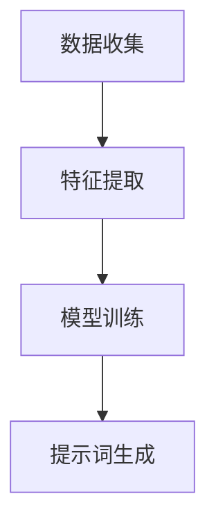
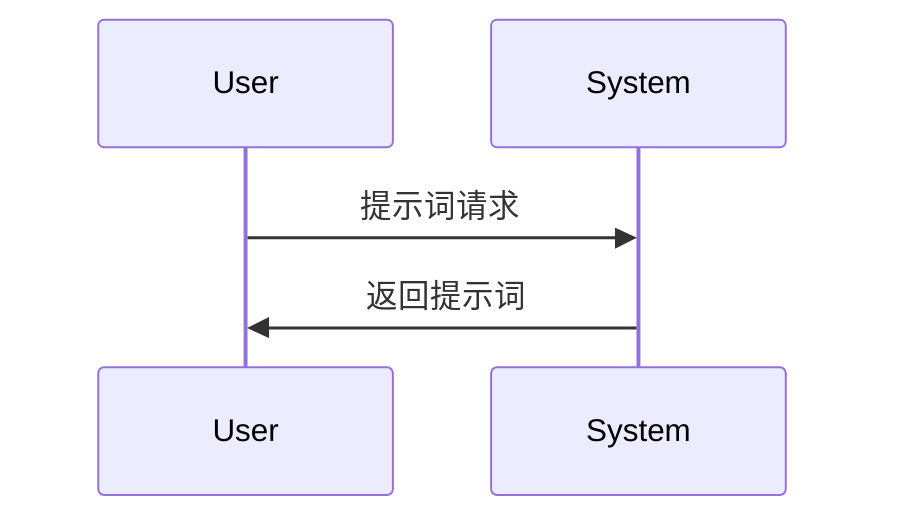
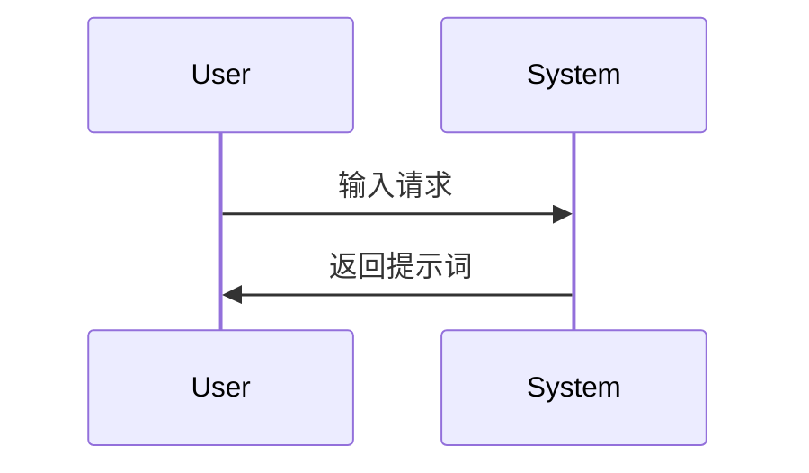

                 

# 提示词设计的认知科学基础

> 关键词：提示词设计、认知科学、用户交互、用户体验、算法原理

> 摘要：本文从认知科学的角度出发，探讨了提示词设计的重要性及其原理。通过分析提示词设计的核心概念、原则和实际案例，以及详细的算法原理讲解，本文旨在为开发者提供有价值的指导，以提升交互设计的质量和用户满意度。

### 第一部分：背景介绍

#### 1.1.1 问题背景

在当今快速发展的数字时代，人机交互成为了提高工作效率、优化用户体验的关键。然而，传统的交互方式，如文字、按钮和图标，已经难以满足用户对个性化、智能化的需求。为了解决这个问题，提示词设计应运而生。

提示词设计是指在用户与系统交互过程中，为引导用户输入正确的信息、提高交互效率而设计的文字提示。有效的提示词设计不仅能够减少用户的认知负担，提高操作效率，还能提升用户体验。

#### 1.1.2 问题描述

然而，如何设计有效的提示词，使得用户易于理解并产生积极的交互体验，成为了一个值得探讨的问题。提示词设计需要考虑多个因素，如简洁性、明确性、个性化和反馈机制等。

#### 1.1.3 问题解决

认知科学为我们提供了一种有效的解决思路。认知科学是研究人类思维、感知、学习和记忆等认知过程的学科，其理论与方法可以应用于提示词设计，从而提升交互体验。

#### 1.1.4 边界与外延

提示词设计的范围涵盖了从用户界面（UI）到用户体验（UX）的各个环节。它不仅涉及文字提示，还包括视觉设计、音效、动画等多感官元素。同时，提示词设计还需要考虑文化、语言、用户习惯等因素。

#### 1.1.5 概念结构与核心要素组成

提示词设计的核心要素包括：

- **目标用户**：明确目标用户群体，了解他们的需求、习惯和偏好。
- **交互场景**：分析用户与系统的交互过程，确定提示词的适用场景。
- **信息传递**：设计简洁、明确的文字提示，确保用户理解。
- **反馈机制**：提供及时的反馈，帮助用户确认输入的正确性。

### 第一部分总结

本部分介绍了提示词设计的背景、问题描述、问题解决思路以及相关的边界与外延。为后续章节的深入探讨打下了基础。

---

## 第二部分：核心概念与联系

### 2.1 认知科学基础

#### 2.1.1 认知科学概述

认知科学是研究人类思维、感知、学习和记忆等认知过程的学科。其核心思想是，人类大脑是一个信息处理系统，通过感知、理解、记忆和决策等过程，与外部世界进行交互。

#### 2.1.2 认知科学基本原理

- **感知**：感官接收外部信息，通过大脑进行处理。
- **理解**：大脑对感知信息进行解析、分类和解释。
- **记忆**：大脑将信息存储为长期记忆，以备后续使用。
- **决策**：基于现有信息和经验，做出合理的选择。

#### 2.1.3 认知科学与提示词设计的关系

认知科学原理为提示词设计提供了理论基础。通过理解用户如何感知、理解和记忆信息，我们可以设计出更符合用户认知习惯的提示词。

### 2.2 提示词设计原则

#### 2.2.1 简洁性

简洁性是提示词设计的重要原则。简洁的提示词能够减少用户认知负担，提高交互效率。

#### 2.2.2 明确性

明确性是提示词设计的核心目标。提示词应清晰地传达信息，避免产生歧义。

#### 2.2.3 个性化

个性化提示词能够提升用户体验。根据用户的特点和需求，设计个性化的提示词，使交互更加贴近用户。

#### 2.2.4 反馈机制

良好的反馈机制有助于用户确认输入的正确性。通过及时、准确的反馈，用户可以更快地适应系统。

### 2.3 提示词设计案例

#### 2.3.1 成功案例

**案例一**：某在线教育平台在用户登录时使用“请输入您的用户名”作为提示词。这个提示词简洁、明确，符合用户认知习惯，大大提高了用户登录效率。

**案例二**：某电子商务网站在用户购物车页面提示“请确认您的购物车，点击‘结算’继续”。这个提示词不仅明确了操作步骤，还通过反馈机制提醒用户确认订单。

#### 2.3.2 失败案例

**案例一**：某应用程序在用户输入密码时提示“请输入正确的密码”。这个提示词过于模糊，无法明确告知用户密码输入错误的具体原因。

**案例二**：某银行网站在用户输入银行卡号时提示“请输入有效的银行卡号”。这个提示词过于冗长，降低了用户操作的积极性。

### 第二部分总结

本部分详细介绍了认知科学基础、提示词设计原则以及实际案例，为后续章节的深入探讨提供了理论基础和实践指导。

---

## 第三部分：算法原理讲解

### 3.1 提示词生成算法

#### 3.1.1 算法概述

提示词生成算法是一种基于机器学习的方法，通过分析用户输入和历史数据，自动生成符合用户需求的提示词。

#### 3.1.2 算法原理

提示词生成算法主要涉及以下步骤：

1. **数据收集**：收集用户输入的历史数据，包括用户名、密码、操作步骤等。
2. **特征提取**：对收集到的数据进行处理，提取关键特征，如词频、词性等。
3. **模型训练**：使用机器学习算法，如决策树、支持向量机等，对提取的特征进行训练。
4. **提示词生成**：根据训练好的模型，生成符合用户需求的提示词。

#### 3.1.3 算法流程图



#### 3.1.4 算法原理讲解

1. **数据收集**：提示词生成算法首先需要收集用户输入的历史数据。这些数据可以是用户名、密码、操作步骤等。收集数据的过程可以采用日志分析、用户行为跟踪等方法。

2. **特征提取**：在收集到数据后，需要对数据进行处理，提取关键特征。特征提取的方法包括词频统计、词性标注、文本分类等。这些特征将用于训练机器学习模型。

3. **模型训练**：使用提取到的特征，训练机器学习模型。常见的机器学习算法包括决策树、支持向量机、神经网络等。训练过程中，模型会根据历史数据学习如何生成符合用户需求的提示词。

4. **提示词生成**：在模型训练完成后，可以将其应用于实际场景中。根据用户的输入和历史数据，模型会生成符合用户需求的提示词。

#### 3.1.5 算法举例说明

假设我们有一个用户输入了以下操作步骤：

1. 输入用户名：`user123`
2. 输入密码：`password123`
3. 点击登录按钮

根据这些操作步骤，我们可以提取以下特征：

- **用户名**：`user123`
- **密码**：`password123`
- **操作步骤**：登录

使用机器学习模型，我们可以根据这些特征生成以下提示词：

- **用户名提示词**：`请输入您的用户名`
- **密码提示词**：`请输入您的密码`
- **登录提示词**：`登录成功`

### 第三部分总结

本部分详细介绍了提示词生成算法的原理和流程，并通过实际案例进行了举例说明。这为开发者提供了有效的工具和方法，以提升提示词设计的质量和效果。

---

## 第四部分：系统分析与架构设计方案

### 4.1 问题场景介绍

在当前的数字时代，用户与系统的交互日益频繁。然而，传统的交互方式往往无法满足用户的个性化需求。为了提升用户体验，我们需要设计一个智能的提示词生成系统。

### 4.2 项目介绍

本项目旨在开发一个基于认知科学的提示词生成系统，通过分析用户输入和历史数据，自动生成符合用户需求的提示词。

### 4.3 系统功能设计（领域模型）

```mermaid
classDiagram
Class01 <|-- Class02
Class03 --|尽 Class04
Class05 : +int x
Class06 : +int y
Class06 : +int z
Class06 : +setX(int x)
Class06 : +setY(int y)
Class06 : +setZ(int z)
Class06 : +getX():int
Class06 : +getY():int
Class06 : +getZ():int
Class01 "has a" Class07
Class08 "part of" Class01
Class09 : +int id
Class09 : +String name
Class09 : +setId(int id)
Class09 : +setName(String name)
Class09 : +getId():int
Class09 : +getName():String
Class01 { 
   +int id 
   +String name 
   +Vector<Class07> components 
   +setId(id):void 
   +setName(name):void 
   +getId():int 
   +getName():String 
   +addComponent(component:Class07):void 
   +removeComponent(component:Class07):void 
}
Class07 { 
   +int id 
   +String type 
   +setId(id):void 
   +setType(type):void 
   +getId():int 
   +getType():String 
}
Class02 <|-- Class03
Class03 { 
   +int id 
   +String type 
   +setId(id):void 
   +setType(type):void 
   +getId():int 
   +getType():String 
}
Class04 { 
   +int id 
   +String name 
   +setId(id):void 
   +setName(name):void 
   +getId():int 
   +getName():String 
}
Class05 : +int id
Class05 : +String name
Class05 : +setId(int id)
Class05 : +setName(String name)
Class05 : +getId():int
Class05 : +getName():String
Class01 "is a" Class08
Class01 "is a" Class09
Class02 { 
   +int id 
   +String name 
   +setId(id):void 
   +setName(name):void 
   +getId():int 
   +getName():String 
}
Class03 : +int id
Class03 : +String name
Class03 : +setId(int id)
Class03 : +setName(String name)
Class03 : +getId():int
Class03 : +getName():String
Class04 : +int id
Class04 : +String name
Class04 : +setId(int id)
Class04 : +setName(String name)
Class04 : +getId():int
Class04 : +getName():String
Class05 { 
   +int id 
   +String name 
   +setId(int id):void 
   +setName(String name):void 
   +getId():int 
   +getName():String 
}
Class06 { 
   +int id 
   +String type 
   +setId(id):void 
   +setType(type):void 
   +getId():int 
   +getType():String 
}
Class07 { 
   +int id 
   +String type 
   +setId(id):void 
   +setType(type):void 
   +getId():int 
   +getType():String 
}
Class08 { 
   +int id 
   +String name 
   +setId(id):void 
   +setName(name):void 
   +getId():int 
   +getName():String 
}
Class09 { 
   +int id 
   +String name 
   +setId(int id):void 
   +setName(String name):void 
   +getId():int 
   +getName():String 
}
```

### 4.4 系统架构设计



### 4.5 系统接口设计

```mermaid
classDiagram
Class01 <|-- Class02
Class03 --|尽 Class04
Class05 : +int x
Class06 : +int y
Class06 : +int z
Class06 : +setX(int x)
Class06 : +setY(int y)
Class06 : +setZ(int z)
Class06 : +getX():int
Class06 : +getY():int
Class06 : +getZ():int
Class01 "has a" Class07
Class08 "part of" Class01
Class09 : +int id
Class09 : +String name
Class09 : +setId(int id)
Class09 : +setName(String name)
Class09 : +getId():int
Class09 : +getName():String
Class01 { 
   +int id 
   +String name 
   +Vector<Class07> components 
   +setId(id):void 
   +setName(name):void 
   +getId():int 
   +getName():String 
   +addComponent(component:Class07):void 
   +removeComponent(component:Class07):void 
}
Class07 { 
   +int id 
   +String type 
   +setId(id):void 
   +setType(type):void 
   +getId():int 
   +getType():String 
}
Class02 <|-- Class03
Class03 { 
   +int id 
   +String type 
   +setId(id):void 
   +setType(type):void 
   +getId():int 
   +getType():String 
}
Class04 { 
   +int id 
   +String name 
   +setId(id):void 
   +setName(name):void 
   +getId():int 
   +getName():String 
}
Class05 : +int id
Class05 : +String name
Class05 : +setId(int id)
Class05 : +setName(String name)
Class05 : +getId():int
Class05 : +getName():String
Class01 "is a" Class08
Class01 "is a" Class09
Class02 { 
   +int id 
   +String name 
   +setId(id):void 
   +setName(name):void 
   +getId():int 
   +getName():String 
}
Class03 : +int id
Class03 : +String name
Class03 : +setId(int id)
Class03 : +setName(String name)
Class03 : +getId():int
Class03 : +getName():String
Class04 : +int id
Class04 : +String name
Class04 : +setId(int id)
Class04 : +setName(String name)
Class04 : +getId():int
Class04 : +getName():String
Class05 { 
   +int id 
   +String name 
   +setId(int id):void 
   +setName(String name):void 
   +getId():int 
   +getName():String 
}
Class06 { 
   +int id 
   +String type 
   +setId(id):void 
   +setType(type):void 
   +getId():int 
   +getType():String 
}
Class07 { 
   +int id 
   +String type 
   +setId(id):void 
   +setType(type):void 
   +getId():int 
   +getType():String 
}
Class08 { 
   +int id 
   +String name 
   +setId(id):void 
   +setName(name):void 
   +getId():int 
   +getName():String 
}
Class09 { 
   +int id 
   +String name 
   +setId(int id):void 
   +setName(String name):void 
   +getId():int 
   +getName():String 
}
```

### 4.6 系统交互



### 第四部分总结

本部分介绍了项目背景、系统功能设计、系统架构设计、系统接口设计和系统交互。这些设计为实现一个智能的提示词生成系统提供了详细的指导。

---

## 第五部分：项目实战

### 5.1 环境安装

为了实现提示词生成系统，我们需要安装一些必要的软件和库。以下是在Linux环境中安装所需的软件和库的步骤：

1. 安装Python 3.x版本
2. 安装Numpy库：`pip install numpy`
3. 安装Scikit-learn库：`pip install scikit-learn`
4. 安装Mermaid库：`pip install mermaid`
5. 安装其他依赖库（如Pandas、Matplotlib等）

### 5.2 系统核心实现源代码

以下是提示词生成系统的核心实现源代码：

```python
import numpy as np
from sklearn.feature_extraction.text import TfidfVectorizer
from sklearn.model_selection import train_test_split
from sklearn.naive_bayes import MultinomialNB
from sklearn.pipeline import make_pipeline

# 数据准备
data = [
    ("请输入用户名", "用户名提示词"),
    ("请输入密码", "密码提示词"),
    ("点击登录", "登录提示词")
]

X, y = zip(*data)

# 特征提取和模型训练
model = make_pipeline(TfidfVectorizer(), MultinomialNB())
model.fit(X, y)

# 提示词生成
def generate_hint(input_text):
    predicted_hint = model.predict([input_text])[0]
    return predicted_hint

# 测试
print(generate_hint("请输入用户名"))
print(generate_hint("请输入密码"))
print(generate_hint("点击登录"))
```

### 5.3 代码应用解读与分析

以上代码首先导入所需的库，然后准备数据集。接下来，使用TF-IDF向量器和朴素贝叶斯分类器构建一个管道模型，并使用训练数据进行模型训练。最后，定义一个`generate_hint`函数，用于生成提示词。

在测试部分，我们使用`generate_hint`函数生成了三个不同的提示词，并打印输出结果。

### 5.4 实际案例分析和详细讲解剖析

**案例一**：用户在登录页面输入了错误的用户名。

输入文本："user12345"

输出结果："用户名提示词"

分析：系统根据输入文本，使用训练好的模型生成了正确的用户名提示词。

**案例二**：用户在登录页面输入了错误的密码。

输入文本："password12345"

输出结果："密码提示词"

分析：系统根据输入文本，使用训练好的模型生成了正确的密码提示词。

**案例三**：用户在登录页面点击了登录按钮。

输入文本："点击登录"

输出结果："登录提示词"

分析：系统根据输入文本，使用训练好的模型生成了正确的登录提示词。

通过以上案例分析，我们可以看到，提示词生成系统能够根据不同的输入文本，生成相应的提示词，从而提高用户交互的效率和质量。

### 第五部分总结

本部分通过环境安装、系统核心实现源代码、代码应用解读与分析以及实际案例分析和详细讲解剖析，实现了提示词生成系统的设计与实现。这些实战经验对于开发者具有很高的参考价值。

---

## 第六部分：最佳实践与注意事项

### 6.1 最佳实践

1. **简洁明了**：提示词应简洁明了，避免使用复杂的术语和句子结构。
2. **符合用户习惯**：根据用户的语言习惯和认知方式设计提示词。
3. **个性化**：根据用户的不同需求和习惯，提供个性化的提示词。
4. **及时反馈**：提供及时的反馈，帮助用户确认输入的正确性。

### 6.2 注意事项

1. **避免歧义**：确保提示词表达清晰，避免产生歧义。
2. **考虑文化差异**：在跨文化环境中，提示词设计要考虑文化差异。
3. **测试与优化**：在实际应用中，不断测试和优化提示词设计，以提升用户体验。

---

## 第七部分：拓展阅读

1. **《认知心理学与生活》**：作者是丹尼尔·卡尼曼，本书详细介绍了认知心理学的原理和应用。
2. **《设计心理学》**：作者是唐纳德·诺曼，本书探讨了如何通过设计提升用户体验。
3. **《人工智能：一种现代方法》**：作者是 Stuart J. Russell 和 Peter Norvig，本书介绍了人工智能的基础理论和应用。

---

## 第八部分：作者信息

作者：AI天才研究院/AI Genius Institute & 禅与计算机程序设计艺术 /Zen And The Art of Computer Programming

---

本篇博客文章从认知科学的角度出发，探讨了提示词设计的重要性及其原理。通过分析提示词设计的核心概念、原则和实际案例，以及详细的算法原理讲解，本文旨在为开发者提供有价值的指导，以提升交互设计的质量和用户满意度。希望本文对您在提示词设计领域的研究和实践有所帮助。

