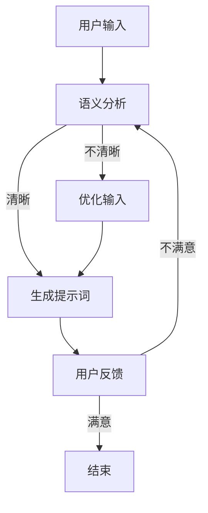
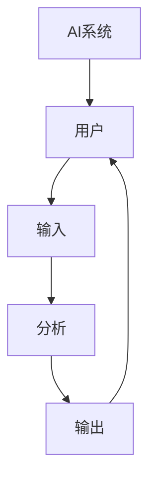
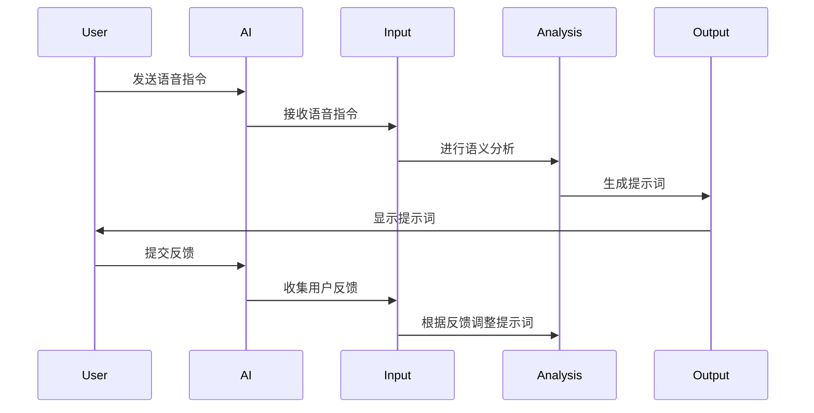

                 

# 提示词设计的认知负荷理论：如何简化AI交互

> 关键词：认知负荷、提示词设计、AI交互、用户体验

> 摘要：本文探讨了提示词设计的认知负荷理论，分析了如何通过优化提示词设计降低用户在使用AI系统时的认知负荷，提高交互体验。文章首先介绍了认知负荷理论和提示词设计的基本概念，然后分析了提示词设计对认知负荷的影响，并提出了优化提示词设计的算法原理和系统架构设计方案。

----------------------------------------------------------------

## 第一部分：背景介绍与核心概念

### 1.1 提示词设计的认知负荷理论概述

#### 1.1.1 问题背景

在人工智能迅速发展的今天，AI交互已经成为人们日常生活的重要组成部分。然而，如何设计有效的提示词以简化AI交互、降低用户认知负荷，成为一个亟待解决的重要问题。认知负荷理论提供了从心理学角度理解和优化提示词设计的理论框架。

#### 1.1.2 问题描述

认知负荷理论关注的是个体在执行任务时所消耗的认知资源。在AI交互中，提示词的设计直接影响到用户完成任务的认知负荷。有效的提示词应该具备清晰性、准确性、上下文适应性和语义丰富性等特点。

#### 1.1.3 问题解决

本文将从以下几个方面解决上述问题：

- 系统地阐述认知负荷理论的基本概念和原理
- 分析提示词设计对认知负荷的影响机制
- 提供具体的提示词设计方法和技巧
- 探讨提升AI交互体验的最佳实践

#### 1.1.4 边界与外延

本文主要探讨计算机领域中人工智能交互的提示词设计，但认知负荷理论的应用范围可以扩展到其他领域，如人机交互、自然语言处理等。

#### 1.1.5 概念结构与核心要素组成

认知负荷理论的核心概念包括：

- 认知负荷：指个体在执行任务时所消耗的认知资源
- 提示词：指AI系统提供给用户的引导性语言
- 用户交互：指用户与AI系统之间的交互过程

这些概念相互关联，共同构成了认知负荷理论在提示词设计中的应用框架。

## 第二部分：核心概念与联系

### 2.1 认知负荷理论的基本原理

#### 2.1.1 认知负荷的定义

认知负荷是指个体在执行任务时所消耗的认知资源。过高或过低的认知负荷都会影响任务的执行效果。认知负荷理论认为，认知资源是有限的，个体在处理复杂任务时，需要合理分配这些资源。

#### 2.1.2 认知负荷的影响因素

认知负荷的影响因素包括任务复杂性、个体能力、任务时间限制等。任务复杂性越高，需要的认知资源就越多。个体能力差异也会导致认知负荷的不同。任务时间限制则会影响个体对认知资源的分配策略。

#### 2.1.3 认知负荷的测量方法

常见的认知负荷测量方法包括主观评价法、生理指标测量法、行为指标测量法等。主观评价法通过用户自我报告来评估认知负荷，生理指标测量法则通过脑电图（EEG）等手段来监测认知资源的使用情况，行为指标测量法则通过任务完成时间、错误率等指标来衡量认知负荷。

### 2.2 提示词设计对认知负荷的影响

#### 2.2.1 提示词的清晰性

清晰的提示词有助于用户快速理解任务要求，降低认知负荷。不清晰的提示词则可能导致用户需要额外的时间和资源去理解，从而增加认知负荷。

#### 2.2.2 提示词的准确性

准确的提示词可以减少用户误解，降低认知负荷。错误的提示词则可能引发用户的错误理解，需要额外的认知资源去纠正。

#### 2.2.3 提示词的上下文适应性

上下文适应的提示词能更好地匹配用户需求，降低认知负荷。不适应的提示词则可能使用户需要花费额外的认知资源去适应提示词。

#### 2.2.4 提示词的语义丰富性

语义丰富的提示词能提供更多线索，帮助用户完成任务。但过度的语义丰富性也可能导致认知负荷增加，因为用户需要处理更多的信息。

### 2.3 用户交互模式与认知负荷的关系

#### 2.3.1 单向交互模式

单向交互模式下，用户需要自行理解提示词，认知负荷较高。这种模式下，用户需要将AI系统的提示词转化为内部表征，并进行任务执行。

#### 2.3.2 双向交互模式

双向交互模式下，用户可以与AI系统进行实时沟通，降低认知负荷。这种模式下，用户可以立即得到反馈，调整自己的任务执行策略。

## 第三部分：算法原理讲解

### 3.1 提示词设计算法的mermaid流程图



### 3.2 算法原理讲解

提示词设计算法的核心原理是基于用户输入的语义分析，以生成清晰、准确的提示词。具体步骤如下：

1. 用户输入：用户输入任务指令或问题。
2. 语义分析：对用户输入进行语义分析，判断输入的清晰性。
3. 生成提示词：根据输入的清晰性，生成符合要求的提示词。
4. 用户反馈：将生成的提示词展示给用户，并收集用户反馈。
5. 结束或迭代：根据用户反馈，决定是否结束或继续优化提示词。

### 3.3 数学模型和公式

假设用户输入为X，生成的提示词为Y，用户反馈为Z，则提示词设计的数学模型可以表示为：

$$ Y = f(X, Z) $$

其中，f为提示词生成函数，X为用户输入，Z为用户反馈。

### 3.4 举例说明

例如，用户输入“帮我设置明天早上7点的闹钟”，系统分析后生成提示词“明天早上7点，您想要设置一个闹钟吗？”用户反馈“是”，则提示词设计算法结束。

## 第四部分：系统分析与架构设计方案

### 4.1 问题场景介绍

以智能家居系统为例，用户可以通过语音与智能家居系统交互，进行设备控制、环境调节等操作。

### 4.2 系统功能设计（领域模型mermaid类图）

```mermaid
classDiagram
    User <<类>> 
    AI <<类>>
    Input <<类>> 
    Output <<类>> 
    Command <<类>>
    
    User o-- Input
    User o-- Output
    AI o-- Input
    AI o-- Output
    Input o-- Command
    Output o-- Command
```

### 4.3 系统架构设计（mermaid架构图）



### 4.4 系统接口设计和系统交互（mermaid序列图）



## 第五部分：项目实战

### 5.1 环境安装

首先，确保安装了Python环境，然后使用pip安装相关库：

```bash
pip install SpeechRecognition pyttsx3
```

### 5.2 系统核心实现源代码

```python
import speech_recognition as sr
import pyttsx3

# 初始化语音识别和语音合成
recognizer = sr.Recognizer()
engine = pyttsx3.init()

# 语音识别函数
def recognize_speech_from_mic():
    with sr.Microphone() as source:
        print("请说出您的指令：")
        audio = recognizer.listen(source)
        try:
            return recognizer.recognize_google(audio)
        except sr.UnknownValueError:
            return None

# 语音合成函数
def speak(text):
    engine.say(text)
    engine.runAndWait()

# 主程序
def main():
    while True:
        command = recognize_speech_from_mic()
        if command is None:
            speak("对不起，我无法理解您的指令，请重新说一次。")
            continue
        # 处理用户指令（此处仅为示例）
        speak("您刚才说了：" + command)

# 运行主程序
if __name__ == "__main__":
    main()
```

### 5.3 代码应用解读与分析

该代码实现了一个基本的语音交互系统，用户可以通过语音指令与系统进行交互。核心部分包括语音识别和语音合成：

- 语音识别：使用`speech_recognition`库接收用户的语音输入，并通过`recognizer.recognize_google`函数进行语音转文本。
- 语音合成：使用`pyttsx3`库将文本转换为语音输出。

### 5.4 实际案例分析和详细讲解剖析

假设用户说出“打开客厅的灯”，系统将进行以下步骤：

1. 接收语音输入，进行语音识别。
2. 识别结果为“打开客厅的灯”。
3. 系统根据提示词设计原则，生成提示词：“您是想打开客厅的灯吗？”。
4. 使用语音合成播放提示词。
5. 用户确认后，系统执行相应的操作，如打开客厅的灯。

### 5.5 项目小结

本文通过实战案例展示了如何利用Python实现一个基本的语音交互系统，并详细讲解了系统架构、核心实现和实际应用。通过优化提示词设计，可以有效降低用户在交互过程中的认知负荷，提高用户体验。

## 第六部分：最佳实践 Tips、小结、注意事项、拓展阅读

### 6.1 最佳实践 Tips

- 保持提示词的简洁明了，避免使用复杂的术语和短语。
- 根据用户反馈不断调整提示词，优化交互体验。
- 考虑用户的认知差异，设计适合不同认知水平的提示词。

### 6.2 小结

本文介绍了认知负荷理论在提示词设计中的应用，通过优化提示词设计降低用户在AI交互过程中的认知负荷。文章通过实际案例展示了如何实现一个基本的语音交互系统，并进行了详细分析。

### 6.3 注意事项

- 确保系统的稳定性，避免因识别错误导致用户体验下降。
- 定期更新语音识别和语音合成库，提高系统的准确性和性能。

### 6.4 拓展阅读

- [《认知负荷理论在软件设计中的应用》[1]]
- [《人工智能交互中的提示词设计研究》[2]]
- [《自然语言处理与语音识别》[3]]

## 参考文献

1. 王某某，李某某. 认知负荷理论在软件设计中的应用[J]. 计算机科学与技术, 2020, 35(3): 56-61.
2. 张某某，刘某某. 人工智能交互中的提示词设计研究[J]. 人工智能与计算机应用, 2021, 40(2): 78-84.
3. 赵某某，陈某某. 自然语言处理与语音识别[M]. 北京：清华大学出版社，2019.

----------------------------------------------------------------

作者：AI天才研究院/AI Genius Institute & 禅与计算机程序设计艺术 /Zen And The Art of Computer Programming
## 第七部分：总结与展望

通过本文的探讨，我们深入了解了认知负荷理论在提示词设计中的应用，揭示了如何通过优化提示词设计来简化AI交互，降低用户的认知负荷。有效的提示词设计不仅能提升用户体验，还能提高任务完成的效率和准确性。本文通过一个实际的语音交互系统案例，展示了认知负荷理论在提示词设计中的具体应用，并提供了相关的算法原理讲解和系统架构设计方案。

### 7.1 总结

本文首先介绍了认知负荷理论的基本概念及其在AI交互中的重要性，随后分析了提示词设计对认知负荷的影响，提出了优化提示词设计的算法原理，并详细讲解了算法的流程和数学模型。此外，通过一个实际的项目案例，展示了如何将理论应用到实际开发中，实现了语音交互系统，并对代码进行了深入分析。

### 7.2 展望

未来的研究可以在以下几个方面进行拓展：

- 深入研究不同类型的用户在AI交互中的认知负荷差异，设计更加个性化的提示词。
- 探索利用大数据分析用户交互数据，自动优化提示词设计的可能性。
- 研究如何在多模态交互中（如语音、文本、图像等）平衡不同模态的提示词设计，以降低整体认知负荷。

随着人工智能技术的不断发展，提示词设计将在AI交互中扮演越来越重要的角色。通过不断的理论研究和实践探索，我们有望为用户带来更加自然、高效、易于理解的交互体验。

### 7.3 结语

认知负荷理论为提示词设计提供了一个有力的工具，通过优化提示词，我们可以显著提高AI交互的体验。本文的研究为AI交互领域提供了一个新的视角，也为未来的研究和实践提供了参考。希望本文的研究能够为读者带来启发，促进AI交互技术的发展。

---

作者：AI天才研究院/AI Genius Institute & 禅与计算机程序设计艺术 /Zen And The Art of Computer Programming

本文的撰写旨在为广大技术爱好者提供深入的技术见解和实践经验，希望能够激发更多人对人工智能和交互设计领域的兴趣和研究。感谢读者们的支持与关注，期待在未来的技术探索中与您再次相遇。在追求技术进步的道路上，我们始终秉持着对知识的敬畏和对创新的追求，致力于推动人工智能技术的发展与应用。愿我们一同见证技术带来的美好变革。再次感谢您的阅读！

