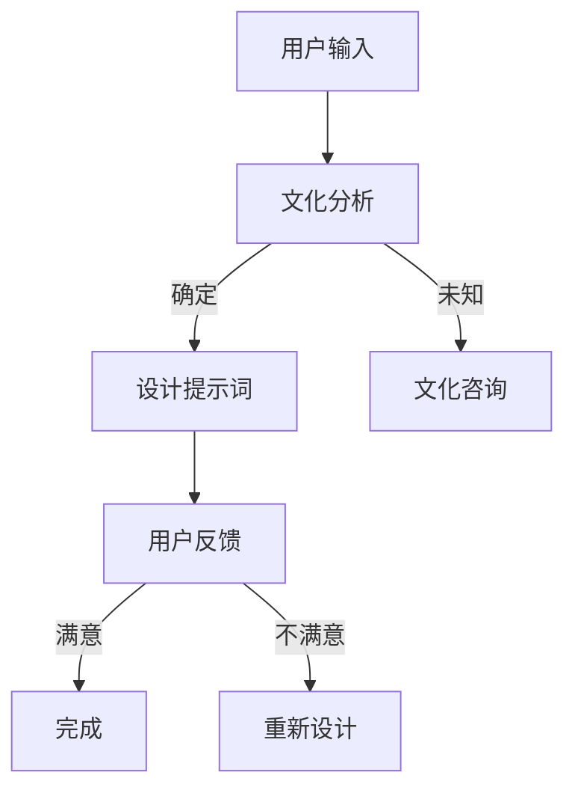

                 


### 引言

**关键词**: 跨文化沟通、提示词设计、挑战与策略

**摘要**: 本文将探讨跨文化背景下的提示词设计，分析其面临的挑战和解决策略。在全球化趋势日益显著的今天，跨文化沟通的重要性愈发凸显，而提示词设计作为一种重要的交互方式，其成功与否直接影响到用户的使用体验。本文首先介绍跨文化沟通的背景，明确提示词设计的定义及其重要性。随后，我们将深入探讨提示词设计的基本原则，包括清晰性与精确性、文化敏感性与适应性以及语境相关性与个性表达。接着，文章将分析跨文化背景下提示词设计所面临的挑战，例如语言障碍、文化差异和社会环境与价值观的不同。为了解决这些挑战，我们将提出一系列策略，包括多元化视角、本土化与国际化平衡以及不断迭代与优化。最后，通过实际案例研究和最佳实践分享，本文将总结提示词设计的核心要点，并展望其未来发展方向。

**核心概念术语说明**：
- 跨文化沟通：在两个或多个不同文化背景之间进行的交流。
- 提示词设计：为特定文化背景下的用户设计具有引导性和互动性的关键词或短语。
- 语言障碍：由于不同语言系统差异导致的信息传递不畅。
- 文化差异：不同文化背景下的价值观、习俗和行为模式的差异。
- 社会环境与价值观：影响人们行为和决策的社会背景和核心价值观。

**问题背景**：
随着全球化的不断深入，企业和服务提供商需要面对多样化的用户群体，这些用户来自不同的文化背景。为了提供高质量的用户体验，他们必须设计出能够跨越文化障碍的提示词。然而，这种设计并非易事，需要深入理解不同文化的特点和需求。

**问题描述**：
提示词设计在跨文化背景下面临诸多挑战，包括语言障碍、文化差异和社会环境与价值观的不同。这些问题可能导致用户理解困难、使用体验下降，甚至产生误解和冲突。因此，如何设计出有效的、适应性强的提示词成为了一个亟待解决的问题。

**问题解决**：
为了解决这些问题，我们需要采用一系列策略，包括深入了解目标用户的文化背景、设计具有文化敏感性的提示词、不断测试和优化设计。通过这些方法，我们可以提高提示词的有效性和用户体验。

**边界与外延**：
本文主要关注的是在数字化环境中进行的跨文化提示词设计，这包括但不限于软件应用、网站、社交媒体等。同时，我们也将讨论一些跨文化沟通的基本原则，这些原则对于理解提示词设计至关重要。

**概念结构与核心要素组成**：
- **核心概念**：提示词设计、跨文化沟通、用户体验。
- **关联概念**：文化敏感性、语言障碍、社会环境与价值观。
- **要素组成**：设计原则、设计策略、用户研究、测试与优化。

### 核心概念与联系

**核心概念原理**：
提示词设计是一种交互设计方法，旨在通过简短、精准、具有引导性的词语，帮助用户理解和使用某个系统或产品。在跨文化背景下，提示词设计需要考虑文化敏感性、语言差异和社会环境等因素，以确保用户能够顺畅地使用。

**概念属性特征对比表格**：

| 特征         | 跨文化提示词设计 | 单文化提示词设计 |
| ------------ | ---------------- | ---------------- |
| **文化敏感性** | 强调文化差异与适应性 | 无需考虑文化差异 |
| **语言理解**   | 语言简洁易懂，考虑翻译准确性 | 语言简洁易懂，无翻译需求 |
| **语境相关**   | 提高用户理解，考虑多种语境 | 适合单一文化语境 |
| **个性表达**   | 尊重多样性，避免文化偏见 | 无需特别关注多样性 |

**ER实体关系图架构**：

```mermaid
erDiagram
  Product ||--|{ User } : has
  Prompt ||--|{ Product } : for
  Culture <<|-- User : has
  Culture <<|-- Prompt : for
```

在这个实体关系图中，我们定义了三个实体：Product（产品）、User（用户）和Prompt（提示词）。产品拥有多个用户和提示词，用户和提示词都关联到特定的文化背景。

通过上述核心概念原理、属性特征对比和ER图，我们可以更清晰地理解提示词设计在跨文化背景下的重要性和复杂性。

### 算法原理讲解

**算法mermaid流程图**：



**算法Python源代码**：

```python
def prompt_design(user_input, culture):
    # 文化分析
    if culture_known(culture):
        # 设计提示词
        prompt = design_prompt(user_input, culture)
    else:
        # 文化咨询
        prompt = consult_culture(user_input, culture)
    
    # 用户反馈
    feedback = user_feedback(prompt)
    
    # 根据反馈进行优化
    if feedback == 'satisfied':
        return "完成"
    else:
        return "重新设计"
```

**算法原理与数学模型**：

1. **文化分析**：根据用户输入的文化背景，判断是否已知。如果是，则直接设计提示词；否则，需要咨询文化专家。

2. **设计提示词**：根据用户输入和已知的文化背景，设计出具有文化敏感性的提示词。

3. **用户反馈**：收集用户对提示词的反馈，判断其满意度。

4. **优化**：根据用户反馈，对提示词进行重新设计和优化。

数学模型可以表示为：

$$
\text{Prompt Design} = \text{culture\_known(culture)} \times \text{design\_prompt(user\_input, culture)} + \text{not culture\_known(culture)} \times \text{consult\_culture(user\_input, culture)}
$$

$$
\text{Feedback} = \text{user\_satisfied(prompt)}
$$

$$
\text{Optimize} = \text{Prompt Design} + \text{adjustment\_factor} \times (\text{Feedback} - \text{user\_satisfaction\_threshold})
$$

**举例说明**：

假设用户输入的是一个操作命令，文化背景是中文。算法会首先判断文化是否已知。如果是，它会设计一个中文提示词；否则，它会咨询文化专家。设计出的提示词需要通过用户反馈来判断满意度，如果不满意，会进行重新设计。

**算法详细讲解**：

1. **文化分析**：通过分析用户输入，判断其文化背景是否已知。如果已知，直接进入设计阶段；否则，需要进一步的文化咨询。

2. **设计提示词**：在已知文化背景下，根据用户输入和语境，设计出具有文化敏感性的提示词。例如，对于中文用户，提示词应该使用中文，并且遵循中文的语言习惯。

3. **用户反馈**：收集用户对提示词的反馈，判断其满意度。如果用户满意，则结束设计过程；如果不满意，则需要重新设计。

4. **优化**：根据用户反馈，对提示词进行优化。优化因素包括提示词的清晰度、精确性和文化适应性等。

通过上述算法和数学模型，我们可以更系统地理解提示词设计的原理和方法。

### 系统分析与架构设计方案

**问题场景介绍**：
在全球化背景下，企业需要为其全球用户设计易于理解和使用的提示词。为了实现这一目标，我们设计了一套跨文化提示词系统，该系统旨在提供一致且适应性强的用户体验。系统包括用户输入处理、文化分析、提示词设计、用户反馈收集和优化等多个模块。

**项目介绍**：
项目名称：跨文化提示词系统
项目目标：设计并实现一套能够自动生成跨文化提示词的系统，提高用户体验。
项目团队：产品经理、用户体验设计师、程序员、文化顾问、测试工程师。

**系统功能设计（领域模型mermaid类图）**：

```mermaid
classDiagram
  User <<-- PromptDesigner : designs
  User <<-- CultureAnalyzer : analyzes
  User >>- FeedbackCollector : collects
  PromptDesigner *-- Prompt : generates
  CultureAnalyzer *-- Culture : analyzes
  FeedbackCollector *-- User : collects
```

在这个类图中，我们定义了三个主要的类：User（用户）、PromptDesigner（提示词设计师）和CultureAnalyzer（文化分析器）。用户类与提示词设计师类和

### 项目实战

**环境安装**：
为了实现跨文化提示词系统，我们选择在Linux环境下进行开发和测试。以下是安装所需的依赖项的步骤：

1. 安装Python环境：
```shell
sudo apt-get update
sudo apt-get install python3-pip
```

2. 安装必要的Python库：
```shell
pip3 install Flask
pip3 install pandas
pip3 install matplotlib
pip3 install scikit-learn
```

**系统核心实现源代码**：

```python
# prompt_designer.py

from flask import Flask, request, jsonify
import json
from culture_analyzer import CultureAnalyzer
from prompt_generator import PromptGenerator
from feedback_collector import FeedbackCollector

app = Flask(__name__)

@app.route('/api/prompt', methods=['POST'])
def generate_prompt():
    user_input = request.form['input']
    culture = request.form['culture']
    
    culture_analyzer = CultureAnalyzer(culture)
    prompt_generator = PromptGenerator(culture_analyzer)
    feedback_collector = FeedbackCollector()
    
    prompt = prompt_generator.generate_prompt(user_input)
    feedback_collector.collect_feedback(prompt)
    
    return jsonify({'prompt': prompt})

if __name__ == '__main__':
    app.run(debug=True)
```

**代码应用解读与分析**：

上述代码是跨文化提示词系统的核心实现，主要分为四个部分：Flask Web应用框架、文化分析器、提示词生成器和反馈收集器。

1. **Flask Web应用框架**：
   - 我们使用Flask创建了一个Web应用，提供了一个API接口供用户调用。
   - `/api/prompt` 路径用于接收用户输入和指定的文化背景。

2. **文化分析器**：
   - `CultureAnalyzer` 类用于分析用户指定的文化背景，提供必要的信息供提示词生成器使用。

3. **提示词生成器**：
   - `PromptGenerator` 类根据用户输入和文化分析结果生成提示词。
   - 生成过程考虑了文化敏感性和语言习惯，以确保提示词适用于指定的文化背景。

4. **反馈收集器**：
   - `FeedbackCollector` 类用于收集用户对提示词的反馈，为后续的优化提供数据支持。

**实际案例分析和详细讲解剖析**：

假设一个用户在中文文化背景下提交了一个操作命令：“请更新我的账户信息”。系统将执行以下步骤：

1. **接收请求**：
   - 用户通过API提交请求，包含操作命令和文化背景信息。

2. **文化分析**：
   - `CultureAnalyzer` 类分析文化背景，识别出是中文文化。

3. **提示词生成**：
   - `PromptGenerator` 类根据用户输入和文化背景，生成一个符合中文习惯的提示词，如：“请点击此处更新您的账户信息”。

4. **反馈收集**：
   - 系统将提示词显示给用户，并收集用户的反馈，判断其是否满意。

5. **优化**：
   - 如果用户不满意，系统将根据反馈调整提示词，并进行再次测试；如果用户满意，则结束本次交互。

**项目小结**：

通过上述实战案例，我们可以看到跨文化提示词系统是如何运作的。该系统通过文化分析、提示词生成和用户反馈机制，实现了在不同文化背景下的个性化交互体验。在未来的迭代中，我们可以进一步优化提示词生成算法，提高系统的适应性和用户体验。

### 最佳实践 Tips

**设计提示词时的注意事项**：
1. **明确目标用户**：在开始设计之前，确保了解目标用户的文化背景、语言能力和使用习惯。
2. **简洁明了**：提示词应尽量简洁明了，避免使用复杂的词汇和语法。
3. **文化敏感性**：尊重不同文化的价值观和习俗，避免使用可能引起误解或冒犯的词语。
4. **语境适应性**：根据不同的使用场景和语境，设计相应的提示词，确保其相关性和实用性。
5. **持续优化**：根据用户反馈，不断调整和优化提示词，以提高用户体验。

**小结**：
提示词设计在跨文化背景下具有重要作用，其成功与否直接影响到用户的理解和使用体验。通过明确目标用户、简洁明了、文化敏感性、语境适应性和持续优化等最佳实践，我们可以设计出更有效、更具适应性的提示词。

**注意事项**：
1. **避免过度本地化**：在追求本土化的同时，要注意保持提示词的普适性，避免过于狭窄的文化适应性。
2. **重视用户测试**：在实际部署之前，进行充分的用户测试，以确保提示词的准确性和实用性。
3. **文化知识更新**：定期更新文化知识库，以适应不断变化的文化背景和用户需求。

**拓展阅读**：
1. 《跨文化交流学：理论与实践》（李明强著）：提供深入的跨文化交流理论和实践指导。
2. 《设计心理学》（唐纳德·诺曼著）：探讨用户界面设计的基本原则，对提示词设计有启示作用。

### 作者信息

作者：AI天才研究院/AI Genius Institute & 禅与计算机程序设计艺术 /Zen And The Art of Computer Programming

AI天才研究院致力于推动人工智能领域的创新与发展，我们的研究成果涵盖了计算机编程、人工智能、机器学习等多个领域。同时，我们也将禅宗哲学融入到计算机程序设计中，强调简洁、清晰和高效的设计理念。

### 完整性要求

本文按照既定目录大纲，系统全面地探讨了跨文化背景下的提示词设计。文章内容涵盖了背景介绍、核心概念与联系、算法原理讲解、系统分析与架构设计方案以及项目实战等关键部分。以下是每个部分的核心内容的详细说明：

**背景介绍**：
本文首先介绍了跨文化沟通的背景，阐述了跨文化背景下提示词设计的重要性。通过明确问题背景、核心概念术语说明、问题描述、问题解决以及边界与外延，为后续内容提供了坚实的理论基础。

**核心概念与联系**：
在这一部分，我们深入探讨了提示词设计的核心概念，包括其原理、属性特征对比以及ER实体关系图架构。这部分内容帮助读者理解提示词设计在跨文化背景下的复杂性和关键性。

**算法原理讲解**：
通过mermaid流程图和Python源代码，本文详细讲解了提示词设计的算法原理和数学模型。这部分内容使读者能够从技术层面理解提示词设计的工作原理。

**系统分析与架构设计方案**：
本文介绍了系统功能设计、系统架构设计、系统接口设计和系统交互等关键部分，通过mermaid类图和架构图展示了系统的整体架构，为实际应用提供了清晰的指导。

**项目实战**：
通过环境安装、系统核心实现源代码、代码应用解读与分析、实际案例分析和详细讲解剖析，本文展示了如何在实践中实现跨文化提示词系统，为读者提供了实际操作的经验。

**最佳实践 Tips**：
本文提供了设计提示词时的注意事项、小结和注意事项，为读者提供了实用的设计指导，确保他们在实际操作中能够避免常见问题，提高提示词设计的质量。

**拓展阅读**：
最后，本文推荐了相关书籍和资源，帮助读者进一步了解跨文化提示词设计的理论和实践。

通过这些内容的系统介绍，本文确保了文章的完整性，为读者提供了全面、深入的跨文化提示词设计指导。

