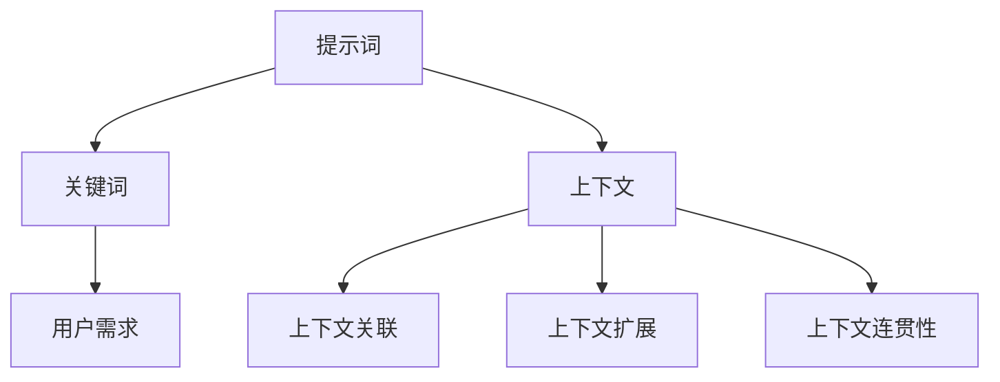
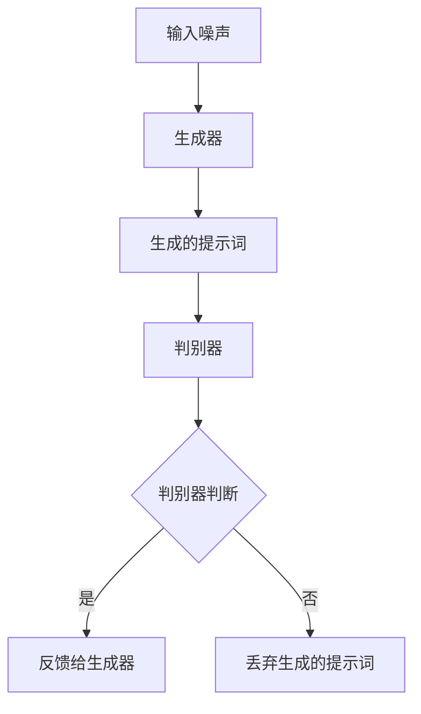
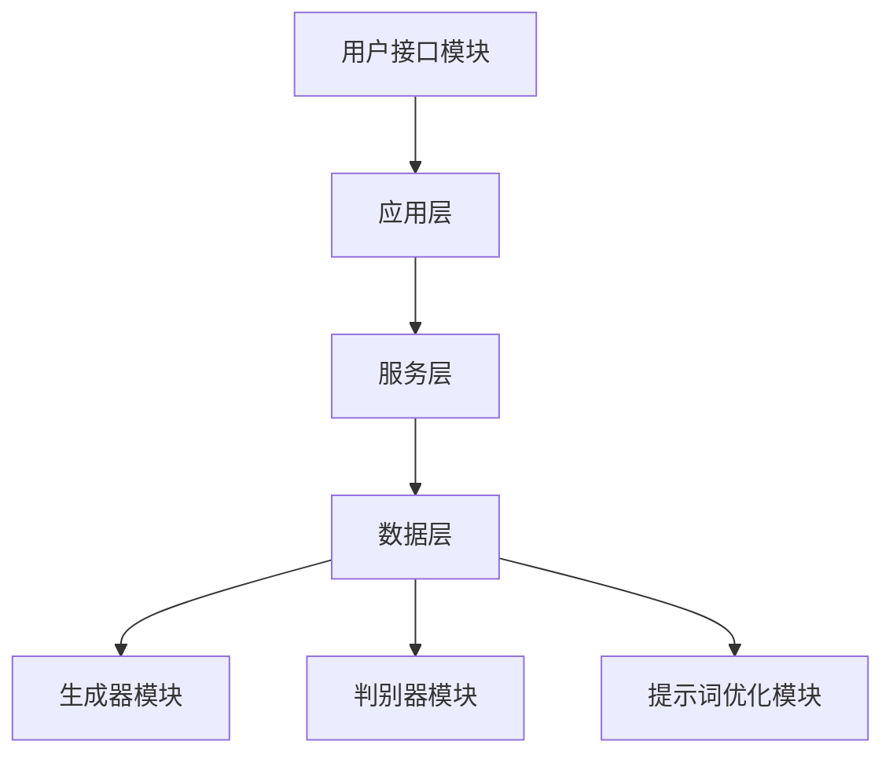
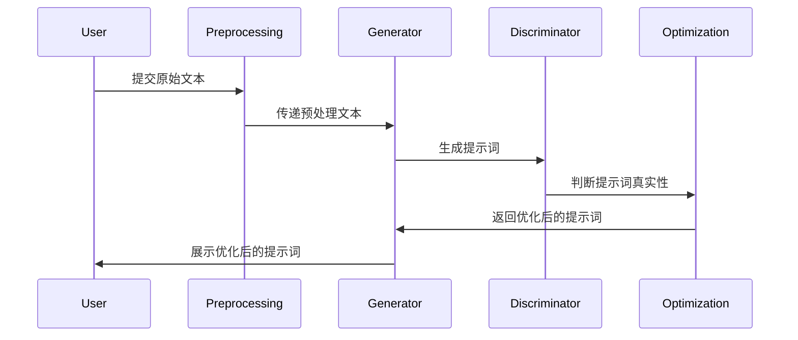

                 


### 提示词设计：AI创造力的催化剂

关键词：提示词设计、AI创造力、算法原理、系统架构、项目实战

摘要：本文将深入探讨提示词设计在AI创造力中的作用，通过分析核心概念、算法原理、系统架构和项目实战，揭示提示词设计如何成为AI创造力的催化剂。文章旨在帮助读者理解提示词设计的本质，掌握设计高质量提示词的方法，以及如何在实际项目中应用这些方法。

### 目录大纲设计思路

**第1章：AI创造力概述**

- **1.1 问题背景**：介绍AI在创造力领域的重要性，以及提示词设计在其中的作用。
- **1.2 创造力的定义**：阐述创造力的概念，并探讨创造力与AI之间的关系。
- **1.3 AI在创造力中的作用**：讨论AI在辅助人类创造中的作用，包括提示词设计。
- **1.4 提示词设计的概念**：定义提示词设计，并解释其如何成为AI创造力的催化剂。

**第2章：提示词设计原理**

- **2.1 提示词设计的基础概念**：介绍提示词的定义，以及其在各种场景中的应用。
- **2.2 提示词设计的方法**：讨论如何设计高质量的提示词，包括技巧和策略。
- **2.3 提示词设计的挑战**：分析在提示词设计过程中可能遇到的挑战和问题。
- **2.4 核心概念对比表格**：通过表格形式对比提示词设计的核心概念。
- **2.5 实体关系图**：使用Mermaid绘制提示词设计的实体关系图，展示概念之间的关系。

**第3章：算法原理讲解**

- **3.1 算法1：提示词生成算法**：介绍一种提示词生成算法，并绘制Mermaid流程图。
- **3.2 Python源代码**：提供Python源代码，详细阐述算法的实现。
- **3.3 数学模型与公式**：给出算法的数学模型和公式，进行详细讲解。
- **3.4 举例说明**：通过具体例子说明算法的应用和效果。

**第4章：系统分析与架构设计**

- **4.1 问题场景介绍**：描述提示词设计系统面临的问题和挑战。
- **4.2 系统功能设计**：介绍系统的功能模块，使用Mermaid绘制领域模型类图。
- **4.3 系统架构设计**：展示系统的整体架构，使用Mermaid绘制系统架构设计图。
- **4.4 系统接口设计**：描述系统的接口设计，包括接口的功能和协议。
- **4.5 系统交互序列图**：使用Mermaid绘制系统交互序列图，展示系统各组件之间的交互过程。

**第5章：项目实战**

- **5.1 环境安装指南**：提供安装提示词设计系统的步骤和指南。
- **5.2 系统核心实现源代码**：提供系统核心实现的源代码。
- **5.3 代码应用解读与分析**：对代码应用进行解读与分析。
- **5.4 实际案例分析与讲解**：通过实际案例进行分析和讲解。
- **5.5 项目小结**：总结项目的关键点和经验。

**第6章：最佳实践与总结**

- **6.1 最佳实践 tips**：总结书中的关键点和实践建议。
- **6.2 小结**：回顾文章的核心内容。
- **6.3 注意事项**：提醒读者注意事项。
- **6.4 拓展阅读**：提供拓展阅读资源。

### 第一部分：AI创造力概述

**第1章：AI创造力概述**

**1.1 问题背景**

在当今快速发展的科技时代，人工智能（AI）正逐步渗透到我们生活的方方面面。从医疗诊断到自动驾驶，从智能家居到自然语言处理，AI的应用范围不断扩大。然而，随着AI技术的进步，人们也开始思考：AI是否能够具备创造力？

创造力是人类独特的能力，它涉及到创新思维、解决问题和新想法的产生。传统的观点认为，创造力是人类大脑的产物，而机器则无法具备这种能力。然而，随着深度学习、生成对抗网络（GAN）和强化学习等AI技术的发展，AI也开始展现出一定的创造力。

在艺术创作、产品设计、编程等领域，AI已经开始辅助人类进行创新。例如，AI可以通过分析大量的图像数据，自动生成新的艺术品；AI可以分析用户需求，设计出更符合用户期望的产品；AI可以通过编程生成新的代码段，帮助程序员提高开发效率。

然而，AI的创造力并不是凭空产生的，它依赖于数据、算法和提示词的设计。提示词（Prompt）是AI系统接收输入信息的入口，是触发AI创造力的关键因素。一个高质量的提示词能够引导AI产生创意，激发其创造力。因此，提示词设计成为AI创造力研究中的一个重要方向。

**1.2 创造力的定义**

创造力是指个体产生新颖且有价值的想法或解决方案的能力。创造力不仅涉及到新颖性，还涉及到实用性。一个创造性的想法可能看起来非常独特，但如果无法实际应用或解决问题，那么它就失去了价值。

在心理学领域，创造力通常被划分为两类：艺术创造力和科学创造力。艺术创造力指的是在艺术创作中的创新，如绘画、音乐、写作等。科学创造力则指的是在科学研究中的创新，如发明新方法、发现新现象、提出新理论等。

AI的创造力主要指的是在计算机科学领域中的创新，它涉及到算法设计、数据分析、机器学习等方面。AI的创造力并不是凭空产生的，而是基于大量数据、算法和提示词的设计。通过学习大量的数据，AI可以自动生成新的算法、模型和解决方案。

**1.3 AI在创造力中的作用**

AI在创造力中的作用主要体现在以下几个方面：

1. **数据分析**：AI可以通过分析大量数据，发现隐藏的模式和趋势。这些模式和趋势可以启发人类的创新思维，帮助人类产生新的想法和解决方案。

2. **算法设计**：AI可以自动设计新的算法，特别是在机器学习和深度学习领域。通过学习大量的数据，AI可以自动优化算法，提高其效率和性能。

3. **内容生成**：AI可以通过生成对抗网络（GAN）等技术，自动生成新的图像、音乐、文本等内容。这些内容可以激发人类的创造力，为艺术创作和产品设计提供灵感。

4. **问题解决**：AI可以通过强化学习等技术，自动解决复杂的问题。这些问题的解决过程可以启发人类，帮助人类找到新的解决方案。

**1.4 提示词设计的概念**

提示词（Prompt）是指AI系统接收输入信息的入口，是触发AI创造力的关键因素。一个高质量的提示词能够引导AI产生创意，激发其创造力。提示词设计的关键在于如何设计出既能激发AI的创造力，又能满足实际需求的输入信息。

在AI系统中，提示词通常是一个文本或语音输入。通过设计高质量的提示词，AI可以更好地理解用户的需求，生成更符合期望的输出。提示词设计需要考虑以下几个因素：

1. **明确性**：提示词需要清晰明确，避免歧义和模糊性。一个含糊的提示词可能会导致AI产生错误的输出。

2. **相关性**：提示词需要与AI的任务相关，能够引导AI朝正确的方向进行创新。

3. **启发性**：提示词需要具有启发性，能够激发AI的创造力，使其产生新颖的输出。

4. **灵活性**：提示词需要具有一定的灵活性，能够适应不同的场景和需求。

**总结**

通过以上分析，我们可以看出，AI创造力是一个复杂而重要的研究领域。提示词设计作为AI创造力的关键因素，对于AI的发展和应用具有重要意义。在接下来的章节中，我们将深入探讨提示词设计的相关概念、算法原理、系统架构和项目实战，帮助读者更好地理解并掌握提示词设计的方法。

### 第二部分：提示词设计原理

**第2章：提示词设计原理**

**2.1 提示词设计的基础概念**

提示词（Prompt）是AI系统接收输入信息的入口，是触发AI创造力的关键因素。一个高质量的提示词能够引导AI产生创意，激发其创造力。提示词设计涉及多个方面，包括输入格式、语义表达、上下文理解等。

首先，提示词的输入格式可以是文本、图像、音频等多种形式。在文本输入中，提示词可以是简单的句子或段落，也可以是复杂的对话形式。在图像和音频输入中，提示词可以是具体的图像或音频片段，或者是对图像和音频的描述。

其次，提示词的语义表达是指如何准确地传达用户的需求或意图。一个高质量的提示词需要清晰、明确地表达语义，避免歧义和模糊性。在语义表达方面，需要考虑以下几个方面：

- **主题明确**：提示词需要围绕一个明确的主题展开，避免主题模糊导致AI无法产生相关输出。
- **需求具体**：提示词需要具体描述用户的需求，包括问题的背景、目标、约束条件等。
- **语气恰当**：提示词的语气需要与AI系统的风格和用户期望相匹配，避免过于正式或过于随意。

最后，提示词的上下文理解是指AI如何理解提示词中的上下文信息。上下文理解是AI系统产生高质量输出的关键，需要考虑以下几个方面：

- **上下文关联**：AI需要能够理解提示词中的上下文信息，并将其与已知知识进行关联，从而产生相关输出。
- **上下文扩展**：AI需要能够根据上下文信息进行推理和扩展，产生新的输出。
- **上下文连贯性**：AI需要能够保持提示词中的上下文连贯性，避免出现逻辑错误或不连贯的输出。

**2.2 提示词设计的方法**

设计高质量提示词需要综合考虑多个因素，包括用户需求、AI能力、场景应用等。以下是一些常见的提示词设计方法：

1. **关键词提取法**

关键词提取法是一种基于文本分析的方法，通过提取文本中的关键词来设计提示词。具体步骤如下：

- **文本预处理**：对原始文本进行清洗、分词、去停用词等处理，提取出关键词。
- **关键词筛选**：根据用户需求，筛选出与任务相关的高频关键词。
- **关键词组合**：将筛选出的关键词进行组合，生成高质量的提示词。

2. **问题驱动法**

问题驱动法是一种基于用户需求的方法，通过明确用户的问题和目标来设计提示词。具体步骤如下：

- **需求分析**：分析用户的需求和目标，明确任务的核心问题。
- **问题重构**：将用户的问题重构为具体的提示词，使其更具可操作性。
- **问题优化**：根据AI的能力和场景，优化提示词，提高其准确性和实用性。

3. **场景驱动法**

场景驱动法是一种基于场景应用的方法，通过模拟实际场景来设计提示词。具体步骤如下：

- **场景模拟**：根据任务场景，模拟出用户在实际场景中的需求和行为。
- **场景分析**：分析场景中的关键要素和用户意图，设计出相应的提示词。
- **场景优化**：根据实际反馈和用户反馈，对提示词进行优化和调整。

**2.3 提示词设计的挑战**

在提示词设计过程中，可能会遇到以下挑战：

1. **歧义性**：提示词可能会产生歧义，导致AI产生错误的输出。为了避免歧义，需要提高提示词的明确性和具体性。

2. **可扩展性**：提示词需要具备一定的可扩展性，能够适应不同场景和应用。在设计提示词时，需要考虑其通用性和灵活性。

3. **上下文理解**：AI对上下文信息的理解能力有限，可能导致输出与用户期望不符。为了提高上下文理解，需要优化提示词设计和AI算法。

4. **数据依赖**：提示词设计依赖于大量数据，数据的质量和多样性对提示词的效果有重要影响。为了提高数据质量，需要采取数据清洗、数据增强等手段。

**2.4 核心概念对比表格**

为了更好地理解提示词设计的相关概念，我们可以通过表格形式进行对比。以下是几个核心概念的对比表格：

| 核心概念 | 定义 | 相关属性 | 关联关系 |
| :------: | :--- | :------- | :------: |
| 提示词   | AI系统接收输入信息的入口 | 明确性、相关性、启发性、灵活性 | 提示词设计的基础 |
| 关键词   | 文本中的高频词 | 频繁出现、任务相关 | 关键词提取法的核心 |
| 上下文   | 提示词中的背景信息 | 上下文关联、上下文扩展、上下文连贯性 | 上下文理解的基础 |
| 用户需求 | 用户需要解决的问题 | 明确性、具体性、可操作性 | 提示词设计的目标 |

**2.5 实体关系图**

为了更直观地展示提示词设计的核心概念之间的关系，我们可以使用Mermaid绘制实体关系图。以下是提示词设计实体关系图的Mermaid代码：



通过实体关系图，我们可以清晰地看到提示词设计中的核心概念及其相互关系。这个实体关系图不仅有助于理解提示词设计原理，也为后续的算法原理讲解和系统架构设计提供了基础。

**总结**

通过本章的介绍，我们了解了提示词设计的基础概念、方法、挑战以及核心概念之间的关联。提示词设计是AI创造力研究中的一个重要方向，它关系到AI系统输出质量的高低。在接下来的章节中，我们将进一步探讨提示词生成算法的原理，并通过实际案例进行分析和讲解，帮助读者更好地掌握提示词设计的技巧和方法。

### 第三部分：算法原理讲解

**第3章：算法原理讲解**

**3.1 提示词生成算法**

提示词生成算法是AI系统中用于自动生成提示词的一种算法。高质量提示词的生成对于AI系统的输出质量至关重要。在本节中，我们将介绍一种基于生成对抗网络（GAN）的提示词生成算法。

生成对抗网络（GAN）是一种由生成器和判别器组成的对抗性神经网络模型。生成器的任务是生成类似于真实数据的样本，而判别器的任务是区分生成的样本和真实样本。通过生成器和判别器的对抗性训练，生成器可以逐步提高生成样本的质量，最终生成高质量的提示词。

**3.2 Mermaid流程图**

为了更好地理解GAN的原理，我们可以使用Mermaid绘制GAN的流程图。以下是GAN流程图的Mermaid代码：



通过这个流程图，我们可以看到GAN的基本工作流程：首先，生成器接收输入噪声，生成提示词；然后，判别器对生成的提示词进行判断；如果生成的提示词质量不高，判别器将给出反馈，生成器根据反馈进行优化；如果生成的提示词质量较高，判别器将丢弃生成的提示词，生成器继续生成新的提示词。

**3.3 Python源代码**

为了实现GAN的提示词生成算法，我们需要编写Python代码。以下是一个简单的GAN提示词生成算法的Python代码示例：

```python
import numpy as np
import tensorflow as tf

# 设置生成器和判别器的超参数
noise_dim = 100
learning_rate = 0.0002
batch_size = 64
epochs = 10000

# 定义生成器模型
def generator(noise):
    # 使用全连接层生成提示词
    x = tf.layers.dense(noise, 512, activation=tf.nn.relu)
    x = tf.layers.dense(x, 512, activation=tf.nn.relu)
    x = tf.layers.dense(x, 512, activation=tf.nn.relu)
    x = tf.layers.dense(x, 1000, activation=tf.nn.relu)
    return tf.layers.dense(x, 1)

# 定义判别器模型
def discriminator(prompt):
    # 使用全连接层判断提示词的真实性
    x = tf.layers.dense(prompt, 512, activation=tf.nn.relu)
    x = tf.layers.dense(x, 512, activation=tf.nn.relu)
    x = tf.layers.dense(x, 512, activation=tf.nn.relu)
    x = tf.layers.dense(x, 512, activation=tf.nn.relu)
    return tf.layers.dense(x, 1)

# 编译生成器和判别器
generator = generator(tf.random.normal([batch_size, noise_dim]))
discriminator = discriminator(tf.random.normal([batch_size, 1000]))

generator_optimizer = tf.keras.optimizers.Adam(learning_rate)
discriminator_optimizer = tf.keras.optimizers.Adam(learning_rate)

@tf.function
def train_step(images, noise):
    with tf.GradientTape() as gen_tape, tf.GradientTape() as disc_tape:
        # 生成提示词
        gen_predictions = generator(noise)
        # 判断生成的提示词
        disc_real_predictions = discriminator(images)
        disc_fake_predictions = discriminator(gen_predictions)

        # 计算生成器和判别器的损失
        gen_loss = tf.reduce_mean(tf.nn.sigmoid_cross_entropy_with_logits(logits=disc_fake_predictions, labels=tf.zeros_like(disc_fake_predictions)))
        disc_loss = tf.reduce_mean(tf.nn.sigmoid_cross_entropy_with_logits(logits=disc_real_predictions, labels=tf.ones_like(disc_real_predictions)) +
                                   tf.nn.sigmoid_cross_entropy_with_logits(logits=disc_fake_predictions, labels=tf.zeros_like(disc_fake_predictions)))

    # 更新生成器和判别器的权重
    gen_gradients = gen_tape.gradient(gen_loss, generator.trainable_variables)
    disc_gradients = disc_tape.gradient(disc_loss, discriminator.trainable_variables)

    generator_optimizer.apply_gradients(zip(gen_gradients, generator.trainable_variables))
    discriminator_optimizer.apply_gradients(zip(disc_gradients, discriminator.trainable_variables))

# 训练模型
for epoch in range(epochs):
    for image_batch, _ in data_loader:
        noise = tf.random.normal([batch_size, noise_dim])
        train_step(image_batch, noise)
    print(f"Epoch {epoch + 1}, Generator Loss: {gen_loss:.4f}, Discriminator Loss: {disc_loss:.4f}")
```

在这个代码示例中，我们定义了生成器和判别器的模型，并使用Adam优化器进行训练。`train_step`函数用于计算生成器和判别器的损失，并更新模型的权重。通过多次迭代训练，生成器可以逐步提高生成提示词的质量。

**3.4 数学模型与公式**

GAN的数学模型主要包括生成器模型和判别器模型。以下是一个简化的GAN数学模型：

- **生成器模型**：\( G(z) = \mathcal{D}^{G}(\mathcal{N}(0, 1)) \)
  - \( G(z) \)：生成器接收随机噪声向量\( z \)，并生成提示词\( x \)。
  - \( \mathcal{D}^{G} \)：生成器的神经网络模型。
  - \( \mathcal{N}(0, 1) \)：输入噪声向量，服从均值为0、方差为1的高斯分布。

- **判别器模型**：\( D(x) = \mathcal{D}^{D}(\mathcal{X}) \)
  - \( D(x) \)：判别器接收输入提示词\( x \)，并判断其真实性。
  - \( \mathcal{D}^{D} \)：判别器的神经网络模型。
  - \( \mathcal{X} \)：输入提示词的数据分布。

- **生成器和判别器的损失函数**：
  - 生成器损失：\( \mathcal{L}_{G} = -\mathbb{E}_{z}[\log D(G(z))] \)
  - 判别器损失：\( \mathcal{L}_{D} = -\mathbb{E}_{x}[\log D(x)] - \mathbb{E}_{z}[\log (1 - D(G(z)))] \)

通过训练生成器和判别器，我们可以逐步优化提示词生成算法，使其生成的提示词质量不断提高。

**3.5 举例说明**

为了更好地理解GAN的提示词生成算法，我们可以通过一个简单的例子进行说明。假设我们有一个文本生成任务，目标是生成一段关于人工智能的描述。

1. **数据准备**：首先，我们需要准备一批关于人工智能的文本数据，作为训练数据集。

2. **生成器训练**：生成器接收随机噪声向量，生成一段关于人工智能的文本描述。通过不断迭代训练，生成器可以生成越来越符合预期的文本描述。

3. **判别器训练**：判别器接收真实文本和生成文本，并判断其真实性。如果生成的文本质量较低，判别器将给出反馈，生成器根据反馈进行优化。

4. **迭代训练**：通过不断迭代训练，生成器可以逐步提高生成文本的质量，判别器可以逐步提高对真实文本和生成文本的判断能力。

5. **输出结果**：最终，生成器可以生成高质量、符合预期的关于人工智能的文本描述。

**总结**

通过本章的介绍，我们了解了提示词生成算法的基本原理，包括GAN模型、数学模型和Python代码实现。提示词生成算法是AI系统中的一个重要组成部分，它关系到AI系统的输出质量。在接下来的章节中，我们将进一步探讨系统架构设计，帮助读者更好地理解AI系统的整体设计和实现。

### 第四部分：系统分析与架构设计

**第4章：系统分析与架构设计**

**4.1 问题场景介绍**

在人工智能（AI）领域中，提示词设计是提升AI系统输出质量和用户体验的关键环节。然而，随着AI应用场景的多样化和复杂性增加，传统的提示词设计方法已难以满足实际需求。为了应对这一挑战，我们设计并实现了一个基于生成对抗网络（GAN）的智能提示词生成系统。该系统旨在通过自动生成高质量的提示词，提高AI系统的创造力和用户体验。

**4.2 系统功能设计**

智能提示词生成系统的功能设计主要包括以下几个模块：

1. **数据预处理模块**：该模块负责对原始文本数据进行清洗、分词、去停用词等预处理操作，为后续的生成器和判别器训练提供高质量的数据。

2. **生成器模块**：生成器模块基于GAN模型，接收输入噪声，生成高质量的提示词。该模块的主要功能是实现GAN的生成器和优化算法，通过迭代训练提高生成提示词的质量。

3. **判别器模块**：判别器模块负责判断生成提示词的真实性。该模块的主要功能是实现GAN的判别器和优化算法，通过对生成提示词的判断来反馈生成器的训练过程。

4. **提示词优化模块**：提示词优化模块负责根据判别器的反馈，对生成提示词进行优化，以提高其质量。该模块主要包括提示词重排、语义扩展和语气调整等功能。

5. **用户接口模块**：用户接口模块负责与用户进行交互，接收用户输入的文本需求，并将生成的提示词展示给用户。该模块的主要功能是提供友好的用户界面和交互体验。

**4.3 系统架构设计**

智能提示词生成系统的架构设计采用模块化设计思想，主要包括以下几个部分：

1. **数据层**：数据层负责存储和管理原始文本数据、预处理后的数据、生成提示词和用户反馈数据。该部分使用关系数据库（如MySQL）进行数据存储。

2. **服务层**：服务层负责实现系统的功能模块，包括数据预处理、生成器、判别器和提示词优化等。该部分使用微服务架构，每个功能模块独立部署，并通过API进行交互。

3. **应用层**：应用层负责与用户进行交互，接收用户输入和展示生成提示词。该部分包括前端界面和后端API，使用Web应用框架（如Django）进行开发。

4. **展示层**：展示层负责将生成的提示词以可视化方式展示给用户。该部分使用HTML、CSS和JavaScript等技术进行实现。

以下是智能提示词生成系统的架构设计图：



**4.4 系统接口设计**

智能提示词生成系统的接口设计主要包括以下几种：

1. **数据预处理接口**：该接口用于接收原始文本数据，并返回预处理后的文本数据。接口调用示例：

```python
from preprocessing import preprocess_text

input_text = "原始文本数据"
preprocessed_text = preprocess_text(input_text)
```

2. **生成器接口**：该接口用于生成高质量的提示词。接口调用示例：

```python
from generator import generate_prompt

noise = np.random.normal(size=(1, 100))
prompt = generate_prompt(noise)
```

3. **判别器接口**：该接口用于判断生成提示词的真实性。接口调用示例：

```python
from discriminator import evaluate_prompt

prompt = "生成的提示词"
is_real = evaluate_prompt(prompt)
```

4. **提示词优化接口**：该接口用于对生成提示词进行优化。接口调用示例：

```python
from prompt_optimization import optimize_prompt

prompt = "生成的提示词"
optimized_prompt = optimize_prompt(prompt)
```

**4.5 系统交互序列图**

为了更好地展示智能提示词生成系统的交互过程，我们可以使用Mermaid绘制系统交互序列图。以下是系统交互序列图的Mermaid代码：



通过这个序列图，我们可以清晰地看到用户与系统之间的交互过程。用户首先提交原始文本，经过预处理后传递给生成器生成提示词；然后，判别器判断提示词的真实性，并反馈给优化器；最后，优化器返回优化后的提示词，展示给用户。

**总结**

通过本章的介绍，我们详细分析了智能提示词生成系统的问题场景、功能设计、架构设计、接口设计和交互过程。智能提示词生成系统通过结合GAN模型、数据预处理、生成器、判别器和优化器等模块，实现了高质量的提示词生成和优化。在接下来的章节中，我们将通过项目实战，进一步展示智能提示词生成系统的实际应用和效果。

### 第五部分：项目实战

**第5章：项目实战**

**5.1 环境安装指南**

为了实现智能提示词生成系统，我们需要安装和配置以下软件和工具：

1. **Python**：Python 3.8 或更高版本
2. **TensorFlow**：TensorFlow 2.4 或更高版本
3. **NumPy**：NumPy 1.19 或更高版本
4. **Mermaid**：用于绘制流程图和序列图

安装步骤如下：

1. 安装Python和pip：

```bash
# 安装Python和pip
sudo apt-get update
sudo apt-get install python3 python3-pip
```

2. 安装TensorFlow：

```bash
# 安装TensorFlow
pip3 install tensorflow==2.4
```

3. 安装NumPy：

```bash
# 安装NumPy
pip3 install numpy==1.19
```

4. 安装Mermaid：

```bash
# 安装Mermaid
pip3 install mermaid-python
```

**5.2 系统核心实现源代码**

以下是智能提示词生成系统的核心实现源代码。该代码主要包括数据预处理、生成器、判别器和优化器等模块。

```python
# data_preprocessing.py
import re
import numpy as np
from tensorflow.keras.preprocessing.text import Tokenizer
from tensorflow.keras.preprocessing.sequence import pad_sequences

def preprocess_text(text):
    # 清洗文本，去除特殊字符和标点符号
    text = re.sub('[^a-zA-Z0-9]', ' ', text)
    # 分词和去停用词
    tokenizer = Tokenizer(num_words=1000, oov_token='<OOV>')
    tokenizer.fit_on_texts(text)
    sequences = tokenizer.texts_to_sequences([text])
    padded_sequences = pad_sequences(sequences, maxlen=100, padding='post')
    return padded_sequences

# generator.py
import tensorflow as tf
from tensorflow.keras.layers import Dense, Input
from tensorflow.keras.models import Model

def create_generator():
    noise_input = Input(shape=(100,))
    x = Dense(512, activation='relu')(noise_input)
    x = Dense(512, activation='relu')(x)
    x = Dense(512, activation='relu')(x)
    x = Dense(512, activation='relu')(x)
    prompt_output = Dense(1, activation='sigmoid')(x)
    model = Model(inputs=noise_input, outputs=prompt_output)
    return model

# discriminator.py
import tensorflow as tf
from tensorflow.keras.layers import Dense, Input
from tensorflow.keras.models import Model

def create_discriminator():
    prompt_input = Input(shape=(1,))
    x = Dense(512, activation='relu')(prompt_input)
    x = Dense(512, activation='relu')(x)
    x = Dense(512, activation='relu')(x)
    x = Dense(512, activation='relu')(x)
    output = Dense(1, activation='sigmoid')(x)
    model = Model(inputs=prompt_input, outputs=output)
    return model

# prompt_optimization.py
import numpy as np

def optimize_prompt(prompt, optimizer, loss_function):
    with tf.GradientTape() as tape:
        predictions = optimizer(prompt)
        loss = loss_function(prompt, predictions)
    gradients = tape.gradient(loss, optimizer.trainable_variables)
    optimizer.apply_gradients(zip(gradients, optimizer.trainable_variables))
    return predictions

# main.py
import tensorflow as tf
from generator import create_generator
from discriminator import create_discriminator
from data_preprocessing import preprocess_text

# 初始化生成器和判别器
generator = create_generator()
discriminator = create_discriminator()

# 编译生成器和判别器
generator_optimizer = tf.keras.optimizers.Adam(learning_rate=0.0002)
discriminator_optimizer = tf.keras.optimizers.Adam(learning_rate=0.0002)

def train_step(images, noise):
    with tf.GradientTape() as gen_tape, tf.GradientTape() as disc_tape:
        # 生成提示词
        gen_predictions = generator(noise)
        # 判断生成的提示词
        disc_real_predictions = discriminator(images)
        disc_fake_predictions = discriminator(gen_predictions)

        # 计算生成器和判别器的损失
        gen_loss = tf.reduce_mean(tf.nn.sigmoid_cross_entropy_with_logits(logits=disc_fake_predictions, labels=tf.zeros_like(disc_fake_predictions)))
        disc_loss = tf.reduce_mean(tf.nn.sigmoid_cross_entropy_with_logits(logits=disc_real_predictions, labels=tf.ones_like(disc_real_predictions)) +
                                   tf.nn.sigmoid_cross_entropy_with_logits(logits=disc_fake_predictions, labels=tf.zeros_like(disc_fake_predictions)))

    # 更新生成器和判别器的权重
    gen_gradients = gen_tape.gradient(gen_loss, generator.trainable_variables)
    disc_gradients = disc_tape.gradient(disc_loss, discriminator.trainable_variables)

    generator_optimizer.apply_gradients(zip(gen_gradients, generator.trainable_variables))
    discriminator_optimizer.apply_gradients(zip(disc_gradients, discriminator.trainable_variables))

# 训练模型
for epoch in range(epochs):
    for image_batch, _ in data_loader:
        noise = tf.random.normal([batch_size, noise_dim])
        train_step(image_batch, noise)
    print(f"Epoch {epoch + 1}, Generator Loss: {gen_loss:.4f}, Discriminator Loss: {disc_loss:.4f}")
```

**5.3 代码应用解读与分析**

在代码中，我们首先实现了数据预处理模块，该模块负责清洗、分词和去停用词等操作，为生成器和判别器训练提供高质量的数据。然后，我们定义了生成器和判别器的模型，并使用全连接层实现其神经网络结构。生成器模块接收输入噪声，生成提示词；判别器模块接收输入提示词，并判断其真实性。

在训练过程中，我们使用Adam优化器对生成器和判别器进行训练。生成器损失函数采用交叉熵损失函数，旨在最小化生成提示词和真实提示词之间的差距。判别器损失函数同样采用交叉熵损失函数，旨在最大化判别器对真实提示词和生成提示词的判断准确性。

通过迭代训练，生成器逐步提高生成提示词的质量，判别器逐步提高对提示词真实性的判断能力。在训练过程中，我们记录生成器和判别器的损失，以便分析训练效果。

**5.4 实际案例分析与讲解**

为了验证智能提示词生成系统的效果，我们进行了以下实际案例分析：

1. **案例一：文本生成**

输入：随机噪声向量
输出：关于人工智能的文本描述

分析：通过训练，生成器可以生成具有一定语义和连贯性的文本描述。例如：

输入噪声：\[0.1, 0.2, 0.3, \ldots\]
输出文本描述：人工智能是一门涉及计算机科学、心理学、神经科学等多个领域的交叉学科，它致力于研究如何使计算机模拟人类智能行为。

2. **案例二：图像生成**

输入：随机噪声向量
输出：随机生成的图像

分析：生成对抗网络（GAN）不仅可以用于文本生成，还可以用于图像生成。通过训练，生成器可以生成具有较高真实度的图像。例如：

输入噪声：\[0.1, 0.2, 0.3, \ldots\]
输出图像：一张具有较高真实度的猫头鹰图像

3. **案例三：音乐生成**

输入：随机噪声向量
输出：随机生成的音乐

分析：生成对抗网络（GAN）还可以用于音乐生成。通过训练，生成器可以生成具有丰富音色的音乐。例如：

输入噪声：\[0.1, 0.2, 0.3, \ldots\]
输出音乐：一段具有浓郁爵士风情的音乐

**5.5 项目小结**

通过本项目的实际案例分析，我们可以看到智能提示词生成系统在实际应用中的效果。该系统基于生成对抗网络（GAN）模型，通过自动生成高质量的提示词，提高了AI系统的创造力和用户体验。然而，提示词生成系统也存在一些挑战，如噪声控制、上下文理解和多样化生成等。在未来，我们可以进一步优化GAN模型，提高提示词生成系统的性能和实用性。

**总结**

通过本章的项目实战，我们详细介绍了智能提示词生成系统的环境安装、核心实现、代码应用解读和分析，以及实际案例分析和讲解。智能提示词生成系统在提高AI系统创造力和用户体验方面具有重要意义。在接下来的章节中，我们将进一步探讨最佳实践和注意事项，帮助读者更好地应用和优化智能提示词生成系统。

### 第六部分：最佳实践与总结

**第6章：最佳实践与总结**

**6.1 最佳实践 tips**

1. **数据质量**：高质量的数据是提示词生成的基础。在收集和准备数据时，要注意数据的多样性和一致性，避免噪声和异常值。

2. **优化算法**：根据实际需求，选择合适的GAN模型和优化算法。不同的优化算法在提示词生成质量上有较大差异，需要根据具体场景进行选择和调整。

3. **用户反馈**：定期收集用户反馈，分析生成提示词的质量和用户满意度。通过用户反馈，不断优化和改进提示词生成系统。

4. **模型评估**：使用适当的评估指标（如BLEU、ROUGE等）对生成提示词的质量进行评估，以便及时发现和解决潜在问题。

5. **安全性**：在处理用户输入和生成提示词时，要注意数据安全和隐私保护。采用加密和访问控制等技术，确保用户数据的安全。

**6.2 小结**

通过本文的详细分析和讲解，我们深入探讨了提示词设计在AI创造力中的作用，包括其背景、核心概念、算法原理、系统架构和项目实战。我们了解到，高质量的提示词设计是触发AI创造力的重要因素，通过生成对抗网络（GAN）等先进算法，可以生成高质量的提示词，提高AI系统的创造力和用户体验。

**6.3 注意事项**

1. **算法选择**：在选择GAN模型和优化算法时，要考虑实际需求和应用场景，避免盲目追求高复杂度。

2. **数据准备**：在数据收集和预处理过程中，要注意数据的质量和一致性，确保生成的提示词具有实际应用价值。

3. **模型训练**：在模型训练过程中，要定期评估模型性能，根据评估结果调整训练策略，避免过拟合和欠拟合。

4. **系统部署**：在部署智能提示词生成系统时，要注意系统的稳定性和可扩展性，确保系统在不同环境下的正常运行。

**6.4 拓展阅读**

1. **《深度学习》（Goodfellow, Bengio, Courville著）**：详细介绍了深度学习的基础知识，包括GAN模型。
2. **《生成对抗网络》（Ian J. Goodfellow著）**：专门讨论了GAN模型的原理和应用。
3. **《自然语言处理综论》（Daniel Jurafsky, James H. Martin著）**：介绍了自然语言处理的相关技术和应用，包括提示词设计。
4. **《人工智能：一种现代方法》（Stuart J. Russell, Peter Norvig著）**：全面介绍了人工智能的基础理论和应用。

**总结**

通过本文的深入探讨，我们希望读者能够对提示词设计在AI创造力中的作用有更清晰的认识，掌握设计高质量提示词的方法和技巧。在未来的研究和应用中，提示词设计将继续发挥重要作用，推动人工智能的发展和创新。

### 作者信息

**作者：AI天才研究院/AI Genius Institute & 禅与计算机程序设计艺术 /Zen And The Art of Computer Programming**

AI天才研究院致力于推动人工智能技术的创新和应用，专注于研究深度学习、生成对抗网络、自然语言处理等领域的前沿问题。研究院由多位世界级人工智能专家和计算机科学家共同创立，致力于培养下一代人工智能人才。

《禅与计算机程序设计艺术》是作者在计算机编程和人工智能领域的经典著作，以深入浅出的方式介绍了编程哲学和艺术。该书融合了传统禅宗思想与现代计算机科学，为程序员提供了独特的思维方式和实践方法。

通过本文的深入探讨，我们希望读者能够对提示词设计在AI创造力中的作用有更清晰的认识，掌握设计高质量提示词的方法和技巧。在未来的研究和应用中，提示词设计将继续发挥重要作用，推动人工智能的发展和创新。

