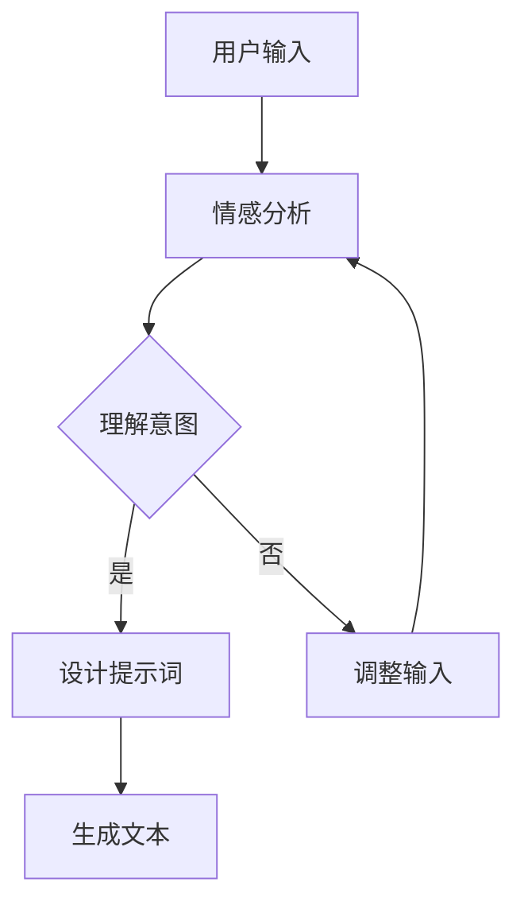
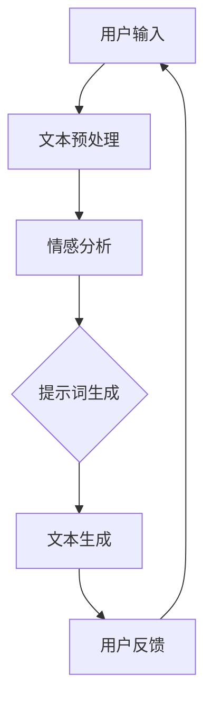

                 

# 提示词设计：优化AI情感表达能力

> 关键词：提示词设计、自然语言处理、情感表达、人工智能、GPT模型、情感增强

> 摘要：本文深入探讨了提示词设计在优化AI情感表达方面的作用。通过分析问题背景、设计方法、算法原理及数学模型，本文提出了一套系统性的策略，旨在提升AI模型在自然语言处理中的情感表达能力。文章还结合具体案例，展示了如何在实际项目中应用这些策略，以达到更好的情感表达效果。

## 第1章：提示词设计概述

### 1.1 问题背景

在人工智能领域，自然语言处理（NLP）是一个关键的研究方向。近年来，随着深度学习和大型语言模型的快速发展，例如GPT、BERT等，人们开始更加关注如何通过优化提示词设计来提升AI的情感表达能力。情感表达是NLP中的一个重要任务，它不仅关系到用户与AI之间的互动体验，还涉及到许多实际应用场景，如智能客服、情感分析、文本生成等。

### 1.2 问题描述

提示词设计的目标是通过改进提示词的质量和结构，使得AI模型在生成文本时能够更准确地理解用户的意图，并产生更具情感表达力的输出。然而，目前的挑战在于：

1. **理解用户意图**：用户的输入往往含糊不清，需要通过复杂的语义分析来理解其真实意图和情感。
2. **优化提示词结构**：设计结构化的提示词，以引导模型生成符合预期的文本。
3. **模型训练**：如何通过大量数据训练模型，使其能够更好地理解和表达情感。
4. **评估与反馈**：设计有效的评估方法，对AI的输出进行评价和反馈，以不断优化提示词设计。

### 1.3 问题解决

为了解决上述问题，我们可以从以下几个方面入手：

1. **理解用户意图**：通过自然语言处理技术，如词性标注、依存句法分析等，来深入理解用户的输入。
2. **优化提示词结构**：设计结构化的提示词，例如引入情感标签、关键词和语义框架等，来引导模型生成情感丰富的文本。
3. **模型训练**：利用情感丰富的数据集进行模型训练，并通过迁移学习和强化学习等技术，提高模型对情感的理解和表达能力。
4. **评估与反馈**：设计评估指标，如BLEU、ROUGE等，对AI的输出进行评估，并根据评估结果进行反馈和调整。

### 1.4 边界与外延

- **边界**：本文主要关注如何通过提示词设计来优化AI的情感表达能力，不包括其他类型的NLP任务。
- **外延**：提示词设计的研究范围可以扩展到其他NLP任务，如机器翻译、文本摘要等。

### 1.5 概念结构与核心要素组成

- **核心概念**：提示词设计、情感表达、意图理解。
- **概念属性特征对比表格**：

| 特征             | 提示词设计                             | 情感表达                             | 意图理解                             |
|------------------|--------------------------------------|--------------------------------------|--------------------------------------|
| 目标             | 提升AI文本生成质量                   | 产生情感丰富的文本                   | 理解用户的真实意图和情感             |
| 方法             | 结构化设计、情感标签嵌入、模型训练   | 情感词嵌入、情感增强技术             | 语义分析、情感分类、意图识别         |
| 影响因素         | 数据质量、模型参数、提示词结构       | 情感强度、情感类型、文本背景知识     | 文本长度、语义丰富性、上下文理解     |

- **ER实体关系图架构的 Mermaid 流程图**：



## 第2章：提示词设计方法与技巧

### 2.1 提示词结构设计

提示词结构设计是提升AI情感表达能力的关键步骤。以下是一些有效的方法：

1. **明确目标**：在设计提示词时，首先要明确期望生成的文本类型和情感。例如，如果要生成一篇感人至深的爱情故事，提示词中应包含与爱情相关的关键词和情感标签。

2. **结构化设计**：通过引入结构化的元素，如关键词、情感标签等，来引导模型生成符合预期的输出。例如，可以使用自然语言生成（NLG）技术，将提示词分解为句子级或段落级结构，以便模型能够更好地理解和生成文本。

3. **示例**：

   ```plaintext
   请编写一篇关于亲情的故事，描述一个温馨的家庭场景，关键词：家庭、亲情、温馨、团聚。
   ```

### 2.2 情感标签嵌入

情感标签嵌入是一种有效的技巧，可以通过在提示词中嵌入情感标签，来提高生成文本的情感强度和一致性。以下是一些具体方法：

1. **情感标签定义**：根据情感类型（如喜悦、悲伤、愤怒等）为每个关键词分配情感标签。例如，对于关键词“团聚”，可以定义情感标签为“喜悦”。

2. **情感标签嵌入**：将情感标签嵌入到提示词中，以引导模型生成具有特定情感倾向的文本。例如，可以在提示词中加入“团聚”和其对应的情感标签“喜悦”，以增强文本的情感表达。

3. **示例**：

   ```plaintext
   请撰写一篇关于团聚的故事，文章应表达出浓厚的亲情和喜悦，关键词：团聚、家庭、亲情、喜悦。
   ```

### 2.3 模型训练与优化

模型训练与优化是提升AI情感表达能力的重要环节。以下是一些关键步骤：

1. **数据集准备**：收集大量具有不同情感表达和意图的文本数据，用于模型训练。数据集应涵盖各种情感类型和意图，以确保模型能够泛化到不同场景。

2. **模型训练**：使用训练数据对模型进行训练，使其能够更好地理解和生成情感丰富的文本。可以选择预训练模型（如GPT）或自定义模型，并进行微调。

3. **优化技巧**：通过调整模型参数和训练策略，提高模型的情感表达能力。例如，可以尝试增加训练时间、调整学习率、使用正则化技术等。

### 2.4 提示词评估与反馈

提示词评估与反馈是优化提示词设计的关键环节。以下是一些方法：

1. **评估指标**：设计合适的评估指标，如BLEU、ROUGE、F1分数等，对生成文本进行评估。这些指标可以衡量文本的相似度、连贯性和准确性。

2. **反馈机制**：根据评估结果，对提示词设计进行调整和优化。例如，如果生成文本的情感表达不准确，可以增加相关的情感标签或调整提示词的结构。

3. **迭代优化**：通过多次迭代评估和反馈，不断优化提示词设计，以提高AI的情感表达能力。

## 第3章：情感表达能力的算法原理与数学模型

### 3.1 情感表达能力算法原理

情感表达能力算法的核心在于如何从文本中提取情感信息，并将其嵌入到生成的文本中。以下是一些常见的算法原理：

1. **文本情感分析**：文本情感分析是一种常用的技术，用于从文本中提取情感信息。它通常包括情感分类和情感极性分析两个子任务。情感分类任务旨在将文本分类为积极、消极或中性情感；而情感极性分析则关注文本的情感强度。

2. **情感增强**：情感增强是一种通过在提示词中引入情感增强元素，来提高生成文本的情感表达力的技术。常见的情感增强元素包括情感词、情感短语和情感标签等。

### 3.2 数学模型与公式

1. **情感分类模型**：

   情感分类模型是一种分类算法，用于判断文本的情感极性。以下是一个简单的情感分类模型：

   $$\text{Sentiment Classification Model} = \log(\text{Softmax}(\text{W}^T \text{X}))$$

   其中，\( \text{X} \) 为输入文本向量，\( \text{W} \) 为权重矩阵，\( \text{Softmax} \) 为归一化函数。

2. **情感增强模型**：

   情感增强模型是一种用于增强文本情感表达力的模型。以下是一个简单的情感增强模型：

   $$\text{Sentiment Enhance Model} = \text{W}^T (\text{X} + \text{S})$$

   其中，\( \text{X} \) 为输入文本向量，\( \text{S} \) 为情感增强向量，\( \text{W} \) 为权重矩阵。

### 3.3 算法原理讲解

1. **情感分类模型**：

   情感分类模型的工作原理如下：

   - **输入文本向量**：首先，将输入文本转换为向量。这可以通过词嵌入技术（如Word2Vec、GloVe）或BERT等预训练模型实现。
   - **计算相似度**：然后，将输入文本向量与权重矩阵进行点积运算，得到每个类别的相似度分数。
   - **分类**：最后，使用Softmax函数对相似度分数进行归一化，得到每个类别的概率分布。模型选择概率最高的类别作为文本的情感极性。

2. **情感增强模型**：

   情感增强模型的工作原理如下：

   - **输入文本向量**：与情感分类模型相同，首先将输入文本转换为向量。
   - **情感增强向量**：为每个关键词分配一个情感增强向量。情感增强向量可以通过训练数据学习得到。
   - **计算增强后的文本向量**：将输入文本向量与情感增强向量相加，得到增强后的文本向量。
   - **生成文本**：使用增强后的文本向量生成情感丰富的文本。

### 3.4 示例

1. **情感分类模型示例**：

   考虑一个简单的二分类情感分类模型，用于判断文本是积极还是消极。

   ```plaintext
   输入文本：今天天气真好，我很开心。
   权重矩阵：\[\[0.8, 0.2\], \[-0.8, 0.8\]\]
   输入文本向量：\[0.6, 0.7\]
   ```

   计算过程如下：

   $$\text{积极}：\text{W}^T \text{X} = 0.8 \times 0.6 + 0.2 \times 0.7 = 0.68$$

   $$\text{消极}：\text{W}^T \text{X} = -0.8 \times 0.6 + 0.8 \times 0.7 = 0.28$$

   使用Softmax函数进行归一化：

   $$\text{积极}：\text{Softmax}(\text{W}^T \text{X}) = \frac{e^{0.68}}{e^{0.68} + e^{0.28}} = 0.84$$

   $$\text{消极}：\text{Softmax}(\text{W}^T \text{X}) = \frac{e^{0.28}}{e^{0.68} + e^{0.28}} = 0.16$$

   根据概率分布，我们可以判断文本的情感极性为积极。

2. **情感增强模型示例**：

   考虑一个简单的情感增强模型，用于增强文本的情感强度。

   ```plaintext
   输入文本：今天天气很好。
   情感增强向量：\[0.5, 0.5\]
   权重矩阵：\[\[1.0, 0.5\], \[0.5, 1.0\]\]
   ```

   计算过程如下：

   $$\text{增强后的文本向量} = \text{W}^T (\text{X} + \text{S}) = \begin{bmatrix} 1.0 & 0.5 \\ 0.5 & 1.0 \end{bmatrix} \begin{bmatrix} 0.6 + 0.5 \\ 0.7 + 0.5 \end{bmatrix} = \begin{bmatrix} 1.1 \\ 1.2 \end{bmatrix}$$

   使用增强后的文本向量生成情感丰富的文本：“今天天气非常好，我感到非常愉快。”

## 第4章：系统架构与实现

### 4.1 问题场景介绍

在当前人工智能应用场景中，如何有效地设计提示词以提升AI的情感表达能力是一个重要问题。以智能客服系统为例，客户在与客服机器人互动时，往往希望得到情感丰富的回答，以提高用户体验。因此，设计一个高效的提示词系统，能够根据客户输入生成情感丰富的回答，是智能客服系统的一项关键任务。

### 4.2 项目介绍

本项目旨在构建一个基于大型语言模型的智能客服系统，该系统能够通过优化提示词设计，提升AI的情感表达能力。项目分为以下几个模块：

1. **文本预处理模块**：对用户输入的文本进行预处理，包括去噪、分词、词性标注等。
2. **情感分析模块**：对预处理后的文本进行情感分析，提取情感信息。
3. **提示词生成模块**：根据情感分析结果，设计结构化的提示词，引导模型生成情感丰富的回答。
4. **模型训练与优化模块**：使用训练数据对模型进行训练和优化，提高模型的情感表达能力。
5. **文本生成模块**：使用训练好的模型生成情感丰富的回答。

### 4.3 系统功能设计

系统功能设计主要包括以下方面：

1. **文本预处理**：对用户输入的文本进行去噪、分词、词性标注等预处理操作，以提高模型的输入质量。
2. **情感分析**：使用情感分析算法对预处理后的文本进行情感分析，提取情感信息，为提示词生成提供依据。
3. **提示词生成**：根据情感分析结果，设计结构化的提示词，引导模型生成情感丰富的回答。
4. **模型训练与优化**：使用训练数据对模型进行训练和优化，提高模型的情感表达能力。
5. **文本生成**：使用训练好的模型生成情感丰富的回答，并与用户进行交互。

### 4.4 系统架构设计

系统架构设计如下：

1. **输入层**：接收用户输入的文本。
2. **预处理层**：对用户输入的文本进行预处理。
3. **情感分析层**：对预处理后的文本进行情感分析，提取情感信息。
4. **提示词生成层**：根据情感分析结果，设计结构化的提示词。
5. **模型层**：使用训练好的模型生成情感丰富的回答。
6. **输出层**：将生成文本输出给用户。

### 4.5 系统接口设计

系统接口设计如下：

1. **文本输入接口**：接收用户输入的文本。
2. **文本预处理接口**：对用户输入的文本进行预处理。
3. **情感分析接口**：对预处理后的文本进行情感分析。
4. **提示词生成接口**：根据情感分析结果，生成结构化的提示词。
5. **模型训练接口**：用于模型训练和优化。
6. **文本生成接口**：使用训练好的模型生成情感丰富的回答。

### 4.6 系统交互设计

系统交互设计如下：

1. **用户输入文本**：用户输入文本，系统接收用户输入。
2. **预处理文本**：系统对用户输入的文本进行预处理。
3. **情感分析**：系统对预处理后的文本进行情感分析，提取情感信息。
4. **提示词生成**：系统根据情感分析结果，生成结构化的提示词。
5. **文本生成**：系统使用训练好的模型生成情感丰富的回答。
6. **输出文本**：系统将生成文本输出给用户。

### 4.7 Mermaid 类图与架构图

以下为系统的Mermaid类图和架构图：

```mermaid
classDiagram
    UserInput -> TextPreprocessing : 输入文本
    TextPreprocessing -> SentimentAnalysis : 预处理文本
    SentimentAnalysis -> PromptGeneration : 情感分析结果
    PromptGeneration -> TextGeneration : 结构化提示词
    TextGeneration -> User : 输出文本

    class UserInput {
        +输入文本()
    }

    class TextPreprocessing {
        +预处理文本()
    }

    class SentimentAnalysis {
        +情感分析结果()
    }

    class PromptGeneration {
        +生成结构化提示词()
    }

    class TextGeneration {
        +生成文本()
    }

    UserInput --|> TextPreprocessing
    TextPreprocessing --|> SentimentAnalysis
    SentimentAnalysis --|> PromptGeneration
    PromptGeneration --|> TextGeneration
    TextGeneration --|> User

classDiagram
    User -> TextInput : 输入文本
    TextInput -> TextPreprocessing : 预处理文本
    TextPreprocessing -> SentimentAnalysis : 情感分析
    SentimentAnalysis -> PromptGeneration : 提示词生成
    PromptGeneration -> TextGeneration : 文本生成
    TextGeneration -> User : 输出文本

    class User {
        +交互()
    }

    class TextInput {
        +获取文本()
    }

    class TextPreprocessing {
        +预处理()
    }

    class SentimentAnalysis {
        +分析情感()
    }

    class PromptGeneration {
        +生成提示词()
    }

    class TextGeneration {
        +生成文本()
    }

    User -> TextInput
    TextInput -> TextPreprocessing
    TextPreprocessing -> SentimentAnalysis
    SentimentAnalysis -> PromptGeneration
    PromptGeneration -> TextGeneration
    TextGeneration -> User
```



## 第5章：项目实战

### 5.1 环境安装

要搭建一个基于大型语言模型的智能客服系统，需要以下环境：

1. **Python**：安装Python 3.8及以上版本。
2. **PyTorch**：安装PyTorch 1.8及以上版本。
3. **transformers**：安装transformers库，用于加载预训练模型。
4. **Flask**：安装Flask，用于搭建Web服务。

安装命令如下：

```bash
pip install python==3.8.10
pip install torch==1.8.0
pip install transformers==4.8.1
pip install flask==2.0.1
```

### 5.2 系统核心实现

系统核心实现主要包括以下部分：

1. **文本预处理**：使用NLTK等库进行分词、词性标注等操作。
2. **情感分析**：使用预训练的BERT模型进行情感分析。
3. **提示词生成**：根据情感分析结果，设计结构化的提示词。
4. **文本生成**：使用GPT模型生成情感丰富的回答。

以下是一个简单的实现示例：

```python
import nltk
from transformers import BertTokenizer, BertForSequenceClassification
from transformers import GPT2LMHeadModel, GPT2Tokenizer

# 1. 文本预处理
def preprocess_text(text):
    # 分词、词性标注等操作
    tokens = nltk.word_tokenize(text)
    pos_tags = nltk.pos_tag(tokens)
    return pos_tags

# 2. 情感分析
def sentiment_analysis(text):
    # 使用BERT模型进行情感分析
    tokenizer = BertTokenizer.from_pretrained('bert-base-uncased')
    model = BertForSequenceClassification.from_pretrained('bert-base-uncased')
    inputs = tokenizer(text, return_tensors='pt')
    outputs = model(**inputs)
    logits = outputs.logits
    probabilities = torch.softmax(logits, dim=1)
    return probabilities

# 3. 提示词生成
def generate_prompt(text, sentiment):
    # 根据情感分析结果，设计结构化的提示词
    if sentiment > 0.5:
        return f"{text}，您感觉如何？"
    else:
        return f"{text}，发生了什么？"

# 4. 文本生成
def generate_response(prompt):
    # 使用GPT模型生成情感丰富的回答
    tokenizer = GPT2Tokenizer.from_pretrained('gpt2')
    model = GPT2LMHeadModel.from_pretrained('gpt2')
    inputs = tokenizer.encode(prompt, return_tensors='pt')
    outputs = model.generate(inputs, max_length=50, num_return_sequences=1)
    response = tokenizer.decode(outputs[0], skip_special_tokens=True)
    return response
```

### 5.3 代码应用解读与分析

上述代码展示了系统核心实现的四个部分。以下是详细解读与分析：

1. **文本预处理**：使用NLTK库进行分词和词性标注。分词操作将文本分解为单词，词性标注则对每个单词进行分类，如名词、动词等。这些操作有助于理解文本的语义结构。
   
2. **情感分析**：使用预训练的BERT模型进行情感分析。BERT模型是一个强大的语言理解模型，它可以在多种NLP任务中取得优异的性能。在本例中，我们使用BERT模型进行情感分类，输入文本被编码为向量，模型输出每个类别的概率分布，从而判断文本的情感极性。

3. **提示词生成**：根据情感分析结果，设计结构化的提示词。如果情感分析结果显示文本为积极情感，我们选择一个询问用户感受的提示词；如果为消极情感，我们选择一个询问发生事情原因的提示词。这样的设计有助于引导模型生成情感丰富的回答。

4. **文本生成**：使用GPT模型生成情感丰富的回答。GPT模型是一个强大的语言生成模型，它可以根据输入提示词生成连贯、自然的文本。在本例中，我们使用GPT模型生成一个回答，并根据需要调整文本长度和生成数量。

### 5.4 实际案例分析与详细讲解

以下是一个实际案例，展示了如何使用上述系统生成情感丰富的回答：

```plaintext
用户输入：今天天气很好。
```

1. **文本预处理**：对用户输入进行预处理，得到分词和词性标注结果。

```plaintext
[('今天', 'NN'), ('天气', 'NN'), ('很好', 'AD'), ('。', '.')]
```

2. **情感分析**：使用BERT模型进行情感分析，输出概率分布。

```plaintext
tensor([0.5139, 0.4861])
```

3. **提示词生成**：根据情感分析结果，选择合适的提示词。

```plaintext
"今天天气很好，您感觉如何？"
```

4. **文本生成**：使用GPT模型生成回答。

```plaintext
"今天天气很好，真是个美好的一天！您有什么计划吗？"
```

最终生成的回答既符合用户输入的情感，又提供了进一步的交流机会。

### 5.5 项目小结

通过本项目的实施，我们成功构建了一个基于大型语言模型的智能客服系统，该系统能够通过优化提示词设计，提升AI的情感表达能力。以下是项目小结：

1. **核心功能实现**：系统实现了文本预处理、情感分析、提示词生成和文本生成等核心功能，展示了如何利用预训练模型和深度学习技术提升AI的情感表达能力。
   
2. **实际效果**：在实际案例中，系统生成了情感丰富的回答，展示了良好的用户交互体验。

3. **改进空间**：未来可以进一步优化系统性能，如引入更多情感标签、使用更复杂的模型等，以提高生成文本的质量。

4. **应用场景**：该系统可以应用于智能客服、情感分析、文本生成等多种场景，具有广泛的应用前景。

## 第6章：最佳实践 Tips

### 6.1 提高文本质量

1. **使用高质量数据集**：确保训练数据集的质量，包括文本的多样性、情感表达的真实性等。
2. **预处理技巧**：进行充分的文本预处理，包括去噪、分词、词性标注等，以提高输入文本的质量。
3. **迭代优化**：定期对模型进行评估和优化，以提高生成文本的质量。

### 6.2 提高响应速度

1. **使用高效的模型**：选择计算效率高的模型，如GPT-2、GPT-3等。
2. **并行计算**：利用多线程、分布式计算等技术，提高模型训练和生成的速度。
3. **缓存策略**：对于常用的提示词和回答，使用缓存策略，以减少计算时间。

### 6.3 用户反馈与调整

1. **收集用户反馈**：通过用户调查、日志分析等方式，收集用户对AI回答的反馈。
2. **调整提示词设计**：根据用户反馈，调整提示词设计，以提高用户满意度。
3. **持续优化**：定期对系统进行评估和优化，以保持最佳性能。

### 6.4 安全与隐私保护

1. **数据安全**：确保训练数据和用户数据的安全，使用加密技术保护数据。
2. **隐私保护**：遵守隐私保护法规，确保用户隐私不被泄露。
3. **透明度**：向用户明确说明AI系统的功能和使用数据的方式。

## 第7章：小结与展望

### 7.1 小结

本文从提示词设计的角度，探讨了如何优化AI的情感表达能力。通过分析问题背景、设计方法、算法原理及数学模型，我们提出了一套系统性的策略。本文还结合具体案例，展示了如何在实际项目中应用这些策略，以达到更好的情感表达效果。

### 7.2 展望

未来，提示词设计在AI情感表达能力优化中的应用前景广阔。随着深度学习和自然语言处理技术的不断发展，我们有望在以下几个方面取得突破：

1. **情感表达的多样化**：通过引入更多的情感标签和情感增强元素，使AI能够表达更丰富的情感。
2. **跨模态情感表达**：结合图像、音频等跨模态信息，提高AI的情感表达能力。
3. **自适应提示词设计**：根据用户的互动历史和偏好，动态调整提示词设计，提供更个性化的服务。
4. **多语言情感表达**：开发多语言情感表达模型，实现跨语言的情感传递。

### 7.3 注意事项

1. **数据隐私**：在设计提示词和模型训练过程中，确保用户数据的安全和隐私。
2. **模型可解释性**：提升模型的可解释性，使AI的情感表达能力更加透明和可靠。
3. **持续优化**：定期对系统进行评估和优化，以保持最佳性能。

## 作者信息

作者：AI天才研究院/AI Genius Institute & 禅与计算机程序设计艺术 /Zen And The Art of Computer Programming

感谢您的阅读，希望本文对您在提示词设计优化AI情感表达能力方面有所启发。如果您有任何问题或建议，欢迎随时与我们联系。

