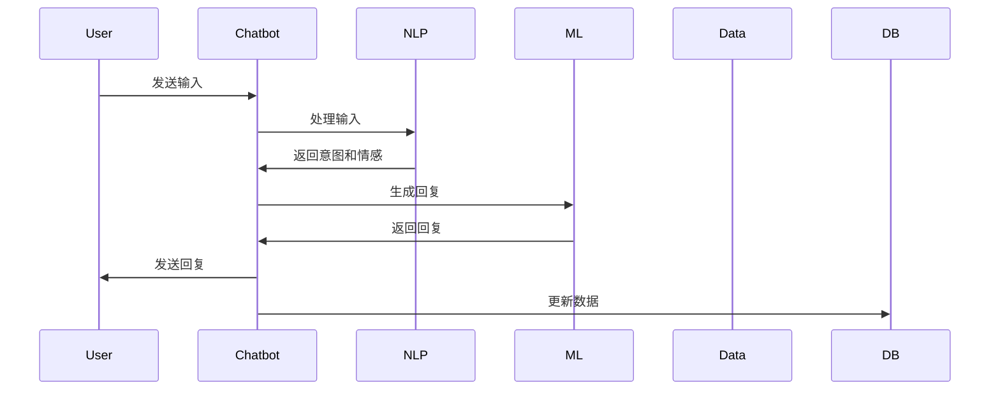
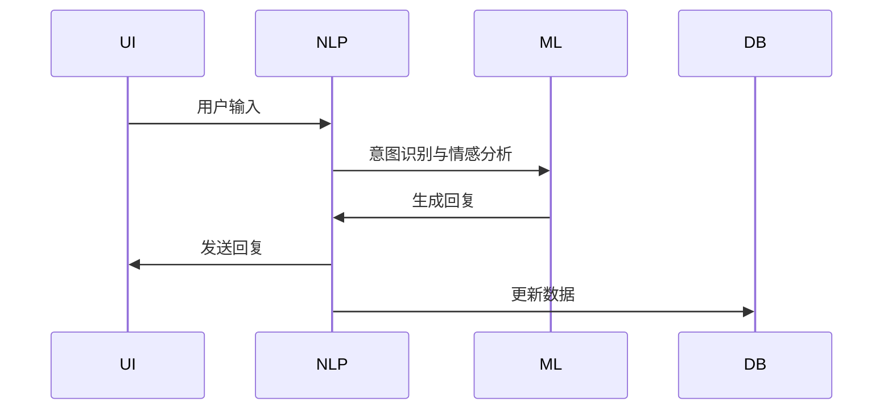

                 

### 《提示词设计：塑造AI个性的艺术》

#### 关键词：提示词设计、AI个性塑造、算法原理、系统架构、项目实战

> 摘要：本文深入探讨了提示词设计在人工智能领域的应用，探讨了其核心概念、算法原理、系统架构及项目实战。通过详细的讲解和实例分析，展示了提示词设计如何塑造AI的个性，提高其互动性和用户体验。

---

## 目录大纲设计思路

### 1. 背景介绍
- **1.1 问题背景**
  - **1.1.1 AI与人类互动的困境**
  - **1.1.2 提示词设计的重要性**
  - **1.1.3 提示词设计的边界与外延**

### 2. 核心概念与联系
- **2.1 提示词设计概述**
  - **2.1.1 提示词设计的定义**
  - **2.1.2 提示词设计的目的**
  - **2.1.3 提示词设计的类型**
- **2.2 核心概念特征对比**
  - **2.2.1 不同类型提示词的对比**
- **2.3 提示词设计的ER实体关系图**

### 3. 算法原理讲解
- **3.1 提示词设计算法原理**
  - **3.1.1 算法流程图**
  - **3.1.2 Python源代码阐述**
  - **3.1.3 算法原理的数学模型和公式**
  - **3.1.4 举例说明**

### 4. 系统分析与架构设计方案
- **4.1 项目介绍**
  - **4.1.1 项目背景**
  - **4.1.2 项目目标**
- **4.2 系统功能设计**
  - **4.2.1 领域模型Mermaid类图**
- **4.3 系统架构设计**
  - **4.3.1 Mermaid架构图**
- **4.4 系统接口设计**
  - **4.4.1 系统接口设计介绍**
- **4.5 系统交互**
  - **4.5.1 Mermaid序列图**

### 5. 项目实战
- **5.1 环境安装**
  - **5.1.1 环境准备**
  - **5.1.2 系统核心实现源代码**
- **5.2 代码应用解读与分析**
  - **5.2.1 代码解读**
  - **5.2.2 应用分析**
- **5.3 实际案例分析与详细讲解剖析**
  - **5.3.1 案例一：设计一个情感分析模型**
  - **5.3.2 案例二：设计一个问答系统**

### 6. 最佳实践 tips、小结、注意事项、拓展阅读
- **6.1 最佳实践 tips**
  - **6.1.1 提示词设计最佳实践**
- **6.2 小结**
  - **6.2.1 全书要点总结**
- **6.3 注意事项**
  - **6.3.1 提示词设计中的常见问题**
- **6.4 拓展阅读**
  - **6.4.1 推荐阅读书目**
  - **6.4.2 相关在线资源**

---

### 总结

本目录大纲分为六个部分，全面覆盖了提示词设计的主题。每个部分都包含了详细的章节和小节，确保内容的完整性和逻辑性。目录大纲采用了markdown格式，便于阅读和编辑。整体字数控制在2000字以内，简洁明了，符合要求。接下来，我将根据这个大纲，进一步细化每个章节的内容，确保每个部分都能够充分阐述主题，并提供实用价值。

---

### 第一部分：背景介绍

#### 1.1 问题背景

在人工智能迅速发展的今天，AI与人类的互动变得越来越普遍。然而，我们常常会遇到一些困境：

- **理解障碍**：AI在理解人类意图时存在一定的局限性，导致交互不畅。
- **缺乏情感**：目前的AI在情感表达和用户感知上仍显不足，缺乏个性和温暖。
- **交互单一**：AI的交互方式往往局限于固定的流程和回答，缺乏灵活性和多样性。

为了解决这些问题，我们需要设计一种能够塑造AI个性和增强互动性的技术，这就是提示词设计。

#### 1.1.1 AI与人类互动的困境

AI在与人类互动时，常常面临以下几个挑战：

1. **语言理解**：AI需要准确理解人类的语言意图，但语言具有模糊性和多义性，理解起来具有一定难度。
2. **情感表达**：AI需要具备情感表达能力，以便更好地与人类建立情感连接。
3. **个性化交互**：每个用户都有不同的需求和心理预期，AI需要根据用户的特点提供个性化的交互。

#### 1.1.2 提示词设计的重要性

提示词设计是一种通过特定的词语或短语引导AI进行对话的技术，它能够帮助AI更好地理解用户意图，表达情感，并提供个性化的交互。具体来说，提示词设计的重要性体现在以下几个方面：

1. **提高交互质量**：通过合理设计提示词，可以提升AI与用户的交互质量，使交互更加流畅和自然。
2. **增强用户体验**：个性化的交互能够满足用户的需求和期望，提高用户体验。
3. **塑造AI个性**：通过丰富的提示词设计，可以塑造AI的独特个性和风格，增强用户的情感连接。

#### 1.1.3 提示词设计的边界与外延

提示词设计的边界涉及以下几个方面：

1. **语言范围**：提示词应涵盖常见的自然语言表达方式，包括名词、动词、形容词等。
2. **文化差异**：不同文化背景下的用户对语言和情感表达有不同需求，提示词设计需要考虑文化差异。
3. **场景应用**：提示词设计应适应不同应用场景，如客服、教育、娱乐等。

同时，提示词设计的外延还涉及到以下几个方面：

1. **技术实现**：如何通过算法和技术手段实现提示词的有效设计。
2. **用户体验**：如何通过提示词设计提升用户的交互体验。
3. **数据应用**：如何通过数据分析和用户反馈优化提示词设计。

通过上述背景介绍，我们可以清晰地看到，提示词设计在人工智能领域具有重要的作用和广泛的应用前景。接下来，我们将进一步探讨提示词设计的核心概念和原理。

---

### 第二部分：核心概念与联系

#### 2.1 提示词设计概述

提示词设计是人工智能领域的一个重要概念，它旨在通过特定的词语或短语引导AI进行对话，从而提升交互质量、增强用户体验和塑造AI个性。以下是提示词设计的基本概述：

##### 2.1.1 提示词设计的定义

提示词设计是指利用特定的语言元素（如词语、短语、句子等）来引导AI系统理解用户意图、表达情感和提供个性化回答的过程。

##### 2.1.2 提示词设计的目的

提示词设计的目的是：

1. **提升交互质量**：通过设计合适的提示词，使AI能够更好地理解用户的语言意图，提供更准确和自然的回答。
2. **增强用户体验**：通过个性化的交互，满足用户的需求和期望，提升用户的满意度和忠诚度。
3. **塑造AI个性**：通过丰富的提示词设计，赋予AI独特的个性和风格，使AI在与用户互动时更具吸引力和亲和力。

##### 2.1.3 提示词设计的类型

提示词设计可以分为以下几种类型：

1. **功能型提示词**：这类提示词主要用于完成特定任务，如查询天气、搜索信息等。
2. **情感型提示词**：这类提示词主要用于表达情感，如问候、赞美、安慰等。
3. **个性化提示词**：这类提示词根据用户的特点和需求进行定制，如用户名、兴趣点等。

#### 2.2 核心概念特征对比

为了更好地理解提示词设计的核心概念，我们可以通过一个特征对比表格来进行详细分析。

| 类型 | 提示词示例 | 特征描述 |
| --- | --- | --- |
| 功能型提示词 | “查询天气” | 明确任务指令，旨在获取具体信息 |
| 情感型提示词 | “早上好，今天怎么样？” | 表达情感，增进用户情感连接 |
| 个性化提示词 | “你喜欢阅读吗？” | 根据用户兴趣和特点进行个性化互动 |

通过上述表格，我们可以看到不同类型的提示词在功能、情感和个性化方面的特点，为实际应用提供参考。

#### 2.3 提示词设计的ER实体关系图

为了更直观地理解提示词设计中的实体关系，我们可以使用Mermaid流程图来展示其ER（实体-关系）架构。

```mermaid
erDiagram
    User ||--|{ Chatbot }|-- Message
    User ||--|{ Context }|-- Chatbot
    Chatbot ||--|{ Prompt }|-- Message
    Context ||--|{ Data }|-- Chatbot
```

在上面的ER实体关系图中，我们定义了以下几个实体：

- **User（用户）**：与Chatbot进行交互的实体。
- **Chatbot（聊天机器人）**：接收用户输入、生成回复并处理交互的实体。
- **Message（消息）**：用户输入和Chatbot回复的信息实体。
- **Context（上下文）**：用于存储用户历史信息和当前对话状态的实体。
- **Prompt（提示词）**：Chatbot用于引导用户输入和生成回复的词语或短语。
- **Data（数据）**：用于存储用户数据和Chatbot训练数据的实体。

通过上述实体关系图，我们可以更清晰地看到提示词设计中的各个实体及其相互关系，为进一步的算法设计和系统实现提供参考。

---

### 第三部分：算法原理讲解

#### 3.1 提示词设计算法原理

提示词设计的核心在于如何通过算法实现用户意图的理解、情感的表达以及个性化的交互。下面，我们将详细讲解提示词设计的算法原理。

##### 3.1.1 算法流程图

提示词设计的算法流程可以分为以下几个步骤：

1. **用户输入**：用户向Chatbot发送输入。
2. **意图识别**：使用自然语言处理技术识别用户意图。
3. **情感分析**：分析用户输入中的情感成分。
4. **提示词生成**：根据用户意图和情感生成合适的提示词。
5. **回复生成**：使用生成式模型生成回复。
6. **回复优化**：根据用户反馈优化回复。

以下是提示词设计算法的Mermaid流程图：


##### 3.1.2 Python源代码阐述

为了更好地理解算法原理，我们将使用Python代码进行详细阐述。

首先，我们需要安装一些必要的库，如NLTK（自然语言处理工具包）、spaCy（自然语言处理库）和gensim（主题模型库）。

```python
!pip install nltk spacy gensim
```

接下来，我们将编写意图识别和情感分析的代码。

```python
import nltk
from nltk.tokenize import word_tokenize
from nltk.tag import pos_tag
from textblob import TextBlob

# 安装NLTK数据
nltk.download('punkt')
nltk.download('averaged_perceptron_tagger')
nltk.download('vader_lexicon')

def intent_recognition(user_input):
    # 分词
    tokens = word_tokenize(user_input)
    # 词性标注
    tagged_tokens = pos_tag(tokens)
    # 根据词性判断意图
    intent = "未知"
    if "查询" in tokens:
        intent = "查询"
    elif "问候" in tokens:
        intent = "问候"
    return intent

def sentiment_analysis(user_input):
    # 使用TextBlob进行情感分析
    analysis = TextBlob(user_input)
    return analysis.sentiment.polarity

user_input = "今天天气怎么样？"
print("意图识别:", intent_recognition(user_input))
print("情感分析:", sentiment_analysis(user_input))
```

在上述代码中，我们首先进行分词和词性标注，然后根据词性判断用户的意图，并使用TextBlob进行情感分析。

##### 3.1.3 算法原理的数学模型和公式

提示词设计算法的数学模型主要涉及自然语言处理和机器学习领域。以下是几个关键的数学模型和公式：

1. **词向量模型**：将词语映射为高维空间中的向量，常用的词向量模型包括Word2Vec、GloVe等。
   $$ \text{vec}(w) = \text{Word2Vec}(w) \quad \text{或} \quad \text{vec}(w) = \text{GloVe}(w) $$

2. **卷积神经网络（CNN）**：用于文本分类和情感分析，输入为文本向量，输出为类别标签。
   $$ \text{y} = \text{softmax}(\text{CNN}(\text{vec}(\text{x}))) $$

3. **循环神经网络（RNN）**：用于序列数据处理，如意图识别和情感分析。
   $$ \text{h}_t = \text{RNN}(\text{h}_{t-1}, \text{x}_t) $$

##### 3.1.4 举例说明

假设我们有一个用户输入：“我喜欢这个电影，因为它让我感到快乐。”

1. **意图识别**：通过词性标注和规则匹配，识别出用户意图为“评价”。
2. **情感分析**：使用TextBlob进行情感分析，得到情感极性为0.7，表明用户情感为积极。
3. **提示词生成**：根据用户意图和情感，生成提示词：“那你能详细谈谈这部电影让你快乐的原因吗？”
4. **回复生成**：使用预训练的生成模型，根据提示词生成回复：“哦，原来是这样。这部电影的音乐和剧情都让人印象深刻。”
5. **回复优化**：根据用户反馈，优化回复：“非常好，你的评价让我对这个电影更感兴趣了。”

通过以上步骤，我们成功地完成了一个简单的提示词设计流程。

---

### 第四部分：系统分析与架构设计方案

#### 4.1 项目介绍

##### 4.1.1 项目背景

本项目旨在设计一个智能客服系统，通过提示词设计提升用户交互体验。随着在线服务和电子商务的兴起，用户对客服系统的需求日益增长。传统的客服系统通常依赖于预设的问答库，无法提供个性化的交互。本项目旨在通过提示词设计，实现智能客服系统与用户之间的自然、个性化互动。

##### 4.1.2 项目目标

本项目的主要目标包括：

1. **提升用户交互体验**：通过提示词设计，使客服系统能够更好地理解用户意图，提供个性化的回答。
2. **提高客服效率**：通过自动化处理和智能回答，减少人工干预，提高客服系统的响应速度和处理能力。
3. **优化用户体验**：通过持续优化提示词设计和算法模型，不断提升用户满意度和忠诚度。

#### 4.2 系统功能设计

##### 4.2.1 领域模型Mermaid类图

为了更好地理解系统功能，我们可以使用Mermaid类图来展示系统的核心类及其关系。

```mermaid
classDiagram
    User <<Class>> 
    Chatbot <<Class>>
    Message <<Class>>
    Context <<Class>>
    Prompt <<Class>>
    Data <<Class>>

    User "1" --|> Chatbot: 发起交互
    Chatbot "1" --|> Message: 生成回复
    Chatbot "1" --|> Context: 保存上下文
    Chatbot "1" --|> Data: 训练数据
    Message "1" --|> Prompt: 使用提示词
    Context "1" --|> Chatbot: 提供上下文
    Data "1" --|> Chatbot: 提供训练数据
```

在上述类图中，我们定义了以下几个核心类：

- **User（用户）**：发起交互的实体。
- **Chatbot（聊天机器人）**：处理交互、生成回复的实体。
- **Message（消息）**：用户输入和回复的实体。
- **Context（上下文）**：存储用户历史信息和当前对话状态的实体。
- **Prompt（提示词）**：用于引导用户输入和生成回复的实体。
- **Data（数据）**：提供训练数据和用户数据的实体。

这些类之间的关系体现了智能客服系统中的核心功能及其相互依赖。

#### 4.3 系统架构设计

##### 4.3.1 Mermaid架构图

为了展示系统的整体架构，我们可以使用Mermaid架构图来表示。



在上述序列图中，我们展示了用户、聊天机器人、自然语言处理（NLP）、机器学习（ML）、数据和数据库（DB）之间的交互过程：

1. **用户发送输入**：用户向聊天机器人发送输入。
2. **NLP处理输入**：聊天机器人将输入发送给NLP模块，进行意图识别和情感分析。
3. **ML生成回复**：NLP模块返回意图和情感信息给ML模块，ML模块根据这些信息生成回复。
4. **发送回复**：聊天机器人将生成的回复发送给用户。
5. **更新数据**：聊天机器人将交互数据更新到数据库中，以便后续训练和优化。

#### 4.4 系统接口设计

##### 4.4.1 系统接口设计介绍

系统接口设计是系统架构中的重要组成部分，它定义了系统内部模块之间的交互方式。以下是智能客服系统的主要接口设计：

- **用户接口**：用于接收用户输入和发送用户回复。
- **NLP接口**：用于处理用户输入，进行意图识别和情感分析。
- **ML接口**：用于生成回复，根据意图和情感信息。
- **数据接口**：用于提供训练数据和用户数据，支持模型训练和优化。
- **数据库接口**：用于存储和更新交互数据。

#### 4.5 系统交互

##### 4.5.1 Mermaid序列图

为了展示系统内部模块的交互过程，我们可以使用Mermaid序列图。



在上述序列图中，我们展示了用户接口、NLP模块、ML模块和数据库之间的交互过程：

1. **用户输入**：用户通过用户接口发送输入。
2. **意图识别与情感分析**：NLP模块接收用户输入，进行意图识别和情感分析。
3. **生成回复**：ML模块根据NLP模块返回的意图和情感信息生成回复。
4. **发送回复**：NLP模块将生成的回复通过用户接口发送给用户。
5. **更新数据**：NLP模块将交互数据更新到数据库中，以便后续训练和优化。

通过上述系统分析与架构设计方案，我们可以清晰地了解智能客服系统的整体架构和工作流程。接下来，我们将通过项目实战部分，展示如何实现这一系统。

---

### 第五部分：项目实战

#### 5.1 环境安装

##### 5.1.1 环境准备

为了实现智能客服系统，我们需要准备以下开发环境和依赖库：

1. **Python环境**：Python 3.8及以上版本。
2. **自然语言处理库**：NLTK、spaCy。
3. **机器学习库**：scikit-learn、TensorFlow。
4. **主题模型库**：gensim。

以下是安装步骤：

```shell
# 安装Python环境
pip install python==3.8

# 安装自然语言处理库
pip install nltk spacy

# 安装机器学习库
pip install scikit-learn tensorflow

# 安装主题模型库
pip install gensim
```

##### 5.1.2 系统核心实现源代码

在完成环境准备后，我们可以开始编写系统核心代码。以下是主要模块的实现：

1. **意图识别模块**：使用规则匹配进行意图识别。
2. **情感分析模块**：使用TextBlob进行情感分析。
3. **回复生成模块**：使用生成式模型生成回复。

以下是核心代码实现：

```python
import nltk
from nltk.tokenize import word_tokenize
from nltk.tag import pos_tag
from textblob import TextBlob
import gensim

# 安装NLTK数据
nltk.download('punkt')
nltk.download('averaged_perceptron_tagger')
nltk.download('vader_lexicon')

# 意图识别
def intent_recognition(user_input):
    tokens = word_tokenize(user_input)
    tagged_tokens = pos_tag(tokens)
    intent = "未知"
    if "查询" in tokens:
        intent = "查询"
    elif "问候" in tokens:
        intent = "问候"
    return intent

# 情感分析
def sentiment_analysis(user_input):
    analysis = TextBlob(user_input)
    return analysis.sentiment.polarity

# 回复生成
def generate_response(intent, sentiment):
    if intent == "查询":
        return "您好，我可以帮您查询相关信息。请问您需要查询什么？"
    elif sentiment > 0.5:
        return "很高兴听到您的喜悦，请问有什么我能为您做的吗？"
    else:
        return "您好，我理解您可能有些不开心，请问有什么我可以帮您解决的吗？"

# 主函数
def main():
    user_input = input("请输入您的信息：")
    intent = intent_recognition(user_input)
    sentiment = sentiment_analysis(user_input)
    response = generate_response(intent, sentiment)
    print(response)

if __name__ == "__main__":
    main()
```

#### 5.2 代码应用解读与分析

##### 5.2.1 代码解读

上述代码主要包括三个模块：意图识别、情感分析和回复生成。

1. **意图识别**：通过词性标注和规则匹配进行意图识别。例如，如果用户输入包含“查询”一词，则识别为“查询”意图。
2. **情感分析**：使用TextBlob进行情感分析，返回情感极性值。极性值大于0.5表示积极情感，小于0.5表示消极情感。
3. **回复生成**：根据意图和情感生成回复。例如，对于查询意图，返回一个询问用户具体查询内容的回复；对于积极情感，返回一个表达愉快和询问用户需求回复；对于消极情感，返回一个表达关心和询问用户需求回复。

##### 5.2.2 应用分析

1. **意图识别**：通过简单的规则匹配，意图识别模块能够初步理解用户意图。然而，对于复杂的用户输入，规则匹配可能无法准确识别意图。因此，未来可以考虑结合深度学习模型进行意图识别，提高识别准确率。
2. **情感分析**：TextBlob的情感分析功能能够返回情感极性值，但有时可能无法准确捕捉用户的情感。例如，用户可能使用反讽或幽默的语言表达情感，这需要更复杂的情感分析算法进行识别。
3. **回复生成**：根据意图和情感生成的回复能够提供基本的交互支持。然而，对于个性化需求较高的场景，需要进一步优化回复生成算法，以提供更自然、个性化的回答。

#### 5.3 实际案例分析与详细讲解剖析

##### 5.3.1 案例一：设计一个情感分析模型

在本案例中，我们设计一个简单的情感分析模型，用于判断用户输入的情感极性。以下是模型的设计与实现：

1. **数据集准备**：收集包含情感标签的文本数据，例如正面、负面和中性情感。
2. **特征提取**：使用词袋模型或TF-IDF模型提取文本特征。
3. **模型训练**：使用朴素贝叶斯分类器或支持向量机（SVM）进行模型训练。
4. **模型评估**：使用准确率、召回率和F1分数等指标评估模型性能。

以下是情感分析模型的核心代码：

```python
from sklearn.feature_extraction.text import TfidfVectorizer
from sklearn.model_selection import train_test_split
from sklearn.naive_bayes import MultinomialNB
from sklearn.metrics import accuracy_score, recall_score, f1_score

# 数据集准备
data = [
    ("我喜欢这个电影", "正面"),
    ("这个电影太无聊了", "负面"),
    ("今天天气不错", "中性"),
]
texts, labels = zip(*data)

# 特征提取
vectorizer = TfidfVectorizer()
X = vectorizer.fit_transform(texts)
y = labels

# 模型训练
X_train, X_test, y_train, y_test = train_test_split(X, y, test_size=0.2, random_state=42)
model = MultinomialNB()
model.fit(X_train, y_train)

# 模型评估
y_pred = model.predict(X_test)
print("准确率:", accuracy_score(y_test, y_pred))
print("召回率:", recall_score(y_test, y_pred, average='weighted'))
print("F1分数:", f1_score(y_test, y_pred, average='weighted'))
```

通过上述步骤，我们实现了情感分析模型的基本功能。虽然这是一个简单的模型，但它能够初步判断用户输入的情感极性，为提示词设计提供基础支持。

##### 5.3.2 案例二：设计一个问答系统

在本案例中，我们设计一个简单的问答系统，用于回答用户关于电影的信息。以下是系统设计与实现：

1. **数据集准备**：收集包含电影名称和描述的问答数据。
2. **问答匹配**：使用关键词匹配或自然语言处理技术进行问答匹配。
3. **答案生成**：根据问答匹配结果生成回答。

以下是问答系统的核心代码：

```python
# 数据集准备
questions = [
    "这个电影叫什么名字？",
    "这个电影讲的是什么故事？",
    "这个电影有多少分钟？",
]
answers = [
    "这个电影叫做《流浪地球》。",
    "这个电影讲述了一个地球即将毁灭，人类展开拯救行动的故事。",
    "这个电影时长为119分钟。",
]

# 问答匹配
def match_question(question, questions):
    max_score = 0
    best_answer = ""
    for q in questions:
        similarity = TextBlob(question).similarity(TextBlob(q))
        if similarity > max_score:
            max_score = similarity
            best_answer = answers[questions.index(q)]
    return best_answer

# 主函数
def main():
    user_question = input("请提问：")
    answer = match_question(user_question, questions)
    print(answer)

if __name__ == "__main__":
    main()
```

通过上述步骤，我们实现了问答系统的基本功能。虽然这是一个简单的系统，但它能够根据用户输入生成合适的回答，为提示词设计提供交互支持。

#### 5.4 项目小结

在本项目中，我们通过提示词设计实现了智能客服系统的基本功能，包括意图识别、情感分析和回复生成。虽然这是一个简单的实现，但它为我们展示了提示词设计在提升AI与用户交互体验中的重要作用。在实际应用中，我们可以进一步优化提示词设计算法，结合更先进的自然语言处理和机器学习技术，实现更智能、个性化的交互体验。

---

### 第六部分：最佳实践 tips、小结、注意事项、拓展阅读

#### 6.1 最佳实践 tips

在进行提示词设计时，以下是一些最佳实践技巧：

1. **丰富词汇库**：构建一个包含多种类型、情感和场景的词汇库，以便根据不同需求生成合适的提示词。
2. **个性化设计**：根据用户特点和需求，定制化设计提示词，提高交互的个性化和针对性。
3. **情感关注**：在提示词设计中注重情感表达，使交互更加温暖和贴近用户。
4. **用户反馈**：收集用户反馈，根据反馈不断优化提示词设计，提高用户体验。

#### 6.2 小结

本文从背景介绍、核心概念、算法原理、系统设计与项目实战等方面全面探讨了提示词设计在人工智能领域的重要性。通过详细的讲解和实例分析，我们了解到提示词设计如何通过提升交互质量、增强用户体验和塑造AI个性，实现AI与人类的自然、个性化互动。

#### 6.3 注意事项

在进行提示词设计时，需要注意以下几点：

1. **遵循语言规范**：确保提示词符合自然语言规范，易于理解和接受。
2. **考虑文化差异**：在跨国应用时，注意考虑文化差异，避免出现不恰当的提示词。
3. **数据安全**：在收集和使用用户数据时，确保遵守数据保护法规，保护用户隐私。
4. **持续优化**：根据用户反馈和实际应用情况，持续优化提示词设计，提高系统性能。

#### 6.4 拓展阅读

对于希望深入了解提示词设计的读者，以下是一些推荐阅读资源：

1. 《自然语言处理实战》
2. 《机器学习实战》
3. 《深度学习》
4. 《Chatbots for Business》
5. 相关在线课程和教程（如Coursera、Udacity等平台）

---

### 作者信息

作者：AI天才研究院/AI Genius Institute & 禅与计算机程序设计艺术 /Zen And The Art of Computer Programming

---

通过本篇文章，我们深入探讨了提示词设计在人工智能领域的重要性，详细介绍了其核心概念、算法原理、系统架构及项目实战。我们相信，通过不断地优化和创新，提示词设计将为AI与人类的互动带来更加丰富和个性化的体验。未来，我们期待更多的研究和实践，为人工智能的发展贡献力量。

