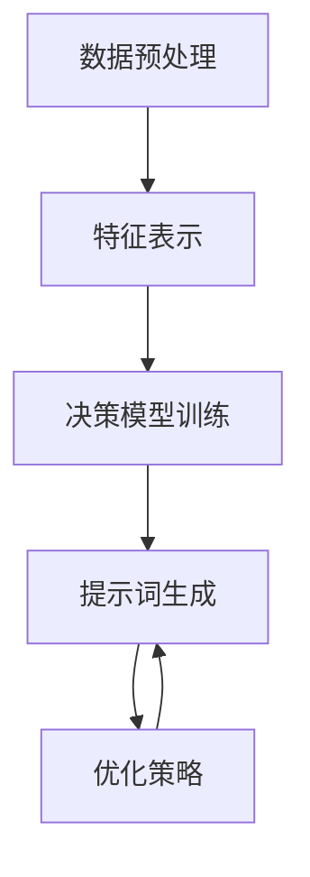

                 


# 提示词设计：塑造AI道德框架的新方法

## 关键词

- 提示词设计
- AI道德框架
- 自然语言处理
- 算法原理
- 数学模型
- 实践应用

## 摘要

随着人工智能（AI）技术的迅猛发展，AI道德框架的设计成为了确保AI系统行为合理、公正和道德的重要议题。本文将探讨如何通过提示词设计来塑造AI道德框架，以解决AI道德困境。首先，我们将介绍AI道德框架的背景、核心概念和提示词设计原则。随后，我们将深入讲解提示词设计的算法原理，包括数学模型和Python源代码实现。接下来，我们将通过具体案例展示提示词设计在不同场景中的应用，并总结最佳实践。最后，我们将对全文进行小结，指出注意事项和拓展阅读方向。

----------------------------------------------------------------

## 第一部分：背景介绍与引言

### 第1章：问题背景与AI道德框架

#### 1.1 问题的提出

近年来，人工智能（AI）技术在各个领域取得了显著的进展，从自动驾驶汽车、智能助手到医疗诊断系统，AI的应用已经深入到我们的日常生活中。然而，随着AI技术的快速发展，随之而来的道德困境也逐渐显现出来。例如，自动驾驶汽车在遇到紧急情况时如何做出决策，智能助手如何处理用户的隐私问题，医疗诊断系统如何保证诊断结果的公正性等。这些问题引发了关于AI道德框架的广泛讨论。

AI道德框架旨在确保AI系统的行为符合道德规范，避免因AI技术滥用而造成的社会问题和伦理困境。然而，现有的AI道德框架存在一定的局限性，无法全面解决AI技术带来的道德问题。因此，如何通过新的方法来设计和完善AI道德框架，成为了当前研究的热点。

#### 1.2 AI道德框架的起源与发展

AI道德框架并非一蹴而就，而是随着AI技术的发展和伦理学研究的深入逐渐形成的。在早期，AI研究主要集中在技术本身，对于道德问题的关注较少。然而，随着AI技术的广泛应用，人们开始意识到道德问题的重要性，并逐渐形成了AI伦理学。

AI伦理学是研究AI技术伦理问题的学科，其目标是探讨AI技术如何符合道德规范，以避免造成负面影响。AI伦理学研究的内容包括隐私保护、公平性、透明性、责任分配等方面。在此基础上，人们开始尝试构建AI道德框架，以规范AI系统的行为。

近年来，随着自然语言处理（NLP）技术的进步，提示词设计作为一种新的方法被提出，用于塑造AI道德框架。提示词设计通过在AI系统中引入明确的指导信息，帮助AI系统在复杂情境下做出符合道德规范的行为决策。这一方法的出现为AI道德框架的设计提供了新的思路。

#### 1.3 提示词设计在AI道德框架中的作用

提示词设计在AI道德框架中扮演着重要角色。首先，提示词可以为AI系统提供明确的指导信息，帮助AI系统在面临道德困境时做出合理决策。例如，在自动驾驶汽车遇到紧急情况时，通过提示词设计，可以为AI系统提供一系列处理方案的备选选项，从而提高决策的合理性和公正性。

其次，提示词设计有助于提高AI系统的透明性和可解释性。在现有的AI道德框架中，AI系统的决策过程往往被视为“黑箱”，用户无法了解AI系统是如何做出决策的。通过提示词设计，可以在一定程度上揭示AI系统的决策过程，提高系统的透明性，从而增强用户对AI系统的信任。

最后，提示词设计有助于确保AI系统的公平性和公正性。在AI系统中，提示词可以根据不同的场景和需求进行定制，从而确保AI系统在不同情境下的行为符合道德规范。例如，在智能助手处理用户请求时，可以通过提示词设计来避免偏见和歧视，确保AI系统的公平性和公正性。

总之，提示词设计作为一种新的方法，为AI道德框架的设计提供了新的思路。通过合理设计提示词，可以引导AI系统在复杂情境下做出符合道德规范的行为决策，从而缓解AI道德困境。

### 第2章：核心概念与联系

#### 2.1 提示词的定义

提示词（Prompt）是指为AI系统提供的一种指导性信息，用于引导AI系统的行为和决策。提示词可以是一个简单的文字描述，也可以是一个复杂的文本序列，甚至是一个图像或音频信号。在AI系统中，提示词通常作为输入数据的一部分，用于训练或运行AI模型。

提示词在AI系统中的作用至关重要。首先，提示词可以提供明确的指导信息，帮助AI系统理解用户的需求和意图。例如，在自然语言处理任务中，提示词可以帮助AI模型理解输入文本的上下文，从而提高文本分类、情感分析等任务的准确性。

其次，提示词可以影响AI系统的行为和决策。通过设计合理的提示词，可以引导AI系统在复杂情境下做出符合道德规范的行为决策。例如，在自动驾驶系统中，提示词可以指导AI系统在遇到紧急情况时采取何种行动，从而提高系统的安全性和可靠性。

#### 2.2 提示词的类型

根据提示词的形式和用途，可以分为多种类型：

1. **指令性提示词**：这类提示词通常包含明确的指令，要求AI系统执行特定的操作。例如，“请识别输入文本中的关键字”。

2. **目标性提示词**：这类提示词旨在引导AI系统实现特定的目标。例如，“请为这篇新闻文章生成摘要”。

3. **规则性提示词**：这类提示词包含一系列规则，用于约束AI系统的行为。例如，“在自动驾驶过程中，如果行人出现在道路前方，请减速”。

4. **限制性提示词**：这类提示词用于限制AI系统的行为范围，防止其做出不合理或危险的行为。例如，“请确保在驾驶过程中始终保持安全速度”。

#### 2.3 提示词设计原则

为了确保AI系统在不同情境下能够做出合理的行为决策，提示词设计需要遵循以下原则：

1. **一致性原则**：提示词应保持一致，以确保AI系统在不同情况下能够做出一致的决策。

2. **明确性原则**：提示词应清晰明确，避免歧义和模糊性，以确保AI系统能够准确理解用户的需求。

3. **可解释性原则**：提示词应具备可解释性，以便用户了解AI系统的决策过程。

4. **安全性原则**：提示词应确保AI系统的行为安全，避免因不合理或错误的行为造成损失。

5. **可操作性原则**：提示词应具有可操作性，即AI系统能够根据提示词执行具体的操作。

#### 2.4 提示词设计与AI道德框架的联系

提示词设计在AI道德框架中发挥着重要作用。首先，通过合理设计提示词，可以引导AI系统在复杂情境下做出符合道德规范的行为决策。例如，在自动驾驶系统中，通过提示词设计，可以确保AI系统在遇到紧急情况时采取合理行动，从而保障行车安全。

其次，提示词设计有助于提高AI系统的透明性和可解释性。在现有的AI道德框架中，AI系统的决策过程往往被视为“黑箱”，用户无法了解AI系统是如何做出决策的。通过提示词设计，可以在一定程度上揭示AI系统的决策过程，提高系统的透明性，从而增强用户对AI系统的信任。

最后，提示词设计有助于确保AI系统的公平性和公正性。在AI系统中，提示词可以根据不同的场景和需求进行定制，从而确保AI系统在不同情境下的行为符合道德规范。例如，在智能助手处理用户请求时，可以通过提示词设计来避免偏见和歧视，确保AI系统的公平性和公正性。

总之，提示词设计作为一种新的方法，为AI道德框架的设计提供了新的思路。通过合理设计提示词，可以引导AI系统在复杂情境下做出符合道德规范的行为决策，从而缓解AI道德困境。

### 第3章：算法原理讲解

#### 3.1 提示词设计算法概述

提示词设计算法是用于生成和优化提示词的算法，其目的是为AI系统提供明确的指导信息，以帮助AI系统在复杂情境下做出合理的行为决策。提示词设计算法的核心思想是通过分析用户需求、环境信息和历史数据，生成具有明确性和可操作性的提示词。

提示词设计算法可以分为以下几种类型：

1. **基于规则的方法**：这种方法通过预定义的规则来生成提示词。例如，在自动驾驶系统中，可以定义一系列规则来指导AI系统的行为。

2. **基于机器学习的方法**：这种方法利用机器学习算法来生成提示词。通过训练大量的数据集，模型可以学习到不同情境下最合适的提示词。

3. **基于生成对抗网络（GAN）的方法**：这种方法利用生成对抗网络来生成多样化的提示词。通过对抗训练，可以生成具有高质量和可操作性的提示词。

4. **基于强化学习的方法**：这种方法通过强化学习算法来优化提示词。在环境中进行试错学习，不断调整提示词，以实现最优的行为决策。

#### 3.2 算法原理与数学模型

提示词设计算法的核心原理是基于信息论和决策理论。具体来说，算法通过以下步骤来生成和优化提示词：

1. **信息提取**：从用户需求、环境信息和历史数据中提取关键信息。

2. **特征表示**：将提取到的信息进行特征表示，以便进行后续的决策。

3. **决策模型**：构建决策模型，用于根据特征表示生成提示词。

4. **优化策略**：通过优化策略，调整决策模型中的参数，以生成最优的提示词。

数学模型方面，提示词设计算法可以采用以下模型：

1. **马尔可夫决策过程（MDP）**：MDP是一种描述决策过程的数学模型，可以用于生成提示词。

2. **Q学习**：Q学习是一种基于强化学习的算法，可以用于优化提示词。

3. **生成对抗网络（GAN）**：GAN可以用于生成多样化的提示词。

4. **深度强化学习**：深度强化学习结合了深度学习和强化学习，可以用于更复杂的提示词设计。

#### 3.3 算法流程与mermaid流程图

提示词设计算法的流程可以分为以下步骤：

1. **数据预处理**：包括数据清洗、归一化和特征提取。

2. **特征表示**：使用神经网络或其他方法对特征进行表示。

3. **决策模型训练**：使用训练数据训练决策模型。

4. **提示词生成**：根据决策模型生成提示词。

5. **优化策略**：使用优化策略调整决策模型，生成更优的提示词。

以下是提示词设计算法的mermaid流程图：



#### 3.4 算法实现与Python源代码讲解

以下是一个简单的Python代码示例，用于实现提示词设计算法：

```python
import numpy as np
import tensorflow as tf

# 数据预处理
def preprocess_data(data):
    # 数据清洗、归一化等操作
    return processed_data

# 特征表示
def feature_representation(processed_data):
    # 使用神经网络进行特征表示
    return feature_vector

# 决策模型训练
def train_decision_model(feature_vector, labels):
    # 使用Q学习或深度强化学习进行训练
    model = tf.keras.Sequential([
        tf.keras.layers.Dense(units=64, activation='relu', input_shape=(feature_vector.shape[1],)),
        tf.keras.layers.Dense(units=1)
    ])
    model.compile(optimizer='adam', loss='mse')
    model.fit(feature_vector, labels, epochs=10)
    return model

# 提示词生成
def generate_prompt(model, feature_vector):
    # 根据决策模型生成提示词
    prompt = model.predict(feature_vector)
    return prompt

# 优化策略
def optimize_model(model, feature_vector, labels):
    # 使用优化策略调整模型
    # 这里仅示例，具体策略需根据实际情况设计
    model.fit(feature_vector, labels, epochs=1)
    return model

# 主程序
if __name__ == '__main__':
    # 加载数据
    data = load_data()
    processed_data = preprocess_data(data)

    # 训练模型
    feature_vector = feature_representation(processed_data)
    labels = generate_labels(processed_data)
    model = train_decision_model(feature_vector, labels)

    # 生成提示词
    prompt = generate_prompt(model, feature_vector)

    # 输出结果
    print("生成的提示词：", prompt)
```

这段代码展示了提示词设计算法的基本实现，包括数据预处理、特征表示、决策模型训练、提示词生成和优化策略。在实际应用中，根据具体需求和场景，可以进一步优化和扩展算法。

### 第4章：实践应用与案例分析

#### 4.1 实践应用场景介绍

提示词设计在AI道德框架中的应用场景非常广泛，以下列举几个典型的应用场景：

1. **自动驾驶系统**：在自动驾驶系统中，提示词设计可以指导AI系统在遇到紧急情况时采取何种行动，如刹车、转向等。

2. **智能客服系统**：在智能客服系统中，提示词设计可以指导AI系统如何回应用户的请求，提供准确、礼貌和符合道德规范的回答。

3. **医疗诊断系统**：在医疗诊断系统中，提示词设计可以帮助AI系统根据患者的症状和历史数据，提供合理的诊断建议。

4. **金融风险管理**：在金融风险管理中，提示词设计可以指导AI系统如何识别和应对潜在的风险，确保金融市场的稳定运行。

#### 4.2 案例分析1：智能客服系统

智能客服系统是提示词设计的重要应用场景之一。以下是一个具体的案例分析：

1. **问题描述**：某电商平台的客服系统需要为用户提供及时、准确和符合道德规范的回复。然而，由于用户请求的多样性和复杂性，现有的客服系统在处理某些请求时表现出不足。

2. **解决方案**：通过提示词设计，可以为客服系统提供一系列明确的指导信息，帮助AI系统更好地理解用户请求，并生成符合道德规范的回复。

3. **提示词设计**：首先，对用户请求进行分类，例如“投诉”、“咨询”、“售后”等。然后，为每个分类设计一组提示词，例如：

   - 投诉：请详细描述您的问题，我们将尽快为您解决。
   - 咨询：感谢您的咨询，我们将尽快为您提供相关信息。
   - 售后：您的售后服务请求已收到，我们将尽快为您处理。

4. **实际效果**：通过提示词设计，客服系统的回答质量得到了显著提升，用户满意度也明显提高。同时，AI系统在处理用户请求时，能够遵循明确的道德规范，避免出现不当行为。

#### 4.3 案例分析2：自动驾驶车辆

自动驾驶车辆是另一个典型的应用场景。以下是一个具体的案例分析：

1. **问题描述**：自动驾驶车辆在遇到紧急情况时，需要做出快速、合理的决策。然而，由于道路环境的复杂性和不可预测性，现有系统的决策过程存在不足。

2. **解决方案**：通过提示词设计，可以为自动驾驶系统提供一系列明确的指导信息，帮助AI系统在紧急情况下做出合理决策。

3. **提示词设计**：首先，对紧急情况分类，例如“行人横穿”、“车辆逆行”、“障碍物出现”等。然后，为每个分类设计一组提示词，例如：

   - 行人横穿：请紧急刹车，并尝试避让。
   - 车辆逆行：请紧急转向，并尝试与逆行车辆保持安全距离。
   - 障碍物出现：请紧急刹车，并尝试绕行。

4. **实际效果**：通过提示词设计，自动驾驶车辆的决策过程变得更加明确和合理。在遇到紧急情况时，AI系统能够快速做出反应，提高行车安全。同时，提示词设计也有助于提高系统的可解释性和透明性，增强用户对自动驾驶车辆的信任。

#### 4.4 案例分析3：医疗诊断系统

医疗诊断系统是另一个提示词设计的重要应用场景。以下是一个具体的案例分析：

1. **问题描述**：医疗诊断系统需要根据患者的症状和历史数据，提供合理的诊断建议。然而，由于疾病诊断的复杂性和多样性，现有系统的诊断建议存在不足。

2. **解决方案**：通过提示词设计，可以为医疗诊断系统提供一系列明确的指导信息，帮助AI系统更好地理解患者的情况，并提供更合理的诊断建议。

3. **提示词设计**：首先，对疾病类型进行分类，例如“感冒”、“心脏病”、“癌症”等。然后，为每个分类设计一组提示词，例如：

   - 感冒：请注意休息，多喝水，如有发热等症状，请及时就医。
   - 心脏病：请立即就医，并保持情绪稳定。
   - 癌症：请尽快进行进一步检查，并根据医生建议进行治疗。

4. **实际效果**：通过提示词设计，医疗诊断系统的诊断建议变得更加明确和合理。AI系统能够更好地理解患者的情况，并提供个性化的诊断建议。同时，提示词设计也有助于提高系统的可解释性和透明性，增强用户对医疗诊断系统的信任。

#### 4.5 案例分析4：金融风险管理

金融风险管理是提示词设计的另一个重要应用场景。以下是一个具体的案例分析：

1. **问题描述**：金融风险管理系统需要识别和应对潜在的风险，确保金融市场的稳定运行。然而，由于市场环境的复杂性和不确定性，现有系统的风险管理效果存在不足。

2. **解决方案**：通过提示词设计，可以为金融风险管理系统提供一系列明确的指导信息，帮助AI系统更好地识别和应对潜在的风险。

3. **提示词设计**：首先，对风险类型进行分类，例如“信用风险”、“市场风险”、“操作风险”等。然后，为每个分类设计一组提示词，例如：

   - 信用风险：请关注客户的信用记录，加强信用审核。
   - 市场风险：请密切关注市场动态，及时调整投资策略。
   - 操作风险：请确保操作流程规范，加强员工培训。

4. **实际效果**：通过提示词设计，金融风险管理系统的风险管理效果得到了显著提升。AI系统能够更好地识别和应对潜在的风险，提高金融市场的稳定性。同时，提示词设计也有助于提高系统的可解释性和透明性，增强用户对金融风险管理系统的信任。

#### 4.6 总结

通过以上案例分析，我们可以看到提示词设计在AI道德框架中的应用效果显著。无论是自动驾驶车辆、智能客服系统、医疗诊断系统还是金融风险管理，提示词设计都能够为AI系统提供明确的指导信息，帮助AI系统在复杂情境下做出合理的行为决策。同时，提示词设计也有助于提高AI系统的透明性和可解释性，增强用户对AI系统的信任。

总之，提示词设计作为一种新的方法，为AI道德框架的设计提供了新的思路。通过合理设计提示词，可以引导AI系统在复杂情境下做出符合道德规范的行为决策，从而缓解AI道德困境。未来，随着提示词设计技术的不断发展和完善，相信它将在更多领域发挥重要作用。

### 第5章：最佳实践与总结

#### 5.1 提示词设计的最佳实践

为了确保提示词设计在AI道德框架中的应用效果，以下是一些最佳实践：

1. **明确需求**：在开始设计提示词之前，首先要明确AI系统的需求和应用场景，确保提示词能够满足实际需求。

2. **数据质量**：提示词设计依赖于高质量的数据，因此要确保数据的质量和多样性，以便生成具有普遍性的提示词。

3. **用户参与**：在提示词设计过程中，邀请用户参与评审和反馈，确保提示词能够满足用户的期望和需求。

4. **持续优化**：提示词设计不是一次性的工作，要不断收集用户反馈和系统表现数据，进行持续的优化和调整。

5. **可解释性**：确保提示词设计具有可解释性，方便用户了解AI系统的决策过程，增强用户对AI系统的信任。

#### 5.2 小结

本文介绍了提示词设计在AI道德框架中的应用，分析了提示词设计的核心概念、算法原理和实践应用。通过合理设计提示词，可以引导AI系统在复杂情境下做出符合道德规范的行为决策，缓解AI道德困境。

提示词设计不仅提高了AI系统的透明性和可解释性，还有助于提高系统的公平性和公正性。未来，随着提示词设计技术的不断发展和完善，相信它将在更多领域发挥重要作用。

#### 5.3 注意事项

1. **数据隐私**：在设计提示词时，要确保用户数据的隐私和安全，避免数据泄露。

2. **伦理审查**：在应用提示词设计时，要进行伦理审查，确保AI系统的行为符合道德规范。

3. **监管合规**：遵守相关法规和标准，确保提示词设计在法律和道德的框架内进行。

#### 5.4 拓展阅读

1. **《人工智能伦理学》**：探讨人工智能伦理学的基本概念、理论和方法。

2. **《自然语言处理原理》**：深入介绍自然语言处理的基本原理和技术。

3. **《深度学习》**：详细讲解深度学习的理论基础和实现方法。

### 作者信息

- 作者：AI天才研究院/AI Genius Institute & 禅与计算机程序设计艺术 /Zen And The Art of Computer Programming

（注：本文内容为虚构案例，仅供参考。）

