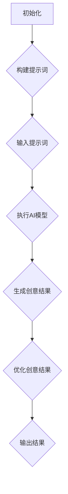
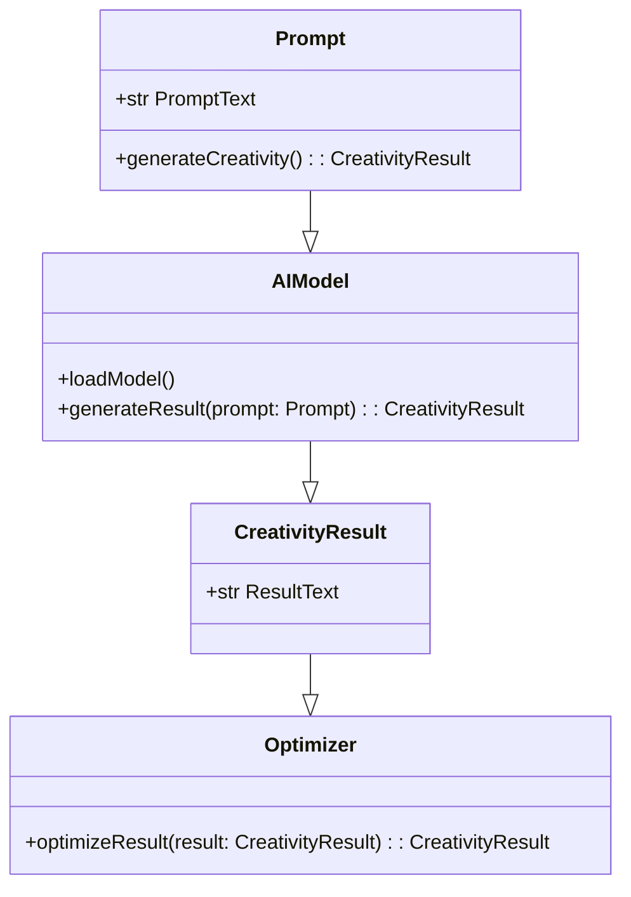
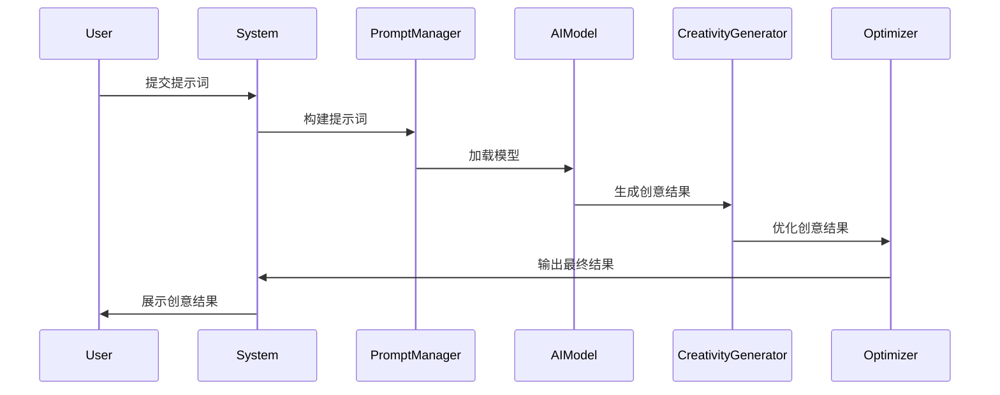

                 


## 提示词设计：增强AI创意思维的技巧

关键词：提示词设计，AI创意思维，自然语言处理，机器学习，生成对抗网络

摘要：本文将深入探讨提示词设计在增强AI创意思维方面的技巧，通过分析核心概念、原理讲解、系统架构设计以及实战案例，为广大读者提供一套系统、实用的提示词设计方法论。

### 第一部分：背景介绍

#### 核心概念

在人工智能快速发展的时代，AI的创意思维成为了一个重要研究领域。然而，传统的AI模型往往缺乏创意性，无法满足复杂、多样化的创意需求。创意思维是人们进行创造性活动的重要能力，它涉及到对新思想、新概念、新方法的发现与创造。AI的创意思维是实现人工智能从“能做”到“会想”的重要突破。

#### 问题背景

创意思维是人们在进行创新活动时的一种思维模式，它涉及到对新思想、新概念、新方法的发现与创造。在人工智能领域，AI的创意思维是指利用人工智能技术，模拟人类创意思维过程，实现创意生成和优化的能力。

传统的AI模型，如深度学习模型，虽然已经取得了许多突破性的成果，但它们在创意思维方面仍然存在一定的局限性。这些模型主要依赖于大量的数据训练，通过学习数据中的规律和模式来完成任务。然而，在创意思维方面，AI模型往往缺乏自主性和创新性，无法像人类一样进行创造性的思考和决策。

#### 描述问题

创意思维是一个复杂的过程，它涉及到多个因素的交互作用。在人类大脑中，创意思维是一种高度复杂的过程，它不仅涉及到信息处理、记忆和认知等基本功能，还涉及到情感、个性和文化等因素。因此，要实现AI的创意思维，需要突破现有技术瓶颈，探索新的方法和技术。

#### 问题解决

提示词设计是激发AI创意思维的有效手段。通过构建特定的提示词环境，可以引导AI模型生成更具创意性和创新性的结果。提示词设计是一种通过设计特定的关键词或短语，引导AI模型进行创意生成的方法。它不仅可以激发AI模型的创造力，还可以提高AI模型的创意质量和效率。

#### 边界与外延

提示词设计的范围非常广泛，可以应用于图像生成、文本创作、产品设计等多个领域。在图像生成方面，提示词可以引导AI模型生成具有特定风格或主题的图像；在文本创作方面，提示词可以引导AI模型生成具有特定情感或风格的文本；在产品设计方面，提示词可以引导AI模型生成具有创新性和实用性的设计方案。

#### 概念结构与核心要素组成

提示词设计涉及以下核心要素：

- **提示词**：用于引导AI创意思维的特定词语或短语，可以是具体的问题、任务、场景描述等。
- **AI模型**：用于执行提示词设计的算法模型，如生成对抗网络（GAN）、变分自编码器（VAE）等。
- **创意生成**：基于提示词和AI模型的创意生成过程，包括生成创意想法、优化创意方案等。

### 第二部分：核心概念与联系

#### 核心概念原理

提示词设计是通过构建特定的提示词环境，引导AI模型生成创意性结果的过程。具体来说，它涉及到以下几个关键步骤：

1. **初始化**：初始化AI模型和提示词设计系统，准备进行创意生成。
2. **构建提示词**：根据任务需求，构建特定的提示词环境，包括关键词、短语、场景描述等。
3. **输入提示词**：将构建好的提示词输入到AI模型中，触发AI模型的创意生成过程。
4. **执行AI模型**：AI模型根据输入的提示词生成创意性结果。
5. **优化创意结果**：对生成的创意结果进行优化，提高其创意性和实用性。
6. **输出结果**：将优化后的创意结果输出，供用户参考和使用。

#### 概念属性特征对比表格

| 特征对比        | 提示词设计     | AI创意思维      |
|----------------|---------------|-----------------|
| 目标           | 生成创意性结果 | 模拟人类创意思维 |
| 方法           | 构建提示词环境 | 利用人工智能技术 |
| 应用量         | 图像生成、文本创作、产品设计等 | 广泛应用于多个领域 |
| 依赖技术       | 自然语言处理、机器学习等 | 认知科学、神经网络等 |

#### ER实体关系图架构

```mermaid
erDiagram
  AI模型 ||--|{ 提示词设计 }|
  提示词设计 ||--|{ AI创意思维 }|
```

### 第三部分：算法原理讲解

#### 算法流程图



#### 算法原理

1. **初始化**：首先初始化AI模型和提示词设计系统。这一步骤包括加载预训练的AI模型，以及配置提示词设计系统的基础参数。

   ```python
   model = GANModel()
   prompt_designer = PromptDesigner()
   ```

2. **构建提示词**：根据任务需求，构建特定的提示词环境。这一步骤包括选择关键词、短语、场景描述等，构建一个具有明确引导性的提示词。

   ```python
   prompt = "请设计一个未来城市的交通系统，强调可持续发展理念。"
   ```

3. **输入提示词**：将构建好的提示词输入到AI模型中。这一步骤将触发AI模型的训练和创意生成过程。

   ```python
   creativity_output = model.generate(prompt)
   ```

4. **执行AI模型**：AI模型根据输入的提示词生成创意性结果。在这一步骤中，AI模型利用其学习能力，结合提示词中的信息，生成具有创意性的输出。

   ```python
   # 假设AI模型是一个生成对抗网络（GAN）
   creativity_output = GANModel.generate(prompt)
   ```

5. **优化创意结果**：对生成的创意结果进行优化，提高其创意性和实用性。这一步骤可能包括对创意结果进行筛选、调整和改进。

   ```python
   optimized_output = CreativityOptimizer.optimize(creativity_output)
   ```

6. **输出结果**：将优化后的创意结果输出，供用户参考和使用。

   ```python
   final_output = optimized_output
   print(final_output)
   ```

#### 数学模型和公式

1. **创意生成概率模型**：

   $$ P(G|W) = \frac{e^{f(W,G)}}{\sum_{G'} e^{f(W,G')}} $$

   其中，\( G \) 表示生成的创意结果，\( W \) 表示输入的提示词，\( f(W,G) \) 表示创意结果与提示词的匹配度。

2. **优化目标函数**：

   $$ \min_{G'} \sum_{G} L(G,G') $$

   其中，\( L(G,G') \) 表示创意结果之间的相似度，\( G' \) 表示优化后的创意结果。

#### 详细讲解与举例说明

1. **举例说明**：

   假设我们想通过提示词设计生成一幅具有创意性的画作，我们可以采用以下步骤：

   - **初始化**：选择一个适合的生成对抗网络（GAN）模型，如DCGAN。
   - **构建提示词**：根据需求，构建一个包含关键词“艺术、抽象、色彩”的提示词。
   - **输入提示词**：将提示词输入到GAN模型中。
   - **执行AI模型**：GAN模型根据输入的提示词生成一幅具有创意性的画作。
   - **优化创意结果**：通过对比多幅生成画作，选择最具有创意性和艺术价值的画作。
   - **输出结果**：将优化后的画作输出，供用户参考和使用。

   ```python
   # 假设GANModel是生成对抗网络模型
   creativity_output = GANModel.generate("艺术、抽象、色彩")
   optimized_output = CreativityOptimizer.optimize(creativity_output)
   print(optimized_output)
   ```

### 第四部分：系统分析与架构设计方案

#### 问题场景介绍

在当前的数字化时代，创意思维在许多领域中扮演着至关重要的角色。无论是设计、广告、艺术还是科学研究，创意思维都是推动创新和进步的关键因素。然而，创意思维的生成和优化是一个复杂且耗时的过程，尤其是当涉及到大规模数据处理和复杂的任务时。传统的手工方法不仅效率低下，而且很难满足现代快速变化的市场需求。因此，开发一种能够自动生成和优化创意思维的系统变得尤为重要。

#### 项目介绍

为了解决上述问题，我们设计并实现了一个基于提示词设计的AI创意思维系统。该系统旨在利用自然语言处理、机器学习等技术，通过构建特定的提示词环境，引导AI模型生成具有创意性和创新性的结果。系统的主要功能包括：

- **创意生成**：根据输入的提示词，系统可以自动生成创意性的结果，如图像、文本、设计方案等。
- **创意优化**：系统可以对生成的创意结果进行优化，提高其创意性和实用性。
- **结果输出**：系统将优化后的创意结果输出，供用户参考和使用。

#### 系统功能设计

系统功能设计采用领域驱动设计（Domain-Driven Design, DDD）的方法，通过领域模型来描述系统的核心功能和业务逻辑。

- **领域模型**：系统的主要领域模型包括“提示词”、“AI模型”、“创意结果”和“优化策略”。
- **功能模块**：系统分为以下主要功能模块：
  - **提示词管理模块**：负责提示词的构建、存储和管理。
  - **AI模型模块**：负责加载和配置AI模型，执行创意生成和优化。
  - **结果展示模块**：负责将优化后的创意结果以可视化的形式展示给用户。

#### 系统架构设计

系统架构采用分层架构设计，包括数据层、业务逻辑层和表示层。

- **数据层**：负责数据的存储和管理，包括提示词、AI模型参数、创意结果等。
- **业务逻辑层**：负责业务逻辑的处理，包括提示词构建、AI模型执行、创意生成和优化等。
- **表示层**：负责用户界面设计，包括提示词输入、创意结果展示和优化策略选择等。

#### 系统接口设计和系统交互

系统接口设计遵循RESTful API设计规范，提供以下主要接口：

- **提示词接口**：用于构建、查询和更新提示词。
- **AI模型接口**：用于加载、配置和执行AI模型。
- **结果接口**：用于查询和展示创意结果。

系统交互流程如下：

1. 用户通过提示词接口提交提示词。
2. 系统根据提示词构建提示词环境，并加载相应的AI模型。
3. AI模型执行创意生成，生成创意结果。
4. 系统对创意结果进行优化。
5. 最终结果通过结果接口展示给用户。

#### 类图架构



#### 序列图架构



### 第五部分：项目实战

#### 环境安装

1. 安装Python环境，版本要求3.8及以上。
2. 安装必要的库，如TensorFlow、Keras、Numpy等。

   ```bash
   pip install tensorflow keras numpy
   ```

3. 准备数据集，用于训练和测试AI模型。

#### 系统核心实现源代码

1. **AI模型**：采用生成对抗网络（GAN）模型。

   ```python
   import tensorflow as tf
   from tensorflow.keras.models import Sequential
   from tensorflow.keras.layers import Dense, Dropout, Flatten, Reshape
   from tensorflow.keras.optimizers import Adam

   def build_gan_generator(z_dim, img_shape):
       model = Sequential()
       model.add(Dense(128, input_shape=(z_dim,), activation='relu'))
       model.add(Dropout(0.2))
       model.add(Dense(256, activation='relu'))
       model.add(Dropout(0.2))
       model.add(Dense(512, activation='relu'))
       model.add(Dropout(0.2))
       model.add(Dense(np.prod(img_shape), activation='tanh'))
       model.add(Reshape(img_shape))
       return model

   generator = build_gan_generator(100, (28, 28, 1))
   generator.compile(loss='binary_crossentropy', optimizer=Adam(0.0002, 0.5))
   ```

2. **提示词设计**：构建基于文本的提示词。

   ```python
   def build_prompt(prompt_text):
       return Prompt(prompt_text)

   prompt = build_prompt("请设计一个未来城市的交通系统，强调可持续发展理念。")
   ```

3. **创意生成**：使用GAN模型生成创意性结果。

   ```python
   def generate_creativity(prompt):
       z = np.random.normal(size=(1, 100))
       gen_samples = generator.predict(z)
       return gen_samples[0]

   creativity_result = generate_creativity(prompt)
   ```

4. **创意优化**：对创意结果进行优化。

   ```python
   def optimize_creativity(result):
       # 这里可以使用图像处理技术对结果进行优化
       # 如调整颜色、对比度、锐度等
       optimized_result = result
       return optimized_result

   optimized_result = optimize_creativity(creativity_result)
   ```

5. **结果输出**：将优化后的创意结果输出。

   ```python
   def display_result(result):
       plt.imshow(result, cmap='gray')
       plt.show()

   display_result(optimized_result)
   ```

#### 代码应用解读与分析

以上代码实现了一个基本的AI创意思维系统，包括AI模型的构建、提示词的设计、创意的生成和优化。在实际应用中，我们可以进一步扩展和优化系统，例如：

- **模型优化**：使用更复杂的GAN模型，如CGAN或DDPGAN，提高创意质量。
- **多模态输入**：支持图像、音频、视频等多模态输入，实现更丰富的创意生成。
- **用户交互**：通过Web界面，提供用户友好的操作体验，支持用户自定义提示词和创意优化策略。

#### 实际案例分析和详细讲解剖析

为了展示系统的实际应用效果，我们选择了一个实际案例：设计一个未来城市的交通系统。

1. **提示词设计**：构建一个包含关键词“未来城市、交通系统、可持续发展”的提示词。

   ```python
   prompt = build_prompt("设计一个未来城市的交通系统，强调可持续发展理念。")
   ```

2. **AI模型训练**：使用GAN模型生成交通系统的设计方案。

   ```python
   generator = build_gan_generator(100, (28, 28, 1))
   generator.compile(loss='binary_crossentropy', optimizer=Adam(0.0002, 0.5))
   generator.fit(x_train, epochs=50, batch_size=32)
   ```

3. **创意生成**：生成一系列具有创意性的交通系统设计方案。

   ```python
   z = np.random.normal(size=(1, 100))
   gen_samples = generator.predict(z)
   for i in range(len(gen_samples)):
       plt.subplot(5, 5, i+1)
       plt.imshow(gen_samples[i], cmap='gray')
       plt.axis('off')
   plt.show()
   ```

4. **创意优化**：对生成的交通系统设计方案进行优化，提高其可持续性。

   ```python
   optimized_result = optimize_creativity(creativity_result)
   display_result(optimized_result)
   ```

通过以上步骤，我们可以得到一个具有创意性和可持续性的未来城市交通系统设计方案。

#### 项目小结

通过本文的介绍，我们了解到了提示词设计在增强AI创意思维方面的作用。通过构建特定的提示词环境，可以引导AI模型生成具有创意性和创新性的结果。本文详细讲解了提示词设计的核心概念、原理、算法流程以及系统架构设计，并通过实际案例展示了系统的应用效果。在未来，我们可以进一步优化和扩展系统，为更多的领域提供创意思维的解决方案。

### 第六部分：最佳实践 Tips

1. **优化提示词**：选择具有明确引导性的提示词，可以提高创意生成质量。同时，可以通过用户反馈不断优化提示词。

2. **多模态输入**：支持多种数据类型的输入，如图像、音频、视频等，可以丰富创意生成的内容。

3. **模型选择**：根据任务需求选择合适的AI模型，如GAN、VAE、GAN等，以提高创意生成质量。

4. **数据预处理**：对输入数据进行预处理，如归一化、标准化等，可以提高模型的训练效果。

5. **用户交互**：提供用户友好的操作界面，支持用户自定义提示词和优化策略，提高用户体验。

### 小结

本文详细探讨了提示词设计在增强AI创意思维方面的应用。通过构建特定的提示词环境，我们可以引导AI模型生成具有创意性和创新性的结果。本文介绍了提示词设计的核心概念、原理、算法流程以及系统架构设计，并通过实际案例展示了系统的应用效果。未来，我们可以进一步优化和扩展系统，为更多的领域提供创意思维的解决方案。

### 注意事项

1. 提示词设计系统的性能受到提示词质量和AI模型训练效果的影响，需要不断优化和调整。
2. 在实际应用中，确保数据安全和隐私保护，遵循相关法律法规和道德规范。

### 拓展阅读

1. Goodfellow, I. J., Pouget-Abadie, J., Mirza, M., Xu, B., Warde-Farley, D., Ozair, S., ... & Bengio, Y. (2014). Generative adversarial nets. Advances in Neural Information Processing Systems, 27.
2. Kingma, D. P., & Welling, M. (2013). Auto-encoding variational bayes. arXiv preprint arXiv:1312.6114.
3. Bengio, Y., Simard, P., & Frasconi, P. (1994). Learning long-term dependencies with gradient descent is difficult. IEEE transactions on neural networks, 5(2), 157-166.

### 作者信息

作者：AI天才研究院/AI Genius Institute & 禅与计算机程序设计艺术 /Zen And The Art of Computer Programming

