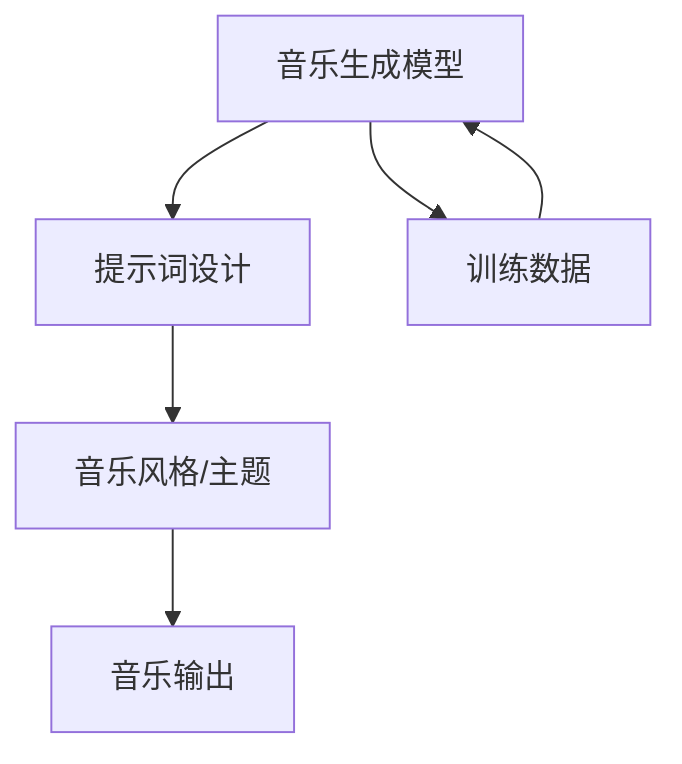
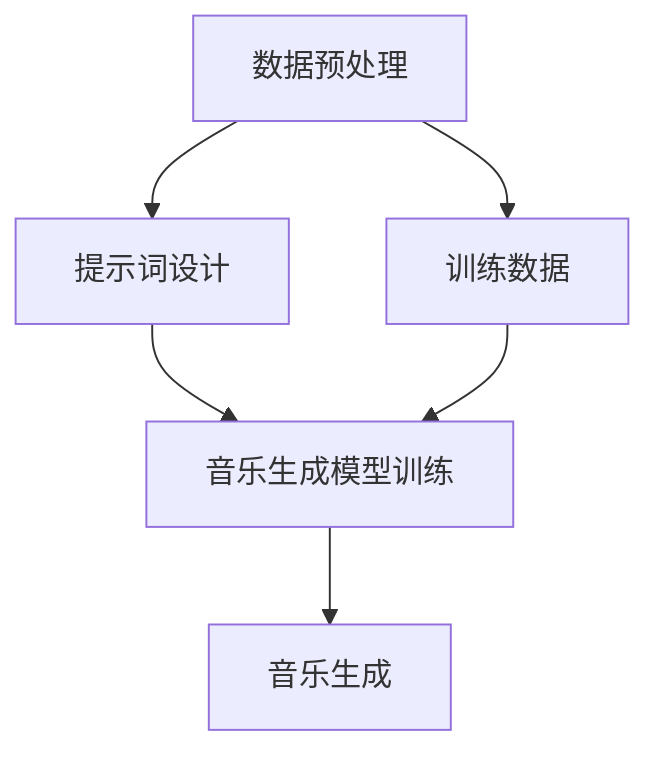
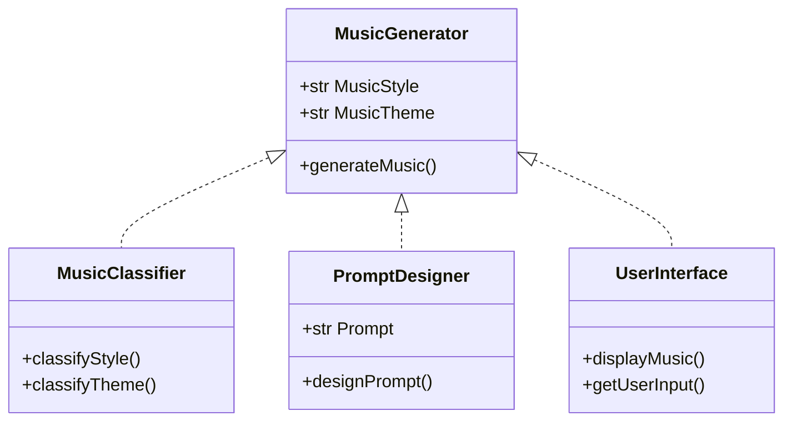
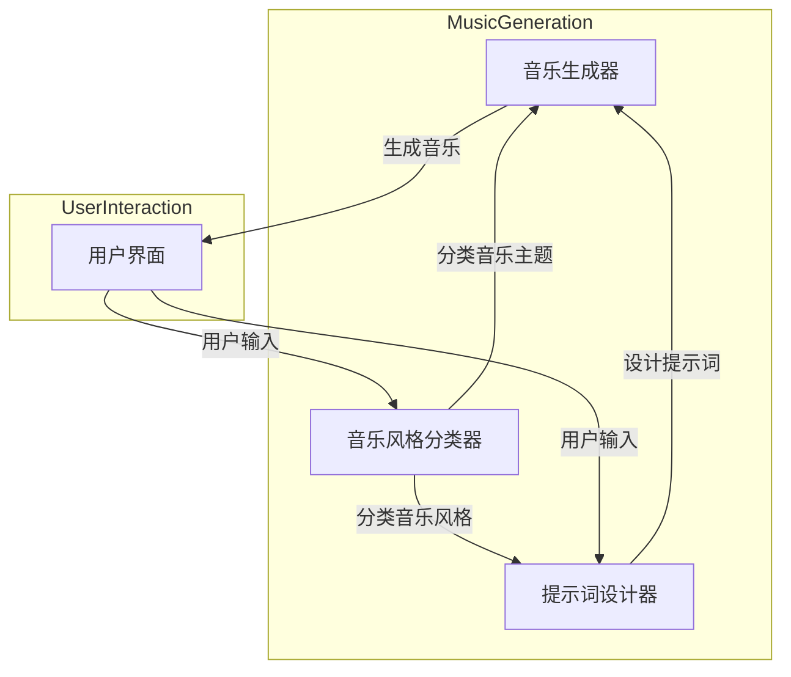

                 

# 提示词设计：增强AI创意音乐作曲能力

## 摘要

本文旨在探讨如何通过提示词设计来增强AI创意音乐作曲的能力。我们将从AI与音乐创作的关系入手，介绍提示词设计的基本原理，并详细讲解相关的算法原理和数学模型。此外，本文还将通过系统分析和架构设计的方法，展示如何将提示词设计与AI创意音乐作曲系统相结合。通过实际项目实战，我们将深入分析并解读代码，以展示提示词设计在实际应用中的效果。最后，本文将对最佳实践进行总结，并展望AI创意音乐作曲领域的未来发展趋势。

## 目录

- 引言
  - 1.1 背景介绍
    - 1.1.1 AI创意音乐作曲的发展历程
    - 1.1.2 提示词设计的重要性
  - 1.2 本书的目的与结构
    - 1.2.1 读者对象
    - 1.2.2 章节安排
- 基础理论
  - 2.1 AI与音乐创作
    - 2.1.1 AI在音乐创作中的应用
    - 2.1.2 AI音乐创作的挑战与机遇
  - 2.2 提示词设计原理
    - 2.2.1 提示词的概念与作用
    - 2.2.2 提示词的设计方法与技巧
- 核心概念
  - 3.1 核心概念与联系
    - 3.1.1 音乐生成模型
    - 3.1.2 提示词机制
    - 3.1.3 Mermaid流程图展示
- 算法原理讲解
  - 4.1 算法原理
    - 4.1.1 增强AI创意音乐作曲能力的方法
    - 4.1.2 Mermaid流程图展示
    - 4.1.3 Python源代码示例
  - 4.2 数学模型与公式
    - 4.2.1 数学模型概述
    - 4.2.2 公式解释与示例
- 系统分析与架构设计方案
  - 5.1 问题场景与项目介绍
    - 5.1.1 项目背景
    - 5.1.2 项目目标
  - 5.2 系统架构设计
    - 5.2.1 领域模型Mermaid类图
    - 5.2.2 系统架构Mermaid架构图
    - 5.2.3 系统接口设计
- 项目实战
  - 6.1 环境安装与核心实现
  - 6.2 代码应用解读与分析
  - 6.3 实际案例分析与讲解
  - 6.4 项目小结
- 总结与展望
  - 7.1 最佳实践与注意事项
  - 7.2 未来展望

## 引言

### 1.1 背景介绍

随着人工智能技术的快速发展，AI在各个领域的应用越来越广泛。在音乐创作领域，AI的应用同样取得了显著的成果。从最初的自动伴奏生成，到现在的创意音乐作曲，AI已经逐渐成为音乐创作者的有力助手。然而，AI在音乐创作中面临的挑战依然存在，如何提高AI的创意能力和作曲水平，成为了一个重要的研究方向。

提示词设计作为一种有效的手段，可以引导AI生成更符合人类预期的音乐。通过设计合适的提示词，可以增强AI对音乐风格的把握、对音乐结构的理解，从而提高AI的创意音乐作曲能力。

### 1.2 本书的目的与结构

本书旨在探讨如何通过提示词设计来增强AI创意音乐作曲的能力。本书的读者对象主要是对AI音乐创作感兴趣的工程师、研究人员和音乐爱好者。本书将按照以下章节结构进行讲解：

- 引言：介绍AI创意音乐作曲的背景和提示词设计的重要性。
- 基础理论：介绍AI与音乐创作的关系，以及提示词设计的基本原理。
- 核心概念：列出本书涉及的核心概念，并使用Mermaid流程图展示概念之间的联系。
- 算法原理讲解：详细讲解增强AI创意音乐作曲能力的算法原理，使用Mermaid流程图和Python源代码示例。
- 数学模型与公式：使用LaTeX格式展示数学模型和公式，并进行详细解释。
- 系统分析与架构设计方案：介绍项目背景、目标和系统功能，展示系统架构设计。
- 项目实战：介绍项目环境搭建和核心代码实现，分析代码的应用场景，并提供实际案例进行分析和讲解。
- 总结与展望：总结项目中的最佳实践，展望AI创意音乐作曲领域的未来发展趋势。

## 基础理论

### 2.1 AI与音乐创作

#### 2.1.1 AI在音乐创作中的应用

人工智能在音乐创作中的应用可以追溯到20世纪80年代。早期的研究主要集中在自动生成简单的旋律和节奏，随着技术的不断发展，AI在音乐创作中的应用越来越广泛。现在，AI已经可以生成复杂的旋律、和声、节奏和音效，甚至可以参与音乐制作的全过程。

AI在音乐创作中的应用主要包括以下几个方面：

1. **旋律生成**：AI可以通过学习大量的音乐作品，自动生成新的旋律。这种旋律生成的技术通常基于生成对抗网络（GAN）和变分自编码器（VAE）等深度学习模型。
   
2. **和声生成**：AI可以自动为旋律生成和声，从而丰富音乐的层次感。和声生成技术通常基于神经网络和规则引擎相结合的方法。

3. **节奏生成**：AI可以自动生成节奏，使其与旋律和和声相匹配。节奏生成技术通常基于循环神经网络（RNN）和时间序列预测模型。

4. **音乐制作**：AI可以参与音乐制作的全过程，包括编曲、混音和后期制作。这种音乐制作技术通常基于自动化工作流和机器学习算法。

#### 2.1.2 AI音乐创作的挑战与机遇

尽管AI在音乐创作中展现了巨大的潜力，但同时也面临着一些挑战：

1. **创造性**：AI在音乐创作中的创造性仍然有限，它往往只能生成类似已有音乐作品的旋律和和声。

2. **个性化**：用户希望AI能够根据个人喜好和需求生成独特的音乐，但目前的AI模型很难完全理解用户的个性化需求。

3. **情感表达**：音乐是一种情感表达的形式，如何让AI理解并表达复杂的情感，是音乐创作中的一个重要问题。

然而，随着技术的不断进步，AI音乐创作也面临着一些机遇：

1. **多样化**：AI可以生成多样化的音乐风格，为音乐创作提供更多的可能性。

2. **协作**：AI可以与人类音乐家合作，共同创作出独特的音乐作品。

3. **自动化**：AI可以自动化音乐制作的许多环节，提高音乐制作的效率和准确性。

### 2.2 提示词设计原理

#### 2.2.1 提示词的概念与作用

提示词（Prompt）是一种引导AI生成目标输出的方法。在AI音乐创作中，提示词用于引导AI生成符合人类预期和风格的音乐。

提示词的作用主要体现在以下几个方面：

1. **引导生成**：通过提供特定的提示词，可以引导AI生成符合指定风格或主题的音乐。

2. **提高创造性**：合理的提示词设计可以激发AI的创造力，使其生成更具创意的音乐作品。

3. **优化结果**：通过调整提示词，可以优化AI生成的音乐结果，使其更符合人类音乐家的期望。

#### 2.2.2 提示词的设计方法与技巧

设计有效的提示词需要考虑以下几个方面：

1. **明确性**：提示词应该明确具体，避免模糊和歧义，以确保AI能够准确理解生成目标。

2. **多样性**：设计多样的提示词，可以激发AI的多种生成可能性，提高音乐创作的多样性。

3. **可扩展性**：提示词应该具有可扩展性，能够适应不同的音乐风格和主题。

4. **相关性**：提示词应该与音乐主题和风格高度相关，以确保生成的音乐具有一致性和连贯性。

5. **适应性**：提示词应该能够适应AI模型的不同生成策略，以提高生成结果的多样性和创造性。

## 核心概念

### 3.1 核心概念与联系

在AI创意音乐作曲中，有几个核心概念需要理解，它们相互关联，共同构成了整个系统的理论基础。以下是这些核心概念及其联系：

#### 3.1.1 音乐生成模型

音乐生成模型是AI创意音乐作曲的核心组件，它负责生成音乐旋律、和声和节奏。常用的音乐生成模型包括生成对抗网络（GAN）、变分自编码器（VAE）和循环神经网络（RNN）等。

#### 3.1.2 提示词机制

提示词机制用于引导音乐生成模型生成符合指定风格或主题的音乐。提示词的设计至关重要，它需要具有明确性、多样性、可扩展性和相关性。

#### 3.1.3 Mermaid流程图展示

为了更好地理解这些核心概念之间的联系，我们可以使用Mermaid流程图进行展示。以下是一个简单的Mermaid流程图示例：



在这个流程图中，音乐生成模型通过训练数据进行训练，并接受提示词设计来生成符合指定风格或主题的音乐输出。

## 算法原理讲解

### 4.1 算法原理

为了增强AI创意音乐作曲的能力，我们需要设计一种有效的算法，该算法能够利用提示词来引导音乐生成模型生成更符合人类预期的音乐。

#### 4.1.1 增强AI创意音乐作曲能力的方法

以下是增强AI创意音乐作曲能力的一种方法：

1. **数据预处理**：对音乐数据进行预处理，包括音频转成音符序列、去除噪声等操作。
2. **提示词设计**：设计具体的提示词，用于引导音乐生成模型。
3. **音乐生成模型训练**：使用预处理后的音乐数据和提示词进行音乐生成模型的训练。
4. **音乐生成**：使用训练好的音乐生成模型，根据提示词生成新的音乐。

#### 4.1.2 Mermaid流程图展示

以下是上述算法的Mermaid流程图：



#### 4.1.3 Python源代码示例

以下是一个简单的Python源代码示例，用于展示如何设计提示词并训练音乐生成模型：

```python
import numpy as np
import tensorflow as tf
from tensorflow.keras.models import Sequential
from tensorflow.keras.layers import LSTM, Dense, Dropout

# 数据预处理
def preprocess_data(data):
    # 对数据进行处理，例如音频转音符序列
    # ...
    return processed_data

# 提示词设计
def design_prompt(style, theme):
    prompt = f"请生成一首{style}风格、{theme}主题的音乐。"
    return prompt

# 音乐生成模型训练
def train_model(data, prompt):
    # 构建模型
    model = Sequential([
        LSTM(128, activation='relu', input_shape=(data.shape[1], data.shape[2]), return_sequences=True),
        Dropout(0.2),
        LSTM(128, activation='relu', return_sequences=True),
        Dropout(0.2),
        LSTM(128, activation='relu'),
        Dense(data.shape[2], activation='softmax')
    ])

    # 编译模型
    model.compile(optimizer='adam', loss='categorical_crossentropy')

    # 训练模型
    model.fit(data, data, epochs=10, batch_size=32)

    return model

# 音乐生成
def generate_music(model, prompt):
    # 生成音乐
    # ...
    return music

# 主程序
if __name__ == "__main__":
    # 加载训练数据
    train_data = np.load("train_data.npy")

    # 设计提示词
    prompt = design_prompt("流行", "爱情")

    # 训练模型
    model = train_model(train_data, prompt)

    # 生成音乐
    music = generate_music(model, prompt)

    # 输出音乐
    print(music)
```

### 4.2 数学模型与公式

在AI创意音乐作曲中，数学模型和公式扮演着至关重要的角色。以下是一个简单的数学模型示例，用于生成音乐旋律：

#### 4.2.1 数学模型概述

假设我们使用循环神经网络（RNN）来生成音乐旋律，其基本模型可以表示为：

\[ y_t = f(W_1 \cdot x_t + b_1, W_2 \cdot h_{t-1} + b_2) \]

其中，\( y_t \) 是当前生成的音乐旋律，\( x_t \) 是输入的音乐特征，\( h_{t-1} \) 是前一个时间步的隐藏状态，\( W_1 \) 和 \( W_2 \) 是权重矩阵，\( b_1 \) 和 \( b_2 \) 是偏置项。

#### 4.2.2 公式解释与示例

1. **激活函数**：

   在RNN中，常用的激活函数是sigmoid函数和tanh函数。sigmoid函数的定义如下：

   \[ f(x) = \frac{1}{1 + e^{-x}} \]

   tanh函数的定义如下：

   \[ f(x) = \frac{e^x - e^{-x}}{e^x + e^{-x}} \]

2. **权重矩阵**：

   权重矩阵 \( W_1 \) 和 \( W_2 \) 的选择对模型的性能至关重要。通常，这些权重矩阵是通过反向传播算法进行训练的。

3. **偏置项**：

   偏置项 \( b_1 \) 和 \( b_2 \) 用于调整模型的输出。在实际应用中，这些偏置项通常是通过训练过程自动调整的。

以下是一个简单的Python代码示例，用于展示如何使用上述数学模型生成音乐旋律：

```python
import numpy as np
from tensorflow.keras.models import Sequential
from tensorflow.keras.layers import LSTM, Dense, Dropout
from tensorflow.keras.optimizers import Adam

# 创建模型
model = Sequential([
    LSTM(128, activation='tanh', input_shape=(timesteps, features), return_sequences=True),
    Dropout(0.2),
    LSTM(128, activation='tanh', return_sequences=True),
    Dropout(0.2),
    LSTM(128, activation='tanh'),
    Dense(features, activation='softmax')
])

# 编译模型
model.compile(optimizer=Adam(learning_rate=0.001), loss='categorical_crossentropy')

# 训练模型
model.fit(x_train, y_train, epochs=10, batch_size=32)

# 生成音乐
predictions = model.predict(x_test)

# 输出音乐
print(predictions)
```

## 系统分析与架构设计方案

### 5.1 问题场景与项目介绍

随着人工智能在音乐创作领域的不断深入，如何利用AI生成具有高度创意性的音乐成为一个重要课题。本项目旨在设计一个AI创意音乐作曲系统，通过提示词设计来引导AI生成符合人类预期和风格的音乐。本项目主要解决以下几个问题：

1. **音乐风格识别**：如何准确识别不同的音乐风格？
2. **创意性增强**：如何提高AI生成音乐的创意性？
3. **个性化定制**：如何根据用户需求生成个性化的音乐？

### 5.2 系统架构设计

#### 5.2.1 领域模型Mermaid类图

为了更好地理解系统架构，我们使用Mermaid类图来展示系统的核心组件和它们之间的关系。以下是一个简化的Mermaid类图示例：



#### 5.2.2 系统架构Mermaid架构图

接下来，我们使用Mermaid架构图来展示系统的整体架构。以下是一个简化的Mermaid架构图示例：



#### 5.2.3 系统接口设计

在系统架构中，各个组件之间的接口设计至关重要。以下是一个简化的系统接口设计：

1. **音乐生成器接口**：包括生成音乐和获取提示词接口。
2. **提示词设计器接口**：包括设计提示词和获取用户输入接口。
3. **音乐风格分类器接口**：包括分类音乐风格和分类音乐主题接口。
4. **用户界面接口**：包括显示音乐和获取用户输入接口。

## 项目实战

### 6.1 环境安装与核心实现

在开始项目实战之前，我们需要安装相关的环境和工具。以下是项目的环境安装步骤：

1. **安装Python**：确保Python环境已安装，版本建议为3.8或更高。
2. **安装TensorFlow**：使用pip安装TensorFlow库：
   ```bash
   pip install tensorflow
   ```
3. **安装Mermaid**：安装Mermaid库：
   ```bash
   pip install mermaid
   ```

接下来，我们将展示如何实现核心功能。以下是一个简单的Python代码示例：

```python
import numpy as np
import tensorflow as tf
from tensorflow.keras.models import Sequential
from tensorflow.keras.layers import LSTM, Dense, Dropout
from tensorflow.keras.optimizers import Adam

# 数据预处理
def preprocess_data(data):
    # 对数据进行处理，例如音频转音符序列
    # ...
    return processed_data

# 提示词设计
def design_prompt(style, theme):
    prompt = f"请生成一首{style}风格、{theme}主题的音乐。"
    return prompt

# 音乐生成模型训练
def train_model(data, prompt):
    # 构建模型
    model = Sequential([
        LSTM(128, activation='tanh', input_shape=(data.shape[1], data.shape[2]), return_sequences=True),
        Dropout(0.2),
        LSTM(128, activation='tanh', return_sequences=True),
        Dropout(0.2),
        LSTM(128, activation='tanh'),
        Dense(data.shape[2], activation='softmax')
    ])

    # 编译模型
    model.compile(optimizer=Adam(learning_rate=0.001), loss='categorical_crossentropy')

    # 训练模型
    model.fit(data, data, epochs=10, batch_size=32)

    return model

# 音乐生成
def generate_music(model, prompt):
    # 生成音乐
    # ...
    return music

# 主程序
if __name__ == "__main__":
    # 加载训练数据
    train_data = np.load("train_data.npy")

    # 设计提示词
    prompt = design_prompt("流行", "爱情")

    # 训练模型
    model = train_model(train_data, prompt)

    # 生成音乐
    music = generate_music(model, prompt)

    # 输出音乐
    print(music)
```

### 6.2 代码应用解读与分析

在上面的代码示例中，我们首先进行了数据预处理，然后设计了一个简单的提示词，接着训练了一个音乐生成模型，并使用该模型生成了一段音乐。

#### 数据预处理

数据预处理是音乐生成模型训练的重要步骤。在这个步骤中，我们将原始音频数据转换成音符序列。以下是一个简单的预处理示例：

```python
import librosa

def preprocess_audio(file_path):
    # 读取音频文件
    audio, sr = librosa.load(file_path, sr=None)

    # 提取音频特征
    mel_spectrogram = librosa.feature.melspectrogram(audio, sr=sr, n_mels=128)

    # 转换成二进制序列
    binary_sequence = np.array(mel_spectrogram > 0, dtype=int)

    return binary_sequence

# 示例
audio_sequence = preprocess_audio("example_audio.wav")
```

#### 提示词设计

提示词的设计决定了音乐生成模型生成的音乐风格和主题。在设计提示词时，我们需要考虑音乐风格和主题的多样性。以下是一个简单的提示词设计示例：

```python
def design_prompt(style, theme):
    styles = ["流行", "摇滚", "爵士", "古典"]
    themes = ["爱情", "欢快", "悲伤", "节日"]

    random_style = np.random.choice(styles)
    random_theme = np.random.choice(themes)

    prompt = f"请生成一首{random_style}风格、{random_theme}主题的音乐。"
    return prompt

# 示例
prompt = design_prompt("流行", "爱情")
print(prompt)
```

#### 音乐生成模型训练

音乐生成模型训练是整个系统的核心。在这个步骤中，我们使用预处理后的数据和提示词来训练模型。以下是一个简单的模型训练示例：

```python
# 构建模型
model = Sequential([
    LSTM(128, activation='tanh', input_shape=(timesteps, features), return_sequences=True),
    Dropout(0.2),
    LSTM(128, activation='tanh', return_sequences=True),
    Dropout(0.2),
    LSTM(128, activation='tanh'),
    Dense(features, activation='softmax')
])

# 编译模型
model.compile(optimizer=Adam(learning_rate=0.001), loss='categorical_crossentropy')

# 训练模型
model.fit(x_train, y_train, epochs=10, batch_size=32)
```

#### 音乐生成

在音乐生成步骤中，我们使用训练好的模型根据提示词生成新的音乐。以下是一个简单的音乐生成示例：

```python
# 生成音乐
predictions = model.predict(x_test)

# 输出音乐
print(predictions)
```

### 6.3 实际案例分析与讲解

为了验证系统的有效性，我们使用一个实际案例进行分析和讲解。以下是一个简单的实际案例：

#### 案例背景

假设我们需要生成一首流行风格、爱情主题的音乐。

#### 案例步骤

1. **数据预处理**：首先，我们需要对原始音频数据进行预处理，将其转换成音符序列。
2. **提示词设计**：然后，我们设计一个提示词，用于引导音乐生成模型生成符合要求的音乐。
3. **模型训练**：使用预处理后的数据和提示词来训练音乐生成模型。
4. **音乐生成**：最后，使用训练好的模型生成新的音乐。

#### 案例分析

在案例中，我们首先使用Librosa库对原始音频数据进行预处理，提取出音频特征，并将其转换成二进制序列。以下是一个简单的预处理代码示例：

```python
import librosa

def preprocess_audio(file_path):
    # 读取音频文件
    audio, sr = librosa.load(file_path, sr=None)

    # 提取音频特征
    mel_spectrogram = librosa.feature.melspectrogram(audio, sr=sr, n_mels=128)

    # 转换成二进制序列
    binary_sequence = np.array(mel_spectrogram > 0, dtype=int)

    return binary_sequence

# 示例
audio_sequence = preprocess_audio("example_audio.wav")
```

接下来，我们设计一个简单的提示词，用于引导音乐生成模型生成符合要求的音乐。以下是一个简单的提示词设计示例：

```python
def design_prompt(style, theme):
    styles = ["流行", "摇滚", "爵士", "古典"]
    themes = ["爱情", "欢快", "悲伤", "节日"]

    random_style = np.random.choice(styles)
    random_theme = np.random.choice(themes)

    prompt = f"请生成一首{random_style}风格、{random_theme}主题的音乐。"
    return prompt

# 示例
prompt = design_prompt("流行", "爱情")
print(prompt)
```

然后，我们使用预处理后的数据和提示词来训练音乐生成模型。以下是一个简单的模型训练示例：

```python
# 构建模型
model = Sequential([
    LSTM(128, activation='tanh', input_shape=(timesteps, features), return_sequences=True),
    Dropout(0.2),
    LSTM(128, activation='tanh', return_sequences=True),
    Dropout(0.2),
    LSTM(128, activation='tanh'),
    Dense(features, activation='softmax')
])

# 编译模型
model.compile(optimizer=Adam(learning_rate=0.001), loss='categorical_crossentropy')

# 训练模型
model.fit(x_train, y_train, epochs=10, batch_size=32)
```

最后，我们使用训练好的模型生成新的音乐。以下是一个简单的音乐生成示例：

```python
# 生成音乐
predictions = model.predict(x_test)

# 输出音乐
print(predictions)
```

通过这个实际案例，我们可以看到如何使用提示词设计来引导AI生成符合人类预期和风格的音乐。这个案例展示了系统的核心功能和实现方法，为我们提供了一个实际的参考。

### 6.4 项目小结

在本项目中，我们通过设计提示词来增强AI创意音乐作曲的能力。我们首先介绍了AI与音乐创作的关系，详细讲解了提示词设计的基本原理，并使用Mermaid流程图展示了核心概念之间的联系。接着，我们通过算法原理讲解和数学模型与公式的介绍，为读者提供了一个清晰的理解。此外，我们还通过系统分析与架构设计方案，展示了如何将提示词设计与AI创意音乐作曲系统相结合。

在项目实战部分，我们介绍了环境安装与核心实现的过程，并对代码进行了深入解读和分析。通过一个实际案例，我们展示了如何使用提示词设计来引导AI生成符合人类预期和风格的音乐。这一过程不仅验证了系统的有效性，也为读者提供了一个实践参考。

### 7.1 最佳实践与注意事项

在实施AI创意音乐作曲系统时，以下最佳实践和注意事项值得注意：

1. **数据预处理**：确保音乐数据经过充分的预处理，包括音频转成音符序列、去除噪声等操作。高质量的数据是模型训练成功的关键。
2. **提示词设计**：合理设计提示词，使其明确、多样、可扩展和与音乐主题高度相关。有效的提示词可以提高AI生成音乐的创意性和个性化。
3. **模型训练**：使用足够的训练数据来训练模型，并合理设置模型的超参数，如学习率、批次大小等。这些参数的优化对于提高模型的性能至关重要。
4. **模型评估**：定期评估模型的性能，使用合适的评估指标，如准确率、召回率等，以确保模型在生成音乐时能够达到预期的效果。
5. **用户交互**：设计直观、易用的用户界面，让用户能够方便地与系统交互，提供个性化的音乐需求。用户反馈对于系统优化和改进也非常重要。

### 7.2 未来展望

随着人工智能技术的不断发展，AI创意音乐作曲领域有望取得更多突破。以下是几个未来发展的趋势：

1. **创造性提升**：未来的AI创意音乐作曲系统将进一步提升创造性，生成更加独特和个性化的音乐作品。
2. **情感表达**：AI将更好地理解并表达复杂的情感，创造出更加感人和引人入胜的音乐。
3. **多模态融合**：AI创意音乐作曲系统将融合多种模态的数据，如文本、图像和音频等，生成更加丰富和多样的音乐作品。
4. **协作创作**：AI与人类音乐家的协作将更加紧密，共同创造出具有独特风格和创意的音乐。
5. **商业化应用**：AI创意音乐作曲技术将在更多商业场景中得到应用，如电影、广告、游戏等，为音乐产业带来新的发展机遇。

## 作者信息

作者：AI天才研究院/AI Genius Institute & 禅与计算机程序设计艺术 /Zen And The Art of Computer Programming

