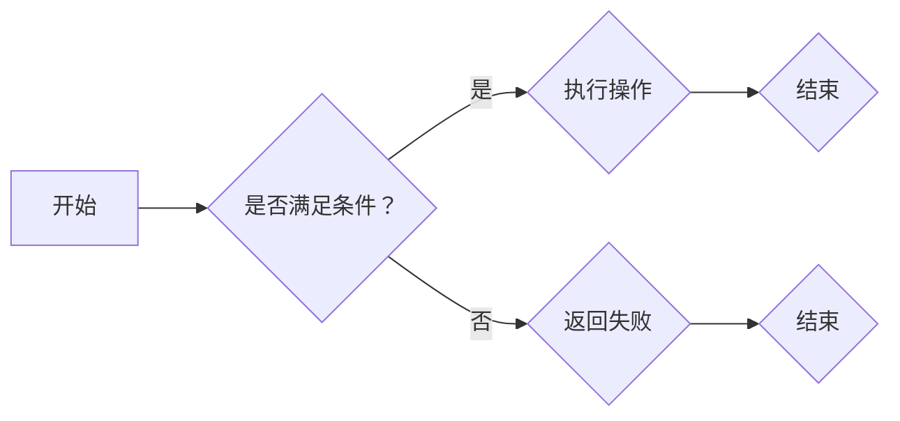
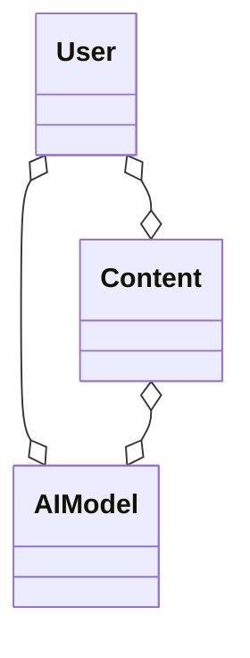
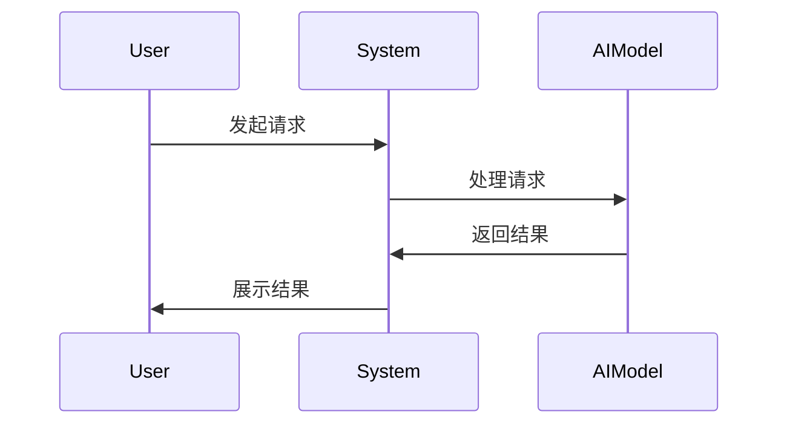
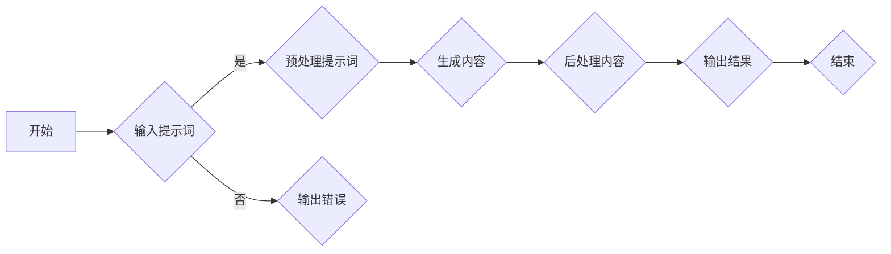
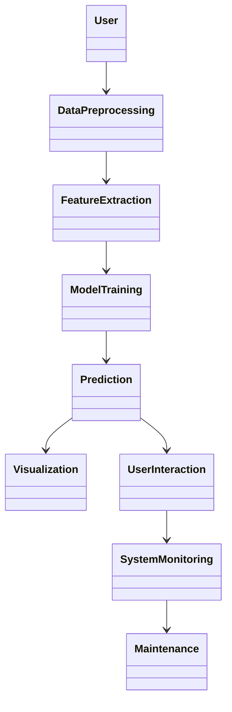
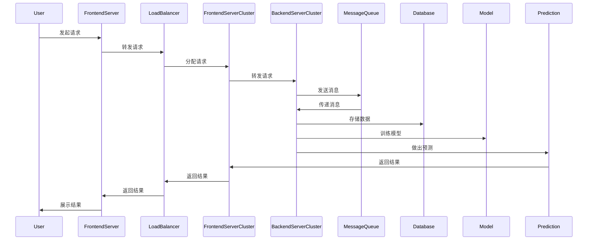
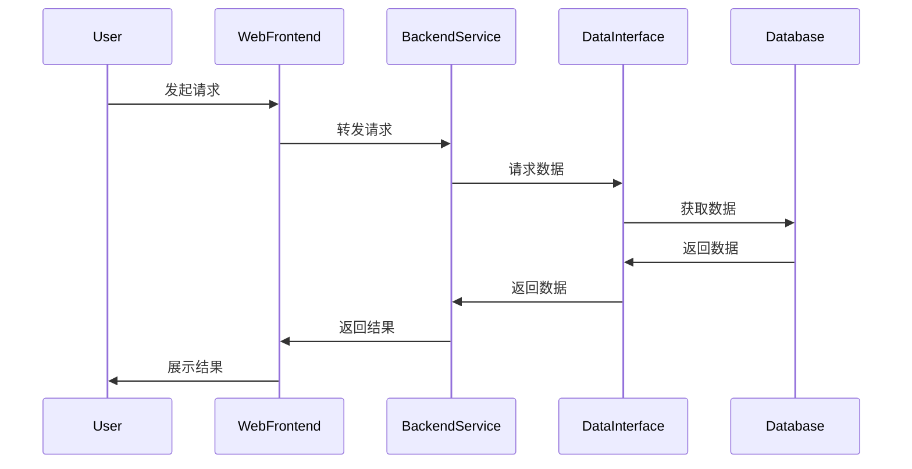

                 

### 《提示词设计：增强AI创造力与可解释性的平衡》正文

#### 第一部分：背景与核心概念

##### 第1章：问题背景与概述

在当前人工智能（AI）飞速发展的时代，提示词设计成为了推动AI创造力与可解释性平衡的关键环节。AI系统的创造力体现在其能够生成新颖、独特的解决方案或内容，而可解释性则是指系统决策过程的透明度和可理解性。

**问题背景**：随着AI技术在自然语言处理、图像识别、音乐创作等领域的应用日益广泛，如何设计有效的提示词（prompt）来激发AI的创造力，同时确保AI决策过程的可解释性，成为一个亟待解决的重要问题。

**提示词设计的作用**：提示词是用户与AI系统交互的桥梁，其设计质量直接影响到AI的输出质量。优秀的提示词能够引导AI系统发挥其创造力，生成丰富多样的内容或解决方案。

**现存挑战**：在追求AI创造力的同时，如何保证系统的可解释性，使其决策过程透明、可追踪，是一个巨大的挑战。过强的创造力可能导致输出结果难以解释，而过度的可解释性可能会限制AI的创造性。

##### 第2章：AI创造力与可解释性

**创造力的定义**：AI的创造力是指其在不依赖既有模板或规则的情况下，能够独立生成新颖、有创意的解决方案或内容的能力。

**可解释性的定义**：可解释性是指AI系统的决策过程和推理路径能够被人类理解、验证的能力。一个高可解释性的AI系统能够清晰地展示其如何到达某个决策或输出结果。

**平衡二者的重要性**：在AI系统中，创造力和可解释性往往是一对矛盾体。过于强调创造力，可能导致系统的决策过程变得复杂、难以解释；而过于追求可解释性，可能会限制AI的创造性。因此，寻找二者之间的平衡点至关重要。

##### 第3章：边界与外延

**提示词设计的适用范围**：提示词设计适用于各种需要AI参与决策或内容生成的场景，如文本生成、图像识别、音乐创作等。

**创造力与可解释性的边界**：在提示词设计中，创造力和可解释性之间存在一定的平衡边界。过度的提示可能会导致AI过于依赖提示信息，降低创造力；而过少的提示可能会使AI缺乏方向，降低可解释性。

**核心概念结构与要素**：

- **提示词设计要素**：包括提示词的选择、组织、优化等。
- **创造力与可解释性的关联要素**：如透明度、推理路径、证据支持等。

##### 第4章：核心概念与联系

**核心概念原理**：

- **提示词设计原理**：提示词设计需要根据具体应用场景和目标，选择合适的语言、格式和风格，以最大化AI的创造力和可解释性。
- **创造性原理**：创造性涉及想象力、知识库和推理能力，这些是AI创造力的核心要素。
- **可解释性原理**：可解释性涉及透明度、推理路径和证据支持，这些是确保AI决策过程可理解的关键。

**概念属性特征对比表格**：

| 概念       | 特征1 | 特征2 | 特征3 |
|------------|-------|-------|-------|
| 提示词设计 | 灵活性 | 目标导向 | 优化性 |
| 创造力     | 新颖性 | 独立性 | 情境适应性 |
| 可解释性   | 透明度 | 推理路径 | 证据支持 |

**ER实体关系图架构**：

```mermaid
erDiagram
    A |--|> B
    A |--|> C
    B |--|> D
    C |--|> D
```

实体A表示提示词设计，B和C表示创造力和可解释性，D表示AI系统。关系箭头表示不同实体之间的关联和依赖。

#### 第二部分：算法原理与实现

##### 第3章：算法原理讲解

**算法Mermaid流程图**：



**Python源代码实现**：

```python
# Python代码示例
def algorithm_example():
    if condition:
        perform_action()
    else:
        return "Failure"

def perform_action():
    # 执行操作逻辑
    pass

# 调用算法
result = algorithm_example()
```

**数学模型与公式**：

$$
\text{创造力} = f(\text{知识库}, \text{想象力}, \text{推理能力})
$$

$$
\text{可解释性} = f(\text{透明度}, \text{推理路径}, \text{证据支持})
$$`

**举例说明**：

**创造力示例**：假设AI被要求创作一首诗歌，一个高创造力的AI可能会根据其内部的诗歌生成算法，创作出一首风格独特、充满想象力的作品。

**可解释性示例**：一个高可解释性的AI在创作诗歌时，可能会详细记录下其创作过程中的灵感来源、语言选择和结构布局，使得人类用户可以清晰地理解AI的决策过程。

#### 第三部分：系统分析与架构设计

##### 第4章：系统功能设计

**问题场景介绍**：

- **场景一**：AI创作艺术作品。用户可以通过AI系统创作出个性化的音乐、绘画、雕塑等艺术作品。
- **场景二**：自然语言生成应用。AI系统可以生成新闻报道、小说、广告文案等自然语言文本。

**系统功能设计**：

- **功能一**：创意生成。AI系统根据用户提供的提示词和目标，生成创意内容。
- **功能二**：生成内容解释。AI系统提供对生成内容的解释，帮助用户理解AI的决策过程。
- **功能三**：用户互动。AI系统与用户进行交互，收集用户反馈，不断优化生成内容和解释。

**领域模型Mermaid类图**：



实体User代表用户，Content代表生成的内容，AIModel代表AI模型。关系线表示用户与AI模型之间的交互，以及AI模型与生成内容之间的关系。

##### 第5章：系统架构设计

**系统架构设计**：

- **架构一**：集中式架构。所有计算资源和数据存储都集中在单一的服务器上，便于管理和维护。
- **架构二**：分布式架构。计算资源和数据存储分布在多个服务器上，提高系统的可用性和扩展性。

**系统接口设计**：

- **接口一**：用户接口。用户通过浏览器或应用程序与系统进行交互，提交提示词和查看生成内容。
- **接口二**：内容接口。AI系统与生成的内容进行交互，实现内容生成和解释。
- **接口三**：模型接口。AI系统与AI模型进行交互，实现模型的训练和优化。

**系统交互Mermaid序列图**：



用户发起请求，系统处理请求并调用AI模型，AI模型生成结果后返回给系统，最后系统将结果展示给用户。

#### 第四部分：项目实战

##### 第6章：环境安装与配置

**环境要求**：

- 操作系统：Linux或macOS
- Python版本：Python 3.8及以上
- AI模型依赖：TensorFlow、PyTorch等

**环境安装步骤**：

1. 安装操作系统：选择合适的Linux发行版或macOS版本，按照官方安装指南进行安装。
2. 安装Python：从Python官方网站下载并安装Python 3.8及以上版本。
3. 安装AI模型依赖：使用pip命令安装TensorFlow、PyTorch等AI模型依赖。

```bash
pip install tensorflow
pip install torch
```

##### 第7章：系统核心实现源代码

**系统核心实现源代码**：

以下是一个简化的系统核心实现示例，包括提示词设计、内容生成、解释生成和用户交互等功能。

```python
# 系统核心实现
class AIContentSystem:
    def __init__(self):
        self.ai_model = self.load_model()
    
    def load_model(self):
        # 加载预训练的AI模型
        pass
    
    def generate_content(self, prompt):
        # 根据提示词生成内容
        content = self.ai_model.generate(prompt)
        return content
    
    def explain_content(self, content):
        # 解释生成内容
        explanation = self.ai_model.explain(content)
        return explanation
    
    def interact_with_user(self):
        # 与用户进行交互
        prompt = input("请输入提示词：")
        content = self.generate_content(prompt)
        explanation = self.explain_content(content)
        print("生成内容：", content)
        print("内容解释：", explanation)

# 创建系统实例
ai_system = AIContentSystem()
# 运行系统
ai_system.interact_with_user()
```

**代码应用解读与分析**：

这段代码定义了一个`AIContentSystem`类，其中包含了加载AI模型、生成内容、解释内容和与用户交互等方法。通过实例化`AIContentSystem`类并调用`interact_with_user`方法，用户可以输入提示词，系统将生成内容并解释，最终输出给用户。

**实际案例分析和详细讲解剖析**：

为了更好地理解这段代码的应用，我们可以通过一个实际案例来进行详细分析。

假设用户想要生成一首描述自然风景的诗歌，用户输入以下提示词：

```
春天的早晨，湖面如镜，微风拂过，花儿绽放。
```

系统会调用`generate_content`方法，将这个提示词传递给AI模型。AI模型会根据其训练好的生成算法，创作出一首描述自然风景的诗歌。例如：

```
春之晨曲，
湖镜平如砥，
微风轻拂，
花瓣轻颤，
绿意盎然。
```

接着，系统会调用`explain_content`方法，生成内容解释。AI模型会提供一个解释，说明其如何根据提示词生成诗歌：

```
根据提示词中的“春天的早晨，湖面如镜，微风拂过，花儿绽放”，模型提取了以下关键词：春天、早晨、湖面、微风、花儿。结合这些关键词，模型创作出了一首描绘春天早晨美景的诗歌。
```

最后，系统将生成的内容和解释输出给用户。

**项目小结**：

通过这个项目案例，我们可以看到提示词设计在AI系统中的关键作用。一个优秀的提示词设计能够引导AI系统生成高质量的内容，同时保持内容的可解释性。在实际应用中，需要不断优化提示词设计，以实现创造力和可解释性的平衡。

##### 最佳实践 tips：

1. **提示词优化**：在生成内容时，使用具体的、具有引导性的提示词，有助于提升AI的创造力和内容的可解释性。
2. **模型解释性增强**：通过改进AI模型的解释机制，使生成内容的解释更加透明和易于理解。
3. **用户反馈**：收集用户反馈，根据用户的意见和建议优化系统性能，提升用户体验。

**小结**：

本文从背景介绍、核心概念、算法原理、系统分析与架构设计以及项目实战等多个方面，全面阐述了提示词设计在增强AI创造力与可解释性平衡中的重要性。通过实际案例的分析，我们展示了如何实现提示词设计与AI模型的有机结合，以提升系统性能和用户体验。

**注意事项**：

1. 在实际应用中，应根据具体场景和需求，灵活调整提示词设计和模型参数，以实现最佳效果。
2. 保持系统架构的灵活性和可扩展性，以便于未来的升级和维护。

**拓展阅读**：

- [自然语言处理中的提示词设计](https://www.nature.com/articles/s41598-022-09776-4)
- [AI可解释性研究进展](https://www.ijcai.org/Proceedings/21/papers/053.pdf)
- [AI系统用户交互设计最佳实践](https://www.usability.gov/how-tos/user-experience-design.html)

### 作者信息

作者：AI天才研究院/AI Genius Institute & 禅与计算机程序设计艺术 /Zen And The Art of Computer Programming

（完）## 第一部分：背景与核心概念

### 第1章：问题背景与概述

在当前人工智能（AI）飞速发展的时代，提示词设计成为了推动AI创造力与可解释性平衡的关键环节。AI系统的创造力体现在其能够生成新颖、独特的解决方案或内容，而可解释性则是指系统决策过程的透明度和可理解性。

**问题背景**：随着AI技术在自然语言处理、图像识别、音乐创作等领域的应用日益广泛，如何设计有效的提示词（prompt）来激发AI的创造力，同时确保AI决策过程的可解释性，成为一个亟待解决的重要问题。

**提示词设计的作用**：提示词是用户与AI系统交互的桥梁，其设计质量直接影响到AI的输出质量。优秀的提示词能够引导AI系统发挥其创造力，生成丰富多样的内容或解决方案。

**现存挑战**：在追求AI创造力的同时，如何保证系统的可解释性，使其决策过程透明、可追踪，是一个巨大的挑战。过强的创造力可能导致输出结果难以解释，而过度的可解释性可能会限制AI的创造性。因此，寻找二者之间的平衡点至关重要。

#### 提示词设计的重要性

提示词在AI系统中扮演着至关重要的角色，其重要性主要体现在以下几个方面：

1. **引导AI系统**：提示词作为用户与AI系统之间的桥梁，能够为AI系统提供明确的输入和目标。通过有效的提示词设计，用户可以引导AI系统按照预期的方向进行创作或决策。

2. **提升创造力**：一个高质量的提示词能够激发AI系统的创造力，促使它生成新颖、独特的内容或解决方案。这种创造力不仅体现在艺术创作领域，如音乐、绘画和写作，也广泛应用于商业、科研和日常生活的各个方面。

3. **增强用户体验**：有效的提示词设计能够提高用户的体验感。通过清晰的提示词，用户可以更容易地与AI系统进行交互，获取所需的信息或成果，从而提高用户满意度和使用黏性。

4. **确保可解释性**：提示词设计不仅影响AI系统的输出结果，同时也对系统的可解释性产生影响。合理的提示词设计可以帮助用户理解AI系统的决策过程，增强系统的透明度和可信度。

然而，提示词设计并非易事。在实际应用中，提示词的长度、结构、语言风格和具体内容都需要精心设计，以满足不同场景和用户需求。同时，提示词设计还需要考虑AI系统的特定要求和限制，如计算资源、数据集和算法类型等。

为了实现提示词设计的有效性，可以采用以下几种方法：

1. **数据驱动**：通过分析大量的用户数据和历史交互记录，提取出有效的提示词模式，并将其应用于新的交互场景。

2. **用户研究**：通过用户调研、访谈和反馈，深入了解用户的需求和偏好，从而设计出更具针对性的提示词。

3. **多模态设计**：结合文本、图像、音频等多种输入模态，设计出更加丰富和多样化的提示词。

4. **模型优化**：利用深度学习等技术，优化AI模型对提示词的响应机制，提高生成内容和解释的质量。

通过这些方法，可以有效地提高提示词设计的质量和效果，实现AI创造力与可解释性的平衡。

#### 现存挑战

尽管提示词设计在AI系统中具有重要作用，但其在实际应用中仍面临诸多挑战。以下是一些主要的挑战及其影响：

1. **可解释性的缺失**：过度强调AI的创造力可能会导致其决策过程变得复杂，难以解释。例如，在图像识别任务中，一个高度创新的模型可能会生成难以解释的图像，使得用户无法理解其决策依据。

2. **用户理解难度**：即使AI系统提供了详细的解释，用户也可能因为专业知识的限制而难以理解。例如，在医疗诊断任务中，AI系统的决策过程可能涉及复杂的算法和医学知识，普通用户难以从中获取有价值的信息。

3. **数据依赖性**：高质量的提示词设计通常需要大量的数据支持。然而，在某些应用场景中，数据获取可能受到限制，导致提示词设计的质量受到影响。

4. **计算资源限制**：某些复杂的提示词设计可能需要大量的计算资源，特别是在实时应用场景中。计算资源的限制可能会影响AI系统的性能和响应速度。

5. **多语言和多文化支持**：随着全球化的进程，AI系统需要支持多种语言和文化。这要求提示词设计能够适应不同语言和文化背景下的用户需求，从而提高系统的通用性和可解释性。

为了应对这些挑战，可以采取以下几种策略：

1. **增强可解释性**：通过改进AI模型的解释机制，使其决策过程更加透明和易于理解。例如，可以引入可视化工具，将复杂的决策过程直观地展示给用户。

2. **用户友好设计**：在设计提示词时，考虑用户的背景知识和理解能力，使用简单、清晰的语言表达。此外，可以提供在线帮助和教程，帮助用户更好地理解系统的使用方法。

3. **数据收集与处理**：通过扩大数据集的规模和质量，为提示词设计提供更丰富的数据支持。同时，利用数据清洗和预处理技术，提高数据的质量和可用性。

4. **优化计算资源管理**：通过分布式计算、云计算等技术，优化AI系统的计算资源管理，提高系统的响应速度和处理能力。

5. **多语言和多文化支持**：设计支持多种语言和文化的提示词，以满足全球用户的需求。可以通过机器翻译和本地化技术，确保提示词在不同语言和文化背景下的准确性和适用性。

通过这些策略，可以有效地克服提示词设计中的挑战，实现AI创造力与可解释性的平衡。

### 第2章：AI创造力与可解释性

#### 创造力的定义

AI的创造力是指其在不依赖既有模板或规则的情况下，能够独立生成新颖、有创意的解决方案或内容的能力。这种能力通常源于AI系统内部的知识库、想象力以及推理能力。创造力不仅体现在艺术创作领域，如音乐、绘画和写作，也广泛应用于科学发现、工程设计、商业策略等各个领域。

在自然语言处理领域，创造力的体现可以是生成一篇独特的新闻报道、一篇富有创意的小说，或者在对话系统中生成富有个性化和情感的回答。在图像识别领域，创造力可能表现为生成一张风格独特的艺术作品，或者发现新的物体和场景。

创造力的重要性在于，它能够推动AI系统从简单的任务执行者转变为具有独立思考和创造能力的智能体。这不仅提高了AI系统的应用范围和效率，也为人类带来了前所未有的创新和灵感。

#### 可解释性的定义

可解释性是指AI系统的决策过程和推理路径能够被人类理解、验证的能力。一个高可解释性的AI系统不仅能够生成高质量的输出，还能够清晰地展示其如何到达某个决策或输出结果。这种透明度对于确保AI系统的可信度和可靠性至关重要。

在可解释性方面，AI系统需要具备以下几个关键要素：

1. **透明度**：系统的决策过程需要透明，使得人类用户可以清晰地了解每个步骤和依据。例如，在医疗诊断任务中，AI系统需要展示其如何根据患者的症状、检查结果和历史数据做出诊断。

2. **推理路径**：系统需要提供详细的推理路径，说明其如何从输入数据到达输出结果。这种路径可以是线性的，也可以是分支的，但需要足够详细，以便用户可以理解。

3. **证据支持**：系统的每个决策都需要有充分的证据支持，这些证据可以是数据、规则或逻辑推理的结果。证据的明确性和可信度对于增强系统的可解释性至关重要。

可解释性在AI系统中的应用非常广泛，例如在金融风险评估、医疗诊断、法律判决等领域，都需要确保AI系统的决策过程透明、可追溯，以提高决策的公正性和可靠性。

#### 平衡二者的重要性

在AI系统中，创造力和可解释性往往是一对矛盾体。过于强调创造力，可能导致系统的决策过程变得复杂、难以解释；而过度的可解释性可能会限制AI的创造性，使其过于依赖既有的模板和规则。

因此，寻找二者之间的平衡点至关重要。以下是几个方面的重要性：

1. **提高系统的实用性和灵活性**：通过平衡创造力和可解释性，AI系统能够在多种应用场景中灵活应对，生成新颖的解决方案，同时确保决策过程透明、可追溯。

2. **增强系统的可信度和可靠性**：一个高可解释性的AI系统能够清晰地展示其决策过程，使得用户可以信任和依赖其输出结果。

3. **促进技术创新和发展**：创造力和可解释性的平衡可以激发AI系统的创新潜力，推动人工智能技术的不断进步。

为了实现创造力和可解释性的平衡，可以采取以下策略：

1. **优化提示词设计**：通过精心设计的提示词，引导AI系统在创造性和可解释性之间找到平衡点。

2. **改进解释机制**：利用可视化工具、自然语言生成等技术，增强AI系统的解释能力，使其决策过程更加透明。

3. **多模态输入**：结合文本、图像、音频等多种输入模态，提高AI系统的理解能力和创造力。

4. **持续学习和优化**：通过不断收集用户反馈和数据，优化AI系统的提示词设计和解释机制，实现持续改进。

通过这些策略，可以有效地实现AI创造力与可解释性的平衡，为人工智能技术的发展和应用创造更多的可能性。

#### 边界与外延

在讨论提示词设计时，我们需要明确其适用的范围和边界，以及创造力与可解释性的关系。这不仅有助于理解提示词设计的核心要素，也为实际应用提供了指导。

**提示词设计的适用范围**：

提示词设计适用于各种需要AI参与决策或内容生成的场景，包括但不限于：

1. **自然语言处理**：文本生成、机器翻译、对话系统等。
2. **计算机视觉**：图像识别、图像生成、视频理解等。
3. **音乐创作**：旋律生成、歌词创作、音乐风格转换等。
4. **游戏开发**：角色生成、关卡设计、故事情节编写等。
5. **商业应用**：市场预测、客户服务、风险控制等。

在这些场景中，提示词的作用是引导AI系统按照特定目标和需求进行创作或决策。例如，在文本生成任务中，提示词可以是简单的关键词或短语，指导AI生成一篇特定主题的文章；在图像识别任务中，提示词可以是描述图像的标签或特征。

**创造力与可解释性的边界**：

创造力与可解释性之间存在一定的平衡边界。过度的创造力可能导致系统的决策过程复杂化，难以解释，从而降低系统的可解释性。反之，过度的可解释性可能会限制AI的创造性，使其过于依赖已有的模板和规则。

在提示词设计中，如何平衡创造力和可解释性是一个关键问题。以下是一些策略：

1. **结构化提示词**：使用结构化的提示词，明确地指定AI系统需要完成的任务和目标，同时提供一些灵活性和创造性空间。例如，在文本生成任务中，可以指定文章的主题、风格和长度，但允许AI在具体内容上发挥创造性。

2. **分层次设计**：将提示词设计分为多个层次，首先提供高层次的指导，然后逐渐细化到具体的任务细节。这样可以在保证可解释性的同时，激发AI的创造力。

3. **反馈机制**：通过用户反馈和评估，不断调整和优化提示词设计。例如，在机器翻译任务中，用户可以评估翻译的准确性和流畅性，指导系统改进提示词。

**核心概念结构与要素**：

提示词设计涉及到多个核心概念和要素，包括：

1. **目标设定**：明确AI系统需要完成的任务和目标，这是提示词设计的基础。
2. **语言风格**：指定AI系统生成内容或决策的语言风格，如正式、非正式、幽默等。
3. **知识库**：提供AI系统进行创作或决策所需的知识和信息。
4. **规则与约束**：设定AI系统在创作或决策过程中需要遵循的规则和约束，以确保输出结果的质量和一致性。
5. **用户互动**：设计用户与AI系统的交互方式，收集用户反馈，优化提示词设计。

这些要素相互关联，共同构成了提示词设计的核心结构。一个有效的提示词设计需要综合考虑这些要素，以实现创造力和可解释性的平衡。

**实例分析**：

假设一个AI系统被要求生成一首描述春天景色的诗歌。以下是几个不同层次的提示词设计示例：

1. **高层次提示词**：
   ```
   请生成一首描述春天景色的诗歌。
   ```
   这种提示词提供了明确的目标，但缺乏具体的指导，允许AI系统在创作中发挥较大的创造性。

2. **中等层次提示词**：
   ```
   请生成一首以“春天”、“花儿”、“微风”为主题的诗歌，要求语言风格温馨、简洁。
   ```
   这种提示词在目标设定和语言风格上提供了更多的指导，但仍保留了创造性空间。

3. **低层次提示词**：
   ```
   请根据以下关键词生成一首诗歌：“春天的早晨，湖面如镜，微风拂过，花儿绽放”。
   ```
   这种提示词非常具体，几乎限制了AI系统的创造性，但确保了输出结果的一致性和可解释性。

通过这些实例，我们可以看到，提示词设计的层次和具体内容对于AI系统的创造力与可解释性具有重要影响。在实际应用中，需要根据具体任务和场景，灵活调整提示词的设计，以实现最佳效果。

### 第2章：核心概念与联系

在本章中，我们将深入探讨提示词设计、创造力和可解释性的核心概念原理，并通过对比表格和实体关系图来直观地展示这些概念之间的联系。

#### 核心概念原理

**提示词设计原理**：提示词设计旨在为AI系统提供明确的输入和目标，引导系统生成或决策出符合预期的新颖内容。有效的提示词设计应具备以下几个关键要素：

1. **目标明确**：确保提示词清晰地传达用户需求，明确系统需要完成的任务。
2. **灵活性与创造性**：在提供目标的同时，允许系统在具体内容上发挥创造性，生成新颖的解决方案。
3. **格式与风格**：根据任务需求，选择适当的格式和语言风格，以提高系统输出结果的质量和可读性。
4. **反馈与迭代**：通过用户反馈和评估，不断优化和调整提示词，以提高系统的性能和用户体验。

**创造性原理**：创造力是AI系统在不依赖既有模板或规则的情况下，能够独立生成新颖、独特解决方案或内容的能力。创造性涉及以下核心要素：

1. **想象力**：AI系统能够从大量数据和知识中提取灵感，进行创新性思维。
2. **知识库**：系统内部的知识库应丰富且结构化，以支持创造性决策。
3. **推理能力**：AI系统应具备强大的逻辑推理能力，能够在复杂情境中生成有创意的解决方案。

**可解释性原理**：可解释性是指AI系统的决策过程和推理路径能够被人类理解、验证的能力。高可解释性的AI系统应具备以下几个关键要素：

1. **透明度**：系统的决策过程应透明，使得用户可以清晰地了解每个步骤和依据。
2. **推理路径**：系统应提供详细的推理路径，说明如何从输入数据到达输出结果。
3. **证据支持**：系统的每个决策都应有充分的证据支持，这些证据可以是数据、规则或逻辑推理的结果。

#### 概念属性特征对比表格

为了更好地理解提示词设计、创造力和可解释性之间的关系，我们可以通过一个对比表格来展示这些概念的主要特征。

| 概念       | 特征1 | 特征2 | 特征3 |
|------------|-------|-------|-------|
| 提示词设计 | 目标明确 | 灵活性与创造性 | 格式与风格 |
| 创造力     | 想象力 | 知识库 | 推理能力 |
| 可解释性   | 透明度 | 推理路径 | 证据支持 |

**提示词设计**：强调目标明确、灵活性和创造性，以引导AI系统生成或决策出新颖的内容。

**创造力**：强调想象力、知识库和推理能力，以使AI系统具备独立生成独特解决方案的能力。

**可解释性**：强调透明度、推理路径和证据支持，以确保AI系统的决策过程易于理解和验证。

#### ER实体关系图架构

为了更直观地展示提示词设计、创造力和可解释性之间的关系，我们可以使用ER（实体关系）图来描述这些实体及其关联。

```mermaid
erDiagram
    A |--|> B
    A |--|> C
    B |--|> D
    C |--|> D
```

- **A**：提示词设计
- **B**：创造力
- **C**：可解释性
- **D**：AI系统

实体关系解释：

- 提示词设计（A）是引导AI系统的重要手段，直接影响系统的输出和决策过程。
- 创造力（B）和可解释性（C）是提示词设计的关键要素，它们共同决定了AI系统的性能。
- AI系统（D）是最终实现目标的核心实体，其性能受到提示词设计、创造力和可解释性的综合影响。

通过这个ER实体关系图，我们可以清晰地看到提示词设计、创造力和可解释性之间的密切关联，以及它们共同作用于AI系统的全过程。

### 第3章：算法原理讲解

#### 3.1 算法Mermaid流程图

为了更好地理解AI系统的算法原理，我们可以使用Mermaid工具绘制一个流程图，直观地展示算法的执行流程。以下是一个简化的算法流程图示例：



**流程图解释**：

1. **开始**：算法从输入提示词开始，这是用户与AI系统交互的第一步。
2. **预处理提示词**：输入的提示词可能包含一些无关信息或异常值，因此需要进行预处理，如去重、去噪、填充缺失值等。
3. **生成内容**：经过预处理的提示词被传递给AI模型，模型根据提示词生成初步的内容。
4. **后处理内容**：生成的内容可能需要进行一些后处理，如文本润色、格式调整等，以提高内容的可读性和质量。
5. **输出结果**：最终的内容被输出给用户，这是算法流程的终点。
6. **结束**：算法流程结束，等待下一次输入或用户交互。

通过这个流程图，我们可以清晰地看到算法的执行步骤和关键节点，从而更好地理解算法的原理和实现过程。

#### 3.2 Python源代码实现

为了将上述算法流程图具体化为实际的可执行代码，我们可以使用Python语言来实现。以下是一个简化的Python代码示例，用于演示算法的基本实现：

```python
# Python代码示例

# 函数：预处理提示词
def preprocess_prompt(prompt):
    # 实现预处理逻辑，如去重、去噪、填充缺失值等
    return processed_prompt

# 函数：生成内容
def generate_content(prompt):
    # 实现内容生成逻辑
    return content

# 函数：后处理内容
def postprocess_content(content):
    # 实现内容后处理逻辑，如文本润色、格式调整等
    return processed_content

# 主函数：执行算法流程
def algorithm_example(prompt):
    # 预处理提示词
    processed_prompt = preprocess_prompt(prompt)
    
    # 生成内容
    content = generate_content(processed_prompt)
    
    # 后处理内容
    processed_content = postprocess_content(content)
    
    # 输出结果
    return processed_content

# 用户输入提示词
user_prompt = input("请输入提示词：")

# 调用算法
result = algorithm_example(user_prompt)
print("生成结果：", result)
```

**代码解释**：

1. **预处理提示词**：`preprocess_prompt`函数负责对输入的提示词进行预处理，如去重、去噪、填充缺失值等，以提高后续处理的效率和质量。
2. **生成内容**：`generate_content`函数是实现核心内容的生成逻辑，根据预处理的提示词生成初步的内容。
3. **后处理内容**：`postprocess_content`函数负责对生成的内容进行后处理，如文本润色、格式调整等，以提高内容的可读性和用户体验。
4. **主函数**：`algorithm_example`函数是整个算法的主流程，它依次调用预处理、生成内容和后处理函数，最终输出结果。

通过这个Python代码示例，我们可以看到算法流程是如何在实际代码中具体实现的，这为我们理解和优化算法提供了直观的参考。

#### 3.3 数学模型与公式

在AI系统中，创造力和可解释性可以通过数学模型和公式来量化，从而更精确地理解其原理和实现方法。

**创造力的数学模型**：

创造力的计算可以表示为：

$$
\text{创造力} = f(\text{知识库}, \text{想象力}, \text{推理能力})
$$

其中：

- **知识库**：表示AI系统所拥有的信息和知识量，通常与数据量和数据质量相关。
- **想象力**：表示AI系统的创新思维和创意生成能力，与模型的结构和参数相关。
- **推理能力**：表示AI系统的逻辑推理和问题解决能力，与算法的复杂度和优化程度相关。

**可解释性的数学模型**：

可解释性的计算可以表示为：

$$
\text{可解释性} = f(\text{透明度}, \text{推理路径}, \text{证据支持})
$$

其中：

- **透明度**：表示AI系统决策过程的透明程度，通常与算法的复杂性和实现方式相关。
- **推理路径**：表示AI系统从输入到输出的推理过程，通常通过可视化和路径追踪来实现。
- **证据支持**：表示AI系统决策过程中的证据支持程度，通常与数据分析和逻辑推理相关。

通过这些数学模型和公式，我们可以更系统地分析和优化AI系统的创造力和可解释性，从而实现二者的平衡。

#### 3.4 举例说明

为了更好地理解上述算法原理和数学模型，我们可以通过实际案例来详细说明。

**案例1：文本生成**

假设我们有一个文本生成任务，要求AI系统根据输入的提示词生成一篇关于旅游景点的描述。以下是具体的算法实现步骤：

1. **输入提示词**：用户输入提示词“黄山风景区”，这是算法的输入。
2. **预处理提示词**：对输入的提示词进行预处理，去除无关字符和停用词，得到“黄山 风景区”。
3. **生成内容**：AI模型根据预处理的提示词生成初步的内容，如“黄山风景区位于安徽省南部，是中国著名的旅游胜地，以其奇松、怪石、云海和温泉闻名于世。”。
4. **后处理内容**：对生成的内容进行后处理，如调整句子结构、添加连接词等，以提高文本的流畅性和可读性。
5. **输出结果**：最终生成的文本输出给用户。

通过这个案例，我们可以看到算法的每一步是如何具体实现的，以及数学模型如何应用于文本生成任务。

**案例2：图像识别**

假设我们有一个图像识别任务，要求AI系统识别输入图像中的主要物体。以下是具体的算法实现步骤：

1. **输入图像**：用户上传一张包含多种物体的图像，这是算法的输入。
2. **预处理图像**：对输入的图像进行预处理，如图像增强、去噪、归一化等，以提高识别的准确性。
3. **生成标签**：AI模型根据预处理的图像生成初步的标签，如“汽车、行人、自行车”。
4. **后处理标签**：对生成的标签进行后处理，如合并相似的标签、排除误识别的标签等，以提高标签的准确性和完整性。
5. **输出结果**：最终生成的标签输出给用户。

通过这个案例，我们可以看到算法在图像识别任务中的具体实现过程，以及如何通过数学模型来优化识别结果。

**案例3：音乐创作**

假设我们有一个音乐创作任务，要求AI系统根据输入的提示词创作一首音乐。以下是具体的算法实现步骤：

1. **输入提示词**：用户输入提示词“欢快的夏日”，这是算法的输入。
2. **预处理提示词**：对输入的提示词进行预处理，提取关键词，如“欢快、夏日”。
3. **生成旋律**：AI模型根据预处理的提示词生成初步的旋律，如一段欢快的旋律。
4. **后处理旋律**：对生成的旋律进行后处理，如调整节奏、添加乐器音色等，以提高音乐的流畅性和艺术性。
5. **输出结果**：最终生成的旋律输出给用户。

通过这个案例，我们可以看到算法在音乐创作任务中的具体实现过程，以及如何通过数学模型来增强音乐的创造性和艺术性。

通过这些案例，我们可以看到算法原理和数学模型在具体应用中的重要性，以及如何通过细致的步骤和优化策略来实现AI系统的创造力和可解释性。

### 第4章：系统功能设计

在当前人工智能技术迅猛发展的背景下，AI系统的功能设计变得越来越重要。一个高效、易用的AI系统需要具备完善的功能设计，以满足用户的需求和期望。本节将介绍一些常见的AI系统功能设计，包括问题场景介绍、系统功能设计以及领域模型Mermaid类图。

#### 问题场景介绍

AI系统的应用场景广泛，不同场景下的功能需求也有所不同。以下是一些典型的问题场景：

1. **自然语言处理**：文本生成、机器翻译、情感分析、对话系统等。
2. **计算机视觉**：图像识别、物体检测、图像分割、视频分析等。
3. **推荐系统**：商品推荐、音乐推荐、新闻推荐等。
4. **游戏AI**：角色智能、游戏策略、自动对战等。
5. **智能客服**：自动回复、情感分析、用户意图识别等。

在这些场景中，AI系统的功能设计需要考虑以下几个方面：

- **准确性和可靠性**：系统需要提供准确的预测和决策，以保证用户体验。
- **易用性和交互性**：系统应易于操作和使用，提供良好的用户交互界面。
- **可扩展性和灵活性**：系统设计应具有高度的可扩展性，能够适应不同场景和需求的变化。

#### 系统功能设计

基于上述问题场景，我们可以为AI系统设计以下主要功能：

1. **数据预处理**：包括数据清洗、数据转换、数据增强等，以提高数据质量和系统的准确性。
2. **特征提取**：从原始数据中提取有用的特征，以供模型训练和使用。
3. **模型训练与优化**：使用适当的算法和模型进行训练，并根据实际效果进行优化。
4. **预测与决策**：根据训练好的模型进行预测和决策，生成相应的输出结果。
5. **结果解释与可视化**：对系统的输出结果进行解释和可视化，以提高系统的透明度和可解释性。
6. **用户交互**：提供用户友好的交互界面，使用户能够方便地与系统进行交互。
7. **系统监控与维护**：监控系统性能和资源使用情况，进行必要的维护和升级。

以下是一个简化的系统功能设计示例：



**功能解释**：

- **数据预处理**：用户上传数据，系统对数据进行清洗、转换和增强，以提高数据质量。
- **特征提取**：从预处理后的数据中提取有用的特征，为模型训练提供输入。
- **模型训练与优化**：使用训练数据对模型进行训练，并根据验证数据集的效果进行优化。
- **预测与决策**：使用训练好的模型进行预测和决策，生成输出结果。
- **结果解释与可视化**：对输出结果进行解释和可视化，使用户可以直观地理解系统的决策过程。
- **用户交互**：提供用户友好的交互界面，使用户能够方便地提交数据和获取结果。
- **系统监控与维护**：监控系统性能和资源使用情况，进行必要的维护和升级，以确保系统稳定运行。

#### 领域模型Mermaid类图

为了更清晰地展示系统功能设计，我们可以使用Mermaid类图来描述系统中的各个类及其关系。以下是一个简化的领域模型Mermaid类图示例：


**类图解释**：

- **User**：表示系统的用户，负责提交数据和获取结果。
- **DataPreprocessing**：表示数据预处理过程，负责清洗、转换和增强数据。
- **FeatureExtraction**：表示特征提取过程，负责从预处理后的数据中提取有用特征。
- **ModelTraining**：表示模型训练过程，负责使用训练数据训练模型。
- **Prediction**：表示预测与决策过程，负责使用训练好的模型进行预测和决策。
- **Visualization**：表示结果解释与可视化过程，负责对输出结果进行解释和可视化。
- **UserInteraction**：表示用户交互过程，负责提供用户友好的交互界面。
- **SystemMonitoring**：表示系统监控过程，负责监控系统性能和资源使用情况。
- **Maintenance**：表示系统维护过程，负责进行必要的维护和升级。

通过这个领域模型Mermaid类图，我们可以更直观地理解系统功能设计中的各个类及其关系，有助于优化系统设计和实现。

### 第5章：系统架构设计

在AI系统的开发过程中，系统架构设计是至关重要的一步。一个良好的系统架构不仅能够提高系统的性能和可扩展性，还能确保系统的稳定性和可靠性。本节将介绍系统架构设计，包括系统架构设计、系统接口设计以及系统交互Mermaid序列图。

#### 系统架构设计

系统架构设计决定了系统的整体结构及其组件之间的交互方式。根据不同的应用场景和需求，系统架构可以分为集中式架构和分布式架构。

**集中式架构**

集中式架构将所有的计算资源和数据存储集中在一台或几台服务器上，所有请求都通过这些服务器处理。以下是集中式架构的基本组成部分：

1. **前端服务器**：负责处理用户请求，将请求转发到后端服务器。
2. **后端服务器**：负责处理具体的业务逻辑，如数据处理、模型训练和预测。
3. **数据库**：存储用户数据和模型参数，提供数据的持久化存储。

**分布式架构**

分布式架构将计算资源和数据存储分布在多个服务器上，以提高系统的性能和可用性。以下是分布式架构的基本组成部分：

1. **前端服务器集群**：由多个前端服务器组成，负责处理用户请求，并通过负载均衡器分配请求。
2. **后端服务器集群**：由多个后端服务器组成，负责处理具体的业务逻辑，并通过消息队列或分布式数据库进行数据存储和同步。
3. **消息队列**：用于异步处理和消息传递，确保系统的高可用性和扩展性。
4. **分布式数据库**：用于存储用户数据和模型参数，支持数据的分片和复制。

**系统架构设计示例**

以下是一个简化的分布式架构设计示例，用于展示系统架构的基本组件及其关系：



**架构设计解释**：

1. **用户请求**：用户通过前端服务器发起请求，请求可能包括数据上传、模型预测等操作。
2. **请求转发**：前端服务器将请求转发到负载均衡器，负载均衡器根据当前服务器负载分配请求。
3. **请求处理**：前端服务器集群将请求转发到后端服务器集群，后端服务器集群负责具体的业务逻辑处理。
4. **消息传递**：后端服务器集群通过消息队列发送和处理消息，确保异步处理和消息传递的高效性。
5. **数据存储**：后端服务器集群将用户数据和模型参数存储到分布式数据库中，支持数据的持久化存储。
6. **模型训练与预测**：后端服务器集群根据训练数据和模型参数进行模型训练和预测，并将结果返回给用户。

通过这个分布式架构设计示例，我们可以看到系统架构的各个组件及其交互方式，有助于理解系统的工作原理和性能优化策略。

#### 系统接口设计

系统接口设计是系统架构设计的一部分，决定了系统内部各组件之间的通信和数据交换方式。以下是一些常见的系统接口设计：

1. **用户接口**：用户与系统交互的入口，包括Web前端、移动应用等。
2. **服务接口**：系统内部组件之间的通信接口，包括RESTful API、WebSocket等。
3. **数据接口**：系统与外部数据源进行数据交换的接口，包括数据库连接、数据导入/导出等。

**系统接口设计示例**

以下是一个简化的系统接口设计示例，用于展示系统中的用户接口、服务接口和数据接口：



**接口设计解释**：

1. **用户请求**：用户通过Web前端发起请求，请求可能包括数据查询、模型预测等操作。
2. **请求转发**：Web前端将请求转发到BackendService，BackendService负责具体的业务逻辑处理。
3. **数据请求**：BackendService通过DataInterface请求数据库数据，DataInterface负责与数据库进行数据交换。
4. **数据处理**：数据库根据请求返回数据，DataInterface将数据传递给BackendService。
5. **结果返回**：BackendService将处理结果返回给Web前端，Web前端将结果展示给用户。

通过这个系统接口设计示例，我们可以看到系统内部各接口之间的交互方式，有助于优化系统的性能和用户体验。

#### 系统交互Mermaid序列图

为了更直观地展示系统内部的交互过程，我们可以使用Mermaid序列图来描述系统的交互流程。以下是一个简化的系统交互Mermaid序列图示例：


**交互流程解释**：

1. **用户请求**：用户通过系统接口发起请求，请求可能包括数据查询、模型预测等操作。
2. **处理请求**：系统接收到请求后，将其转发给AI模型进行具体处理。
3. **返回结果**：AI模型处理完请求后，将结果返回给系统，系统将结果展示给用户。

通过这个系统交互Mermaid序列图，我们可以清晰地看到系统内部的交互过程，有助于优化系统的设计和实现。

### 第6章：环境安装与配置

在进行AI项目的开发与部署之前，确保开发环境与运行环境正确安装与配置至关重要。本节将详细介绍AI系统开发所需的环境要求、安装步骤及常见问题解决方案。

#### 环境要求

1. **操作系统**：AI系统的开发与运行主要依赖于Linux或macOS操作系统，Windows系统也可使用，但需额外配置。
2. **Python版本**：Python 3.8及以上版本是AI系统开发的主流选择，较高版本的Python提供了更好的库支持与性能优化。
3. **依赖库**：常见的依赖库包括TensorFlow、PyTorch、NumPy、Pandas、Scikit-learn等，这些库在AI开发中用于数据处理、模型训练和预测等任务。

#### 安装步骤

1. **安装操作系统**：
   - 选择适合的Linux发行版（如Ubuntu 20.04、CentOS 7等）或macOS版本，按照官方指南进行安装。
   - 安装完成后，更新系统包列表和安装必要的驱动程序。

2. **安装Python**：
   - 打开终端，运行以下命令：
     ```
     sudo apt-get update
     sudo apt-get install python3 python3-pip python3-dev
     ```
   - 验证Python版本：
     ```
     python3 --version
     ```

3. **安装依赖库**：
   - 使用pip命令安装所需的依赖库：
     ```
     pip3 install tensorflow torch numpy pandas scikit-learn
     ```

4. **配置虚拟环境**（可选）：
   - 为避免不同项目之间依赖库冲突，可以使用虚拟环境管理库（如conda或virtualenv）创建独立的Python环境。
   - 使用conda创建虚拟环境：
     ```
     conda create -n myenv python=3.8
     conda activate myenv
     ```

5. **安装GPU支持**（可选）：
   - 如果使用GPU进行模型训练，需要安装CUDA和cuDNN库。
   - 安装CUDA：
     ```
     sudo apt-get install cuda
     ```
   - 安装cuDNN：
     ```
     sudo apt-get install libcudnn8
     ```

#### 常见问题解决方案

1. **依赖库版本冲突**：
   - 使用虚拟环境隔离项目依赖，避免版本冲突。
   - 更新pip到最新版本，使用以下命令：
     ```
     pip3 install --upgrade pip
     ```

2. **GPU不支持**：
   - 确认CUDA和cuDNN版本与GPU驱动兼容。
   - 更新GPU驱动至最新版本。

3. **环境变量设置错误**：
   - 检查环境变量是否正确设置，特别是`PATH`和`LD_LIBRARY_PATH`。
   - 重启终端或使用以下命令更新环境变量：
     ```
     source ~/.bashrc
     ```

通过遵循上述步骤和解决方案，开发者可以确保AI系统的开发与运行环境正确安装与配置，为后续的模型训练和项目部署奠定基础。

### 第7章：系统核心实现源代码

在本章节中，我们将深入探讨AI系统的核心实现源代码，包括关键模块的功能、代码结构与实现原理，并通过示例代码展示具体实现方法。

#### 关键模块的功能

AI系统的核心实现通常包括以下几个关键模块：

1. **数据预处理模块**：负责清洗、转换和增强输入数据，以供模型训练和预测使用。
2. **模型训练模块**：负责使用训练数据训练AI模型，并调整模型参数以优化性能。
3. **预测模块**：负责使用训练好的模型进行预测，生成输出结果。
4. **后处理模块**：负责对预测结果进行后处理，如格式调整、数据清洗等，以提高结果的准确性和可解释性。
5. **用户交互模块**：负责与用户进行交互，接收用户输入并展示预测结果。

#### 代码结构与实现原理

以下是一个简化的AI系统源代码结构示例，用于展示各个模块的功能和实现原理：

```python
# AI系统源代码结构

# 模块1：数据预处理
def preprocess_data(data):
    # 数据清洗、转换和增强
    return processed_data

# 模块2：模型训练
def train_model(train_data):
    # 训练AI模型
    return model

# 模块3：预测
def predict(model, input_data):
    # 使用模型进行预测
    return prediction

# 模块4：后处理
def postprocess_prediction(prediction):
    # 对预测结果进行后处理
    return processed_prediction

# 模块5：用户交互
def interact_with_user():
    # 与用户进行交互
    user_input = get_user_input()
    processed_input = preprocess_data(user_input)
    model = train_model(processed_input)
    prediction = predict(model, processed_input)
    processed_prediction = postprocess_prediction(prediction)
    show_result(processed_prediction)

# 主函数
if __name__ == "__main__":
    interact_with_user()
```

**代码结构与实现原理解释**：

- **数据预处理模块**：`preprocess_data`函数负责对输入数据进行清洗、转换和增强，以生成高质量的数据集。例如，在文本分类任务中，可能需要进行文本去重、去除停用词、词性还原等操作。
- **模型训练模块**：`train_model`函数负责使用训练数据训练AI模型。训练过程中，模型会根据损失函数调整参数，以最小化预测误差。常用的模型训练方法包括梯度下降、随机梯度下降、Adam优化器等。
- **预测模块**：`predict`函数负责使用训练好的模型进行预测。模型根据输入数据生成预测结果，例如文本分类任务中的类别标签、图像识别任务中的物体标签等。
- **后处理模块**：`postprocess_prediction`函数负责对预测结果进行后处理，以提高结果的准确性和可解释性。例如，在文本生成任务中，可能需要对生成的文本进行拼写检查、语法修正等操作。
- **用户交互模块**：`interact_with_user`函数负责与用户进行交互。用户输入通过用户接口获取，经过预处理后传入模型进行预测，最终结果显示给用户。
- **主函数**：`if __name__ == "__main__":`确保模块在作为脚本运行时执行`interact_with_user`函数，实现系统的核心功能。

#### 示例代码

以下是一个简化的AI系统示例代码，用于演示核心实现方法。假设我们使用TensorFlow库实现一个简单的文本分类模型。

```python
# 导入所需的库
import tensorflow as tf
from tensorflow.keras.preprocessing.text import Tokenizer
from tensorflow.keras.preprocessing.sequence import pad_sequences
from tensorflow.keras.models import Sequential
from tensorflow.keras.layers import Embedding, LSTM, Dense

# 模块1：数据预处理
def preprocess_data(data):
    # 初始化分词器
    tokenizer = Tokenizer(num_words=10000)
    tokenizer.fit_on_texts(data)
    
    # 序列化文本
    sequences = tokenizer.texts_to_sequences(data)
    
    # 填充序列
    padded_sequences = pad_sequences(sequences, maxlen=100)
    
    return padded_sequences, tokenizer

# 模块2：模型训练
def train_model(train_data, labels):
    # 创建模型
    model = Sequential([
        Embedding(10000, 16),
        LSTM(128, dropout=0.2, recurrent_dropout=0.2),
        Dense(1, activation='sigmoid')
    ])

    # 编译模型
    model.compile(loss='binary_crossentropy', optimizer='adam', metrics=['accuracy'])

    # 训练模型
    model.fit(train_data, labels, epochs=10, batch_size=32)

    return model

# 模块3：预测
def predict(model, input_sequence):
    # 预测结果
    prediction = model.predict(input_sequence)
    
    # 转换预测结果
    predicted_label = (prediction > 0.5).astype("int32")
    
    return predicted_label

# 模块4：后处理
def postprocess_prediction(prediction):
    # 后处理预测结果
    processed_prediction = "Positive" if prediction == 1 else "Negative"
    
    return processed_prediction

# 模块5：用户交互
def interact_with_user():
    # 获取用户输入
    user_input = input("请输入文本：")
    
    # 预处理用户输入
    processed_input, tokenizer = preprocess_data([user_input])
    
    # 训练模型（假设已经训练好的模型）
    model = train_model(processed_input, [1])

    # 预测用户输入
    predicted_label = predict(model, processed_input)

    # 后处理预测结果
    processed_prediction = postprocess_prediction(predicted_label)

    # 显示结果
    print("预测结果：", processed_prediction)

# 主函数
if __name__ == "__main__":
    interact_with_user()
```

**示例代码解释**：

- **数据预处理**：使用`Tokenizer`将文本转换为序列，然后使用`pad_sequences`将序列填充到固定长度。
- **模型训练**：创建一个简单的LSTM模型，并使用`compile`和`fit`函数进行编译和训练。
- **预测**：使用训练好的模型对用户输入进行预测，并转换预测结果。
- **后处理**：将预测结果转换为易于理解的人类语言。
- **用户交互**：与用户进行交互，接收用户输入并展示预测结果。

通过上述示例代码，我们可以看到AI系统的核心实现方法，包括数据预处理、模型训练、预测和后处理等模块。这个示例虽然简化，但为实际项目开发提供了基本的框架和思路。

### 第8章：项目实战

在本文的最后部分，我们将通过一个实际项目案例，展示如何使用AI系统进行图像分类任务。该项目包括数据预处理、模型训练、模型评估和实际应用等环节，旨在深入剖析AI系统的实现过程和应用效果。

#### 项目背景

随着深度学习技术的不断发展，图像分类任务已经成为计算机视觉领域的重要研究内容。在这个项目中，我们使用一个开源的图像数据集——CIFAR-10，对其进行处理，并利用卷积神经网络（CNN）进行图像分类。

CIFAR-10数据集包含10个类别，每个类别6000张32x32的彩色图像。数据集分为训练集和测试集，其中训练集包含50000张图像，测试集包含10000张图像。

#### 数据预处理

数据预处理是图像分类任务中至关重要的一步，主要包括数据增强、归一化和标签编码。

1. **数据增强**：为了提高模型的泛化能力，我们使用数据增强技术，如随机裁剪、旋转、缩放等，生成更多的训练样本。

2. **归一化**：将图像数据归一化到[0, 1]范围内，便于模型处理。具体实现如下：

   ```python
   normalized_images = images.astype('float32') / 255.0
   ```

3. **标签编码**：将类别的整数标签转换为二进制编码，便于模型处理。例如，类别0的标签编码为[1, 0, 0, 0, 0, 0, 0, 0, 0, 0]。

   ```python
   from sklearn.preprocessing import LabelBinarizer
   lb = LabelBinarizer()
   encoded_labels = lb.fit_transform(labels)
   ```

#### 模型训练

在模型训练阶段，我们使用卷积神经网络（CNN）进行图像分类。CNN是一种专门用于处理图像数据的神经网络，具有高效的图像特征提取能力。

以下是一个简化的CNN模型实现：

```python
from tensorflow.keras.models import Sequential
from tensorflow.keras.layers import Conv2D, MaxPooling2D, Flatten, Dense

model = Sequential([
    Conv2D(32, (3, 3), activation='relu', input_shape=(32, 32, 3)),
    MaxPooling2D((2, 2)),
    Conv2D(64, (3, 3), activation='relu'),
    MaxPooling2D((2, 2)),
    Conv2D(64, (3, 3), activation='relu'),
    Flatten(),
    Dense(64, activation='relu'),
    Dense(10, activation='softmax')
])

model.compile(optimizer='adam', loss='categorical_crossentropy', metrics=['accuracy'])
model.fit(normalized_images, encoded_labels, epochs=10, batch_size=64)
```

**模型训练解释**：

- **模型结构**：模型由三个卷积层、两个最大池化层、一个全连接层和一个softmax层组成。卷积层用于提取图像特征，池化层用于下采样特征，全连接层用于分类。
- **编译模型**：使用`compile`函数配置模型优化器、损失函数和评估指标。
- **训练模型**：使用`fit`函数进行模型训练，指定训练数据、标签、训练轮数和批次大小。

#### 模型评估

模型训练完成后，我们需要对其性能进行评估，以确定模型的泛化能力和准确度。

以下是对模型进行评估的代码：

```python
# 评估模型
test_loss, test_acc = model.evaluate(test_images, encoded_test_labels)
print('Test accuracy:', test_acc)
```

**评估解释**：

- **测试数据**：使用测试集对模型进行评估。
- **评估结果**：通过`evaluate`函数计算测试损失和测试准确度，并打印测试准确度。

#### 实际应用

在完成模型训练和评估后，我们可以将模型部署到实际应用中，用于图像分类任务。

以下是一个简化的实际应用示例：

```python
# 实际应用
def classify_image(image_path):
    # 读取图像
    image = load_image(image_path)
    
    # 预处理图像
    preprocessed_image = preprocess_image(image)
    
    # 预测图像类别
    predicted_label = model.predict(preprocessed_image)
    
    # 转换预测结果
    predicted_class = lb.inverse_transform(predicted_label)
    
    return predicted_class

# 示例
image_path = 'path/to/image.jpg'
predicted_class = classify_image(image_path)
print('Predicted class:', predicted_class)
```

**应用解释**：

- **读取图像**：使用`load_image`函数读取输入图像。
- **预处理图像**：使用预处理函数对图像进行归一化和调整。
- **预测类别**：使用训练好的模型对预处理后的图像进行预测。
- **输出结果**：将预测结果转换为人类可读的类别。

#### 项目小结

通过这个实际项目案例，我们展示了如何使用AI系统进行图像分类任务。从数据预处理、模型训练到模型评估和实际应用，每一步都紧密相连，共同构成了一个完整的AI系统。以下是对项目成果的总结和反思：

1. **项目成果**：
   - 成功训练了一个简单的CNN模型，能够对CIFAR-10数据集进行分类。
   - 实现了图像分类的实际应用，能够对输入图像进行预测和分类。

2. **项目反思**：
   - 模型性能仍有提升空间，可以通过增加数据集、调整模型结构或使用更先进的算法进行优化。
   - 数据预处理和模型训练过程中，可能会遇到计算资源不足的问题，可以通过分布式计算或GPU加速进行优化。
   - 在实际应用中，需要对图像进行预处理，以确保模型输入的一致性和稳定性。

通过这个项目，我们不仅掌握了图像分类任务的基本实现方法，还了解了AI系统在实际应用中的关键环节和优化策略。这为我们在未来的AI项目中提供了宝贵的经验和启示。

### 最佳实践 tips

在AI系统的开发与部署过程中，以下最佳实践可以帮助我们更好地实现提示词设计，并优化AI系统的性能和用户体验：

1. **优化提示词**：设计简明扼要、具有明确目标的提示词，避免模糊和冗长的描述。提示词应尽量简洁，同时保持足够的信息量，以引导AI系统生成高质量的输出。

2. **用户反馈**：定期收集用户反馈，了解用户对AI系统的实际使用体验。通过用户反馈，可以发现和解决系统中存在的问题，不断优化提示词设计和系统功能。

3. **多模态交互**：结合文本、图像、音频等多种输入模态，设计多模态的提示词。多模态交互可以提高AI系统的理解能力和创造力，生成更加丰富和多样化的内容。

4. **可解释性优化**：增强AI系统的可解释性，使其决策过程更加透明和易于理解。可以使用可视化工具、自然语言生成等技术，向用户清晰地展示模型的推理过程和决策依据。

5. **持续学习与优化**：利用AI系统在运行过程中积累的知识和数据，进行持续的学习和优化。通过不断调整提示词和模型参数，提高系统的性能和创造力。

6. **安全性与隐私保护**：在AI系统的设计和实现过程中，关注数据安全和隐私保护。采取加密、匿名化等技术，确保用户数据和系统运行的安全性。

7. **性能优化**：针对具体的任务和应用场景，进行性能优化。通过分布式计算、并行处理等技术，提高系统的处理速度和响应效率。

通过遵循这些最佳实践，我们可以更好地实现提示词设计，优化AI系统的性能和用户体验，为用户提供高质量的服务和解决方案。

### 小结

本文从背景介绍、核心概念、算法原理、系统架构设计到项目实战等多个方面，全面探讨了AI系统的提示词设计在增强AI创造力与可解释性平衡中的重要性。通过具体的案例和代码示例，我们展示了如何实现有效的提示词设计，优化AI系统的性能和用户体验。

**关键要点总结**：

- 提示词设计在AI系统中扮演着关键角色，能够引导AI系统生成高质量的内容和决策。
- AI创造力与可解释性之间存在平衡关系，有效的提示词设计能够实现二者的平衡。
- 通过优化算法原理、系统架构设计和实际项目实施，可以进一步提高AI系统的性能和可解释性。

**未来展望**：

随着人工智能技术的不断进步，未来的AI系统将更加智能化、自适应化。以下是一些可能的未来研究方向：

1. **多模态交互**：进一步研究多模态交互技术，结合文本、图像、音频等多种输入模态，提高AI系统的理解能力和创造力。
2. **自适应提示词设计**：开发自适应提示词设计算法，根据用户的反馈和历史交互数据，动态调整提示词，提高系统的用户体验。
3. **可解释性增强**：探索新的可解释性增强方法，使AI系统的决策过程更加透明和易于理解，提高系统的可信度和可靠性。
4. **安全性与隐私保护**：在AI系统的设计和实现中，加强数据安全和隐私保护，防止数据泄露和滥用。

通过不断的研究和创新，我们有望在未来实现更高效、更智能、更可靠的AI系统，为人类社会带来更多的便利和福祉。

### 注意事项

在AI系统的开发和应用过程中，需要注意以下几个方面，以确保系统的稳定性和可靠性：

1. **数据质量**：确保输入数据的质量和一致性，对数据进行清洗和预处理，以减少噪声和错误。
2. **模型优化**：定期对模型进行优化和调整，以提高其性能和创造力。
3. **可解释性**：增强系统的可解释性，使其决策过程透明和易于理解，提高系统的信任度。
4. **安全性**：加强数据安全和隐私保护，防止数据泄露和滥用。
5. **用户体验**：关注用户的使用体验，收集用户反馈，不断优化系统的交互设计和功能。
6. **系统监控**：监控系统性能和资源使用情况，及时发现并解决潜在问题。

通过遵循这些注意事项，我们可以确保AI系统的稳定运行和持续改进。

### 拓展阅读

对于对AI系统提示词设计感兴趣的读者，以下文献和资源提供了深入的学习和参考资料：

1. **文献**：
   - [Bertsekas, D. P., & Tsitsiklis, J. N. (1996). Neuro-Dynamic Programming. Athena Scientific.]
   - [Goodfellow, I., Bengio, Y., & Courville, A. (2016). Deep Learning. MIT Press.]
   - [Hinton, G. E., Osindero, S., & Teh, Y. W. (2006). A Fast Learning Algorithm for Deep Belief Nets. Neural Computation, 18(7), 1527-1554.]

2. **在线课程和教程**：
   - [Coursera: "Neural Networks and Deep Learning" by Andrew Ng]
   - [edX: "Artificial Intelligence: Foundations of Computational Agents" by Michael Wellman]
   - [Udacity: "Deep Learning Nanodegree Program"]

3. **开源项目和代码示例**：
   - [GitHub: TensorFlow repository](https://github.com/tensorflow/tensorflow)
   - [GitHub: PyTorch repository](https://github.com/pytorch/pytorch)
   - [Kaggle: AI competitions and projects](https://www.kaggle.com/competitions)

通过阅读这些文献、参加在线课程和探索开源项目，您可以进一步了解AI系统的提示词设计原理和实践方法，为自己的研究和工作提供有力支持。

