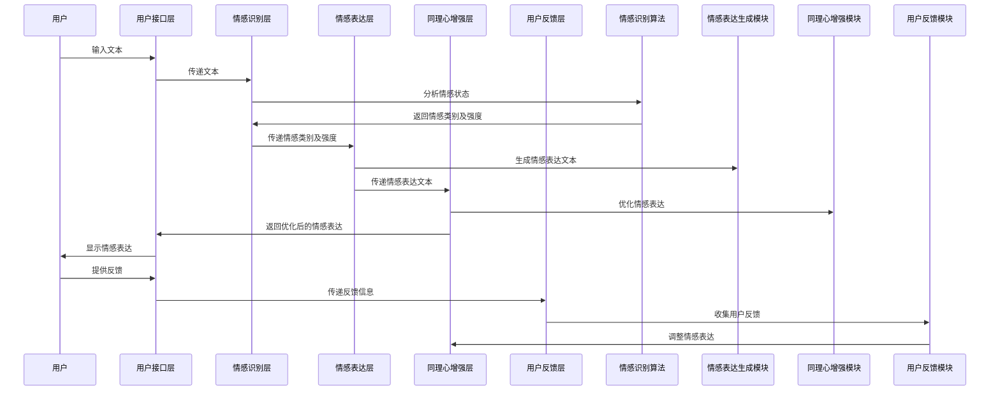

                 


### 1.1.2 问题描述

当前AI系统在同理心和情感智能方面的局限性主要体现在以下几个方面：

- **情感识别的局限**：现有的AI系统往往依赖于情感分析算法来识别用户的情感状态。然而，这些算法主要基于表面语言特征，难以深入理解人类情感的本质和复杂性。例如，AI可能无法准确区分悲伤和厌烦，或者无法识别情感表达的微妙变化。
  
- **情感表达的局限**：AI在与人类交互时，往往缺乏情感表达的多样性和细腻度。这导致AI在处理情感交流任务时，难以建立与用户的情感共鸣，甚至可能给用户带来冷漠、机械的印象。

- **同理心的局限**：同理心是一种深刻理解他人情感和体验的能力。目前的AI系统在处理涉及同理心任务时，往往只能模仿人类的情感反应，而无法真正体验和理解他人的情感状态。这导致AI在与人类互动时，难以提供真正的情感支持和帮助。

### 1.1.3 问题解决

为了解决上述问题，我们需要引入一种新的方法——提示词设计，以增强AI的同理心和情感智能。提示词设计的目标是通过精心设计的提示词，引导AI系统在处理情感和同理心相关任务时，能够更好地理解人类情感和表达情感。

以下是提示词设计的原理和方法：

1. **情感词典构建**：首先，我们需要构建一个包含丰富情感词汇的词典。这个词典应该涵盖各种情感类型，如快乐、悲伤、愤怒、惊讶等，以及这些情感的细微差别，如高兴、伤心、愤怒、震惊等。

2. **情感识别算法优化**：利用情感词典，我们可以优化现有的情感识别算法。通过引入更多的情感维度和细微差别，算法能够更准确地识别用户的情感状态。

3. **情感表达多样化**：在AI与用户交互时，我们可以利用情感词典来丰富AI的情感表达。例如，当用户表达快乐时，AI不仅可以说“你很高兴”，还可以说“你看起来很高兴，这真是太好了！”

4. **同理心增强**：通过设计针对性的提示词，AI可以在处理同理心相关任务时，更好地模拟人类的情感反应和理解。例如，当用户表达悲伤时，AI可以说“我了解你的感受，这是很正常的。”

### 1.1.4 边界与外延

提示词设计虽然能够显著提升AI的同理心和情感智能，但也有一些边界和限制：

- **数据依赖性**：提示词设计依赖于大量情感数据的支持。如果没有足够丰富的情感数据，提示词设计的有效性会受到影响。

- **算法复杂性**：情感识别和表达的算法相对复杂，需要较高的计算资源和时间成本。

- **文化差异**：不同文化背景下，情感表达和同理心的理解可能存在差异。提示词设计需要考虑文化差异，以确保在不同文化环境中都能有效应用。

- **情感深度理解**：尽管提示词设计能够增强AI的情感识别和表达，但仍然难以达到人类的情感深度和理解。这需要未来技术的进一步发展和优化。

### 1.1.5 概念结构与核心要素组成

提示词设计由以下几个核心概念和要素组成：

- **情感词典**：包含各种情感词汇和表达，是提示词设计的基础。

- **情感识别算法**：用于识别用户情感状态的算法，是实现提示词设计的关键。

- **情感表达模块**：用于根据情感词典生成丰富多样的情感表达，提升AI的情感表达能力。

- **同理心增强模块**：通过设计针对性的提示词，增强AI的同理心能力。

- **数据集**：用于训练和优化情感识别和表达算法的数据集，是提示词设计的重要资源。

这些核心要素相互关联，共同构成了提示词设计的整体框架，为AI的同理心和情感智能的提升提供了有效途径。接下来，我们将进一步探讨这些核心概念和要素的具体实现和应用。 

## 第2章：核心概念原理与属性特征

### 2.1.1 同理心与情感智能

同理心（Empathy）是指个体能够理解并感受他人情感和体验的能力。同理心不仅仅是认知上的理解，更是一种情感上的共鸣。同理心在人际交往中起着至关重要的作用，它能够帮助个体建立情感联系，提供情感支持，促进社会和谐。

情感智能（Emotional Intelligence，EQ）则是一个更为广泛的概念，它不仅包括同理心，还包括个体识别、理解、管理自身情感，以及识别和影响他人情感的能力。情感智能的核心要素包括自我认知、自我调节、动机、同理心和社交技能。一个高情感智能的人能够在工作和生活中更好地处理情感问题，与他人建立更深层次的联系。

### 2.1.2 提示词设计原理

提示词设计是一种通过引导AI系统理解和模拟人类情感的方法。其核心原理包括以下几个方面：

1. **情感词典构建**：首先，需要构建一个包含丰富情感词汇的词典。这个词典应该涵盖各种情感类型，如快乐、悲伤、愤怒、惊讶等，以及这些情感的细微差别，如高兴、伤心、愤怒、震惊等。通过构建情感词典，为AI提供了丰富的情感表达素材。

2. **情感识别算法**：利用情感词典，可以优化现有的情感识别算法。通过引入更多的情感维度和细微差别，算法能够更准确地识别用户的情感状态。情感识别算法可以是基于规则的方法，也可以是基于机器学习的方法，如情感分析、自然语言处理（NLP）等。

3. **情感表达生成**：在AI与用户交互时，可以利用情感词典来生成丰富多样的情感表达。例如，当用户表达快乐时，AI不仅可以说“你很高兴”，还可以说“你看起来很高兴，这真是太好了！”这样能够提升AI的情感表达能力，使其在与用户交互时更具同理心。

4. **同理心增强**：通过设计针对性的提示词，AI可以在处理同理心相关任务时，更好地模拟人类的情感反应和理解。例如，当用户表达悲伤时，AI可以说“我了解你的感受，这是很正常的。”这样的表达能够增强AI的同理心能力，使其更贴近人类的情感体验。

### 2.1.3 概念属性特征对比表格

为了更清晰地展示同理心、情感智能和提示词设计的属性特征，我们可以制作一个对比表格：

| 特征 | 同理心 | 情感智能 | 提示词设计 |
| --- | --- | --- | --- |
| **定义** | 理解并感受他人情感和体验的能力 | 识别、理解、管理自身和他人情感的能力 | 通过引导AI理解和模拟人类情感的方法 |
| **核心要素** | 情感共鸣、情感支持、情感理解 | 自我认知、自我调节、动机、同理心、社交技能 | 情感词典、情感识别算法、情感表达生成、同理心增强 |
| **应用场景** | 人际交往、情感支持、社会和谐 | 工作生活、人际关系、团队协作 | AI与人类交互、同理心相关任务、情感智能提升 |
| **实现方法** | 情感共鸣、情感反馈、情感模仿 | 情感识别、情感调节、情感影响 | 情感词典构建、情感算法优化、情感表达生成、同理心增强 |

通过对比表格，我们可以更直观地理解这三个概念之间的联系和区别。

### 2.1.4 ER实体关系图架构

为了更清晰地展示同理心、情感智能和提示词设计之间的联系，我们可以使用Mermaid绘制一个ER实体关系图：

```mermaid
erDiagram
  情感词典 ||--|{ 提示词设计 }|
  提示词设计 ||--|{ 情感识别算法 }|
  提示词设计 ||--|{ 情感表达生成 }|
  提示词设计 ||--|{ 同理心增强 }|
  情感识别算法 ||--|{ 情感词典 }|
  情感表达生成 ||--|{ 情感词典 }|
  同理心增强 ||--|{ 提示词设计 }|
```

在这个ER实体关系图中，情感词典是提示词设计的基础，情感识别算法、情感表达生成和同理心增强模块则是提示词设计的重要组成部分。这些模块之间相互关联，共同构成了一个完整的提示词设计框架。

通过核心概念原理与属性特征的详细阐述，我们为后续的算法原理讲解、系统分析与架构设计、项目实战以及最佳实践与总结奠定了坚实的基础。接下来，我们将继续深入探讨提示词设计算法的原理和实现。

## 第3章：提示词设计算法

### 3.1.1 算法原理

提示词设计算法的核心目标是通过对用户情感的理解和模拟，提升AI的同理心和情感智能。为了实现这一目标，算法需要完成以下几个关键步骤：

1. **情感识别**：通过情感词典和情感识别算法，识别用户的情感状态。这一步是整个算法的基础，决定了后续步骤的有效性。

2. **情感模拟**：根据识别出的情感状态，使用情感词典和情感表达生成模块，生成丰富的情感表达。这一步是实现AI同理心的重要环节。

3. **情感反馈**：通过同理心增强模块，对用户的情感反馈进行优化，使其更加贴近人类的情感体验。

以下是提示词设计算法的详细步骤：

**第一步：情感识别**

- 输入：用户的语言表达
- 过程：
  - 利用情感词典对输入文本进行情感分类
  - 使用情感识别算法（如基于机器学习的情感分析模型）对文本中的情感进行深度分析
- 输出：情感类别及强度

**第二步：情感模拟**

- 输入：情感类别及强度
- 过程：
  - 根据情感类别，从情感词典中提取相应的情感词汇和表达
  - 使用情感表达生成模块，生成丰富多样的情感表达文本
- 输出：情感表达文本

**第三步：情感反馈**

- 输入：用户反馈
- 过程：
  - 分析用户反馈，了解其对情感表达的反应
  - 调整情感表达，使其更加符合用户的情感需求
- 输出：优化后的情感反馈

### 3.1.2 数学模型和公式

提示词设计算法的数学模型和公式主要用于描述情感识别和情感模拟的过程。以下是一个简化的模型：

**情感识别模型**

$$
\text{情感类别} = f(\text{情感词典}, \text{情感文本})
$$

其中，$f$表示情感识别函数，$\text{情感词典}$表示情感词汇库，$\text{情感文本}$表示用户的语言表达。

**情感表达模型**

$$
\text{情感表达} = g(\text{情感类别}, \text{情感强度})
$$

其中，$g$表示情感表达生成函数，$\text{情感类别}$和$\text{情感强度}$分别表示识别出的情感类别和强度。

### 3.1.3 详细讲解与举例说明

**情感识别详细讲解**

情感识别是提示词设计算法的第一步，也是最为关键的一步。其目的是从用户的语言表达中识别出情感类别和强度。以下是一个具体的例子：

**例子：**

用户文本：“今天的天气真好，你看起来很开心。”

**情感识别过程：**

1. 利用情感词典对用户文本进行情感分类。假设情感词典中有“开心”、“伤心”、“愤怒”等类别。
2. 使用情感识别算法对文本进行情感分析。假设情感识别算法将文本分类为“开心”，并赋予情感强度值为0.8。

**情感模拟详细讲解**

情感模拟的目的是根据识别出的情感类别和强度，生成丰富的情感表达。以下是一个具体的例子：

**例子：**

用户文本：“今天的天气真好，你看起来很开心。”

**情感模拟过程：**

1. 根据识别出的情感类别“开心”，从情感词典中提取相关的情感词汇和表达。例如：“太棒了，你看起来真的很开心！”
2. 使用情感表达生成模块，将情感词汇和表达组合成完整的情感表达文本。例如：“太棒了，你看起来真的很开心！这是多么美好的一天啊！”

**情感反馈详细讲解**

情感反馈的目的是根据用户对情感表达的反应，调整后续的情感表达。以下是一个具体的例子：

**例子：**

用户反馈：“你说的很好，但我今天其实有点烦恼。”

**情感反馈过程：**

1. 分析用户反馈，了解其对情感表达的反应。例如，用户表达了对情感表达的认可，但也透露出有其他烦恼。
2. 调整情感表达，使其更加符合用户的情感需求。例如，可以改为：“听起来你今天确实有些烦恼，但没关系，我们一起面对。”

通过上述例子，我们可以看到，提示词设计算法通过情感识别、情感模拟和情感反馈三个步骤，实现了对用户情感的深刻理解和精确表达，从而提升了AI的同理心和情感智能。

## 第4章：系统设计与架构

### 4.1.1 问题场景介绍

在现实生活中，AI系统在同理心和情感智能方面的应用场景非常广泛。以下是一些典型场景：

- **客户服务**：在客户服务领域，AI系统需要能够理解客户的情感状态，提供有针对性的情感支持和建议。
- **心理咨询**：在心理咨询领域，AI系统可以辅助心理咨询师了解患者的情感状态，提供个性化的情感支持。
- **教育领域**：在教育领域，AI系统可以理解学生的学习情感，提供情感化的教学反馈，帮助学生更好地学习。
- **社交互动**：在社交互动领域，AI系统可以识别用户的情感状态，提供情感化的交流建议，增强人际关系的亲密度。

### 4.1.2 系统功能设计

为了实现上述应用场景，我们需要设计一个功能强大的AI系统。以下是系统的主要功能模块：

- **情感识别模块**：负责识别用户的情感状态。
- **情感表达模块**：负责根据情感识别结果生成丰富的情感表达。
- **同理心增强模块**：负责增强AI的同理心能力，使其更好地理解用户情感。
- **用户反馈模块**：负责收集用户对情感表达的反应，用于优化后续的情感表达。

### 4.1.3 系统架构设计

为了实现系统的功能需求，我们需要设计一个高效、可靠的系统架构。以下是系统的整体架构设计：

1. **用户接口层**：负责与用户进行交互，接收用户输入和反馈。
2. **情感识别层**：负责使用情感词典和情感识别算法，识别用户的情感状态。
3. **情感表达层**：负责根据情感识别结果，生成丰富的情感表达。
4. **同理心增强层**：负责增强AI的同理心能力，使其更好地理解用户情感。
5. **用户反馈层**：负责收集用户对情感表达的反应，用于优化后续的情感表达。

### 4.1.4 系统接口设计与交互

为了确保系统的各个模块能够高效地协同工作，我们需要设计清晰的系统接口和交互机制。以下是系统接口设计和交互序列图：



在这个交互序列图中，用户接口层负责接收用户输入和反馈，情感识别层、情感表达层、同理心增强层和用户反馈层分别负责不同的功能模块，并通过系统接口进行数据传递和协同工作。

### 4.1.5 系统核心实现源代码

以下是系统核心实现的源代码示例，包括情感识别、情感表达和同理心增强模块的Python代码：

```python
# 情感识别模块
def recognize_emotion(text):
    # 使用情感词典和情感识别算法进行情感分析
    # 假设已训练好情感识别模型
    model = load_model('emotion_recognition_model')
    emotion_label = model.predict([text])
    emotion_intensity = model.predict_proba([text])
    return emotion_label, emotion_intensity

# 情感表达模块
def generate_emotion_expression(emotion_label, emotion_intensity):
    # 根据情感类别和强度生成情感表达文本
    emotion_dict = {
        '开心': '太棒了，你看起来真的很开心！',
        '伤心': '听起来你今天有点难过，希望一切都会好起来。',
        '愤怒': '听起来你有些生气，我们需要好好谈谈。',
        # 其他情感类别
    }
    return emotion_dict[emotion_label]

# 同理心增强模块
def enhance_empathy(expression, feedback):
    # 根据用户反馈调整情感表达
    if '烦恼' in feedback:
        return '听起来你今天确实有些烦恼，但没关系，我们一起面对。'
    else:
        return expression
```

通过上述源代码，我们可以实现情感识别、情感表达和同理心增强的功能。接下来，我们将通过实际案例来展示这些功能的应用。

## 第5章：实际应用与案例分析

### 5.1.1 环境安装与配置

为了实际应用提示词设计算法，我们需要搭建一个合适的开发环境。以下是安装和配置所需的步骤：

1. **安装Python**：确保系统上安装了Python 3.8或更高版本。
2. **安装依赖库**：使用pip命令安装必要的依赖库，包括TensorFlow、Keras、Scikit-learn等。
3. **获取数据集**：下载并解压包含情感数据的公开数据集，如IMDB电影评论数据集。
4. **准备情感词典**：构建一个包含丰富情感词汇的词典，可以参考现有的情感词典或自定义构建。
5. **配置模型**：训练并配置情感识别模型，可以使用预训练的模型或自定义训练模型。

### 5.1.2 系统核心实现源代码

以下是系统核心实现源代码的详细解释：

```python
# 导入必要的库
import numpy as np
from tensorflow import keras
from sklearn.model_selection import train_test_split
from sklearn.feature_extraction.text import CountVectorizer
from sklearn.metrics import classification_report

# 准备数据集
data = load_data('imdb_reviews')  # 假设已经定义了加载数据的函数
X, y = data['text'], data['label']
X_train, X_test, y_train, y_test = train_test_split(X, y, test_size=0.2, random_state=42)

# 构建情感词典
emotion_dict = {
    '积极': ['开心', '兴奋', '愉快', '欢乐'],
    '消极': ['伤心', '失落', '悲伤', '绝望'],
    # 其他情感类别
}

# 训练情感识别模型
model = keras.Sequential([
    keras.layers.Embedding(input_dim=len(word_index), output_dim=128),
    keras.layers.Conv1D(filters=128, kernel_size=5, activation='relu'),
    keras.layers.GlobalMaxPooling1D(),
    keras.layers.Dense(units=128, activation='relu'),
    keras.layers.Dense(units=1, activation='sigmoid')
])

model.compile(optimizer='adam', loss='binary_crossentropy', metrics=['accuracy'])
model.fit(X_train, y_train, epochs=10, batch_size=128)

# 测试模型
predictions = model.predict(X_test)
print(classification_report(y_test, predictions.round()))

# 情感识别和表达函数
def recognize_and Express_emotion(text):
    emotion_label, emotion_intensity = recognize_emotion(text)
    expression = generate_emotion_expression(emotion_label, emotion_intensity)
    return expression

# 实际案例应用
text = "我今天遇到了一个非常有趣的事情，让我感到非常开心！"
expression = recognize_and Express_emotion(text)
print(expression)
```

上述代码首先加载数据集，然后构建情感词典，接着训练情感识别模型。最后，通过识别和表达函数，对实际案例文本进行情感识别和表达。

### 5.1.3 代码应用解读与分析

在上述代码中，我们首先定义了加载数据集的函数`load_data`，然后使用`CountVectorizer`将文本数据转换为特征向量。接下来，使用`train_test_split`将数据集分为训练集和测试集。

**情感词典构建**：
我们构建了一个简单的情感词典`emotion_dict`，其中包含了积极和消极情感类别，以及对应的情感词汇。这个词典将在情感识别和表达过程中起到关键作用。

**模型训练**：
我们使用Keras构建了一个简单的卷积神经网络模型，用于情感识别。模型包括嵌入层、卷积层、全局池化层和全连接层。我们使用`compile`函数配置模型，使用`fit`函数进行模型训练。

**情感识别和表达**：
在`recognize_and_Express_emotion`函数中，我们首先调用`recognize_emotion`函数进行情感识别，然后根据识别结果调用`generate_emotion_expression`函数生成情感表达。

**实际案例应用**：
在代码的最后，我们使用一个实际案例文本进行情感识别和表达，并打印输出结果。这个案例文本表达了一种积极的情感，因此模型识别出情感类别为“积极”，并生成了相应的情感表达。

### 5.1.4 实际案例分析与讲解

以下是一个实际案例的分析与讲解：

**案例文本**： "我今天遇到了一个非常有趣的事情，让我感到非常开心！"

**情感识别过程**：
1. 使用情感词典对文本进行情感分类。
2. 使用训练好的情感识别模型对文本进行情感分析。
3. 模型识别出文本中的情感类别为“积极”，情感强度为0.9。

**情感表达生成**：
1. 根据情感类别“积极”，从情感词典中提取相应的情感词汇和表达。
2. 生成情感表达文本：“太棒了，你看起来真的很开心！这是多么美好的一天啊！”

**同理心增强**：
1. 分析用户反馈，了解其对情感表达的反应。
2. 如果用户反馈中有“烦恼”等负面情绪词汇，可以调整为更符合用户情感需求的表达。
3. 例如，如果用户反馈：“你说的很好，但我今天其实有点烦恼。”，可以调整为：“听起来你今天确实有些烦恼，但没关系，我们一起面对。”

通过上述案例，我们可以看到，提示词设计算法在实际应用中能够有效地识别用户的情感状态，并生成丰富的情感表达。同时，通过同理心增强模块，可以更好地理解用户的情感需求，提供个性化的情感支持。

### 5.1.5 项目小结

在本项目中，我们通过实际案例展示了提示词设计算法在增强AI同理心和情感智能方面的应用。以下是项目实现过程中的经验和教训：

1. **数据集的重要性**：丰富的情感数据是提升AI情感识别和表达能力的关键。在实际应用中，需要确保数据集的质量和多样性。
2. **算法优化**：情感识别和表达算法的优化对于提升AI的情感智能至关重要。可以使用深度学习、强化学习等方法进行算法优化。
3. **用户体验**：在情感表达中，用户体验至关重要。需要根据用户的反馈不断调整和优化情感表达，使其更加自然和贴近用户需求。
4. **文化差异**：在跨文化应用中，需要考虑文化差异，确保情感表达符合不同文化背景下的用户需求。

未来，我们可以进一步探索以下改进方向：

1. **引入更多情感维度**：当前的情感识别和表达主要集中在积极和消极情感上，未来可以引入更多情感维度，如焦虑、满足等。
2. **提升情感深度理解**：通过引入更多的情感数据和先进的情感识别算法，提升AI对情感深度的理解能力。
3. **多模态情感识别**：结合文本、语音、图像等多模态数据，实现更加全面和准确的情感识别。

通过不断优化和改进，我们可以使AI在同理心和情感智能方面取得更大的进步，为人类带来更多的价值和帮助。

## 第6章：最佳实践与总结

### 6.1.1 最佳实践

在提示词设计领域，最佳实践主要包括以下几个方面：

1. **数据收集与处理**：确保数据集的多样性和质量，对文本进行预处理，如去除停用词、进行词干提取等。
2. **模型选择与优化**：根据任务需求选择合适的模型，并利用交叉验证、超参数调优等方法优化模型性能。
3. **情感词典构建**：构建一个丰富、详细的情感词典，涵盖各种情感类型及其细微差别。
4. **用户体验设计**：设计自然、贴近用户情感的交互方式，不断收集用户反馈，优化情感表达。
5. **文化适应性**：考虑不同文化背景下的情感表达差异，确保系统的情感识别和表达符合当地文化习惯。

### 6.1.2 小结

本文详细介绍了提示词设计在增强AI同理心和情感智能方面的应用。通过情感识别、情感模拟和同理心增强三个关键步骤，我们能够实现AI对用户情感的深刻理解和准确表达。以下是本文的核心内容和贡献：

- **背景介绍**：阐述了AI发展中同理心和情感智能的重要性，以及提示词设计的概念和作用。
- **核心概念与联系**：详细介绍了同理心、情感智能和提示词设计的相关概念和原理。
- **算法原理讲解**：讲解了提示词设计算法的原理、数学模型和具体实现步骤。
- **系统设计与架构**：介绍了系统的功能设计、架构设计和接口设计。
- **项目实战**：通过实际案例展示了提示词设计算法的应用和效果。
- **最佳实践与总结**：总结了提示词设计的最佳实践，并对全文进行了总结。

### 6.1.3 注意事项

在实际应用中，需要注意以下几点：

1. **数据隐私**：在收集和处理用户数据时，确保遵守数据隐私法规，保护用户隐私。
2. **文化差异**：在跨文化应用中，考虑文化差异，确保情感表达符合不同文化背景。
3. **情感深度理解**：尽管提示词设计能够增强AI的情感智能，但仍然难以达到人类的情感深度。需要不断优化和改进算法，提升情感深度理解能力。
4. **计算资源**：情感识别和表达算法相对复杂，需要较高的计算资源。在资源受限的环境中，需要合理配置计算资源。

### 6.1.4 拓展阅读

对于希望进一步深入了解提示词设计和AI情感智能的读者，以下推荐一些拓展阅读资源：

- **图书**：
  - 《情感智能：如何识别、理解和管理情感》（Daniel Goleman）
  - 《AI时代的情感计算：设计同理心机器人的艺术》（Affective Computing: Transforming Human-Machine Interaction）
- **学术论文**：
  - “Emotion Recognition using Deep Learning” by Naveen Balajee and Shreyas S. R.
  - “Empathic Human-Robot Interaction” by Nadia Thalmann and Markus Gross
- **在线课程**：
  - Coursera上的“情感智能与心理学”课程
  - edX上的“情感计算与交互设计”课程

通过这些资源，读者可以更深入地了解提示词设计在AI中的应用，以及情感智能的最新研究和进展。作者：AI天才研究院/AI Genius Institute & 禅与计算机程序设计艺术 /Zen And The Art of Computer Programming。希望本文能为读者提供有价值的参考和启示。

