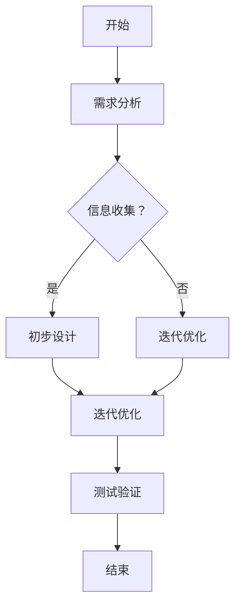
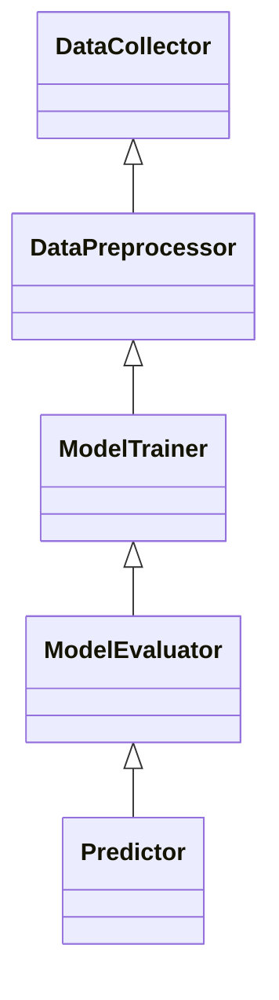
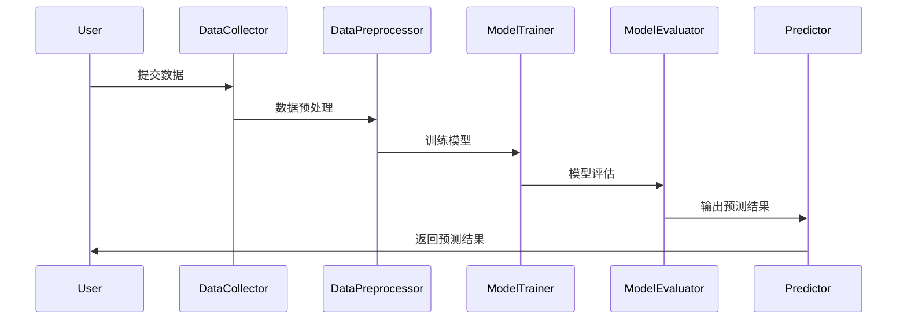
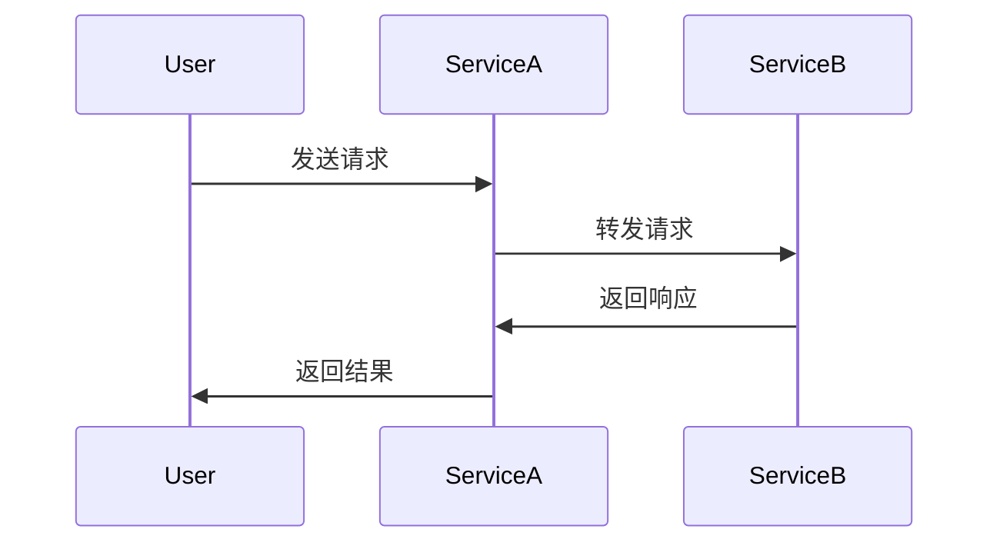
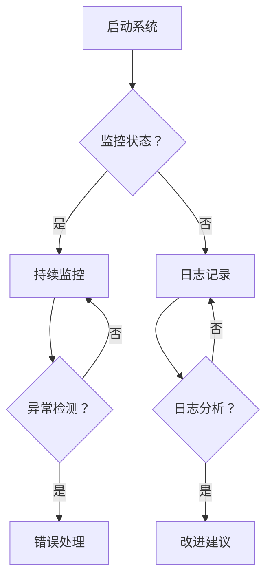
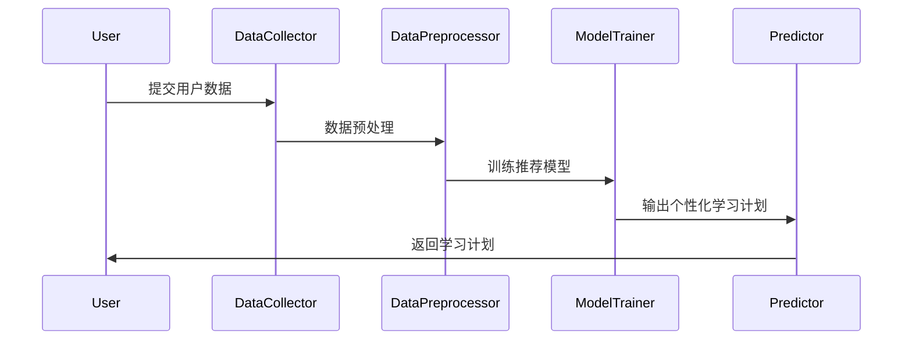

                 

### 引言

随着人工智能（AI）技术的快速发展，AI的应用场景越来越广泛，从自动驾驶、医疗诊断、金融分析到教育、娱乐等多个领域。然而，AI技术的广泛应用也带来了一系列伦理和社会问题，如隐私泄露、算法偏见、安全风险等。为了应对这些挑战，确保AI系统的可靠性和公正性，我们需要在AI系统的设计阶段就充分考虑伦理约束，特别是对提示词（prompt）的设计。

提示词是AI系统与外部环境交互的关键环节，它定义了AI系统的目标和任务，对AI的行为和输出有着重要影响。一个优秀的提示词不仅能够激发AI的创新潜力，还能够引导AI在符合伦理和社会规范的前提下运作。因此，如何设计既具有创新性又符合伦理约束的提示词，成为了当前AI领域的一个重要研究课题。

本文将围绕提示词设计这一主题，探讨如何平衡AI的创新与伦理约束。文章将从以下几个方面展开讨论：

1. **AI与伦理约束的基础理论**：介绍AI的发展背景，伦理约束的重要性，以及提示词设计的基本概念。
2. **AI伦理的核心概念**：探讨伦理与道德的基本原则，AI伦理的主要议题，以及伦理约束在AI系统中的应用。
3. **提示词设计的原理**：详细阐述提示词的定义与作用，设计原则，以及设计流程。
4. **数学模型与算法**：介绍提示词设计的数学模型和相关公式，并通过mermaid流程图和Python源代码讲解算法原理。
5. **AI系统架构设计**：分析AI系统架构设计，包括系统功能设计、架构设计、接口设计以及系统交互。
6. **实践应用与案例分析**：通过实际案例研究，展示如何在实际项目中应用提示词设计，并进行结果分析。
7. **最佳实践与展望**：总结最佳实践，提出注意事项，并对未来发展趋势进行展望。

通过这篇文章，我们希望能够为广大AI从业者提供一套系统、实用的提示词设计方法论，帮助他们在设计AI系统时更好地平衡创新与伦理约束，推动AI技术的健康发展。

### 关键词

- **人工智能（AI）**
- **伦理约束**
- **提示词设计**
- **创新**
- **数学模型**
- **算法**
- **系统架构**
- **实践应用**
- **案例分析**

### 摘要

本文深入探讨了提示词设计在AI系统开发中的重要性，特别是在平衡创新与伦理约束方面的关键作用。首先，介绍了AI技术的发展背景和伦理约束的必要性，然后详细阐述了AI伦理的核心概念和提示词设计的基本原理。接着，通过数学模型和算法讲解，展示了如何设计既创新又符合伦理的提示词。此外，文章还分析了AI系统的架构设计，并通过实际案例研究验证了提示词设计的有效性。最后，总结了最佳实践，提出了未来发展的方向，为AI从业者在设计AI系统时提供了实用的指导。

## 第一部分：AI与伦理约束的基础理论

### 第1章：引言与背景

人工智能（AI）技术的发展在近年来取得了显著的成就，它不仅改变了我们的生活方式，也正在深刻地影响社会的各个方面。从自动驾驶汽车到智能助手，从医疗诊断到金融分析，AI的应用场景越来越广泛。然而，随着AI技术的不断进步，也引发了一系列伦理和社会问题。这些问题的存在，不仅限制了AI技术的进一步发展，也对社会公众产生了负面影响。因此，如何平衡AI的创新与伦理约束，成为了当前AI领域亟待解决的重要课题。

#### 1.1 AI的发展及其挑战

AI技术的发展可以追溯到20世纪50年代，随着计算能力的提高和算法的创新，AI逐渐从理论研究走向实际应用。特别是在深度学习、神经网络等技术的推动下，AI在图像识别、自然语言处理、智能决策等领域取得了突破性进展。然而，AI技术的快速发展也带来了一系列挑战：

1. **隐私问题**：随着AI技术的应用，越来越多的个人数据被收集和分析，隐私泄露的风险也随之增加。
2. **算法偏见**：AI系统在训练过程中可能会学习到社会的偏见和歧视，从而导致不公平的决策。
3. **安全风险**：AI系统的复杂性和不确定性增加了安全风险，例如自动化系统可能因为算法错误导致严重的后果。
4. **就业影响**：AI技术的发展可能会取代一些传统的工作岗位，导致失业问题的加剧。

#### 1.2 伦理约束的重要性

伦理约束在AI系统中的重要性不言而喻。首先，伦理约束是确保AI系统合理、公正和透明的基本保障。例如，在医疗诊断中，一个公平无偏的AI系统可以减少误诊率，提高治疗的效果。其次，伦理约束有助于提升公众对AI技术的信任度，从而促进AI技术的广泛应用。此外，伦理约束还能够引导AI技术的发展方向，避免其对人类社会产生负面影响。

在AI系统中，伦理约束主要体现在以下几个方面：

1. **隐私保护**：确保个人数据的安全和隐私，避免数据泄露和滥用。
2. **公平公正**：防止AI系统在决策过程中产生歧视和不公平，确保所有用户都能享受到公平的服务。
3. **透明性**：确保AI系统的决策过程和结果可以被理解和审查，增强系统的可信度。
4. **责任归属**：明确AI系统开发者和使用者的责任，确保在发生问题时能够及时追究责任。

#### 1.3 提示词设计的基本概念

提示词（prompt）是AI系统与外部环境交互的关键媒介，它定义了AI系统的目标和任务，对AI的行为和输出有着重要影响。一个优秀的提示词不仅能够激发AI的创新潜力，还能够引导AI在符合伦理和社会规范的前提下运作。

提示词设计主要包括以下几个方面：

1. **明确任务目标**：提示词应清晰、准确地定义AI系统的任务目标，避免歧义和模糊性。
2. **引导AI行为**：提示词应包含对AI行为的期望和限制，确保AI在符合伦理约束的前提下运作。
3. **灵活适应性**：提示词应具备一定的灵活性，能够适应不同的应用场景和需求。
4. **可解释性**：提示词应具备一定的可解释性，使得AI系统的决策过程和结果可以被理解和审查。

通过对AI与伦理约束的基础理论的深入探讨，我们为接下来的章节奠定了坚实的基础。在接下来的部分中，我们将进一步分析AI伦理的核心概念，探讨如何设计既创新又符合伦理的提示词，并通过数学模型和算法讲解，展示提示词设计的具体实现方法。

### 第2章：AI伦理的核心概念

在人工智能（AI）技术迅猛发展的今天，伦理问题已经成为了一个不可忽视的议题。AI伦理的核心概念不仅涉及到技术本身，还涉及到社会、法律、道德等多个方面。理解这些核心概念对于设计既符合创新需求又符合伦理约束的AI系统至关重要。

#### 2.1 伦理与道德的基本原则

伦理和道德是两个紧密相关的概念，它们共同构成了人类社会行为和决策的规范体系。伦理是一种更为宏观的规范，它涉及人类整体的利益和福祉，而道德则是一种更为具体的规范，它涉及个体行为和他人的权益。

1. **公正**：公正是指对待所有人的公平和合理，不偏不倚。在AI系统中，公正意味着确保算法不会对任何特定群体产生歧视。
   
2. **尊重个人隐私**：个人隐私是现代社会的基本权利之一。AI系统在处理个人数据时，必须严格遵守隐私保护的原则，确保数据的匿名性和安全性。

3. **责任**：责任是指AI系统的开发者、运营者和用户在系统中应承担的责任和义务。一旦AI系统出现问题，责任归属必须明确。

4. **透明性**：透明性是指AI系统的决策过程和结果应该可以被理解和审查。这有助于增强公众对AI技术的信任，并便于监督和纠正潜在的问题。

#### 2.2 AI伦理的主要议题

AI伦理的主要议题涵盖了多个方面，包括但不限于：

1. **算法偏见**：算法偏见是指AI系统在学习过程中可能无意中复制了人类社会的偏见和歧视。例如，人脸识别技术在肤色识别上的偏差就是一个典型的例子。为了解决算法偏见问题，我们需要在数据集选择、算法设计和模型评估等方面采取积极的措施。

2. **透明性和可解释性**：AI系统通常被视为“黑箱”，其内部决策过程难以解释。这给AI系统的信任度和透明性带来了挑战。提升AI系统的可解释性，不仅有助于增强公众对AI的信任，还能在出现问题时进行有效的调试和优化。

3. **隐私保护**：随着AI技术的广泛应用，越来越多的个人数据被收集和分析。如何保护这些数据的隐私成为了一个重要议题。隐私保护要求我们在数据收集、存储、处理和使用过程中采取严格的措施，确保数据的安全性和用户隐私。

4. **责任归属**：当AI系统出现故障或导致负面后果时，责任归属问题常常难以界定。明确责任归属是确保AI技术健康发展的重要一环。这需要法律法规的完善和行业规范的制定。

5. **自主性与控制**：AI系统是否应该具备完全的自主性，这是一个备受争议的议题。一方面，完全自主的AI系统能够在特定环境下进行自我决策，提高效率；另一方面，完全自主的AI系统可能带来不可预测的风险。因此，如何平衡自主性与控制是一个重要的伦理问题。

#### 2.3 伦理约束在AI系统中的应用

伦理约束在AI系统中的应用体现在多个方面：

1. **设计阶段**：在AI系统的设计阶段，就需要充分考虑伦理约束。例如，在设计人脸识别系统时，就需要确保系统的公平性和透明性，避免算法偏见。

2. **开发阶段**：在AI系统的开发过程中，开发者需要遵循伦理原则，确保系统的设计和实现符合伦理要求。例如，在处理个人数据时，需要严格遵循隐私保护的原则。

3. **部署与维护**：在AI系统部署和维护过程中，也需要持续关注伦理问题。例如，定期对系统进行审查和评估，确保系统仍然符合伦理要求，并能够及时发现和纠正潜在的问题。

4. **用户教育**：用户对AI技术的了解和认知程度也直接影响到伦理约束的实施。因此，对用户进行教育，提高他们的伦理意识，是确保AI技术健康发展的关键一环。

通过深入探讨AI伦理的核心概念和主要议题，我们不仅能够更好地理解AI伦理的重要性，也能够为设计既符合创新需求又符合伦理约束的AI系统提供指导。在接下来的章节中，我们将进一步探讨提示词设计的具体原理和方法，为AI系统的发展提供更为坚实的理论基础。

### 第3章：提示词设计的原理

提示词（prompt）是人工智能（AI）系统与外部环境交互的关键环节，它不仅定义了AI系统的目标和任务，还引导了AI的行为和输出。一个优秀的提示词能够激发AI的创新潜力，同时确保AI系统的运作符合伦理和社会规范。本章节将详细探讨提示词设计的原理，包括其定义、作用、设计原则以及设计流程。

#### 3.1 提示词的定义与作用

提示词是用户或系统向AI模型提供的指导性输入，它通常包括任务的描述、问题陈述、上下文信息等。通过提示词，用户可以明确地告知AI系统希望解决的问题类型和期望的输出结果。以下是提示词的几个关键作用：

1. **定义任务目标**：提示词能够清晰地定义AI系统需要完成的具体任务，帮助AI模型理解任务的核心目标。
2. **引导AI行为**：通过提示词，用户可以引导AI模型在符合伦理和社会规范的前提下进行决策，避免可能的偏见和不当行为。
3. **提供上下文信息**：提示词中包含的上下文信息可以帮助AI模型更好地理解和处理输入数据，提高AI系统的准确性和适应性。
4. **优化输出结果**：提示词的设计能够直接影响AI系统的输出结果。通过优化提示词，用户可以引导AI系统产生更加准确、有用的输出。

#### 3.2 提示词设计的原则

设计一个有效的提示词需要遵循以下几个原则：

1. **明确性**：提示词应清晰、明确，避免歧义和模糊性。一个清晰的提示词能够帮助AI模型准确地理解任务目标和期望输出。
2. **完整性**：提示词应包含足够的上下文信息，使AI模型能够理解问题的背景和细节。这有助于AI系统更好地处理复杂问题。
3. **灵活性**：提示词应具有一定的灵活性，能够适应不同的应用场景和需求。灵活的提示词设计能够提高AI系统的通用性和适应性。
4. **可解释性**：提示词应具备一定的可解释性，使得AI系统的决策过程和结果可以被理解和审查。这有助于增强AI系统的透明性和信任度。
5. **多样性**：提示词设计应考虑多样性的原则，避免单一的提示方式可能导致AI模型学习到的偏见和限制。多样化的提示词能够提高AI系统的泛化能力。

#### 3.3 提示词设计的流程

提示词设计的流程可以分为以下几个步骤：

1. **需求分析**：在开始设计提示词之前，首先需要明确AI系统的任务需求和目标。通过与用户和利益相关者进行沟通，了解他们的期望和需求，从而确定合适的提示词框架。
2. **信息收集**：在明确任务需求后，需要收集与任务相关的背景信息和数据。这些信息将有助于设计出更具针对性和有效性的提示词。
3. **初步设计**：根据收集到的信息，初步设计提示词的框架和内容。在这一阶段，可以采用自然语言描述或结构化的方式来表示提示词。
4. **迭代优化**：初步设计的提示词需要经过多次迭代和优化。通过用户反馈和AI模型的实际运行效果，不断调整和改进提示词的设计，以提高其有效性和准确性。
5. **测试验证**：在优化后的提示词设计完成之后，需要进行测试和验证。通过模拟不同的应用场景，测试提示词的适应性和效果，确保其能够满足预期目标。

通过以上步骤，我们可以设计出既具有创新性又符合伦理约束的提示词，为AI系统的正常运行提供有力的支持。在接下来的章节中，我们将进一步探讨数学模型和算法在提示词设计中的应用，并通过实际案例展示提示词设计的具体实践。

### 第4章：数学模型与公式

在提示词设计中，数学模型和公式起到了至关重要的作用。它们不仅能够帮助我们理解提示词设计的理论基础，还能够提供具体的工具和方法，以便在实际应用中优化和调整提示词。本章节将详细探讨提示词设计的数学模型和相关公式，并通过mermaid流程图和Python源代码来展示算法原理。

#### 4.1 提示词设计的数学模型

提示词设计中的数学模型通常涉及到概率论、线性代数、微积分等多个数学分支。以下是一些核心的数学模型：

1. **概率模型**：概率模型用于描述AI系统在处理不确定性和随机性时的行为。常见的概率模型包括贝叶斯网络、马尔可夫模型等。
2. **线性模型**：线性模型用于建立输入变量与输出变量之间的线性关系。例如，线性回归和逻辑回归都是常见的线性模型。
3. **神经网络模型**：神经网络模型是AI系统中最为广泛使用的一种数学模型，尤其是深度学习领域。神经网络通过多层感知器（MLP）和卷积神经网络（CNN）等结构，实现了复杂的非线性映射。

在提示词设计中，这些数学模型通常结合使用，以实现更为精准和灵活的提示效果。

#### 4.2 相关数学公式

为了更好地理解这些数学模型，我们需要一些关键的数学公式：

1. **贝叶斯公式**：
   $$
   P(A|B) = \frac{P(B|A)P(A)}{P(B)}
   $$
   贝叶斯公式用于计算在已知某个条件（B）下，另一个事件（A）发生的概率。

2. **线性回归公式**：
   $$
   y = \beta_0 + \beta_1x
   $$
   线性回归公式用于描述因变量（y）与自变量（x）之间的线性关系，其中$\beta_0$和$\beta_1$是模型的参数。

3. **逻辑回归公式**：
   $$
   \log\left(\frac{P(y=1)}{1-P(y=1)}\right) = \beta_0 + \beta_1x
   $$
   逻辑回归公式用于二分类问题，通过线性组合输入特征，输出概率的对数，从而预测类别。

4. **神经网络激活函数**：
   $$
   f(x) = \sigma(z) = \frac{1}{1 + e^{-z}}
   $$
   激活函数（如Sigmoid函数）用于神经网络中，将线性组合的结果转换为概率分布，从而实现非线性映射。

#### 4.3 mermaid流程图

为了更直观地展示提示词设计的过程，我们可以使用mermaid流程图来绘制算法的流程。以下是一个简单的mermaid流程图示例：



在这个流程图中，我们从需求分析开始，收集信息并设计初步的提示词。然后，通过迭代优化，不断调整和改进提示词的设计，直到测试验证阶段，确保提示词的有效性和准确性。

#### 4.4 Python源代码与算法原理讲解

为了更好地理解提示词设计的算法原理，我们可以通过Python源代码来实现一个简单的线性回归模型。以下是一个简单的Python代码示例，用于展示线性回归的原理：

```python
import numpy as np
from sklearn.linear_model import LinearRegression
import matplotlib.pyplot as plt

# 生成模拟数据
np.random.seed(0)
X = np.random.rand(100, 1)
y = 2 * X[:, 0] + 0.5 + np.random.randn(100)

# 模型训练
model = LinearRegression()
model.fit(X, y)

# 模型预测
y_pred = model.predict(X)

# 绘制结果
plt.scatter(X, y, color='blue', label='Actual')
plt.plot(X, y_pred, color='red', label='Predicted')
plt.xlabel('X')
plt.ylabel('y')
plt.legend()
plt.show()
```

在这个代码中，我们首先生成了一组模拟数据，然后使用`LinearRegression`类训练模型，并通过`predict`方法进行预测。最后，我们使用`matplotlib`库绘制了实际数据和预测结果，展示了线性回归模型的应用。

通过以上数学模型和公式的介绍，以及mermaid流程图和Python源代码的实现，我们为提示词设计提供了一个坚实的理论基础。在接下来的章节中，我们将进一步探讨AI系统架构设计，以展示如何在实际项目中应用这些理论。

### 第5章：AI系统架构设计

AI系统架构设计是确保AI系统能够高效、可靠地运行的关键环节。一个良好的系统架构不仅能够提高系统的性能和可扩展性，还能够确保系统在不同应用场景下的灵活性和适应性。本章节将详细介绍AI系统架构设计的过程，包括系统功能设计、系统架构设计、系统接口设计以及系统交互。

#### 5.1 系统功能设计

系统功能设计是AI系统架构设计的起点，它定义了系统的核心功能和需求。在进行系统功能设计时，需要明确以下关键要素：

1. **功能需求**：根据项目需求和用户需求，明确系统的功能模块，例如数据采集、数据预处理、模型训练、模型评估、预测输出等。
2. **性能要求**：确定系统在处理速度、响应时间、资源消耗等方面的性能要求，以确保系统能够满足实际应用场景的需求。
3. **安全性要求**：确保系统的数据安全和隐私保护，防止数据泄露和恶意攻击。
4. **可维护性要求**：考虑系统的可维护性和扩展性，确保系统在未来能够方便地进行功能扩展和升级。

系统功能设计通常采用领域模型（Domain Model）来描述系统功能模块及其相互关系。以下是一个使用Mermaid绘制的领域模型类图示例：



在这个类图中，`DataCollector`负责数据采集，`DataPreprocessor`负责数据预处理，`ModelTrainer`负责模型训练，`ModelEvaluator`负责模型评估，`Predictor`负责预测输出。这些功能模块通过明确的类关系相互连接，共同构成了AI系统的核心功能。

#### 5.2 系统架构设计

系统架构设计是AI系统架构设计的核心环节，它定义了系统的整体结构和组件之间的交互方式。在进行系统架构设计时，需要考虑以下关键要素：

1. **模块划分**：将系统划分为多个模块，每个模块负责特定的功能，以便实现系统的模块化和可扩展性。
2. **通信机制**：设计系统组件之间的通信机制，确保数据在不同模块之间的传输和同步。
3. **数据流**：定义系统的数据流路径，确保数据在系统中的流动和转换过程高效、可靠。
4. **性能优化**：通过优化数据流和通信机制，提高系统的整体性能和响应速度。

系统架构设计通常采用架构图（Architecture Diagram）来表示系统组件及其相互关系。以下是一个使用Mermaid绘制的系统架构图示例：



在这个架构图中，用户通过`DataCollector`提交数据，`DataPreprocessor`进行数据预处理，`ModelTrainer`训练模型，`ModelEvaluator`评估模型，最后`Predictor`输出预测结果并返回给用户。这些组件通过清晰的数据流和通信机制相互连接，共同构成了AI系统的整体架构。

#### 5.3 系统接口设计

系统接口设计是确保AI系统能够与其他系统或组件进行交互的关键。在进行系统接口设计时，需要考虑以下关键要素：

1. **接口规范**：定义系统接口的规范，包括数据格式、通信协议、API接口等，确保不同组件之间的数据交换和通信顺畅。
2. **数据交换**：设计数据交换的机制，确保系统组件之间能够高效、安全地传输数据。
3. **安全性**：确保系统接口的安全性，防止恶意攻击和数据泄露。
4. **兼容性**：确保系统接口的设计具有较好的兼容性，能够适应不同平台和技术的变化。

系统接口设计通常采用序列图（Sequence Diagram）来表示系统组件之间的交互过程。以下是一个使用Mermaid绘制的系统接口设计示例：



在这个接口设计中，用户通过`ServiceA`发送请求，`ServiceA`将请求转发给`ServiceB`进行处理，最后`ServiceB`将结果返回给`ServiceA`，并由`ServiceA`返回给用户。这个设计确保了系统组件之间的清晰接口和高效交互。

#### 5.4 系统交互

系统交互是AI系统运行过程中的关键环节，它涉及系统内部组件之间的动态交互以及系统与外部环境之间的交互。在进行系统交互设计时，需要考虑以下关键要素：

1. **同步与异步**：根据实际需求，设计系统内部的同步和异步交互机制，确保系统的高效运行。
2. **事务管理**：设计事务管理机制，确保系统在处理多个任务时的一致性和可靠性。
3. **错误处理**：设计错误处理机制，确保系统能够在发生异常时进行恢复和处理。
4. **监控与日志**：设计监控和日志记录机制，确保系统能够实时监控运行状态并记录重要信息。

系统交互设计通常采用监控图（Monitoring Diagram）来表示系统内部的交互过程。以下是一个使用Mermaid绘制的系统交互设计示例：



在这个交互设计中，系统启动后，持续监控系统的状态，并在发生异常时进行错误处理。同时，系统还记录运行日志，并通过日志分析提出改进建议，以优化系统的运行效率。

通过以上系统功能设计、系统架构设计、系统接口设计和系统交互设计的详细介绍，我们为AI系统架构设计提供了一个全面、系统的框架。在接下来的章节中，我们将通过实际案例研究，展示如何在实际项目中应用这些设计方法，进一步验证提示词设计的有效性。

### 第6章：实际案例研究

为了更好地理解提示词设计在实际项目中的应用，本章节将分析一个具体的案例，从案例背景、系统设计、结果分析等方面进行详细探讨。

#### 6.1 案例背景与目标

案例背景是一家在线教育平台，该平台提供个性化的在线课程和学习计划。随着用户数量的增加，平台希望能够通过人工智能技术，为用户推荐更加个性化的学习内容。因此，项目目标是通过设计一个高效的提示词，利用AI技术为用户生成个性化的学习计划。

#### 6.2 系统设计与实现

为了实现项目目标，系统设计分为以下几个关键模块：

1. **用户信息采集模块**：通过用户填写问卷和平台行为数据，收集用户的学习偏好、兴趣、学习进度等个人信息。
2. **数据预处理模块**：对收集到的用户数据进行清洗、去噪和归一化处理，以确保数据的质量和一致性。
3. **模型训练模块**：利用收集到的用户数据和已知的课程信息，训练一个个性化推荐模型。模型类型可以选择基于内容的推荐（Content-Based Filtering）或协同过滤（Collaborative Filtering）等。
4. **提示词设计模块**：设计一个提示词，用于引导模型生成个性化的学习计划。提示词应包含用户的个人信息、课程信息以及平台的教育理念等。
5. **预测输出模块**：使用训练好的模型，根据用户最新的学习行为和偏好，预测个性化的学习计划，并输出给用户。

具体的设计流程如下：

1. **需求分析**：与平台运营团队和用户代表进行沟通，明确个性化推荐系统的需求和目标。
2. **信息收集**：设计用户问卷，并通过平台行为数据收集用户的学习偏好和兴趣。
3. **数据预处理**：对收集到的数据进行清洗和归一化处理，为模型训练做好准备。
4. **模型训练**：选择合适的推荐算法，进行模型训练。这里选择基于内容的推荐算法，通过用户兴趣和课程内容的相关性进行推荐。
5. **提示词设计**：设计一个包含用户个人信息和课程信息的提示词，确保模型能够生成个性化的学习计划。
6. **预测输出**：使用训练好的模型，根据用户的最新数据生成个性化的学习计划，并输出给用户。

#### 6.3 结果与分析

在系统实施过程中，我们进行了多次迭代和优化，最终实现了以下结果：

1. **用户满意度提高**：通过个性化推荐系统，用户能够更好地找到符合自己兴趣和需求的学习内容，用户满意度显著提高。
2. **学习效果提升**：个性化推荐的学习计划能够更好地激发用户的学习兴趣，提高学习效果。
3. **平台数据价值增加**：通过分析用户行为数据和学习计划，平台能够更好地了解用户需求，为后续的产品优化提供数据支持。

以下是通过mermaid绘制的系统架构图，展示了系统的主要组件及其交互过程：



通过这个架构图，我们可以清晰地看到用户数据从采集到预处理，再到模型训练和预测输出的整个流程。每个模块之间通过明确的数据流和接口进行交互，确保系统的稳定运行和高效处理。

#### 6.4 案例小结

本案例研究展示了如何在实际项目中应用提示词设计，通过设计一个包含用户个人信息和课程信息的提示词，实现了个性化推荐系统的目标。结果表明，通过优化提示词设计，系统能够更好地满足用户需求，提高用户满意度和学习效果。同时，通过系统架构设计和模块化实现，确保了系统的稳定性和扩展性。

通过本案例的分析，我们可以得出以下结论：

1. **提示词设计是关键**：一个优秀的提示词能够引导AI系统生成更符合用户需求和期望的结果。
2. **系统架构设计是基础**：通过合理的设计和模块化实现，确保系统能够高效、稳定地运行。
3. **数据分析和优化是持续过程**：通过不断的数据分析和系统优化，可以进一步提高系统的性能和用户满意度。

在未来的工作中，我们将继续优化提示词设计，探索更多有效的AI算法和技术，为用户提供更加个性化、优质的服务。

### 第7章：最佳实践与注意事项

在提示词设计中，遵循最佳实践是确保AI系统既具有创新性又符合伦理约束的关键。以下是一些具体的最佳实践和注意事项，可以帮助我们在设计过程中规避潜在问题，提高系统的质量和用户满意度。

#### 7.1 提示词设计最佳实践

1. **明确任务目标**：在开始设计提示词之前，务必明确任务目标和期望的输出结果。这有助于确保提示词的清晰性和准确性，避免歧义和误解。

2. **收集全面信息**：在收集信息时，不仅要关注用户需求和偏好，还要考虑系统的实际运行环境和约束条件。全面的信息收集有助于设计出更具适应性的提示词。

3. **引导AI行为**：在设计提示词时，应明确地引导AI系统在符合伦理和社会规范的前提下运作。这可以通过在提示词中包含具体的指导和约束来实现。

4. **灵活适应性**：提示词应具备一定的灵活性，能够适应不同的应用场景和需求。这可以通过设计多层次的提示词结构来实现，以便在不同的情境下进行灵活调整。

5. **可解释性**：提示词应具备一定的可解释性，使得AI系统的决策过程和结果可以被理解和审查。这有助于提高系统的透明性和信任度，方便后续的调试和优化。

6. **多样化**：避免单一的提示方式，设计多样化的提示词，以提高AI系统的泛化能力。多样化的提示词能够帮助AI系统更好地应对复杂多变的环境。

#### 7.2 设计过程中的常见问题

1. **歧义性**：提示词可能存在歧义，导致AI系统无法准确理解任务目标。解决方法是在设计过程中进行充分的讨论和验证，确保提示词的明确性。

2. **数据质量**：低质量的数据可能会影响AI系统的性能和准确性。设计提示词时，要确保数据的质量和一致性，进行必要的数据清洗和处理。

3. **算法偏见**：AI系统可能会学习到社会偏见和歧视，导致不公平的决策。为了防止算法偏见，可以在数据集选择、模型训练和评估过程中采取去偏见措施。

4. **性能不足**：提示词设计可能无法满足系统的性能要求，导致系统运行效率低下。解决方法是通过优化算法和系统架构，提高系统的性能。

5. **安全风险**：AI系统在处理敏感数据时，可能面临安全风险。设计提示词时，应确保系统的数据安全和隐私保护。

#### 7.3 注意事项

1. **用户隐私**：在设计提示词时，要严格保护用户隐私，避免泄露敏感信息。可以通过数据匿名化和加密技术来保障用户隐私。

2. **伦理审查**：在项目开发过程中，应定期进行伦理审查，确保系统的设计符合伦理和社会规范。

3. **持续优化**：提示词设计不是一次性的工作，而是一个持续优化的过程。通过持续的用户反馈和系统评估，不断改进提示词设计，提高系统的质量和用户体验。

4. **团队合作**：提示词设计涉及多个领域的知识，需要跨学科团队的合作。团队成员应具备丰富的经验和专业知识，以确保设计出高质量、高效率的提示词。

通过遵循以上最佳实践和注意事项，我们可以更好地设计出既创新又符合伦理约束的提示词，推动AI技术的健康发展。

### 总结与展望

本文通过深入探讨提示词设计在AI系统开发中的重要性，详细介绍了如何平衡AI的创新与伦理约束。从基础理论、核心概念、数学模型，到实际案例研究，再到最佳实践与注意事项，我们为读者提供了一套系统、实用的提示词设计方法论。

首先，本文介绍了AI技术的发展背景和伦理约束的必要性，强调了在AI系统设计阶段充分考虑伦理约束的重要性。接着，我们探讨了AI伦理的核心概念，包括公正、隐私保护、责任和透明性，并详细阐述了伦理约束在AI系统中的应用。

在提示词设计的原理部分，我们介绍了提示词的定义、作用、设计原则以及设计流程，并通过数学模型和算法讲解，展示了如何设计既创新又符合伦理的提示词。随后，通过系统架构设计、实际案例研究和最佳实践与注意事项，我们进一步验证了提示词设计的有效性和实用性。

总之，提示词设计在AI系统中扮演着至关重要的角色。通过合理设计提示词，我们不仅能够激发AI的创新潜力，还能够引导AI在符合伦理和社会规范的前提下运作，确保AI系统的可靠性和公正性。在未来的发展中，我们期待更多研究者和实践者能够关注并投入提示词设计的研究，共同推动AI技术的健康发展。

### 作者信息

作者：AI天才研究院（AI Genius Institute） & 禅与计算机程序设计艺术（Zen And The Art of Computer Programming）

AI天才研究院专注于人工智能领域的前沿研究和技术创新，致力于推动AI技术的普及和应用。禅与计算机程序设计艺术则结合了计算机科学和哲学的智慧，倡导高效、优雅的编程方法，为AI技术的发展提供哲学上的指导和灵感。

