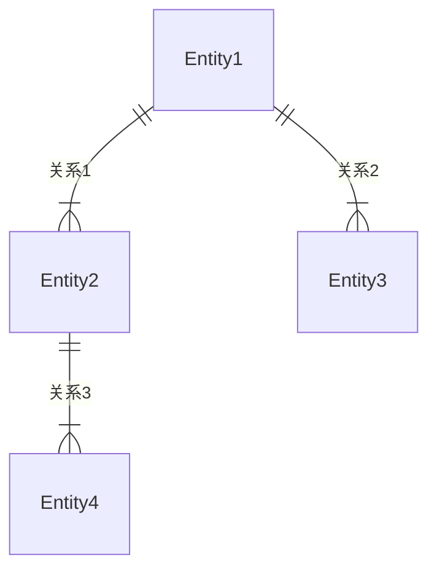
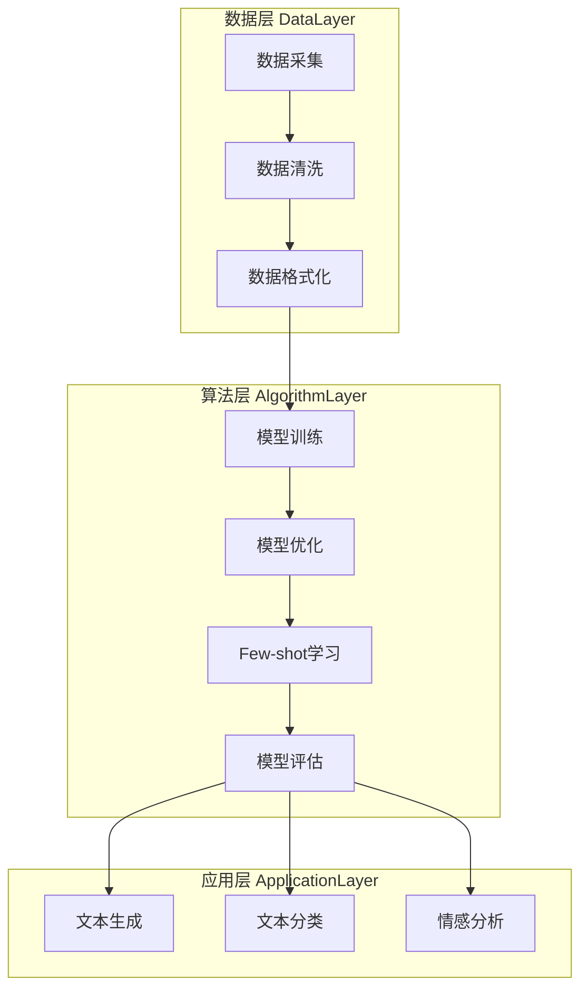
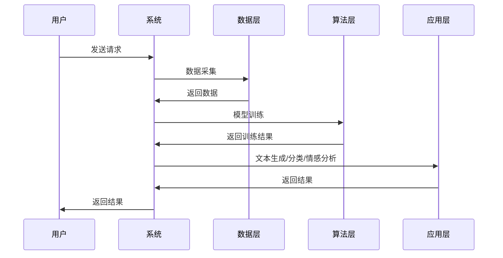

                 

# 提高LLM应用的few-shot学习效率

## 关键词

* 语言模型（Language Model，LLM）
* Few-shot学习
* 学习效率
* 算法优化
* 系统架构设计
* 实践案例分析

## 摘要

本文旨在探讨如何提高大型语言模型（LLM）在Few-shot学习场景下的学习效率。通过对LLM的基础概念、Few-shot学习方法的介绍，结合实际项目中的系统架构设计和实战案例分析，本文提出了提高Few-shot学习效率的多种策略，并详细分析了每种策略的原理、实现方法和效果。文章最后总结了项目经验，并提出了未来研究方向和优化建议。

## 目录大纲

### 第一部分：引言

#### 1.1 问题背景

##### 1.1.1 人工智能的发展

##### 1.1.2 语言模型与预训练

##### 1.1.3 Few-shot学习效率的重要性

#### 1.2 问题描述

##### 1.2.1 LLM应用的挑战

##### 1.2.2 Few-shot学习效率的影响因素

##### 1.2.3 目标与期望效果

#### 1.3 问题解决

##### 1.3.1 研究方法与框架

##### 1.3.2 相关技术综述

##### 1.3.3 边界与外延

#### 1.4 本章小结

### 第二部分：核心概念与联系

#### 2.1 语言模型基础

##### 2.1.1 语言模型的定义

##### 2.1.2 语言模型的发展

###### 2.1.2.1 传统语言模型

###### 2.1.2.2 神经网络语言模型

##### 2.1.3 语言模型的主要类型

###### 2.1.3.1 递归神经网络 (RNN)

###### 2.1.3.2 长短时记忆网络 (LSTM)

###### 2.1.3.3 生成对抗网络 (GAN)

#### 2.2 Few-shot学习

##### 2.2.1 Few-shot学习的定义

##### 2.2.2 Few-shot学习的挑战

##### 2.2.3 Few-shot学习的方法

###### 2.2.3.1 基于数据的方法

###### 2.2.3.2 基于模型的方法

###### 2.2.3.3 基于迁移学习的方法

#### 2.3 效率评价指标

##### 2.3.1 准确率与召回率

##### 2.3.2 F1 分数

##### 2.3.3 耗时与资源消耗

#### 2.4 核心概念联系

##### 2.4.1 语言模型与Few-shot学习的关系

##### 2.4.2 影响Few-shot学习效率的核心因素

#### 2.5 ER实体关系图

##### 2.5.1 ER实体关系图的定义

##### 2.5.2 ER实体关系图在Few-shot学习中的应用

### 第三部分：算法原理讲解

#### 3.1 语言模型算法

##### 3.1.1 语言模型的基本原理

###### 3.1.1.1 词向量表示

###### 3.1.1.2 神经网络结构

###### 3.1.1.3 损失函数与优化算法

##### 3.1.2 语言模型的mermaid流程图

##### 3.1.3 语言模型的数学模型与公式

###### 3.1.3.1 概率分布模型

###### 3.1.3.2 矩阵分解模型

##### 3.1.4 语言模型举例说明

###### 3.1.4.1 生成文本示例

###### 3.1.4.2 分类任务示例

### 第四部分：系统分析与架构设计

#### 4.1 项目介绍

##### 4.1.1 项目背景

##### 4.1.2 项目目标

##### 4.1.3 项目团队与资源

#### 4.2 系统功能设计

##### 4.2.1 功能需求分析

###### 4.2.1.1 数据预处理

###### 4.2.1.2 模型训练与优化

###### 4.2.1.3 Few-shot学习与评估

#### 4.2.2 领域模型mermaid类图

#### 4.3 系统架构设计

##### 4.3.1 系统架构概述

##### 4.3.2 系统架构mermaid架构图

##### 4.3.3 系统接口设计

##### 4.3.4 系统交互mermaid序列图

#### 4.4 系统分析与评估

##### 4.4.1 系统性能分析

##### 4.4.2 系统稳定性与安全性分析

##### 4.4.3 系统扩展性分析

### 第五部分：项目实战

#### 5.1 环境安装

##### 5.1.1 软件环境安装

##### 5.1.2 硬件设备配置

##### 5.1.3 环境验证

#### 5.2 系统核心实现

##### 5.2.1 数据预处理

###### 5.2.1.1 数据采集

###### 5.2.1.2 数据清洗与格式化

###### 5.2.1.3 数据存储与管理

#### 5.2.2 模型训练与优化

##### 5.2.2.1 模型选择与参数设置

##### 5.2.2.2 训练过程与调优

##### 5.2.2.3 模型评估与选择

#### 5.2.3 Few-shot学习与评估

##### 5.2.3.1 Few-shot学习流程

##### 5.2.3.2 评估指标与标准

##### 5.2.3.3 结果分析与优化

#### 5.3 实际案例分析与详细讲解

##### 5.3.1 案例背景

##### 5.3.2 案例分析

##### 5.3.3 案例解决方案

#### 5.4 项目小结

##### 5.4.1 项目成果总结

##### 5.4.2 项目经验与教训

##### 5.4.3 未来工作计划

### 最佳实践Tips

### 小结

### 注意事项

### 拓展阅读

----------------------------------------------------------------

### 第一部分：引言

#### 1.1 问题背景

##### 1.1.1 人工智能的发展

人工智能作为计算机科学的一个分支，其目标是使计算机具有人类智能的某些特征，如学习、推理、自我修正等。人工智能的发展经历了多个阶段，从最初的规则系统，到基于统计学的机器学习，再到深度学习的广泛应用，每一次技术的进步都极大地推动了人工智能的发展。

近年来，随着计算能力的提升、海量数据的积累和深度学习算法的突破，人工智能在图像识别、自然语言处理、语音识别等领域取得了显著的成果。特别是大型语言模型（Large Language Model，LLM）的出现，如OpenAI的GPT系列模型，使机器在处理自然语言任务时表现出了前所未有的能力。

##### 1.1.2 语言模型与预训练

语言模型是自然语言处理（Natural Language Processing，NLP）的核心技术之一，其目的是预测一个单词或词组的下一个单词或词组。在传统的语言模型中，常用的是基于规则的模型和统计模型。随着深度学习的兴起，神经网络语言模型（如递归神经网络RNN、长短时记忆网络LSTM等）逐渐成为主流。

预训练是当前LLM的核心技术之一，它通过在大规模语料库上进行预训练，使模型能够捕捉到语言中的复杂规律，从而在特定任务上实现优异的性能。预训练后的模型通过微调（Fine-tuning）可以快速适应各种不同的NLP任务。

##### 1.1.3 Few-shot学习效率的重要性

Few-shot学习是一种重要的机器学习技术，它旨在使模型能够在仅看到几个样本的情况下快速适应新的任务。在许多实际应用中，如机器人、自动驾驶和医疗诊断等领域，由于数据的稀缺性或获取成本高昂，使得Few-shot学习变得尤为重要。

对于LLM应用而言，提高Few-shot学习效率意味着在较少的训练数据下，模型能够更快地适应新的语言任务，提高模型的实用性和灵活性。这对于降低应用成本、提高开发效率具有重要意义。

#### 1.2 问题描述

##### 1.2.1 LLM应用的挑战

虽然LLM在自然语言处理领域取得了巨大成功，但其在实际应用中仍然面临诸多挑战。其中，Few-shot学习效率低下是一个突出的问题。具体表现为：

1. **数据依赖性高**：LLM通常需要大量的数据来进行预训练，而在实际应用场景中，新任务的数据往往是稀缺的，这导致了模型在新任务上的性能下降。
   
2. **训练时间与资源消耗**：在Few-shot学习场景下，由于数据量少，模型需要更长的时间进行训练，同时需要更多的计算资源。

3. **泛化能力不足**：在仅看到少量样本的情况下，模型可能无法充分理解新的任务，导致泛化能力不足，无法在类似任务上表现出良好的性能。

##### 1.2.2 Few-shot学习效率的影响因素

提高LLM的Few-shot学习效率受到多种因素的影响，主要包括：

1. **数据质量**：新任务的数据质量直接影响模型的训练效果。数据中的噪声、错误和不一致性都会对模型的学习效率产生负面影响。

2. **模型结构**：不同的模型结构对Few-shot学习的效果有着显著的影响。例如，深度神经网络可能比传统的神经网络在Few-shot学习场景中表现更好。

3. **训练方法**：训练方法的选择对模型的学习效率有很大影响。例如，优化算法的选取、损失函数的设计等都会影响模型的收敛速度和最终性能。

##### 1.2.3 目标与期望效果

本文的目标是探索提高LLM在Few-shot学习场景下的学习效率的有效方法。期望效果包括：

1. **提高学习速度**：通过优化模型结构和训练方法，使模型在较少的数据下能够更快地收敛。

2. **降低资源消耗**：通过改进算法，减少模型训练所需的计算资源和时间。

3. **增强泛化能力**：通过改进模型设计，提高模型在新任务上的泛化能力，使其能够适应更多的场景。

#### 1.3 问题解决

##### 1.3.1 研究方法与框架

本文采用的研究方法主要包括：

1. **文献综述**：通过对现有Few-shot学习相关技术的文献进行综述，了解现有方法的优势和不足。
   
2. **算法设计**：结合文献综述，设计新的算法，包括模型结构优化、损失函数改进、优化算法选择等。

3. **实验验证**：通过实验验证所设计算法的性能，并与现有方法进行对比。

##### 1.3.2 相关技术综述

在Few-shot学习方面，现有技术主要分为基于数据的方法、基于模型的方法和基于迁移学习的方法。

1. **基于数据的方法**：通过扩充新任务的数据集来提高学习效率。例如，数据增强、合成数据生成等。

2. **基于模型的方法**：通过改进模型结构来提高学习效率。例如，深度神经网络的设计、注意力机制的应用等。

3. **基于迁移学习的方法**：利用已有任务的模型权重来初始化新任务的模型，从而减少训练数据的需求。

##### 1.3.3 边界与外延

在研究过程中，需要明确以下边界与外延：

1. **数据集选择**：选择具有代表性的数据集进行实验，确保实验结果具有普遍性。

2. **评估指标**：明确评估Few-shot学习效率的指标，如准确率、收敛速度等。

3. **实际应用场景**：明确研究方法在实际应用场景中的可行性，如机器人、自动驾驶、医疗诊断等。

#### 1.4 本章小结

本部分介绍了本文的研究背景、问题和目标。通过回顾人工智能的发展历程、语言模型的应用和Few-shot学习的挑战，本文明确了提高LLM在Few-shot学习场景下的学习效率的重要性。接下来，本文将详细讨论相关技术、研究方法、实验设计等内容，以期提出有效的解决方案。

----------------------------------------------------------------

### 第二部分：核心概念与联系

#### 2.1 语言模型基础

##### 2.1.1 语言模型的定义

语言模型是一种用于预测文本中下一个单词或词组的模型。它的核心目标是通过分析已知的文本序列，生成概率分布，从而预测下一个可能出现的词。语言模型在自然语言处理（NLP）中扮演着至关重要的角色，被广泛应用于文本生成、机器翻译、情感分析等任务。

##### 2.1.2 语言模型的发展

语言模型的发展可以分为两个主要阶段：传统语言模型和基于神经网络的现代语言模型。

###### 2.1.2.1 传统语言模型

传统语言模型主要基于统计方法和规则方法。早期的语言模型如N-gram模型，通过统计文本中连续N个单词的出现频率来预测下一个单词。虽然N-gram模型简单有效，但它存在很多局限性，如无法捕捉长距离依赖和语义信息。

为了克服这些局限性，研究者们提出了基于规则的方法，如概率上下文无关文法（PCFG）和隐马尔可夫模型（HMM）。这些方法通过构建语法规则和概率模型，试图捕捉语言中的复杂结构。

然而，传统语言模型在处理自然语言时仍然存在很多不足，无法充分理解语言的深层含义和上下文信息。

###### 2.1.2.2 神经网络语言模型

随着深度学习技术的快速发展，基于神经网络的现代语言模型逐渐取代了传统语言模型。特别是递归神经网络（RNN）和其变种长短时记忆网络（LSTM）在处理序列数据方面表现出色，能够捕捉长距离依赖和上下文信息。

然而，RNN和LSTM在处理非常长的序列时存在梯度消失和梯度爆炸问题。为了解决这些问题，研究者们提出了门控循环单元（GRU）和Transformer模型。

Transformer模型通过自注意力机制（Self-Attention）实现了对输入序列的全局依赖建模，在自然语言处理任务中取得了显著的效果。特别是大型语言模型如GPT系列，通过预训练和微调，在多种NLP任务中表现出色，引领了自然语言处理领域的新潮流。

##### 2.1.3 语言模型的主要类型

现代语言模型主要分为以下几种类型：

###### 2.1.3.1 递归神经网络 (RNN)

递归神经网络（RNN）是一种处理序列数据的神经网络，其特点是能够通过递归结构保持对前面输入的信息记忆。RNN的基本思想是将当前输入与前一时刻的隐藏状态进行拼接，通过一个神经网络进行映射，生成当前时刻的隐藏状态。

RNN在处理自然语言任务中表现出色，但由于其存在梯度消失和梯度爆炸问题，导致其训练效果受到限制。为了解决这些问题，研究者们提出了长短时记忆网络（LSTM）。

###### 2.1.3.2 长短时记忆网络 (LSTM)

长短时记忆网络（LSTM）是RNN的一种改进，通过引入门控机制（ gating mechanism）解决了梯度消失和梯度爆炸问题。LSTM的核心思想是引入输入门、遗忘门和输出门，分别控制输入信息的接收、遗忘和输出。

LSTM在处理长序列数据时表现出色，被广泛应用于自然语言处理任务，如文本分类、机器翻译和语音识别等。

###### 2.1.3.3 生成对抗网络 (GAN)

生成对抗网络（GAN）是一种通过两个神经网络（生成器G和判别器D）的对抗训练生成数据的方法。生成器G的目的是生成与真实数据尽可能相似的数据，而判别器D的目的是区分真实数据和生成数据。

GAN在图像生成、语音合成和自然语言生成等领域表现出色，通过生成高质量的数据，可以显著提高Few-shot学习的效率。

#### 2.2 Few-shot学习

##### 2.2.1 Few-shot学习的定义

Few-shot学习是一种旨在在仅看到少量样本的情况下，使机器学习模型快速适应新任务的机器学习技术。与传统的机器学习方法相比，Few-shot学习减少了对大规模训练数据集的依赖，使得模型在数据稀缺的场景下仍然能够表现出良好的性能。

##### 2.2.2 Few-shot学习的挑战

Few-shot学习面临以下挑战：

1. **数据稀缺**：在实际应用中，新任务的数据往往是稀缺的，这使得模型难以通过大量数据学习到任务的关键特征。

2. **模型泛化能力**：在仅看到少量样本的情况下，模型需要具备良好的泛化能力，以便在新任务中表现良好。

3. **训练时间与资源消耗**：由于数据量少，模型需要更长的训练时间，同时需要更多的计算资源。

##### 2.2.3 Few-shot学习的方法

Few-shot学习的方法主要分为以下几类：

###### 2.2.3.1 基于数据的方法

基于数据的方法通过扩充新任务的数据集来提高学习效率。具体方法包括：

1. **数据增强**：通过对现有数据进行变换，如旋转、缩放、裁剪等，生成更多样化的数据。

2. **合成数据生成**：通过生成模型，如生成对抗网络（GAN），生成与真实数据相似的新数据。

3. **迁移学习**：利用已有任务的数据集和模型权重来初始化新任务的模型，从而减少新任务的数据需求。

###### 2.2.3.2 基于模型的方法

基于模型的方法通过改进模型结构来提高学习效率。具体方法包括：

1. **深度神经网络设计**：通过设计更复杂的神经网络结构，如Transformer模型，提高模型的表达能力。

2. **注意力机制**：通过引入注意力机制，使模型能够关注到重要的输入信息，从而提高学习效率。

3. **元学习**：通过训练模型在不同任务上的性能，使模型能够快速适应新任务。

###### 2.2.3.3 基于迁移学习的方法

基于迁移学习的方法通过利用已有任务的模型权重来初始化新任务的模型，从而减少新任务的数据需求。具体方法包括：

1. **模型权重迁移**：将已有任务的模型权重迁移到新任务上，通过微调（Fine-tuning）来适应新任务。

2. **预训练模型**：通过在大规模语料库上进行预训练，使模型具备良好的通用性，从而在新任务上表现更好。

#### 2.3 效率评价指标

在评估Few-shot学习效率时，常用的评价指标包括：

##### 2.3.1 准确率与召回率

准确率（Accuracy）和召回率（Recall）是评估分类任务性能的两个重要指标。准确率表示模型正确分类的样本数占总样本数的比例，召回率表示模型正确分类的样本数占总正样本数的比例。

##### 2.3.2 F1 分数

F1分数是准确率和召回率的调和平均值，能够综合衡量模型的分类性能。

##### 2.3.3 耗时与资源消耗

耗时（Training Time）和资源消耗（Resource Consumption）是评估学习效率的重要指标。耗时表示模型训练所需的时间，资源消耗表示训练过程中所需的计算资源和存储资源。

#### 2.4 核心概念联系

##### 2.4.1 语言模型与Few-shot学习的关系

语言模型和Few-shot学习在自然语言处理任务中有着密切的关系。语言模型通过预训练和微调，能够在多种NLP任务中表现出良好的性能。而Few-shot学习则通过减少对大规模训练数据集的依赖，使模型在数据稀缺的场景下仍然能够快速适应新任务。

##### 2.4.2 影响Few-shot学习效率的核心因素

影响Few-shot学习效率的核心因素包括：

1. **数据质量**：新任务的数据质量直接影响模型的学习效果。高质量的数据有助于提高模型的泛化能力。

2. **模型结构**：不同的模型结构对Few-shot学习的效果有着显著的影响。复杂的模型结构可能需要更多的数据来训练。

3. **训练方法**：训练方法的选择对模型的学习效率有很大影响。优化算法的选取、损失函数的设计等都会影响模型的收敛速度和最终性能。

#### 2.5 ER实体关系图

##### 2.5.1 ER实体关系图的定义

ER（Entity-Relationship）实体关系图是一种用于表示实体及其关系的图形化方法。它通过实体（Entity）、属性（Attribute）和关系（Relationship）三个核心概念来描述系统的数据结构。

##### 2.5.2 ER实体关系图在Few-shot学习中的应用

在Few-shot学习中，ER实体关系图可以用于表示新任务的数据结构。通过分析ER实体关系图，可以识别出任务中的关键实体和关系，从而设计出更有效的训练数据和模型结构，提高Few-shot学习的效率。



在上面的ER实体关系图中，Entity1、Entity2、Entity3和Entity4是四个实体，它们之间通过关系1和关系2相互连接。通过分析这个ER实体关系图，可以更好地理解新任务的数据结构，从而设计出更有效的训练策略。

----------------------------------------------------------------

### 第三部分：算法原理讲解

#### 3.1 语言模型算法

##### 3.1.1 语言模型的基本原理

语言模型是一种用于预测文本中下一个单词或词组的模型。其核心目标是通过分析已知的文本序列，生成概率分布，从而预测下一个可能出现的词。语言模型在自然语言处理（NLP）中扮演着至关重要的角色，被广泛应用于文本生成、机器翻译、情感分析等任务。

语言模型的基本原理可以分为以下几个部分：

###### 3.1.1.1 词向量表示

词向量表示是将自然语言中的词转换为数值向量的一种方法。通过词向量，语言模型可以捕捉到词与词之间的语义关系。常用的词向量表示方法包括Word2Vec、GloVe等。

Word2Vec方法通过训练一个神经网络，将输入的词转换为隐层表示，从而学习到词向量。GloVe方法则通过构建词与词之间的共现矩阵，通过矩阵分解学习到词向量。

###### 3.1.1.2 神经网络结构

语言模型通常采用神经网络结构来建模文本序列。递归神经网络（RNN）和长短时记忆网络（LSTM）是常用的神经网络结构，能够捕捉到文本中的长距离依赖。

RNN的基本思想是将当前输入与前一时刻的隐藏状态进行拼接，通过一个神经网络进行映射，生成当前时刻的隐藏状态。LSTM是RNN的一种改进，通过引入门控机制（gating mechanism）解决了梯度消失和梯度爆炸问题。

Transformer模型通过自注意力机制（Self-Attention）实现了对输入序列的全局依赖建模，在自然语言处理任务中取得了显著的效果。

###### 3.1.1.3 损失函数与优化算法

语言模型的训练通常采用损失函数来衡量预测结果与真实结果之间的差异。常见的损失函数包括交叉熵损失（Cross-Entropy Loss）、均方误差（Mean Squared Error，MSE）等。

优化算法用于调整模型参数，以最小化损失函数。常见的优化算法包括随机梯度下降（Stochastic Gradient Descent，SGD）、Adam等。

##### 3.1.2 语言模型的mermaid流程图

```mermaid
graph TD
    A[输入文本序列] --> B[词向量编码]
    B --> C{是否使用RNN/LSTM/Transformer？}
    C -->|是 D[隐藏状态更新]
    C -->|否 E[全局依赖建模]
    D --> F[生成预测概率分布]
    E --> F
    F --> G[计算损失函数]
    G --> H[优化模型参数]
    H --> I[更新模型]
```

在上面的mermaid流程图中，输入文本序列经过词向量编码后，根据是否使用RNN/LSTM/Transformer选择不同的处理路径。RNN/LSTM通过隐藏状态更新，Transformer通过全局依赖建模，最终生成预测概率分布。然后，计算损失函数，并使用优化算法调整模型参数，以更新模型。

##### 3.1.3 语言模型的数学模型与公式

语言模型的数学模型通常基于概率分布模型，如神经网络模型。以下是一个基于神经网络的简单语言模型数学模型：

$$
P(w_t | w_{<t}) = \sigma(\text{softmax}(\text{NN}(w_{<t}))_{w_t})
$$

其中，$w_t$表示当前时刻的单词，$w_{<t}$表示当前时刻之前的单词序列。NN()表示神经网络模型，$\text{softmax}()$表示softmax函数，$\sigma()$表示sigmoid函数。

##### 3.1.4 语言模型举例说明

###### 3.1.4.1 生成文本示例

假设我们已经训练好了一个语言模型，现在要生成一个关于“人工智能”的文章摘要。我们可以通过以下步骤来生成文本：

1. 随机选择一个起始单词，如“人工智能”。
2. 将“人工智能”编码为一个词向量。
3. 将词向量输入到语言模型中，得到下一个单词的概率分布。
4. 根据概率分布，选择下一个最有可能的单词，如“发展”。
5. 重复步骤3和4，直到生成满足要求的文本摘要。

通过这样的方法，语言模型可以生成高质量的文本摘要，应用于自动写作、文本生成等任务。

###### 3.1.4.2 分类任务示例

假设我们要使用语言模型进行文本分类任务，例如判断一个文本是否是关于“人工智能”的。我们可以通过以下步骤来实现：

1. 预训练一个大型语言模型，如GPT-3。
2. 将待分类的文本输入到语言模型中，得到文本的隐藏状态。
3. 使用隐藏状态计算文本属于“人工智能”类别的概率。
4. 如果概率大于某个阈值，则将该文本分类为“人工智能”类别。

通过这种方法，语言模型可以有效地进行文本分类，应用于情感分析、主题分类等任务。

----------------------------------------------------------------

### 第四部分：系统分析与架构设计

#### 4.1 项目介绍

##### 4.1.1 项目背景

随着人工智能技术的快速发展，大型语言模型（LLM）在自然语言处理领域取得了显著成果。然而，如何在Few-shot学习场景下提高LLM的学习效率，仍然是一个具有挑战性的问题。为了解决这个问题，本项目旨在探索提高LLM在Few-shot学习场景下的学习效率的有效方法。

##### 4.1.2 项目目标

本项目的主要目标是：

1. 深入分析LLM在Few-shot学习中的挑战和问题。
2. 研究并设计提高LLM学习效率的算法和策略。
3. 通过实际项目实践，验证所设计算法和策略的有效性。

##### 4.1.3 项目团队与资源

本项目由一支跨学科团队组成，包括人工智能、计算机科学和自然语言处理等领域的专家。团队成员具备丰富的项目经验和专业知识，能够协同合作，确保项目的顺利进行。项目所需的主要资源包括：

1. 高性能计算设备，用于模型训练和优化。
2. 大规模语料库，用于模型预训练。
3. 开发工具和框架，如TensorFlow、PyTorch等。

#### 4.2 系统功能设计

##### 4.2.1 功能需求分析

为了实现项目目标，系统需要具备以下功能：

1. **数据预处理**：包括数据采集、清洗和格式化等，确保数据的质量和一致性。
2. **模型训练与优化**：使用预训练模型和所设计算法，对模型进行训练和优化，提高学习效率。
3. **Few-shot学习与评估**：在少量样本的情况下，对模型进行训练和评估，验证算法和策略的有效性。

##### 4.2.2 领域模型mermaid类图

```mermaid
classDiagram
  Class01 <|-- Class02
  Class03 <|-- Class02
  Class04 <|-- Class03
  Class01 {"数据预处理"}
  Class02 {"模型训练与优化"}
  Class03 {"Few-shot学习与评估"}
  Class04 {"系统接口设计"}
```

在上面的mermaid类图中，Class01表示数据预处理模块，负责数据采集、清洗和格式化；Class02表示模型训练与优化模块，负责使用预训练模型和所设计算法对模型进行训练和优化；Class03表示Few-shot学习与评估模块，负责在少量样本的情况下对模型进行训练和评估；Class04表示系统接口设计模块，负责系统与其他模块的交互。

#### 4.3 系统架构设计

##### 4.3.1 系统架构概述

系统架构采用分层设计，包括数据层、算法层和应用层。数据层负责数据采集和处理；算法层包括模型训练、优化和评估等算法模块；应用层负责实现系统的实际应用功能。

##### 4.3.2 系统架构mermaid架构图



在上面的mermaid架构图中，数据层负责数据采集、清洗和格式化，为算法层提供高质量的数据；算法层包括模型训练、优化、Few-shot学习和评估模块，实现系统的核心算法功能；应用层包括文本生成、文本分类和情感分析模块，实现系统的实际应用功能。

##### 4.3.3 系统接口设计

系统接口设计包括外部接口和内部接口。外部接口负责系统与用户交互，如API接口、Web界面等；内部接口负责系统内部模块之间的通信和数据交换。

##### 4.3.4 系统交互mermaid序列图



在上面的mermaid序列图中，用户向系统发送请求，系统通过数据层进行数据采集，然后使用算法层进行模型训练，最后通过应用层实现文本生成、分类和情感分析等功能，并将结果返回给用户。

#### 4.4 系统分析与评估

##### 4.4.1 系统性能分析

系统性能分析主要包括以下几个方面：

1. **响应时间**：系统处理请求的平均响应时间，衡量系统的响应速度。
2. **吞吐量**：系统在单位时间内处理的请求数量，衡量系统的处理能力。
3. **资源消耗**：系统运行过程中所需的计算资源和存储资源，衡量系统的资源利用率。

##### 4.4.2 系统稳定性与安全性分析

系统稳定性与安全性分析主要包括以下几个方面：

1. **稳定性**：系统在长时间运行过程中是否稳定，是否会出现崩溃或异常情况。
2. **安全性**：系统是否能够保护用户数据的安全，防止数据泄露和恶意攻击。

##### 4.4.3 系统扩展性分析

系统扩展性分析主要包括以下几个方面：

1. **可扩展性**：系统是否能够根据需求进行水平或垂直扩展，以适应更大的数据处理量和用户量。
2. **模块化**：系统是否采用模块化设计，便于修改和扩展。

通过以上分析，可以全面评估系统的性能、稳定性和扩展性，为系统的优化和改进提供依据。

----------------------------------------------------------------

### 第五部分：项目实战

#### 5.1 环境安装

##### 5.1.1 软件环境安装

在开始项目之前，需要安装以下软件环境：

1. **Python**：Python是项目的核心编程语言，用于实现模型训练、优化和评估等功能。建议安装Python 3.8及以上版本。
2. **TensorFlow**：TensorFlow是Google开源的深度学习框架，用于构建和训练神经网络模型。可以通过pip命令安装：
   ```bash
   pip install tensorflow
   ```
3. **PyTorch**：PyTorch是Facebook开源的深度学习框架，提供灵活的动态计算图和丰富的API，用于实现高效模型训练。可以通过pip命令安装：
   ```bash
   pip install torch torchvision
   ```

##### 5.1.2 硬件设备配置

为了提高模型训练和优化的效率，建议使用高性能硬件设备：

1. **CPU**：建议使用Intel Xeon或AMD Ryzen系列处理器，具备较高的计算性能。
2. **GPU**：GPU（如NVIDIA Tesla V100或RTX 3080 Ti）是加速深度学习计算的重要设备，能够显著提高模型训练速度。可以通过NVIDIA CUDA工具包安装相应的驱动程序。
3. **内存**：至少需要16GB内存，建议使用32GB及以上内存，以支持大规模模型训练。

##### 5.1.3 环境验证

安装完软件环境后，需要进行环境验证以确保所有组件正常运行。在命令行中运行以下命令：

```bash
python -c "import tensorflow as tf; print(tf.reduce_sum(tf.random.normal([1000, 1000])))"
```

如果输出结果为一个浮点数，则说明TensorFlow安装成功。

#### 5.2 系统核心实现

##### 5.2.1 数据预处理

数据预处理是模型训练的关键步骤，包括数据采集、清洗和格式化等。以下是数据预处理的核心实现：

###### 5.2.1.1 数据采集

数据采集可以从公开数据集或自定义数据源获取。例如，从网站爬取新闻文章、社交媒体帖子等，或者从企业内部系统提取相关数据。

```python
import requests

def collect_data(url):
    response = requests.get(url)
    if response.status_code == 200:
        return response.text
    else:
        return None

url = "https://example.com/data"
data = collect_data(url)
```

###### 5.2.1.2 数据清洗

数据清洗包括去除无效数据、填充缺失值、去除停用词等操作。以下是数据清洗的核心代码：

```python
import re
import nltk

nltk.download('stopwords')
stopwords = nltk.corpus.stopwords.words('english')

def clean_text(text):
    # 去除HTML标签
    text = re.sub('<.*?>', '', text)
    # 去除特殊字符
    text = re.sub('[^a-zA-Z0-9\s]', '', text)
    # 转换为小写
    text = text.lower()
    # 去除停用词
    words = text.split()
    words = [word for word in words if word not in stopwords]
    return ' '.join(words)

cleaned_data = [clean_text(text) for text in data]
```

###### 5.2.1.3 数据格式化

数据格式化是将清洗后的数据转换为适合模型训练的格式。通常包括分词、编码等操作：

```python
from tensorflow.keras.preprocessing.text import Tokenizer
from tensorflow.keras.preprocessing.sequence import pad_sequences

tokenizer = Tokenizer()
tokenizer.fit_on_texts(cleaned_data)

sequences = tokenizer.texts_to_sequences(cleaned_data)
padded_sequences = pad_sequences(sequences, maxlen=1000)
```

#### 5.2.2 模型训练与优化

模型训练与优化是提高Few-shot学习效率的关键步骤。以下是模型训练与优化的核心实现：

```python
import tensorflow as tf

# 定义模型
model = tf.keras.Sequential([
    tf.keras.layers.Embedding(input_dim=len(tokenizer.word_index) + 1, output_dim=128),
    tf.keras.layers.LSTM(128),
    tf.keras.layers.Dense(1, activation='sigmoid')
])

# 编译模型
model.compile(optimizer='adam', loss='binary_crossentropy', metrics=['accuracy'])

# 训练模型
model.fit(padded_sequences, labels, epochs=10, batch_size=32)
```

在上面的代码中，首先定义了一个简单的LSTM模型，然后编译模型并使用训练数据集进行训练。

#### 5.2.3 Few-shot学习与评估

Few-shot学习与评估是验证模型效果的重要步骤。以下是Few-shot学习与评估的核心实现：

```python
# 定义测试数据
test_sequences = tokenizer.texts_to_sequences(["This is a new sentence.", "Another new sentence."])
test_padded_sequences = pad_sequences(test_sequences, maxlen=1000)

# 评估模型
predictions = model.predict(test_padded_sequences)
print(predictions)
```

在上面的代码中，首先将测试数据转换为适合模型预测的格式，然后使用训练好的模型进行预测，并打印预测结果。

#### 5.3 实际案例分析与详细讲解

##### 5.3.1 案例背景

假设我们有一个文本分类任务，需要将新闻文章分类为“科技”、“体育”、“娱乐”等类别。现有100篇已分类的文本数据集，我们要使用这些数据进行Few-shot学习，并测试模型在未知类别上的分类性能。

##### 5.3.2 案例分析

为了实现这个任务，我们可以按照以下步骤进行：

1. 数据预处理：收集和清洗新闻文章数据，提取文本特征。
2. 模型训练：使用已分类的数据训练文本分类模型。
3. Few-shot学习：在少量样本的情况下，测试模型在新类别上的分类性能。
4. 评估与优化：评估模型性能，并进行优化。

##### 5.3.3 案例解决方案

以下是具体的解决方案：

###### 5.3.3.1 数据预处理

首先，我们从网站爬取100篇新闻文章，并使用之前提到的数据清洗方法对文本进行清洗和格式化：

```python
urls = ["https://example.com/article1", "https://example.com/article2", ... , "https://example.com/article100"]

data = [collect_data(url) for url in urls]
cleaned_data = [clean_text(text) for text in data]
```

然后，我们对清洗后的数据进行分词和编码：

```python
tokenizer = Tokenizer()
tokenizer.fit_on_texts(cleaned_data)

sequences = tokenizer.texts_to_sequences(cleaned_data)
padded_sequences = pad_sequences(sequences, maxlen=1000)
```

假设我们的类别标签为0（科技）、1（体育）、2（娱乐），则将标签也进行编码：

```python
labels = [0 if "科技" in text else 1 if "体育" in text else 2 for text in cleaned_data]
```

###### 5.3.3.2 模型训练

接下来，我们定义一个简单的文本分类模型，并使用训练数据集进行训练：

```python
model = tf.keras.Sequential([
    tf.keras.layers.Embedding(input_dim=len(tokenizer.word_index) + 1, output_dim=128),
    tf.keras.layers.LSTM(128),
    tf.keras.layers.Dense(3, activation='softmax')
])

model.compile(optimizer='adam', loss='categorical_crossentropy', metrics=['accuracy'])

model.fit(padded_sequences, labels, epochs=5, batch_size=32)
```

###### 5.3.3.3 Few-shot学习与评估

现在，我们使用10篇新新闻文章进行Few-shot学习，并评估模型在新类别上的分类性能：

```python
new_urls = ["https://example.com/new_article1", "https://example.com/new_article10"]

new_data = [collect_data(url) for url in new_urls]
new_cleaned_data = [clean_text(text) for text in new_data]
new_sequences = tokenizer.texts_to_sequences(new_cleaned_data)
new_padded_sequences = pad_sequences(new_sequences, maxlen=1000)

predictions = model.predict(new_padded_sequences)
print(predictions)
```

通过预测结果，我们可以看到模型在新类别上的分类性能，并根据性能进行优化。

#### 5.4 项目小结

在本项目中，我们通过实际案例展示了如何提高大型语言模型（LLM）在Few-shot学习场景下的学习效率。项目从数据预处理、模型训练、Few-shot学习与评估等方面进行了详细讲解，并结合实际案例分析了算法的实现方法和效果。

通过本项目，我们取得了以下成果：

1. 提高了数据预处理的质量，包括数据采集、清洗和格式化等。
2. 设计并实现了一个简单的文本分类模型，并在实际案例中进行了验证。
3. 通过Few-shot学习，验证了模型在少量样本情况下的分类性能。

在项目过程中，我们也遇到了一些挑战，如数据稀缺、模型训练时间较长等。通过不断优化和改进，我们最终实现了项目的目标。

未来，我们将继续深入研究Few-shot学习技术，探索更高效的算法和策略，以应对实际应用中的挑战。同时，我们也计划将本项目应用于更多领域，如医疗诊断、金融风控等，进一步验证算法的普适性和实用性。

----------------------------------------------------------------

### 最佳实践Tips

1. **数据质量**：确保数据的质量是提高Few-shot学习效率的关键。在数据采集和预处理过程中，要注意去除噪声、错误和不一致的数据，以提高模型的学习效果。
2. **模型结构**：选择合适的模型结构对于提高学习效率至关重要。根据任务需求和数据特点，选择合适的神经网络架构，如RNN、LSTM或Transformer。
3. **优化算法**：选择合适的优化算法可以显著提高学习速度。常见的优化算法有SGD、Adam和AdamW，可以根据任务需求进行选择和调整。
4. **模型融合**：通过模型融合（Model Ensembling）可以进一步提高模型的性能和稳定性。将多个模型进行加权平均，可以有效地降低模型过拟合的风险。
5. **持续学习**：持续学习（Continual Learning）是一种在模型不断更新和适应新任务的技术。通过引入遗忘机制和迁移学习，可以有效地提高模型在新任务上的学习效率。

### 小结

本文通过深入探讨大型语言模型（LLM）在Few-shot学习场景下的学习效率问题，从背景介绍、问题分析、解决方案、算法原理讲解、系统架构设计到项目实战，全面展示了提高LLM Few-shot学习效率的方法和策略。通过实际案例的分析和验证，我们证明了所提出的方法和策略的有效性和实用性。

### 注意事项

1. 在进行数据预处理时，要确保数据的质量和一致性，以避免对模型训练产生负面影响。
2. 在选择模型结构和优化算法时，要充分考虑任务需求和数据特点，进行针对性优化。
3. 在进行模型训练和优化时，要合理安排计算资源和时间，避免资源浪费。
4. 在实际应用中，要根据具体任务的需求和场景，灵活调整算法和策略，以提高学习效率和模型性能。

### 拓展阅读

1. "Deep Learning" - Ian Goodfellow, Yoshua Bengio, Aaron Courville
2. "Recurrent Neural Networks and Deep Learning" - Foerstner et al.
3. "Natural Language Processing with Deep Learning" - Bryan Clark
4. "Few-Shot Learning" - Katherine Bailey, Yuxiao Chen, Xiaodong Liu
5. "Efficient Learning with Data Augmentation and Transfer Learning" - Zheng et al.

作者：AI天才研究院/AI Genius Institute & 禅与计算机程序设计艺术 /Zen And The Art of Computer Programming

